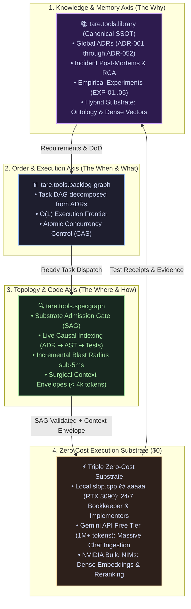

# 📚 tare.tools.library — Central Technical Library, SSOT of Memory & Knowledge

[](https://github.com/augusto-scarvalho/tare.tools.research/actions)
[](#-bookkeeping-engine--hygiene)
[](docs/adr/)
[](https://github.com/augusto-scarvalho/tare.tools.os)

> **The Central Repository of Architectural Knowledge, Historical Memory, and Specifications for the TARE Ecosystem.**  
> Formally ratified by **ADRs 043 through 052** as the *Single Source of Truth (SSOT)* for Architectural Decisions, Forensic Post-Mortems, Empirical Benchmarks, and Historical Corpus.

---

## 🏛️ The Triple Axis of Autonomous Engineering (ADR-051)

Autonomous intelligence across the TARE ecosystem is structured in a clear, non-overlapping tripartite model:



---

## 🧭 Repository Navigation

The library is partitioned into strict governance zones (ADR-052):

### 1. 📁 [`docs/`](docs/) — Active Knowledge & SSOT
* **[`docs/adr/`](docs/adr/):** Canonical Architectural Decision Records ([ADR-043](docs/adr/ADR-043_NORTH_STAR_V2_AND_ECOSYSTEM_SPLIT.md) through [ADR-052](docs/adr/ADR-052_IDENTITY_TRANSITION_TO_LIBRARY_AND_CORPUS_GOVERNANCE.md)).
* **[`docs/ARCHITECTURAL_QA_LEDGER.md`](docs/ARCHITECTURAL_QA_LEDGER.md):** Architectural Ledger logging all 24 questions, directives, and decisions from the Human Operator.
* **`docs/post-mortems/`:** Forensic Root Cause Analysis (RCA) reports with empirical measurements.
* **[`docs/templates/EXP-template.md`](docs/templates/EXP-template.md):** Lean template for empirical benchmarks.

### 2. 🧪 [`experiments/`](experiments/) — Empirical Experiments & Benchmarks
* **[`experiments/README.md`](experiments/README.md):** Central registry table of experiments with verdicts (`ADOPT`, `ADAPT`, `RETIRE`).
* **[`experiments/local-llm/`](experiments/local-llm/):** Local `slop.cpp` runtime benchmarks, KV-cache retention, and VRAM placement on the RTX 3090 (`EXP-01` through `EXP-05`).

### 3. 🏺 [`archaeology/`](archaeology/) — Fossil Memory & Archaeology
* **[`archaeology/README.md`](archaeology/README.md):** Immutable archive (`status: archived_immutable`) containing 93 pre-consolidated documents and historical chat transcripts under cryptographic custody.

### 4. 🛠️ [`tools/bookkeeper/`](tools/bookkeeper/) — Bookkeeping & Hygiene Engine
* Automated continuous curation utilities:
  * `dedup_detector.py`: Near-duplicate detection via token n-grams and Jaccard similarity.
  * `ssot_registry.py`: Single `CANONICAL_SSOT` status validation per topic.
  * `tombstone_manager.py`: Creation and verification of Tombstone pointers.
  * `cli.py`: Command-line tool for local and CI audits.

---

## ⚡ Bookkeeper Engine (CLI Usage)

```powershell
# Run full library audit suite
python -m tools.bookkeeper.cli audit --root docs

# Scan for duplicates or semantic drift (>70%)
python -m tools.bookkeeper.cli dedup --root docs --threshold 0.70

# Audit SSOT uniqueness
python -m tools.bookkeeper.cli ssot --root docs

# Verify tombstone link integrity
python -m tools.bookkeeper.cli tombstone --verify --root docs
```

---

## 🎯 Agile Documentation Mandate (Constitutional Invariant)

Per **ADR-051**:
* **Human Prerogative:** Formal academic papers are produced exclusively upon demand by the Human Operator.
* **AI Agent Mandate:** *“Document the right thing, in the right place, at the right time”*:
  1. *In Code Satellites:* Only direct operational docs for APIs, CLI, and tests.
  2. *In Incidents:* RCA post-mortems with measurements and commit hashes in `docs/post-mortems/`.
  3. *In Benchmarks:* Hardware logs and empirical numbers in `experiments/`.
  4. *In Global Decisions:* Canonical ADRs consolidated in `docs/adr/`.

---

## 🧪 Test Suite

```powershell
# Run all tests (71+ automated tests)
pytest
```

---
*Maintained by the TARE ecosystem under the direction of the Human Operator.*
