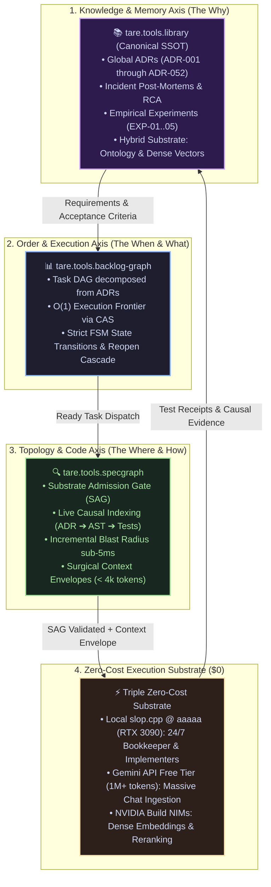

<div align="center">

# tare.tools.library

**The Central Technical Library & Canonical SSOT of Architectural Knowledge, Empirical Benchmarks, System Memory, and Historical Archaeology across the TARE 2.0 Ecosystem.**

[](LICENSE)
[](https://python.org)
[](https://github.com/augusto-scarvalho/tare.tools.library/actions)
[](#formal-verification--quality-gates)
[](#the-bookkeeper--memory-hygiene-engine)
[](docs/adr/)

<p align="center">
  <a href="#what-is-taretoolslibrary">What is tare.tools.library</a> •
  <a href="#the-triple-axis-of-agentic-engineering">Triple Axis (ADR-051)</a> •
  <a href="#the-hybrid-knowledge-substrate">Hybrid Substrate</a> •
  <a href="#zero-cost-execution-substrate">Zero-Cost Substrate</a> •
  <a href="#the-bookkeeper--memory-hygiene-engine">Bookkeeper Engine</a> •
  <a href="#repository-navigation">Repository Map</a> •
  <a href="#the-agile-documentation-mandate">Agile Mandate</a> •
  <a href="#formal-verification--quality-gates">Quality Gates</a> •
  <a href="#ecosystem-family">Ecosystem Family</a> •
  <a href="#license">License</a>
</p>

<p align="center">
  <em>🇧🇷 Para a versão em Português, consulte <a href="README.pt-BR.md">README.pt-BR.md</a>.</em>
</p>

</div>

---

## What is tare.tools.library?

`tare.tools.library` is the single canonical knowledge repository and long-term memory store powering the `tare.tools` agent operating system.

Rather than fragmenting architecture decisions across transient chat sessions, unversioned wiki pages, or ephemeral code comments, `tare.tools.library` establishes a deterministic **Single Source of Truth (SSOT)** for:
1. **Architectural Decisions (ADRs):** Fully deliberated, cryptographically attested North Star records ([ADR-001 through ADR-052](docs/adr/)).
2. **Forensic Post-Mortems & RCAs:** Incident root-cause analyses with empirical measurements, commit hashes, and causal remediation plans.
3. **Empirical Benchmarks & Experiments:** Objective hardware benchmarks, LLM quantization tests, and runtime evaluations ([`experiments/`](experiments/)).
4. **Architectural Q&A Ledger:** A complete, living audit trail of strategic human operator inquiries and formal consensus verdicts ([`docs/ARCHITECTURAL_QA_LEDGER.md`](docs/ARCHITECTURAL_QA_LEDGER.md)).
5. **Immutable Historical Archaeology:** A 93-document pre-consolidated fossil corpus preserved under strict cryptographic custody ([`archaeology/`](archaeology/)).

---

## The Triple Axis of Agentic Engineering

Governed by **[ADR-051](docs/adr/ADR-051_RESEARCH_TRIPLE_AXIS_AND_BOOKKEEPING_GOVERNANCE.md)**, autonomous intelligence across the TARE ecosystem is structured into three non-overlapping axes:



---

## The Hybrid Knowledge Substrate

To support unstructured technical narrative, structured architecture rules, and executable code ASTs without semantic loss:

```
                  ┌─────────────────────────────────────────────────────────┐
                  │              HYBRID KNOWLEDGE SUBSTRATE                 │
                  └─────────────────────────────────────────────────────────┘
                                   │                       │
           ┌───────────────────────┴───────────┐   ┌───────┴────────────────────────┐
           ▼                                   ▼   ▼                                ▼
┌─────────────────────┐   ┌─────────────────────────────┐   ┌─────────────────────────────┐
│  Layer 1: Dense     │   │  Layer 2: Domain Ontology   │   │  Layer 3: Causal AST Graph  │
│  Vector Embeddings  │   │  & Conceptual Graph         │   │  (SpecGraph Integration)    │
├─────────────────────┤   ├─────────────────────────────┤   ├─────────────────────────────┤
│ Free-form text,     │   │ Core concepts (Isolation,   │   │ Direct AST node linking     │
│ raw transcripts,    │   │ Concurrency, Sandboxing)    │   │ to specifications, pytest   │
│ semantic search RAG │   │ and semantic relations      │   │ markers, and git commits    │
└─────────────────────┘   └─────────────────────────────┘   └─────────────────────────────┘
```

---

## Zero-Cost Execution Substrate ($0)

Continuous knowledge curation, deduplication, summarization, and embedding generation operate completely cost-free across three subsidized and local tiers:
* **Local Substrate (`slop.cpp` @ `aaaaa` / RTX 3090 24GB):** Executes 24/7 background bookkeeping, offline drift calculation, and unit test execution.
* **Google Gemini API (Free Tier — 1M+ tokens):** Ingests and digests massive chat logs, meeting transcripts, and large technical documents.
* **NVIDIA Build API (NIMs Free Quota):** Generates high-fidelity dense vector embeddings and semantic reranking.

---

## The Bookkeeper & Memory Hygiene Engine

The repository includes a standalone automated bookkeeping suite in `tools/bookkeeper/`:

```powershell
# Run full library audit suite (SSOT compliance + Tombstone health + Dedup)
python -m tools.bookkeeper.cli audit --root docs

# Scan for duplicate documents or semantic drift (>70% overlap)
python -m tools.bookkeeper.cli dedup --root docs --threshold 0.70

# Enforce strict single CANONICAL_SSOT status per topic
python -m tools.bookkeeper.cli ssot --root docs

# Verify that all Tombstone redirect pointers resolve to valid files
python -m tools.bookkeeper.cli tombstone --verify --root docs
```

---

## Repository Navigation

Governed by **[ADR-052](docs/adr/ADR-052_IDENTITY_TRANSITION_TO_LIBRARY_AND_CORPUS_GOVERNANCE.md)**, the library is partitioned into strict governance zones:

```text
tare.tools.library/
├── docs/                                # Active Technical Knowledge & Living SSOT
│   ├── adr/                             # Canonical ADRs (ADR-001 through ADR-052)
│   ├── ARCHITECTURAL_QA_LEDGER.md       # Master Ledger of Human Operator Directives
│   ├── post-mortems/                    # Forensic Root-Cause Analysis (RCA) Reports
│   └── templates/                       # Standard Templates (EXP-template.md)
├── experiments/                         # Empirical Benchmarks & Hardware Trials
│   ├── README.md                        # Master Registry Table (EXP-01..05)
│   └── local-llm/                       # slop.cpp, KV-Cache & VRAM Placement Trials
├── archaeology/                         # Immutable Historical Memory (status: archived_immutable)
│   ├── README.md                        # Custody Manifest & Commit Anchors
│   ├── chats/                           # Historical Session Transcripts
│   └── architectural-evolution/         # Early Prototype Transition Logs
├── corpus/                              # 93 Pre-Consolidated Exact Snapshot Documents
├── tools/                               # Automation Primitives
│   └── bookkeeper/                      # Deduplication, SSOT Registry & Tombstone Engine
└── tests/                               # Test Suites (71/71 Passing Green)
```

---

## The Agile Documentation Mandate

Ratified as a **Constitutional Invariant** in ADR-051:
* **Human Prerogative:** Formal academic papers and research articles are produced exclusively upon demand by the Human Operator.
* **AI Agent Mandate:** *“Document the right thing, in the right place, at the right time”*:
  1. *In Code Repositories:* Concise, actionable operational docs for APIs, CLI commands, and test suites.
  2. *In System Incidents:* Thorough RCA post-mortems with measurements, commit hashes, and causal remediation in `docs/post-mortems/`.
  3. *In Benchmarks:* Raw hardware logs and verified empirical numbers in `experiments/`.
  4. *In Global Architectural Decisions:* Attested, canonical ADRs in `docs/adr/`.

---

## Formal Verification & Quality Gates

The test suite validates both repository integrity and automated bookkeeping mechanisms:

```powershell
# Run full automated test suite (71 passing tests)
pytest
```

---

## Ecosystem Family

`tare.tools.library` operates as a core federated satellite within the `tare.tools` agent operating system:

| Repository | Role | Primary Specification |
| :--- | :--- | :--- |
| **`tare.tools.os`** | Orchestrator, Swarm Coordinator & Multi-Seat Round Table | [ADR-049](docs/adr/ADR-049_REPO_FEDERATION_AND_ANTI_DRIFT_GOVERNANCE.md) |
| **`tare.tools.kernel`** | 5-Plane Decoupled Microkernel Runtime | [ADR-045](docs/adr/ADR-045_ECOSYSTEM_AND_KERNEL_NORTH_STAR.md) |
| **`tare.tools.specgraph`** | Universal SDD Causal Traceability Matrix & Blast Radius | [ADR-044](docs/adr/ADR-044_SPECGRAPH_NORTH_STAR_UNIVERSAL_PROJECT_INTELLIGENCE.md) |
| **`tare.tools.backlog-graph`** | Mathematical DAG Task Engine with CAS Concurrency | [ADR-046](docs/adr/ADR-046_BACKLOG_GRAPH_NORTH_STAR.md) |
| **`tare.tools.dialog-engine`** | Schema-Agnostic Dialog Fuzzer & Protocol Engine | [ADR-047](docs/adr/ADR-047_DIALOG_ENGINE_NORTH_STAR.md) |
| **`tare.tools.library`** | Canonical SSOT Technical Library, Memory & Experiments | [ADR-051](docs/adr/ADR-051_RESEARCH_TRIPLE_AXIS_AND_BOOKKEEPING_GOVERNANCE.md) / [ADR-052](docs/adr/ADR-052_IDENTITY_TRANSITION_TO_LIBRARY_AND_CORPUS_GOVERNANCE.md) |

---

## License

Licensed under the **Apache License, Version 2.0**. See the [LICENSE](LICENSE) file for details.
