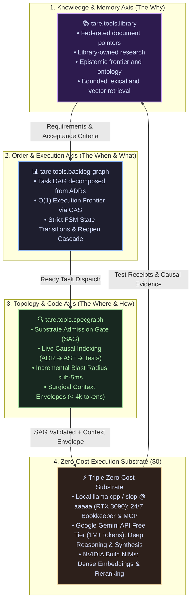
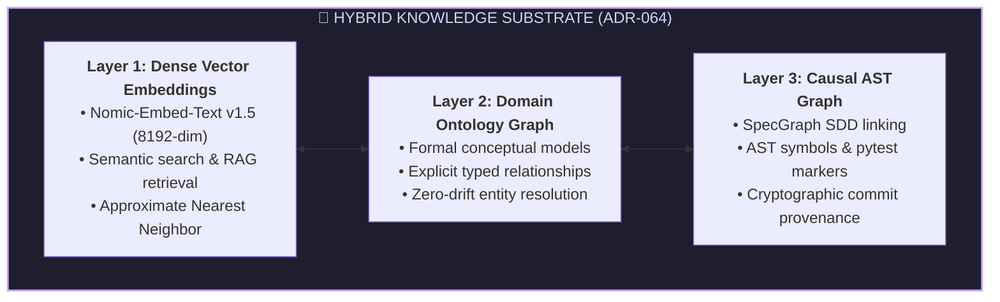

<div align="center">

# tare.tools.library

**The federated catalog, Library-owned research corpus and bounded retrieval layer for the TARE 2.0 ecosystem.**

[](LICENSE)
[](https://python.org)
[](https://github.com/augusto-scarvalho/tare.tools.library/actions)
[](#formal-verification--quality-gates)
[-purple.svg)](cases/)
[](docs/adr/ADR-069_FEDERATED_DOCUMENT_OWNERSHIP_AND_BOUNDED_INDEXING.md)
[](tests/test_frugality_guard.py)

<p align="center">
  <a href="#what-is-taretoolslibrary">What is tare.tools.library</a> •
  <a href="#the-triple-axis-of-agentic-engineering">Triple Axis (ADR-051)</a> •
  <a href="#the-hybrid-knowledge-substrate">Hybrid Substrate</a> •
  <a href="#zero-cost-execution-substrate">Zero-Cost Substrate</a> •
  <a href="#the-bookkeeper--memory-hygiene-engine">Bookkeeper Engine</a> •
  <a href="#repository-navigation">Repository Map</a> •
  <a href="#the-agile-documentation-mandate">Agile Mandate</a> •
  <a href="#formal-verification--quality-gates">Quality Gates</a> •
  <a href="#ecosystem-family">Ecosystem Family</a> •
  <a href="CHANGELOG.md">Changelog</a> •
  <a href="#license">License</a>
</p>

<p align="center">
  <em>🇧🇷 Para a versão em Português, consulte <a href="README.pt-BR.md">README.pt-BR.md</a>.</em>
</p>

</div>

---

## What is tare.tools.library?

`tare.tools.library` catalogs the ecosystem without mirroring every repository.
Each editable document lives with the tool that owns it; the Library records
its repository, path, commit and SHA-256 in
[`catalog/FEDERATED_DOCUMENTS.json`](catalog/FEDERATED_DOCUMENTS.json).

The Library itself owns:

1. **Research curation and publication policy** under [`docs/`](docs/).
2. **Epistemic frontier and ontology data** under [`catalog/`](catalog/).
3. **Library tooling and its own specification** under [`tools/`](tools/) and [`specs/`](specs/).
4. **Immutable historical editions**, excluded from normal retrieval, under
   [`docs/archive/`](docs/archive/) and [`catalog/corpus/`](catalog/corpus/).

See [ADR-069](docs/adr/ADR-069_FEDERATED_DOCUMENT_OWNERSHIP_AND_BOUNDED_INDEXING.md)
and the [ownership guide](docs/DOCUMENT_OWNERSHIP.md).

---

## The Triple Axis of Agentic Engineering

Under the federated ownership rule in **[ADR-069](docs/adr/ADR-069_FEDERATED_DOCUMENT_OWNERSHIP_AND_BOUNDED_INDEXING.md)**, the three axes exchange references rather than copied payloads:



---

## The Hybrid Knowledge Substrate

To support unstructured technical narrative, structured architecture rules, and executable code ASTs without semantic loss:



---

## Zero-Cost Execution Substrate ($0)

Continuous knowledge curation, deduplication, summarization, and embedding generation operate completely cost-free across three subsidized and local tiers:
* **Local Substrate (`llama.cpp` / `nomic-embed-text` @ node `aaaaa` / RTX 3090 24GB):** Executes 24/7 background bookkeeping, local vector embeddings, and automated test suites.
* **Google Gemini API (Free Tier — 1M+ tokens):** Ingests and synthesizes massive technical documents, deliberações de governança, and multi-model consensus.
* **NVIDIA Build API (NIMs Free Quota):** High-speed supplementary inference and semantic reranking.

---

## The Bookkeeper & Memory Hygiene Engine

The repository includes a standalone automated bookkeeping suite in `tools/bookkeeper/`:

```powershell
# Run full library audit suite (SSOT compliance + Tombstone health + Dedup)
python -m tools.bookkeeper.cli audit --root docs

# Scan for duplicate documents or semantic drift (>70% overlap)
python -m tools.bookkeeper.cli dedup --root docs --threshold 0.70

# Enforce strict single CANONICAL_SSOT status per topic
python -m tools.bookkeeper.cli ssot --root docs

# Verify that all Tombstone redirect pointers resolve to valid files
python -m tools.bookkeeper.cli tombstone --verify --root docs
```

---

## Repository Navigation

Governed by **[ADR-069](docs/adr/ADR-069_FEDERATED_DOCUMENT_OWNERSHIP_AND_BOUNDED_INDEXING.md)**, the Library separates active payloads, pointers and opt-in history:

```text
tare.tools.library/
├── .github/                             # CI/CD Workflows & Integrity Gates
├── cases/                               # Library research/editorial case records
├── catalog/                             # Federated pointers, frontier & ontology
│   ├── FEDERATED_DOCUMENTS.json         # External owner paths, commits and hashes
│   ├── corpus/                          # Immutable history (opt-in retrieval)
│   ├── frontier/                        # Epistemic Frontier Radar & Research Pointers
│   ├── ontology/                        # Domain Ontology (YAML)
│   └── schemas/                         # JSON Schemas
├── docs/                                # Active Library-owned documentation
│   ├── adr/                             # Decisions governing the Library
│   ├── architecture/                    # High-Level Architecture & Plane Topologies
│   ├── assurance/                       # Quality Gates & Verification Topologies
│   ├── guides/                          # Developer & Operator Guides
│   ├── policies/                        # Standard Governance Policies
│   ├── references/                      # Baseline References & Crosswalks
│   ├── research/                        # 20 Research Program Portfolios
│   └── archive/                         # Curated Historical Archive
├── site/                                # GitHub Pages Authority & Signal Profile
├── specs/                               # The Library's own specification
├── tests/                               # Automated verification tests and falsifiers
└── tools/                               # Mesh Runtime, Local Inference, MCP & Bookkeeper
```

---

## The Agile Documentation Mandate

Ratified as a **Constitutional Invariant** in ADR-051:
* **Human Prerogative:** Formal academic papers and research articles are produced exclusively upon demand by the Human Operator.
* **AI Agent Mandate:** *“Document the right thing, in the right place, at the right time”*:
  1. *In each code repository:* that tool's specifications, architecture and operations.
  2. *In `tare.tools.os`:* ecosystem-wide governance, authority and settlement.
  3. *In this Library:* research curation, ontology, publication and Library tooling.
  4. *In the federated catalog:* immutable pointers to external owner documents.

---

## Formal Verification & Quality Gates

The test suite validates repository taxonomy, frugality ceilings, and automated bookkeeping mechanisms:

```powershell
# Run the full automated test suite
pytest
```

---

## Ecosystem Family

`tare.tools.library` operates as a core federated satellite within the `tare.tools` agent operating system:

| Repository | Role | Primary Specification |
| :--- | :--- | :--- |
| **`tare.tools.os`** | Ecosystem orchestration, authority and settlement | [repository](https://github.com/augusto-scarvalho/tare.tools.os) |
| **`tare.tools.kernel`** | 5-plane microkernel runtime | [repository](https://github.com/augusto-scarvalho/tare.tools.kernel) |
| **`tare.tools.specgraph`** | Causal traceability and impact analysis | [repository](https://github.com/augusto-scarvalho/tare.tools.specgraph) |
| **`tare.tools.backlog-graph`** | Deterministic task DAG | [repository](https://github.com/augusto-scarvalho/tare.tools.backlog-graph) |
| **`tare.tools.dialog-engine`** | Dialogue protocol engine | [repository](https://github.com/augusto-scarvalho/tare.tools.dialog-engine) |
| **`tare.tools.library`** | Federated catalog and Library-owned research | [ADR-069](docs/adr/ADR-069_FEDERATED_DOCUMENT_OWNERSHIP_AND_BOUNDED_INDEXING.md) |

---

## License

Licensed under the **Apache License, Version 2.0**. See the [LICENSE](LICENSE) file for details.
