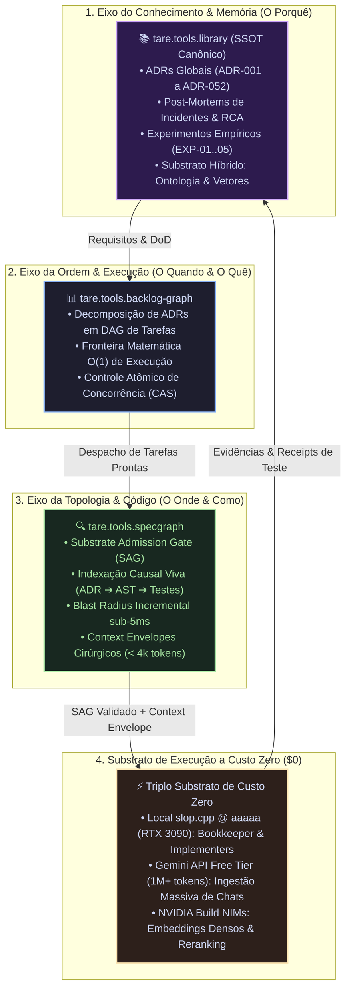

# 📚 tare.tools.library — Biblioteca Técnica Central, SSOT de Memória & Conhecimento

[](https://github.com/augusto-scarvalho/tare.tools.research/actions)
[](#-motor-de-bookkeeping--higiene-documental)
[](docs/adr/)
[](https://github.com/augusto-scarvalho/tare.tools.os)

> **O Repositório Central de Conhecimento, Memória Histórica e Arquitetura do Ecossistema TARE.**  
> Ratificado formalmente pelas **ADRs 043 a 052** como o *Single Source of Truth (SSOT)* para Decisões Arquiteturais, Post-Mortems Forenses, Benchmarks Empíricos e Acervo Histórico.

---

## 🏛️ O Eixo Triplo da Engenharia Agêntica (ADR-051)

No ecossistema TARE, a inteligência autônoma é estruturada em uma tríade de responsabilidade clara e sem sobreposição:



---

## 🧭 Mapa de Navegação do Acervo

A biblioteca é particionada em zonas de governança estritas (ADR-052):

### 1. 📁 [`docs/`](docs/) — Conhecimento Ativo & SSOT
* **[`docs/adr/`](docs/adr/):** Catálogo canônico de Architectural Decision Records ([ADR-043](docs/adr/ADR-043_NORTH_STAR_V2_AND_ECOSYSTEM_SPLIT.md) a [ADR-052](docs/adr/ADR-052_IDENTITY_TRANSITION_TO_LIBRARY_AND_CORPUS_GOVERNANCE.md)).
* **[`docs/ARCHITECTURAL_QA_LEDGER.md`](docs/ARCHITECTURAL_QA_LEDGER.md):** Diário Mestre de Sessões com todas as 24 perguntas, formulações e decisões estratégicas do Operador Humano.
* **`docs/post-mortems/`:** Relatórios forenses de análise de causa raiz (RCA) com medições e hashes.
* **[`docs/templates/EXP-template.md`](docs/templates/EXP-template.md):** Template oficial enxuto para experimentos e benchmarks.

### 2. 🧪 [`experiments/`](experiments/) — Ensaios Empíricos & Benchmarks
* **[`experiments/README.md`](experiments/README.md):** Tabela central de registro de experimentos com vereditos (`ADOPT`, `ADAPT`, `RETIRE`).
* **[`experiments/local-llm/`](experiments/local-llm/):** Ensaios de runtime local `slop.cpp`, KV-cache retention e placement na RTX 3090 (`EXP-01` a `EXP-05`).

### 3. 🏺 [`archaeology/`](archaeology/) — Memória Fóssil & Arqueologia
* **[`archaeology/README.md`](archaeology/README.md):** Acervo imutável (`status: archived_immutable`) contendo 93 documentos consolidados e transcrições de chat históricas protegidas por cadeia de custódia criptográfica.

### 4. 🛠️ [`tools/bookkeeper/`](tools/bookkeeper/) — Motor de Bookkeeping & Higiene
* Utilitários automatizados de curadoria contínua:
  * `dedup_detector.py`: Detecção de quase-duplicatas por n-gramas e similaridade Jaccard.
  * `ssot_registry.py`: Auditoria de unicidade de status `CANONICAL_SSOT` por tópico.
  * `tombstone_manager.py`: Criação e validação de marcadores Tombstone.
  * `cli.py`: Linha de comando para auditoria no CI.

---

## ⚡ Motor de Bookkeeping (Uso do CLI)

O Bookkeeper pode ser executado localmente ou integrado a pipelines de CI:

```powershell
# Executar a suíte completa de auditoria da biblioteca
python -m tools.bookkeeper.cli audit --root docs

# Varrer por documentos duplicados ou com desvio semântico (>70%)
python -m tools.bookkeeper.cli dedup --root docs --threshold 0.70

# Auditar unicidade e conformidade de SSOT
python -m tools.bookkeeper.cli ssot --root docs

# Verificar integridade de ponteiros Tombstone
python -m tools.bookkeeper.cli tombstone --verify --root docs
```

---

## 🎯 O Mandato Documental Ágil (Invariante Constitucional)

Conforme a **ADR-051**:
* **Prerrogativa Humana:** Artigos científicos e papers acadêmicos formais são produzidos sob demanda exclusiva do Operador Humano.
* **Mandato dos Agentes de IA:** *“Documentar a coisa certa, no lugar certo, na hora certa”*:
  1. *Nos Satélites de Código:* Apenas documentação operacional direta de APIs, CLI e testes.
  2. *Nos Incidentes:* Relatórios de RCA com medições e hashes em `docs/post-mortems/`.
  3. *Nos Benchmarks:* Logs de hardware e dados empíricos em `experiments/`.
  4. *Nas Decisões Globais:* ADRs canônicas consolidadas em `docs/adr/`.

---

## 🧪 Suíte de Testes & Qualidade

```powershell
# Executar a suíte completa de testes (67+ testes automatizados)
pytest
```

---
*Mantido pelo ecossistema TARE sob direção do Operador Humano.*
