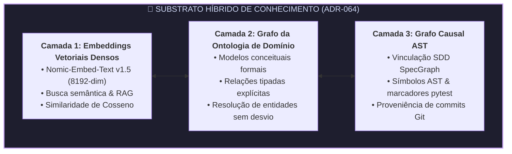

<div align="center">

# tare.tools.library

**A Biblioteca Técnica Central & SSOT Canônico de Conhecimento Arquitetural, Benchmarks Empíricos, Memória do Sistema e Evolução Epistêmica do Ecossistema TARE 2.0.**

[](LICENSE)
[](https://python.org)
[](https://github.com/augusto-scarvalho/tare.tools.library/actions)
[](#verificação-formal--portões-de-qualidade)
[-purple.svg)](cases/)
[](docs/adr/)
[](tests/test_frugality_guard.py)

<p align="center">
  <a href="#o-que-é-o-taretoolslibrary">O que é tare.tools.library</a> •
  <a href="#o-eixo-triplo-da-engenharia-agêntica">Eixo Triplo (ADR-051)</a> •
  <a href="#o-substrato-híbrido-de-conhecimento">Substrato Híbrido</a> •
  <a href="#substrato-de-execução-a-custo-zero">Substrato a Custo Zero</a> •
  <a href="#o-motor-de-bookkeeping--higiene-de-memória">Motor de Bookkeeping</a> •
  <a href="#mapa-de-navegação-do-acervo">Mapa do Acervo</a> •
  <a href="#o-mandato-documental-ágil">Mandato Ágil</a> •
  <a href="#verificação-formal--portões-de-qualidade">Portões de Qualidade</a> •
  <a href="#família-do-ecossistema">Família do Ecossistema</a> •
  <a href="CHANGELOG.md">Changelog</a> •
  <a href="#licença">Licença</a>
</p>

<p align="center">
  <em>🇺🇸 For the English canonical version, see <a href="README.md">README.md</a>.</em>
</p>

</div>

---

## O que é o tare.tools.library?

`tare.tools.library` é o repositório canônico de conhecimento e armazenamento de memória de longo prazo do sistema operacional agêntico `tare.tools`.

Em vez de fragmentar decisões arquiteturais em sessões de chat voláteis, páginas de wiki desatualizadas ou comentários de código dispersos, o `tare.tools.library` estabelece uma **Fonte Única da Verdade (SSOT)** determinística para:
1. **Decisões Arquiteturais (ADRs):** Registros canônicos das North Stars ([ADR-001 a ADR-067](docs/adr/)).
2. **Casos de Governança Tripartite (RFCs):** Deliberações com consenso bizantino entre modelos líderes (Google Gemini, OpenAI GPT, Anthropic Claude) em [`cases/`](cases/).
3. **Post-Mortems Forenses & RCAs:** Relatórios de causa raiz de incidentes com medições empíricas, hashes de commit e planos de remediação causal em [`docs/post-mortems/`](docs/post-mortems/).
4. **Fronteira Epistêmica de Pesquisa:** Radar de pesquisa contínuo, ponteiros e linhagens de evidência em [`catalog/frontier/`](catalog/frontier/).
5. **Ontologia de Domínio & Schemas:** Definições formais de entidades, contratos de capabilities e taxonomia em [`catalog/`](catalog/).
6. **Acervo Histórico Curado:** Referências canônicas de baseline, edições históricas e arquivos segregados em [`docs/archive/`](docs/archive/).

---

## O Eixo Triplo da Engenharia Agêntica

Governada pela **[ADR-051](docs/adr/ADR-051_RESEARCH_TRIPLE_AXIS_AND_BOOKKEEPING_GOVERNANCE.md)**, a inteligência autônoma no ecossistema TARE é estruturada em três eixos complementares:


---

## O Substrato Híbrido de Conhecimento

Para suportar narrativa técnica livre, regras arquiteturais formais e ASTs de código sem perda de significado:



---

## Substrato de Execução a Custo Zero ($0)

As rotinas de curadoria, deduplicação, resumos e embeddings operam sem custo financeiro em 3 camadas:
* **Substrato Local (`llama.cpp` / `nomic-embed-text` @ nó `aaaaa` / RTX 3090 24GB):** Execução 24/7 de Bookkeeper, cálculo de embeddings locais e suítes de testes automatizados.
* **Google Gemini API (Free Tier — 1M+ tokens):** Ingestão e síntese de documentos técnicos longos, deliberações de governança e consenso multi-modelo.
* **NVIDIA Build API (Cota NIMs Gratuita):** Inferência complementar de alta velocidade e reranking semântico.

---

## O Motor de Bookkeeping & Higiene de Memória

O repositório inclui a suíte de curadoria contínua em `tools/bookkeeper/`:

```powershell
# Executar a suíte completa de auditoria da biblioteca
python -m tools.bookkeeper.cli audit --root docs

# Varrer por documentos duplicados ou com desvio semântico (>70%)
python -m tools.bookkeeper.cli dedup --root docs --threshold 0.70

# Auditar unicidade estrita de status CANONICAL_SSOT
python -m tools.bookkeeper.cli ssot --root docs

# Verificar integridade de ponteiros Tombstone
python -m tools.bookkeeper.cli tombstone --verify --root docs
```

---

## Mapa de Navegação do Acervo

Governado pela **[ADR-067](docs/adr/ADR-067_CANONICAL_REPOSITORY_TAXONOMY_AND_GHOST_PURGE.md)** (RFC-008), o repositório segue um layout canônico estrito e sem diretórios fantasmas:

```text
tare.tools.library/
├── .github/                             # Workflows de CI/CD & Portões de Integridade
├── cases/                               # Casos Formais de Governança RFC (RFC-001..RFC-008)
├── catalog/                             # Catálogo Mestre, Capabilities, Corpus & Ontologia
│   ├── corpus/                          # Artefatos Canônicos Ingeridos & Manifestos
│   ├── frontier/                        # Radar da Fronteira Epistêmica & Ponteiros
│   ├── ontology/                        # Ontologia de Domínio (YAML)
│   └── schemas/                         # Schemas JSON
├── docs/                                # Documentação Técnica Canônica & SSOT Vivo
│   ├── adr/                             # ADRs Canônicas (ADR-001 a ADR-067)
│   ├── architecture/                    # Arquitetura de Alto Nível & Topologias de Planos
│   ├── assurance/                       # Portões de Qualidade & Topologias de Teste
│   ├── guides/                          # Guias de Desenvolvedor e Operador
│   ├── policies/                        # Políticas Padronizadas de Governança
│   ├── references/                      # Referências Canônicas de Baseline
│   ├── research/                        # 20 Portfólios de Programas de Pesquisa
│   └── archive/                         # Arquivo Histórico Curado
├── site/                                # Autoridade do GitHub Pages & Signal Profile
├── specs/                               # Requisitos de Sistema Formato EARS (SDD)
├── tests/                               # 158 Testes Automatizados & Falsificadores de CI
└── tools/                               # Runtime de Mesh, Inferência Local, MCP & Bookkeeper
```

---

## O Mandato Documental Ágil

Ratificado como **Invariante Constitucional** na ADR-051:
* **Prerrogativa Humana:** Artigos científicos e papers acadêmicos formais são produzidos sob demanda exclusiva do Operador Humano.
* **Mandato dos Agentes de IA:** *“Documentar a coisa certa, no lugar certo, na hora certa”*:
  1. *Nos Satélites de Código:* Apenas documentação operacional direta de APIs, CLI e testes.
  2. *Nos Incidentes:* Relatórios de RCA com medições e hashes em `docs/post-mortems/`.
  3. *Nas Decisões de Governança:* Casos RFC em `cases/` e ADRs canônicas em `docs/adr/`.
  4. *Nas Fronteiras Epistêmicas:* Ponteiros formais de pesquisa em `catalog/frontier/`.

---

## Verificação Formal & Portões de Qualidade

```powershell
# Executar suíte completa de testes (158 testes passando green)
pytest
```

---

## Família do Ecossistema

`tare.tools.library` opera como satélite federado fundamental do sistema operacional `tare.tools`:

| Repositório | Papel | Especificação Primária |
| :--- | :--- | :--- |
| **`tare.tools.os`** | Orquestrador, Coordenador de Swarm & Mesa Redonda | [ADR-049](docs/adr/ADR-049_REPO_FEDERATION_AND_ANTI_DRIFT_GOVERNANCE.md) |
| **`tare.tools.kernel`** | Microkernel Desacoplado em 5 Planos | [ADR-045](docs/adr/ADR-045_ECOSYSTEM_AND_KERNEL_NORTH_STAR.md) |
| **`tare.tools.specgraph`** | Matriz Causal Viva SDD & Motor de Blast Radius | [ADR-044](docs/adr/ADR-044_SPECGRAPH_NORTH_STAR_UNIVERSAL_PROJECT_INTELLIGENCE.md) |
| **`tare.tools.backlog-graph`** | Grafo Matemático de Tarefas (DAG) com CAS | [ADR-046](docs/adr/ADR-046_BACKLOG_GRAPH_NORTH_STAR.md) |
| **`tare.tools.dialog-engine`** | Motor de Protocolo & Fuzzer de Diálogo Agnóstico | [ADR-047](docs/adr/ADR-047_DIALOG_ENGINE_NORTH_STAR.md) |
| **`tare.tools.library`** | Biblioteca Técnica Central (SSOT), Memória & Evolução Epistêmica | [ADR-051](docs/adr/ADR-051_RESEARCH_TRIPLE_AXIS_AND_BOOKKEEPING_GOVERNANCE.md) / [ADR-067](docs/adr/ADR-067_CANONICAL_REPOSITORY_TAXONOMY_AND_GHOST_PURGE.md) |

---

## Licença

Licenciado sob a **Apache License, Versão 2.0**. Consulte o arquivo [LICENSE](LICENSE) para mais detalhes.
