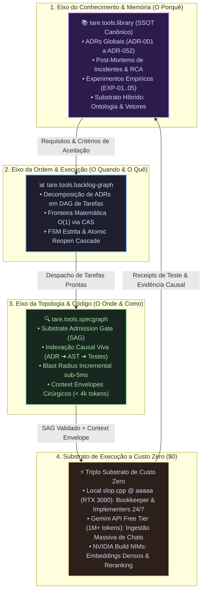

<div align="center">

# tare.tools.library

**A Biblioteca Técnica Central & SSOT Canônico de Conhecimento Arquitetural, Benchmarks Empíricos, Memória do Sistema e Arqueologia Histórica do Ecossistema TARE 2.0.**

[](LICENSE)
[](https://python.org)
[](https://github.com/augusto-scarvalho/tare.tools.library/actions)
[](#verificação-formal--portões-de-qualidade)
[](#o-motor-de-bookkeeping--higiene-de-memória)
[](docs/adr/)

<p align="center">
  <a href="#o-que-é-o-taretoolslibrary">O que é tare.tools.library</a> •
  <a href="#o-eixo-triplo-da-engenharia-agêntica">Eixo Triplo (ADR-051)</a> •
  <a href="#o-substrato-híbrido-de-conhecimento">Substrato Híbrido</a> •
  <a href="#substrato-de-execução-a-custo-zero">Substrato a Custo Zero</a> •
  <a href="#o-motor-de-bookkeeping--higiene-de-memória">Motor de Bookkeeping</a> •
  <a href="#mapa-de-navegação-do-acervo">Mapa do Acervo</a> •
  <a href="#o-mandato-documental-ágil">Mandato Ágil</a> •
  <a href="#verificação-formal--portões-de-qualidade">Portões de Qualidade</a> •
  <a href="#família-do-ecossistema">Família do Ecossistema</a> •
  <a href="#licença">Licença</a>
</p>

<p align="center">
  <em>🇺🇸 For the English canonical version, see <a href="README.md">README.md</a>.</em>
</p>

</div>

---

## O que é o tare.tools.library?

`tare.tools.library` é o repositório canônico de conhecimento e armazenamento de memória de longo prazo do sistema operacional agêntico `tare.tools`.

Em vez de fragmentar decisões arquiteturais em sessões de chat voláteis, páginas de wiki desatualizadas ou comentários de código dispersos, o `tare.tools.library` estabelece uma **Fonte Única da Verdade (SSOT)** determinística para:
1. **Decisões Arquiteturais (ADRs):** Registros canônicos das North Stars ([ADR-001 a ADR-052](docs/adr/)).
2. **Post-Mortems Forenses & RCAs:** Relatórios de causa raiz de incidentes com medições empíricas, hashes de commit e planos de remediação causal.
3. **Benchmarks Empíricos & Experimentos:** Testes objetivos de hardware, quantização de LLMs e avaliações de runtime ([`experiments/`](experiments/)).
4. **Diário Mestre de Decisões (Q&A Ledger):** Trilha viva e auditável de todas as diretrizes do Operador Humano e vereditos de consenso ([`docs/ARCHITECTURAL_QA_LEDGER.md`](docs/ARCHITECTURAL_QA_LEDGER.md)).
5. **Acervo Histórico Imutável:** Um corpus pré-consolidado de 93 documentos preservado sob estrita custódia criptográfica ([`archaeology/`](archaeology/)).

---

## O Eixo Triplo da Engenharia Agêntica

Governada pela **[ADR-051](docs/adr/ADR-051_RESEARCH_TRIPLE_AXIS_AND_BOOKKEEPING_GOVERNANCE.md)**, a inteligência autônoma no ecossistema TARE é estruturada em três eixos complementares:



---

## O Substrato Híbrido de Conhecimento

Para suportar narrativa técnica livre, regras arquiteturais formais e ASTs de código sem perda de significado:
* **Camada 1 (Embeddings Vetoriais Densos):** Indexa texto livre, notas e transcrições de chat para busca semântica e RAG.
* **Camada 2 (Ontologia de Domínio & Grafo Conceitual):** Mapeia conceitos universais (*Isolamento*, *Concorrência*, *Sandboxing*, *Token Diet*) e relações semânticas formais.
* **Camada 3 (Grafo Causal AST - SpecGraph):** Ancoragem exata de nós de especificação em símbolos de código, testes pytest e commits Git.

---

## Substrato de Execução a Custo Zero ($0)

As rotinas de curadoria, deduplicação, resumos e embeddings operam sem custo financeiro em 3 camadas:
* **Substrato Local (`slop.cpp` @ `aaaaa` / RTX 3090 24GB):** Execução 24/7 de Bookkeeper, cálculo de drift offline e suítes de testes.
* **Google Gemini API (Free Tier — 1M+ tokens):** Ingestão massiva de transcrições de chats e documentos longos.
* **NVIDIA Build API (Cota NIMs Gratuita):** Geração de embeddings vetoriais densos e reranking semântico.

---

## O Motor de Bookkeeping & Higiene de Memória

O repositório inclui a suíte de curadoria contínua em `tools/bookkeeper/`:

```powershell
# Executar a suíte completa de auditoria da biblioteca
python -m tools.bookkeeper.cli audit --root docs

# Varrer por documentos duplicados ou com desvio semântico (>70%)
python -m tools.bookkeeper.cli dedup --root docs --threshold 0.70

# Auditar unicidade estrita de status CANONICAL_SSOT
python -m tools.bookkeeper.cli ssot --root docs

# Verificar integridade de ponteiros Tombstone
python -m tools.bookkeeper.cli tombstone --verify --root docs
```

---

## Mapa de Navegação do Acervo

Governada pela **[ADR-052](docs/adr/ADR-052_IDENTITY_TRANSITION_TO_LIBRARY_AND_CORPUS_GOVERNANCE.md)**, a biblioteca é dividida em zonas claras de governança:

```text
tare.tools.library/
├── docs/                                # Conhecimento Ativo & SSOT Vivo
│   ├── adr/                             # ADRs Canônicas (ADR-001 a ADR-052)
│   ├── ARCHITECTURAL_QA_LEDGER.md       # Diário Mestre de Decisões do Operador
│   ├── post-mortems/                    # Relatórios Forenses de Causa Raiz (RCA)
│   └── templates/                       # Templates Padronizados (EXP-template.md)
├── experiments/                         # Benchmarks Empíricos & Ensaios de Hardware
│   ├── README.md                        # Tabela Central de Registro (EXP-01..05)
│   └── local-llm/                       # Ensaios de slop.cpp, KV-Cache & RTX 3090
├── archaeology/                         # Memória Fóssil Imutável (status: archived_immutable)
│   ├── README.md                        # Manifesto de Custódia & Âncoras de Commit
│   ├── chats/                           # Transcrições Históricas de Sessões
│   └── architectural-evolution/         # Logs de Transição do Protótipo
├── corpus/                              # 93 Documentos Pré-Consolidados do Snapshot
├── tools/                               # Primitivas de Automação
│   └── bookkeeper/                      # Motor de Deduplicação, SSOT & Tombstones
└── tests/                               # Suítes de Testes (71/71 Passando Green)
```

---

## O Mandato Documental Ágil

Ratificado como **Invariante Constitucional** na ADR-051:
* **Prerrogativa Humana:** Artigos científicos e papers acadêmicos formais são produzidos sob demanda exclusiva do Operador Humano.
* **Mandato dos Agentes de IA:** *“Documentar a coisa certa, no lugar certo, na hora certa”*:
  1. *Nos Satélites de Código:* Apenas documentação operacional direta de APIs, CLI e testes.
  2. *Nos Incidentes:* Relatórios de RCA com medições e hashes em `docs/post-mortems/`.
  3. *Nos Benchmarks:* Logs de hardware e dados empíricos em `experiments/`.
  4. *Nas Decisões Globais:* ADRs canônicas consolidadas em `docs/adr/`.

---

## Verificação Formal & Portões de Qualidade

```powershell
# Executar suíte completa de testes (71 testes passando green)
pytest
```

---

## Família do Ecossistema

`tare.tools.library` opera como satélite federado fundamental do sistema operacional `tare.tools`:

| Repositório | Papel | Especificação Primária |
| :--- | :--- | :--- |
| **`tare.tools.os`** | Orquestrador, Coordenador de Swarm & Mesa Redonda | [ADR-049](docs/adr/ADR-049_REPO_FEDERATION_AND_ANTI_DRIFT_GOVERNANCE.md) |
| **`tare.tools.kernel`** | Microkernel Desacoplado em 5 Planos | [ADR-045](docs/adr/ADR-045_ECOSYSTEM_AND_KERNEL_NORTH_STAR.md) |
| **`tare.tools.specgraph`** | Matriz Causal Viva SDD & Motor de Blast Radius | [ADR-044](docs/adr/ADR-044_SPECGRAPH_NORTH_STAR_UNIVERSAL_PROJECT_INTELLIGENCE.md) |
| **`tare.tools.backlog-graph`** | Grafo Matemático de Tarefas (DAG) com CAS | [ADR-046](docs/adr/ADR-046_BACKLOG_GRAPH_NORTH_STAR.md) |
| **`tare.tools.dialog-engine`** | Motor de Protocolo & Fuzzer de Diálogo Agnóstico | [ADR-047](docs/adr/ADR-047_DIALOG_ENGINE_NORTH_STAR.md) |
| **`tare.tools.library`** | Biblioteca Técnica Central (SSOT), Memória & Ensaios | [ADR-051](docs/adr/ADR-051_RESEARCH_TRIPLE_AXIS_AND_BOOKKEEPING_GOVERNANCE.md) / [ADR-052](docs/adr/ADR-052_IDENTITY_TRANSITION_TO_LIBRARY_AND_CORPUS_GOVERNANCE.md) |

---

## Licença

Licenciado sob a **Apache License, Versão 2.0**. Consulte o arquivo [LICENSE](LICENSE) para mais detalhes.
