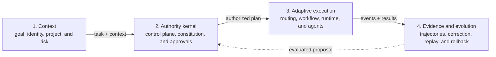
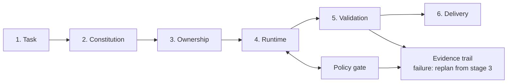
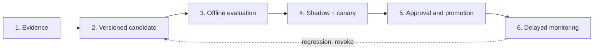
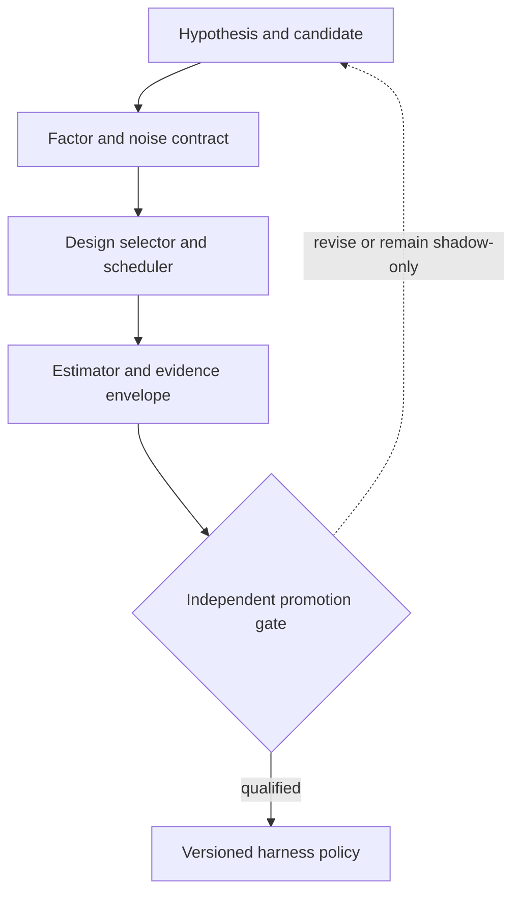

# Adaptive, Project-Oriented Multi-Agent Harness Architectures with Dynamic Routing, Self-Correction, and Governed Self-Evolution

**Manuscript type:** conceptual synthesis, multivocal review, and Design Science Research agenda  
**Version:** 1.6  
**Literature cutoff date:** July 17, 2026  
**Language:** English

---

## Abstract

Large language model agents have evolved from text generators into systems that plan, use tools, modify repositories, delegate tasks, and preserve state across long-running executions. Yet most research evaluates models, routers, workflows, memory, or multi-agent coordination in isolation, whereas deployed systems depend on their interaction. This article studies the **multi-agent harness** as an intermediate layer connecting models, agents, tools, repositories, and users while providing execution, instruction composition, routing, governance, observability, self-correction, and controlled evolution. Its central thesis is that project-specific adaptation and dynamic workflows can coexist with predictability when probabilistic intelligence operates inside a deterministically compiled and validated action space.

The paper integrates foundations from multi-agent systems, Belief–Desire–Intention architectures, workflow management, Petri nets, statecharts, input/output automata, autonomic computing, policy as code, temporal logic, provenance, distributed concurrency control, human–automation interaction, empirical software engineering, robust design, automatic configuration, and sequential experimentation. Evidence is synthesized from peer-reviewed research, recent preprints, standards, specifications, and vendor engineering reports, explicitly stratified by maturity. Recent work supports routing and workflow optimization but also shows that complex routers do not consistently outperform simple baselines, generated repository context can reduce performance while increasing cost, memory can propagate obsolete or erroneous experience, equal-budget single-agent systems can erase apparent multi-agent gains on some reasoning tasks, and additional agents help only when their failures are sufficiently diverse. We propose a reference architecture comprising a deterministic control plane, a project-adaptive plane, hierarchical causal and online routing, a typed workflow compiler, a durable runtime, provenance-aware memory with governed deletion, distinct self-correction and self-evolution loops, an agent trajectory protocol, and an **Experimental Design Controller (EDC)** that translates evolution hypotheses into randomized, blocked, robust, and independently confirmed experiments. The architecture adds **Context- and Concurrency-Aware Cross-Vendor Routing (C3VR)**: a context ledger separates unique logical information from cumulative provider-token exposure; capability-scoped delegation returns evidence deltas rather than raw trajectories; resource semantics determine when parallel work may converge, must be isolated, or requires leased ownership and fencing; and a three-lane evaluation separates normalized model effects, native agent-system effects, and governed hybrid deployment. It further introduces **Adaptive Human–Harness Interaction (AHHI)** and a **Deterministic Governed Input/Output Transition System (DGIOTS)**. AHHI treats interaction style as a task-, risk-, reversibility-, policy-, and evidence-conditioned profile rather than a permanent user persona; a single accountable façade is the default, while multi-agent topology becomes explicitly operable when alternatives, resource ownership, incident roles, or separation of duties make it decision-relevant. DGIOTS defines a symbolic event alphabet, canonical product state, version-pinned transition reducer, commands, receipts, approval invalidation, concurrency independence, safety invariants, and conditional liveness. The combined formulation is an open, probabilistic, asynchronous system governed by a deterministic, versioned, fail-closed transition kernel. The EDC separates effect attribution, combinatorial coverage, candidate optimization, and promotion authorization; it combines screening and factorial designs, control–noise experiments inspired by Taguchi, constrained optimization, sealed holdouts, and anytime-valid monitoring. The paper operationalizes predictability, autonomy, governance, risk, context amplification, ownership, effect commitment, policy composition, validation authority, interaction burden, situation awareness, adaptive reasoning and fallback, evolution promotion, privacy, conformance, human intervention capacity, infrastructure sensitivity, and experimental robustness. It also defines a metamodel, invariants, composed state machines, interaction modes, autonomy levels, a maturity assessment instrument, research questions, falsifiable hypotheses, decision thresholds, a traceability matrix, and a preregisterable multi-repository experimental program. The main contribution is to establish harness engineering as an evaluable, multi-vendor, human-governable architectural and scientific object rather than a collection of prompting and tuning heuristics.

**Keywords:** AI agents; multi-agent systems; harness engineering; model routing; context engineering; concurrency control; cross-vendor routing; human–AI interaction; mixed initiative; state machines; runtime verification; dynamic workflows; autonomic computing; self-evolving agents; design of experiments; robust design; adaptive experimentation; policy as code; formal methods; coding agents; AI governance.

---

## 1. Introduction

The practical unit of an agentic system is not the model alone. A model may produce plans, tool calls, and code, but the runtime, permissions, context composition, persistence mechanisms, retry policy, stopping criteria, and validators are what turn probabilistic generation into operational work. Recent OpenAI documentation explicitly describes the harness as the control plane that owns the agent loop, tool routing, handoffs, approvals, tracing, recovery, and execution state [40]. Anthropic engineering reports reach a convergent conclusion: long-horizon task performance depends on external progress mechanisms, compaction, checkpoints, continuity artifacts, and completion criteria [42–45]. These industry descriptions are not scientific evidence by themselves, but they identify the technological object that the academic literature still treats in fragments.

This fragmentation is visible across at least seven research streams. Multi-agent-systems research discusses roles, coordination, and communication; routing studies model selection; workflow optimization investigates computation graphs; agent memory addresses retention and retrieval; autonomic computing supplies adaptation loops; AI safety and policy as code address constraints; and empirical software engineering supplies benchmarks and evaluation methods. None of these streams, in isolation, explains how to build a multi-vendor layer that adapts roles, models, topologies, and workflows to each repository without allowing the adaptation process itself to violate organizational or local rules.

The problem is particularly acute for software agents. SWE-bench made the editing of real repositories a reproducible experimental problem [63], but the increasing saturation of short tasks has shifted attention toward sustained engineering and evolution scenarios. SWE-EVO uses tasks derived from release notes that affect, on average, dozens of files and found a substantial gap between performance on isolated tasks and sustained evolution [67]. SWE-Marathon extends the horizon further and shows that frontier configurations remain below 30% on project-scale tasks, even when consuming millions of tokens and using multiple verifiers [68]. SWE Atlas broadens the space to codebase questions, test creation, and refactoring, combining programmatic checks with quality rubrics [69]. These results suggest that “solving an issue” is not equivalent to governing an engineering trajectory.

At the same time, the assumption that more agents necessarily produce more intelligence does not hold in general. A controlled study of 180 configurations found large gains on parallelizable tasks but degradations of 39% to 70% on sequential reasoning; independent agents amplified errors far more than centralized architectures [24]. The relevant conclusion is not that multi-agent systems fail, but that **topology must be a task-conditioned decision**. The harness should determine when one agent is sufficient, when a central overseer reduces error propagation, when fan-out is advantageous, and when additional communication merely consumes context and budget.

Two newer results sharpen this boundary. A study spanning 67 frontier models argues that any router, vote, cascade, or mixture that can only select a member answer is bounded by the rate at which all qualified models fail on the same input; adding correlated candidates does not reopen this common-error tail [101]. Separately, an empirical evaluation of repository context files found that automatically generated files tended to lower task success and increase inference cost by more than 20%, whereas developer-authored files produced only modest average gains [96]. Both results challenge popular scaling intuitions: more agents and more context are interventions whose marginal value must be demonstrated, not assumed.

This article therefore advances the following architectural thesis:

> **A multi-agent harness can adapt routing, roles, tools, memory, topology, and workflow to each project without sacrificing predictability if—and only if—probabilistic adaptation is bounded by a typed, versioned, observable action space and validated by deterministic policies before effects occur.**

The “if and only if” formulation is a design hypothesis to be tested, not a theorem already proven. The literature supports its constituent parts: formal workflows make control properties analyzable [3,4]; autonomic computing separates monitoring, analysis, planning, execution, and knowledge [5,6]; OPA separates policy decision from enforcement [49]; recent runtime-governance proposals treat trajectories and pre-action authorization as units of control [50,51]; and self-evolution studies reveal both gains and the risks of *misevolution* [30–33]. The contribution of this work is to assemble these elements into a coherent architecture and a falsifiable evaluation protocol.

### 1.1 Objective and contributions

The overall objective is to investigate a harness architecture that can operate across repositories, combine global and local rules, dynamically select overseers, agents, models, and topologies, self-correct failures, learn project-specific patterns, and propose evolutions without violating invariants.

The specific contributions are:

1. an operational definition and metamodel of harness engineering;
2. a taxonomy separating roles, control planes, routing levels, and types of adaptation;
3. a critical synthesis of evidence on routing, dynamic workflows, topologies, memory, self-correction, and self-evolution;
4. a project-oriented, multi-vendor reference architecture;
5. a minimal formal model for probabilistic actions under deterministic policies;
6. a verifiable DSL/intermediate representation for workflows;
7. a model of trust, provenance, and separation of duties;
8. an experimental protocol with RQs, hypotheses, baselines, metrics, and threats to validity;
9. a maturity model for industrial adoption; and
10. a phased research agenda that postpones high-risk self-evolution until observability, replay, and promotion criteria are available;
11. operational definitions and risk tiers that make predictability and autonomy measurable;
12. normative semantics for constitution compilation, ownership transfer, durable effects, validation, privacy, and evolution promotion; and
13. a preregisterable RQ–hypothesis–metric–design traceability model with explicit decision rules;
14. an empirical harness-design space connecting configuration decisions to outcomes;
15. a co-failure and error-diversity model for routing and multi-agent composition;
16. governed memory-addition, deletion, expiry, and correction semantics; and
17. benchmark, infrastructure-noise, human-oversight, and sustainability controls for end-to-end evaluation;
18. an Experimental Design Controller that separates screening, effect attribution, combinatorial coverage, constrained optimization, and promotion authorization; and
19. a robust self-evolution protocol with control/noise factors, split discovery–confirmation–promotion evidence, anytime-valid monitoring, and hypotheses that evaluate the quality of the evolution process itself;
20. a provider-aware **ContextLedger** that distinguishes unique logical footprint, cumulative token exposure, cache, reasoning tokens, causal use, freshness, and handoff loss;
21. a capability-scoped delegation contract that couples context budgets with read, write, effect, evidence, and ownership manifests;
22. a resource-semantic concurrency model combining coordination avoidance, isolated workspaces, epoch fencing, conditional integration, and deterministic effect commitment; and
23. C3VR, a cross-vendor study and routing protocol that treats model, native harness, reasoning effort, context policy, tools, permissions, topology, and adapter version as distinct factors;
24. AHHI, a task-conditioned interaction model with progressive disclosure, risk-bounded autonomy, an accountable single-agent façade, and an explicit multi-agent control room when topology becomes operationally relevant;
25. DGIOTS, a formal symbolic input/output transition system that composes run, task, workflow, ownership, approval, effect, resource, evidence, and evolution state under a version-pinned deterministic reducer; and
26. a human–runtime integration contract in which every interface is a projection of canonical state and every user control emits a typed, authorized, auditable event rather than mutating state directly.

### 1.2 Scope and non-goals

The manuscript addresses general-purpose agents and software agents with access to tools, files, and execution. Its goal is neither to create a universal definition of intelligence nor to formalize the complete semantic content produced by LLMs. Instead, it formalizes **boundaries, states, transitions, permissions, side effects, budgets, interaction projections, intervention events, and change promotion**. The complete harness is not claimed to be deterministic: users, models, networks, tools, and mutable services are open, probabilistic, and asynchronous. Determinism is claimed only for the version-pinned governance reducer given the same canonical state and canonical event. Nor does the paper claim that one user interface, one oversight strategy, or one degree of agent visibility is universally optimal. Finally, it does not claim that the systematic review or the experimental program described later has already been completed. This version is a multivocal conceptual synthesis and a scientific protocol; original quantitative results depend on subsequent phases.

---

## 2. Synthesis method and evidence hierarchy

### 2.1 Methodological design

The complete program combines systematic mapping, focused systematic reviews, Design Science Research (DSR), action research, case studies, and controlled experiments. Kitchenham and Charters provide the classic review protocol for software engineering [9]; Wohlin describes backward and forward snowballing [10]; and PRISMA 2020 is adopted as a reporting-transparency guide rather than being confused with a replacement for the review protocol [11].

DSR is the construction axis. Hevner et al. treat knowledge as the result of rigorously building and evaluating artifacts [7], whereas Peffers et al. organize the process into problem identification, objectives, design, demonstration, evaluation, and communication [8]. The reference harness will simultaneously be a construct, model, method, and instantiation. ATAM will be used to elicit risks and trade-offs among autonomy, predictability, cost, latency, security, and modifiability [13]. GQM will transform objectives into contextualized questions and metrics [12].

For this manuscript, we conducted a **research-plan-driven multivocal synthesis** with a literature cutoff date of July 17, 2026. Priority was given to work directly related to the formal questions, identifiable full versions, code or datasets when available, and primary vendor and standards documentation. Because this phase did not include independent dual screening or a PRISMA diagram with exclusion counts, the paper does not describe itself as a completed systematic review.

The July 2026 update added targeted searches in IEEE Xplore, ACL Anthology, AAAI, ICLR, NeurIPS, TACL, arXiv, ACM Digital Library, SpringerLink, USENIX, PMLR/JMLR, and Semantic Scholar. Semantic Scholar was used for related-paper expansion and citation-graph checking; claims were traced back to canonical proceedings, journal, preprint, standard, or vendor sources. Search tracks combined the manuscript's constructs with empirical and adversarial qualifiers such as *agent harness architecture*, *repository context files*, *context retrieval*, *trajectory reduction*, *context compaction*, *causal routing*, *adaptive reasoning effort*, *model cascade*, *cross-vendor agent evaluation*, *bandit feedback*, *co-failure*, *multi-agent resource contention*, *leases*, *fencing tokens*, *coordination avoidance*, *isolated workspaces*, *memory deletion*, *self-correction external feedback*, *temporal policy enforcement*, *prompt injection*, *trajectory provenance*, *infrastructure noise*, and *human oversight*. A human–systems track added *mixed-initiative interface*, *levels of automation*, *out-of-the-loop performance*, *human–AI interaction guidelines*, *novice programming with code generation*, *dynamic autonomy*, *proactive coding assistance*, *multi-agent user interface*, *meaningful oversight*, *agent lifecycle control*, and *vibe coding rules*. A formal-semantics track added *statecharts*, *extended finite-state machine*, *input/output automata*, *dynamic automata*, *temporal logic of actions*, *timed automata*, *workflow-net soundness*, *SCXML*, *runtime enforcement*, *probabilistic model checking*, *refinement*, *safety*, and *liveness*. A second cross-domain track used *Taguchi robust design*, *definitive screening*, *fractional factorial algorithm configuration*, *global sensitivity*, *combinatorial interaction testing*, *safe Bayesian optimization*, *always-valid inference*, *experiment-driven adaptation*, *autotuning*, and *self-driving laboratory*. Sources were retained when they could refine, bound, contradict, or operationalize an architectural claim. Broad surveys without a distinct mapping contribution and vendor claims without a reproducible mechanism were deprioritized to avoid citation inflation.

### 2.2 Evidence stratification

Sources were interpreted at five levels:

| Level | Evidence | Use in the article | Main limitation |
|---|---|---|---|
| A | standards, specifications, seminal papers, and established methods | definitions, invariants, and requirements | may predate LLMs and require adaptation |
| B | peer-reviewed studies, accepted surveys, and reproducible benchmarks | state of the art and comparison | benchmarks may have limited external validity |
| C | recent preprints with methods, code, or data | bleeding-edge evidence and hypotheses | limited independent replication and rapid obsolescence |
| D | vendor documentation and engineering blogs | state of practice and feasibility | conflicts of interest and limited experimental transparency |
| E | communities and individual reports | hypothesis discovery | insufficient to support an architectural decision in isolation |

Whenever possible, central claims were triangulated through an A-level foundation, B/C experimental evidence, and a D-level implementation. For example, the proposal for verifiable workflows connects classic patterns and Petri nets [3,4], recent evidence on graph optimization [18–21], and industrial runtimes with deterministic sequences, loops, and parallelism [47].

Cross-domain transfer uses an additional discipline. A method demonstrated in algorithm configuration, database tuning, online experimentation, robotics, or autonomous laboratories establishes feasibility only for the mechanism it actually evaluates. The article therefore separates **observed application**, **proposed harness adaptation**, and **required harness validation**. Robust design and automatic configuration motivate the EDC [138–160], while recent harness preprints motivate the problem [94,179,180]; none is treated as proof that the integrated architecture already improves production agents.

Evidence labels describe maturity, not truth. A peer-reviewed benchmark may have narrow external validity, while a preprint may be methodologically strong but insufficiently replicated. For claims at the 2026 research frontier, the article therefore reports the evaluated domain, baseline, and principal limitation in the same discussion. Vendor and practitioner publications establish operational patterns, implementation constraints, or incidents; they are never the sole basis for a causal superiority claim.

### 2.3 Synthesis questions

The review was organized around eleven groups:

- **Architecture:** components, responsibilities, and the separation between deterministic control and probabilistic intelligence;
- **Routing:** rules, classifiers, LLM routers, project-specific adaptation, and joint selection of models, roles, and topologies;
- **Context economy:** logical footprint, provider-token exposure, retrieval precision, compaction, delegation, and causal use;
- **Concurrency:** resource semantics, isolation, leases, fencing, conditional integration, effects, and recovery;
- **Cross-vendor composition:** model–harness interaction, nested reasoning effort, fallback, parallel diversity, and drift;
- **Workflows:** when to use templates, selection, generation, or runtime editing;
- **Adaptation:** self-correction, project memory, evolution, and regression prevention;
- **Human–harness interaction:** task-conditioned autonomy, progressive disclosure, approval ergonomics, situation awareness, and when to expose multi-agent topology;
- **Formal transition semantics:** canonical state, symbolic alphabets, input/output boundaries, composed automata, safety, conditional liveness, and implementation refinement;
- **Governance:** policy as code, formal methods, security, and separation of duties; and
- **Operational evidence:** trajectories, evaluations, costs, reproducibility, and interoperability.

### 2.4 Interpretation criteria

Benchmark results were treated as conditional on the model, harness, tools, budget, and evaluation protocol. When a study reports an “X% improvement,” the result was not extrapolated to production without considering domain, baseline, optimization cost, and contamination risk. Vendor blogs were used to demonstrate the existence of an operational pattern, never as sole evidence of superiority. Preprints from 2026 are marked as provisional evidence even when they report substantial results.

---

## 3. Conceptual foundations

### 3.1 Agent, worker, supervisor, and overseer

Wooldridge and Jennings characterize agents by autonomy, reactivity, proactivity, and social ability [1]. The BDI architecture separates beliefs, desires, and intentions, distinguishing what the system observes, what it seeks to achieve, and the plans to which it commits [2]. This separation remains useful for LLM agents because it prevents reducing an agent to “a function that calls a model.”

In this article:

- a **model** is the inference mechanism;
- an **agent** combines a model, instructions, tools, memory, and local policy to pursue goals;
- a **worker** executes a bounded subtask and returns evidence;
- a **planner** proposes decomposition and dependencies;
- a **reviewer** critiques an artifact without owning it;
- a **validator** applies executable checks or formalized criteria;
- a **supervisor** coordinates workers within a workflow;
- an **overseer** holds decision responsibility for a task class, stage, or domain;
- a **session coordinator** maintains session continuity and ownership;
- a **meta-router** selects the overseer, architecture, and execution policy; and
- a **governance authority** decides permissions and promotions outside the proposing agent's authority.

An ownership principle reduces ambiguity:

> **Each task has exactly one decision owner at any given time; other agents contribute as tools, reviewers, or validators.**

This principle does not prevent handoffs. It only requires the transfer to be explicit, versioned, and observable. OpenAI Agents SDK documentation makes precisely this distinction between handoffs, in which the specialist assumes the next response, and “agents as tools,” in which the manager retains final responsibility [39].

### 3.2 Harness definition

We propose the following metamodel:

\[
H = \langle I, C, P, R, W, X, S, M, O, E \rangle
\]

where:

- \(I\): applicable instructions and constitutions;
- \(C\): catalog of capabilities, agents, models, and tools;
- \(P\): policies, budgets, trust zones, and gates;
- \(R\): routing and fallback;
- \(W\): workflow representation, compilation, and execution;
- \(X\): runtime and effect sandbox;
- \(S\): durable state, sessions, checkpoints, and artifacts;
- \(M\): memory, experience, and learning;
- \(O\): observability, provenance, and replay; and
- \(E\): evaluation, self-correction, and evolution.

The harness is therefore not synonymous with a framework, IDE, or prompt. A framework supplies primitives; an IDE supplies interaction; a runtime executes; the harness combines these elements into a governed operational contract. For coding agents, it functions as an **agentic IDE** and an **operating system for cognitive work**, but its architectural essence is trajectory control.

### 3.3 Workflow as an agentic computation graph

Workflow Patterns consolidated a vocabulary for sequences, splits, joins, loops, cancellation, and multiple instances [3]. Petri nets add formal semantics for reachability, soundness, deadlock, and liveness [4]. Recent literature models agent workflows as *agentic computation graphs* and distinguishes four degrees of dynamism [21]:

1. **static:** a fixed, reusable structure;
2. **selected:** a template or subgraph is selected before execution;
3. **generated:** a task-specific graph is created before execution; and
4. **runtime-edited:** execution and structural modification are interleaved.

These degrees do not form a ladder of quality. Templates are preferable when a process is recurring, regulated, and well understood; selection is efficient when a supergraph contains the relevant alternatives; generation offers greater expressiveness; and runtime editing is justified when information or failure only emerges during the trajectory. The higher the degree of dynamism, the higher the verification cost should be.

### 3.4 Autonomic computing and two adaptation timescales

The MAPE-K loop organizes self-adaptive systems into Monitor, Analyze, Plan, Execute, and Knowledge functions [5]. Its application to adaptive workflows already includes event monitoring, automated planning, and continuation after exceptions [6]. For harnesses:

```text
Monitor  → traces, tests, cost, progress, failures, and policies
Analyze  → causal diagnosis and failure classification
Plan     → retry, replan, reroute, swap, rollback, or escalation
Execute  → authorized corrective action
Knowledge→ trajectories, artifacts, decisions, and experiences
```

Adaptation should operate at two timescales:

- the **inner loop** corrects the current execution without persistently changing system policy; and
- the **outer loop** converts accumulated evidence into a persistent change proposal evaluated offline or in shadow/canary deployment.

Mixing these loops allows a transient failure to produce a permanent mutation. Self-evolution research organizes changes by “what, when, and how to evolve” [30], while evidence of *misevolution* shows alignment degradation through memory and the introduction of vulnerabilities through self-modified tools and workflows [32]. Temporal separation is therefore a governance requirement, not merely an implementation convenience.

### 3.5 Operational constructs, risk tiers, and project context

The architectural thesis is evaluated only inside a declared **operational envelope**: a versioned tuple of task classes, projects, models, tools, policies, budgets, external dependencies, and risk tiers. “Deterministic” means reproducible for the same canonical input, policy snapshot, and dependency snapshot; it does not mean that mutable external services become deterministic. Any missing or unverifiable attribute required for an effect-bearing decision produces `indeterminate`, which is treated as `deny` or `require_approval`, never as implicit permission.

The central constructs have the following operational definitions:

| Construct | Operational definition | Primary observations |
|---|---|---|
| predictability | bounded variation and bounded harm under the declared envelope | policy violations, budget overruns, replay divergence, outcome variance, unrecovered effects |
| autonomy | fraction and risk-weighted value of decisions completed without synchronous human intervention | autonomous decisions, approval frequency, escalation, irreversible effects |
| governance | ability to attribute, authorize, constrain, revoke, and audit decisions and effects | policy coverage, non-bypass rate, approval independence, revocation latency |
| self-correction | transient intervention that restores a run without changing persistent policy | recovery success, attempts, added cost, repeated-failure rate |
| self-evolution | versioned persistent change evaluated outside the proposing run | candidate acceptance, rollback, delayed regression, scope of change |
| project adaptation | update scoped to a project context and prevented from silently crossing incompatible scopes | temporal lift, transfer, leakage, decay, calibration |
| route churn | unnecessary route changes before material new evidence | changes per run, reversals, escalations, wasted calls |
| context footprint | unique versioned information made available to a run, separated from repeated presentation to model calls | unique bytes/objects, provider-native tokens, amplification, duplication |
| delegation economy | quality and evidence preserved per unit of context, compute, and authority delegated | context-to-success, handoff compression, evidence loss, capability use |
| resource contention | two or more live workers whose declared or observed operations may violate a shared invariant | overlapping read/write/effect sets, stale commits, deadlock, rework |
| configuration route | a versioned assignment of vendor, model, harness, effort, context, tools, permissions, topology, and adapter | eligibility, regret, fallback, drift, capability conformance |
| trace completeness | proportion of mandatory causal events and references present and internally consistent | missing events, orphan references, unsigned critical records |

Predictability is a profile rather than a single scalar:

\[
\Pi = \langle 1-v,\ 1-b,\ 1-d,\ r,\ 1-u \rangle,
\]

where \(v\) is the rate of policy violations, \(b\) the rate of hard-budget overruns, \(d\) the rate of material replay divergence, \(r\) the recovery rate after recoverable failures, and \(u\) the rate of effects left in an unknown state. A configuration is predictably bounded only when every component meets its preregistered threshold; a high average cannot compensate for a critical violation.

Risk is classified before routing:

| Tier | Typical activity | Default authority | Required assurance |
|---|---|---|---|
| R0—observational | read public or approved local data; compute without effects | automatic | logging and budget |
| R1—reversible local | edit a branch, create disposable artifacts, run sandboxed tools | automatic within scope | tests, idempotency, rollback |
| R2—material | merge, external communication, sensitive-data access, production-like change | explicit policy and independent validation | approval or two-party rule, full provenance |
| R3—critical | irreversible effect, production mutation, kernel/policy change, regulated decision | external human or immutable authority | formal checks, signed evidence, staged promotion, recovery plan |

Every run also records a **Project Context Profile**:

```yaml
project_context:
  domain: ...
  languages: []
  repository_scale: ...
  change_rate: ...
  test_maturity: absent | partial | strong
  criticality: low | moderate | high | critical
  data_classification: public | internal | confidential | restricted
  regulatory_scope: []
  reversibility: full | compensable | limited | irreversible
  task_horizon: short | long | longitudinal
  approved_vendors: []
  budget_profile: ...
```

This profile is an input to routing, policy, experimental blocking, and transfer analysis. Experience may transfer only when the target profile satisfies an explicit compatibility predicate; otherwise the system falls back to global priors or rules.

The unit of cross-vendor routing is a versioned system configuration rather than a model name:

\[
r=\langle vendor,\ modelSnapshot,\ nativeHarness,\ effort,\ contextPolicy,\ toolset,\ permissions,\ topology,\ adapterVersion\rangle .
\]

Reasoning-effort labels are ordinal only within the model snapshot that defines them. A label such as “high” is not presumed to represent equal hidden computation, token use, or capability across vendors. Cross-vendor comparison therefore uses observed provider-native tokens, logical bytes, price, latency, tool behavior, quality, and conformance rather than label matching [195,205,207].

Every parallel node also declares a **resource manifest** containing versioned read, write, and external-effect sets, the invariants they may affect, and whether operations are append-only, convergent, isolated, exclusive, compensable, or irreversible. This manifest is a conservative contract: runtime observation may expand a set and force revalidation, but an agent cannot narrow observed effects by assertion.

---

## 4. Critical synthesis of the state of the art

### 4.1 Harness engineering and project-oriented instructions

Harnesses are beginning to emerge as an empirical design space rather than an unnamed constant around the model. A source-grounded analysis of 70 public agent projects identifies five recurrent dimensions—subagent architecture, context management, tool systems, safety mechanisms, and orchestration—and reports that high-assurance audit remains rare even when isolation and structured governance appear [93]. A separate preprint treats harness evolution itself as a falsifiable optimization process: across ten iterations, its reported Terminal-Bench 2 pass rate rose from 69.7% to 77.0%, and ablations localized the gain to tools, middleware, and long-term memory rather than the system prompt [94]. These findings remain recent and require replication, but they justify pinning the harness configuration as part of every treatment and reporting model and harness effects separately.

The state of practice is converging on layered instructions. Codex reads global, repository, and directory guidance and applies local precedence [41]. GitHub Copilot supports organizational, personal, repository, and path-specific instructions [48]. Claude Code maintains user, project, and organization scopes, but its own documentation emphasizes that `CLAUDE.md` and memory provide context rather than enforcement; blocking should occur in hooks that run before tools [46].

These systems demonstrate feasibility but do not solve three scientific problems: semantic conflict among instructions, cross-vendor equivalence, and the distinction between advisory rules and executable invariants. The proposed harness introduces a canonical language and an **Effective Constitution Compiler**. The compiler receives:

```text
organizational policies
  + workspace policies
  + project constitution
  + directory/path rules
  + task constraints
  + agent trust and identity
```

and produces:

```text
effective instructions per agent
effective permissions
gates and budgets
routing constraints
workflow constraints
vendor-specific configurations
provenance and conflict explanations
```

The precedence algorithm cannot merely be “the nearest file wins.” For safety, **deny-overrides** and **most-restrictive-wins** apply to invariants; specificity-overrides is reserved for non-critical preferences. A natural-language rule may guide coding style, but it cannot grant access that a higher-level policy prohibits.

Instruction hierarchy is itself an evaluable property. IHEval tests whether models respect privileged over lower-priority instructions and shows that hierarchy-following cannot be taken for granted across models and conflict types [95]. Even correct hierarchy following, however, only shows that a model tends to obey a source; it does not establish that the source was fresh, minimal, authorized, or safe.

Repository context also has non-monotonic value. The AGENTS.md study evaluates multiple coding agents on SWE-bench Lite and a new 138-instance repository benchmark. Generated context files decreased average resolution rates while increasing costs by roughly 20–23%; developer-authored files produced a modest average improvement but also increased exploration and cost [96]. Its Python-centric tasks and partly generated tests limit generalization, yet the result directly refutes the presumption that a longer or automatically generated repository summary is harmless. The constitution compiler should therefore implement **context minimization**: retain non-redundant operational constraints, provenance, applicable scope, and freshness; link discoverable documentation instead of duplicating it; and expire claims after relevant repository changes.

Long-context research explains why nominal capacity is an inadequate proxy. *Lost in the Middle* finds that access to relevant information changes with its position even for explicitly long-context models [181]. LongLLMLingua shows that relevance-oriented prompt compression can reduce cost and latency and sometimes improve task performance [182]. These studies do not directly evaluate software harnesses, but they establish that window size, presented content, and information use are different constructs.

Agent studies make the bridge more direct. AgentDiet identifies useless, redundant, and expired information in coding-agent trajectories and reports 39.9–59.7% lower input-token use and 21.1–35.9% lower total cost across two models and two benchmarks while preserving measured task performance [183]. ContextBench contributes 1,136 issue-resolution tasks with human-annotated gold contexts and measures retrieval recall, precision, and efficiency rather than only final success [184]. LOCA-bench controls dynamic context growth while holding task semantics fixed, and a parallel-compaction preprint shows that LLM summarization can be lossy and variable even when decode volume is matched [185,208]. AgentDiet is accepted peer-reviewed evidence; the 2026 benchmarks and compaction study remain recent and need independent replication across harnesses.

Multi-agent context creates an additional compute confound. Under equal thinking-token budgets on multi-hop reasoning, a 2026 preprint reports single-agent systems matching or outperforming several multi-agent architectures and identifies artifacts in API-based budget control [186]. The domain is not repository engineering, but the design implication is general: every multi-agent claim needs a matched-budget single-agent sampling baseline. OpenAI documentation likewise states that subagents perform separate model and tool work and recommends bounded, read-heavy delegation with distilled returns; Anthropic's production report recommends explicit objectives, output formats, tools, sources, and boundaries because vague subtask descriptions create duplicate work and gaps [204,206]. These D-level sources document practice, not universal effect sizes.

A confirmatory context experiment crosses four context sources—none, generated, developer-minimal, and developer-complete—with instruction-only or externally enforced delivery. Primary outcomes are success, first-relevant-file latency, unnecessary exploration, tests, inference cost, policy adherence, and stale-instruction use after migration. A delegation subexperiment crosses full-transcript inheritance, unstructured summaries, structured evidence envelopes, handles-on-demand, and handles with trajectory reduction. It adds context precision/recall, amplification, evidence loss, and cost-to-success. This distinguishes context utility from authorization effectiveness, developer curation from automatic summarization, and logical information from repeated provider exposure.

**Synthesis finding 1—instruction is not authorization.** Codex, Copilot, and Claude practices demonstrate the value of hierarchical context, while hooks and policy engines show that enforcement requires an executable layer [41,46,48,49]. The project constitution should therefore compile probabilistic guidance and deterministic controls separately.

**Synthesis finding 1a—context is a budgeted intervention.** Project instructions should be minimal, non-redundant, scoped, and freshness-checked. Their inclusion is justified by measured marginal value, not by repository convention [95,96].

**Synthesis finding 1b—logical context and billed exposure require separate ledgers.** The same versioned object may be presented repeatedly to several workers and calls. Cross-vendor studies should retain provider-native token accounting but compare logical bytes, cost, quality, and causal use rather than treating tokens from different tokenizers as a common physical unit [181–186,205,207].

### 4.2 Routing models, agents, and architectures

RouteLLM showed that human preferences can train routers that reduce cost by more than twofold on certain benchmarks without a comparable loss in quality [15]. This result established the feasibility of cost–quality routing, but it primarily addresses selection among models. LLMRouterBench reassessed the field over more than 400,000 instances, 21 datasets, and 33 models and found that several recent methods—including commercial ones—do not reliably outperform a simple baseline; the oracle gap is dominated by recall failures, and larger ensembles exhibit diminishing returns [16].

Recent evidence deepens three aspects of this problem. MasRouter jointly chooses collaboration mode, roles, and model assignments and reports improved effectiveness and lower overhead on code, mathematics, and general-knowledge benchmarks [97]. In the opposite direction, a standardized study finds that a tuned non-parametric k-nearest-neighbor router can match or outperform more complex learned routers, reinforcing the need for strong simple baselines [98]. Causal LLM Routing then distinguishes prediction from assignment: it learns end-to-end policies from observational data and optimizes decision regret rather than separately predicting quality and cost [99]. These results are complementary rather than contradictory—joint decisions may matter, but complexity must earn its place under an identified feedback regime.

Routing should be separated into three estimands:

- **predictive routing:** which route appears most suitable for this context;
- **causal routing:** what effect assigning a route has relative to an alternative under the registered population and budget; and
- **online routing:** how the policy learns when only the selected route's outcome is observed.

Contextual-bandit work at AAAI 2026 formalizes online multi-LLM selection under unstructured context evolution and partial feedback [100]. It supports project adaptation but does not authorize unrestricted exploration: R2/R3 tasks remain outside exploratory routing unless a human-approved canary supplies the missing support.

The contrast matters. Routing works, but algorithmic sophistication does not guarantee superiority. The problem should be decomposed into levels:

```text
Workspace routing
Project routing
Overseer routing
Capability routing
Tool routing
Model routing
Reasoning-effort routing
Recovery routing
```

GraphPlanner extends routing to multi-agent workflows with planner, executor, and summarizer roles, using graph-structured historical memory and reinforcement learning; the paper reports gains of up to 9.3% and generalization to unseen tasks and models [17]. MaAS formulates a multi-agent architecture as a supergraph and selects a system with appropriate cost and capability for each query; it reports 6–45% of the cost of comparison systems and gains of up to 11.82% [20]. Both are recent C/B-level evidence and require replication on software-engineering tasks, where state, tools, and side effects are more complex.

The proposed router is hybrid and layered:

1. a **deterministic filter** eliminates illegal, unavailable, or over-budget routes;
2. a **task classifier** estimates domain, complexity, decomposability, risk, and tool requirements;
3. an **adaptive router** ranks the overseer, topology, workflow, and models;
4. **calibration and abstention** require fallback when confidence is insufficient;
5. **hysteresis** prevents repeated route changes caused by small fluctuations;
6. a **recovery router** acts only after evidence of failure or drift; and
7. **counterfactual logging** preserves alternatives for estimating regret and training future versions.

A minimal objective function is:

\[
r^* = \arg\max_{r\in\mathcal{R}_{permitted}} \left[
\hat{Q}(r\mid x,p,h) - \lambda_c C(r) - \lambda_l L(r) - \lambda_k K(r) - \lambda_g G(r)
\right]
\]

where \(x\) denotes the task, \(p\) the project, \(h\) the partial trajectory, \(Q\) expected quality, \(C\) cost, \(L\) latency, \(K\) risk, and \(G\) governance burden. The set \(\mathcal{R}_{permitted}\) has already been filtered by policy; the LLM does not decide whether a prohibited route becomes acceptable.

Model cascades provide an older cost–quality foundation. FrugalGPT learns when to call successively more capable or expensive models, while RouterBench supplies a large matrix of model outcomes for evaluating cost-aware policies [198,199]. These studies are useful offline baselines, but an agentic route is not a one-shot model choice. It changes future observations, tool calls, context growth, and recovery opportunities.

Recent work moves routing inside the trajectory. Ares selects reasoning effort per step and reports up to 52.7% lower reasoning-token use than fixed high effort on tool, research, and web-agent tasks with limited success degradation [196]. TwinRouterBench exposes router-visible prefixes at intermediate steps and separates static evaluation from live end-to-end validation [197]. Select-then-Solve reports that no fixed reasoning paradigm dominates across its tested models and tasks and learns a per-task paradigm router [200]. General AgentBench identifies a sequential context ceiling and a parallel verification gap, cautioning that additional test-time compute is ineffective when the system cannot preserve or select evidence [201]. All four are 2026 preprints; they motivate factors and baselines rather than settled production policy.

Cross-vendor comparison introduces a nested-factor problem. A July 2026 experimental-design study treats Codex and Claude Code as stochastic model-discovery operators and evaluates quality, dollar cost, wall time, and process complexity under controlled factors [195]. Its reasoning-effort levels are interpreted within each agent rather than as provider-equivalent units. The present work extends that direction with replication, project and temporal blocks, versioned adapters, three separate model-versus-harness lanes, sealed confirmation, and explicit safety/effect outcomes.

C3VR therefore uses a gated fallback ladder: filter ineligible configurations; choose the least-cost qualified route; validate through an external oracle; accept, abstain, or escalate effort; then escalate model/vendor; and only then increase topology or parallel sampling unless the observed failure class justifies a different order. Every escalation records the evidence that made the cheaper configuration insufficient. A route that cannot preserve the required tool, context, privacy, or authority semantics is not “cheap”; it is ineligible.

Catalog size is not a sufficient measure of route opportunity. Let \(\beta_{\mathcal{C}}\) be the probability that every qualified candidate in catalog \(\mathcal{C}\) fails on the same task. For any policy restricted to selecting one candidate answer, the attainable accuracy is bounded by

\[
Accuracy(\pi,\mathcal{C}) \leq 1-\beta_{\mathcal{C}}.
\]

A June 2026 preprint derives and evaluates this **co-failure ceiling** across 67 frontier models, finding that all-wrong tails can be underestimated by ordinary pairwise correlations [101]. Because the result is new, it is treated as a testable boundary rather than established law. Nevertheless, it motivates reporting the all-candidates-wrong rate, error covariance, oracle recall, and marginal catalog value. Model curation should seek qualified error diversity instead of indiscriminate breadth.

**Synthesis finding 2—routing should be evaluated together with model curation.** Because LLMRouterBench shows diminishing returns from indiscriminate ensembles [16], benchmarks should compare not only routing algorithms but also model catalogs and capability sets.

**Synthesis finding 3—joint selection is promising but should be factored for auditability.** MaAS and GraphPlanner suggest gains from jointly selecting architecture, role, and model [17,20]. The operational decision may be joint, but its explanation should decompose why each element was selected to support ablations, accountability, and fallback.

**Synthesis finding 3a—routing evidence depends on the feedback regime.** Full-information benchmarks, observational logs, and online bandit feedback identify different quantities. A claimed router improvement is incomplete without the catalog, propensities, overlap, exploration policy, and co-failure rate [99–101].

**Synthesis finding 3b—vendor and effort labels are not treatments by themselves.** A reproducible route pins the model snapshot, native or normalized harness, effort, context policy, tools, permissions, topology, and adapter. Cross-vendor fallback is evaluated by observed utility and externally validated recovery, not by assuming that nominal reasoning levels are comparable [195–201].

### 4.3 Static, selected, generated, and edited workflows

AFlow turns workflow generation into code search using Monte Carlo Tree Search and execution feedback. Across six mathematics, code, and question-answering benchmarks, it reported an average 5.7% improvement over manually designed workflows; in specific cases, smaller models outperformed GPT-4o at a fraction of the cost [18]. A2Flow, accepted at AAAI 2026, adds adaptive operators and memory and reports gains and resource reductions on general and embodied benchmarks [19]. EvoAgentX integrates the generation, execution, and evolution of prompts, tools, and topologies, with positive results on HotPotQA, MBPP, MATH, and GAIA [29].

A 2026 survey highlights a methodological problem: the workflow should be evaluated as a first-class output, separating graph quality from final success, and reports should include tokens, calls, latency, cost per success, size, depth, critical path, communication, edits, and structural variance [21]. A plausible graph may execute poorly; conversely, brute force may solve a task despite a poor graph.

Workflow generation should also be separated from **workflow scheduling**. EvoRoute adapts model assignments over an agent trajectory and reports reductions of up to 80% in cost and more than 70% in latency on GAIA and BrowseComp+ while sustaining or improving measured performance [102]. LLM-as-Scheduler selects among workflow intensities with a lightweight gate and an LLM scheduler; it reports 43% lower token use and more than 36% lower latency at a maximum 1.4 percentage-point accuracy reduction relative to a strong fixed workflow [103]. These ACL 2026 results show that many queries do not need the most elaborate valid graph, but their aggregate trade-offs cannot automatically be accepted for high-risk task strata.

We propose a typed intermediate representation:

```yaml
workflow:
  version: 1
  risk_tier: R1
  inputs: {}
  nodes:
    - id: plan
      role: planner
      capability: repository_analysis
      inputs: []
      outputs: []
      effects: [read]
      permissions: []
      budget: {}
      retry: {max_attempts: 1, requires_new_evidence: true}
      idempotency: none
  edges: []
  gates: []
  invariants: []
  compensation: []
  termination: {condition: ..., max_steps: ..., timeout: ...}
  evidence_contracts: []
```

Before runtime, the compiler performs:

- schema and type validation;
- dependency and reference checking;
- detection of unauthorized cycles;
- reachability and join analysis;
- call, token, time, and cost budgeting;
- compatibility checks between permissions and side effects;
- concurrency and ownership checks;
- verification of mandatory gates;
- termination and cancellation checks;
- compensation rules for reversible effects; and
- approval requirements for high-impact effects.

A strategy of **progressive escalation of dynamism** avoids paying the maximum cost for every task:

```text
static template
    ↓ insufficient
supergraph selection/pruning
    ↓ insufficient
pre-execution generation
    ↓ runtime information failure
bounded graph editing
    ↓ excessive risk or uncertainty
human escalation
```

**Synthesis finding 4—selection is the first rational level of dynamism.** Recent literature observes that selecting or pruning valid structures captures a meaningful share of the benefit with less risk than unrestricted generation [21]. The harness should begin with verified templates and expand expressiveness only in response to an observable need.

The resulting adaptation ladder is `template selection → verified supergraph pruning → node/model scheduling → bounded runtime edit`. Each transition requires evidence that the previous level could not satisfy the contract. Experiments compare all four levels under the same candidate capabilities, total budget, acceptance oracle, and failure injections; otherwise a larger workflow can appear better merely because it consumed more samples.

### 4.4 Dynamic topologies and specialized overseers

Surveys of collaboration and communication distinguish flat, hierarchical, team-based, society-based, and hybrid architectures, as well as message passing, blackboards, and emergent protocols [22,23]. The question is not only “who communicates,” but how much of the trajectory each participant needs to observe and who may turn a message into an effect.

MetaGPT operationalizes role specialization and structured software artifacts, whereas Mixture-of-Agents aggregates outputs through multiple layers [104,105]. They provide important evidence that coordination and aggregation can improve selected tasks, but they do not establish that a multi-agent topology is the causal mechanism. Gains may come from specialization, parallel search, aggregation, or simply additional samples. The experimental design must therefore match token and call budgets and ablate each mechanism.

DyTopo reconstructs topology at each round through semantic similarity between agents' declared needs and offerings [25]. Guided Topology Diffusion generates sparse graphs conditioned on performance, cost, and robustness [26]. MetaGen modifies roles and topology during inference under explicit constraints [27]. TacoMAS proposes two timescales: capabilities change quickly to track subtasks, while topology changes more slowly to preserve stability; the preprint reports gains over multiple baselines [28].

These results support a more specific hypothesis:

> **The optimal topology is conditioned on the workflow stage, not only on the overall task class.**

During discovery, fan-out and blackboards may increase coverage. During implementation, single ownership and explicit dependencies reduce conflict. During review, independence and heterogeneity may lower error correlation. During approval, a deterministic or human authority should replace probabilistic consensus.

The primary overseer need not reprocess every message. Each agent returns an **evidence envelope** containing a summary, artifacts, claims, sources, uncertainty, cost, and dependencies. The overseer inspects raw evidence only when necessary. This reduces context dilution without sacrificing traceability.

Parallel workers also create a distributed concurrency problem. Classic leases provide time-bounded rights under crash and communication failure [187], but a lease alone cannot prevent a paused former holder from writing after expiry; storage-side fencing with a monotonically increasing epoch is required [190]. Coordination avoidance shows that operations may execute without coordination exactly when their merge preserves registered invariants [188], while CRDTs provide convergence conditions for appropriate replicated data types [189]. These foundations imply that agent communication is neither a lock protocol nor evidence that concurrent writes are safe.

Recent agent studies expose the practical failure modes. DPBench varies simultaneous versus sequential action, communication structure, and group size under shared-resource contention and finds protocol-dependent deadlock across current models [192]. CAID uses centralized decomposition, isolated workspaces, branch-and-merge, and executable tests for asynchronous software-engineering agents [193]. CoAgent instead proposes advisory semantic conflict repair with saga-style undo and reports gains on ten contended workloads [191]. The latter is a valuable experimental baseline, but its LLM conflict judgments cannot authorize commitment in this architecture: models may propose a dependency or repair, whereas version checks, invariants, tests, ownership epochs, policy, and effect adapters decide whether it is accepted. The MAST taxonomy's design, inter-agent-alignment, and verification failures further support structured contracts over conversational coordination [194].

**Synthesis finding 5—selective centralization contains errors.** The study on scaling agent systems found strong amplification in independent architectures and better containment under centralized coordination [24]. This supports a central overseer or validator for tasks with dependencies and side effects, but it does not justify centralizing all communication in genuinely parallel tasks.

**Synthesis finding 5a—coordination benefit is not sampling benefit.** Multi-agent claims should report matched-budget single-agent sampling, common-mode failure, injected-false-claim propagation, ownership conflicts, communication cost, and the marginal contribution of specialization [24,101,104,105].

**Synthesis finding 5b—concurrency policy follows resource semantics.** Read-only snapshots may fan out, invariant-confluent or CRDT-compatible updates may converge, repository writes should normally remain isolated until conditional integration, exclusive mutable state requires lease plus fencing, and external effects require a single committer, idempotency, receipt, and reconciliation [187–194].

### 4.5 Human–harness interaction, dynamic autonomy, and topology visibility

A complex harness creates an interaction problem that cannot be reduced to choosing between a “novice UI” and an “expert UI.” The levels-of-automation model separates information acquisition, analysis, decision selection, and action implementation [209]. A user may rationally delegate repository search, request joint comparison of alternatives, and retain exclusive control over deployment. Mixed-initiative interaction similarly asks when the system should act, ask, explain, or return control under uncertainty rather than assigning one global autonomy level [210]. The human–AI interaction guidelines of Amershi et al. add requirements to set expectations, expose contextually relevant information, support efficient invocation and dismissal, permit correction, and learn preferences without making adaptation opaque [211].

Programming studies show why static personas are inadequate. *Grounded Copilot* identifies acceleration and exploration as distinct modes of programmer interaction with generated code; the same person may move between them within one task [212]. Evidence from novice use of code generators shows that generation can support progress while leaving heterogeneous comprehension and verification strategies [213]. The paper therefore treats “vibe coder,” “pair programmer,” “maintainer,” “pro coder,” and “orchestrator” as descriptions of current interaction needs, not permanent identities or competence labels.

The correct adaptation unit is a **task-scoped interaction profile**. It conditions presentation and initiative on current intent, demonstrated review capability for the artifact class, ambiguity, risk, reversibility, policy, and accumulated evidence. Explicit user preference is an input but not a grant of authority. Effective autonomy is bounded by the minimum of desired autonomy, the policy ceiling, and the evidence-supported ceiling. A request such as “do everything automatically” may suppress routine R0 notifications, but it cannot waive an R2 authorization or an R3 separation-of-duties rule.

Automation also creates a takeover problem. Endsley and Kiris show that operators placed out of the loop can lose situation awareness and control performance precisely when automation returns a difficult case [214]. For an agent harness, “hide all internal work until failure” is therefore unsafe even when the user prefers low interaction. The interface must maintain a compact account of current objective, plan, owner, effect frontier, unresolved uncertainty, and recovery path. A low-interruption mode changes how this state is projected; it does not eliminate it.

Recent coding-agent work makes dynamic autonomy concrete. Hedwig reports a formative survey of 21 software engineers and proposes evolving, locally scoped behavioral guidelines learned from developer decisions rather than one global permission mode [215]. ZORO anchors project rules to planning and implementation, requires explicit evidence of rule application, and lets users revise rules in situ [216]. Both are recent systems and do not yet establish durable general superiority, but they identify testable mechanisms: scoped trust, visible rule application, longitudinal adaptation, expiry, and user correction.

Vendor telemetry offers complementary state-of-practice evidence. Anthropic reports that more experienced Claude Code users enable full auto-approval more frequently while also interrupting more frequently; this suggests that delegation and active agency can increase together rather than occupying opposite ends of one scale [217]. Its containment report argues that sandbox boundaries can remove repeated low-value permission prompts while preserving controls around broader effects [218]. These are observational, vendor-specific results. They motivate measurement of approval burden, interruptions, capability ceilings, and incidents; they do not justify transferring their numerical thresholds to other populations or harnesses.

No single oversight schedule dominates across contexts. The 48-participant computer-use-agent study already used in Section 7.7 found that strategy changed exposure to problematic actions more reliably than correction once they became visible [120]. Meaningful oversight further requires information, competence, authority, and a real opportunity to steer, contest, substitute, or refuse [121]. The harness should therefore represent oversight as a structured contract over timing, object, information, authority, reversibility, and workload. “Human in the loop” is not an observable guarantee unless the person can identify the decision point and safely act before the relevant effect frontier.

Multi-agent execution adds a second interface choice: whether the human sees one agent or many. Magentic-UI exposes co-planning, co-tasking, multi-tasking, action guards, and memory over a multi-agent substrate [219]. Codellaborator's 18-participant study found that proactive coding assistance improved efficiency but could disrupt workflow; presence and context indicators improved awareness of the agent's activity [220]. A large observational study of 278,790 code-review conversations across 300 repositories reports that human reviewers supply testing, contextual, and knowledge-transfer feedback not captured by agent suggestions and that AI suggestions were adopted less often [221]. These results support complementary roles and inspectable work, not a requirement that every worker speak in the main transcript.

The default presentation should be **one conversation, one accountable owner or presenter, and many hidden but inspectable workers**. The owner synthesizes results, identifies disagreement, and asks for decisions; it does not become the root of authority. Worker threads, resource manifests, provenance, and validator outcomes remain available through task cards and an attention inbox. Explicit topology becomes valuable when the human is operating the system rather than merely consuming a deliverable: comparing independent alternatives, resolving exclusive resource ownership, managing an incident, maintaining separation of duties, supervising a red team, controlling competing budgets, or deciding among non-commutative integrations.

OpenAI's subagent documentation describes specialized parallel work with consolidated return and inspectable threads, while warning that subagents add model/tool consumption and that parallel write-heavy work requires care [204]. Anthropic's research-system report describes a coordinator, delegated subagents, and synthesis [206]. SAGA provides a newer security baseline in which users control agent lifecycle and inter-agent access through fine-grained authorization material [233]. These sources reinforce a distinction that the reference architecture makes normative: **a central conversational façade is a state projection and responsibility boundary, not an authorization boundary**.

**Synthesis finding 5c—interaction mode is task-conditioned, not persona-fixed.** The harness should adapt explanation, initiative, interruption, and topology disclosure while keeping policy and evidence ceilings invariant [209–218].

**Synthesis finding 5d—agent visibility is an operational variable.** A single accountable façade should be the default for one coherent deliverable; explicit worker/resource/dependency control should be evaluated for decomposable alternatives, conflicts, incidents, and high-risk separation of functions [204,206,219–221,233].

**Synthesis finding 5e—containment can replace repetitive approval, but not human authority.** Sandboxes, capability scopes, independent validators, and precise policy should absorb routine low-risk decisions. Humans should be interrupted at decision-critical moments whose consequence, evidence, and recovery path are legible [120,121,214,217,218].

---

## 5. Proposed reference architecture

### 5.1 Overview

The architecture separates ten logical planes. “Plane” denotes a responsibility and trust boundary, not necessarily a physical service.



1. **Global Control Plane:** identity, organizational policies, maximum budgets, approval, and invariants;
2. **Project Constitution Compiler:** resolves workspace, repository, directory, task, and vendor rules;
3. **Routing & Overseer Plane:** selects the owner, specialists, models, reasoning effort, and topology;
4. **Workflow Compiler:** turns plans into a verifiable, executable IR;
5. **Durable Runtime & Sandboxes:** executes, persists, cancels, compensates, and recovers;
6. **Agent/Capability Plane:** agents, models, tools, MCP servers, and adapters;
7. **Trajectory & Observability Plane:** events, artifacts, decisions, metrics, provenance, and replay; and
8. **Experimental Design & Validation Plane:** factor/noise registry, design selection, randomized scheduling, estimation, sealed confirmation, and evidence envelopes;
9. **Human Interaction & Presentation Plane:** task-conditioned profiles, state projections, attention routing, topology visibility, and typed intervention controls; and
10. **Correction/Experience/Evolution Plane:** inner loop, project memory, and outer-loop proposals.

### 5.2 Deterministic–probabilistic boundary and DGIOTS

Consider the partial state \(s_t\), the action proposal \(a_t\) produced by a probabilistic policy \(\pi_\theta\), the effective constitution \(c_t\), and the trajectory history \(\tau_{0:t}\):

\[
a_t \sim \pi_\theta(\cdot \mid s_t, c_t, \tau_{0:t})
\]

The action is not executed directly. A deterministic policy decision point computes:

\[
d_t = P(c_t, identity, project, \tau_{0:t}, a_t)
\]

with:

\[
d_t \in \{allow, deny, require\_approval, transform, constrain\}
\]

Only \(allow\), or a transformed and revalidated action, reaches the executor. `require_approval` pauses the trajectory in durable state. The policy records its version, input, decision, rationale, affected artifact, and authority. OPA demonstrates the separation of decision and enforcement in conventional systems [49]; recent proposals extend the idea to path-dependent policies [50] and synchronous authorization before tool calls [51]. Although the quantitative results in these preprints still require independent replication, the architectural pattern is consistent with least privilege, reference monitors, and defense in depth.

This boundary must not be summarized as “the harness is deterministic.” Users, models, mutable services, networks, and clocks make the complete system open, stochastic, and asynchronous. The narrower and testable formulation is:

> **The harness is an open, probabilistic, asynchronous system governed by a version-pinned deterministic fail-closed transition kernel.**

For a version snapshot \(\nu\), the **Deterministic Governed Input/Output Transition System (DGIOTS)** is:

\[
\mathcal{H}_{\nu}=\langle S,S_0,\Sigma_{in},\Sigma_{\tau},\Gamma,
\delta_{\nu},\mathcal{I},\mathcal{L},F\rangle,
\]

where \(S\) is the typed canonical state space; \(S_0\) is the set of valid initial states; \(\Sigma_{in}\) is a symbolic alphabet of typed external events; \(\Sigma_{\tau}\) is the set of internal kernel actions; \(\Gamma\) is the output-command alphabet; \(\delta_{\nu}\) is the transition function; \(\mathcal{I}\) is the safety-invariant set; \(\mathcal{L}\) is the conditional-liveness set; and \(F\) contains accepted terminal outcomes. The snapshot \(\nu\) pins the ECA, policy and workflow epochs, schemas, project snapshot, adapter versions, interaction profile, dependency assumptions, and every other artifact that can affect rule selection.

Operationally:

\[
(s_{t+1},C_t)=\delta_{\nu}(s_t,\operatorname{canon}(e_t)).
\]

Given the same canonical state \(s_t\), canonical event \(e_t\), and snapshot \(\nu\), the successor and ordered command list \(C_t\) must be identical. If authorized stochastic choice is needed, its seed or sampled outcome enters as an explicit event; wall-clock time, network order, model output, or adapter state cannot be an undeclared dependency of the reducer.

The canonical state is a structured product rather than one enumerated variable:

\[
S=S_{run}\times S_{task}\times S_{workflow}\times S_{owner}\times
S_{effect}\times S_{approval}\times S_{resource}\times S_{budget}\times
S_{evidence}\times S_{evolution}.
\]

It records run and task status; compiled workflow and gates; ownership, lease, and epoch; effect intents, authorization, attempts, observations, and receipts; approvals and the exact object version approved; capability and resource manifests; budgets; ATP/evidence references; and candidate/evaluation/promotion state. UI views and analytics are derived projections, not competing sources of truth.

The event alphabet is symbolic because the set of event-type names is finite while typed payload domains are not. Required namespaces include:

| Namespace | Examples | Trusted producer boundary |
|---|---|---|
| **user** | goal submitted, plan edited, approval granted, pause requested | authenticated interaction adapter |
| **agent** | proposal submitted, delegation requested, result reported | model/worker adapter; never inherently authoritative |
| **tool** | call returned, call failed, receipt reported | versioned tool adapter |
| **runtime** | timer expired, lease expired, worker lost, retry due | durable runtime |
| **resource** | version changed, conflict detected, lock released | resource adapter |
| **policy** | bundle activated, exception expired, decision recorded | authority kernel |
| **validator** | test passed, test failed, claim rejected | independent validator |
| **evolution** | candidate registered, experiment completed, promotion requested | EDC/evolution plane |

Statecharts motivate hierarchy and orthogonal regions [222]; I/O automata supply explicit input, output, and internal actions for asynchronous composition [223]; dynamic I/O automata add creation, retirement, and signature change for spawned workers [231]; TLA provides state-transition reasoning over safety and liveness [224]; timed automata support rigorous deadlines and leases when timer events alone are insufficient [225]; and workflow-net soundness addresses completion, dead transitions, and process structure [226]. SCXML is a candidate interchange notation for a serializable subset, not the source of authority semantics [227]. The proposal is deliberately compositional because no single formalism expresses data guards, dynamic workers, workflow soundness, distributed failure, and human intervention equally well.

Every compiled transition rule contains a source pattern, event type, guard, authority check, updates, output commands, target pattern, and evidence obligations. Exactly one rule must win for an admissible \((s,e)\). The compiler proves or tests guard disjointness; any unresolved overlap is a kernel fault. A residual rule totalizes the partial transition relation with reject, quarantine, require-approval, or indeterminate. Ambiguity never defaults to execution.

### 5.3 Kernel invariants

The governance kernel should be small, reviewable, and more stable than the remaining components. Initial invariants are:

1. **a deny decision cannot be reversed by a prompt or model;**
2. **every action with effects undergoes pre-action authorization;**
3. **proposal_agent != approval_authority;**
4. **persistent change requires replay and independent evaluation;**
5. **kernel modification requires human approval or an immutable external authority;**
6. **each task has exactly one owner at a time;**
7. **every handoff preserves provenance and an evidence contract;**
8. **budgets have hard limits outside the LLM context;**
9. **irreversible effects require a gate proportional to risk;**
10. **untrusted memory cannot change policy without a promotion pipeline;**
11. **sensitive logs follow minimization, retention, and access-control rules;** and
12. **replay distinguishes reproducible, approximable, and non-reproducible external events;**
13. **data used to propose or tune a persistent candidate cannot be its sole promotion evidence;**
14. **confirmatory factors, contrasts, stopping rules, and analysis are frozen before sealed outcomes are opened;** and
15. **coverage and optimization may nominate candidates, but only an independently identified estimand and valid design support a causal promotion claim;**
16. **the same canonical state, event, and version snapshot yield the same successor and ordered command list;**
17. **two simultaneously enabled transition rules without a proved precedence fail closed as a kernel fault;**
18. **a command is not an observed fact: every external effect requires a receipt, a reconciled failure, or an explicit unknown state;**
19. **an interaction profile or simplified interface cannot increase capability, policy, evidence, or risk ceilings;** and
20. **user and agent controls emit typed events and cannot mutate canonical state outside the reducer.**

### 5.4 End-to-end flow



At the start of a session, the user interacts with the **session coordinator**, a stable logical role. It need not be the best model for every domain; its function is to preserve continuity, compile the initial context, invoke the meta-router, and present a coherent projection of canonical state. The specialized overseer assumes ownership only after classification, while the coordinator remains the guardian of continuity and interface. Neither role is the root of trust: policy, capability, ownership, validation, effect, and promotion authority remain in their respective deterministic services. At the end, the response returns through the current owner or a presenter, without requiring a “supreme overseer” to re-execute the entire reasoning process.

### 5.5 Stable interfaces and adapters

To reduce lock-in, the architecture exposes:

```text
Agent Interface
Model Interface
Tool/Context Interface
Artifact Interface
State/Checkpoint Interface
Policy Interface
Trajectory Interface
Evaluation Interface
Context Ledger Interface
Resource Manifest and Commit Interface
Interaction Projection Interface
Typed User-Event Interface
```

MCP is primarily suited to the agent–tool/context boundary: it standardizes resources, prompts, tools, capability negotiation, progress, and cancellation over JSON-RPC [59]. A2A covers agent discovery, tasks, messages, artifacts, streaming, asynchronous operations, and Agent Cards [60]. The two are complementary, but neither defines the internal semantics of ownership, policy, workflow, or evolution. The harness retains those semantics and uses protocol adapters.

The adapter contract also normalizes what can be observed without pretending that vendors expose identical semantics. It reports model snapshot, native harness version, supported effort levels, context and output limits, token-accounting fields, cache behavior, tool-result handling, cancellation, persisted reasoning or thinking behavior, sandbox guarantees, and price epoch. OpenAI documents reasoning tokens as context-occupying billed output even though raw reasoning is hidden [205]; Anthropic documents model-dependent preservation of thinking blocks across turns [207]. An adapter must therefore expose native, emulated, degraded, or unknown accounting semantics, and cross-vendor totals retain their native units alongside logical bytes and cost.

A delegated worker receives capabilities and handles, not implicit access to the parent trajectory or project. The delegation contract pins the objective, acceptance tests, read handles, write targets, prohibited effects, tools, context/output/handoff budgets, base versions, ownership epoch, dependencies, and return schema. The required return is an evidence delta—claims, evidence references, artifacts, validations, unresolved questions, and measured resource use—rather than an unrestricted transcript.

### 5.6 Constitution compilation and conflict resolution

The constitution compiler produces one immutable **Effective Constitution Artifact (ECA)** per run and policy epoch. Its inputs are ordered by authority:

1. immutable kernel invariants;
2. signed organization policy;
3. signed project constitution;
4. repository and path-scoped restrictions;
5. task-specific constraints and approved exceptions; and
6. model-generated guidance, which is always non-authoritative.

The ordering is not simple “last writer wins.” A lower layer may narrow authority but cannot broaden a higher layer unless the higher layer contains a signed delegation with explicit subject, resource, action, scope, expiry, and maximum risk tier. Within equal authority and overlapping scope, `deny` overrides `allow`; an approval obligation is preserved even when another rule allows the action. XACML formalizes policy decision and combining algorithms, including deny-overrides and indeterminate outcomes [80]. The harness adopts the same fail-closed principle while using a smaller canonical representation.

Compilation follows a deterministic procedure:

1. verify signatures, issuer authority, validity interval, and schema;
2. normalize subjects, resources, paths, actions, effects, and contextual attributes;
3. reject unresolved variables, cyclic imports, ambiguous path normalization, and unknown effect classes;
4. construct the authority and scope lattice;
5. combine decisions by authority, specificity, and deny-overrides;
6. preserve obligations such as approval, redaction, sandboxing, logging, and compensation;
7. prove that kernel invariants remain satisfiable and that no delegation increases its issuer's authority;
8. emit the ECA, its content hash, source map, decision table, and human-readable explanation; and
9. sign the artifact and pin it to the run before any effect-bearing action.

The ECA contains:

```yaml
effective_constitution:
  policy_epoch: ...
  source_hashes: []
  normalized_rules: []
  delegations: []
  obligations: []
  conflict_resolutions: []
  unresolved_inputs: []
  decision_table_hash: ...
  compiler_version: ...
  signature: ...
```

An ECA with unresolved inputs is valid only for R0 observations that do not depend on those inputs. For R1–R3 actions, unresolved or unavailable policy evidence yields `deny` or `require_approval`. Policy updates create a new epoch; in-flight runs continue under the pinned epoch unless a signed emergency revocation explicitly invalidates it.

### 5.7 Ownership, durable execution, and effect commitment

The “one owner” rule is enforced through a leased state machine rather than conversational convention:

```text
created → classified → assigned → running → validating → completed
                         ↘ blocked ↗       ↘ failed
                         ↘ transferring → assigned(new epoch)
                         ↘ cancelling → cancelled
```

An ownership record contains `task_id`, `owner_id`, monotonically increasing `ownership_epoch`, lease expiry, capability scope, and accepted evidence contract. Only the holder of the current epoch may commit task decisions. Transfer is two-phase: the current owner writes a transfer proposal and freezes new effects; the successor accepts the evidence envelope and receives a new epoch. Expired or crashed owners are reclaimed by the runtime, never by another agent's assertion. Messages from an old epoch may be retained as evidence but cannot commit state.

The machines described in this section are composed rather than executed as unrelated diagrams:

\[
A_{run}\parallel A_{task}\parallel A_{workflow}\parallel A_{owner}
\parallel A_{effect}\parallel A_{approval}\parallel A_{evolution}.
\]

A single event may update several orthogonal regions atomically. For example, an ownership-transfer commit changes the owner, increments the epoch, invalidates capabilities issued to the former epoch, cancels or quarantines its uncommitted commands, and appends the transfer evidence. Dynamic I/O automata provide a useful formal account of worker creation and retirement [231]: spawn adds a component with a declared signature, capabilities, resource manifest, and parent event; cancellation or completion hides and retires that signature only after commands and receipts are reconciled. “Worker disappeared from the chat” is not a lifecycle state.

Lease expiry is necessary but not sufficient. A delayed worker may resume after expiry while still believing that it owns the task. The monotonic ownership epoch therefore acts as a **fencing token**: every conditional write, merge, registry update, or effect preparation includes the epoch, and the authoritative storage or adapter rejects stale epochs regardless of the worker's local state [187,190].

Concurrency is selected by resource semantics:

| Resource class | Examples | Default regime | Integration guarantee |
|---|---|---|---|
| read-only snapshot | source tree, paper, versioned dataset | unrestricted bounded fan-out | content hash and base version preserved |
| append-only or invariant-confluent | ATP events, monotonic evidence, aggregable metrics | coordination-minimized merge; CRDT where formally suitable | convergence and registered invariants |
| isolated replaceable artifact | patch, branch, intermediate report | workspace/worktree per worker | conditional merge, tests, and provenance |
| exclusive mutable state | policy registry, promotion queue, shared configuration | lease + epoch fencing + compare-and-set | current epoch and expected version only |
| compound change | multi-file refactor or migration | partitioned ownership or serialized integration | dependency DAG and external validator |
| reversible external effect | issue update, rollbackable deployment | single committer + idempotency + receipt | authorization, reconciliation, compensation |
| irreversible or critical effect | payment, deletion, final publication | serialized deterministic/human approval | no blind retry; authorization evidence |

Two events \(e_i\) and \(e_j\) are treated as independent at state \(s\) only when both orders are defined, preserve all invariants, and commute:

\[
\delta(\delta(s,e_i),e_j)=\delta(\delta(s,e_j),e_i).
\]

They must additionally reference compatible ownership epochs, effect identities, and expected resource versions. If the condition is not established, the runtime serializes, isolates, applies compare-and-set, or fences the operations. This rule converts “parallelizable” from an LLM judgment into a claim with an executable obligation.

The runtime protocol is **declare → classify → allocate → isolate → prepare → validate → conditionally integrate → effect → recover**. Each node declares conservative read, write, and effect sets plus base versions. The kernel classifies whether operations are coordination-free, convergent, isolated, exclusive, compensable, or irreversible. Workers execute in separate namespaces for mutable artifacts. A proposed merge is not a commit: the runtime checks the current epoch, expected versions, invariants, tests, conflicts, policy, and validator authority before integration. Observed access outside a declared set expands the manifest and may invalidate the plan.

Coordination-free execution is permitted only when the registered invariant is preserved by merge, following the invariant-confluence criterion [188]. CRDT semantics are used only for data types whose convergence conditions are established [189]; conversational agreement between agents is not a substitute. For repository work, CAID-style isolated branch/worktree execution and test-based consolidation form a concrete baseline [193]. LLMs may classify a semantic conflict or propose a repair as in CoAgent [191], but they cannot renew ownership, accept a stale commit, waive an invariant, or authorize an effect.

Effects have a separate lifecycle:

```text
proposed → authorized → executing → observed → committed
    ↘ rejected             ↘ failed → compensating → compensated
                                      ↘ manual_recovery
```

The output of \(\delta_{\nu}\) is a **command or intent**, not evidence that the world changed. A `dispatch_worker`, `invoke_tool`, `persist_artifact`, `request_approval`, or `start_compensation` command is appended atomically with the state transition and delivered through an outbox. Its adapter later returns a typed receipt, observation, rejection, or failure as a new input event. Only that input can move an effect from executing to observed or committed. This command/receipt separation prevents an emitted tool call, a model claim, or an HTTP acknowledgement from being silently conflated with a verified postcondition.

Each effect records canonical arguments, preconditions, postconditions, policy decision, ownership epoch, idempotency key, external receipt, compensation action, and final observation. The idempotency key is derived from the run, node, logical effect, target, and canonical arguments—not the retry number. R0 actions are side-effect free; R1 actions must be rollbackable; R2 actions require a provider idempotency mechanism or explicit reconciliation; R3 actions cannot rely on automatic retry.

Long-running effects are modeled as compensable units. Sagas provide the foundational model in which a sequence of committed subtransactions is paired with compensating actions rather than pretending that a distributed, long-lived workflow is one atomic transaction [81]. Compensation is not assumed to restore the world perfectly: it records whether recovery is exact, business-equivalent, partial, or impossible. If execution crashes after an external effect but before the receipt is stored, the state becomes `unknown`; the runtime reconciles against the external system before any retry.

These rules give precise crash semantics:

| Failure point | Runtime decision |
|---|---|
| before authorization | discard proposal; no effect occurred |
| after authorization, before execution | safely resume with the same effect record |
| during an idempotent provider call | repeat with the same key and reconcile receipt |
| after external effect, before local commit | query external state; never blind-retry |
| after local commit | emit missing telemetry without re-executing |
| during compensation | escalate with both original and compensation evidence |

Durable-agent runtimes in current practice expose workflow replay, persistent state, interrupts, and resumption as first-class mechanisms [122,123]. They demonstrate deployable patterns but do not by themselves establish the guarantees claimed here; Sagas and distributed-systems semantics remain the scientific foundation [81]. Conformance is therefore tested through crash injection at every boundary in the table. The harness reports duplicate-effect rate, orphaned work, recovery-point error, time to resume, compensation outcome, and provenance continuity. A continuation that produces a plausible response but duplicates an external action is a failed recovery.

### 5.8 Adaptive Human–Harness Interaction

AHHI selects an interaction projection for the current task rather than assigning a permanent persona to the user. At time \(t\):

\[
I_t=f(intent_t,reviewCapability_t,ambiguity_t,risk_t,
reversibility_t,policy_t,evidence_t).
\]

Effective autonomy is bounded:

\[
A_t^{effective}=\min(A_t^{desired},A_t^{policy},A_t^{evidence}).
\]

`Desired` is explicit and revocable; `policy` derives from the ECA, organizational role, separation of duties, and risk tier; `evidence` represents the highest autonomy supported by current conformance, historical reliability, validator coverage, and project compatibility. Adaptation cannot infer authority from seniority, fluency, message length, or past willingness to approve. Learned preferences are scoped, versioned, expiring, and correctable.

Five primary modes cover recurring needs without creating five different runtimes:

| Mode | Dominant need | Primary interface | Multi-agent visibility | Control points |
|---|---|---|---|---|
| **Assist** | local completion, explanation, or boilerplate | editor, autocomplete, selected-context question | hidden; workers are implementation detail | accept/reject suggestion; no implicit external effect |
| **Pair** | exploration and learning with local control | editor + chat anchored to selection, test, or diff | short account of consulted specialists | clarify intent, compare alternatives, review small diff |
| **Guided Build** | feature delivery with comprehension and milestones | editable plan, task cards, diffs, tests, checkpoints | inspectable on demand | approve scope, plan boundary, integration, and R2+ effects |
| **Delegated Build** | broad goal with low routine interaction | objective, progress, preview, tests, undo, exception inbox | hidden by default; topology remains inspectable | set capabilities/budget; resolve exceptions; accept outcome |
| **Orchestrator** | operate decomposition, resources, alternatives, and incidents | DAG, workers, branches, locks, budgets, evidence, timelines | explicit | pause, reorder, cancel, transfer ownership, integrate, escalate |

A governance overlay is orthogonal to these modes. Administrators, security reviewers, evaluators, and promotion authorities receive policy diffs, evidence graphs, exception queues, conformance failures, and rollout/rollback controls according to role. Being an orchestrator does not imply governance authority; being a governance reviewer does not require reading every worker transcript.

Risk changes the interruption contract:

| Risk | Default execution | Minimum pre-effect presentation | Human role |
|---|---|---|---|
| **R0—observation** | automatic within capability | objective, source class, and summarized consumption | inspect on demand |
| **R1—isolated and reversible** | branch/sandbox plus validation | scope, diff, tests, base version, undo path | exception handling or integration review |
| **R2—protected effect** | exact preview plus independent validation | target, canonical action, evidence, consequence, recovery, expiry | informed, version-bound approval |
| **R3—critical or irreversible** | blocked until complete authority contract | impact analysis, alternatives, independent evidence, recovery authority | explicit deliberation; commonly two-person control |

Every mode implements **progressive disclosure** over the same state: level 0 shows outcome, next decision, and current risk; level 1 adds plan, milestones, validations, cost, and blockers; level 2 exposes tasks, workers, dependencies, resource manifests, branches, and ownership; level 3 exposes ATP events, tool calls, policy decisions, receipts, provenance, and replay grade. Higher disclosure does not reveal restricted payloads without authorization. Lower disclosure cannot hide a material effect, irreversible consequence, authority change, or unknown state.

Notifications are routed through a typed **attention inbox** rather than mixed indiscriminately into the transcript. Each item includes why it is actionable now, risk, deadline, affected artifact, current owner, admissible choices, evidence summary, and fail-safe default. Routine progress may be batched; critical risk, authority change, unknown effect, policy conflict, and rollback failure interrupt immediately. The system records notification delivery, opening, comprehension check when required, decision, expiry, and any subsequent invalidation.

The central façade and explicit control room are alternatives within one projection system:

| Condition | Accountable façade | Explicit worker control |
|---|---:|---:|
| one deliverable, short/read-only workers, simple synthesis | default | unnecessary |
| decomposition has no human-relevant choice | default | available on demand |
| independent alternatives require comparison | executive synthesis | recommended |
| writes contend or resources are exclusive | insufficient alone | recommended |
| incident response has roles and handoffs | status/decision summary | recommended |
| red team, independent reviewer, or separation of duties | must preserve visible independence | mandatory |
| high-risk action has multiple authorities | owner presents but cannot decide alone | policy-controlled |

Multiple agent voices should not write into one linear conversation as the default. The main transcript belongs to the accountable owner/presenter; workers use task threads with typed status and evidence. The interface shows disagreement explicitly instead of letting the presenter silently average it. If workers use the same model, data, or evidence source, the UI marks correlated provenance so apparent consensus is not mistaken for independent corroboration.

User actions are typed inputs to DGIOTS. For user \(u\), role \(r\), profile \(I_t\), and state \(s\):

\[
View_{u,t}(s)=\pi_{I_t,r,risk(s)}(s).
\]

Controls such as `plan_edited`, `scope_narrowed`, `worker_pause_requested`, `approval_granted`, and `rollback_requested` carry identity, object, expected state version, and authority context. The UI cannot directly change task, ownership, effect, or approval state. A stale click is rejected or re-presented against current state rather than applied to a different artifact.

Approval is a composed state region:

```text
not_required
requested → granted | denied | expired | cancelled
granted   → consumed | revoked | invalidated
```

`granted` can be consumed only if artifact hash, canonical effect, target, scope, consequences, policy epoch, ownership epoch, reviewer authority, and expiry still match. A material plan or artifact mutation, policy change, ownership transfer, new data class, or changed recovery path emits `approval.invalidated`. This is stronger than retaining a chat message that says “approved.”

The durable profile is declarative:

```yaml
interaction_profile:
  profile_id:
  scope: task | session | project
  mode: assist | pair | guided_build | delegated_build | orchestrator
  disclosure_level: 0..3
  interrupt_on: [critical_risk, authority_change, unknown_effect]
  batch_notifications: [progress, low_risk_completion]
  planning: suggest | coauthor | delegate
  execution_r0: automatic | notify
  execution_r1: sandbox | preview
  execution_r2: require_approval
  execution_r3: deliberate
  user_controls: [pause, cancel, narrow_scope, inspect, rollback, escalate]
  policy_ceiling:
  evidence_ceiling:
  valid_from:
  expires_at:
  provenance:
```

This profile is a preference and presentation artifact, not a capability token. Its changes create versioned ATP events and may reduce autonomy immediately; increases remain subject to policy and evidence qualification.

### 5.9 Executable reference profile

The architecture is conformant when responsibilities are implemented and tested, regardless of whether they reside in one process or several services. A minimal profile is:

| Plane | Minimal executable component | Durable record | Mandatory conformance test |
|---|---|---|---|
| control | identity, budget, and policy service | ECA and decisions | deny cannot be bypassed |
| transition kernel | version-pinned DGIOTS reducer and rule compiler | canonical events, state versions, rules, commands, receipts | same state/event/snapshot is deterministic; ambiguous rules fail closed |
| constitution | deterministic compiler | source map and signed artifact | conflicts and unknowns fail closed |
| routing | permitted-route selector | candidates, scores, propensity, choice | only permitted capabilities selected |
| context economy | provider-aware context ledger and delegation budgeter | logical objects, exposure, cache, use, freshness, handoff | accounting reconciles with adapters and required evidence survives delegation |
| workflow | typed IR compiler | versioned graph and proof/check report | invalid joins, effects, or gates rejected |
| runtime | leased scheduler and sandbox | task, node, owner, and effect states | crash resumes without duplicate logical effect |
| concurrent integration | resource classifier, isolated workspace, and conditional committer | manifests, base versions, epochs, conflicts, merge decisions | stale epochs and invalid merges cannot commit |
| interaction | AHHI projector, attention inbox, and typed user-event adapter | profile versions, projections, notifications, interventions, approval invalidations | UI cannot exceed ceilings or mutate state outside DGIOTS |
| capability | model/tool/agent adapters | capability and version attestations | unsupported capability cannot be routed |
| trajectory | append-only event and artifact index | ATP events and content hashes | causal and referential integrity verified |
| evolution | candidate registry and promotion controller | evaluations, approval, rollout, rollback | proposer cannot approve or expand authority |

This table is the minimum implementation contract used by RQ-A1, the maturity model, and external replications. Optional vendor capabilities may extend the profile, but extensions must declare their effect semantics and pass through the same kernel.

---

## 6. Self-correction, project memory, and governed self-evolution

### 6.1 Failure taxonomy and the inner correction loop

Self-correction does not mean repeating the same action until it works. It means detecting a deviation, formulating a causal hypothesis, selecting a proportionate intervention, and verifying recovery. We propose the following taxonomy:

| Class | Typical signal | Preferred intervention | Risk of a naive response |
|---|---|---|---|
| comprehension | omitted or contradictory requirements | structured re-extraction, question, or review | implementing the wrong problem |
| decomposition | missing dependency or oversized subtask | bounded replanning | useless fan-out |
| routing | incompatible specialist/model | evidence-based rerouting | route churn |
| workflow | deadlock, impossible join, or no-progress loop | edit/recompile the graph | merely increasing retries |
| tool | schema, permission, or availability failure | adapter/fallback | blaming the model |
| model | capability, context, or format failure | model swap/reasoning change | indiscriminate cost escalation |
| context | dilution or loss after compaction | recover canonical state | repeated summarization |
| implementation | failed test or requirement | local diagnosis and patch | rebuilding the whole solution |
| validation | weak or contradictory oracle | validate the validator | reward hacking |
| environment | dependency, network, flakiness, or clock issue | retry with backoff or snapshot | permanent mutation after a transient failure |
| governance | deny, approval, or trust-boundary event | authorized escalation | attempting to bypass policy |

The diagnostic router receives symptoms, not only free-form text. Inputs include exit codes, diffs, tests, span status, policy decisions, progress, budget, and divergence among artifacts. The recovery policy can be modeled as:

\[
u(recovery) = p(success\mid evidence)\cdot value - cost - risk - delay
\]

subject to deterministic limits on attempts, time, and effects. Identical repetitions without new evidence should be blocked. Every correction produces a record linking the symptom, hypothesis, intervention, result, and confidence.

The literature does not support treating all forms of reflection as equivalent. Reflexion and Self-Refine show that verbal feedback and iterative revision can improve selected tasks [110,111], while CRITIC explicitly grounds critique in external tools [109]. A broader TACL analysis finds that intrinsic self-correction is conditional and may fail when the model lacks reliable feedback about its own error [108]. The harness therefore separates:

| Correction mode | New information | Admissible evidence claim |
|---|---|---|
| same-model self-critique | none beyond the original context | candidate revision only |
| independent model/role critique | another model's assessment | diversity signal, not ground truth |
| tool/environment feedback | test, execution, retrieval, or state observation | evidence about the measured property |
| rerouting/workflow change | new capability or decomposition | comparative recovery intervention |

Every recovery record names the evidence delta. Increased confidence without improvement on an independent oracle is classified as **self-confirmation**, not correction. Confirmatory experiments compare the four modes under matched call and token budgets and use functional outcomes rather than the agent's own declaration of success.

### 6.2 Layered memory

Agent memory is not a single vector database. Recent surveys describe it as a write–manage–read loop with dimensions of temporal horizon, representation, and control policy [35]. MemoryAgentBench evaluates retrieval, test-time learning, long-range understanding, and selective forgetting, showing that retaining everything is not equivalent to remembering well [34]. Work on procedural memory seeks to make strategies updatable without burying all learning in weights or static prompts [36].

ACL 2026 evidence makes the failure mechanism more concrete. An empirical study of experience-following behavior finds that agents can reproduce errors from similar retrieved experiences and that apparently successful episodes may still be misaligned for future tasks; regulating both addition and deletion improves long-term behavior relative to naive accumulation [106]. Memory-as-Action independently models insertion and deletion as learnable actions and reports shorter contexts with competitive task performance [107]. These studies do not settle the optimal memory policy, but they refute append-only storage as a neutral baseline.

The harness distinguishes:

| Layer | Content | Persistence | Trust rule |
|---|---|---|---|
| working memory | active observations and scratch state | node/run | disposable |
| session memory | goals, decisions, and pending work | session | derived from the trajectory |
| run state | DAG, checkpoints, leases, and budgets | run | operational source of truth |
| project memory | repository-specific facts and patterns | cross-session | provenance + temporal validity |
| experience store | episodes, interventions, and outcomes | cross-run | never becomes policy automatically |
| policy memory | versions and normative decisions | organization/project | signed authority |
| artifact history | commits, patches, reports, and tests | durable | content-addressed/versioned |

Compaction is necessary, but it is a lossy transformation. Anthropic engineering reports describe compaction as a continuity mechanism and, more recently, warn that irreversible discard may remove tokens needed in future turns [42,44,45]. AdaCoM reinforces the hypothesis that context management can be learned to become compatible with an agent policy on long tasks [37]; because the work remains a preprint, it supports experimentation rather than uncritical adoption. The architectural consequence is to maintain structured canonical state outside the context window: goal, constraints, plan, artifacts, decisions, tests, and next action. A conversation summary is an index; it should not be the only source of truth.

The **ContextLedger** records each context object by source, version, content hash, validity interval, classification, reason for inclusion, logical bytes, provider-native tokens, cache status, and links to claims, decisions, tool calls, tests, or artifacts. Let \(U(r)\) be the unique versioned context objects exposed during run \(r\). The tokenizer-neutral logical footprint is

\[
F_{logical}^{bytes}(r)=\sum_{o\in U(r)}bytes(o).
\]

For provider \(v\), cumulative presented exposure is

\[
T_{presented}^{v}(r)=\sum_{c\in calls(r,v)}inputTokens(c),
\]

reported separately for cached and uncached tokens. Within one provider/tokenizer version, context amplification and duplication are

\[
A_{ctx}^{v}(r)=\frac{T_{presented}^{v}(r)}
{F_{logical}^{tokens,v}(r)}, \qquad
D_{ctx}^{v}(r)=1-\frac{F_{logical}^{tokens,v}(r)}
{T_{presented}^{v}(r)}.
\]

These ratios are not compared directly across different tokenizers. Cross-vendor reports retain native input, output, cached, and reasoning/thinking fields; logical bytes or characters; price; latency; and quality. OpenAI documents hidden reasoning tokens as occupying context and being billed as output [205]. Anthropic documents that thinking tokens count toward context and that preservation across turns varies by model [207]. A sum of visible input and output is therefore not a stable cross-vendor compute measure.

Context precision is the fraction of presented objects linked to a gold/relevant set or a verifiable downstream use; context recall is the fraction of required evidence retrieved before the decision. The **used-context ratio** counts explored objects linked through typed relations such as supports, contradicts, bounds, invalidates, used-by-tool, used-by-test, or used-by-decision. Handoff compression is evidence-envelope tokens divided by the raw worker trajectory; evidence loss is the fraction of material claims or decisions whose supporting references do not survive the handoff. A negative decision may still use evidence, so lexical quotation is not required for causal use.

Each persistent item receives:

```yaml
experience:
  id: ...
  project_id: ...
  scope: path | repo | organization
  claim: ...
  evidence_refs: []
  source_run: ...
  observed_at: ...
  valid_from: ...
  expires_at: ...
  confidence: ...
  negative_evidence: []
  sensitivity: ...
  promotion_status: candidate | shadow | accepted | rejected | revoked
```

Persistent memory follows an explicit state machine:

```text
candidate → validated → active → challenged → expired
                     ↘ revoked ← contradicted
```

Addition, activation, update, transfer, expiry, and deletion are separate governed operations. Validation establishes only the recorded claim under the source project state; it does not authorize use in a new scope. A repository commit, dependency migration, policy epoch, or new negative observation may challenge an active item. Revocation prevents future retrieval but retains the signed tombstone needed to explain earlier decisions. Physical deletion follows privacy and retention policy while preserving only the minimum non-sensitive audit fact permitted by that policy.

Retrieval applies scope, recency, validity, confidence, and sensitivity before semantic similarity. Project priors are useful only if they can decay, be challenged, and be removed. Memory poisoning is explicitly recognized by the OWASP Agentic Top 10 [56]; retrieved content therefore never acquires the same authority as policy.

Memory evaluation injects four adversarial conditions: incorrect experience, obsolete experience, a correct but scope-incompatible episode, and two mutually contradictory episodes. Primary outcomes are error-following rate, stale-memory use, negative transfer, recovery after deletion, temporal calibration, and the fraction of retrievals whose provenance can be resolved. The append-only store, recency-only store, quality-filtered store, and governed lifecycle are compared under equal storage and retrieval budgets [34,106,107].

### 6.3 Project-specific learning

Local adaptation promises to capture commands, architecture, hotspots, more effective models, failure types, and review preferences. However, a prior learned in a TypeScript monorepo should not contaminate a Solidity scanner, and a practice that is valid in one commit may become obsolete after a migration.

The **ProjectRoutingProfile** contains distributions rather than absolute truths:

```text
P(success | task_class, vendor, model_snapshot, harness, effort,
            context_policy, overseer, workflow, topology, project_state)
P(cost, latency, context_amplification | route, project_state, provider_epoch)
P(conflict, stale_commit | resource_class, topology, ownership_policy)
P(risk | tool, path, trust_zone, adapter_version)
```

Updates first operate in shadow mode. The system computes which route it would have selected and compares it with the route actually used. The prior participates in decisions only after a minimum sample size, calibration, and absence of regressions. To avoid overfitting, experiments should separate tasks temporally and include previously unseen projects.

Project learning is consequently evaluated as a joint routing-and-memory intervention. A local prior can improve selection while a stale memory simultaneously degrades execution, so reporting only final success hides the mechanism. The ATP records which retrieved items affected the route, which affected execution, and which were merely exposed. Temporal holdouts include repository regime changes, and cross-project tests deliberately present semantically similar but scope-incompatible tasks.

C3VR adds configuration drift to this lifecycle. A model, native harness, reasoning-effort mapping, context policy, price, tool schema, or adapter update returns the affected route to shadow-only status. Project priors are indexed by the complete route tuple; observations from one snapshot may inform a hierarchical prior but cannot be silently pooled as if the treatment were unchanged.

The update rule is a constrained contextual-bandit policy rather than an unconstrained popularity counter. Contextual bandits explicitly combine context-dependent selection, feedback, and exploration [82]. Let \(x_t\) contain the task and Project Context Profile, and let \(\mathcal{R}_{ECA}(x_t)\) be the routes permitted by the effective constitution. For each route \(r\), the system estimates normalized quality \(Q\), cost \(C\), latency \(L\), governance burden \(G\), and loss severity \(K\):

\[
U(r,x_t)=w_Q Q-w_C C-w_L L-w_G G-w_K K.
\]

Weights are pinned in the experiment or project policy before outcomes are observed. Safety, authority, and hard budgets are constraints, not weights that quality may offset. The online selector is:

\[
r_t=\arg\max_{r\in\mathcal{R}_{ECA}(x_t)}
\left[\widehat{\mathbb{E}}(U\mid r,x_t)+\beta_t\,uncertainty(r,x_t)\right],
\]

subject to an upper confidence bound on critical risk and a lower confidence bound on resource feasibility. Exploration is allowed only for R0/R1 tasks; R2/R3 tasks use the best qualified route, a controlled canary, or abstention.

The lifecycle is fully specified:

1. **cold start:** use deterministic rules and global priors; no project claim is treated as established;
2. **logging:** record the candidate set, selection propensity, context, route, outcome, censoring, and policy epoch;
3. **shadow estimation:** require at least \(n_{min}\) comparable observations and the preregistered effective sample size;
4. **calibration gate:** expected calibration error must be at most 0.05 by default, with bootstrap uncertainty reported;
5. **promotion:** the lower confidence bound of risk-adjusted utility must exceed the active baseline by the smallest practically relevant effect;
6. **abstention:** out-of-distribution context, low overlap, missing attributes, or excessive uncertainty returns to rules or human routing;
7. **decay:** observation weight is \(\exp(-\lambda\Delta t)\), with \(\lambda\) preregistered per project change rate;
8. **drift:** changes in context, residuals, calibration, or repository regime trigger shadow-only mode and revalidation; and
9. **revocation:** a critical violation, leakage across incompatible profiles, or calibration breach removes the prior immediately.

Offline comparison is valid only when logging propensities and overlap support the candidate policy. High-confidence off-policy evaluation can provide conservative bounds, but it does not rescue missing support or hidden confounding [83]. When those conditions fail, the manuscript requires randomized or paired online evaluation and labels replay results as descriptive rather than causal.

### 6.4 Outer evolution loop

Self-evolution may change memory, prompts, skills, tools, workflows, routers, weights, or the kernel itself. The survey by Gao et al. organizes the field along *what–when–how* dimensions [30]. EvolveR turns trajectories into retrievable principles and closes an experience loop [31]. EvoAgentX optimizes prompts, tools, and topologies [29]. A July 2026 preprint proposes an agent-evolution control plane that selects among memory, skills, harness changes, and weights based on trajectories and constraints [33]. These are strong signals of a research direction, not evidence of production safety.

Attribution is impossible when a candidate simultaneously changes memory, prompts, tools, topology, and evaluator behavior. Each evolution candidate therefore declares one primary **change family**, its causal rationale, predicted effect, possible interactions, and the evidence that would refute it. Composite candidates are decomposed unless the interaction is itself the preregistered treatment. The candidate registry links every persistent difference to an artifact digest and retains negative evidence and delayed regressions across project epochs.

We propose the following evolution ladder:

| Level | Change | Persistence | Minimum safeguards |
|---|---|---|---|
| 0 | none | — | logs and evaluations |
| 1 | within-run adaptation | transient | budgets, validation, and rollback |
| 2 | project preference/memory | local cross-run | provenance, decay, and shadow mode |
| 3 | prompts, skills, and workflow templates | versioned | replay, ablations, and independent review |
| 4 | router and default topologies | system-wide | canary, oracle/baseline comparison, and rollback |
| 5 | governance kernel | critical | external authority, human review, and formal verification |

The promotion pipeline is:



To preserve horizontal readability, the logical pipeline may be implemented as persistent states rather than a single transaction. Delayed metrics are essential: a change may increase completion rate while degrading security, cost, or maintainability weeks later.

**Synthesis finding 6—self-correction and evolution are different loops.** The inner loop seeks to restore execution under the same policy; the outer loop proposes changing the composite policy. Their criteria, authorities, and evaluation horizons should differ.

**Synthesis finding 7—the trajectory is the unit of learning.** The prompt and final response do not reveal the route, tools, attempts, failures, policy decisions, graph edits, or alternatives. The trajectory is required for causal attribution and governance [21,33,50].

In practice, the loop must connect telemetry, case selection, evaluation, controlled editing, and remeasurement. A vendor tutorial demonstrates how traces, evaluations, and a coding agent can compose this cycle [38]. Its value here is as an engineering pattern and executable example—not independent validation—so any gain should be measured again against baselines and project holdouts.

Harness evolution provides an especially relevant case: the recent AHE study pairs every edit with a prediction and subsequent task-level outcome, and its ablations attribute gains to concrete harness components rather than prose alone [94]. The study motivates prediction-before-observation and component-level attribution; it does not waive independent evaluation, benchmark holdouts, or the possibility of misevolution [32].

A second July 2026 preprint separates semantic proposal by an LLM from deterministic sampling, measurement, activation, validity, and significance gates, then retains diverse candidates in a pathology-oriented quality-diversity archive [179]. This is the closest direct neighbor to the architecture proposed here, but its recency and single-study status require replication. A complementary position paper argues that model comparisons become uninterpretable when the execution harness is undisclosed or uncontrolled and motivates locked-harness or factorial protocols for model–harness interactions [180]. Together with AHE, these studies establish the harness as a manipulable treatment; they do not yet supply a general method for estimating many component effects under project, provider, model, and temporal noise.

Experiment-driven adaptation provides that missing bridge. Prior work has combined factorial experiments and ANOVA for effect modeling with Bayesian optimization for runtime adaptation [159], and has made the time, adaptation, and endurance costs of online experimentation explicit [160]. SEAByTE and AutoPABS further treat A/B experimentation as a self-adaptive pipeline [161,162]. Feature-model-guided reinforcement learning and self-adaptive performance testing show alternative ways to restrict an adaptation space and reuse experience [163,164]. The proposed EDC imports this discipline into harness evolution while adding authority separation, project-scoped evidence, causal trajectories, and promotion gates.

### 6.5 Experimental Design Controller

The outer loop needs a component that decides **how a proposed improvement will be tested**, not merely where it will be deployed. We call this deterministic component the **Experimental Design Controller (EDC)**. An LLM, human, or search procedure may propose a hypothesis and candidate, but the EDC owns the factor schema, admissible design family, randomization, blocking, allocation, evidence partitions, estimator, and stopping rule. It emits an evidence envelope; it cannot promote its own candidate.



The EDC separates four operations that are often collapsed into “evaluation”:

| Operation | Scientific purpose | Representative methods | Legitimate output |
|---|---|---|---|
| attribution | estimate which factors and interactions change an outcome | factorial/fractional designs, DSD, mixed models | effects, interactions, uncertainty, domain |
| coverage | exercise combinations likely to reveal integration failures | t-way covering arrays and fault injection | covered tuples and reproducible suspects |
| optimization | allocate evaluations to promising configurations | racing, Hyperband/BOHB, Bayesian or constrained optimization | candidate and search history |
| authorization | decide whether a frozen candidate may persist | sealed confirmation, confidence sequences, shadow/canary | promote, remain shadow-only, revise, or revoke |

The distinction prevents three category errors. A covering array does not by itself identify a causal effect; an optimizer's best observed point is not a confirmatory estimate; and a statistically favorable mean does not authorize a candidate that violates a hard constraint. Each operation may consume the preceding operation's output, but it retains its own evidential status.

The EDC compiles a hypothesis into a versioned contract:

| Contract field | Required content |
|---|---|
| identity | hypothesis, candidate digest, proposer, scope, policy epoch |
| estimand | population, contrast, outcome, time horizon, aggregation level |
| factors | control, noise/context, hard-to-change, nuisance, and prohibited factors |
| design | family, levels, alias structure, randomization unit, blocks, replicates |
| evidence partitions | discovery, sealed confirmation, and promotion window |
| constraints | safety, authority, privacy, quality, cost, latency, energy, approvals |
| analysis | model formula, planned interactions, multiplicity, missingness, sensitivity |
| sequential policy | budget, fidelity ladder, stopping, futility, and confidence sequence |
| decision | smallest relevant effect, non-inferiority margins, rollback and expiry |

Control factors are choices that the harness may change: context source and budget, router, model, topology, memory lifecycle, correction evidence, retries, workflow, validator, reasoning effort, and supervision. Noise factors are conditions across which the change should remain useful: task and project, repository maturity, stochastic seed, model snapshot, provider/time block, tool latency, injected failure, initial state, and oracle quality. Factors such as provider, model snapshot, or repository preparation may be expensive to change and are modeled as whole-plot factors rather than falsely treated as freely randomized observations.

Taguchi's enduring contribution is the separation of controllable design factors from noise and the search for low sensitivity, not a requirement to use a signal-to-noise ratio as the sole analysis. The statistical critique of Taguchi shows that highly fractionated arrays and aggregate signal-to-noise analyses can alias interactions and discard information [140]. The harness therefore adopts an inner design over controllable configurations and an outer design over registered noise regimes, but analyzes raw outcomes with hierarchical models, planned interaction contrasts, and independent confirmation [138–146]. A robust candidate minimizes both expected loss and instability:

\[
R(\theta)=\mathbb{E}_{z}[L(\theta,z)]
 + \kappa\sqrt{\operatorname{Var}_{z}[L(\theta,z)]},
\]

where \(\theta\) is a controllable harness configuration, \(z\) is a noise condition, \(L\) is total loss, and \(\kappa\) is a preregistered aversion to instability. Mean performance, dispersion, worst registered block, and control–noise interactions are reported separately so that the scalarization does not hide a fragile candidate.

The EDC lifecycle is:

1. **register:** freeze the candidate, factor types, estimand, risks, exclusions, and prohibited mutations;
2. **screen:** remove inert dimensions with a fractional design, DSD, or Morris analysis under a fixed exploratory budget;
3. **attribute:** estimate retained main effects, plausible interactions, and control–noise sensitivity with a design whose alias structure is published;
4. **refine:** allow racing, multifidelity allocation, or constrained Bayesian optimization inside the qualified region;
5. **freeze:** select one candidate and freeze its artifact, analysis commit, and confirmation contrast;
6. **confirm:** open project and temporal holdouts unused by proposal or tuning;
7. **promote:** pass the independent candidate to shadow/canary authorization using anytime-valid monitoring; and
8. **revalidate:** expire or return evidence to shadow mode when drift changes the registered domain.

Automatic-configuration systems show that search can efficiently navigate categorical, conditional, and expensive spaces [148–158]. CALIBRA is especially relevant because it combines Taguchi-style fractional experiments with local search [146]. Nevertheless, search and inference remain separate: adaptive observations can bias naive averages, and the winning configuration is subject to selection-induced optimism. The EDC records selection rules and propensities when applicable, preserves negative and invalid configurations, and never opens the sealed confirmation partition during search.

Safety constraints are modeled separately from utility. Safe Bayesian optimization can prioritize R0/R1 experiments and bounded R2 canaries when a safe seed and adequate model assumptions exist [165–167]. It is not a blanket authorization mechanism: a Gaussian-process safety estimate does not override a deterministic policy, an observed critical violation, lack of support, non-stationarity, or an R3 approval requirement. The authority kernel defines the feasible region; the optimizer searches only within it.

**Synthesis finding 8—self-evolution is an adaptive experiment, not an unrestricted optimization loop.** Proposal, credit assignment, confirmation, and authorization require different data and authorities.

**Synthesis finding 9—robustness is conditional and must be designed.** A candidate is robust only with respect to declared noise factors, distributions, time horizon, and constraints; untested conditions remain outside the claim.

### 6.6 Promotion, canary, delayed monitoring, and rollback

Persistent candidates are released like safety-relevant software artifacts. Each candidate declares its change set, affected projects and risk tiers, expected benefit, possible harms, evaluator independence, required observations, rollout steps, and rollback mechanism. No evaluation set used to propose or tune the candidate may be its sole promotion set.

Evidence is partitioned by function. The **discovery** partition may be queried adaptively for screening and optimization. The **confirmation** partition is sealed until one candidate and analysis commit are frozen; repeated reuse is rate-limited and disclosed because adaptive access can overfit even a nominal holdout [171]. The **promotion** partition consists of later projects, temporal windows, or production traffic exposed through shadow and canary stages. A failed confirmation returns a new hypothesis to discovery rather than permitting metric, subgroup, or stopping-rule selection on the opened data.

Default decision constants are registered before evaluation:

| Symbol | Default | Meaning |
|---|---:|---|
| \(\alpha\) | 0.05, Holm-adjusted within a hypothesis family | false-positive control |
| power | at least 0.80 | design target for the smallest relevant effect |
| \(\delta_Q\) | 5 percentage points or 0.2 baseline SD | smallest relevant quality effect |
| \(\delta_C\) | 10% | largest tolerated relative cost regression without explicit trade-off approval |
| \(\delta_L\) | 10% | largest tolerated relative latency regression |
| \(\delta_V\) | 0 critical; 1% noncritical | violation tolerance |
| ECE | at most 0.05 | default calibration threshold |

A risk owner may tighten these constants. Loosening one requires a preregistered justification and cannot change the zero tolerance for critical policy violations.

Promotion requires all of the following:

1. schema, type, policy, and invariant checks pass;
2. the candidate is evaluated on frozen replay, temporal holdout, and project holdout sets appropriate to its scope;
3. the lower confidence bound for primary quality is non-inferior to baseline by \(-\delta_Q\);
4. the upper confidence bounds for critical violations and unrecovered effects satisfy their tolerances;
5. cost and latency remain within their registered envelopes or an authority explicitly accepts the Pareto trade-off;
6. the proposer, evaluator, and approver satisfy separation of duties;
7. R2/R3 candidates have signed provenance and an executable rollback or containment plan; and
8. the canary reaches the registered sample or observation window without a stop condition.

Rollout uses `offline → shadow → limited canary → expanded canary → scoped production`. Sequential looks use alpha-spending or time-uniform confidence sequences declared in advance [168,169]; repeatedly checking ordinary confidence intervals until a candidate “wins” is prohibited. When allocation is adaptive, the estimator accounts for the collection policy rather than treating observations as i.i.d. [170]. Automatic rollback occurs on any critical violation, unknown R2/R3 effect, integrity failure, or breach of the registered safety boundary. Quality, cost, calibration, and human-rework regressions trigger rollback when their confidence bound crosses the registered margin for two consecutive windows or one critical window.

Delayed monitoring lasts at least one complete project release cycle and never less than the horizon used to measure the baseline. Kernel candidates remain at evolution level 5: they require external human authority, formal invariant checks, signed artifacts, and a recovery mechanism outside the candidate's control. A candidate may never modify its own evaluation evidence, approval rule, or rollback trigger.

---

## 7. Governance, formal methods, and security

### 7.1 Policy as code and path-dependent decisions

OPA provides a declarative language for decisions over structured data and separates policy decision from enforcement [49]. In a harness, the input should include agent identity, project, trust zone, proposed action, normalized arguments, and partial trajectory. This enables rules that:

- deny writes to protected directories;
- require approval after access to sensitive data and before an external message;
- limit tool combinations even when each tool is independently permitted;
- block delegation that increases privileges;
- require an independent validator before merge;
- restrict cumulative cost and the number of agents; and
- prevent a proposing agent from approving its own proposal.

The *Policies on Paths* paper argues that prompts only change the distribution of trajectories, whereas runtime policies evaluate the path actually taken [50]. *Before the Tool Call* presents synchronous authorization and signed records, with promising adversarial results that originate from a single implementation and have not yet been widely replicated [51]. The prudent conclusion is to adopt a pre-action reference-monitor pattern while validating performance, availability, and coverage in the harness context.

Path policy is expressed over temporally ordered events, not only the current tool name. The initial executable obligations are:

```text
protected_write     -> previously(approval for exact artifact digest)
secret_read         -> always_not(untrusted_network_effect until declassification)
candidate_proposed  -> always_not(same_identity approves candidate)
artifact_mutated    -> approval_invalidated
evolution_promoted  -> eventually(rollback remains externally reachable)
```

Approval binds identity, target, canonical arguments, artifact digest, policy epoch, and expiry. Any mutation invalidates it. These properties are checked at proposal time and monitored across the subsequent trajectory; post-hoc detection alone cannot satisfy a preventive safety claim.

### 7.2 Formal-verification boundary

Proving the general semantic correctness of an LLM is not economically plausible. It is plausible to treat the model as a nondeterministic oracle inside a verifiable state machine. Petri nets can check workflow soundness and deadlocks [3,4]; temporal logic can express obligations such as “every protected write is preceded by approval”; type systems can prevent an `untrusted` artifact from feeding a `privileged` tool; property-based testing can explore combinations of routes and failures; and runtime monitors can check properties that depend on the environment.

The initial property set includes:

```text
safety:        prohibited behavior never occurs
liveness:      a valid run progresses or terminates
boundedness:   cost, agents, and retries remain bounded
separation:    proposer and approver are distinct
non-bypass:    every side effect passes through the policy point
compensation:  each reversible effect has a rollback path
provenance:    each promoted artifact has an origin chain
termination:   loops have a condition and budget
```

Safety is unconditional over admitted traces; liveness is necessarily conditional on fairness, dependency availability, and human/environment participation. Representative DGIOTS properties are:

\[
\Box(effect.committed \Rightarrow effect.authorized \land
ownerEpoch.current \land obligations.satisfied),
\]

\[
\Box(|validOwners(task)|\leq 1),
\]

\[
\Box(event.epoch<currentEpoch \Rightarrow \neg commit(event)),
\]

\[
\Box(effect.status=unknown \Rightarrow
\neg reexecute(effect)\;\mathcal{U}\;reconciled),
\]

and

\[
accepted(task)\land Fair(runtime)\land Available(dependencies)
\leadsto completed\lor failed\lor cancelled\lor humanReview.
\]

The runtime cannot promise that a task completes when a reviewer never responds or a provider remains unavailable. It can promise that work does not disappear silently: every accepted item reaches a terminal state, a typed timeout, an unknown/reconciliation state, or an attention queue under its declared fairness assumptions. Deadlines and lease expiries enter the reducer as trusted `runtime.timer_expired` or `runtime.lease_expired` events; an incidental call to the wall clock does not change a transition.

A reference implementation uses a pure reducer around durable compare-and-swap and an outbox:

```text
handle(event):
  validate schema, signature, identity, and authority context
  load pinned snapshot and canonical aggregate state
  verify parents, expected version, epoch, and idempotency
  select exactly one compiled transition rule
  apply pure reducer to obtain next state and commands
  assert every invariant on next state
  atomically persist state, event, decision, and command outbox
  return the recorded outcome
```

Models submit proposals through this interface; they neither call the reducer with privileged status nor write canonical snapshots. The runtime proves **implementation refinement** by mapping each accepted implementation trace to an allowed DGIOTS trace, including rejection and unknown states. Model-based tests then perturb order, duplicate delivery, policy/profile version, approval object, lease expiry, crash point, and adapter receipt. Each counterexample is minimized and serialized as an ATP trace.

AgentGuard exemplifies the trend toward checking LLM-generated artifacts and actions with external tools [52]. The “Guardians of the Agents” proposal explores proof-carrying actions, for which producing the proof may be complex but checking it is simple [53]. These works are recent; initial use should focus on small, decisive, and testable properties.

Newer specification and verification proposals make this boundary more executable. AgentSpec expresses behavioral constraints for agents [112]; Agent-C focuses on temporal action constraints [113]; and solver-aided policy verification checks whether proposed behavior satisfies formalized policy conditions [114]. All remain recent and depend on the completeness of adapters, state observations, and specifications. They therefore support a layered assurance case rather than a claim that formalization proves arbitrary model semantics.

Pro2Guard adds a probabilistic model-checking layer that learns a discrete-time Markov abstraction from traces and intervenes when estimated reachability of unsafe states exceeds a threshold [229]. Such a monitor may prioritize inspection or trigger a conservative gate, but a statistical risk estimate cannot override a deterministic deny, missing authorization, unsupported capability, or critical observed violation. The ICML position paper on integrating LLMs and formal methods frames this bidirectional combination as an emerging agenda while acknowledging scalability, specification, and usability limits [232]. The code-as-harness survey likewise identifies executable state, shared artifacts, verification, and human oversight as open harness-engineering problems [230].

Formalization is valuable only when it reaches implementation. AWS's report on using TLA+ in distributed-system design documents how executable specifications exposed subtle design errors that ordinary testing had missed [228]. The proposed evaluation therefore compares scenario-only testing with specification-driven model checking, property-based generation, and fault injection, reporting seeded-fault recall, novel counterexamples, analyst time, state-space coverage, and the proportion of formal traces reproducible against the runtime.

The formal boundary is validated through policy mutation testing. The suite negates guards, removes required history, changes artifact digests, reorders events, spoofs ownership epochs, and disables rollback reachability. A property counts as enforced only if both static analysis and runtime tests detect the relevant mutants and the effect adapter cannot bypass the monitor.

### 7.3 Trust zones

The trust model distinguishes:

```text
Human authority
Governance kernel
Trusted organization policy
Trusted project configuration
Harness core
Evolution subsystem
Generated workflow/policy candidate
Generated code/artifact
Repository content
External content/tool output
```

“Repository” is not synonymous with trusted. README files, issues, comments, and source files may contain prompt injection. Project configuration becomes trusted only through a controlled path, review, and a trusted signature or commit. Generated code remains an untrusted artifact until testing, analysis, and approval. The evolution subsystem has less authority than the kernel that evaluates its proposals.

### 7.4 Defense in depth

The NIST AI RMF organizes risk management into Govern, Map, Measure, and Manage [54], and its GenAI Profile supplements the framework with specific risks [55]. ISO/IEC 42001 defines an organizational AI management and continuous-improvement system [58]; ISO/IEC 23894 complements risk management [79]. OWASP identifies agent-specific risks, including goal hijacking, tool misuse, memory/context poisoning, insecure communication, cascading failures, and exploitation of human trust [56]. MITRE ATLAS provides adversarial tactics and techniques for red teaming [57].

A minimum stack combines:

1. model alignment and instructions;
2. input validation and isolation of untrusted content;
3. least privilege and capability scoping;
4. deterministic pre-action authorization;
5. filesystem, process, and network sandboxing;
6. post-action validation and testing;
7. trajectory anomaly detection;
8. risk-proportionate approvals;
9. audit, response, and rollback; and
10. continuous red teaming of prompts, memory, tools, and inter-agent communication.

Prompts, sandboxes, and authorization are complementary. Prompts reduce the probability of a harmful proposal; authorization blocks prohibited actions; sandboxes limit blast radius; and evaluations reveal coverage failures.

Security evaluation uses task-bearing adversarial environments rather than isolated refusal prompts. AgentDojo tests agent utility and prompt-injection resistance in tool-use scenarios [115]; InjecAgent targets indirect prompt injection through tool-integrated environments [116]; and ToolEmu emulates risky tool-use failures [117]. CaMeL argues for architectural separation of trusted control and untrusted data rather than relying solely on prompt-level filtering [118]. Meta's Rule of Two provides a related practitioner heuristic for avoiding dangerous combinations of untrusted input, sensitive access, and external effects [119]. These sources differ in maturity and assumptions, but together support an information-flow design and joint reporting of benign utility, attack success, policy false positives, and residual effect severity. An IEEE survey is used to map the broader agentic-security benchmark and defense space, while primary studies support individual claims [135].

**Synthesis finding 8—governance must observe both path and effect.** Static permission per tool is insufficient when a violation depends on access order, data flow, or delegation. At the same time, analysis without enforcement does not prevent the effect.

### 7.5 Adversary, asset, and supply-chain model

Security requirements are derived from explicit assets and adversaries, not only from a checklist. NIST SP 800-154 frames threat modeling around the data or asset being protected, attack vectors, likelihood, impact, and controls [85]. The harness protects: kernel and policy integrity; identities and delegated authority; source code and artifacts; secrets and personal data; project memory; evaluation and promotion evidence; budgets and availability; and the trajectory itself.

The minimum adversary set is:

| Adversary or fault | Capability | Primary assets at risk | Required controls |
|---|---|---|---|
| untrusted repository/external content | prompt injection, deceptive instructions, poisoned examples | goals, tools, memory | isolation, provenance, taint, policy-before-effect |
| compromised worker or model | fabricate evidence, misuse granted tools, collude | artifacts, budget, confidentiality | least privilege, independent validation, bounded delegation |
| malicious or compromised adapter/tool | alter schemas, results, or destinations | effects, secrets, integrity | capability attestation, sandbox, allowlists, result validation |
| compromised evolution candidate | weaken tests, policy, telemetry, or rollback | kernel, evaluation, future runs | external evaluator, immutable gates, signed evidence |
| project insider | sign unsafe local configuration or exfiltrate data | policy, data, audit | two-person R3 approval, scoped delegation, immutable audit |
| control-plane operator | misuse privileged infrastructure | all assets | separation of duties, hardware/service identity, external audit |
| stochastic/common-mode failure | correlated hallucination or shared blind spot | quality and safety | heterogeneous oracle, executable tests, abstention |

The kernel is not declared magically trustworthy. Its residual compromise risk is bounded through small code size, reproducible builds, external signing, independent audit, disaster recovery, and an authority outside the runtime. Supply-chain attestations follow the SLSA model of provenance and increasing resistance to tampering [86]. For high-impact harness, policy, adapter, and evaluator artifacts, the build records source, builder identity, dependencies, steps, outputs, and verification result. In-toto demonstrates how signed link metadata can verify that authorized steps occurred in the intended order [87].

Every threat maps to at least one prevention control, one detection signal, one response, and one residual-risk owner. A release is incomplete if a high/critical threat lacks any of the four. Red-team suites include indirect prompt injection, confused deputy, privilege amplification by delegation, argument smuggling, tool-result spoofing, memory poisoning, trace deletion, approval spoofing, candidate–evaluator collusion, rollback sabotage, and denial-of-wallet.

### 7.6 Information flow, privacy, retention, and deletion

Provenance does not justify storing all content. The NIST Privacy Framework treats privacy as enterprise risk management across data processing, governance, control, communication, and protection [84]. The harness therefore separates causal metadata from payloads and applies the following default matrix:

| Classification | Payload in trajectory | External-vendor egress | Default retention | Replay representation |
|---|---|---|---|---|
| public | allowed when necessary | allowed by project policy | 180 days | payload or content hash |
| internal | minimized and access-controlled | approved vendors only | 90 days | encrypted reference + hash |
| confidential | encrypted reference; no broad indexing | explicit scoped approval | 30 days or project rule | sealed capture or deterministic mock |
| restricted | metadata only unless legally authorized | denied by default | minimum legal/operational period | synthetic fixture or on-premises replay |

Each input, derived artifact, memory item, and external call carries `classification`, `purpose`, `data_subject_or_owner`, `allowed_processors`, `residency`, `retention_until`, `deletion_state`, and lineage references. Information-flow policy prevents a lower-trust or unauthorized destination from receiving higher-classification data, even when the individual tool is permitted. Redaction creates a new derived entity linked to—but not silently substituted for—the original.

Deletion is a first-class event. The system tombstones indexes, deletes payloads and derived caches, records proof of deletion where supported, and marks dependent replay as `metadata_only` or `non_reproducible`. Cryptographic hashes are retained only when they do not create prohibited personal-data or secret fingerprints. Project memory is partitioned by tenant and context profile; cross-project retrieval requires explicit consent, compatibility, and a non-sensitive representation.

### 7.7 Human authority and approval ergonomics

Human approval is a control only when the reviewer can understand the decision and has a realistic opportunity to reject it. Empirical work on security warnings shows that frequent, unclear warnings are ignored and that presentation affects compliance [89]. The harness treats approval fatigue as a measurable failure mode.

Oversight also depends on timing and visibility. A 48-participant study comparing oversight strategies for computer-use agents found no universally dominant strategy and suggests that oversight may change exposure to risky behavior more than a reviewer's ability to correct it after it becomes visible [120]. Work on meaningful human oversight similarly emphasizes information, competence, authority, and a real opportunity to intervene [121]. These studies are recent and context-dependent, so the architecture does not encode one universal approval pattern. Instead, it models oversight as `{timing, information, authority, reversibility, workload}`.

AHHI adds `{interaction_mode, disclosure_level, interruption_policy, topology_visibility, takeover_state}` to that record. These fields control how an authorized decision is presented, not whether the decision is required. Mixed-initiative and automation research implies that the system should ask when uncertainty, risk, or authority makes human judgment valuable and should otherwise rely on precise containment rather than repetitive consent [209,210,214]. Human–AI guidelines and proactive-programming studies further support context indicators, correction, dismissal, and legible activity boundaries [211,220].

Takeover readiness is maintained even in delegated mode. The interface periodically exposes objective, current plan, owner, changed artifacts, next effect frontier, outstanding uncertainty, validation status, and recovery point. It measures whether a user can correctly identify what has happened, what may happen next, and which control will stop or reverse it. Merely keeping a pause button visible does not establish takeover capacity if the person lacks this state model.

An approval request must contain: intended effect; affected resources and data classes; risk tier; policy rule and reason for escalation; diff or canonical arguments; tests and counterevidence; reversibility; cost and latency exposure; requester and proposer identities; alternative safe action; and expiration. R2 requests require one authorized reviewer independent of the proposer; R3 requires two-person control or an immutable external authority. Blanket, retrospective, self-issued, and non-expiring approvals are invalid.

Approval is consumed exactly once against the approved object and transition. Any change to artifact digest, canonical arguments, target, data class, consequence, recovery path, ownership epoch, policy epoch, or reviewer authority appends `approval.invalidated` and requires a new decision. A worker may cite an earlier approval as evidence, but the reducer rejects it as authorization. This closes a time-of-check/time-of-use gap between preview and execution.

The approval service measures request volume, median and tail latency, abandonment, override rate, repeated approvals for the same policy gap, reviewer disagreement, post-approval incidents, and proportion of requests rejected without inspection. Low-risk repeated obligations should be redesigned into precise policy or bounded delegation rather than training reviewers to click “allow.” Emergency override is time-limited, reason-coded, independently reviewed after the event, and cannot disable audit or rollback.

Containment is preferred to approval fatigue. Sandbox boundaries, read-only mounts, egress policy, scoped credentials, isolated branches, deterministic validators, and maximum budgets can make many R0/R1 actions safely automatic. Vendor reports that containment materially reduces permission prompts and that experienced users both delegate and interrupt more are treated as state-of-practice hypotheses, not universal estimates [217,218]. The target is not fewer approvals in isolation; it is fewer **uninformative** approvals with no increase in unauthorized or misunderstood effects.

Human-subject evaluation compares pre-action approval, exception-only review, continuous monitoring, and post-hoc audit at matched workload. Outcomes include attack exposure, correction after detection, false approval, comprehension of consequences, time burden, and the fraction of effects for which refusal remained possible. A nominal human-in-the-loop label is insufficient when the person sees the request after the effect, lacks the necessary evidence, or cannot safely decline it.

If no qualified reviewer responds within the registered service-level objective, the run pauses safely or is cancelled. Silent approval is forbidden. The organization remains accountable for selecting reviewers, maintaining separation of duties, and deciding which R2/R3 actions are legally delegable; the model cannot assign authority to a person.

---

## 8. Provenance, observability, and interoperability

### 8.1 Trajectory protocol

OpenTelemetry provides traces, metrics, and logs, with evolving GenAI conventions [61]. W3C PROV-O represents Entities, Activities, and Agents, together with derivation, usage, and attribution relations [62]. The harness combines both in an **Agent Trajectory Protocol (ATP)** without creating a dependency on a specific backend.

ATP is also the durable representation of the DGIOTS input alphabet. It distinguishes an **event** received by the reducer, a **decision** made by a compiled rule, a **command** emitted toward an adapter, an **attempt** made by that adapter, an **observation/receipt** returned from the environment, and an **outcome** committed by a later transition. These records may share a trace but are not interchangeable.

Minimal event:

```json
{
  "run_id": "...",
  "task_id": "...",
  "aggregate_id": "...",
  "event_id": "...",
  "schema_version": "...",
  "event_type": "...",
  "producer_sequence": 0,
  "observed_at": "...",
  "received_at": "...",
  "parent_event_ids": [],
  "expected_state_version": "...",
  "project_snapshot": "...",
  "constitution_version": "...",
  "policy_epoch": 0,
  "workflow_version": "...",
  "agent_id": "...",
  "actor_id": "...",
  "role": "...",
  "authority_context": {},
  "vendor": "...",
  "model_snapshot": "...",
  "native_harness_snapshot": "...",
  "adapter_version": "...",
  "reasoning_configuration": {},
  "context_ledger_ref": "...",
  "resource_manifest_ref": "...",
  "ownership_epoch": 0,
  "interaction_profile_version": "...",
  "route_decision": {},
  "transition_rule_id": "...",
  "policy_decisions": [],
  "command_refs": [],
  "receipt_refs": [],
  "inputs": [],
  "outputs": [],
  "artifacts": [],
  "effects": [],
  "metrics": {},
  "replay_class": "exact|approximate|external",
  "previous_event_hash": "...",
  "content_hash": "...",
  "signature": "..."
}
```

ATP uses an append-only causal DAG, not a wall-clock total order. `event_id` is globally unique; `producer_sequence` is monotonic for one producer epoch; `parent_event_ids` carries causality across agents and services; timestamps support analysis but never override explicit causal parents. W3C Trace Context supplies interoperable trace and parent propagation [91], while CloudEvents supplies a vendor-neutral event envelope and serialization conventions [92]. ATP specializes them with agent, policy, workflow, artifact, effect, and replay semantics.

`observed_at` records when a producer claims an occurrence; `received_at` records when the local authority accepted the event for ordering. Neither creates global causal order. The reducer uses explicit parents, aggregate version, ownership epoch, policy epoch, and idempotency identity. Events missing required causal parents or referencing a future or unknown epoch are quarantined rather than reordered by timestamp.

Mandatory event types are `run.created`, `constitution.compiled`, `interaction.profile_selected`, `interaction.notification_emitted`, `user.intervention_requested`, `ownership.assigned`, `ownership.transferred`, `route.decided`, `context.included`, `delegation.issued`, `worker.spawned`, `worker.retired`, `node.started`, `model.called`, `resource.conflict_detected`, `integration.decided`, `stale_commit.rejected`, `tool.proposed`, `policy.decided`, `approval.requested`, `approval.granted`, `approval.invalidated`, `command.emitted`, `command.attempted`, `receipt.observed`, `effect.observed`, `effect.unknown`, `artifact.created`, `validation.completed`, `fallback.applied`, `handoff.completed`, `recovery.applied`, `candidate.evaluated`, `promotion.decided`, `rollback.completed`, and `run.terminated`. An implementation may add namespaced types but cannot reinterpret a mandatory type.

Integrity rules are:

1. events are immutable; corrections append a superseding event;
2. every effect references the authorizing policy decision and current ownership epoch;
3. every artifact references its producing activity and content hash;
4. critical events are signed by a service identity and chained by hash within the run;
5. duplicate delivery is tolerated through `event_id` deduplication;
6. an event with a missing parent is quarantined until repaired or explicitly marked externally unavailable;
7. schema evolution is backward-readable for two major versions and uses explicit migration artifacts; and
8. trace completeness is computed from the workflow and risk tier, not from a fixed global event count;
9. every model call reconciles provider-reported usage with the ContextLedger or declares the accounting fields unavailable;
10. every concurrent integration references the resource manifest, base versions, validator result, and ownership epoch;
11. every fallback references the failed or uncertain validation that justified escalation;
12. every command references the transition rule and state version that emitted it, while every receipt references the command and adapter attempt;
13. every user intervention references an authenticated actor, projected object version, interaction profile, and authority context; and
14. every approval invalidation preserves the previous grant as evidence but removes it from the set of consumable authorizations.

The completeness report lists required, observed, missing, redacted, and externally unavailable events. R2/R3 completion is blocked by missing authorization, effect, validation, or ownership evidence. A payload may be deleted under the privacy policy while its typed event, classification, deletion proof, and non-sensitive hash remain, when lawful.

Correlation should cover session → run → task → node → model/tool call → artifact. Sensitive content need not be stored in full: hashes, secure references, classification, and metadata can preserve the causal chain. The observability policy applies minimization, encryption, retention, access control, and redaction.

### 8.2 Replay and causality

Exact replay is possible for policies, compilers, repository snapshots, and deterministic tools. Calls to proprietary models or mutable services may permit only approximate replay. External events—for example, an API that has changed—require mocks or authorized capture. The protocol should declare the replay class; reproducibility cannot be assumed.

DGIOTS replay is exact at the reducer boundary: the same canonical event sequence, initial state, and pinned snapshot must reproduce state versions, selected rule identifiers, decisions, and commands. It does not require regenerating the same model text or recreating a mutable external service. Those outputs are captured or abstracted as input events. This boundary lets an independent evaluator reproduce why the kernel acted without falsely claiming that the entire socio-technical trajectory is deterministic.

To attribute improvement to a component, counterfactual replays replace one variable at a time: router, model, memory, workflow, or policy. This reduces the common confusion between a “stronger model” and a “better harness.”

### 8.3 Interoperability

MCP and A2A cover different boundaries [59,60]. OpenAPI/JSON Schema describes synchronous contracts; AsyncAPI and CloudEvents support events; OCI artifacts and Git version packages and code; LSP and DAP bring the harness closer to an IDE; and OpenTelemetry and PROV cover observability and provenance.

Syntactic interoperability, however, does not guarantee semantic equivalence. Two vendors may interpret instructions, approvals, reasoning effort, and tool errors differently. Each adapter declares a **capability matrix** and a conformance-test suite. Routes use only capabilities that are demonstrably supported.

Recent protocol analysis identifies governance gaps around identity, authority, policy conflict, audit, and responsibility across agent interoperability layers [125]. Because that analysis is a June 2026 preprint and protocol specifications are moving targets, it is used to define tests rather than to declare any protocol insecure. The principle is narrower: protocol adoption is evidence of connectivity, not of preserved authority or semantics.

### 8.4 Adapter and protocol conformance

An adapter declares one of four support states for every capability: `native`, `emulated`, `degraded`, or `unsupported`. `Native` preserves the harness semantics directly; `emulated` preserves them through an adapter and must pass the same observable tests; `degraded` changes a registered guarantee and cannot be selected implicitly; `unsupported` removes the route from the candidate set.

The conformance suite tests:

- schema validation and unknown-field behavior;
- cancellation, timeout, retry, streaming, and backpressure;
- identity and trace-context propagation;
- argument normalization and side-effect declaration;
- permission narrowing and inability to amplify delegated authority;
- artifact integrity and content addressing;
- error taxonomy and distinction between rejection, failure, and unknown effect;
- deterministic replay of adapter logic;
- provider-usage reconciliation for input, output, cached, and reported reasoning/thinking tokens;
- reasoning-effort support and model-specific fallback when a requested level is unavailable;
- context-window, thinking-preservation, tool-result, and compaction semantics;
- base-version, ownership-epoch, cancellation, and conditional-write propagation;
- redaction and classification preservation; and
- vendor-extension isolation from the kernel.

ATP mappings are versioned and graded rather than assumed:

| ATP concern | OpenTelemetry/Trace Context | W3C PROV | CloudEvents/protocol message | Required mapping grade |
|---|---|---|---|---|
| causal parentage | trace/span links | `wasInformedBy`/`used` | correlation and subject | exact or explicitly multi-parent |
| artifact lineage | span events/attributes | Entity–Activity derivation | data reference | exact for R2/R3 |
| authority decision | GenAI event extension | Agent/Activity association | namespaced policy event | exact, never inferred from success |
| effect lifecycle | span status plus events | Activity and generated Entity | typed effect event | exact state transition |
| redaction/deletion | attribute policy | derived redacted entity | data classification extension | loss and deletion state declared |
| replay grade | custom attribute | plan/entity metadata | namespaced replay field | explicit; no default to exact |

Recent work on evidence tracing and execution provenance argues for connecting claims to concrete observations and execution steps [124], while IEEE work on observability for code-generating agents reinforces the need to inspect trajectories rather than final code alone [137]. ATP extends these concerns with ownership epochs, authorization, effect commitment, redaction, and causal-grade fields. Each crosswalk cell is labeled `exact`, `derived`, `lossy`, or `unsupported`; lossy mappings cannot support a stronger audit claim than their preserved fields permit.

Conformance is version-specific. A provider, model, protocol, or adapter update returns to shadow validation until its contract tests pass. Vendor-specific extensions travel in namespaced fields and may add guarantees, but they cannot bypass mandatory policy, ownership, effect, or trajectory records.

Cross-vendor evaluation is separated into three lanes. The **normalized-core lane** holds harness, context, tools, permissions, and validators constant while changing the model/provider endpoint. The **native-worker lane** compares complete systems such as Codex and Claude Code with their native affordances. The **governed-hybrid lane** routes normalized or native workers through the proposed kernel, ATP, ownership, effect, and EDC semantics. Results are not pooled across lanes: a ranking reversal between normalized and native execution is evidence of model × harness interaction rather than a measurement error [180,195].

---

## 9. Scientific evaluation and experimental program

### 9.1 Evaluation principle

The experimental configuration is the tuple vendor + model snapshot + native or normalized harness + reasoning effort + context policy + tools + permissions + topology + adapter + policies + budget + environment. SWE-bench measures patches for real issues [63]; its Verified subset reduces noise through human validation of 500 instances [64]. AgentBench covers eight interactive environments [65], and GAIA combines reasoning, multimodality, browsing, and tools [66]. No single benchmark measures project-specific adaptation, governance, context economy, concurrency, fallback, self-evolution, and long-horizon engineering. The program therefore combines public benchmarks with an internal trajectory dataset and longitudinal cases. Consistent with Google ADK guidance, evaluations should decompose response quality, trajectory, context, tool use, resource commitment, and external effects rather than checking only the final output [73].

### 9.2 Baselines

1. frontier single agent;
2. mid-tier single agent;
3. deterministic workflow without routing;
4. generalist supervisor + workers;
5. specialized overseers without adaptation;
6. rule-based router;
7. LLM router;
8. hybrid router;
9. hybrid router with project priors; and
10. retrospective oracle, when computable.

The single-agent baseline is mandatory and receives both equal nominal task budget and, in a separate comparison, an equal measured reasoning/token or monetary budget. Multi-agent architectures may degrade sequential tasks [24], and equal-thinking-budget evidence shows that uncontrolled compute can explain apparent gains on some reasoning tasks [186]; omitting matched-budget controls would produce a biased comparison.

C3VR adds always-strongest, always-cheapest, static task-class routing, effort escalation within one model, model escalation within one vendor, cross-vendor cascade, parallel workers plus validator, RouteLLM/RouterBench-style routing, contextual bandits, and the gated hybrid policy. Concurrency studies add serial execution, uncoordinated parallelism, two-phase locking, optimistic concurrency control, isolated worktree integration, lease + fencing, and advisory semantic repair under deterministic validation [187–193].

Experiments on governed evolution add a second baseline family under the same evaluation budget: one-factor-at-a-time (OFAT), manual ablation, random search, a Taguchi orthogonal design, Plackett–Burman or DSD screening, Bayesian optimization, and the proposed `DOE → constrained optimization → sealed confirmation` pipeline. Comparing only final winners is insufficient; the study also measures active-factor and interaction recovery, false-promotion rate, search regret, evidence cost, holdout utility, and rollback.

AHHI adds fixed novice-style, fixed expert-style, manually selected mode, task-conditioned mode, always-visible trace, progressive disclosure, façade-only, façade plus task cards, explicit control room, and independent agent voices in one transcript. The last is not presumed inferior; it is retained as a plausible baseline whose attribution, comprehension, and interruption costs must be measured. Oversight baselines cross pre-action approval, continuous monitoring, exception-only review, and post-hoc audit with and without sandbox/capability containment.

DGIOTS assurance adds scenario-only runtime tests, property-based tests without a formal model, model-based tests generated from the transition specification, bounded model checking, and model checking plus fault injection. Runtime comparisons include direct adapter calls, event-sourced reducer without strict command/receipt separation, and the full reducer + compare-and-set + outbox + receipt protocol. Unsafe variants execute only in isolated or simulated environments.

### 9.3 Task classes and cases

Tasks include bug fixing, feature development, refactoring, migration, testing, security auditing, technical research, documentation, technical-debt burn-down, CI diagnosis, and modification of the harness itself. Case studies cover:

- the multi-agent harness itself;
- a smart-contract scanner;
- a RAG system;
- a SaaS application;
- a small greenfield project; and
- a legacy system with incomplete tests.

Each task is frozen in a reproducible snapshot with requirements, acceptance criteria, and hidden tests when appropriate. Long tasks should measure partial progress and quality, as suggested by SWE-EVO, SWE-Marathon, and SWE Atlas [67–69].

Human-subject cases add bounded coding, review, migration, incident, and governance scenarios. Participants encounter both familiar and unfamiliar repositories and tasks that differ in decomposability, contention, reversibility, and risk. The study does not assign a participant one permanent persona: programming experience, domain familiarity, prior agent use, review capability for the current artifact, and selected interaction preference are measured separately. R3 effects are simulated; no human study exposes participants or external systems to an irreversible action.

The benchmark portfolio is selected by environment properties rather than leaderboard popularity:

| Benchmark | Environment | Persistent state/side effects | Horizon | Primary oracle role |
|---|---|---:|---:|---|
| SWE-bench family [63,64,67–69] | repository and tests | repository-local | medium to ultra-long | patch application, tests, and rubrics |
| OSWorld [126] | real desktop applications | high | medium/long | environment-state checks |
| WebArena [127] | self-hosted realistic websites | high | medium | functional state predicates |
| WorkArena [128] | enterprise-workflow application | high | medium/long | task-specific programmatic validation |
| TheAgentCompany [129] | simulated organization and workplace tools | cross-application | long | outcome and artifact checks |

No aggregate “general agent” score collapses these constructs. Results are stratified by statefulness, reversibility, tool surface, horizon, and oracle strength. A configuration may be strong at repository patching and weak at cross-application state management without contradiction.

The cross-vendor stack supplements this table with SWE-Bench Pro's 1,865 long-horizon tasks from 41 repositories [202], SWE-rebench's continuously collectable and temporally separable software tasks [203], ContextBench for process-level retrieval [184], TwinRouterBench for intermediate-call routing [197], General AgentBench for sequential and parallel scaling [201], and DPBench for controlled resource contention [192]. Public scores serve screening and external comparison; promotion requires reruns inside pinned adapters and environments plus a private temporal/project holdout.

Sampling is stratified by the Project Context Profile: domain, repository scale, test maturity, criticality, data classification, reversibility, horizon, and change rate. The benchmark publishes the sampling frame and the number of eligible, selected, excluded, failed-to-run, and analyzed tasks in every stratum. Tasks used to develop prompts, routes, policies, or workflows are excluded from confirmatory evaluation and labeled as development data.

### 9.4 Factors and design

The experiment registry classifies factors by their role in the claim rather than storing an undifferentiated list:

| Factor class | Harness examples | Design implication |
|---|---|---|
| controllable | router/fallback, model, nested reasoning effort, topology, workflow dynamism, delegation regime, context source/budget/reduction, resource-integration policy, memory lifecycle, correction feedback, policy strictness, validator, approval regime, interaction mode, disclosure level, interruption policy, topology visibility | eligible intervention; levels and dependencies are frozen |
| noise/context | task complexity, project, repository maturity, risk tier, data class, seed, initial state, contention pattern, tool latency, provider load, injected failure, oracle quality, participant experience, task familiarity, review capability, accessibility need | sampled, crossed, or blocked to define robustness |
| hard-to-change | provider, model snapshot, native harness, adapter version, region, prepared repository, evaluator epoch | whole-plot/block factor with correct error term |
| nuisance | run order, cache state, host, external load, time of day | randomized or measured; retained in analysis |
| prohibited | a factor outside policy, privacy, or risk authorization | excluded before optimization, not assigned a low utility weight |

The design is selected by the question:

| Question | Preferred design | Output | Principal limitation |
|---|---|---|---|
| Which of many factors matter? | Plackett–Burman, Morris, or DSD [138,141,143] | screening set and uncertainty | sparse-interaction assumption or local region |
| Which interactions or curvatures matter? | DSD, fractional factorial with foldover, or response-surface design [139,141] | estimable effects and selected interactions | validity limited to studied levels |
| Which configuration is insensitive to registered noise? | inner control × outer noise robust design [140,146] | mean, dispersion, worst block, control–noise interaction | no claim about unregistered noise |
| Which factors are expensive to change? | split-plot or blocked factorial [142] | effects with level-appropriate errors | lower precision for whole-plot factors |
| Which discrete combinations fail? | t-way covering array plus fault injection [147] | covered tuples and failure candidates | coverage is not causal estimation |
| Where should search concentrate? | racing, Hyperband/BOHB, or Bayesian optimization [148–158] | promising candidate under budget | winner is not confirmatory evidence |
| Can exploration remain within a modeled safe region? | constrained BO/SafeOpt plus deterministic barriers [165–167] | qualified next experiment | guarantees depend on safe seed and model assumptions |
| Can a candidate persist? | preregistered sealed confirmation and sequential canary [168–171] | promotion decision | valid only for registered population and horizon |

Full-factorial experimentation is often prohibitively expensive, but OFAT and unstructured ablation cannot estimate interactions reliably. The default sequence is `screen → attribute → refine → freeze → confirm → promote`. Plackett–Burman designs provide economical main-effect screening when interactions are plausibly sparse [138]. DSDs use three levels to separate main effects from second-order effects more effectively [141]. Response-surface methods then model a promising local region [139]. The published report includes the design matrix, resolution, alias structure, omitted interactions, and the scientific rationale for every retained interaction.

Taguchi-style robust design is used for a narrower purpose: choosing control factors that perform consistently across explicit noise regimes. An inner array varies harness configuration; an outer array varies project, task, seed, model/provider epoch, tool degradation, and fault conditions. The method is analyzed through raw outcomes and hierarchical models rather than relying solely on a signal-to-noise ratio, because aggregate S/N analyses and aggressive fractionation may hide interactions [140]. CALIBRA demonstrates that fractional experimental design can be combined with local search for algorithm tuning [146]; the harness generalizes the sequence to a mixed discrete/continuous, multi-objective, risk-constrained space but retains independent confirmation.

Covering arrays occupy a separate test track. AETG shows how pairwise and higher-order combinations can be covered economically [147]. The harness uses t-way coverage to expose failures such as `topology × tool × permission × latency`, then reproduces each suspected mechanism in a randomized, replicated design. A covered failure is evidence of existence; a coverage count is not an effect estimate.

Morris screening and Sobol indices can characterize global sensitivity [143–145]. Because direct Sobol evaluation grows with dimension and model calls are expensive, the protocol first screens factors, fits a diagnosed surrogate, estimates sensitivity on that surrogate, and confirms important effects on real executions. Sensitivity indices describe variance under the registered input distribution; they are not automatically causal and can change under dependent inputs or distribution drift.

The discovery, confirmation, and promotion partitions are disjoint in use even when they originate from one sampling frame. Discovery data may support repeated DOE, surrogate fitting, and optimization. Confirmation data are opened once for a frozen candidate and analysis. Promotion evidence is collected later in shadow/canary. This separation addresses adaptive overfitting and the reusable-holdout problem [171].

The confirmatory core uses blocked randomization by task and project. Competing configurations receive the same snapshot, acceptance contract, maximum budget, external-service conditions, and—when feasible—randomization block. Order is randomized to reduce time and provider-load effects. A task has at least five stochastic repetitions per configuration, but the final number is the larger of five and the simulation-based sample size required for 80% power at the registered smallest relevant effect. Pilot tasks used to estimate variance are not reused for confirmatory testing.

C3VR uses a three-lane split-plot design. Provider/native harness and prepared environment are whole-plot factors when they are expensive to change; model snapshot and effort are nested rather than crossed when a vendor does not support equivalent levels. The normalized-core, native-worker, and governed-hybrid lanes estimate different quantities and are analyzed separately before a registered meta-analytic comparison. Price, quota, cache, region, provider load, model availability, and wall-clock period are recorded as noise or block variables, not absorbed into a model-name effect.

The fixed minimum of five is a floor, not a universal adequacy claim. Power is simulated from the planned hierarchical model and expected failure/censoring process. Hard-to-change factors use split-plot randomization, and shared mutable repositories are randomized by episode to avoid interference. Innocent environment and ordering changes have reversed systems-performance conclusions in prior work [173–175]; randomization schedules, caches, warm-up, provider windows, and run order are therefore first-class provenance.

Primary contrasts are declared before data collection. Secondary and exploratory contrasts are labeled and use multiplicity control. Runs stopped by safety policy remain outcomes rather than being silently discarded. Missingness is classified as infrastructure, policy, model/provider, evaluator, or unknown; the analysis reports intention-to-treat and, when informative, per-protocol sensitivity results.

### 9.5 Metrics

| Dimension | Main metrics |
|---|---|
| outcome | task success, acceptance, satisfied requirements, tests, regressions, and human rework |
| routing | accuracy/top-k recall, regret, calibration, churn, unnecessary escalation, and fan-out waste |
| cross-vendor fallback | recovery yield, escalation precision, unnecessary escalation, route drift, capability equivalence, vendor concentration |
| context economy | logical bytes, native input/output/cache/reasoning tokens, precision, recall, used-context ratio, \(A_{ctx}\), \(D_{ctx}\), handoff compression, evidence loss |
| concurrency | overlap, deadlock/livelock, stale-commit rejection, merge/test failure, rework, duplicate/unknown effects, rollback/compensation, fairness |
| workflow | node success, critical path, deadlocks, retries, replans, edit distance, and cancellation |
| economics | tokens, calls, cost, p50/p95/p99 latency, cost-to-success, energy, carbon, cache disruption, and marginal gain per agent |
| adaptation | lift over baseline, transfer, decay, rollback, temporal stability, stale-memory use, and negative transfer |
| experimental evolution | active-factor precision/recall, interaction recovery, effect error, false-promotion rate, search regret, evidence cost, and confirmation gap |
| robustness | mean and worst-block utility, between-project/time variance, control–noise interactions, drift degradation, and revocation rate |
| governance | violations, denies, bypass attempts, approvals, coverage, and false positives/negatives |
| human oversight | exposure, correction after detection, refusal capacity, comprehension, fatigue, and workload |
| adaptive interaction | task success, mode switches, interruption burden, attention latency, authority surprises, notification precision, and preference correction |
| multi-agent situation awareness | topology accuracy, owner/resource attribution, conflict detection, source independence, next-effect prediction, and takeover success |
| transition semantics | invariant violations, ambiguous-rule detections, deterministic replay mismatch, command/receipt mismatch, unknown-effect reconciliation, and trace-refinement coverage |
| progress | terminal-outcome rate, stuck states, aged human-review items, timer correctness, and reconciliation latency |
| evidence | trace completeness, replay rate, lineage coverage, semantic-loss grade, and redaction correctness |
| quality | security, maintainability, reliability, portability, and compatibility |

Route regret can be defined as:

\[
Regret_i = U(r_i^*) - U(\hat{r}_i)
\]

where \(r_i^*\) is the best retrospective route under the same budget and \(\hat{r}_i\) is the selected route. Cost-to-success is preferable to raw cost:

\[
CTS = \frac{\sum cost(runs)}{\sum successful\ tasks}
\]

For a qualified worker set \(M\), parallel diversity is reported as

\[
OracleRecall(M)=P\left(\bigvee_{m\in M}Y_m=1\right), \qquad
CoFailure(M)=P\left(\bigwedge_{m\in M}Y_m=0\right),
\]

with marginal contribution

\[
\Delta_m=OracleRecall(M\cup\{m\})-OracleRecall(M).
\]

A worker pair is useful only when its validated marginal quality or coverage, latency speedup, and reduced co-failure justify the additional tokens, cost, coordination, and verification. Different-vendor membership is not evidence of error diversity.

For dynamic graphs, reports include depth, width, critical path, number of edits, variance across paraphrases, and communication [21]. For multi-agent systems, marginal contribution is estimated through ablation or approximate Shapley values when economically feasible.

Routing reports \(\beta_{\mathcal{C}}\), the all-qualified-candidates-wrong rate, in addition to pairwise error correlation [101]. Long-horizon tasks report partial requirements satisfied, externally visible damage, recoverability, and progress per unit cost. Durable execution reports duplicates, unknown effects, orphaned work, and compensation completeness rather than treating process completion as success.

The EDC is evaluated as an estimator and decision process, not only by the quality of its final candidate. A simulator with planted main effects, interactions, curvature, heteroscedasticity, and drift provides known ground truth for factor recovery and interval coverage. Real-task studies then report the **confirmation gap**

\[
G_{conf}=\widehat{\Delta}_{discovery}-\widehat{\Delta}_{sealed},
\]

alongside false promotion, cost per confirmed improvement, and utility retained in the worst registered project/time block. A method that finds a high development score but repeatedly fails sealed confirmation is not an effective evolution mechanism.

### 9.6 Statistical analysis

For task \(i\), project \(j\), time/provider epoch \(t\), configuration \(k\), and repetition \(r\), the base hierarchical model is

\[
g\{\mathbb{E}(Y_{ijktr})\}=\beta_0+X_k\beta+W_{ijt}\gamma
+(X_k:W_{ijt})\delta+u_i+v_j+s_t+b_{jt},
\]

where \(X_k\) contains controllable factors, \(W_{ijt}\) contains measured noise/context factors, \(u_i\), \(v_j\), and \(s_t\) are task, project, and epoch effects, and \(b_{jt}\) captures project–time blocking. The link and likelihood match the endpoint: logistic or beta-binomial models for success, robust log-scale models for cost and latency, survival or competing-risk models for time-to-success and failure, ordinal models for human ratings, and multivariate/Pareto analysis for quality, cost, latency, energy, and risk. Split-plot experiments include whole-plot and subplot error terms rather than treating every run as exchangeable [142].

AHHI studies use participant and task as crossed random effects and preregister mode × task structure × risk × review-capability interactions. Within-subject assignments are counterbalanced to reduce learning and order effects; between-subject assignments are used when exposure would reveal the alternative interface. Behavioral outcomes—actual pause, refusal, correction, evidence inspection, and successful takeover—are primary to self-reported trust. Trust is interpreted as calibrated only when it tracks observed reliability and risk rather than uniformly increasing.

Cross-vendor comparisons require a nested configuration model rather than a flat “model” coefficient. For a binary success endpoint, one registered form is

\[
\operatorname{logit}\Pr(Y=1)=\beta_0+\beta_v+\beta_{m(v)}+\beta_{e(m,v)}
+\beta_h+\beta_c+\beta_f+\beta_z+u_{project}+u_{task},
\]

where \(v\) is vendor, \(m(v)\) is the model snapshot nested within vendor, \(e(m,v)\) is the vendor-native reasoning configuration nested within the snapshot, \(h\) is native harness/adapter, \(c\) is context policy, \(f\) is fallback policy, and \(z\) is topology. Reasoning labels are not treated as a common interval scale: unsupported levels are structurally missing, not imputed, and cross-vendor conclusions use observed quality, latency, cost, token, tool, and verifier outcomes. Prespecified model×harness, model×context, effort×task, fallback×failure-class, and topology×contention interactions test whether a ranking survives a change in orchestration layer [180,195–201]. Results are reported separately for normalized-core, native-worker, and governed-hybrid lanes before any pooled estimate.

Concurrency experiments define the repository episode—not the worker—as the interference and randomization unit whenever workers can observe or alter common state. Outcomes include useful parallelism, conflict probability, stale-commit rejection, semantic-repair precision, rework, deadlock/livelock, critical-path latency, and serial-equivalent correctness. The analysis stratifies by declared resource semantics and tests topology×contention and control×failure interactions. A speedup obtained by silently dropping conflicting effects is classified as invalid, not efficient [187–193].

Depending on the distribution and design, supporting analyses use bootstrap confidence intervals; paired randomization or Wilcoxon tests; Mann–Whitney tests for genuinely independent samples; ANOVA when its assumptions and randomization justify it; effect sizes; survival analysis; expected calibration error; and sensitivity analysis. Heavy tails, zero inflation, censoring, and clustered failures are diagnosed rather than hidden by a global mean.

Interaction selection follows hierarchy: an interaction enters with its constituent main effects. Confirmatory interactions—such as model × harness, topology × task class, memory × horizon, correction × failure class, and control × noise—are frozen in the analysis commit. Penalized or stepwise discoveries are marked exploratory and require a new confirmation experiment. Fractional designs report aliasing; an absent estimable coefficient is not interpreted as evidence that an aliased interaction is absent.

Morris and Sobol analyses are interpreted relative to a declared input distribution [143–145]. Surrogate-based sensitivity includes out-of-sample surrogate error, and important factors are re-executed in the real system. When inputs are dependent, the report states how dependence was represented and avoids the independent-input interpretation of standard Sobol indices.

Statistical significance does not replace practical relevance. A 1% improvement that doubles cost and approvals may be inferior. Reports should always include distributions, not only means, and should record catastrophic failures separately.

Sequential monitoring uses time-uniform confidence sequences or a preregistered alpha-spending design [168,169]. Ordinary fixed-time intervals are not repeatedly inspected until a favorable stopping point appears. Adaptive routing, bandits, racing, and Bayesian optimization also make the observations non-i.i.d.; naive sample means can be biased under adaptive assignment [170]. The system records assignment probabilities or the deterministic selection rule, and off-policy analysis uses an estimator whose assumptions, support, and effective sample size are reported [172]. No estimator recovers effects for actions with zero or negligible support.

The confirmatory protocol is preregistered before outcomes are inspected. Preregistration preserves the distinction between prediction and postdiction [88]. It fixes hypotheses, primary outcomes, exclusions, transformation rules, smallest relevant effects, randomization, stopping, multiplicity correction, model formulae, missing-data handling, and robustness analyses. Deviations remain possible but are timestamped, justified, and reported as exploratory.

### 9.7 Reproducibility controls

Each run records the commit, harness version, prompts, policies, workflow, model/snapshot, tools, seeds when available, budget, timeout, initial state, environment, and external dependencies. The study should also publish negative results: routers that do not outperform rules, topologies with excessive overhead, and reverted evolutions.

Before treatment comparisons, the study measures an **infrastructure noise floor** by repeatedly executing pinned control configurations across time, provider load, region, container host, and evaluator blocks. Vendor engineering evidence shows that infrastructure differences can exceed small leaderboard gaps [132]; the paper treats that observation as a motivation for local measurement, not as a transferable constant. Effects smaller than the registered control variance are reported as unresolved unless a paired/blocking design identifies them reliably.

Reproduction packages include the ECA, Project Context Profile, capability matrix, ATP schema and completeness report, container/environment lock, model/provider date and identifier, randomized assignment, evaluator versions, analysis code, and machine-readable results. Proprietary payloads are replaced by authorized sealed references or synthetic fixtures; absence of a redistributable payload is recorded as a reproducibility limitation, not hidden.

For EDC studies, the package additionally includes the factor/noise registry, design matrix, alias and blocking structure, randomization schedule, rejected/invalid configurations, optimizer observations, assignment propensities when applicable, surrogate diagnostics, sealed-partition access log, analysis commit, and every evidence envelope. Without these artifacts, the final candidate may be reproducible as software but the scientific path by which it was selected is not reproducible.

### 9.8 Oracle and validator governance

Validation is an authority structure. Oracles are classified by the property they can establish:

| Tier | Oracle | Suitable claim | Independence requirement |
|---|---|---|---|
| O1 | executable acceptance tests and invariant monitors | externally observable correctness and safety | generated independently of treatment when possible |
| O2 | formal verification, static analysis, type/schema checks | bounded structural and semantic properties | tool and rule version pinned |
| O3 | blinded domain expert | requirements, architecture, maintainability, residual risk | reviewer cannot be the proposing agent/operator |
| O4 | blinded rubric panel | graded quality not reducible to one test | at least two raters for a reliability sample |
| O5 | calibrated model judge | scalable screening and low-impact rubric support | judge treatment-blinded and audited against O3/O4 |

O1/O2 failures on critical properties cannot be overruled by O5 preference. When valid oracles address different constructs, their results are reported separately rather than averaged into a misleading score. Contradictory results trigger a validator incident: freeze the affected decision, verify test provenance and contamination, obtain an independent adjudication, and version the corrected oracle.

Human and rubric reliability is estimated with agreement appropriate to the scale—Cohen's kappa or Krippendorff's alpha for categories, intraclass correlation for continuous scores—and confidence intervals. Default acceptance requires at least 0.70 agreement for confirmatory use; lower reliability forces rubric revision, additional adjudication, or treatment of the measure as exploratory. Model judges are audited on a stratified human-reviewed sample, and the audit includes position bias, verbosity bias, self-preference, treatment leakage, and adversarial outputs.

Position bias in LLM judges has been empirically demonstrated [130]. Agent evaluation guidance from production practice further recommends grading final environment state, using multiple complementary graders, and inspecting failure trajectories rather than trusting the agent's statement of completion [131]. Accordingly, every task records both `agent_reported_success` and `oracle_observed_success`; their disagreement is a reported metric. For stateful tasks, graders inspect the resulting environment and artifacts after the agent terminates. A fluent final answer cannot override an incorrect state, hidden regression, policy violation, or unreconciled effect.

The evaluator cannot read route identity, provider name, or hypothesis condition unless the property requires it. Hidden tests remain isolated from agents, project memory, and evolution candidates. Changes to validators follow the same versioning, provenance, shadow, and rollback controls as other persistent harness changes.

### 9.9 Causal estimands, replay, and off-policy limits

Every confirmatory comparison names its estimand. For example, the task-level average treatment effect of adaptive routing relative to rules is:

\[
ATE = \mathbb{E}[Y_i(\text{adaptive})-Y_i(\text{rules})],
\]

over the registered task/project sampling frame and budget envelope. Paired randomization identifies this effect under consistency, no interference across concurrently executed tasks, and controlled provider/time blocks. When tasks share mutable state, they are randomized by repository episode or run sequentially; pretending they are independent is prohibited.

Counterfactual replay has three evidential grades:

1. **causal replay:** deterministic components are replaced and every downstream stochastic/external component is re-executed under randomized paired assignment;
2. **supported off-policy estimate:** logged propensities, overlap, stable outcomes, and a registered high-confidence estimator support a conservative bound [83,172]; and
3. **diagnostic replay:** one stored trajectory is transformed without adequate overlap or downstream re-execution.

Only the first two support causal claims. Diagnostic replay supports debugging and hypothesis generation. Positivity is checked by effective sample size and propensity distribution; extreme weights are reported and handled only by a preregistered rule. Spillovers, model drift, evaluator drift, task interference, and post-treatment selection receive explicit sensitivity analyses.

Discovery and optimizer logs are not silently pooled with sealed confirmation. If an adaptive policy changes assignment probabilities based on outcomes, the analysis either uses the registered adaptive estimator [170,172] or treats the sequence as optimization data only. Repeated access to the same validation projects is recorded as an adaptive query and consumes a registered reuse budget [171].

### 9.10 Total cost, expected loss, and decision rule

Economic evaluation uses total cost rather than token cost:

\[
TCO = C_{model}+C_{tool}+C_{infra}+C_{storage}+C_{observability}
      +C_{human}+C_{rework}+C_{failure}+C_{opportunity}+C_{energy}+C_{carbon}.
\]

Human cost includes approval, adjudication, incident response, and maintenance. Failure cost is probability times impact by severity, with critical tail risk also reported through a high quantile or conditional value at risk. Cost-to-success is supplemented by cost per accepted requirement and cost per regression-free project release.

Energy- and carbon-aware routing are emerging research directions. GreenServ reports joint energy and accuracy improvements under its evaluated workloads [133], while GAR proposes carbon-aware constrained routing [134]. Both are recent preprints and depend on hardware, region, workload, and accounting boundaries. The harness therefore records model/provider location when available, measured or estimated energy with method and uncertainty, time-varying carbon intensity, cache effects, and work per successful task. IEEE work on latency optimization for LLM agent systems provides an additional systems view of critical-path and response-time trade-offs [136]. Sustainability is optimized only after safety, authority, privacy, quality non-inferiority, and hard tail-latency constraints are satisfied.

The primary decision rule is lexicographic: first satisfy critical safety, authority, privacy, and hard-budget constraints; then require non-inferior quality; only then maximize risk-adjusted utility or select the Pareto-efficient alternative authorized by the project. This prevents a large quality gain from “paying for” a critical violation. The selected configuration, rejected alternatives, thresholds, and authority are recorded in the trajectory and final report.

Within the feasible set, robustness is summarized—but never hidden—by

\[
\min_{\theta}\; \mathbb{E}[L_{\theta}]
+\kappa\operatorname{SD}(L_{\theta})
\quad \text{subject to}\quad
Q_{\theta}\succeq Q_{min},\; C_{\theta}\le C_{max},\; V_{critical}=0.
\]

The report also exposes every constituent outcome and the worst registered block. The scalar objective ranks feasible candidates; it cannot trade a critical violation against a quality gain.

### 9.11 Experimental program for the EDC

The EDC contribution is evaluated through seven linked studies. Each study answers a different validity question; no single benchmark score substitutes for the sequence.

| Study | Design | Primary comparison | Primary endpoints |
|---|---|---|---|
| A—known-ground-truth recovery | simulator calibrated from traces with planted main effects, interactions, curvature, heteroscedasticity, and drift | OFAT, random, Taguchi, Plackett–Burman/DSD, BO, and DOE→BO | active-factor and interaction recovery, effect error, interval coverage, false discovery, cost |
| B—offline harness evolution | blocked multi-project tasks with repeated seeds and frozen provider/model epochs | ad hoc/ablation, search-only, robust EDC | quality per cost, regret, failure rate, apparent gain, time to candidate |
| C—project and temporal confirmation | candidate frozen before unseen projects and later epochs are opened | mean-optimized vs control×noise robust candidate | sealed effect, worst-block utility, between-project variance, degradation, revocation |
| D—sequential shadow/canary | staged traffic with predeclared safety and futility rules | fixed sample, naive repeated looks, confidence sequence | false advancement, detection delay, cumulative exposure, opportunity cost |
| E—interaction fault coverage | t-way combinations of tool, permission, topology, latency, and injected failure | random combinations, exhaustive subset, covering array | unique failures per run, reproducibility, confirmed-suspect fraction |
| F—C3VR route qualification | nested vendor/model/effort split-plot across normalized, native, and governed lanes | fixed effort, adaptive effort, unconditional escalation, validation-gated fallback, co-failure-aware parallel routes | noninferiority, cost-to-success, ranking reversal, oracle recall, co-failure, drift half-life |
| G—context and concurrent-resource governance | matched-task delegation plus repository-episode contention/fault injection | full inheritance vs evidence envelope; serial vs shared-write, isolated/fenced, and advisory repair | context amplification, evidence loss, disclosure, conflict, stale effects, rework, valid speedup |

Study A is essential because real harness data do not reveal the true active-factor set. The simulator is not used to claim real-world effectiveness; it tests whether the experimental controller can recover known structure and maintain nominal interval coverage. Study B assesses search efficiency on real tasks. Study C measures external and temporal validity. Study D evaluates authorization under continuous monitoring. Study E evaluates coverage while preserving a separate confirmatory step for effect attribution. Study F tests whether complete route configurations, effort controls, fallbacks, and parallel pairs remain qualified across harness lanes and epochs. Study G tests whether context savings and concurrency speedups survive evidence-loss, interference, and effect-safety controls.

Common controls are: a declared randomization and analysis unit; simulation-based power; blocked and recorded order; frozen candidate and oracle versions; intention-to-treat reporting; multiplicity control by hypothesis family; disclosure of safety stops, missingness, and invalid configurations; and publication of negative or revoked candidates. A self-driving-laboratory analogy motivates this closed loop—hypothesis, experiment selection, execution, measurement, model update, and governed decision [176–178]—but evidence from chemistry and mechanical design is treated as architectural transfer, not empirical validation of software harnesses.

### 9.12 Experimental program for AHHI–DGIOTS

Five additional studies test the interaction and formal-semantics contribution. They are separated from the EDC family because participants, runtime traces, and seeded distributed-system faults require different sampling and inference.

| Study | Design | Primary comparison | Primary endpoints |
|---|---|---|---|
| H—task-conditioned interaction | counterbalanced human study across task, risk, reversibility, and review capability | fixed novice, fixed expert, manual selection, AHHI | success, rework, comprehension, workload, interruptions, authority surprise, critical exposure |
| I—façade versus control room | factorial topology visibility × task structure × contention × operator experience | façade, façade + task cards, control room, independent agent voices | attribution, topology/ownership accuracy, intervention precision, time, quality, workload |
| J—oversight and containment | matched-workload human study with simulated R0–R3 effects | pre-action, continuous, exception-only, post-hoc × containment on/off | exposure before detection, correction, refusal capacity, false approval, fatigue, recovery |
| K—DGIOTS conformance | model-based generation and fault injection over the compiled transition system | scenario-only, property-based, model-based, model checking + faults | invariant violations, ambiguous rules, seeded/novel fault yield, replay mismatch, analyst time |
| L—specification/runtime refinement | bounded formal model plus executable trace checker | event reducer without strict boundary vs full reducer/outbox/receipt | accepted-trace inclusion, command correspondence, unknown-effect preservation, migration correctness |

Study H does not ask participants to identify as “vibe coder” or “pro coder.” It measures prior experience, repository familiarity, review capability for the current artifact, desired initiative, and chosen mode independently. The adaptive treatment can lower interruption and increase disclosure within policy but cannot alter capabilities, hidden tests, or risk. A safety endpoint is non-inferior only when no critical effect increases and comprehension/refusal margins are met.

Study I tests a predicted interaction rather than one globally superior UI. The façade should reduce conversational and attribution overhead for one coherent deliverable with low contention. Explicit topology should improve intervention when workers pursue alternatives, own different resources, respond to incidents, or implement separation of functions. The experiment records not only self-reported preference but whether participants correctly identify current owner, blocked dependency, conflicting resource, evidence source, and next effect.

Study J crosses oversight schedule with containment because prompting and environmental restriction are substitutes only for some decisions. The intervention opportunity is logged relative to the **effect frontier**: the last state at which an authorized user could still prevent or safely redirect the effect. A visible warning after that frontier is classified as notification, not oversight. R3 cases are simulated and use no real irreversible target.

Study K generates event sequences that reorder, duplicate, omit, or delay delivery; crash before and after adapter effects; expire leases; return stale workers; change policy, adapter, or interaction-profile versions; mutate an approved artifact; enable overlapping guards; and retry an unknown effect. A failure is scientifically useful only when its minimized trace identifies initial state, snapshot, event sequence, expected property, observed outcome, and executable reproduction.

Study L checks refinement in both directions relevant to the claim. **Soundness** requires every runtime-accepted transition and emitted command to be allowed by the specification. **Obligation coverage** requires each normative specification transition used in the operational profile to have an implementation path and conformance test; it does not require every abstract environmental behavior to be generated in production. Snapshot migration is a typed transition with pre/post-invariants, never a silent reinterpretation of stored state.

The AHHI–DGIOTS family uses separate multiplicity control from C3VR and EDC. Behavioral studies publish participant flow, exclusions, counterbalancing, task order, interface exposure, accessibility accommodations, qualitative coding procedure, and anonymized event schemas. Formal studies publish specifications, bounds, assumptions, checked properties, counterexample traces, coverage, tool versions, and the gap between abstract and deployed state spaces.

---


## 10. Research questions and falsifiable hypotheses

### 10.1 Formal questions

| Group | ID | Research question |
|---|---|---|
| Architecture | RQ-A1 | Which components and responsibilities are required in an adaptive multi-agent harness? |
| Architecture | RQ-A2 | Which separation between a deterministic control plane and a probabilistic intelligence plane yields the best balance between autonomy and governance? |
| Architecture | RQ-A3 | Which overseer and agent topologies are appropriate for different task classes and stages? |
| Architecture | RQ-A4 | Do specialized overseers improve quality and cost relative to a generalist supervisor? |
| Routing | RQ-B1 | Do LLM routers outperform rules and conventional classifiers on repository tasks? |
| Routing | RQ-B2 | Do project-specific priors improve routing without reducing temporal and cross-project generalization? |
| Routing | RQ-B3 | Which strategy reduces churn and unnecessary escalation? |
| Routing | RQ-B4 | Does joint selection of overseer, workflow, and model outperform factored decisions? |
| Cross-vendor routing | RQ-B5 | Can reasoning configurations be compared across vendors and snapshots without assuming that similarly named effort levels are equivalent? |
| Cross-vendor routing | RQ-B6 | Which validation-guided fallback chain minimizes cost-to-success subject to quality, safety, and tail-latency constraints? |
| Cross-vendor routing | RQ-B7 | When does parallel cross-vendor execution add oracle recall rather than correlated cost and failure? |
| Cross-vendor routing | RQ-B8 | How much route performance is attributable to the model versus its native harness, adapter, context policy, tools, permissions, and topology? |
| Cross-vendor routing | RQ-B9 | How quickly do route rankings and fallback thresholds become invalid after model, price, provider, harness, or adapter changes? |
| Workflows | RQ-C1 | On which tasks do dynamic workflows outperform static templates? |
| Workflows | RQ-C2 | Which representations permit workflow generation without sacrificing verifiability? |
| Workflows | RQ-C3 | Does runtime editing improve failure recovery under a fixed budget? |
| Workflows | RQ-C4 | How does topology affect quality, cost, latency, and error propagation? |
| Adaptation | RQ-D1 | Which trajectory elements are most useful for diagnosis and self-correction? |
| Adaptation | RQ-D2 | Which separation between inner and outer loops minimizes regressions? |
| Adaptation | RQ-D3 | When should a transient adaptation be promoted to persistent configuration? |
| Adaptation | RQ-D4 | How can misevolution be detected and mitigated before and after promotion? |
| Governance | RQ-E1 | Which decisions must be deterministic? |
| Governance | RQ-E2 | Does policy as code reduce violations without excessively blocking legitimate work? |
| Governance | RQ-E3 | Which mechanisms prevent self-approval and kernel bypass? |
| Governance | RQ-E4 | How can global, local, and path-specific rules be compiled without ambiguity? |
| Evidence | RQ-F1 | Which metrics best predict real success and human rework? |
| Evidence | RQ-F2 | How can a workflow be evaluated without privileging only the final outcome? |
| Evidence | RQ-F3 | What minimum data supports replay and independent reproduction? |
| Evidence | RQ-F4 | How should observability, privacy, cost, and volume be balanced? |
| Context and composition | RQ-G1 | When does repository-level context add non-redundant value, and when does it create distraction, staleness, or cost? |
| Context and composition | RQ-G2 | How much routing or multi-agent gain is explained by candidate quality versus diversity of candidate failures? |
| Memory and recovery | RQ-G3 | Which addition, deletion, expiry, and transfer policies prevent experience-following errors? |
| Memory and recovery | RQ-G4 | Which forms of external evidence make self-correction reliable? |
| Context economy | RQ-G5 | What is the relationship between unique logical context, worker-visible tokens, cumulative provider exposure, and billed tokens across a multi-agent trajectory? |
| Context economy | RQ-G6 | Do capability-scoped handles and evidence envelopes preserve task quality while reducing redundant inheritance and disclosure? |
| Assurance | RQ-H1 | Which temporal and information-flow properties can be enforced before effects with acceptable overhead? |
| Assurance | RQ-H2 | Which durability mechanisms prevent duplicate or unknown effects under crash and retry? |
| Concurrent resources | RQ-H3 | Which resource classes are safely coordination-free, and which require isolation, serialization, conditional commit, or epoch fencing? |
| Concurrent resources | RQ-H4 | Can semantic repair improve merge success without granting an advisory model authority to commit effects? |
| Formal assurance | RQ-H5 | Which composition of guarded state machines, I/O automata, workflow nets, and temporal properties best specifies harness safety and conditional liveness under asynchronous failure? |
| Formal assurance | RQ-H6 | Does the runtime implementation refine the versioned DGIOTS under crash, retry, concurrency, policy change, approval invalidation, dynamic worker lifecycle, and unknown external effects? |
| Evaluation | RQ-I1 | How large is the infrastructure noise floor relative to reported harness differences? |
| Evaluation | RQ-I2 | When does human oversight preserve meaningful intervention capacity rather than nominal approval? |
| Evaluation | RQ-I3 | Can energy- or carbon-aware routing improve sustainability without sacrificing safety, quality, or tail latency? |
| Evaluation | RQ-I4 | When do final-state and artifact graders disagree with agent self-report, and which measure predicts acceptance and rework? |
| Experimental evolution | RQ-J1 | Does DOE-governed evolution produce more confirmed improvements per unit cost than OFAT, ablation, random search, or search-only evolution? |
| Experimental evolution | RQ-J2 | Does explicit control×noise design improve persistence across projects, seeds, providers, model snapshots, and time? |
| Experimental evolution | RQ-J3 | Do factorial and definitive screening designs identify harness interactions missed by isolated ablations? |
| Experimental evolution | RQ-J4 | Does separating discovery, confirmation, and promotion reduce adaptive overfitting and false promotion? |
| Experimental evolution | RQ-J5 | Can constrained optimization plus anytime-valid canaries improve the quality–cost frontier without increasing critical exposure? |
| Experimental evolution | RQ-J6 | Does t-way combinatorial coverage reveal interaction faults economically when followed by randomized confirmation? |
| Human–harness interaction | RQ-K1 | How should interaction mode adapt to task intent, review capability, ambiguity, risk, reversibility, policy, and accumulated evidence? |
| Human–harness interaction | RQ-K2 | When does a single accountable façade outperform explicit multi-agent control, and when does topology visibility improve situation awareness and intervention quality? |
| Human–harness interaction | RQ-K3 | Can progressive disclosure reduce workload without impairing comprehension, refusal capacity, or takeover performance? |
| Human–harness interaction | RQ-K4 | Can scoped dynamic autonomy reduce unnecessary interruption without silently expanding capability or effect authority? |

### 10.2 Hypotheses

**H1—Hybrid router.** Rules + an adaptive router will have lower route regret than rules or an LLM alone because illegal and trivial decisions are removed before inference. It is supported only when the paired confidence interval excludes zero by at least the registered relevant effect while quality is non-inferior and budgets are equal; it is refuted when that condition fails under a curated catalog.

**H2—Project-specific adaptation.** Local priors will increase temporal-holdout success or reduce total cost-to-success on recurring tasks without critical leakage or worse cross-project performance than \(-\delta_Q\). It is refuted by absent temporal lift, calibration above the registered bound, incompatible-scope retrieval, or cross-project inferiority.

**H3—Selective dynamism.** Dynamic workflows will outperform templates on ambiguous, non-stationary, and long-horizon tasks; templates will be superior on repetitive, sequential, and high-risk tasks. The confirmatory test is the task-property × workflow-regime interaction. It is refuted if the interaction is absent or reversed at the registered effect size.

**H4—Ownership.** A leased single owner per task will reduce conflicting effects, duplicate work, rework, and context loss relative to collective ownership while remaining non-inferior in completion. It is refuted if conflict/rework does not improve or completion becomes inferior beyond \(\delta_Q\).

**H5—Stage-conditioned topology.** Changing topology across discovery, execution, and review will reduce communication cost by at least \(\delta_C\) without quality loss beyond \(\delta_Q\). It is refuted if either bound fails on the registered task strata.

**H6—Two loops.** Separating transient correction from persistent evolution will reduce persistent regressions, unauthorized mutations, and rollbacks relative to a single loop. Any critical policy-changing mutation originating directly from the inner loop refutes the safety part of the hypothesis.

**H7—External enforcement.** Executable policies and hooks will reduce policy violations relative to natural-language instructions, with zero tolerated critical violations and a preregistered upper bound on false positives and approval burden. It is refuted if critical violations remain or legitimate-work blockage exceeds the bound without compensating risk reduction.

**H8—Meta-trust zone.** A dedicated meta-evolution mode with reduced authority and an independent evaluator will exhibit fewer bypasses and evidence-integrity failures than self-modification under ordinary permissions. A successful self-approval, evaluator modification, or rollback suppression refutes non-bypass.

**H9—Trajectory learning.** Routers and recovery policies trained on causally complete trajectories will improve out-of-sample risk-adjusted utility over versions based only on prompt, task label, and final response. It is refuted when the registered holdout interval does not exceed the relevant effect or when gains disappear after leakage and project controls.

**H10—Progressive autonomy.** Level-based promotion with offline, shadow, canary, and delayed evaluation will yield higher risk-adjusted utility and fewer severe rollbacks than broad self-evolution enabled from the outset. It is refuted when staged promotion has no safety advantage or loses utility beyond the registered margin.

**H11—Bounded-control necessity and sufficiency.** Within the declared operational envelope, the complete typed, versioned, externally authorized, observable, and independently validated boundary will meet every component of \(\Pi\). Necessity is tested by removing authorization, typing, durable effect state, provenance, or independent validation one at a time. The thesis is refuted if the complete boundary misses any critical threshold, or if ablations preserve equivalent predictability across the adversarial suite.

**H12—Conditional overseer specialization.** Specialized overseers will outperform a generalist on tasks whose domain-specific capability or oracle is registered, but not on low-complexity or out-of-domain tasks. It is refuted if specialization has no task-property interaction or its coordination cost dominates utility.

**H13—Joint routing.** Joint selection of owner, model, workflow, and topology will outperform a factored selector only when their interaction effects are material. It is supported by holdout utility beyond the relevant effect and refuted when a simpler factored selector is non-inferior at lower total cost.

**H14—Minimal project context.** Developer-curated minimal context will be non-inferior in quality and superior in cost to generated or comprehensive repository context. It is refuted if the paired quality bound crosses \(-\delta_Q\), cost does not improve by the registered margin, or stale-instruction use increases [96].

**H15—Diverse catalog.** A smaller catalog selected for qualified error diversity will outperform or match a larger correlated catalog at equal total cost. It is refuted if the diversity-curated catalog has worse holdout utility or does not reduce \(\beta_{\mathcal{C}}\) by the registered amount [101].

**H16—Governed memory lifecycle.** Quality-filtered addition plus explicit challenge, expiry, and deletion will reduce erroneous and stale experience following relative to append-only memory. It is refuted if error-following, negative transfer, and temporal-holdout utility do not improve under equal storage and retrieval budgets [106,107].

**H17—Externally grounded correction.** Correction using executable tests, tools, environment state, or independent evidence will outperform same-model self-critique on functional outcomes at equal budget. It is refuted when the registered outcome advantage is absent or explained by additional calls rather than evidence type [108–111].

**H18—Temporal pre-action enforcement.** Path-sensitive pre-action policies will reduce critical violations relative to instruction-only and post-hoc monitoring, with zero tolerated critical effects and approval burden below the registered limit. A single prohibited committed effect refutes the critical-safety component [112–118].

**H19—Durable effect recovery.** A durable effect ledger plus idempotency and reconciliation will reduce duplicate and unknown external effects under crash injection without latency regression beyond \(\delta_L\). It is refuted if any R2/R3 duplicate survives reconciliation or recovery latency crosses the bound [81,122,123].

**H20—Infrastructure-sensitive effects.** Harness differences smaller than the measured infrastructure noise floor will fail to replicate consistently across time and provider blocks. It is refuted when such effects remain directionally and practically stable under the registered paired design [132].

**H21—State-based grading.** Final-state and artifact grading will disagree materially with agent-reported success on long-horizon tasks and better predict human acceptance and rework. It is refuted if disagreement is negligible and self-report is equally calibrated on temporal holdout [126–131].

**H22—Meaningful oversight.** Oversight before irreversible effects, with exact artifacts and consequences visible, will reduce exposure more than generic continuous monitoring at matched human workload. It is refuted if exposure does not improve or reviewer burden exceeds the registered bound [120,121].

**H23—Constrained sustainable routing.** Energy- or carbon-aware routing will reduce energy or emissions per successful task while remaining non-inferior in quality and safety and within tail-latency bounds. It is refuted by any critical violation, quality inferiority, or a confidence interval that fails the registered sustainability effect [133,134,136].

**H24—DOE-governed evolution efficiency.** Under the same experiment budget, `screen → attribute → optimize → confirm` will yield more candidates with positive sealed-holdout effects and lower configuration regret than OFAT, manual ablation, random search, or optimization without independent confirmation. It is refuted if confirmed improvements per unit TCO and false-promotion rate do not improve [138,139,141,146,148–158].

**H25—Control–noise robustness.** Candidates selected through an inner control × outer noise design will reduce between-project/time variance, worst-block loss, and delayed revocation relative to candidates optimized only for development-set mean, without quality inferiority beyond \(-\delta_Q\). It is refuted if the robust design merely lowers the mean or fails to improve any registered stability endpoint [140,142,146].

**H26—Interaction-aware attribution.** Factorial, fractional, or definitive screening designs will recover more planted and externally replicated model×harness, topology×task, memory×horizon, and correction×failure interactions than isolated ablation under the same budget. It is refuted if interaction recall and out-of-sample explanatory value do not exceed the ablation baseline [138,139,141].

**H27—Independent confirmation.** Separating adaptive discovery, sealed confirmation, and temporal promotion will reduce false promotion and the discovery-to-confirmation gap without increasing time-to-decision beyond the registered operational margin. It is refuted if the gap, revocation rate, and false-promotion rate remain unchanged or if the added delay dominates benefit [168–171].

**H28—Safe sequential optimization.** For R0–R2 experiments, constrained optimization inside the deterministic feasible region plus anytime-valid canary monitoring will improve Pareto hypervolume and reduce cumulative unsafe exposure relative to unconstrained BO and naive repeated testing. Any critical committed violation refutes the safety component; lack of a feasible safe seed limits rather than supports the claim [165–169].

**H29—Combinatorial interaction coverage.** A registered t-way covering array will find more unique interaction failures per execution than random combination sampling, while requiring fewer runs than exhaustive enumeration. The hypothesis is supported only for coverage efficiency; any causal component claim requires randomized replicated confirmation [147].

**H30—Non-equivalent reasoning controls.** Vendor-native reasoning labels that appear ordinally similar will not yield equivalent distributions of quality, latency, token exposure, tool use, or cost across model snapshots. It is refuted only if equivalence is demonstrated for all preregistered operational endpoints within registered margins; a similar label is not evidence of equivalence [195,196,205,207].

**H31—Model–harness interaction.** At least one model ranking will reverse or change by a practically relevant amount between normalized-core and native-worker evaluation lanes. It is refuted if the model×harness/adapter interaction remains below the registered relevance threshold across task strata and epochs [180,195,202,203].

**H32—Adaptive reasoning effort.** A per-step effort controller using uncertainty, failure class, and verifier state will reduce total cost-to-success relative to a fixed high-effort route while remaining quality- and safety-noninferior. It is refuted when cost does not improve, quality crosses \(-\delta_Q\), or critical exposure increases [196,200,201].

**H33—Validation-guided fallback.** A gated fallback chain triggered by typed failures and independent validation will outperform unconditional escalation and retry-same-route policies on risk-adjusted utility. It is refuted if it does not improve cost-to-success, recovery, or tail latency under equal budgets, or if validation errors increase critical effects [197–200].

**H34—Co-failure-aware parallelism.** Parallel route pairs selected for qualified residual diversity will achieve higher oracle recall per unit TCO than pairs selected only by individual benchmark score. It is refuted if residual co-failure does not decrease or oracle recall/TCO does not improve on sealed tasks [101,191,197].

**H35—Capability-scoped delegation.** Delegating resource handles, evidence envelopes, explicit permissions, and a return schema will be quality-noninferior to full transcript inheritance while reducing cumulative provider exposure, redundant context, and unauthorized disclosure. It is refuted if the quality margin fails or none of the registered economy/security endpoints improves [183–186,204,206].

**H36—Trajectory reduction.** Query-conditioned retrieval and safe trajectory compaction will reduce context amplification without increasing evidence loss, first-relevant-artifact latency, or functional failure beyond registered bounds. It is refuted if compression savings disappear after accounting reconciliation or if omitted evidence causes a practically relevant quality or safety loss [181–185,208].

**H37—Resource-semantic concurrency.** Isolated workspaces plus base-version checks, conditional integration, and epoch fencing will reduce conflicts, stale effects, and rework relative to shared-write execution, while retaining useful parallelism relative to global serialization. Any accepted stale R2/R3 effect refutes the safety component [187–193].

**H38—Advisory semantic repair.** A consultative semantic-repair worker will reduce manual rework and unresolved non-commutative conflicts relative to deterministic merge alone, but only when a deterministic validator and authorized owner retain commit authority. It is refuted if repair precision or time-to-valid-merge does not improve, or if the advisor can authorize its own effect [191–194].

**H39—Task-conditioned interaction.** AHHI conditioned on task, risk, reversibility, review capability, and policy will improve risk-adjusted utility over fixed novice/expert interfaces and manually selected mode. It is refuted if success, rework, workload, or critical exposure fails to improve within registered margins, or if adaptation produces a material authority surprise [209–216].

**H40—Guarded delegation for low-review-capability users.** A simplified delegated interface combined with sandboxing, capability ceilings, independent validation, and versioned approval will reduce critical errors relative to a similarly simple but permissive interface without increasing abandonment beyond the registered bound. It is refuted if safeguards do not reduce committed harm or make completion materially inferior [120,121,214–218].

**H41—Progressive disclosure.** Outcome-first progressive disclosure will reduce workload and time-to-decision relative to always-visible traces while remaining non-inferior in comprehension, refusal capacity, topology accuracy, and takeover success. It is refuted if any safety or comprehension endpoint crosses its noninferiority margin [120,121,211,214,219,220].

**H42—Accountable façade.** For tasks with one deliverable, low resource contention, and no separation-of-duties requirement, one accountable owner façade with inspectable workers will reduce attribution error and conversational overhead relative to independent agent voices without reducing accepted quality. It is refuted when explicit multi-agent conversation yields superior risk-adjusted utility in those strata [204,206,219–221].

**H43—Topology-visibility interaction.** Explicit worker/resource/dependency control will outperform a façade-only interface for independent alternatives, incident response, write conflicts, and high-risk separation of functions, especially for trained operators. It is refuted if no preregistered interaction appears or visibility increases workload without improving intervention quality [120,219–221,233].

**H44—Scoped dynamic autonomy.** A revocable, task-scoped autonomy controller will reduce approval and interruption burden relative to fixed approval policies while remaining non-inferior in critical exposure and capability compliance. Any silent privilege expansion or unauthorized committed effect refutes the safety component [209,210,215–218].

**H45—Deterministic-kernel conformance.** For identical canonical state, event, and version snapshot, the DGIOTS implementation will produce the identical successor state and ordered command sequence, and no generated or fault-injected trace will violate the registered invariants. One reproducible counterexample refutes the corresponding determinism or safety claim [222–232].

**H46—Formal-model fault yield.** Model checking plus model-based fault injection will find more seeded concurrency, recovery, approval, and stale-epoch faults per engineering hour than scenario-only testing, and every formal counterexample will map to a minimal ATP trace executable against the runtime. It is refuted if fault yield does not improve or counterexamples cannot be operationalized [223–232].

H14–H23 form targeted secondary families. H24–H28 constitute the EDC's core evaluation family, while H29 is a coverage hypothesis reported separately from causal attribution. H30–H38 form the Context–Concurrency–Cross-Vendor Routing (C3VR) family. H39–H46 form the AHHI–DGIOTS family, with human-subject interaction hypotheses H39–H44 separated from formal conformance hypotheses H45–H46. These hypotheses advance from exploration to separate preregistered confirmatory studies; they are not all tested in one multiplicity family or one prohibitively large factorial experiment.

### 10.3 RQ–hypothesis–metric–design traceability

The following matrix prevents research questions from becoming an unbounded agenda. “Artifact” means DSR construction plus conformance and scenario evaluation; “confirmatory” means preregistered hypothesis testing; “exploratory” means estimation and model discovery whose claims require later confirmation.

| RQ | Linked hypothesis/proposition | Primary metric or evidence | Design and decision |
|---|---|---|---|
| A1 | executable profile; H11 | plane and invariant conformance | artifact tests + heterogeneous case demonstration |
| A2 | H7, H11 | \(\Pi\), autonomous completion, approval burden | boundary ablation; lexicographic safety decision |
| A3 | H5 | quality, propagation, communication, critical path | blocked topology × stage experiment |
| A4 | H12 | risk-adjusted utility, rework | specialized vs generalist interaction test |
| B1 | H1 | regret, calibration, TCO | paired rules/classifier/LLM/hybrid comparison |
| B2 | H2 | temporal lift, transfer, leakage, ECE | temporal and project holdouts |
| B3 | H1 | churn, reversals, unnecessary escalation | router-policy ablation and survival analysis |
| B4 | H13 | utility and interaction effects | joint vs factored selector, equal candidate catalog |
| B5 | H30, H32 | observed quality, cost, latency, token/tool exposure; equivalence margins | nested vendor/model/effort experiment with unsupported levels treated as structural |
| B6 | H32, H33 | cost-to-success, recovery, p95/p99 latency, critical exposure | fixed-effort, unconditional-escalation, and validation-gated fallback comparison |
| B7 | H34 | oracle recall, residual co-failure, marginal contribution, TCO | sealed paired and parallel route-pair experiment |
| B8 | H31 | rank stability and model×harness/adapter interaction | three-lane normalized/native/hybrid split-plot experiment |
| B9 | H31, H33 | rank half-life, calibration drift, fallback regret | temporal/provider-epoch holdout with triggered requalification |
| C1 | H3 | success, graph quality, TCO | workflow regime × task-property interaction |
| C2 | H11 | type, soundness, gate, termination coverage | compiler mutation testing and scenario suite |
| C3 | H3, H6 | recovery, edits, regressions, budget | fault injection with fixed budget |
| C4 | H5 | error amplification, communication, latency | topology ablation with shared task blocks |
| D1 | H9 | diagnostic accuracy and recovery utility | ATP-feature ablation on held-out failures |
| D2 | H6 | persistent regressions and unauthorized mutation | two-loop vs single-loop fault experiment |
| D3 | H10 | promotion precision, delayed regression | staged candidate cohort with fixed gates |
| D4 | H8, H10 | bypass, rollback, detection delay | adversarial evolution and delayed canary suite |
| E1 | H11 | critical violations and autonomy retained | risk-tier decision-table validation + ablation |
| E2 | H7 | violations, false positives, approval latency | executable policy vs instruction-only experiment |
| E3 | H8 | self-approval and kernel-bypass success | privilege-escalation red-team suite |
| E4 | compiler proposition; H11 | conflict determinism and fail-closed coverage | policy mutation and differential tests |
| F1 | predictive-validity proposition | correlation/calibration with acceptance and rework | temporal validation across projects |
| F2 | H3, H5 | structural validity and incremental outcome prediction | graph-metric ablation beyond final success |
| F3 | ATP proposition | completeness, exact/approximate replay, integrity | protocol conformance and independent reproduction |
| F4 | privacy/TCO proposition | retained bytes, incidents, cost, replay loss | Pareto analysis under classification policies |
| G1 | H14 | success, first-relevant-file latency, cost, stale use | context-source × enforcement paired experiment |
| G2 | H15 | \(\beta_{\mathcal{C}}\), oracle recall, regret, covariance | matched-quality catalog and topology ablation |
| G3 | H16 | error following, negative transfer, stale retrieval | injected-memory temporal experiment |
| G4 | H17 | correction success, calibration, evidence delta | matched-budget feedback-mode ablation |
| G5 | H36 | logical bytes, presented/billed tokens, amplification, evidence loss | ContextLedger accounting plus matched-task trajectory analysis |
| G6 | H35 | quality, exposure, redundant context, disclosure, handoff loss | full inheritance vs scoped-handle/evidence-envelope delegation |
| H1 | H18 | critical effects, attack success, false blocks, approval burden | adversarial path-policy and monitor mutation tests |
| H2 | H19 | duplicates, unknown effects, recovery time, compensation | crash injection around effect commitment |
| H3 | H37 | conflict, stale commit, rework, speedup, serial equivalence | resource-class × coordination-policy contention/fault experiment |
| H4 | H38 | repair precision, valid-merge time, authority violations | deterministic merge vs advisory repair with owner-controlled commit |
| H5 | H45, H46 | invariant/liveness coverage, ambiguous rules, state-space and fault coverage | composed specification + bounded model checking + model-based tests |
| H6 | H45, H46 | accepted-trace inclusion, command correspondence, replay mismatch, counterexample executability | implementation-refinement checker under crash, reorder, version, and unknown-effect faults |
| I1 | H20 | control variance and replication probability | pinned repeated controls across infrastructure blocks |
| I2 | H22 | exposure, refusal capacity, comprehension, workload | randomized oversight-timing study |
| I3 | H23 | energy/carbon per success, quality, safety, p99 latency | constrained routing non-inferiority trial |
| I4 | H21 | self-report disagreement, acceptance, rework, calibration | blinded final-state and artifact grading on temporal holdout |
| J1 | H24 | confirmed improvements/TCO, regret, false promotion | equal-budget method comparison with sealed holdout |
| J2 | H25 | worst-block utility, variance, degradation, revocation | inner control × outer noise experiment across project/time blocks |
| J3 | H26 | active-factor/interaction recovery, effect error | planted-ground-truth simulation plus real factorial confirmation |
| J4 | H27 | confirmation gap, false promotion, decision latency | adaptive discovery vs sealed three-part protocol |
| J5 | H28 | Pareto hypervolume, critical exposure, detection delay | constrained/unconstrained optimization plus sequential canary |
| J6 | H29 | unique failures/run, cost/failure, confirmation fraction | t-way vs random/exhaustive coverage with replicated confirmation |
| K1 | H39, H40, H44 | risk-adjusted utility, rework, interruption, authority surprise | fixed/manual/task-conditioned interaction experiment |
| K2 | H42, H43 | attribution, topology accuracy, intervention precision, workload | façade/task-card/control-room × task-structure factorial |
| K3 | H41 | comprehension, refusal, takeover, workload, decision time | progressive vs always-visible disclosure noninferiority study |
| K4 | H39, H44 | approval burden, capability compliance, critical exposure, mode corrections | scoped dynamic vs fixed autonomy under risk and policy blocks |

All confirmatory rows use the constants and procedures in Sections 6.5–6.6 and 9. Exploratory rows publish estimates, uncertainty, and a registration for the subsequent confirmatory study; they do not silently inherit confirmatory language.

---

## 11. Architectural quality, trade-offs, and maturity model

### 11.1 Quality attributes

ISO/IEC 25010:2023 provides a product-quality vocabulary for functional suitability, performance, compatibility, reliability, security, maintainability, and portability [14]. For the harness:

- **functional suitability:** completes tasks and satisfies contracts;
- **efficiency:** optimizes critical path and cost-to-success, not tokens alone;
- **compatibility:** operates across vendors, protocols, and repositories;
- **reliability:** resumes after crashes, contains agent failures, and avoids duplicated effects;
- **security:** applies least privilege, isolation, and audit;
- **interaction suitability:** presents decision-relevant state at a workload appropriate to task, role, risk, and accessibility needs;
- **controllability:** preserves legible pause, refusal, correction, cancellation, and recovery paths without making visibility equivalent to authority;
- **formal analyzability:** maps canonical events, transitions, commands, receipts, safety properties, and conditional liveness to executable conformance evidence;
- **maintainability:** keeps plans, adapters, and policies small and testable; and
- **portability:** replaces a model/provider without rewriting central semantics.

### 11.2 Priority ATAM scenarios

ATAM exposes sensitivity points and trade-offs through scenarios [13]. The twenty-four initial scenarios are:

1. replace the model used by the router without changing workflows;
2. disable a provider during a run;
3. add an agent-to-agent protocol;
4. execute thousands of parallel tasks with backpressure;
5. modify the policy engine;
6. resume a run after a crash without duplicating side effects;
7. discover contaminated project memory;
8. revoke a tool during execution;
9. revert an evolution after a delayed regression; and
10. reproduce a decision six months later;
11. discover that a generated repository context file is stale and harmful;
12. remove a model from a catalog without increasing the all-candidates-wrong rate;
13. crash after an external effect but before its local receipt is committed;
14. revoke poisoned project memory and identify every affected decision; and
15. change an interoperability protocol without losing authority or provenance semantics;
16. discover that a candidate optimized on development projects fails sealed confirmation;
17. lose a provider or model snapshot midway through a split-plot experiment without corrupting its error structure; and
18. detect that an optimizer is exploiting an oracle weakness rather than improving the target task;
19. move a user from delegated build to incident control without losing situation awareness;
20. invalidate an approval after the artifact changes but before the command is attempted;
21. pause one worker without cancelling independent workers or accepting its stale later result;
22. discover that two compiled transition guards overlap for an R2 effect;
23. replace a façade with a control room without changing execution semantics; and
24. migrate a stored state snapshot while preserving every registered invariant and replay obligation.

The main trade-off is expressiveness versus verifiability. Another is adaptation versus stability: responsive routers and topologies react better to drift but increase churn and hinder reproduction. Observability improves auditability but increases cost and retention risk. Vendor independence reduces lock-in, but “lowest common denominator” adapters may hide useful capabilities. The design should preserve vendor-specific extensions without allowing them to bypass the kernel.

### 11.3 Maturity model

| Level | Characteristic | Capabilities | Promotion criterion |
|---|---|---|---|
| M0—ad hoc | isolated prompts and scripts | basic calls and tools | documented baseline |
| M1—observable | traced execution | canonical events/state, budgets, tests, tracing, interaction projections, and infrastructure controls | trace completeness, state reconstruction, noise floor, and partial replay |
| M2—governed | external control | DGIOTS reducer, constitution, temporal policy, versioned approvals, command/receipt boundary, and sandbox | determinism/rejection conformance, red teaming, mutation tests, and policy coverage |
| M3—routed and interaction-adaptive | adaptive selection and presentation | hybrid router, fallbacks, calibration, catalog diversity, AHHI profiles, progressive disclosure, and topology visibility | better regret and cost-to-success with co-failure reported; lower interaction burden without weaker intervention |
| M4—workflow-adaptive | verified graphs | selection, generation, and bounded editing | soundness, robustness, and budget compliance |
| M5—project-learning | local experience | priors, challenge, deletion, decay, negative memory, and shadow mode | temporal gain without stale use or cross-project leakage |
| M6—evolving | experiment-governed outer loop | EDC, factor/noise registry, replay, candidate registry, sealed confirmation, canary, and rollback | confirmed effect, bounded false promotion, regression below threshold, and independent approval |
| M7—meta-evolving | harness works on itself | trust zone, immutable kernel, and verification | adversarial evidence and external authority |

The model is cumulative. Reaching M6 without M1/M2 is unsafe; self-evolution without trajectories, policies, and rollback is merely opaque mutation.

The maturity model is an assessment instrument, not a self-assigned label. Becker, Knackstedt, and Pöppelbuß argue that maturity models require a documented construction and evaluation procedure rather than arbitrary levels [90]. Each capability is scored with evidence:

- **0—absent:** no repeatable mechanism;
- **1—documented:** policy or design exists but is not systematically enforced;
- **2—implemented:** mechanism passes internal conformance tests; and
- **3—independently evidenced:** tests, incidents, replications, or audits demonstrate operation over time.

The assessed level is the highest \(M_k\) for which every mandatory capability at \(M_0\ldots M_k\) scores at least 2 and every safety-critical prerequisite scores 3. Scores cannot be averaged to compensate for a missing gate. The evidence package includes configurations, test reports, ATP completeness, policy coverage, red-team results, rollback exercises, and signed assessment date; evidence older than the registered validity interval expires.

Two trained raters independently score a stratified evidence sample. Categorical agreement must reach at least 0.70 kappa before the rubric is used comparatively; disagreements are adjudicated and ambiguous criteria revised. Initial validation covers at least three organizations or projects with different context profiles, compares the level with incident/recovery and delivery outcomes, and tests whether independent assessors reproduce it. The model is revised when a higher level fails to predict stronger assurance on its claimed dimension. Maturity is therefore not a guarantee of task quality; it is evidence of control capability.

### 11.4 Coverage relative to adjacent technologies

The contribution is integration with normative semantics, not the claim that every primitive is novel. The documentation-backed coverage matrix uses `F` for a primary/full concern, `P` for partial concern, and `—` for outside the artifact's stated core:

| Technology family | routing/roles | workflow/runtime | policy authority | durable ownership/effects | trajectory/provenance | governed evolution |
|---|---:|---:|---:|---:|---:|---:|
| agent SDKs, e.g., OpenAI Agents SDK [39] | F | P | P | P | P | — |
| workflow/agent runtimes, e.g., ADK and LangGraph [47,72] | P | F | P | P | P | — |
| MCP and A2A [59,60] | P | P | — | P | P | — |
| OPA/reference-monitor pattern [49] | — | — | F | — | P | — |
| OpenTelemetry and PROV [61,62] | — | — | — | — | F | — |
| adaptive-experimentation/autotuning platforms [153–158] | P | P | — | — | P | P |
| proposed harness profile | F | F | F | F | F | F |

`F` does not mean superior performance, and `P` does not imply a defect: these technologies address different boundaries. The harness supplies the composition rules, authority ordering, effect semantics, evidence contract, and promotion lifecycle needed to use them as one governed system. External evaluations must record actual versions and capabilities instead of generalizing from this family-level matrix.

---

## 12. Discussion

### 12.1 The harness as a scientific object in its own right

Recent results indicate that scaffolding can materially change the performance of the same model. The Confucius Code Agent attributes gains to context management, memory, and a meta-agent in addition to the backbone [70]. Anthropic research-system reports describe a supervisor, parallel subagents, and evidence integration, but also coordination costs [71]. LangGraph distinguishes predefined workflows from dynamic agents [72], while Google ADK supplies sequences, loops, and parallelism under deterministic external control [47]. OpenAI operational guidance for long-running tasks adds decomposition, checkpoints, and continuous verification [74]. Together, these sources support the idea that model and harness are separable variables, although independent studies remain insufficient; vendor documentation demonstrates mechanisms and practices, not causal superiority.

The empirical harness-design study adds cross-project evidence that context, tools, safety, subagents, and orchestration recur as identifiable architectural decisions [93]. AHE further reports that harness changes can transfer across model families and attributes its measured gains to tools, middleware, and memory rather than prompt prose [94]. Both are 2026 preprints and cannot establish universal effects, but they make an important methodological point: the harness is a manipulable treatment, not background noise.

The disclosure position paper sharpens this point by treating the model and harness as separate experimental factors and warning that undisclosed scaffolding can change rankings [180]. Gated semantic quality-diversity goes further by separating LLM-generated proposals from deterministic credit assignment [179]. The EDC incorporates both ideas but demands a stronger evidential chain: multivariable screening, interaction-aware attribution, explicit noise regimes, sealed confirmation, and independent promotion. Its novelty is therefore not a new optimizer; it is the composition of experimental design and authority as a harness subsystem.

This requires a change in evaluation language. “Model X solved Y%” is incomplete when the agent received a shell, context policy, editing format, retries, and hidden scaffolds. The reproducible object should be a versioned configuration. Benchmarks such as ChainSWE and DeepSWE extend horizons and diversity [76,77], but they must also record the harness to support causal interpretation.

### 12.2 When not to use multiple agents

The criterion is not perceived complexity but decomposability with verifiable interfaces. Multiple agents tend to be unsuitable when:

- the task has a narrow sequential chain;
- all participants depend on the same mutable state;
- no intermediate oracles exist;
- communication costs more than useful computation;
- agents share the same systematic error;
- the integrator cannot distinguish evidence from opinion; or
- the budget is small or latency is critical.

They are suitable when independent subtasks can produce verifiable artifacts, when genuine specialization changes tools or knowledge, when diversity reduces error correlation, or when the critical path can be shortened. The scaling study provides quantitative evidence for this conditionality [24].

Even qualified candidates can share a blind spot. The co-failure ceiling makes this limitation explicit: when every candidate fails on the same task, routing or voting among their existing answers cannot succeed [101]. This means that a larger team can be strictly worse if it increases cost without changing the all-wrong tail. Useful diversity must be demonstrated at the error level and may require different tools, training lineages, retrieval sources, or executable oracles—not merely different role prompts.

### 12.3 Specialized overseers without returning to “square one”

A naive hierarchy has every specialist return text to the primary overseer, which rereads everything and reconstructs the state. The proposed architecture avoids this cascade through three mechanisms:

1. **ownership transfer:** the specialist assumes the task under an explicit contract;
2. **shared durable state:** decisions and artifacts live outside any model's context window; and
3. **evidence envelopes:** the return contains claims and references rather than the entire dialogue.

The session coordinator updates only the global index, while complete evidence remains addressable. This turns coordination into manipulation of state and artifacts rather than retelling the whole conversation.

### 12.4 Self-regulation is not sovereignty

A router may learn, a workflow may edit itself, and an agent may propose a skill. None should unilaterally determine the limits of its own authority. Self-regulation operates within the constitution; sovereignty would alter the constitution. This distinction is analogous to the separation between application logic and policy authority in OPA [49], and between the model and pre-action authorization [51].

Self-evolving multi-agent systems optimized through textual gradients and experience are promising [75], but the misevolution literature demonstrates that the same plasticity creates new failure modes [32]. The scientific objective should not be to maximize the rate of change, but to maximize verifiable improvement under risk and reversibility constraints.

The same caution applies below full evolution. Memory can propagate past error [106], and same-model introspection can fail to correct a mistake without reliable feedback [108]. A system is not self-regulating merely because it revises itself; it is self-regulating when revisions are triggered by attributable evidence, evaluated independently, and removable without expanding the reviser's authority.

### 12.5 An Agentic Software Engineering agenda

The emerging field of Agentic Software Engineering argues that engineering for humans and engineering for agents should coevolve [78]. The harness is part of this transition: repositories should expose contracts, tests, architecture, and machine-readable instructions; agents should produce changes, rationales, and evidence that humans and other agents can audit. The result is not the replacement of software practices, but the incorporation of SDD, BDD, CI, code review, policy as code, and observability into the reasoning environment.

### 12.6 One accountable conversation, many inspectable workers

Human-facing unity and runtime multiplicity solve different problems. A façade reduces conversational coordination and gives one role responsibility for synthesis. It must not erase independent review, hide a conflict, merge evidence sources into false consensus, or acquire the power to authorize its own proposal. The safer abstraction is **one accountable presenter over a graph of inspectable work**, not one omniscient agent.

Conversely, exposing every worker by default externalizes orchestration cost to the user. The number of agents, their transient messages, and their tool calls are not inherently decision-relevant. Topology should become visible when the human can act on it: selecting alternatives, assigning resources, diagnosing a stall, preserving independence, or controlling effects. This predicts an interaction between interface and task structure rather than a universally optimal surface.

AHHI also changes the meaning of personalization. It does not learn that “this user always approves” or globally remove friction. It learns scoped presentation and initiative preferences while capability and effect authority remain external. A preference that increases autonomy expires, is challengeable, and must remain within evidence and policy ceilings. The adaptation target is better calibrated collaboration, not maximum unattended duration.

### 12.7 Determinism belongs to the governed transition, not the world

Calling the whole harness a deterministic state machine would be technically misleading. External tools can be nondeterministic; model responses vary; users change their minds; networks reorder messages; and a service can execute an effect before its client receives a receipt. DGIOTS isolates the part for which a reproducibility claim is meaningful: how canonical state and a canonical event, under a pinned snapshot, produce the next canonical state and commands.

This separation yields a precise verification boundary. The system can prove or test that stale ownership never commits, an approval cannot attach to a changed artifact, a deny cannot be weakened, an unknown effect cannot be blindly retried, and a command cannot masquerade as an observation. It cannot prove that generated code satisfies every unstated human intention or that an external service will remain available. Conditional liveness makes those assumptions explicit rather than hiding them in an informal promise of autonomy.

The combination of statecharts, I/O automata, workflow nets, TLA-style properties, timer semantics, and implementation refinement is intentionally plural. The research contribution is not a new universal automaton. It is a mapping from harness concerns to formal obligations and executable evidence, with the conditions under which each abstraction is valid.

### 12.8 Consolidated architectural propositions

The synthesis yields twenty-eight propositions:

1. **The harness, not the prompt, is the agent's operational unit.**
2. **Multi-agent execution should be activated by task properties, not by default.**
3. **Routing is hierarchical and multi-objective, but it requires simple baselines.**
4. **Dynamism should escalate from selection to generation and only then to editing.**
5. **Instructions guide; policies authorize.**
6. **Durable state and referenced evidence replace central recapitulation.**
7. **Self-correction and self-evolution require distinct loops, budgets, and authorities.**
8. **Project memory is untrusted data until validated and promoted.**
9. **Trajectories, not final responses, support learning and accountability.**
10. **The kernel governing self-evolution should evolve more slowly and under external authority.**
11. **Project context is a minimal, freshness-checked treatment—not an append-only prompt.**
12. **Catalog diversity is measured by failures, and common-mode failure bounds routing value.**
13. **Correction requires new evidence; confidence-only revision is self-confirmation.**
14. **Interoperability requires tested semantic preservation, not protocol connectivity alone.**
15. **Evaluation claims must exceed infrastructure noise and remain valid under state-based grading.**
16. **Self-evolution is an adaptive experiment whose proposal, attribution, optimization, and authorization require different evidence and authorities.**
17. **Robust improvement means stability across declared noise regimes, not merely a better development-set mean.**
18. **A search winner remains a candidate until frozen, independently confirmed, and promoted under anytime-valid monitoring.**
19. **Logical context, worker-visible context, cumulative provider exposure, and billed tokens are distinct quantities and require a reconciled ledger.**
20. **A route is a versioned configuration tuple—not a model name—and vendor-native reasoning labels are not portable treatments.**
21. **Concurrency policy follows resource semantics and authority: isolate by default, coordinate only where necessary, and fence every committed effect.**
22. **A semantic repair agent may propose a merge, but only a deterministic validator and authorized owner may commit it.**
23. **The harness is open, probabilistic, and asynchronous; determinism is a property of its version-pinned governed transition kernel.**
24. **A command is not an observation: external effects become facts only through typed receipts, reconciliation, and later transitions.**
25. **Interaction mode is conditioned on task, risk, reversibility, review capability, policy, and evidence—not a permanent user persona.**
26. **One accountable façade is the default; explicit multi-agent control is justified when topology changes a human decision.**
27. **Every interface is a projection of canonical state, and every user control is a typed event subject to the same authority kernel.**
28. **Safety is unconditional over admitted traces; liveness is conditional on declared fairness, dependency, and human-participation assumptions.**

---

## 13. Research and implementation roadmap

### Phase 0—Protocol and infrastructure

Define the glossary, extraction schema, bibliographic repository, evidence graph, ADR/experiment templates, EDC factor/noise registry, ContextLedger, Resource Manifest, C3VR route tuple, DGIOTS event/transition schema, AHHI interaction profile, sealed-partition policy, and versioning policy. The living review should update the corpus without silently changing criteria.

### Phase 1—Systematic mapping

Run search tracks in ACM, IEEE, Scopus, Web of Science, arXiv, dblp, and conference proceedings; apply deduplication, dual screening, snowballing, and PRISMA; publish maturity and gap matrices.

### Phase 2—Reference architecture v0.1

Implement the metamodel, constitution compiler, trust zones, canonical event/state schema, pure DGIOTS reducer, command outbox, receipt boundary, approval invalidation, interaction projector, typed user-event adapter, adapters, and ATAM scenarios. The runtime still uses static workflows. Publish a bounded formal model for ownership, approval, and effects before enabling protected writes.

### Phase 3—Routing benchmark

Build a dataset of tasks and human labels; compare rules, kNN, embeddings, LLM, causal, online, hybrid, and oracle approaches; measure calibration, regret, curation, churn, overlap, propensities, and co-failure. Add minimal-versus-generated context, full-inheritance-versus-scoped-delegation, adaptive reasoning, matched-budget single-versus-multi-agent, and validation-guided fallback experiments. Evaluate each C3VR route in normalized-core, native-worker, and governed-hybrid lanes.

### Phase 4—Workflow DSL and compiler

Add a typed IR, validation, dependency analysis, budgets, durable execution, replay, cancellation, worker spawn/retirement, and visualization. Begin with templates and selection, then evaluate scheduling and bounded editing. Add isolated workspaces, resource classification, conditional integration, base-version checks, epoch fencing, event-commutativity checks, and effect reconciliation. Inject crashes, contention, stale workers, overlapping edits, non-commutative updates, approval mutation, command/receipt loss, and cancellations before and after effect commitment.

### Phase 5—Inner correction loop

Instrument the failure taxonomy, diagnostic router, evidence deltas, recovery policies, retry budgets, rollback, and escalation. Compare self-critique, independent critique, external tools, and rerouting through matched-budget fault injection.

### Phase 6—Project-specific learning

Add an experience store, governed addition/deletion, challenge and expiry states, priors, decay, negative memory, temporal splits, shadow routing, evidence-envelope handoff, query-conditioned retrieval, and trajectory compaction. Inject incorrect, obsolete, contradictory, scope-incompatible, and compression-omitted evidence. Prohibit automatic promotion to policy.

### Phase 7—Outer evolution loop

Implement the EDC, candidate registry, design selector, randomized scheduler, replay suite, screening and interaction designs, constrained optimizer interface, sealed confirmation, shadow/canary evaluation, independent approval, delayed monitoring, and rollback. Include nested vendor/model/reasoning factors, model×harness and topology×contention interactions, ContextLedger endpoints, and drift-triggered route requalification. Validate factor and interaction recovery with planted-ground-truth experiments before the EDC can promote a real candidate.

### Phase 8—Meta-evolution

Allow the harness to propose changes to itself within a restricted trust zone. The kernel, approvals, and evaluation suite remain external to the proposal.

### Phase 9—External case studies

Run replications across projects and user populations of different kinds, measure transfer, and publish failures and negative results. Execute the AHHI façade/control-room, progressive-disclosure, dynamic-autonomy, and oversight/containment studies, including accessibility review and simulated high-risk cases.

### Phase 10—Synthesis

Consolidate patterns, anti-patterns, the benchmark, trajectory dataset, maturity model, architecture, and industrial recommendations.

Progress is evidence-gated rather than calendar-gated:

| Phase | Entry evidence | Exit evidence |
|---|---|---|
| 0 | approved problem and scope | versioned glossary, schemas, ContextLedger, Resource Manifest, C3VR tuple, registry, protocol, and governance |
| 1 | review protocol and trained screeners | searchable corpus, PRISMA counts, quality appraisal, evidence graph |
| 2 | M0/M1 runtime and frozen threat model | executable profile passes constitution, ownership, effect, context-accounting, and ATP conformance |
| 3 | curated versioned route catalog and task sampling frame | preregistered three-lane routing benchmark, matched-budget baselines, calibrated fallback, context-economy results, and negative results |
| 4 | compiler semantics and verified templates | mutation-tested IR, resource-semantic concurrency, fenced integration, replayable executions, and contention/fault evidence |
| 5 | failure taxonomy and oracle hierarchy | fault-injection results, bounded recovery, no inner-loop policy mutation |
| 6 | compatible project profiles, delegation contracts, and privacy controls | temporal lift with calibration, bounded context amplification, no cross-project leakage, and shadow evidence |
| 7 | candidate registry, EDC contract, qualified C3VR designs, and independent evaluator | planted-effect recovery, model×harness/contention attribution, bounded false promotion, sealed candidate cohort, staged promotion, and rollback exercise |
| 8 | M6 assurance and external authority | adversarial meta-evolution with zero self-approval/kernel bypass |
| 9 | stable artifacts and replication package | heterogeneous external replications, incidents, transfer limits |
| 10 | completed evidence graph and registered analyses | consolidated theory, validated maturity instrument, public limitations |

Failure to meet an exit gate keeps the program in the current phase and is itself a reportable result. Later phases may prototype interfaces, but they cannot exercise higher authority against production or claim the corresponding maturity level.

---

## 14. Threats to validity

### 14.1 Construct validity

“Success,” “autonomy,” “quality,” and “evolution” may be operationalized in incompatible ways. Mitigations include GQM, multiple metrics, public rubrics, executable tests, and an explicit record of what changed. LLM-as-a-judge should not be the only oracle for high-impact decisions.

“Memory,” “correction,” “context,” and “multi-agent benefit” are also composite constructs. The design separates exposure from causal use of memory, revision from externally grounded correction, context length from non-redundant information, and coordination benefit from additional sampling. Final-state, artifact, trajectory, and human-acceptance measures are reported separately. Position and other judge biases are audited rather than assumed away [130].

Token and reasoning constructs are especially provider-dependent. Logical context bytes, tokenizer-specific input tokens, cached-input accounting, hidden reasoning tokens, output tokens, tool payloads, and billed units are not interchangeable. Likewise, “low,” “medium,” “high,” “thinking,” and vendor-specific budgets are ordinal controls only within a pinned model/API contract unless an equivalence experiment establishes otherwise. The ContextLedger therefore retains both provider-native counters and provider-independent logical measures; neither is silently converted into a universal token or reasoning scale [181–185,196,205,207].

“Vibe coder,” “expert,” “trust,” “autonomy,” “oversight,” and “agent visibility” are also vulnerable to construct collapse. The AHHI studies measure task-scoped intent, artifact-specific review capability, desired initiative, actual intervention, comprehension, refusal, and takeover separately. A user who delegates broadly but interrupts accurately is not classified as less involved, and an interface that exposes more traces is not assumed to provide more meaningful control [209–220].

“Determinism” is limited to the canonical reducer. It does not mean identical model text, network schedule, tool result, or human decision. DGIOTS conformance reports state/event/snapshot replay, rule uniqueness, command correspondence, invariant preservation, and refinement coverage separately; a deterministic local transition does not imply a deterministic environment.

### 14.2 Internal validity

Simultaneous changes to model, prompt, workflow, and tool confound causality. Mitigations include snapshots, ablations, counterfactual replays, paired designs, and budget control. Benchmark contamination and evaluation awareness are growing risks; private tasks and temporal splits complement public benchmarks.

Generated context, memory, routing, and workflow adaptation can mediate one another. Treatment manifests therefore record all four, and change-family experiments alter one primary component at a time. Observational routing estimates require overlap and logged propensities; when these assumptions fail, results are labeled descriptive. Infrastructure time/provider blocks and pinned controls reduce—but cannot eliminate—service drift and interference.

Cross-vendor route studies additionally confound model weights with native harness, adapter, system instructions, context selection, tool schemas, permissions, reasoning controls, and retry behavior. The three evaluation lanes and nested route tuple expose these factors but cannot make proprietary stacks identical. Concurrent workers also violate no-interference assumptions when they share repositories, services, quotas, caches, or evaluators; repository-episode randomization, isolated workspaces, base-version checks, and explicit contention blocks mitigate this threat. Stale workers and late external effects remain fault-injection targets rather than assumed-away anomalies [187–195].

Fractional and orthogonal designs may alias unmodeled interactions; Taguchi signal-to-noise summaries may conceal different response mechanisms; surrogate-based sensitivity and Bayesian optimization may exploit model or oracle misspecification; and adaptively selected winners are optimistically biased. Mitigations include publishing design resolution and aliases, analyzing raw outcomes, respecting effect hierarchy, diagnosing surrogates, preserving invalid and negative trials, freezing one candidate, and requiring sealed confirmation. Covering-array results are not interpreted as causal estimates.

Interaction studies face learning, novelty, demand, social-desirability, interface-polish, and carryover effects. Counterbalancing, matched functionality, training tasks, blinded outcome grading, behavioral endpoints, and preregistered qualitative coding mitigate but do not eliminate them. The adaptive interface must not use outcome information unavailable to a baseline; its selected profile and every adaptation signal are logged to prevent hidden treatment leakage.

Formal studies face abstraction error: the model may prove a simplified system while adapters, storage, or migrations violate its assumptions. The assurance case therefore links each abstract action to an implementation event/command/receipt, uses mutation and fault injection at the adapter boundary, and labels unmodeled behavior. State-space bounds and fairness assumptions are published; absence of a bounded counterexample is not reported as proof of the unbounded deployed system.

### 14.3 External validity

Results from question answering, mathematics, or open-source Python may not transfer to monorepos, different languages, regulated organizations, or legacy systems. Mitigations include heterogeneous cases, replication packages, and context-sensitive analysis. Preprints from 2026 have limited maturity.

OSWorld, WebArena, WorkArena, TheAgentCompany, and repository benchmarks represent different state, effect, and oracle regimes [63,126–129]. The study therefore avoids a universal agent score and reports transfer by environment class. Human-oversight findings from small or domain-specific participant studies are treated as design hypotheses until replicated in realistic organizational settings [120,121].

AHHI findings may vary with language, disability, programming culture, organizational authority, domain expertise, prior agent exposure, and whether participants bear real consequences. Recruitment and reporting therefore stratify these variables, provide accessibility accommodations, and distinguish laboratory comprehension from production accountability. No interface is declared “for novices” or “for experts” outside the tested task and population.

Robustness remains conditional on the selected projects, factor levels, noise distributions, provider/model snapshots, and time horizon. An inner×outer design cannot establish robustness to an omitted failure mode. Results transferred from algorithm configuration, databases, robotics, online experimentation, or self-driving laboratories support architectural feasibility but not harness effectiveness; every transferred mechanism receives a harness-specific validation study.

Codex-, Claude-, or benchmark-specific findings do not automatically generalize to another vendor, native harness, permission model, repository language, or organizational control plane. Recent cross-vendor and context/concurrency studies are predominantly preprints and can establish hypotheses, instrumentation needs, and candidate mechanisms—not durable superiority. Every route claim is bounded by its full configuration tuple, evaluation lane, price schedule, and provider epoch [180,183–208].

### 14.4 Reliability

APIs, prices, and models change; seeds do not guarantee determinism in proprietary services. Mitigations include recording snapshots, dates, parameters, outputs, and replay class. Studies should publish distributions rather than only the best run.

Container hosts, region, provider load, application versions, cache state, and evaluator implementations can create differences comparable to reported system gains [132]. Repeated pinned controls establish a local noise floor, and effects below it are not interpreted as reliable improvements. Exact replay claims exclude mutable external services unless an authorized capture or deterministic mock is available.

Adaptive benchmark reuse threatens reliability even when task content remains hidden: repeated aggregate feedback can overfit the selection process [171]. The confirmation access log, reuse budget, later temporal promotion window, and publication of the discovery-to-confirmation gap make this degradation observable but cannot make a repeatedly exhausted holdout new again.

Provider usage counters, cache rules, reasoning visibility, model aliases, prices, and native harness behavior can change without reproducing a historical environment. Reliability therefore requires raw provider accounting, adapter reconciliation, immutable route manifests, repeated controls, and requalification after any snapshot, adapter, harness, policy, price, or API-semantic change. Cross-vendor results report both within-epoch replication and ranking stability across epochs; exact replay is not claimed when a proprietary component cannot be pinned.

DGIOTS reliability additionally requires canonicalization stability. Schema, path normalization, serialization order, floating-point treatment, rule compiler, timer identity, and migration artifacts are version-pinned. Differential tests run the same event corpus across implementations and architectures. A version change that intentionally changes the successor creates a declared migration or new semantic epoch rather than being dismissed as ordinary nondeterminism.

### 14.5 Publication and vendor bias

Positive results are more publishable, and vendors control harnesses and production details. Mitigations include negative results, independent replications, open-source code, and conflict-of-interest statements. D-level sources are evidence of practice, not superiority.

The rapid 2026 literature creates recency bias: dramatic preprints may be cited before replication, while null results remain unpublished. The article dates frontier claims, preserves maturity labels, includes counterevidence on context, routing, memory, and correction, and keeps vendor metrics conditional on their disclosed workloads. AHE, gated semantic quality-diversity, and harness-disclosure claims remain C-level evidence [94,179,180]. IEEE and other surveys map the field; primary studies support causal or quantitative claims.

Vendor documentation is still necessary to interpret actual context windows, reasoning controls, subagent behavior, and billing/accounting semantics, but it is D-level implementation evidence rather than an independent comparison. The proposed benchmark therefore freezes vendor claims as configuration metadata and uses externally observable outcomes and independent validators for comparative conclusions [204–207].

### 14.6 Security and ethics

Trajectory datasets may contain code, secrets, personal data, and adversarial strategies. Mitigations include minimization, redaction, consent, access control, retention rules, and ethical review. Capability-scoped delegation must expose only authorized resource handles and evidence, while the Resource Manifest declares read/write targets, data classes, base versions, external effects, and prohibited operations before execution. Self-evolution should never use unauthorized production data as a learning substrate.

### 14.7 Residual risk and boundary of assurance

The architecture cannot guarantee semantic correctness of arbitrary model output, availability of external providers, absence of undisclosed training contamination, or recovery from an already-compromised external authority. Its assurance claim is narrower: within the declared envelope, every effect is attributable, policy-mediated, bounded, observed, and recoverable or explicitly classified as irreversible.

Residual risks are carried in a versioned register with owner, affected asset, likelihood/impact rationale, accepted controls, detection signal, response, review date, and acceptance authority. Unknown R2/R3 effects, missing critical provenance, insufficient evaluator independence, or an unmodeled high-impact data flow invalidate the current safety case and pause promotion. The paper reports both controlled failures and limits that remain outside the evaluated envelope.

Ethical review covers data subjects, worker/reviewer burden, surveillance risk from trajectories, disparate impact of routing or approval policies, dual use of autonomous tools, and the distribution of accountability between developers, operators, vendors, and organizations. Human authority is not used as a rhetorical transfer of responsibility: the organization must show that reviewers had information, competence, time, and genuine refusal power.

Adaptive interaction introduces additional risks of paternalism, competence inference, manipulation, dark patterns, and behavioral surveillance. Users must be able to inspect and reset learned interaction preferences, choose a less autonomous mode, contest a capability assessment, and separate usability personalization from employment evaluation. Increased disclosure must respect privacy, while reduced disclosure must not hide material consequences. The organization—not the interface or model—remains responsible for granting authority and supporting accessibility.

---

## 15. Conclusion

Harness engineering is emerging at the intersection of multi-agent systems, workflows, software architecture, autonomic computing, security, and empirical software engineering. The available evidence does not support indiscriminately maximizing agents, context, dynamism, or autonomy. Routers work, but sophisticated methods often tie simple baselines and remain bounded by common-mode failure; generated repository context can add cost and distraction; workflows may improve outcomes but require structural and scheduling evaluation; multi-agent topologies may reduce time or amplify correlated errors; memory sustains continuity while propagating obsolete experience; and self-evolution promises learning while introducing misevolution.

The architectural response is a strong separation of responsibilities. LLMs and agents propose, interpret, and adapt. A constitution compiler minimizes and validates context while determining authority. The ContextLedger distinguishes unique logical evidence from worker-visible and provider-billed exposure; capability-scoped delegation passes handles and evidence envelopes instead of inheriting every transcript. The router selects only within the permitted space and treats each vendor/model/reasoning/harness/context/tool/permission/topology route as a versioned C3VR configuration. Fallback and parallelization are validator-gated and co-failure-aware. The workflow compiler turns intent into a verifiable structure. The durable runtime classifies resource semantics, isolates concurrent work, validates base versions, fences stale owners, and keeps commit authority outside semantic repair agents. DGIOTS composes run, task, workflow, ownership, approval, effect, resource, evidence, and evolution state under a deterministic version-pinned reducer; commands become facts only through observations and receipts. AHHI projects that same canonical state into assist, pair, guided, delegated, orchestrator, and governance surfaces without granting a simplified interface a different authority path. A central owner/presenter provides conversational unity, while workers remain inspectable and become explicitly controllable when topology affects a human decision. Temporal policies authorize paths before commitment. Trajectories preserve evidence and the causal chain across protocols. Self-correction requires new evidence; memory can be challenged and deleted; self-evolution proposes attributable versions; the EDC turns proposals into blocked, interaction-aware, robust, and independently confirmed experiments; and an independent authority promotes or rejects them.

The resulting principle is simple, although its implementation is demanding:

> **Make probabilistic what requires judgment and adaptation; make deterministic, observable, and testable what defines boundaries, effects, and the promotion of power.**

This architecture does not eliminate model uncertainty. It makes uncertainty measurable, localizable, reversible, and governable. Its claims remain conditional on benchmark validity, infrastructure noise, oracle independence, declared noise regimes, provider accounting semantics, route and price drift, concurrency interference, formal-abstraction fidelity, interface population and task, sealed-confirmation integrity, meaningful human intervention, and the maturity of recent 2026 evidence. The next scientific step is to implement the minimal DGIOTS/AHHI reference and EDC, verify effect recovery and transition refinement on planted-ground-truth experiments, measure control and infrastructure baselines, and run the interaction-mode, façade/control-room, oversight/containment, formal fault-yield, context-economy, scoped-delegation, resource-contention, cross-vendor routing, fallback, memory, recovery, robust-evolution, and governance experiments before expanding dynamism and persistence.

---

## References

> **Evidence legend:** A = foundation/standard/specification; B = peer-reviewed study or reproducible benchmark; C = recent preprint; D = vendor documentation/engineering report.

1. **[A]** Wooldridge, M.; Jennings, N. R. *Intelligent Agents: Theory and Practice*. The Knowledge Engineering Review, 10(2), 115–152, 1995. [PDF](https://www.cs.ox.ac.uk/people/michael.wooldridge/pubs/ker95.pdf).
2. **[A]** Rao, A. S.; Georgeff, M. P. *BDI Agents: From Theory to Practice*. ICMAS, 1995. [AAAI](https://cdn.aaai.org/ICMAS/1995/ICMAS95-042.pdf).
3. **[A]** van der Aalst, W. M. P.; ter Hofstede, A. H. M.; Kiepuszewski, B.; Barros, A. P. *Workflow Patterns*. Distributed and Parallel Databases, 14, 5–51, 2003. [DOI](https://doi.org/10.1023/A:1022883727209).
4. **[A]** van der Aalst, W. M. P. *The Application of Petri Nets to Workflow Management*. Journal of Circuits, Systems and Computers, 8(1), 21–66, 1998. [PDF](https://users.cs.northwestern.edu/~robby/courses/395-495-2017-winter/Van%20Der%20Aalst%201998%20The%20Application%20of%20Petri%20Nets%20to%20Workflow%20Management.pdf).
5. **[A]** IBM. *An Architectural Blueprint for Autonomic Computing*, 4th ed., 2006. [PDF](https://users.cs.fiu.edu/~sadjadi/Teaching/Autonomic%20Grid%20Computing/CIS-6612-Summer-2006/AC-Blueprint-WhitePaper-V7.pdf).
6. **[B]** Malburg, L.; Hoffmann, M.; Bergmann, R. *Applying MAPE-K Control Loops for Adaptive Workflow Management in Smart Factories*. Journal of Intelligent Information Systems, 61, 83–111, 2023. [DOI](https://doi.org/10.1007/s10844-022-00766-w).
7. **[A]** Hevner, A. R. et al. *Design Science in Information Systems Research*. MIS Quarterly, 28(1), 75–105, 2004. [PDF](https://wise.vub.ac.be/sites/default/files/thesis_info/design_science.pdf).
8. **[A]** Peffers, K. et al. *A Design Science Research Methodology for Information Systems Research*. Journal of Management Information Systems, 24(3), 45–77, 2007. [PDF](https://indico.cern.ch/event/1542774/contributions/6494311/attachments/3080345/5465431/Peffers_2007_A%20Design%20Science%20Research%20Methodology%20for%20Information%20Systems%20Research.pdf).
9. **[A]** Kitchenham, B.; Charters, S. *Guidelines for Performing Systematic Literature Reviews in Software Engineering*. EBSE-2007-01, 2007. [PDF](https://legacyfileshare.elsevier.com/promis_misc/525444systematicreviewsguide.pdf).
10. **[A]** Wohlin, C. *Guidelines for Snowballing in Systematic Literature Studies and a Replication in Software Engineering*. EASE, 2014. [PDF](https://www.wohlin.eu/ease14.pdf).
11. **[A]** Page, M. J. et al. *The PRISMA 2020 Statement: An Updated Guideline for Reporting Systematic Reviews*. BMJ 372:n71, 2021. [DOI](https://doi.org/10.1136/bmj.n71).
12. **[A]** Basili, V. R.; Caldiera, G.; Rombach, H. D. *The Goal Question Metric Approach*. Encyclopedia of Software Engineering, 1994. [PDF](https://www.cs.umd.edu/~basili/publications/technical/T89.pdf).
13. **[A]** Software Engineering Institute. *Architecture Tradeoff Analysis Method Collection*. Carnegie Mellon University. [SEI](https://www.sei.cmu.edu/library/architecture-tradeoff-analysis-method-collection/).
14. **[A]** ISO/IEC. *25010:2023 — Systems and Software Engineering — SQuaRE — Product Quality Model*. [ISO](https://www.iso.org/standard/78176.html).
15. **[B]** Ong, I. et al. *RouteLLM: Learning to Route LLMs with Preference Data*. ICLR 2025 / arXiv:2406.18665. [OpenReview](https://openreview.net/forum?id=8sSqNntaMr).
16. **[C]** Li, H. et al. *LLMRouterBench: A Massive Benchmark and Unified Framework for LLM Routing*. arXiv:2601.07206, 2026. [arXiv](https://arxiv.org/abs/2601.07206).
17. **[B]** Feng, T. et al. *GraphPlanner: Graph Memory-Augmented Agentic Routing for Multi-Agent LLMs*. ICLR 2026. [OpenReview](https://openreview.net/forum?id=ZdGB7MNQDT).
18. **[B]** Zhang, J. et al. *AFlow: Automating Agentic Workflow Generation*. ICLR 2025. [OpenReview](https://openreview.net/forum?id=z5uVAKwmjf).
19. **[B]** Zhao, M. et al. *Automating Agentic Workflow Generation via Self-Adaptive Operators (A2Flow)*. AAAI 2026. [AAAI](https://ojs.aaai.org/index.php/AAAI/article/view/40240).
20. **[B/C]** Zhang, G. et al. *Multi-Agent Architecture Search via Agentic Supernet*. arXiv:2502.04180, 2025. [arXiv](https://arxiv.org/abs/2502.04180).
21. **[C]** Yue, L. et al. *From Static Templates to Dynamic Runtime Graphs: A Survey of Workflow Optimization for LLM Agents*. arXiv:2603.22386, 2026. [arXiv](https://arxiv.org/abs/2603.22386).
22. **[C]** Tran, K.-H. et al. *Multi-Agent Collaboration Mechanisms: A Survey of LLMs*. arXiv:2501.06322, 2025. [arXiv](https://arxiv.org/abs/2501.06322).
23. **[C]** Yan, B. et al. *Beyond Self-Talk: A Communication-Centric Survey of LLM-Based Multi-Agent Systems*. arXiv:2502.14321v3, 2026. [arXiv](https://arxiv.org/abs/2502.14321).
24. **[C/D]** Kim, Y. et al. *Towards a Science of Scaling Agent Systems*. arXiv:2512.08296, 2025. [arXiv](https://arxiv.org/abs/2512.08296); [Google Research](https://research.google/blog/towards-a-science-of-scaling-agent-systems-when-and-why-agent-systems-work/).
25. **[C]** Lu, Y.; Hu, Y.; Zhao, X.; Cao, J. *DyTopo: Dynamic Topology Routing for Multi-Agent Reasoning via Semantic Matching*. arXiv:2602.06039, 2026. [arXiv](https://arxiv.org/abs/2602.06039).
26. **[B]** Jiang, E. H. et al. *Dynamic Generation of Multi-LLM Agents Communication Topologies with Graph Diffusion Models*. ACL 2026. [ACL Anthology](https://aclanthology.org/2026.acl-long.1764/).
27. **[C]** Wang, Y. et al. *MetaGen: Self-Evolving Roles and Topologies for Multi-Agent LLM Reasoning*. arXiv:2601.19290, 2026. [arXiv](https://arxiv.org/abs/2601.19290).
28. **[C]** Xu, C. et al. *TacoMAS: Test-Time Co-Evolution of Topology and Capability in LLM-Based Multi-Agent Systems*. arXiv:2605.09539, 2026. [arXiv](https://arxiv.org/abs/2605.09539).
29. **[B]** Wang, Y. et al. *EvoAgentX: An Automated Framework for Evolving Agentic Workflows*. EMNLP 2025 System Demonstrations. [ACL Anthology](https://aclanthology.org/2025.emnlp-demos.47/).
30. **[C]** Gao, H.-A. et al. *A Survey of Self-Evolving Agents: What, When, How, and Where to Evolve*. arXiv:2507.21046, 2025. [arXiv](https://arxiv.org/abs/2507.21046).
31. **[B/C]** Wu, R. et al. *EvolveR: Self-Evolving LLM Agents through an Experience-Driven Lifecycle*. arXiv:2510.16079, 2025. [arXiv](https://arxiv.org/abs/2510.16079).
32. **[C]** Shao, S. et al. *Your Agent May Misevolve: Emergent Risks in Self-Evolving LLM Agents*. arXiv:2509.26354, 2025. [arXiv](https://arxiv.org/abs/2509.26354).
33. **[C]** Yan, R. et al. *Next-Generation Agentic Reinforcement Learning Systems Enable Self-Evolving Agents*. arXiv:2607.01120, 2026. [arXiv](https://arxiv.org/abs/2607.01120).
34. **[B]** Hu, Y.; Wang, Y.; McAuley, J. *MemoryAgentBench: Evaluating Memory in LLM Agents via Incremental Multi-Turn Interactions*. ICLR 2026. [OpenReview](https://openreview.net/forum?id=DT7JyQC3MR).
35. **[C]** Du, P. *Memory for Autonomous LLM Agents: Mechanisms, Evaluation, and Emerging Frontiers*. arXiv:2603.07670, 2026. [arXiv](https://arxiv.org/abs/2603.07670).
36. **[C]** Fang, R.; Liang, Y.; Wang, X.; Wu, J.; Qiao, S.; Xie, P.; Huang, F.; Chen, H.; Zhang, N. *MemP: Exploring Agent Procedural Memory*. arXiv:2508.06433, 2025. [arXiv](https://arxiv.org/abs/2508.06433).
37. **[C]** Yi, L.; Lei, R.; Yao, L.; Xie, Y.; Li, Y.; Zhang, W.; Wei, Z.; Li, Y.; Nie, J.-Y. *Learning Agent-Compatible Context Management for Long-Horizon Tasks (AdaCoM)*. arXiv:2605.30785, 2026. [arXiv](https://arxiv.org/abs/2605.30785).
38. **[D]** OpenAI. *Build an Agent Improvement Loop with Traces, Evals, and Codex*, 2026. [OpenAI Developers](https://developers.openai.com/cookbook/examples/agents_sdk/agent_improvement_loop).
39. **[D]** OpenAI. *Agents SDK and Orchestration*. [OpenAI Developers](https://developers.openai.com/api/docs/guides/agents/orchestration).
40. **[D]** OpenAI. *Sandbox Agents: Harness and Compute Separation*. [OpenAI Developers](https://developers.openai.com/api/docs/guides/agents/sandboxes).
41. **[D]** OpenAI. *Custom Instructions with AGENTS.md*. [OpenAI Developers](https://developers.openai.com/codex/agent-configuration/agents-md).
42. **[D]** Anthropic. *Effective Harnesses for Long-Running Agents*, 2025. [Anthropic Engineering](https://www.anthropic.com/engineering/effective-harnesses-for-long-running-agents).
43. **[D]** Anthropic. *Harness Design for Long-Running Application Development*, 2026. [Anthropic Engineering](https://www.anthropic.com/engineering/harness-design-long-running-apps).
44. **[D]** Anthropic. *Scaling Managed Agents: Decoupling the Brain from Context*, 2026. [Anthropic Engineering](https://www.anthropic.com/engineering/managed-agents).
45. **[D]** Anthropic. *Effective Context Engineering for AI Agents*, 2025. [Anthropic Engineering](https://www.anthropic.com/engineering/effective-context-engineering-for-ai-agents).
46. **[D]** Anthropic. *How Claude Remembers Your Project*; *Hooks Reference*. [Claude Code Memory](https://code.claude.com/docs/en/memory); [Hooks](https://code.claude.com/docs/en/hooks).
47. **[D]** Google. *Agent Development Kit: Multi-Agent and Workflow Agents*. [ADK](https://google.github.io/adk-docs/agents/multi-agents/).
48. **[D]** GitHub. *Adding Repository Custom Instructions for GitHub Copilot*. [GitHub Docs](https://docs.github.com/copilot/customizing-copilot/adding-custom-instructions-for-github-copilot).
49. **[A/D]** Cloud Native Computing Foundation. *Open Policy Agent Documentation*. [OPA](https://www.openpolicyagent.org/docs).
50. **[C]** Kaptein, M.; Khan, V.-J.; Podstavnychy, A. *Runtime Governance for AI Agents: Policies on Paths*. arXiv:2603.16586, 2026. [arXiv](https://arxiv.org/abs/2603.16586).
51. **[C]** Uchibeke, U. *Before the Tool Call: Deterministic Pre-Action Authorization for Autonomous AI Agents*. arXiv:2603.20953, 2026. [arXiv](https://arxiv.org/abs/2603.20953).
52. **[C]** Koohestani, R. *AgentGuard: Runtime Verification of AI Agents*. arXiv:2509.23864, 2025. [arXiv](https://arxiv.org/abs/2509.23864).
53. **[B/Position]** *Guardians of the Agents*. ACM Queue, 2025. [ACM Queue](https://queue.acm.org/detail.cfm?id=3762990).
54. **[A]** NIST. *AI Risk Management Framework 1.0*, 2023. [NIST](https://www.nist.gov/itl/ai-risk-management-framework).
55. **[A]** NIST. *Artificial Intelligence Risk Management Framework: Generative Artificial Intelligence Profile (NIST AI 600-1)*, 2024. [NIST](https://www.nist.gov/publications/artificial-intelligence-risk-management-framework-generative-artificial-intelligence).
56. **[A/Industry consensus]** OWASP GenAI Security Project. *Top 10 for Agentic Applications for 2026*. [OWASP](https://genai.owasp.org/resource/owasp-top-10-for-agentic-applications-for-2026/).
57. **[A/Living knowledge base]** MITRE. *ATLAS — Adversarial Threat Landscape for Artificial-Intelligence Systems*. [MITRE ATLAS](https://atlas.mitre.org/).
58. **[A]** ISO/IEC. *42001:2023 — Artificial Intelligence Management System*. [ISO](https://www.iso.org/standard/42001).
59. **[A]** Model Context Protocol. *Specification 2025-11-25*. [MCP](https://modelcontextprotocol.io/specification/2025-11-25).
60. **[A]** A2A Project. *Agent2Agent Protocol Specification v1.0*. [A2A](https://a2a-protocol.org/latest/specification/).
61. **[A/Evolving specification]** OpenTelemetry. *Generative AI Semantic Conventions*. [OpenTelemetry](https://opentelemetry.io/docs/specs/semconv/gen-ai/).
62. **[A]** W3C. *PROV-O: The PROV Ontology*. W3C Recommendation, 2013. [W3C](https://www.w3.org/TR/prov-o/).
63. **[B]** Jimenez, C. E. et al. *SWE-bench: Can Language Models Resolve Real-World GitHub Issues?* ICLR 2024. [OpenReview](https://openreview.net/forum?id=VTF8yNQM66).
64. **[B/Dataset]** OpenAI; SWE-bench. *SWE-bench Verified: A Human-Validated Subset of 500 Instances*, 2024. [SWE-bench](https://www.swebench.com/verified.html).
65. **[B]** Liu, X. et al. *AgentBench: Evaluating LLMs as Agents*. ICLR 2024. [ICLR Proceedings](https://proceedings.iclr.cc/paper_files/paper/2024/file/e9df36b21ff4ee211a8b71ee8b7e9f57-Paper-Conference.pdf).
66. **[B]** Mialon, G. et al. *GAIA: A Benchmark for General AI Assistants*. ICLR 2024. [Meta AI](https://ai.meta.com/research/publications/gaia-a-benchmark-for-general-ai-assistants/).
67. **[C]** Thai, M. V. T. et al. *SWE-EVO: Benchmarking Coding Agents in Long-Horizon Software Evolution Scenarios*. arXiv:2512.18470, 2025. [arXiv](https://arxiv.org/abs/2512.18470).
68. **[C]** Desai, R. et al. *SWE-Marathon: Can Agents Autonomously Complete Ultra-Long-Horizon Software Engineering Tasks?* arXiv:2606.07682, 2026. [arXiv](https://arxiv.org/abs/2606.07682).
69. **[C]** Raghavendra, M. et al. *SWE Atlas: Benchmarking Coding Agents Beyond Issue Resolution*. arXiv:2605.08366, 2026. [arXiv](https://arxiv.org/abs/2605.08366).
70. **[C]** Wong, S.; Qi, Z.; Wang, Z.; Hu, N.; Lin, S.; Ge, J.; Gao, E.; Chen, W.; Du, Y.; Yu, M.; Zhang, Y. *Confucius Code Agent: Scalable Agent Scaffolding for Real-World Codebases*. arXiv:2512.10398, 2025/2026. [arXiv](https://arxiv.org/abs/2512.10398).
71. **[D]** Anthropic. *How We Built Our Multi-Agent Research System*. [Anthropic Engineering](https://www.anthropic.com/engineering/multi-agent-research-system).
72. **[D]** LangChain. *LangGraph: Workflows and Agents*. [LangGraph Docs](https://docs.langchain.com/oss/python/langgraph/workflows-agents).
73. **[D]** Google. *Why Evaluate Agents*. [ADK Evaluation](https://google.github.io/adk-docs/evaluate/).
74. **[D]** OpenAI. *Run Long-Horizon Tasks with Codex*, 2026. [OpenAI Developers](https://developers.openai.com/blog/run-long-horizon-tasks-with-codex).
75. **[B]** Ma, X.; Lin, C.; Zhang, Y.; Tresp, V.; Ma, Y. *Agentic Neural Networks: Self-Evolving Multi-Agent Systems via Textual Backpropagation*. Findings of ACL, 2026. [ACL Anthology](https://aclanthology.org/2026.findings-acl.483/).
76. **[C]** Jin, Q. et al. *ChainSWE: Benchmarking Coding Agents on Multi-Bug Software Maintenance*. arXiv:2607.02606, 2026. [arXiv](https://arxiv.org/abs/2607.02606).
77. **[C]** Huang, W.; Lee, C.; Tng, L.; Ge, S. *DeepSWE: Measuring Frontier Coding Agents on Original, Long-Horizon Engineering Tasks*. arXiv:2607.07946, 2026. [arXiv](https://arxiv.org/abs/2607.07946).
78. **[C/Position]** Hassan, A. E.; Li, H.; Lin, D.; Adams, B.; Chen, T.-H.; Kashiwa, Y.; Qiu, D. *Agentic Software Engineering: Foundational Pillars and a Research Roadmap*. arXiv:2509.06216, 2025. [arXiv](https://arxiv.org/abs/2509.06216).
79. **[A]** ISO/IEC. *23894:2023 — Artificial Intelligence — Guidance on Risk Management*. [ISO](https://www.iso.org/standard/77304.html).
80. **[A]** OASIS. *eXtensible Access Control Markup Language (XACML) Version 3.0*. OASIS Standard, 2013. [Specification](https://docs.oasis-open.org/xacml/3.0/xacml-3.0-core-spec-os-en.html).
81. **[A]** Garcia-Molina, H.; Salem, K. *Sagas*. Proceedings of the 1987 ACM SIGMOD International Conference on Management of Data, pp. 249–259, 1987. [DOI](https://doi.org/10.1145/38714.38742).
82. **[B]** Li, L.; Chu, W.; Langford, J.; Schapire, R. E. *A Contextual-Bandit Approach to Personalized News Article Recommendation*. Proceedings of the 19th International Conference on World Wide Web, pp. 661–670, 2010. [Microsoft Research](https://www.microsoft.com/en-us/research/publication/a-contextual-bandit-approach-to-personalized-news-article-recommendation-3/).
83. **[B]** Thomas, P. S.; Brunskill, E. *Data-Efficient Off-Policy Policy Evaluation for Reinforcement Learning*. Proceedings of the 33rd International Conference on Machine Learning, PMLR 48, pp. 2139–2148, 2016. [PMLR](https://proceedings.mlr.press/v48/thomasa16.html).
84. **[A]** NIST. *NIST Privacy Framework: A Tool for Improving Privacy through Enterprise Risk Management, Version 1.0*. NIST CSWP 01162020, 2020. [NIST](https://www.nist.gov/privacy-framework).
85. **[A]** NIST. *Guide to Data-Centric System Threat Modeling*. NIST SP 800-154, Initial Public Draft, 2016. [NIST CSRC](https://csrc.nist.gov/pubs/sp/800/154/ipd).
86. **[A/Evolving specification]** Open Source Security Foundation. *Supply-chain Levels for Software Artifacts (SLSA), Version 1.2*. [SLSA](https://slsa.dev/spec/v1.2/).
87. **[B]** Torres-Arias, S.; Afzali, H.; Kuppusamy, T. K.; Curtmola, R.; Cappos, J. *in-toto: Providing Farm-to-Table Guarantees for Bits and Bytes*. 28th USENIX Security Symposium, pp. 1393–1410, 2019. [USENIX](https://www.usenix.org/conference/usenixsecurity19/presentation/torres-arias).
88. **[B]** Nosek, B. A.; Ebersole, C. R.; DeHaven, A. C.; Mellor, D. T. *The Preregistration Revolution*. Proceedings of the National Academy of Sciences, 115(11), 2600–2606, 2018. [DOI](https://doi.org/10.1073/pnas.1708274114).
89. **[B]** Sunshine, J.; Egelman, S.; Almuhimedi, H.; Atri, N.; Cranor, L. F. *Crying Wolf: An Empirical Study of SSL Warning Effectiveness*. 18th USENIX Security Symposium, pp. 399–416, 2009. [USENIX](https://www.usenix.org/conference/usenixsecurity09/technical-sessions/presentation/crying-wolf-empirical-study-ssl-warning).
90. **[B]** Becker, J.; Knackstedt, R.; Pöppelbuß, J. *Developing Maturity Models for IT Management*. Business & Information Systems Engineering, 1, 213–222, 2009. [DOI](https://doi.org/10.1007/s12599-009-0044-5).
91. **[A]** W3C. *Trace Context, Level 1*. W3C Recommendation, 2021. [W3C](https://www.w3.org/TR/trace-context/).
92. **[A/Evolving specification]** Cloud Native Computing Foundation. *CloudEvents—Version 1.0.2*. [Specification](https://github.com/cloudevents/spec/tree/v1.0.2).
93. **[C]** Hu, W. *Architectural Design Decisions in AI Agent Harnesses*. arXiv:2604.18071, 2026. [arXiv](https://arxiv.org/abs/2604.18071).
94. **[C]** Lin, J.; Liu, S.; Pan, C.; et al. *Agentic Harness Engineering: Observability-Driven Automatic Evolution of Coding-Agent Harnesses*. arXiv:2604.25850, 2026. [arXiv](https://arxiv.org/abs/2604.25850).
95. **[B]** Zhang, Z.; Li, S.; Zhang, Z.; et al. *IHEval: Evaluating Language Models on Following the Instruction Hierarchy*. NAACL 2025, pp. 9424–9444. [ACL Anthology](https://aclanthology.org/2025.naacl-long.425/).
96. **[C]** Gloaguen, T.; Mündler, N.; Müller, M.; Raychev, V.; Vechev, M. T. *Evaluating AGENTS.md: Are Repository-Level Context Files Helpful for Coding Agents?* arXiv:2602.11988, 2026. [arXiv](https://arxiv.org/abs/2602.11988).
97. **[B]** Yue, Y.; Zhang, G.; Liu, B.; Wan, G.; Wang, K.; Cheng, D.; Qi, Y. *MasRouter: Learning to Route LLMs for Multi-Agent Systems*. ACL 2025, pp. 15549–15572. [ACL Anthology](https://aclanthology.org/2025.acl-long.757/).
98. **[C]** Li, Y. *Rethinking Predictive Modeling for LLM Routing: When Simple kNN Beats Complex Learned Routers*. arXiv:2505.12601v2, 2026. [arXiv](https://arxiv.org/abs/2505.12601).
99. **[C]** Tsiourvas, A.; Sun, W.; Perakis, G. *Causal LLM Routing: End-to-End Regret Minimization from Observational Data*. arXiv:2505.16037, 2025. [arXiv](https://arxiv.org/abs/2505.16037).
100. **[B]** Poon, M.; Dai, X.; Liu, X.; Kong, F.; Lui, J. C. S.; Zuo, J. *Online Multi-LLM Selection via Contextual Bandits Under Unstructured Context Evolution*. AAAI 2026, 40(29), 24855–24863. [DOI](https://doi.org/10.1609/aaai.v40i29.39672).
101. **[C]** Chen, J. L. *When Does Combining Language Models Help? A Co-Failure Ceiling on Routing, Voting, and Mixture-of-Agents Across 67 Frontier Models*. arXiv:2606.27288, 2026. [arXiv](https://arxiv.org/abs/2606.27288).
102. **[B]** Zhang, G.; Yu, H.; Yang, K.; Wu, B.; Huang, F.; Li, Y.; Yan, S. *EvoRoute: Experience-Driven Self-Routing LLM Agent Systems*. ACL 2026, pp. 38213–38225. [ACL Anthology](https://aclanthology.org/2026.acl-long.1771/).
103. **[B]** Xiang, D.; Chu, K.; Xu, W.; Zhang, W.; Zhang, W. *LLM-as-Scheduler: Agentic Workflow Dynamic Scheduling*. ACL 2026, pp. 12752–12763. [ACL Anthology](https://aclanthology.org/2026.acl-long.581/).
104. **[B]** Hong, S.; Zhuge, M.; Chen, J.; et al. *MetaGPT: Meta Programming for Multi-Agent Collaborative Framework*. ICLR 2024. [ICLR Proceedings](https://proceedings.iclr.cc/paper_files/paper/2024/file/6507b115562bb0a305f1958ccc87355a-Paper-Conference.pdf).
105. **[B]** Wang, J.; Wang, J.; Athiwaratkun, B.; Zhang, C.; Zou, J. *Mixture-of-Agents Enhances Large Language Model Capabilities*. ICLR 2025. [ICLR Proceedings](https://proceedings.iclr.cc/paper_files/paper/2025/file/5434be94e82c54327bb9dcaf7fca52b6-Paper-Conference.pdf).
106. **[B]** Xiong, Z.; Lin, Y.; Xie, W.; He, P.; Liu, Z.; Tang, J.; Lakkaraju, H.; Xiang, Z. *How Memory Management Impacts LLM Agents: An Empirical Study of Experience-Following Behavior*. ACL 2026, pp. 623–645. [ACL Anthology](https://aclanthology.org/2026.acl-long.27/).
107. **[B]** Zhang, Y.; Shu, J.; Ma, Y.; Lin, X.; Wu, S.; Sang, J. *Memory as Action: Autonomous Context Curation for Long-Horizon Agentic Tasks*. Findings of ACL 2026, pp. 19149–19164. [ACL Anthology](https://aclanthology.org/2026.findings-acl.956/).
108. **[B/Survey]** Kamoi, R.; Zhang, Y.; Zhang, N.; Han, J.; Zhang, R. *When Can LLMs Actually Correct Their Own Mistakes? A Critical Survey of Self-Correction of LLMs*. Transactions of the Association for Computational Linguistics, 12, 1417–1440, 2024. [arXiv](https://arxiv.org/abs/2406.01297).
109. **[B]** Gou, Z.; Shao, Z.; Gong, Y.; Shen, Y.; Yang, Y.; Duan, N.; Chen, W. *CRITIC: Large Language Models Can Self-Correct with Tool-Interactive Critiquing*. ICLR 2024. [OpenReview](https://openreview.net/forum?id=Sx038qxjek).
110. **[B]** Shinn, N.; Cassano, F.; Gopinath, A.; Narasimhan, K.; Yao, S. *Reflexion: Language Agents with Verbal Reinforcement Learning*. NeurIPS 2023. [arXiv](https://arxiv.org/abs/2303.11366).
111. **[B]** Madaan, A.; Tandon, N.; Gupta, P.; et al. *Self-Refine: Iterative Refinement with Self-Feedback*. NeurIPS 2023. [arXiv](https://arxiv.org/abs/2303.17651).
112. **[B]** Wang, H.; Poskitt, C. M.; Sun, J. *AgentSpec: Customizable Runtime Enforcement for Safe and Reliable LLM Agents*. ICSE 2026. [DOI](https://doi.org/10.1145/3744916.3764546); [arXiv](https://arxiv.org/abs/2503.18666).
113. **[C]** Kamath, A.; Zhang, S.; Xu, C.; Ugare, S.; Singh, G.; Misailovic, S. *Enforcing Temporal Constraints for LLM Agents*. arXiv:2512.23738, 2025. [arXiv](https://arxiv.org/abs/2512.23738).
114. **[C]** Winston, C.; Winston, C.; Just, R. *Solver-Aided Verification of Policy Compliance in Tool-Augmented LLM Agents*. arXiv:2603.20449, 2026. [arXiv](https://arxiv.org/abs/2603.20449).
115. **[B]** Debenedetti, E.; Zhang, J.; Balunović, M.; Beurer-Kellner, L.; Fischer, M.; Tramèr, F. *AgentDojo: A Dynamic Environment to Evaluate Prompt Injection Attacks and Defenses for LLM Agents*. NeurIPS 2024 Datasets and Benchmarks. [arXiv](https://arxiv.org/abs/2406.13352).
116. **[B]** Zhan, Q.; Liang, Z.; Ying, Z.; Kang, D. *InjecAgent: Benchmarking Indirect Prompt Injections in Tool-Integrated Large Language Model Agents*. Findings of ACL 2024. [ACL Anthology](https://aclanthology.org/2024.findings-acl.624/).
117. **[B]** Ruan, Y.; Dong, H.; Wang, A.; et al. *ToolEmu: Identifying the Risks of LM Agents with an LM-Emulated Sandbox*. ICLR 2024. [arXiv](https://arxiv.org/abs/2309.15817).
118. **[C]** Debenedetti, E.; Severi, G.; Carlini, N.; Tramèr, F.; Nasr, M. *Defeating Prompt Injections by Design*. arXiv:2503.18813, 2025. [arXiv](https://arxiv.org/abs/2503.18813).
119. **[D]** Meta AI. *Practical AI Agent Security: The Rule of Two*, 2025. [Meta AI](https://ai.meta.com/blog/practical-ai-agent-security/).
120. **[C]** Chen, C.; Zhang, Z.; Chen, Z.; et al. *Comparing Human Oversight Strategies for Computer-Use Agents*. arXiv:2604.04918, 2026. [arXiv](https://arxiv.org/abs/2604.04918).
121. **[B/C]** Zhu, L.; Lu, Q.; Ding, M.; Lee, S. U.; et al. *Designing Meaningful Human Oversight in AI*. AI and Ethics, 6, article 286, 2026. [Springer](https://link.springer.com/article/10.1007/s43681-026-01147-7).
122. **[D]** Temporal Technologies. *Workflow and Durable Execution Documentation*. [Temporal Docs](https://docs.temporal.io/workflows).
123. **[D]** LangChain. *The Runtime Behind Production Deep Agents*, 2026. [LangChain Blog](https://www.langchain.com/blog/runtime-behind-production-deep-agents).
124. **[C/Survey]** Wang, Y.; Zhang, J.; Cai, T.; et al. *From Agent Traces to Trust: A Survey of Evidence Tracing and Execution Provenance in LLM Agents*. arXiv:2606.04990, 2026. [arXiv](https://arxiv.org/abs/2606.04990).
125. **[C]** Kang, R.; Diponegoro, Y. *Governance Gaps in Agent Interoperability Protocols: What MCP, A2A, and ACP Cannot Express*. arXiv:2606.31498, 2026. [arXiv](https://arxiv.org/abs/2606.31498).
126. **[B]** Xie, T.; Zhang, D.; Chen, J.; et al. *OSWorld: Benchmarking Multimodal Agents for Open-Ended Tasks in Real Computer Environments*. NeurIPS 2024. [arXiv](https://arxiv.org/abs/2404.07972).
127. **[B]** Zhou, S.; Xu, F. F.; Zhu, H.; et al. *WebArena: A Realistic Web Environment for Building Autonomous Agents*. ICLR 2024. [arXiv](https://arxiv.org/abs/2307.13854).
128. **[B/C]** Drouin, A.; Gasse, M.; Caccia, M.; et al. *WorkArena: How Capable Are Web Agents at Solving Common Knowledge Work Tasks?* arXiv:2403.07718, 2024. [arXiv](https://arxiv.org/abs/2403.07718).
129. **[B]** Xu, F. F.; Hao, Q.; Zong, Z.; et al. *TheAgentCompany: Benchmarking LLM Agents on Consequential Real-World Tasks*. NeurIPS 2025 Datasets and Benchmarks. [NeurIPS](https://papers.nips.cc/paper_files/paper/2025/file/0d744742f6fac4d1134c019b7cef3c8a-Paper-Datasets_and_Benchmarks_Track.pdf).
130. **[B]** Shi, L.; Ma, C.; Liang, W.; Diao, X.; Ma, W.; Vosoughi, S. *Judging the Judges: A Systematic Study of Position Bias in LLM-as-a-Judge*. AACL-IJCNLP 2025 / arXiv:2406.07791. [arXiv](https://arxiv.org/abs/2406.07791).
131. **[D]** Anthropic. *Demystifying Evals for AI Agents*, 2026. [Anthropic Engineering](https://www.anthropic.com/engineering/demystifying-evals-for-ai-agents).
132. **[D]** Anthropic. *Quantifying Infrastructure Noise in Agent Evaluations*, 2026. [Anthropic Engineering](https://www.anthropic.com/engineering/infrastructure-noise).
133. **[C]** Ziller, T.; Ilager, S.; Tundo, A.; Bartocci, E.; Mariani, L.; Brandic, I. *GreenServ: Energy-Efficient Context-Aware Dynamic Routing for Multi-Model LLM Inference*. arXiv:2601.17551, 2026. [arXiv](https://arxiv.org/abs/2601.17551).
134. **[C]** Sheshanarayana, D.; Pal, R. S.; Sinha, M.; Dasgupta, T. *GAR: Carbon-Aware Routing for LLM Inference via Constrained Optimization*. arXiv:2605.11603, 2026. [arXiv](https://arxiv.org/abs/2605.11603).
135. **[B/Survey]** Chhabra, A. et al. *Agentic AI Security: Threats, Defenses, Evaluation, and Benchmarking*. IEEE Access, 2026. [IEEE Xplore](https://ieeexplore.ieee.org/document/11447227/).
136. **[B/Survey]** Park, G. et al. *Minimizing Response Latency in LLM-Based Agent Systems: A Comprehensive Survey*. IEEE Access, 2026. [IEEE Xplore](https://ieeexplore.ieee.org/document/11394729/).
137. **[B]** Kaplunovich, A. et al. *Advancing LLM Agents for Code Generation: Observability, Orchestration, Reliable Performance*. ICCNS 2025. [DOI](https://doi.org/10.1109/ICCNS66249.2025.11428688).
138. **[A]** Plackett, R. L.; Burman, J. P. *The Design of Optimum Multifactorial Experiments*. Biometrika, 33(4), 305–325, 1946. [DOI](https://doi.org/10.1093/biomet/33.4.305).
139. **[A]** Box, G. E. P.; Wilson, K. B. *On the Experimental Attainment of Optimum Conditions*. Journal of the Royal Statistical Society: Series B, 13(1), 1–45, 1951. [Oxford Academic](https://academic.oup.com/jrsssb/article/13/1/1/7026652).
140. **[A]** Box, G. E. P.; Bisgaard, S.; Fung, C. *An Explanation and Critique of Taguchi's Contributions to Quality Engineering*. Quality and Reliability Engineering International, 4, 123–131, 1988. [DOI](https://doi.org/10.1002/qre.4680040207).
141. **[A]** Jones, B.; Nachtsheim, C. J. *A Class of Three-Level Designs for Definitive Screening in the Presence of Second-Order Effects*. Journal of Quality Technology, 43(1), 1–15, 2011. [DOI](https://doi.org/10.1080/00224065.2011.11917841).
142. **[A]** Jones, B.; Nachtsheim, C. J. *Split-Plot Designs: What, Why, and How*. Journal of Quality Technology, 41(4), 340–361, 2009. [Author version](https://www.jmp.com/content/dam/jmp/documents/en/white-papers/split-plot-designs-what-why-and-how.pdf).
143. **[A]** Morris, M. D. *Factorial Sampling Plans for Preliminary Computational Experiments*. Technometrics, 33(2), 161–174, 1991. [DOI](https://doi.org/10.1080/00401706.1991.10484804).
144. **[A]** Sobol, I. M. *Global Sensitivity Indices for Nonlinear Mathematical Models and Their Monte Carlo Estimates*. Mathematics and Computers in Simulation, 55, 271–280, 2001. [DOI](https://doi.org/10.1016/S0378-4754(00)00270-6).
145. **[A]** Saltelli, A.; Annoni, P.; Azzini, I.; Campolongo, F.; Ratto, M.; Tarantola, S. *Variance Based Sensitivity Analysis of Model Output: Design and Estimator for the Total Sensitivity Index*. Computer Physics Communications, 181, 259–270, 2010. [DOI](https://doi.org/10.1016/j.cpc.2009.09.018).
146. **[B]** Adenso-Díaz, B.; Laguna, M. *Fine-Tuning of Algorithms Using Fractional Experimental Designs and Local Search*. Operations Research, 54(1), 99–114, 2006. [DOI](https://doi.org/10.1287/opre.1050.0243).
147. **[B]** Cohen, D. M.; Dalal, S. R.; Fredman, M. L.; Patton, G. C. *The AETG System: An Approach to Testing Based on Combinatorial Design*. IEEE Transactions on Software Engineering, 23(7), 437–444, 1997. [IEEE Xplore](https://ieeexplore.ieee.org/document/605761/).
148. **[B]** Hutter, F.; Hoos, H. H.; Leyton-Brown, K.; Stützle, T. *ParamILS: An Automatic Algorithm Configuration Framework*. Journal of Artificial Intelligence Research, 36, 267–306, 2009. [JAIR](https://jair.org/index.php/jair/article/view/10628).
149. **[B]** Ansel, J. et al. *OpenTuner: An Extensible Framework for Program Autotuning*. Proceedings of PACT, 2014. [DOI](https://doi.org/10.1145/2628071.2628092).
150. **[B]** López-Ibáñez, M.; Dubois-Lacoste, J.; Cáceres, L. P.; Birattari, M.; Stützle, T. *The irace Package: Iterated Racing for Automatic Algorithm Configuration*. Operations Research Perspectives, 3, 43–58, 2016. [ScienceDirect](https://www.sciencedirect.com/science/article/pii/S2214716015300270).
151. **[B]** Li, L.; Jamieson, K.; DeSalvo, G.; Rostamizadeh, A.; Talwalkar, A. *Hyperband: A Novel Bandit-Based Approach to Hyperparameter Optimization*. Journal of Machine Learning Research, 18, 1–52, 2018. [arXiv](https://arxiv.org/abs/1603.06560).
152. **[B]** Falkner, S.; Klein, A.; Hutter, F. *BOHB: Robust and Efficient Hyperparameter Optimization at Scale*. Proceedings of ICML, PMLR 80, 2018. [PMLR](https://proceedings.mlr.press/v80/falkner18a.html).
153. **[B/D]** Golovin, D. et al. *Google Vizier: A Service for Black-Box Optimization*. Proceedings of KDD, 2017. [Google Research PDF](https://research.google.com/pubs/archive/46180.pdf).
154. **[B/D]** Olson, M. et al. *Ax: A Platform for Adaptive Experimentation*. Proceedings of the AutoML Conference, PMLR 293, 2025. [PMLR](https://proceedings.mlr.press/v293/olson25a.html).
155. **[B]** Alipourfard, O.; Liu, H. H.; Chen, J.; Venkataraman, S.; Yu, M.; Zhang, M. *CherryPick: Adaptively Unearthing the Best Cloud Configurations for Big Data Analytics*. 14th USENIX NSDI, 2017. [USENIX](https://www.usenix.org/conference/nsdi17/technical-sessions/presentation/alipourfard).
156. **[B]** Van Aken, D.; Pavlo, A.; Gordon, G. J.; Zhang, B. *Automatic Database Management System Tuning Through Large-Scale Machine Learning*. Proceedings of ACM SIGMOD, 2017. [DOI](https://doi.org/10.1145/3035918.3064029).
157. **[B/D]** Karthikeyan, A. et al. *SelfTune: Tuning Cluster Managers*. 20th USENIX NSDI, 2023. [USENIX](https://www.usenix.org/conference/nsdi23/presentation/karthikeyan).
158. **[B/D]** Somashekar, G. et al. *OPPerTune: Post-Deployment Configuration Tuning of Services Made Easy*. 21st USENIX NSDI, 1101–1120, 2024. [USENIX](https://www.usenix.org/conference/nsdi24/presentation/somashekar).
159. **[B]** Gerostathopoulos, I.; auf der Straße, A. *Online Experiment-Driven Learning and Adaptation*. In: Engineering Adaptive Software Systems, Springer, 2021. [DOI](https://doi.org/10.1007/978-3-030-62136-0_15).
160. **[B]** Gerostathopoulos, I. et al. *Automated Online Experiment-Driven Adaptation—Mechanics and Cost Aspects*. IEEE Access, 9, 58079–58087, 2021. [DOI](https://doi.org/10.1109/ACCESS.2021.3071809).
161. **[B]** Quin, F.; Weyns, D. *SEAByTE: A Self-Adaptive Micro-Service System Artifact for Automating A/B Testing*. Proceedings of IEEE/ACM SEAMS, 77–83, 2022. [DOI](https://doi.org/10.1145/3524844.3528081).
162. **[C]** Quin, F.; Weyns, D. *AutoPABS: Automated Parallel A/B Testing for Self-Adaptive Systems*. arXiv:2306.01407, 2023. [arXiv](https://arxiv.org/abs/2306.01407).
163. **[B]** Metzger, M. et al. *Realizing Self-Adaptive Systems via Online Reinforcement Learning and Feature-Model-Guided Exploration*. Computing, 106, 1251–1272, 2024. [DOI](https://doi.org/10.1007/s00607-022-01052-x).
164. **[B]** Moghadam, M. H. et al. *An Autonomous Performance Testing Framework Using Self-Adaptive Fuzzy Reinforcement Learning*. Software Quality Journal, 30, 127–159, 2022. [DOI](https://doi.org/10.1007/s11219-020-09532-z).
165. **[A]** Sui, Y.; Gotovos, A.; Burdick, J.; Krause, A. *Safe Exploration for Optimization with Gaussian Processes*. Proceedings of ICML, PMLR 37, 2015. [PMLR](https://proceedings.mlr.press/v37/sui15.html).
166. **[B]** Berkenkamp, F.; Krause, A.; Schoellig, A. P. *Bayesian Optimization with Safety Constraints: Safe and Automatic Parameter Tuning in Robotics*. Machine Learning, 112, 3713–3747, 2023. [DOI](https://doi.org/10.1007/s10994-021-06019-1).
167. **[A]** Gelbart, M. A.; Snoek, J.; Adams, R. P. *Bayesian Optimization with Unknown Constraints*. Proceedings of UAI, 2014. [arXiv](https://arxiv.org/abs/1403.5607).
168. **[A]** Howard, S. R.; Ramdas, A.; McAuliffe, J.; Sekhon, J. *Time-Uniform, Nonparametric, Nonasymptotic Confidence Sequences*. Annals of Statistics, 49(2), 1055–1080, 2021. [DOI](https://doi.org/10.1214/20-AOS1991).
169. **[A]** Johari, R.; Koomen, P.; Pekelis, L.; Walsh, D. *Always Valid Inference: Continuous Monitoring of A/B Tests*. Operations Research, 70(3), 1806–1821, 2022. [DOI](https://doi.org/10.1287/opre.2021.2135).
170. **[A]** Hadad, V.; Hirshberg, D. A.; Zhan, R.; Wager, S.; Athey, S. *Confidence Intervals for Policy Evaluation in Adaptive Experiments*. Proceedings of the National Academy of Sciences, 118(15), 2021. [DOI](https://doi.org/10.1073/pnas.2014602118).
171. **[A]** Dwork, C.; Feldman, V.; Hardt, M.; Pitassi, T.; Reingold, O.; Roth, A. *The Reusable Holdout: Preserving Validity in Adaptive Data Analysis*. Science, 349, 636–638, 2015. [DOI](https://doi.org/10.1126/science.aaa9375).
172. **[B]** Karampatziakis, N.; Mineiro, P.; Ramdas, A. *Off-Policy Confidence Sequences*. Proceedings of ICML, PMLR 139, 2021. [PMLR](https://proceedings.mlr.press/v139/karampatziakis21a.html).
173. **[B]** Mytkowicz, T.; Diwan, A.; Hauswirth, M.; Sweeney, P. F. *Producing Wrong Data Without Doing Anything Obviously Wrong!*. Proceedings of ACM ASPLOS, 2009. [DOI](https://doi.org/10.1145/1508284.1508275).
174. **[B]** Kalibera, T.; Jones, R. *Rigorous Benchmarking in Reasonable Time*. Proceedings of ACM ISMM, 2013. [Repository](https://kar.kent.ac.uk/33611/).
175. **[B]** Duplyakin, D. et al. *Avoiding the Ordering Trap in Systems Performance Experiments*. Proceedings of USENIX ATC, 2023. [USENIX PDF](https://www.usenix.org/system/files/atc23-duplyakin.pdf).
176. **[B]** Burger, B. et al. *A Mobile Robotic Chemist*. Nature, 583, 237–241, 2020. [DOI](https://doi.org/10.1038/s41586-020-2442-2).
177. **[B]** Gongora, A. E. et al. *A Bayesian Experimental Autonomous Researcher for Mechanical Design*. Science Advances, 6, eaaz1708, 2020. [DOI](https://doi.org/10.1126/sciadv.aaz1708).
178. **[A/Review]** Tom, G. et al. *Self-Driving Laboratories for Chemistry and Materials Science*. Chemical Reviews, 2024. [DOI](https://doi.org/10.1021/acs.chemrev.4c00055).
179. **[C]** Luo, Z. et al. *Self-Evolving Agent Harnesses via Gated Semantic Quality-Diversity*. arXiv:2607.13683, July 15, 2026. [arXiv](https://arxiv.org/abs/2607.13683).
180. **[C/Position]** Zhang, Y.; Wang, J.; Ge, Y.; Xu, W.; Hamm, J.; Reddy, C. K. *Stop Comparing LLM Agents Without Disclosing the Harness*. arXiv:2605.23950, 2026. [arXiv](https://arxiv.org/abs/2605.23950).
181. **[B]** Liu, N. F.; Lin, K.; Hewitt, J.; Paranjape, A.; Bevilacqua, M.; Petroni, F.; Liang, P. *Lost in the Middle: How Language Models Use Long Contexts*. Transactions of the Association for Computational Linguistics, 12, 157–173, 2024. [DOI](https://doi.org/10.1162/tacl_a_00638).
182. **[B]** Jiang, H.; Wu, Q.; Lin, C.-Y.; Yang, Y.; Qiu, L. *LongLLMLingua: Accelerating and Enhancing LLMs in Long Context Scenarios via Prompt Compression*. Proceedings of ACL, 1658–1677, 2024. [ACL Anthology](https://aclanthology.org/2024.acl-long.91/).
183. **[B]** Xiao, Y.-A.; Gao, P.; Peng, C.; Xiong, Y. *Reducing Cost of LLM Agents with Trajectory Reduction*. Proceedings of FSE 2026 / arXiv:2509.23586, 2026. [arXiv](https://arxiv.org/abs/2509.23586).
184. **[C]** Li, H. et al. *ContextBench: A Benchmark for Context Retrieval in Coding Agents*. arXiv:2602.05892, 2026. [arXiv](https://arxiv.org/abs/2602.05892).
185. **[B/C]** Zeng, W.; Huang, Y.; He, J. *LOCA-bench: Benchmarking Language Agents Under Controllable and Extreme Context Growth*. Proceedings of ICML 2026 / arXiv:2602.07962. [arXiv](https://arxiv.org/abs/2602.07962).
186. **[C]** Tran, D.; Kiela, D. *Single-Agent LLMs Outperform Multi-Agent Systems on Multi-Hop Reasoning Under Equal Thinking Token Budgets*. arXiv:2604.02460, 2026. [arXiv](https://arxiv.org/abs/2604.02460).
187. **[A]** Gray, C. G.; Cheriton, D. R. *Leases: An Efficient Fault-Tolerant Mechanism for Distributed File Cache Consistency*. Proceedings of SOSP, 1989. [DOI](https://doi.org/10.1145/74850.74870).
188. **[A]** Bailis, P.; Fekete, A.; Franklin, M. J.; Ghodsi, A.; Hellerstein, J. M.; Stoica, I. *Coordination Avoidance in Database Systems*. Proceedings of the VLDB Endowment, 8(3), 2014. [arXiv](https://arxiv.org/abs/1402.2237).
189. **[A]** Shapiro, M.; Preguiça, N.; Baquero, C.; Zawirski, M. *Conflict-Free Replicated Data Types*. Stabilization, Safety, and Security of Distributed Systems, LNCS 6976, 386–400, 2011. [DOI](https://doi.org/10.1007/978-3-642-24550-3_29).
190. **[D]** Kleppmann, M. *How to Do Distributed Locking*. 2016. [Engineering note](https://martin.kleppmann.com/2016/02/08/how-to-do-distributed-locking.html).
191. **[C]** Lyu, H.; Zhang, D.; Wu, M.; Wei, X.; Chen, H. *CoAgent: Concurrency Control for Multi-Agent Systems*. arXiv:2606.15376, 2026. [arXiv](https://arxiv.org/abs/2606.15376).
192. **[C]** Hasan, N.; BusiReddyGari, P. *DPBench: Structural Determinants of Multi-Agent LLM Coordination Under Simultaneous Resource Contention*. arXiv:2602.13255, 2026. [arXiv](https://arxiv.org/abs/2602.13255).
193. **[C]** Geng, J.; Neubig, G. *Effective Strategies for Asynchronous Software Engineering Agents*. arXiv:2603.21489, 2026. [arXiv](https://arxiv.org/abs/2603.21489).
194. **[C]** Cemri, M. et al. *Why Do Multi-Agent LLM Systems Fail?* arXiv:2503.13657, 2025. [arXiv](https://arxiv.org/abs/2503.13657).
195. **[C]** He, H.; Liu, X.; Kuhlman, C. J.; Deng, X. *An Experimental Design Approach to Evaluating Agentic AI's Autonomous Model Discovery*. arXiv:2607.06413, 2026. [arXiv](https://arxiv.org/abs/2607.06413).
196. **[C]** Yang, J.; Hou, B.; Wei, W.; Bao, Y.; Chang, S. *Ares: Adaptive Reasoning Effort Selection for Efficient LLM Agents*. arXiv:2603.07915, 2026. [arXiv](https://arxiv.org/abs/2603.07915).
197. **[C]** Yang, P. et al. *TwinRouterBench: Fast Static and Live Dynamic Evaluation for Realistic Agentic LLM Routing*. arXiv:2605.18859, 2026. [arXiv](https://arxiv.org/abs/2605.18859).
198. **[B]** Chen, L.; Zaharia, M.; Zou, J. *FrugalGPT: How to Use Large Language Models While Reducing Cost and Improving Performance*. Transactions on Machine Learning Research, 2024. [arXiv](https://arxiv.org/abs/2305.05176).
199. **[B/C]** Hu, Q. J. et al. *RouterBench: A Benchmark for Multi-LLM Routing System*. arXiv:2403.12031, 2024. [arXiv](https://arxiv.org/abs/2403.12031).
200. **[C]** Zhou, H. et al. *Select-then-Solve: Paradigm Routing as Inference-Time Optimization for LLM Agents*. arXiv:2604.06753, 2026. [arXiv](https://arxiv.org/abs/2604.06753).
201. **[C]** Li, X. et al. *Benchmark Test-Time Scaling of General LLM Agents*. arXiv:2602.18998, 2026. [arXiv](https://arxiv.org/abs/2602.18998).
202. **[C]** Deng, X. et al. *SWE-Bench Pro: Can AI Agents Solve Long-Horizon Software Engineering Tasks?* arXiv:2509.16941, 2025. [arXiv](https://arxiv.org/abs/2509.16941).
203. **[C]** Badertdinov, I. et al. *SWE-rebench: An Automated Pipeline for Task Collection and Decontaminated Evaluation of Software Engineering Agents*. arXiv:2505.20411, 2025. [arXiv](https://arxiv.org/abs/2505.20411).
204. **[D]** OpenAI. *Subagents—ChatGPT and Codex Documentation*. Accessed July 16, 2026. [Documentation](https://developers.openai.com/codex/subagents).
205. **[D]** OpenAI. *Reasoning Models—OpenAI API Documentation*. Accessed July 16, 2026. [Documentation](https://developers.openai.com/api/docs/guides/reasoning).
206. **[D]** Anthropic. *How We Built Our Multi-Agent Research System*. 2025; accessed July 16, 2026. [Engineering report](https://www.anthropic.com/engineering/multi-agent-research-system).
207. **[D]** Anthropic. *Context Windows—Claude Platform Documentation*. Accessed July 16, 2026. [Documentation](https://docs.anthropic.com/en/docs/build-with-claude/context-windows).
208. **[C]** Cim, M.; Topcu, B.; Das, C.; Kandemir, M. *Parallel Context Compaction for Long-Horizon LLM Agent Serving*. arXiv:2605.23296, 2026. [arXiv](https://arxiv.org/abs/2605.23296).

209. **[A]** Parasuraman, R.; Sheridan, T. B.; Wickens, C. D. *A Model for Types and Levels of Human Interaction with Automation*. IEEE Transactions on Systems, Man, and Cybernetics—Part A, 30(3), 286–297, 2000. [DOI](https://doi.org/10.1109/3468.844354).
210. **[A]** Horvitz, E. *Principles of Mixed-Initiative User Interfaces*. Proceedings of CHI, 159–166, 1999. [DOI](https://doi.org/10.1145/302979.303030).
211. **[B]** Amershi, S. et al. *Guidelines for Human–AI Interaction*. Proceedings of CHI, 2019. [DOI](https://doi.org/10.1145/3290605.3300233).
212. **[B]** Barke, S.; James, M. B.; Polikarpova, N. *Grounded Copilot: How Programmers Interact with Code-Generating Models*. Proceedings of the ACM on Programming Languages, 7(OOPSLA1), 2023. [DOI](https://doi.org/10.1145/3586030); [arXiv](https://arxiv.org/abs/2206.15000).
213. **[B]** Kazemitabaar, M. et al. *How Novices Use LLM-Based Code Generators to Solve CS1 Coding Tasks in a Self-Paced Learning Environment*. Proceedings of Koli Calling, 2023. [DOI](https://doi.org/10.1145/3631802.3631806).
214. **[A]** Endsley, M. R.; Kiris, E. O. *The Out-of-the-Loop Performance Problem and Level of Control in Automation*. Human Factors, 37(2), 381–394, 1995. [DOI](https://doi.org/10.1518/001872095779064555).
215. **[C]** Shukla, T.; Feng, K. J. K.; Wang, L.; Rostami, M.; Zhang, A. X. *Hedwig: Dynamic Autonomy for Coding Agents Under Local Oversight*. arXiv:2605.11495, 2026. [arXiv](https://arxiv.org/abs/2605.11495).
216. **[C]** Ma, J.; Wang, S.; Kung, J. H.; Chilton, L. B. *ZORO: Active Rules for Reliable Vibe Coding*. arXiv:2604.15625, 2026. [arXiv](https://arxiv.org/abs/2604.15625).
217. **[D]** Anthropic. *Measuring AI Agent Autonomy in Practice*. 2026. [Research report](https://www.anthropic.com/research/measuring-agent-autonomy).
218. **[D]** Anthropic. *How We Contain Claude Across Products*. 2026. [Engineering report](https://www.anthropic.com/engineering/how-we-contain-claude).
219. **[C]** Mozannar, H. et al. *Magentic-UI: Towards Human-in-the-Loop Agentic Systems*. arXiv:2507.22358, 2025. [arXiv](https://arxiv.org/abs/2507.22358).
220. **[B]** Pu, K.; Lazaro, D.; Arawjo, I.; Xia, H.; Xiao, Z.; Grossman, T.; Chen, Y. *Assistance or Disruption? Exploring and Evaluating the Design and Trade-Offs of Proactive AI Programming Support*. Proceedings of CHI, 2025. [DOI](https://doi.org/10.1145/3706598.3713357); [arXiv](https://arxiv.org/abs/2502.18658).
221. **[C]** Zhong, S.; Noei, S.; Zou, Y.; Adams, B. *Human–AI Synergy in Agentic Code Review*. arXiv:2603.15911, 2026. [arXiv](https://arxiv.org/abs/2603.15911).
222. **[A]** Harel, D. *Statecharts: A Visual Formalism for Complex Systems*. Science of Computer Programming, 8(3), 231–274, 1987. [DOI](https://doi.org/10.1016/0167-6423(87)90035-9).
223. **[A]** Lynch, N. A.; Tuttle, M. R. *An Introduction to Input/Output Automata*. CWI Quarterly, 2(3), 219–246, 1989. [PDF](https://groups.csail.mit.edu/tds/papers/Lynch/CWI89.pdf).
224. **[A]** Lamport, L. *The Temporal Logic of Actions*. ACM Transactions on Programming Languages and Systems, 16(3), 872–923, 1994. [Author copy](https://lamport.azurewebsites.net/pubs/lamport-actions.pdf).
225. **[A]** Alur, R.; Dill, D. L. *A Theory of Timed Automata*. Theoretical Computer Science, 126(2), 183–235, 1994. [DOI](https://doi.org/10.1016/0304-3975(94)90010-8).
226. **[A]** van der Aalst, W. M. P.; van Hee, K. M.; ter Hofstede, A. H. M.; Sidorova, N.; Verbeek, H. M. W.; Voorhoeve, M.; Wynn, M. T. *Soundness of Workflow Nets: Classification, Decidability, and Analysis*. Formal Aspects of Computing, 23, 333–363, 2011. [DOI](https://doi.org/10.1007/s00165-010-0161-4).
227. **[A]** W3C. *State Chart XML (SCXML): State Machine Notation for Control Abstraction*. W3C Recommendation, 2015. [W3C](https://www.w3.org/TR/scxml/).
228. **[B]** Newcombe, C.; Rath, T.; Zhang, F.; Munteanu, B.; Brooker, M.; Deardeuff, M. *How Amazon Web Services Uses Formal Methods*. Communications of the ACM, 58(4), 66–73, 2015. [DOI](https://doi.org/10.1145/2699417).
229. **[C]** Wang, H.; Poskitt, C. M.; Sun, J.; Wei, J. *Pro2Guard: Proactive Runtime Enforcement of LLM Agent Safety via Probabilistic Model Checking*. arXiv:2508.00500, 2025. [arXiv](https://arxiv.org/abs/2508.00500).
230. **[C/Survey]** Ning, X. et al. *Code as Agent Harness: Toward Executable, Verifiable, and Stateful Agent Systems*. arXiv:2605.18747, 2026. [arXiv](https://arxiv.org/abs/2605.18747).
231. **[A]** Attie, P. C.; Lynch, N. A. *Dynamic Input/Output Automata: A Formal and Compositional Model for Dynamic Systems*. Information and Computation, 249, 28–75, 2016. [arXiv](https://arxiv.org/abs/1604.06030).
232. **[B/Position]** Zhang, Y. et al. *Position: Trustworthy AI Agents Require the Integration of Large Language Models and Formal Methods*. Proceedings of the 42nd International Conference on Machine Learning, PMLR 267, 82441–82459, 2025. [PMLR](https://proceedings.mlr.press/v267/zhang25ds.html).
233. **[B]** Syros, G.; Suri, A.; Ginesin, J.; Nita-Rotaru, C.; Oprea, A. *SAGA: A Security Architecture for Governing AI Agentic Systems*. Network and Distributed System Security Symposium, 2026. [arXiv](https://arxiv.org/abs/2504.21034).

---

## Appendix A—Extraction form for the living review

```yaml
study:
  title:
  year:
  venue:
  peer_reviewed:
  evidence_level:
  source_queries: []
  inclusion_decision:
  exclusion_reason:
  quality_appraisal: {}
  field:
  research_problem:
  research_questions: []
  hypotheses: []
  preregistered:
  primary_estimand:
  study_context_profile:
    domain:
    languages: []
    repository_scale:
    change_class:
    risk_tier:
    data_class:
  architecture:
  routing_method:
  workflow_type:
  adaptation_type:
  constitution_and_policy_composition:
  ownership_and_effect_semantics:
  deterministic_controls:
  models:
  datasets:
  task_sampling_frame:
  sample_size_and_power:
  baselines:
  oracle_hierarchy:
  metrics:
  results:
  causal_evidence_grade:
  privacy_and_threat_model:
  human_factors:
    participant_population:
    task_scoped_review_capability:
    interaction_modes: []
    disclosure_levels: []
    topology_visibility:
    oversight_timing:
    interruption_policy:
    takeover_measure:
    accessibility:
  formal_semantics:
    state_model:
    input_output_boundary:
    safety_properties: []
    liveness_assumptions: []
    refinement_evidence:
    checked_state_space:
  maturity_evidence:
  threats_to_validity:
  artifacts_available:
  relevance_to_harness:
  replication_priority:
```

## Appendix B—Minimum evidence contract between agents

```yaml
evidence_envelope:
  schema_version:
  task_id:
  delegation_id:
  owner_id:
  ownership_epoch:
  expected_state_version:
  objective:
  project_context_ref:
  effective_constitution_ref:
  context_budget:
  context_ledger_refs: []
  read_handles: []
  write_targets: []
  prohibited_effects: []
  resource_manifest_ref:
  base_versions: {}
  route_configuration_ref:
  interaction_profile_ref:
  risk_tier:
  status:
  claims:
    - statement:
      evidence_refs: []
      confidence:
      counterevidence: []
  artifacts:
    - uri:
      content_hash:
      data_class:
      producer_event_id:
  validations:
    - oracle_id:
      oracle_version:
      outcome:
      evidence_ref:
  policy_decisions: []
  approvals:
    - approval_id:
      object_hash:
      policy_epoch:
      ownership_epoch:
      status:
  effects:
    - effect_id:
      idempotency_key:
      lifecycle_state:
      authorization_ref:
      command_ref:
      attempt_refs: []
      receipt_ref:
      compensation_ref:
  unresolved_questions: []
  return_schema_ref:
  costs:
    model:
    tools:
    infrastructure:
    human_review:
    rework:
    failure_loss:
  next_recommended_action:
  envelope_hash:
  signature:
```

## Appendix C—Evidence graph

```text
Study      --supports|contradicts--> Claim
Study      --uses-----------------> Benchmark
Study      --extends--------------> Method
Method     --implements-----------> Pattern
Experiment --evaluates------------> Claim
Experiment --instantiates---------> ProjectContextProfile
Artifact   --produced_by----------> Experiment
Result     --derived_from---------> Artifact
Policy     --authorizes|denies----> Effect
Candidate  --promoted_by----------> Decision
Candidate  --revoked_by-----------> Incident
Delegation --authorizes-----------> ResourceHandle
Worker     --consumed-------------> ContextObject
ContextObject --accounted_by------> ContextLedger
Task       --declares-------------> ResourceManifest
Effect     --committed_under------> OwnershipEpoch
RouteConfig --evaluated_in--------> Experiment
InteractionProfile --projects-----> CanonicalState
UserControl --emits---------------> TypedEvent
TransitionRule --consumes---------> TypedEvent
TransitionRule --emits-----------> Command
Receipt --observes---------------> Command
Approval --authorizes------------> VersionedObject
Approval --invalidated_by--------> StateChange
Worker --spawned_by--------------> Transition
Worker --retired_by--------------> Transition
```

Every node and edge carries a stable identifier, schema version, source reference, recorder, observation time, content hash, and confidence or decision status where applicable. Assertions are never silently overwritten: correction creates a superseding node and preserves the contradicted version. A claim is considered *supported* only when at least one linked result has a declared oracle, context profile, and artifact; citation alone means merely *reported*. The graph therefore separates bibliographic proximity from empirical support.

## Appendix D—Normative constitution-compilation example

The terms **MUST**, **MUST NOT**, **SHOULD**, and **MAY** are used normatively. This example closes the ambiguity between organizational, project, and task instructions: the compiler produces one effective decision plus a machine-readable explanation rather than concatenating prompts.

```yaml
organization_policy:
  rule_id: org-no-external-egress
  effect: deny
  target: network.egress
  condition: data_class >= confidential

project_policy:
  rule_id: project-vendor-exception
  effect: allow
  target: network.egress
  destination: approved-vendor.example

task_request:
  effect: allow
  target: network.egress
  destination: approved-vendor.example
  data_class: confidential

effective_decision:
  outcome: deny
  combining_algorithm: deny-overrides
  decisive_rule: org-no-external-egress
  ignored_exception: project-vendor-exception
  remediation: require signed organizational delegation
  policy_epoch: 42
```

Conformance requires the same canonical inputs and policy epoch to yield the same effective decision, explanation, and hash. Lower scopes MUST NOT weaken a higher-scope deny unless the higher scope explicitly defines a signed, bounded delegation. An indeterminate result, missing policy version, invalid signature, or stale epoch MUST fail closed for R2/R3 actions. For R0/R1, an organization MAY define a logged degradation path, but that exception must itself be compiled into the effective constitution.

## Appendix E—Preregistration and reporting contract

Each confirmatory experiment MUST freeze the following record before outcome inspection. Any later change is versioned, timestamped, justified, and reported as exploratory.

```yaml
registered_study:
  protocol_version:
  research_questions: []
  hypotheses: []
  primary_estimand:
  population_and_context_strata: []
  sampling_frame:
  inclusion_exclusion_rules: []
  sample_size:
  power_or_simulation_artifact:
  factor_registry:
    control: []
    noise_context: []
    hard_to_change: []
    nuisance: []
    prohibited: []
  factor_levels_and_dependencies: {}
  design_family:
  design_resolution_and_aliases:
  randomization_and_blocking:
  randomization_unit:
  treatments_and_frozen_snapshots: []
  route_tuples: []
  evaluation_lanes: []
  provider_accounting_contracts: []
  context_accounting_metrics: []
  resource_and_contention_scenarios: []
  fallback_and_parallelization_policy:
  interaction_treatments: []
  participant_experience_and_review_capability: []
  disclosure_and_interruption_policy:
  topology_visibility_conditions: []
  takeover_and_refusal_endpoints: []
  accessibility_accommodations: []
  formal_model_artifacts: []
  checked_properties: []
  fairness_and_environment_assumptions: []
  fault_model_and_seeded_faults: []
  refinement_mapping:
  baselines: []
  evidence_partitions:
    discovery:
    sealed_confirmation:
    promotion_window:
  assignment_propensity_or_rule:
  oracle_hierarchy: []
  primary_and_secondary_metrics: []
  decision_thresholds: {}
  stopping_and_sequential_looks:
  multiplicity_control:
  missing_data_policy:
  causal_assumptions: []
  replay_evidence_grade:
  sealed_access_log:
  candidate_artifact_hash:
  analysis_code_hash:
  deviations: []
```

The final report MUST expose the participant/task flow, excluded observations with reasons, all preregistered outcomes, deviations, effect sizes with uncertainty, multiplicity-adjusted decisions, raw and analyzed artifact hashes, incidents, negative results, and the exact architecture/policy/model snapshots. A result cannot be labeled confirmatory if its primary metric, threshold, or oracle was selected after inspecting treatment outcomes.

## Appendix F—Reference conformance and maturity evidence

The reference profile is conformant only when every mandatory suite below passes for the declared risk tier. “Implemented” without test evidence is insufficient.

| Suite | Required evidence | Failure consequence |
|---|---|---|
| constitution | conflict, delegation, stale-epoch, signature, and fail-closed tests | authority kernel nonconformant |
| DGIOTS | canonicalization, rule-disjointness, same-input determinism, event ordering, command/outbox, receipt, timer, safety, liveness-assumption, and refinement tests | protected effects disabled; runtime not reference-conformant |
| ownership | lease expiry, epoch fencing, transfer, duplicate delivery, and orphan recovery | durable execution nonconformant |
| effects | authorization-before-prepare, idempotency, commit, compensation, and irreversible-effect tests | effects disabled above R0 |
| workflow IR | schema, type, reachability, termination, gate, budget, and forbidden-capability mutation tests | workflow rejected |
| validator | oracle precedence, disagreement, version pinning, abstention, and adversarial-judge tests | promotion disabled |
| routing | permission filter, cold start, calibration, shadow comparison, drift, and rollback tests | static safe route only |
| cross-vendor routing | route-tuple completeness, three-lane comparison, unsupported-effort handling, fallback gates, co-failure, and epoch requalification tests | route restricted to locally qualified lane and epoch |
| context economy | logical/provider accounting reconciliation, handle authorization, disclosure, compaction-loss, and evidence-envelope tests | full delegation disabled; minimal safe context only |
| concurrent integration | resource classification, workspace isolation, base-version validation, conditional commit, epoch fencing, stale-worker, contention, and semantic-repair authority tests | shared writes disabled; serialize or isolate |
| adaptive interaction | mode/profile versioning, ceiling enforcement, progressive disclosure, stale-control rejection, attention routing, approval invalidation, topology visibility, pause/cancel/rollback, and accessibility tests | fixed conservative interface; dynamic autonomy disabled |
| trajectory | causal-parent, sequence, hash-chain, signature, clock-skew, completeness, and replay tests | run excluded from confirmatory evidence |
| privacy | classification, egress, redaction, retention, deletion, tenant isolation, and replay-access tests | affected data path disabled |
| experimental design | factor typing, alias disclosure, randomization, block integrity, sealed access, propensity, stopping, and planted-effect recovery tests | EDC cannot issue confirmatory evidence |
| promotion | independence, power, multiplicity, staged rollout, delayed harm, and revocation tests | candidate remains shadow-only |
| interoperability | native, emulated, degraded, unsupported, and version-mismatch adapter tests | adapter capability downgraded |

Maturity assessment attaches evidence identifiers from these suites to every claimed capability. Level advancement requires all capabilities at that level, all lower-level safety gates, no unresolved critical nonconformity, two trained raters with agreement at or above the declared threshold, and approval by an authority independent of the component being promoted. A failed mandatory suite caps the corresponding dimension regardless of the average score.

## Appendix G—Closure criteria for the bounded-control thesis

The central thesis is treated as a falsifiable architectural claim, not as a slogan. It survives the planned program only if all of the following hold across at least three materially different project-context strata:

1. **Necessity:** removing each deterministic boundary—constitution compilation, ownership fencing, effect mediation, causal trajectory, validator precedence, or independent promotion—causes a statistically and practically relevant degradation in at least one prespecified safety, reliability, or causal-attribution endpoint.
2. **Joint sufficiency within scope:** the full reference profile keeps all critical policy violations at zero in the evaluated envelope, meets the declared completeness and recovery thresholds, and improves expected loss or total cost relative to the strongest eligible baseline without an unacceptable quality loss.
3. **No hidden transfer:** a specialized overseer or adaptive component cannot approve its own authority expansion, rewrite its validator, erase adverse evidence, or bypass an effect gate under fault injection and red-team tests.
4. **Bounded generalization:** effects replicate directionally in external projects, and the paper reports the context strata where they fail or reverse rather than extrapolating beyond them.
5. **Reproducible attribution:** a third party can reconstruct the effective constitution, route, workflow version, ownership transitions, effects, oracle decisions, and promotion chain from the published package or a privacy-preserving equivalent.

The thesis is rejected or narrowed if a simpler architecture matches it on the primary loss function, if any boundary proves dispensable under the preregistered ablation, if critical violations occur under the declared threat model, or if causal attribution depends only on unsupported replay. This gives the research program an explicit terminal decision instead of leaving “bounded autonomy” indefinitely untestable.

## Appendix H—Normative EDC selection and evidence semantics

The EDC implements a deterministic selection policy over a versioned experiment contract. The policy does not claim that one design is universally optimal; it prevents method choice from changing after outcomes are known.

| Condition | Required action |
|---|---|
| more candidate factors than the confirmatory budget can estimate | run registered screening; publish sparsity assumption and alias structure |
| quantitative factors with plausible curvature | include three levels or a response-surface stage |
| a hard-to-change factor exists | use split-plot/block randomization and a matching hierarchical error model |
| robustness claim spans controllable and noise factors | cross an inner control design with a registered outer noise design |
| vendor/model/reasoning levels are not fully crossed | use nested factors, preserve unsupported cells, and compare observed endpoints rather than label names |
| a native harness may change model ranking | run normalized-core, native-worker, and governed-hybrid lanes; report lane-specific interactions |
| workers share mutable resources or external effects | randomize by repository episode; classify resources; isolate, serialize, conditionally commit, or fence as declared |
| fallback or parallel routes are adaptive | log triggers, candidate set, validation result, assignment rule, and residual co-failure support |
| objective is failure-combination coverage | use a covering array; label results as coverage until randomized confirmation |
| search observes outcomes adaptively | persist the selection rule/propensity; do not apply an i.i.d. confirmatory analysis |
| a candidate was selected from repeated search | freeze one artifact and analysis before opening sealed confirmation |
| sequential production looks are required | use a preregistered confidence sequence or alpha-spending rule |
| any hard constraint is violated or support is absent | stop, abstain, or remain shadow-only; utility cannot compensate |

An EDC evidence envelope has one of four grades:

1. **exploratory:** useful for hypothesis generation; factors, metrics, or analyses may have changed after observation;
2. **attributive:** randomization and an estimable contrast support a bounded effect claim, with aliases and assumptions disclosed;
3. **confirmatory:** the candidate, estimand, model, thresholds, and sealed partition were frozen before inspection; and
4. **promotion-qualified:** confirmatory evidence is supplemented by a risk-appropriate shadow/canary window, independent authority, and executable rollback.

Grades are monotone in requirements but not permanent. Drift, expired evidence, model/provider changes, a newly discovered oracle defect, or a contradiction in a higher-quality study can downgrade a candidate to exploratory or shadow-only. An optimizer may consume exploratory and attributive evidence; only promotion-qualified evidence changes a persistent default above the risk threshold declared by the authority kernel.

## Appendix I—Normative AHHI–DGIOTS profile

This appendix defines the minimum interoperable semantics of the interaction and transition contribution. An implementation may use another storage engine, language, UI toolkit, or formal notation, but it MUST preserve the observable obligations below.

### I.1 Canonical event

```yaml
event:
  event_id:
  type:
  aggregate_id:
  actor_id:
  authority_context:
  causal_parents: []
  expected_state_version:
  ownership_epoch:
  policy_epoch:
  interaction_profile_version:
  payload_schema:
  payload_hash:
  idempotency_key:
  observed_at:
  received_at:
  signature:
```

The canonicalizer MUST reject unknown critical fields, ambiguous path or identity normalization, invalid signatures, malformed parent sets, and payloads whose declared schema or hash does not match. It MUST preserve unknown non-critical extension fields in a namespaced envelope or explicitly declare their loss. `observed_at` MUST NOT establish causal precedence over `causal_parents` or aggregate version.

### I.2 Compiled transition rule

```yaml
transition_rule:
  rule_id:
  source_pattern:
  event_type:
  guard:
  authority_check:
  updates: []
  commands: []
  target_pattern:
  evidence_obligations: []
  explicit_priority:
  compiler_version:
  source_refs: []
```

For every admitted state/event pair, the compiled rule set MUST select exactly one rule. Priority MAY resolve an overlap only when authority and semantics define that order explicitly and the compiler proves or tests the lower-priority rule cannot bypass a stronger decision. Otherwise compilation fails. A residual rejection/quarantine/indeterminate rule MUST cover inputs outside the admissible set.

### I.3 Command, attempt, receipt, and outcome

```yaml
command:
  command_id:
  emitted_by_event:
  transition_rule_id:
  aggregate_state_version:
  effect_id:
  canonical_arguments_hash:
  target_adapter:
  ownership_epoch:
  policy_decision_ref:
  approval_ref:
  idempotency_key:

attempt:
  attempt_id:
  command_id:
  adapter_version:
  started_at:
  completion_class: returned | rejected | failed | uncertain

receipt:
  receipt_id:
  command_id:
  attempt_id:
  external_identity:
  observed_postcondition:
  provider_receipt_hash:
  reconciliation_class: direct | queried | compensated | unknown
```

Commands MUST be committed to durable state before delivery. Delivery MAY be duplicated; logical effect commitment MUST be idempotent. A command MUST NOT move directly to committed because a worker reports success. When no trustworthy receipt or postcondition exists after an uncertain attempt, the effect becomes `unknown`; automatic re-execution is prohibited until reconciliation authorizes it.

### I.4 Approval object

```yaml
approval:
  approval_id:
  reviewer_id:
  reviewer_authority_ref:
  object_hash:
  effect_id:
  canonical_arguments_hash:
  target:
  data_classes: []
  material_consequences: []
  recovery_plan_hash:
  policy_epoch:
  ownership_epoch:
  state_version:
  granted_at:
  expires_at:
  status: requested | granted | denied | consumed | revoked | expired | invalidated
```

An approval MUST be invalidated when any material field changes. Consumption MUST use compare-and-set over `granted`, object/state version, and expiry. The evidence record remains append-only after invalidation, but it no longer satisfies an authorization guard.

### I.5 Interaction projection

```yaml
interaction_projection:
  projection_id:
  canonical_state_version:
  user_id:
  role:
  interaction_profile_version:
  disclosure_level:
  visible_state_refs: []
  redacted_state_refs: []
  pending_decisions: []
  next_effect_frontier:
  available_controls: []
  generated_at:
```

Each available control MUST declare the event type it emits, the expected object/state version, the required user authority, and the fail-safe result if stale. A projection MAY omit routine details but MUST show a material irreversible consequence, authority change, unknown effect, expired recovery path, or mandatory pending decision. Restricted evidence remains subject to data-class policy even at maximum disclosure.

### I.6 Dynamic worker lifecycle

The minimum worker states are `requested → authorized → spawning → active → draining → retired`, with branches to `rejected`, `failed`, `lost`, and `quarantined`. Spawn binds worker identity, parent task, capability set, resource manifest, context/evidence contract, budget, adapter snapshot, and ownership epoch. Draining rejects new effect-bearing commands while reconciling the outstanding outbox. Retirement occurs only after commands are completed, cancelled, transferred, or marked unknown with an owner. A lost worker's later message is accepted as evidence but cannot restore authority or ownership.

### I.7 Required safety and progress checks

| Property | Required executable evidence |
|---|---|
| same state/event/snapshot determinism | golden corpus and differential reducer test across supported implementations |
| rule uniqueness | compiler overlap analysis plus guard-mutation tests |
| authorization before effect | event/command trace assertion and adapter-bypass fault injection |
| approval object integrity | artifact/argument/epoch mutation tests before consumption |
| single current owner | concurrent transfer, lease expiry, and stale-return tests |
| stale epoch non-commit | storage/adapter fencing tests, not worker self-report |
| command is not observation | dropped/duplicated/delayed receipt and false-success tests |
| unknown-effect containment | crash-after-effect test with reconciliation and blind-retry rejection |
| UI ceiling preservation | profile escalation, stale control, unauthorized user, and hidden-effect tests |
| conditional liveness | model check under declared fairness plus timeout/attention-queue runtime tests |
| implementation refinement | generated traces mapped to allowed specification transitions with minimized counterexamples |

### I.8 Conformance decision

AHHI–DGIOTS is reference-conformant only if:

1. the implementation never claims determinism for model or environment behavior outside the reducer boundary;
2. canonical state, input alphabet, internal actions, commands, snapshots, transition rules, and terminal outcomes are explicitly versioned;
3. external effects separate command, attempt, receipt/observation, and commitment;
4. interaction profiles cannot raise capability, policy, evidence, or risk ceilings;
5. the accountable façade cannot approve its own proposal or obscure required independence;
6. approval binds the exact object, action, consequence, authority, epochs, and expiry;
7. safety properties and conditional-liveness assumptions are reported separately;
8. unresolved rule overlap, missing authority, stale versions, and unknown R2/R3 effects fail closed;
9. concurrent events are serialized or isolated unless commutativity and invariant preservation are established;
10. every formal counterexample used in evaluation can be represented as an ATP trace; and
11. every claimed interaction or formal benefit is labeled proposed until the corresponding preregistered study is completed.

A failed criterion caps the related maturity dimension regardless of average performance. A nonconformant implementation may remain useful as a baseline or R0 prototype, but it cannot claim the reference profile's protected-effect, deterministic-kernel, or adaptive-interaction guarantees.
