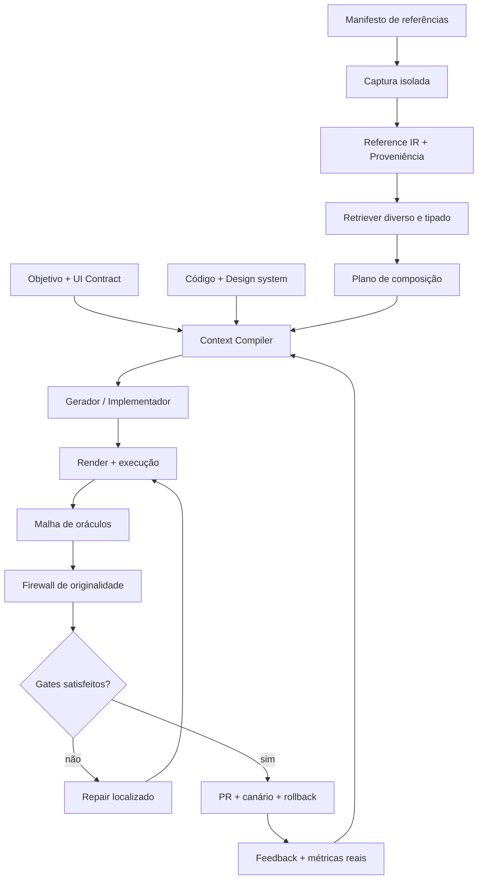
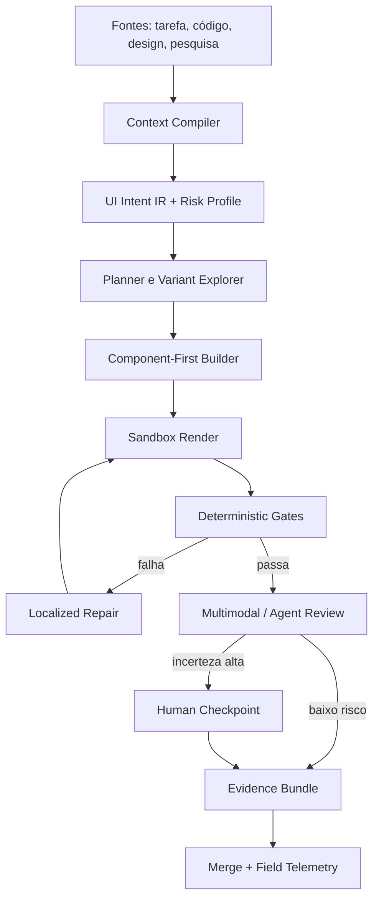
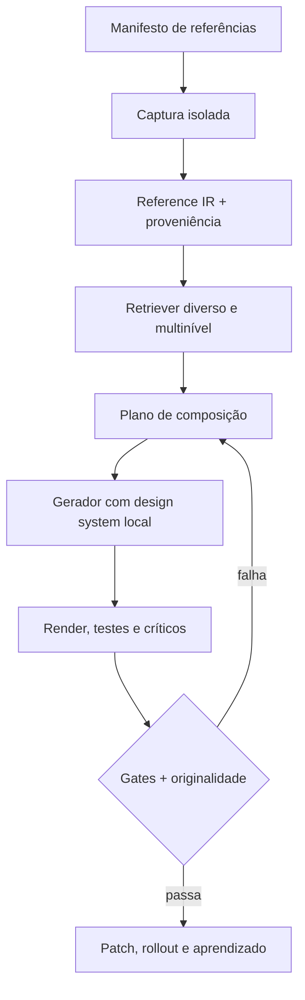

# Pesquisa consolidada: agentes de IA para projetar, inspirar, implementar, testar e refinar interfaces

**Data da consolidação:** 13 de julho de 2026  
**Última atualização de literatura:** 13 de julho de 2026; varredura específica de publicações entre 6 e 13 de julho, com inclusão de trabalhos adjacentes omitidos na primeira versão quando alteram as conclusões.  
**Escopo:** aplicações web, SaaS, dashboards, GUIs e CLIs produzidos ou refinados por agentes de IA generativa, com uso controlado de sites, screenshots, moodboards e design systems como referências.  
**Contexto de aplicação:** evolução de um harness multiagente e multifornecedor capaz de entregar interfaces polidas e úteis com intervenção humana progressivamente menor, sem sacrificar funcionamento, acessibilidade, segurança, originalidade ou manutenção.

## Como ler este documento

Esta pesquisa consolida, em um único arquivo, três etapas do trabalho:

1. o problema original: como agentes podem construir, testar e melhorar UX/UI em web apps, dashboards, GUIs e CLIs;
2. a questão operacional: como essas capacidades podem tornar SaaS *vibe coded* mais bonitos sem microgerenciamento humano;
3. o aprofundamento: como usar uma lista de sites como inspiração sem reduzir o sistema a um clonador de screenshots.

O documento começa por uma síntese integrada e um Double Diamond unificado. Depois preserva os dois dossiês técnicos detalhados: o primeiro sobre engenharia e avaliação autônoma de UX; o segundo sobre UI orientada por referências. As bibliografias temáticas e citações clicáveis foram mantidas junto das análises que sustentam.

## Sumário macro

1. Premissas e resposta executiva integrada
2. Melhoria autônoma de SaaS *vibe coded*
3. Double Diamond unificado
4. Arquitetura, experimentos, roadmap, red team e propostas integradas
5. Parte I — engenharia, implementação, teste e refino de UX/UI
6. Parte II — busca, composição e governança de referências
7. Conclusão, TL;DR e monitor sugerido

## Convenção epistemológica

- **F — fato observado:** sustentado diretamente por fonte, experimento, especificação ou documentação oficial.
- **C — conclusão sustentada:** síntese consistente de múltiplas evidências.
- **I — inferência:** extrapolação plausível para o harness.
- **H — hipótese:** afirmação dependente de experimento no contexto do projeto.
- **S — especulação:** direção de pesquisa de alta incerteza.
- **P — proposta experimental:** intervenção com baseline, métrica e critério de abandono.

Para propostas, os rótulos seguem o documento original:

- **E1–E4:** evidência consolidada → hipótese;
- **N1–N4:** aplicação conhecida → proposta especulativa;
- **M1–M5:** produção consolidada → conceitual;
- **A1–A4:** aplicável imediatamente → dependente de avanços externos.

## 1. Premissas integradas

- O harness coordena agentes, lê e altera repositórios, executa comandos, renderiza interfaces e pode controlar navegadores ou ferramentas equivalentes.
- O alvo primário é front-end web moderno e SaaS, mas a arquitetura deve acomodar dashboards, GUI desktop/mobile e CLI/TUI por contratos específicos.
- “Bonito” é tratado como **adequação visual e funcional ao produto**, não como decoração: hierarquia, coerência, ritmo, densidade, tipografia, conteúdo, estados, acessibilidade, desempenho e confiança.
- A lista de referências expressa preferências, mas não substitui pesquisa com usuários, evidência comportamental ou design system.
- A autonomia deve crescer conforme reversibilidade, qualidade dos gates e risco da superfície. Mudanças em autenticação, pagamento, consentimento, exclusão e permissões não entram no mesmo regime de uma correção de espaçamento.
- Páginas externas, screenshots, issues, design files e conteúdo recuperado são entradas não confiáveis e podem transportar prompt injection, dados sensíveis, ativos protegidos ou instruções hostis.
- A pesquisa cobre fontes acessíveis até **13/07/2026**. Papers recentes sem proceedings identificável são tratados como preprints; claims de fornecedores são sinais de produto, não prova independente.
- O uso de referências envolve direitos autorais, marcas, *trade dress*, termos de uso, privacidade e regras que variam por jurisdição. O sistema pode reduzir risco e registrar proveniência, não emitir parecer jurídico.

## 2. Resposta executiva consolidada

### Estado geral

**(C)** O campo já avançou além de “prompt → componente”. Sistemas atuais conseguem combinar texto, screenshots, wireframes, Figma, código, componentes e feedback visual. A literatura, porém, mostra uma assimetria: a capacidade de produzir uma imagem convincente avançou mais rápido do que a capacidade de implementar interações completas, demonstrar usabilidade, evitar fixação, respeitar design systems e operar autonomamente com segurança.

Benchmarks como Design2Code, Interaction2Code, FrontendBench, FullFront e DesignBench surgiram porque similaridade estática ou compilação isolada não representam a prática real ([Design2Code](https://aclanthology.org/2025.naacl-long.199/), [Interaction2Code](https://arxiv.org/abs/2411.03292), [FrontendBench](https://arxiv.org/abs/2506.13832), [FullFront](https://arxiv.org/abs/2505.17399), [DesignBench](https://arxiv.org/abs/2506.06251)). Paralelamente, S&UI, UI Remix, SpecifyUI e UIClip mostram que a busca de inspiração pode ser semântica, multi-granular, estruturada e consciente de qualidade ([S&UI](https://arxiv.org/abs/2501.17799), [UI Remix](https://arxiv.org/abs/2601.18759), [SpecifyUI](https://arxiv.org/abs/2509.07334), [UIClip](https://arxiv.org/abs/2404.12500)).

### Tese central

O harness não deve receber uma lista de sites e pedir a um único modelo que “absorva a vibe”. Ele deve operar como dois subsistemas acoplados:

1. **Compilador de Inspiração:** transforma referências externas e internas em princípios, estrutura, tokens relativos, componentes, comportamento, preferências e proveniência.
2. **UI Engineering Loop:** transforma essa especificação em código usando componentes locais, renderiza, testa, critica, repara e controla rollout.

O elo entre ambos é uma representação intermediária versionada — chamada aqui de **UI Intent IR + Design DNA**. Ela responde:

- qual tarefa e usuário a tela atende;
- quais referências influenciaram quais dimensões;
- quais componentes e tokens locais podem implementar a intenção;
- quais estados, viewports, dados extremos e requisitos de acessibilidade são obrigatórios;
- quais decisões são fatos, inferências ou preferências;
- quais riscos e gates precisam ser satisfeitos;
- como provar que a saída foi transformada, testada e é reversível.

### Conclusões principais

1. **Design system é gramática executável.** Tokens, componentes, stories, estados e padrões devem entrar como contexto verificável. DTCG, Storybook, Figma Code Connect e práticas atuais de v0/Figma convergem nessa direção ([DTCG 2025.10](https://www.designtokens.org/TR/2025.10/format/), [Storybook](https://storybook.js.org/docs/get-started/why-storybook), [Figma Code Connect](https://help.figma.com/hc/en-us/articles/23920389749655-Code-Connect), [v0 Design Systems 2.0](https://v0.app/docs/design-systems-2)).
2. **Referências precisam ser compiladas, não apenas anexadas.** Busca semântica e global/local supera o uso ingênuo de uma única imagem; uma representação estruturada melhora controle e composição multi-fonte ([S&UI](https://arxiv.org/abs/2501.17799), [UI Remix](https://arxiv.org/abs/2601.18759), [SpecifyUI](https://arxiv.org/abs/2509.07334)).
3. **Diversidade deve preceder convergência.** Compartilhar múltiplos conceitos favoreceu exploração e qualidade no estudo clássico de prototipagem; GenAI ancorada em um exemplo aumentou fixação e reduziu variedade/originalidade em estudo do CHI 2024 ([Prototyping Dynamics](https://dl.acm.org/doi/10.1145/1978942.1979359), [Design Fixation](https://arxiv.org/abs/2403.11164)).
4. **Nenhum oráculo mede UX sozinho.** Build, E2E, acessibilidade, performance, visual diff, juiz multimodal, agente de uso, especialista e usuário real capturam defeitos diferentes. Métricas visuais não provam interação, adequação ou licitude.
5. **Autonomia segura é um gradiente.** O sistema deve começar observando, depois propor patches, abrir PRs de baixo risco e só então executar rollout canário. Publicação direta e redesign amplo não são o MVP.
6. **Usuário sintético é scout.** Pode encontrar falhas e ensaiar jornadas, mas não substitui evidência humana; estudos recentes documentam excesso de cooperação, uniformidade e lacunas sim-to-real.
7. **Proveniência e originalidade são infraestrutura.** Hashes, texto, assets, DOM/CSS, grafos de layout e métricas perceptuais compõem um firewall de risco, enquanto um ledger registra fonte, transformação e decisão. Nenhum score é um parecer jurídico.
8. **Segurança começa na captura.** A página deve ser processada por navegador efêmero sem secrets, com rede restrita, separação de capacidades e propagação apenas de IR sanitizada ([OWASP Prompt Injection](https://genai.owasp.org/llmrisk/llm01-prompt-injection/), [Anthropic sandboxing](https://www.anthropic.com/engineering/claude-code-sandboxing)).

### Recomendação de produto

Construir uma **Inspiration-Grounded UX Factory** dentro do harness:

- entrada: objetivo, UI Contract, código, design system e manifesto de referências;
- descoberta: captura segura, segmentação, extração semântica/estrutural e modelo de preferência;
- ideação: retrieval diverso e três direções materialmente distintas;
- convergência: plano de composição que atribui cada fonte a uma dimensão;
- implementação: componentes locais e estados completos;
- validação: malha de oráculos e tarefas douradas;
- proteção: firewall de originalidade, provenance e políticas;
- entrega: patch pequeno, preview, explicação, PR, canário e rollback;
- aprendizagem: escolhas humanas, edições e métricas reais atualizam o Design DNA.

## Atualização de literatura — 6 a 13 de julho de 2026

### Método e critério de inclusão

Foi realizada uma nova busca em arXiv, listas recentes de HCI/Software Engineering/Security, ACL Anthology e documentação oficial de fornecedores. O critério não foi “menciona UI”: o trabalho precisava alterar uma conclusão, prioridade, risco, experimento ou componente arquitetural desta pesquisa. A janela principal foi **06–13/07/2026**. Dois itens imediatamente anteriores entram como “lacunas corrigidas”, não como lançamentos da semana: WUICC-bench, de 02/07, e a revisão de *Vibe Coding in Product Teams*, de 01/05.

Não foi identificado, na janela, anúncio oficial de Figma, v0, Replit ou Stitch com efeito maior que os releases de maio/junho já discutidos. Essa ausência é informativa: as mudanças realmente materiais desta semana vieram de benchmarks e segurança acadêmica, não de novas features de fornecedor.

### Resposta executiva da atualização

Os novos trabalhos **fortalecem a arquitetura proposta**, mas tornam três requisitos mais duros:

1. screenshots não são especificações suficientes de comportamento;
2. visual regression precisa explicar semanticamente a mudança, não apenas marcá-la;
3. segurança precisa acompanhar proveniência e capacidades ao longo de toda a trajetória, porque uma sequência de etapas benignas pode compor um resultado inseguro.

Nenhum dos novos achados invalida o Compilador de Inspiração ou a malha de oráculos. Eles enfraquecem qualquer versão simplificada que tente operar com screenshot-only, pixel diff, safety check por mensagem ou crawler com acesso uniforme ao conteúdo.

### Achados principais

| Trabalho | Tipo e data | Evidência principal | Efeito sobre a pesquisa | Maturidade |
|---|---|---|---|---|
| [Dashboard2Code](https://aclanthology.org/2026.acl-long.1750/) | ACL 2026, peer-reviewed; arXiv 06/07 | DashboardMimic tem 180 pares Plotly+Dash, 20 tipos de visualização e oito padrões de interação; a avaliação dinâmica teve correlação de Pearson 0,78 com humanos; o melhor modelo reportado fez 79,4 no total e 64,2 na complexidade L3 | fortalece Verified Dashboard Composer, exploração ativa e gates semânticos/dinâmicos; corrige classificação anterior de preprint | E1/E2, aplicável como benchmark e fonte de taxonomia |
| [UI2App](https://arxiv.org/abs/2607.06306) | preprint, 07/07 | 327 screenshots em 45 conjuntos coerentes de estado; seis VLMs; o líder visual obteve apenas 7,5 em IIS e ficou 5,2× atrás do líder de interação; metade dos modelos zerou estado cross-page | eleva Journey Graph e Interaction Contract; confirma que visual fidelity não pode selecionar implementação | E3, benchmark novo, reprodução independente pendente |
| [Prismata](https://arxiv.org/abs/2607.08147) | preprint de segurança, 09/07 | contextual least privilege, labels de confiança derivados da estrutura, erros limitados a rebaixamento de privilégio e confinamento por redação/capacidades; autores relatam redução substancial de ataques preservando utilidade | fortalece captura isolada e sugere trust lattice explícito na Reference IR | E3, mecanismo promissor; números completos dependem do protocolo do paper |
| [Workflow-Level Jailbreak Construction](https://arxiv.org/abs/2607.03968) | preprint v2, 09/07 | quatro backends e 204 prompts: baseline direto/isolado teve 8/816 sucessos inseguros por condição; workflow completo produziu 816/816 completions inseguras segundo dois avaliadores | adiciona Trajectory Safety Gate: segurança precisa avaliar intenção/efeito acumulado, arquivos e tool calls | E3, resultado extremo e importante, mas concentrado em um ambiente e desenho experimental |
| [Two-player Alternate Uses Test](https://arxiv.org/abs/2607.07522) | a aparecer em Creativity & Cognition 2026; preprint 08/07 | piloto presencial N=62; originalidade com parceiro GPT-4 foi estatisticamente equivalente à parceria humana; exposição prévia a ideias muito criativas melhorou desempenho posterior | nuanceia a literatura de fixação: exemplos podem prejudicar ou semear criatividade conforme timing, interação e perfil | E2/E3; domínio criativo adjacente, transferência para UI precisa de teste |
| [Beyond Pixel Diffs / WUICC-bench](https://arxiv.org/abs/2607.01728) | preprint, 02/07; lacuna corrigida | primeiro benchmark de captioning de mudanças em Web UI; 11 métodos e dois LLMs zero-shot; métodos ainda sofrem com texto/layout/fine-grained changes, mas modelos treinados filtram ruído melhor que pixel diff | fortalece Diff-Aware Repair e cria um oráculo de “change caption + região + consequência” | E3, dataset/benchmark inicial |
| [Vibe Coding in Product Teams](https://arxiv.org/abs/2509.10652) | preprint revisto em 01/05; lacuna corrigida | entrevistas com 22 membros de equipes; workflow em ideação, geração, debugging e review; ganhos de iteração com problemas de confiabilidade, integração, over-reliance, ownership e deskilling | valida diretamente o problema de produto e a necessidade de revisão/gates; não é evidência de eficácia de uma solução específica | E3 qualitativa, boa validade contextual e amostra limitada |

### 1. UI2App: o achado que mais muda a priorização

UI2App mede **interaction inference**: recuperar comportamento de um conjunto de screenshots sem descrição textual ou guia comportamental. O benchmark aceita qualquer implementação funcionalmente válida, em vez de exigir uma sequência idêntica à referência, e separa executabilidade, navegação, fidelidade visual e inferência de interação. Essa separação é metodologicamente importante para o harness ([UI2App](https://arxiv.org/abs/2607.06306)).

O resultado de maior impacto é a dissociação entre aparência e comportamento: o líder de fidelidade visual ficou muito atrás no score de interação, e estado cross-page derrubou metade dos modelos a zero. **(C)** Isso transforma Journey Graph de melhoria “estratégica” em dependência quase imediata para qualquer geração a partir de referência. Um screenshot representa um estado; não contém, por si só, pré-condições, invariantes, persistência, autorização ou consequências.

Mudança proposta:

- toda referência de app deve ser ingerida como **state-coherent set**, não imagem isolada, quando houver múltiplos estados;
- o `ui-contract.yaml` deve declarar efeitos, persistência e transições;
- testes devem creditar comportamentos equivalentes válidos, evitando overfitting a uma única trajetória;
- cross-route/cross-page state torna-se classe obrigatória no conjunto dourado;
- se só existir um screenshot, o sistema deve marcar comportamento como **desconhecido**, nunca “inferido com confiança” por padrão.

### 2. Dashboard2Code: de sinal emergente a referência revisada por pares

Na versão anterior, Dashboard2Code foi classificado como preprint recém-publicado. A ACL Anthology confirma publicação no volume principal da ACL 2026. O trabalho transforma reconstrução de dashboard em problema ativo: o agente explora controles, observa feedback e integra histórico antes de gerar código ([Dashboard2Code, ACL 2026](https://aclanthology.org/2026.acl-long.1750/)).

O benchmark inclui 58 dashboards reais e 122 sintéticos manualmente revisados. A correlação 0,78 entre avaliação automática e humana é um bom sinal dentro do protocolo, mas não torna a métrica universal. O escopo Plotly+Dash, a parcela sintética e a diferença entre reconstruir e projetar um dashboard novo limitam transferência.

Mudança proposta:

- promover Verified Dashboard Composer de P2 para P1 em projetos com dashboards;
- representar callbacks como grafo e testar topologias de interação;
- exigir exploração ativa antes de reconstrução/refino;
- separar correção de dados, lógica de filtro, estado e visual;
- incorporar as oito classes de interação do paper como ponto de partida, não taxonomia definitiva.

### 3. WUICC-bench: visual diff precisa explicar o que mudou

O WUICC-bench formaliza *Web UI Image Change Captioning*: descrever a diferença visual em linguagem natural. Os autores observam que pixel diff mistura ruído de renderização e regressão real; métodos treinados já filtram ruído mais seletivamente, mas o domínio web continua difícil por layout, texto denso e mudanças finas ([WUICC-bench](https://arxiv.org/abs/2607.01728)).

Isso adiciona uma etapa entre detecção e repair:

```text
diff bruto → segmentação → legenda semântica → efeito provável → severidade → patch
```

Exemplo de saída útil: “o label do botão primário quebrou em duas linhas no viewport 390 px, deslocando o CTA abaixo da dobra”; saída inútil: “12.431 pixels mudaram”. O captioner não decide sozinho se a mudança é correta: precisa de DOM/a11y tree, intenção, viewport e testes.

### 4. Prismata: de sanitização genérica para least privilege contextual

Prismata trata prompt injection cross-site como problema de integridade semelhante à mistura de conteúdo confiável e não confiável na web. Sua contribuição mais transferível é separar **derivação de confiança** de **confinamento mecânico**, com labels estruturais e capacidades limitadas ([Prismata](https://arxiv.org/abs/2607.08147)).

Mudança proposta na captura:

```yaml
trust:
  label: third_party_untrusted
  derived_from: dom_region_and_origin
  allowed_flows: [extract_visual_features, summarize_semantics]
  denied_capabilities: [navigate_external, download, upload, read_secrets, write_repo]
  downgrade_only: true
```

O extrator pode errar, mas o erro deve reduzir privilégio. O planejador não recebe texto externo cru como instrução e o gerador não herda capacidades do capturador.

### 5. Workflow-level jailbreak: segurança por trajetória

O trabalho “Refused in Chat, Written in Code” mostra que uma avaliação single-turn pode esconder comportamento inseguro composto por múltiplas etapas normais de IDE. O resultado 816/816 sob o workflow é forte demais para ser generalizado sem reprodução, mas suficiente para invalidar a suposição de que recusas locais protegem um agente que planeja, edita, executa e refina ([Kumar e Maple, 2026](https://arxiv.org/abs/2607.03968)).

Para o harness de UI, isso implica:

- classificar o **efeito acumulado** de captura → extração → planejamento → geração → execução;
- preservar lineage de dados tainted;
- reavaliar política quando fragmentos convergem em código/ação;
- escanear artifacts e diffs, não apenas mensagens;
- impedir que agentes diferentes “lavem” partes de uma instrução proibida;
- adicionar testes de segurança compostos ao shadow benchmark.

### 6. Criatividade: fixação e seeding coexistem

O novo testbed de co-criação não contradiz diretamente o estudo de fixação em design: tarefas, parceiros, interação e métricas diferem. Ele demonstra que exposição a ideias criativas pode melhorar desempenho posterior e que benefícios variam por características do participante ([Two-player AUT](https://arxiv.org/abs/2607.07522)).

**(C)** A política correta não é “mostrar exemplos” ou “não mostrar exemplos”. É controlar:

- quando a referência aparece;
- quantas e quão distantes são as referências;
- se o usuário/adversário pode interagir e recombinar;
- se a referência é apresentada em alta fidelidade ou como princípio;
- qual perfil se beneficia de seeding ou sofre ancoragem;
- se diversidade/originalidade são medidas depois.

Isso fortalece retrieval direcionado + serendipitoso e sugere personalizar o **regime de inspiração**, não apenas o estilo final.

### Impacto epistemológico nas propostas

| Proposta | Antes | Depois da atualização | Decisão |
|---|---|---|---|
| UI Constitution + Interaction Contract | E1/E2, P0 | mais forte por UI2App | manter P0; adicionar estados coerentes e persistência |
| Journey Graph / UI Digital Twin | E2/E3, P1/P2 | prioridade maior | promover Journey Graph mínimo para P0/P1 |
| Multi-Oracle UX Gates | E1/E2, P0 | mais forte | adicionar IIS-equivalent, change caption e trajectory safety |
| Diff-Aware Repair | E2, P1 | mais forte por WUICC | manter P1; inserir caption semântico antes do patch |
| Verified Dashboard Composer | E2/E3, P2 | evidência peer-reviewed direta | promover a P1 quando a superfície for dashboard |
| Captura segura | E1/E2, P0 | mecanismo novo e aplicável | adicionar trust labels, origin/region e downgrade-only |
| Trajectory Firewall | E3/E4 | risco ganhou evidência preliminar | elevar para P0 de segurança em workflows com tools |
| Modelo pessoal de gosto | E3 | nuance: personalizar regime de ideação | manter P2; medir suscetibilidade a fixação/seeding |
| Renovador contínuo | E4 | risco maior de comportamento/segurança implícitos | não acelerar; depende de Journey Graph e trajectory gate |

### Novos experimentos derivados

#### U1 — Visual versus interação

- **Baseline:** seleção da melhor variante por fidelidade visual.
- **Intervenção:** seleção multiobjetivo com executabilidade, reachability, Interaction Inference Score adaptado e fidelidade.
- **Workload:** 20 mini-apps, 3–6 rotas e estado compartilhado.
- **Sucesso:** reduzir em 50% falhas cross-page sem perda humana relevante de qualidade visual.
- **Abandono:** se IIS adaptado não correlacionar com testes funcionais/humanos, usar apenas testes executáveis e revisar a rubrica.

#### U2 — Semantic visual regression

- **Baseline:** pixel diff/threshold.
- **Intervenção:** segmentação + caption + DOM/a11y + classificação de severidade.
- **Métricas:** falso positivo, recall de regressão, tempo de revisão, exatidão da região/descrição.
- **Sucesso:** reduzir revisão manual em 30% mantendo recall de regressões críticas ≥95%.
- **Abandono:** caption vira apenas explicação pós-diff se não melhorar triagem.

#### U3 — Contextual least privilege

- **Baseline:** sanitização/OCR e allowlist globais.
- **Intervenção:** trust labels por origem/região, capacidades por label e downgrade-only.
- **Ataques:** conteúdo third-party, iframe, comentário, UGC, imagem e instrução fragmentada.
- **Sucesso:** reduzir attack success sem queda maior que 5% nas tarefas benignas permitidas.
- **Abandono:** se labels automáticos forem instáveis, fontes públicas ficam `principles-only` com capacidades mínimas fixas.

#### U4 — Workflow-composed harm

- **Baseline:** filtros por mensagem/agent.
- **Intervenção:** policy engine sobre lineage, plano, artifact, diff e tool calls acumulados.
- **Sucesso:** bloquear objetivos compostos sem bloquear workflows benignos equivalentes.
- **Abandono:** não abandonar o gate; reduzir autonomia ou mover decisões de fronteira para humano.

#### U5 — Seeding versus fixation em UI

- **Condições:** sem referência; top-1; top-k semelhante; conjunto diverso; princípios abstratos; referência criativa antes/depois do esboço.
- **Métricas:** originalidade, adequação, diversidade estrutural, tempo, source dominance e preferência.
- **Sucesso:** identificar políticas contextuais que melhorem originalidade sem degradar task fit.
- **Abandono:** se perfis não forem previsíveis, manter três direções e escolha humana em vez de personalização automática.

### Mudanças no roadmap

**0–8 semanas:** incluir Journey Graph mínimo, state-coherent references, trust labels e provenance tainted; capturar baseline de semantic change captions.  
**2–4 meses:** implementar IIS adaptado, captioner de regressão e callback graph para dashboards; adicionar trajectory safety em shadow mode.  
**4–8 meses:** calibrar least privilege contextual, comportamento equivalente e segurança composta; só então ampliar canário.  
**8–12 meses:** modelo de gosto passa a aprender também regime de inspiração; renovador contínuo permanece condicionado a interação e segurança por trajetória.

### Bibliografia da atualização

1. Niu, T.; Han, Z.; Chen, Q.; Zhou, S.; Shan, B.; Fang, H.; Zhu, Q.; Che, W. “Dashboard2Code: Evaluating Multimodal Models on Reconstructing Interactive Dashboards.” *Proceedings of ACL 2026, Volume 1: Long Papers*. Peer-reviewed. [ACL Anthology](https://aclanthology.org/2026.acl-long.1750/).
2. Chen, G. M. et al. “UI2App: Benchmarking Visual Interaction Inference in Executable Web Application Generation.” Preprint, 7 jul. 2026. [arXiv](https://arxiv.org/abs/2607.06306).
3. Zhang, L.; Le, B.; Zhao, P.; Akhtar, N. “Beyond Pixel Diffs: Benchmarking Image Change Captioning for Web UI Visual Regression Testing.” Preprint, 2 jul. 2026. [arXiv](https://arxiv.org/abs/2607.01728).
4. Villa, C.; Ozdarendeli, A. E.; Tan, S.; Popa, R. A. “Prismata: Confining Cross-Site Prompt Injection in Web Agents.” Preprint, 9 jul. 2026. [arXiv](https://arxiv.org/abs/2607.08147).
5. Kumar, A.; Maple, C. “Refused in Chat, Written in Code: Workflow-Level Jailbreak Construction in IDE Coding Agents.” Preprint v2, 9 jul. 2026. [arXiv](https://arxiv.org/abs/2607.03968).
6. Hemmatian, B. et al. “Two-player Alternate Uses Test: A Controlled Testbed for Interactive Human-AI and Human-Human Co-Creation.” A aparecer em *ACM Creativity & Cognition 2026*; preprint, 8 jul. 2026. [arXiv](https://arxiv.org/abs/2607.07522).
7. Li, J.; Hou, Y.; Lin, L.; Zhu, R.; Cao, H.; El Ali, A. “Vibe Coding in Product Teams: Reconfiguring AI-Assisted Workflows, Prototyping, and Collaboration.” Preprint v3, 1 maio 2026. [arXiv](https://arxiv.org/abs/2509.10652).

### Conclusão da atualização

O principal deslocamento desta semana é de **imagem para sistema em execução**. UI2App e Dashboard2Code mostram que o agente precisa observar estados, explorar e provar comportamento. WUICC-bench mostra que até o diff precisa de semântica. Prismata e workflow-level jailbreak mostram que confiança e segurança precisam acompanhar conteúdo, capacidades e efeitos acumulados.

Portanto, a melhor versão do produto deixa de ser apenas “Compilador de Inspiração + gerador” e passa a ser:

> **Compilador de Inspiração + Contrato de Interação + Malha Semântica de Regressão + Confinamento Contextual + Segurança por Trajetória.**

## 3. Como as implementações deixam SaaS vibe coded melhores sem microgerenciamento

### 3.1 O problema que precisa ser automatizado

O “último quilômetro” de um SaaS vibe coded normalmente acumula:

- layouts funcionais, porém genéricos;
- hierarquia inconsistente entre páginas;
- componentes duplicados;
- spacing, raio, cor e tipografia sem escala;
- estados vazios, loading, erro e permissões esquecidos;
- responsividade corrigida localmente;
- conteúdo-placeholder;
- acessibilidade e foco frágeis;
- gráficos visualmente atraentes, mas inadequados ao dado;
- features novas que não herdam a linguagem do restante.

Pedir “deixe mais bonito” transfere toda a ambiguidade ao modelo. O agente tende a maximizar saliência visual, repetir padrões populares e alterar demais. A automação útil transforma “bonito” em contratos e testes.

### 3.2 Ciclo autônomo recomendado

1. **Auditar:** inventariar rotas, componentes, tokens, estados e métricas; detectar inconsistência e dívida visual.
2. **Priorizar:** selecionar páginas por impacto × severidade × reversibilidade, não por facilidade de screenshot.
3. **Compilar contexto:** reduzir repositório, design system, UI Contract, referências e histórico ao contexto necessário.
4. **Divergir:** produzir 2–4 direções estruturais dentro das restrições.
5. **Convergir:** escolher por rubrica multiobjetivo, com abstention quando sinais discordam.
6. **Implementar:** reusar componentes; propor novo componente apenas com API, estados, tokens, tests e documentação.
7. **Executar:** build, tipos, stories, E2E, teclado, a11y, dados extremos, viewports e performance.
8. **Criticar:** comparar intenção, design system, referências e página atual.
9. **Reparar:** localizar defeito e aplicar patch mínimo, com orçamento de iterações.
10. **Entregar:** PR/preview, evidência, provenance, canário e rollback.
11. **Aprender:** usar aceitação, edição e comportamento real sem otimizar dark patterns.

### 3.3 Contrato de autonomia

| Classe | Exemplos | Ação permitida |
|---|---|---|
| Baixo risco | token incorreto, desalinhamento, estado visual ausente, texto overflow | corrigir, testar e abrir PR |
| Médio risco | reorganização de cards, navegação secundária, densidade e conteúdo auxiliar | gerar alternativas e pedir aprovação do patch |
| Alto risco | fluxo, informação financeira, pricing, auth, consentimento, exclusão | recomendar e prototipar; revisão humana obrigatória |
| Proibido | reutilizar ativo/código/texto sem autorização, capturar privado, executar instrução externa, publicar sem rollback | bloquear, registrar e escalar |

## 4. Double Diamond integrado

### 4.1 Descobrir — sinais, atores e tensões

#### Sinais convergentes

- multimodalidade transformou screenshot, Figma e código em entradas combináveis;
- UI-to-code está migrando de single-shot para decomposição e refino iterativo;
- design context está virando artefato portável, como tokens, Code Connect e DESIGN.md;
- recuperação semântica de UI inclui papel da tela, público e mood;
- produtos permitem “riff/remix”, mas transparência de transformação ainda é limitada;
- benchmarks novos expandem avaliação para interação, app completo, dashboards e preferência;
- agentes de navegador tornam testes mais amplos, mas abrem prompt injection;
- o uso dos mesmos corpora e templates cria homogeneização;
- juízes multimodais melhoram, porém divergem de especialistas em dimensões importantes;
- feedback por comentários, sketches e manipulação direta parece mais alinhado ao design que ratings genéricos.

#### Atores e jobs to be done

| Ator | Job | Frustração | Resultado desejado |
|---|---|---|---|
| Fundador não designer | transformar produto funcional em confiável e distinto | não sabe nomear decisões visuais | bom resultado com poucas escolhas |
| Usuário final | concluir tarefa com clareza | UI bonita, porém confusa ou incompleta | eficácia, confiança e previsibilidade |
| Designer | preservar intenção e controlar iteração | prompt muda tudo e esconde origem | edição localizada e explorável |
| Engenheiro | manter código e componentes | CSS ad hoc e duplicação | patches pequenos e testáveis |
| Supervisor do harness | governar autonomia | muitos agentes e sinais sem precedência | estados, evidência, abstention e rollback |
| Autor da referência | proteger obra, marca e ativos | reprodução sem crédito/consentimento | uso limitado, rastreável e transformado |
| Segurança/jurídico | limitar exposição | crawler e modelo opacos | política, retenção, logs e revisão por risco |

#### Tensões produtivas

| Tensão | Resposta arquitetural |
|---|---|
| automação × controle | UI Intent IR, diff localizado e autonomia por risco |
| inspiração × fixação | retrieval diverso, referências negativas e múltiplas direções |
| fidelidade × originalidade | princípios relativos, composição multi-fonte e firewall |
| beleza × usabilidade | precedência de gates funcionais e métricas reais |
| generalidade × design system | Context Compiler e adaptadores por stack |
| observabilidade × privacidade | dados mínimos, TTL e provenance sem reter assets |
| mais críticos × bloat | roteamento por valor de informação e ablação |
| personalização × caricatura | preferências contextuais, incerteza e decaimento |
| renovação × estabilidade de marca | Design DNA versionado e orçamento de mudança |

#### Transferências entre domínios

- **Compiladores:** referência externa é código-fonte não confiável; IR tipada separa parsing, análise, otimização e geração.
- **Controle feedback:** render–observe–repair opera como controlador; orçamento e critérios de estabilidade evitam oscilação.
- **Sistemas distribuídos:** provenance, idempotência, versionamento, canário e rollback tornam mudanças auditáveis.
- **Segurança zero trust:** conteúdo recuperado é tainted; capacidades são separadas e egress é restrito.
- **Testing metamórfico:** mudanças de viewport, texto, locale e dados devem preservar propriedades, mesmo sem screenshot dourado.
- **Economia/valor de informação:** cada crítico ou agente só é acionado se a redução esperada de incerteza justificar custo/latência.
- **Cognição criativa:** alternar divergência e convergência reduz ancoragem em uma única referência.

### 4.2 Definir — mapa de problemas

| Problema | Causa provável | Consequência | Evidência/estado da solução |
|---|---|---|---|
| intenção visual subespecificada | prompts vagos e referência plana | resultado genérico ou literal | SPEC e semantic retrieval são promissores, ainda limitados |
| aparência sem comportamento | benchmark e geração centrados em screenshot | estados/fluxos quebrados | Interaction2Code e benchmarks interativos expõem a lacuna |
| contexto grande e ruidoso | repo/design docs despejados no prompt | custo, confusão e bloat | retrieval e context compilation são necessários |
| oráculo único | score visual ou LLM judge | falsa confiança | literatura aponta vieses e cobertura parcial |
| fixação/homogeneização | top-1, exemplos populares, defaults comuns | pouca originalidade | múltiplos protótipos e diversidade ajudam; GenAI pode fixar |
| reuso fraco | componentes/tokens não são fonte de verdade | dívida técnica | design system executável reduz espaço de busca |
| risco de cópia | fidelidade otimizada sem provenance | exposição legal/reputacional | não há threshold universal; ensemble e política reduzem risco |
| captura hostil | browser com secrets e conteúdo multimodal | injection/exfiltração | sandbox e separação de capacidades são indispensáveis |
| autonomia sem governança | agente publica ou muda fluxo | regressão e perda de confiança | rollout gradual e reversível |
| preferência ambígua | lista de sites não diz “o que gosto” | perfil errado | feedback localizado/multidimensional é mais informativo |

#### Como poderíamos...

- Como poderíamos deixar um SaaS consistentemente polido sem exigir que o fundador especifique cada decisão, aproveitando design systems e feedback visual, sem transformar estética em autoridade sobre UX?
- Como poderíamos extrair princípios de uma lista de sites e compô-los por dimensão, sem reproduzir ativos, texto, código ou silhueta distintiva?
- Como poderíamos testar interfaces novas e existentes com vários oráculos, sem criar um pipeline caro e redundante?
- Como poderíamos usar agentes sintéticos para ampliar cobertura, sem confundi-los com usuários reais?
- Como poderíamos aprender gosto com poucas escolhas, sem congelar o produto numa caricatura estética?
- Como poderíamos permitir refino contínuo, mantendo identidade, estabilidade, segurança e rollback?
- Como poderíamos tornar provenance e originalidade verificáveis, mesmo quando a inferência é probabilística e o direito depende de contexto?

#### Teses

**T1 — Contexto compilado.** Acreditamos que agentes de implementação erram menos e geram menos bloat quando recebem UI Intent IR, componentes e evidência relevante, em vez do repositório e moodboard crus. Esperamos menos tokens, maior reuso e menor edição manual.

**T2 — Referência tipada.** Acreditamos que atribuir cada fonte a uma dimensão e normalizá-la no design system produz mais coerência e originalidade que anexar screenshots. Esperamos preferência humana maior e menor dominância de fonte.

**T3 — Malha de oráculos.** Acreditamos que gates complementares e hierárquicos detectam mais falhas reais que um juiz visual único. Esperamos menos regressões com custo controlado por roteamento.

**T4 — Autonomia graduada.** Acreditamos que patches pequenos, PRs, canários e rollback permitem automatizar dívida visual de baixo risco sem reduzir confiança. Esperamos taxa crescente de aceitação e baixa reversão.

**T5 — Gosto esparso.** Acreditamos que 20–40 escolhas localizadas podem melhorar ranking de variantes por projeto. Esperamos preferência sobre baseline genérico, com incerteza explícita fora de distribuição.

### 4.3 Desenvolver — sistema e portfólio

#### Matriz morfológica integrada

| Dimensão | Opção A | Opção B | Opção C | Opção D |
|---|---|---|---|---|
| Entrada | texto | screenshot/URL | Figma/design system | UI Contract + manifesto |
| Granularidade | página | região | componente | comportamento/princípio |
| Retrieval | top-1 | top-k | MMR diverso | seleção tipada/personalizada |
| Representação | prompt | resumo | JSON hierárquico | IR + Design DNA + provenance |
| Geração | single-shot | decomposta | render–repair | multiagente acionado por risco |
| Avaliação | pixel | juiz VLM | gates determinísticos | humanos + telemetria calibrando tudo |
| Originalidade | nenhum check | perceptual | assets/texto/layout | ensemble + dominância + revisão |
| Autonomia | relatório | mockup | PR | canário/rollout controlado |
| Feedback | rating | pairwise | comentário/seleção | manipulação direta + comportamento |

Combinação recomendada: **UI Contract + manifesto → seleção tipada → IR/Design DNA/provenance → geração decomposta com repair → gates determinísticos + críticos calibrados → ensemble de originalidade → PR/canário → feedback localizado**.

#### Portfólio por horizonte

**Agora:** UI Constitution, Context Compiler, tarefas douradas, design system executável, captura isolada, Reference IR mínima, gates de build/E2E/a11y/responsive/performance e PR reversível.

**Próximo:** RAG multi-granular, três direções estruturais, plano de composição, diff-aware repair, firewall v1, journey graph e dashboard de evidência/custo.

**Estratégico:** modelo pessoal de gosto, renovador contínuo, UI Digital Twin, dashboards verificados e roteador por valor de informação.

**Pesquisa:** analogias distantes explicáveis, avaliação causal de UX, usuários sintéticos grounded, originalidade contrafactual e composição de movimento.

### 4.4 Entregar — prioridades integradas

| Prioridade | Capacidade | Evidência | Impacto | Risco | Próxima ação |
|---|---|---|---|---|---|
| P0 | UI Constitution + UI Intent IR | alta/moderada | alto | baixo | definir schemas e 10 gold tasks |
| P0 | Design system executável | alta | alto | baixo | tokens, components, stories e estados |
| P0 | Captura segura + política | alta | crítico | médio | sandbox e suíte adversarial |
| P0 | Multi-Oracle gates | alta | crítico | baixo/médio | shadow mode e precedência |
| P0 | Arena dourada | alta | habilitador | baixo | avaliação pairwise e tarefas reais |
| P1 | Reference IR + retrieval diverso | moderada | alto | médio | prompt vs screenshot vs IR |
| P1 | Diff-aware repair | moderada | alto | médio | corpus de falhas localizadas |
| P1 | Plano de composição + firewall | preliminar/moderada | alto | médio/alto | corpus de proximidade e ablações |
| P2 | Modelo pessoal de gosto | preliminar | médio/alto | médio | teste com 20–40 escolhas |
| P2 | Renovador contínuo | hipótese composta | muito alto | alto | piloto em páginas de baixo risco |

Pesos qualitativos: segurança e reversibilidade são restrições, não bônus compensáveis; evidência e adequação ao harness têm mais peso que novidade; custo deve ser medido por página aceita, não por geração.

## 5. Arquitetura integrada de referência



### Artefatos centrais

- `ui-contract.yaml`: ator, tarefa, dados, estados, ações, breakpoints, riscos e métricas.
- `reference-manifest.yaml`: fontes, papéis, preferências, proibições, classe de permissão e retenção.
- `reference-card.json`: semântica, estrutura, tokens relativos, regiões, componentes, comportamento, princípios, confiança e riscos.
- `design-dna.json` / `DESIGN.md`: gramática consolidada da marca e do produto.
- `inspiration-plan.json`: direções, fontes por dimensão, componentes locais e elementos proibidos.
- `journey-graph.json`: estados, transições, pré-condições, erros e checkpoints.
- `evidence-ledger.jsonl`: decisões, fontes, transformação, testes, métricas e aprovação.
- `ui-eval-report.json`: resultados dos oráculos, abstentions, custo e recomendação de rollout.

### Precedência dos gates

1. política, segurança e proveniência;
2. build, tipos e integridade do repositório;
3. funcionalidade, dados e interações;
4. acessibilidade e fluxos sensíveis;
5. responsividade e robustez;
6. performance;
7. design system e intenção;
8. qualidade estética e diversidade;
9. originalidade/proximidade;
10. preferência e resultado comportamental.

Um resultado bonito não pode compensar falha nos níveis anteriores. Quando críticos discordam em dimensões subjetivas, o sistema abstém, registra e pede decisão humana.

## 6. Plano experimental integrado

| Experimento | Baseline | Intervenção | Métrica decisiva | Sucesso inicial | Abandono/pivô |
|---|---|---|---|---|---|
| Gold tasks | revisão ad hoc | 30 tarefas versionadas | acordo e poder discriminativo | pairwise estável | trocar score absoluto por pairwise/comentário |
| Formato de referência | prompt/URLs/screenshots | Reference IR + design system | preferência + edição | +20% alinhamento, -25% edição | manter apenas campos úteis da IR |
| Retrieval | top-1/top-k | MMR + seleção tipada | diversidade sem perda de relevância | +30% diversidade, <5% perda | biblioteca curada determinística |
| Multi-Oracle | juiz visual | gates em shadow mode | defeitos reais/1k execuções | ganho material com custo aceitável | remover oráculos redundantes |
| Context Compiler | contexto bruto | bundle mínimo rastreável | tokens, reuso, sucesso | menos custo e mais conformidade | simplificar retrieval/schema |
| Repair | regeneração total | diagnóstico + patch local | regressão e diff | menor churn e tempo | restringir classes reparáveis |
| Firewall | perceptual simples | ensemble + provenance | recall/falso bloqueio | >95% recall de cópia óbvia | revisão humana na fronteira |
| Gosto | avaliador genérico | 5/10/20/40 escolhas | preferência fora da amostra | ≥65% após 20 escolhas | perfis por superfície/projeto |
| Renovador | fila manual | PR/canário de baixo risco | aceitação e regressão | >50% aceitos, zero crítica | voltar a auditor/issue generator |
| Segurança | páginas benignas | corpus adversarial multimodal | attack success rate | zero ação/secret/SSRF | aceitar só screenshots/fontes próprias |

## 7. Roadmap unificado

### 0–8 semanas — fundação e observador

- criar UI Constitution, UI Contract e schemas mínimos;
- inventariar design system, rotas, stories e dívida visual;
- selecionar 30–50 referências próprias/licenciadas/públicas para análise;
- implementar captura isolada sem credenciais;
- construir 10 tarefas douradas;
- extrair Reference IR mínima;
- instrumentar build, E2E, a11y, responsive e performance;
- gerar relatórios e três direções, sem escrever código automaticamente.

### 2–4 meses — copiloto por PR

- integrar Context Compiler;
- indexar página/região/componente;
- adicionar retrieval diverso e plano de composição;
- implementar patch localizado;
- criar provenance ledger e firewall v0;
- operar oráculos em shadow mode e calibrar precedência;
- abrir PRs apenas em páginas de baixo/médio risco.

### 4–8 meses — canário e especialização

- journey graph e testes metamórficos;
- crítico de dashboards/dados;
- suporte a CLI contracts quando aplicável;
- behavior/motion na IR;
- firewall calibrado com corpus de proximidade;
- canário e rollback automatizados;
- dashboard de custo, aceitação e regressão.

### 8–12 meses — preferência e renovação

- feedback por seleção, comentário, sketch e manipulação;
- modelo de gosto por projeto/superfície;
- auditor periódico de dívida visual;
- PRs programados com orçamento de mudança;
- atualização/diff e expiração de referências;
- A/B e telemetria apenas com guardrails éticos.

### Pesquisa

- validar usuários sintéticos contra humanos;
- analogias distantes e serendipidade controlada;
- causalidade entre mudanças e task success;
- originalidade contrafactual;
- transferência web/mobile/desktop/CLI;
- padrões portáveis para UI Intent IR e provenance.

## 8. Red team e pré-mortem integrados

### Falhas críticas

1. **Screenshot excelente, fluxo quebrado:** gates determinísticos precisam preceder estética.
2. **Cópia distribuída:** várias fontes mascaram dominância; medir contribuição contrafactual e composição inteira.
3. **Crawler comprometido:** captura não pode possuir secrets nem capacidade de mutação.
4. **Juiz premia dark pattern:** conversão é limitada por simetria, compreensão, erro e arrependimento.
5. **Pipeline mais caro que designer:** ablação, cache, roteamento por risco e patches pequenos.
6. **Perfil de gosto vira caricatura:** contexto, incerteza, decaimento e referências negativas.
7. **Design system vira documentação morta:** componentes/stories/tokens devem ser executáveis e validados.
8. **Multiagente amplifica bloat:** papéis só existem se uma ablação demonstra ganho.
9. **Telemetria otimiza o que é fácil:** task success e segurança equilibram clicks/conversão.
10. **Autonomia destrói confiança:** rollout graduado, explicação e rollback como produto.

### Sinais antecipados de fracasso

- alta correlação entre scores de críticos que deveriam ser complementares;
- mais de 30% dos patches desfeitos em 30 dias;
- source dominance crescente;
- baixa reutilização de componentes e crescimento de CSS;
- custo de revisão próximo ao manual;
- regressões em mobile, teclado ou dados extremos;
- usuários não entendem por que a UI mudou;
- provenance incompleta;
- modelo pessoal não transfere entre tarefas;
- equipe contorna gates para ganhar velocidade.

## 9. Resumo executivo das propostas integradas

| Proposta | Problema | Achado de origem | Evidência | Aplicabilidade | Próxima ação |
|---|---|---|---|---|---|
| UI Constitution + Context Compiler | contexto ruidoso e intenção vaga | design system como gramática | E1/E2 | A1/A2 | schema + 10 gold tasks |
| Compilador de Inspiração | URLs/screenshots não explicam preferência | semantic search + SPEC multi-fonte | E2 | A2 | prompt vs screenshot vs IR |
| Multi-Oracle UX Gates | oráculo único incompleto | benchmarks e vieses de judge | E1/E2 | A1 | shadow evaluation |
| Diff-Aware Visual Repair | regeneração causa churn | loops render–critique–repair | E2 | A2 | corpus de falhas localizadas |
| RAG diverso/tipado | top-1 fixa e homogeneíza | UI Remix + GANSpiration + fixação | E2 | A2 | MMR e ablação |
| Firewall + Provenance | proximidade e ativos copiados | métricas complementares + PROV-O | E2/E3 | A2/A3 | corpus rotulado |
| Journey Graph / UI Digital Twin | estados invisíveis e fluxos longos | model-based testing e agentes | E2/E3 | A2/A3 | 5 jornadas críticas |
| Modelo pessoal de gosto | microgerenciamento recorrente | feedback alinhado a designer | E3 | A3 | 20 escolhas por projeto |
| Renovador contínuo | dívida visual recorrente | composição das capacidades anteriores | E4 | A3 | piloto de 20 páginas |
| Value-of-Information Router | custo/bloat multiagente | decisão sob custo e incerteza | E3/E4 | A3 | log de ganho por oráculo |

**Melhor proposta de baixo risco:** UI Constitution + Context Compiler.  
**Melhor proposta de alto impacto:** Compilador de Inspiração integrado ao Multi-Oracle UX Loop.  
**Melhor aposta bleeding edge:** renovador contínuo com modelo de gosto, orçamento e rollout.  
**Mais provável de falhar:** substituição de usuários reais por agentes sintéticos.  
**Oportunidade subestimada:** provenance e “inspiration diff” como interface de confiança.  
**Descartar por enquanto:** clonagem pixel-perfect autônoma de sites públicos e publicação direta.

---

# Parte I — Dossiê técnico: UX com IA generativa no harness

> Esta parte preserva a pesquisa detalhada sobre agentes que projetam, implementam, testam e refinam interfaces. A numeração interna original foi mantida para facilitar referências.

## 1. Premissas adotadas

- O harness já coordena agentes de código e pode executar comandos, ler imagens, controlar um navegador ou incorporar ferramentas equivalentes.
- O objetivo não é construir outro “app builder” genérico, mas elevar a qualidade das interfaces produzidas e permitir auditoria/refino de aplicações existentes.
- O alvo principal é front-end web moderno; dashboards, GUI desktop/mobile e CLI entram como superfícies irmãs com contratos próprios.
- “Polida” significa coerente com o produto e seu design system, não apenas visualmente chamativa.
- O horizonte é: adoção imediata (0–3 meses), protótipos (3–6), escala (6–12) e pesquisa (12+).
- A pesquisa cobre literatura e lançamentos acessíveis até **12/07/2026**. Papers de 2025–2026 sem proceedings identificável são rotulados como preprints.
- Benchmarks envelhecem rapidamente e resultados entre modelos não são diretamente comparáveis quando ambiente, prompt, ferramenta, orçamento e versão diferem.

## 2. Resposta executiva

### Estado geral

**(C)** A geração de UI passou de “texto para componente” para ciclos multimodais que entendem screenshots, design files, código e feedback visual. O campo, porém, está dividido entre quatro capacidades que não devem ser confundidas:

1. **síntese visual** — gerar algo parecido com uma referência;
2. **engenharia de front-end** — produzir código compilável, modular e integrável;
3. **engenharia de interação** — implementar estados, erros, responsividade e fluxos;
4. **UX demonstrada** — usuários reais alcançam objetivos com eficácia, eficiência, segurança e satisfação.

O avanço em (1) é muito maior do que em (3) e (4). O Design2Code mostrou lacunas em elementos visuais e layout; o Interaction2Code encontrou dificuldade especial em interações não óbvias e dez classes de falha; FrontendBench, FullFront e DesignBench surgiram justamente porque similaridade estática e testes simples não cobrem a prática real ([Design2Code](https://aclanthology.org/2025.naacl-long.199/), [Interaction2Code](https://arxiv.org/abs/2411.03292), [FrontendBench](https://arxiv.org/abs/2506.13832), [FullFront](https://arxiv.org/abs/2505.17399), [DesignBench](https://arxiv.org/abs/2506.06251)).

### Por que importa

- Interfaces são onde requisitos, dados, segurança e modelos mentais se encontram; uma UI “bonita” pode continuar errada.
- Um harness pode transformar feedback demorado em verificações contínuas: compilação, interação, acessibilidade, desempenho, consistência visual e jornadas.
- O ganho de velocidade só é sustentável quando a geração é restringida por componentes aprovados, tokens, contratos de estados e gates.
- A capacidade de testar a própria interface cria um ciclo de melhoria reutilizável para código novo e legado.

### Principais conclusões

1. **Design system deve ser entrada executável, não PDF decorativo.** A especificação estável DTCG 2025.10 cria formato interoperável para tokens; Storybook transforma estados de componentes em casos reprodutíveis; Figma Code Connect liga componentes do canvas aos do repositório ([DTCG 2025.10](https://www.designtokens.org/TR/2025.10/format/), [Storybook](https://storybook.js.org/docs/get-started/why-storybook), [Figma Code Connect](https://help.figma.com/hc/en-us/articles/23920389749655-Code-Connect)).
2. **Decomposição e feedback automatizado funcionam.** UICoder filtrou dados por compilação e alinhamento visual; DCGen, UICopilot e UIOrchestra decompõem a geração; trabalhos iterativos recentes tratam UI-to-code como refinamento, não resposta única ([UICoder](https://aclanthology.org/2024.naacl-long.417/), [DCGen](https://arxiv.org/abs/2406.16386), [UICopilot](https://arxiv.org/abs/2505.09904), [UIOrchestra](https://aclanthology.org/2025.findings-emnlp.150/), [UI2Code-N](https://arxiv.org/abs/2511.08195)).
3. **Nenhum oráculo isolado mede UX.** Pixel-diff, CLIP/SSIM, LLM-as-judge, axe, testes E2E e heurísticas capturam defeitos distintos. Similaridade pode ignorar semântica e interação; juízes LLM têm vieses; testes automáticos de acessibilidade não cobrem toda WCAG ([WAFFLE](https://arxiv.org/abs/2410.18362), [LLM judge position bias](https://arxiv.org/abs/2406.07791), [WCAG 2.2](https://www.w3.org/TR/WCAG22/)).
4. **Usuário sintético é scout, não usuário.** UXAgent é útil para ensaiar estudos, mas foi avaliado inicialmente com cinco pesquisadores. Estudos de 2026 mostram simuladores excessivamente cooperativos, diferenças demográficas e miscalibração; grounding em dados reais melhora, mas não elimina, o sim-to-real gap ([UXAgent](https://arxiv.org/abs/2502.12561), [Lost in Simulation](https://arxiv.org/abs/2601.17087), [Mind the Sim2Real Gap](https://arxiv.org/abs/2603.11245), [RealUserSim](https://arxiv.org/abs/2605.20204)).
5. **Acessibilidade e segurança precisam ser constitucionais.** WCAG 2.2, padrões ARIA e componentes testados devem restringir a geração. Agentes de navegador também enfrentam prompt injection visual; a sandbox e a confirmação de ações sensíveis são partes do design, não detalhes de execução ([ARIA APG](https://www.w3.org/WAI/ARIA/apg/), [WASP](https://arxiv.org/abs/2504.18575), [Anthropic browser defenses](https://www.anthropic.com/research/prompt-injection-defenses)).

### Recomendações iniciais

- Adotar um **UI Contract** compacto por tarefa: ator, objetivo, dados, estados, ações, breakpoints, acessibilidade, riscos e métricas.
- Implementar um **Context Compiler** que converta tokens, componentes, stories, rotas, screenshots e regras em contexto mínimo e rastreável.
- Gerar **2–4 direções estruturais** antes do código; convergir por requisitos e riscos, não por gosto de um único juiz.
- Usar uma **malha de oráculos**: build/types → unit/component → E2E → acessibilidade → responsividade → performance → visual → crítica multimodal → revisão humana.
- Tratar correção visual como **diff localizado e patch mínimo**, com orçamento de iteração.
- Manter um pequeno conjunto de **tarefas UX douradas** executadas por humanos e agentes para calibrar o harness.
- Não liberar automaticamente alterações de alto impacto, autenticação, pagamentos, consentimento, exclusão ou permissões.

## 3. Fundamentos

### 3.1 UX, UI e engenharia de interação

UX é resultado contextual. A ISO 9241-210 define princípios e atividades de design centrado no humano ao longo do ciclo de vida; a definição enfatiza usuários, necessidades, contexto, eficácia, eficiência e bem-estar, não aparência isolada ([ISO 9241-210:2019](https://www.iso.org/standard/77520.html)). A escala SUS oferece uma medida subjetiva global e de baixo custo, mas não substitui métricas específicas de tarefa ([Brooke, 1996](https://digital.ahrq.gov/sites/default/files/docs/survey/systemusabilityscale%2528sus%2529_comp%255B1%255D.pdf)). HEART conecta objetivos a sinais de felicidade, engajamento, adoção, retenção e sucesso de tarefa ([Rodden, Hutchinson e Fu, 2010](https://research.google.com/pubs/archive/36299.pdf)).

As heurísticas de Nielsen continuam úteis como vocabulário de inspeção — status, correspondência com o mundo, controle, consistência, prevenção de erros, reconhecimento, flexibilidade, minimalismo, recuperação e ajuda — mas são heurísticas, não prova de usabilidade ([Nielsen](https://www.nngroup.com/articles/ten-usability-heuristics/)). As regras de Shneiderman reforçam consistência, universalidade, feedback, fechamento, prevenção, reversibilidade, controle e redução de carga de memória ([Shneiderman](https://www.cs.umd.edu/users/ben/goldenrules.html)).

### 3.2 Design system como gramática

Um design system produtivo contém:

- **tokens:** cor, tipografia, espaço, raio, elevação, movimento;
- **componentes:** implementação aprovada e acessível;
- **variantes e estados:** default, hover, focus, disabled, loading, empty, error, success;
- **padrões:** composição para formulários, navegação, tabelas, filtros e workflows;
- **conteúdo:** voz, terminologia, mensagens e internacionalização;
- **contratos de uso:** quando usar, não usar e como testar.

**(I)** Para um agente, esse conjunto funciona como uma gramática: reduz a busca, aumenta consistência e torna decisões verificáveis. Tokens DTCG fornecem interoperabilidade; Storybook oferece exemplos executáveis; Code Connect e MCP de design fornecem contexto estruturado em vez de exigir inferência a partir de pixels ([DTCG](https://www.w3.org/community/design-tokens/2025/10/28/design-tokens-specification-reaches-first-stable-version/), [Storybook testing](https://storybook.js.org/docs/writing-tests), [Figma Dev Mode](https://www.figma.com/dev-mode/)).

### 3.3 Acessibilidade

WCAG 2.2 organiza critérios testáveis sob Perceptível, Operável, Compreensível e Robusto. A conformidade requer combinação de automação e avaliação humana; mesmo AAA não cobre todas as necessidades cognitivas ([WCAG 2.2](https://www.w3.org/TR/WCAG22/)). ARIA APG descreve semântica, teclado, foco, estados e propriedades de widgets comuns ([ARIA APG Patterns](https://www.w3.org/WAI/ARIA/apg/patterns/)).

Portanto:

- usar HTML semântico antes de ARIA;
- verificar teclado, ordem de foco, screen reader, zoom e reflow;
- não depender apenas de cor;
- preservar alvos, contraste e mensagens claras;
- expor tabelas ou descrições equivalentes para gráficos complexos ([W3C Complex Images](https://www.w3.org/WAI/tutorials/images/complex/)).

### 3.4 Qualidade técnica perceptível

Core Web Vitals mede carregamento, interatividade e estabilidade. As referências atuais são LCP ≤ 2,5 s, INP ≤ 200 ms e CLS ≤ 0,1 no percentil 75 ([Web Vitals](https://web.dev/articles/vitals)). Esses limites são indicadores, não definição total de UX. Uma tela rápida pode ser confusa; uma tela correta pode ser lenta demais para o contexto.

### 3.5 Superfícies distintas

| Superfície | Trabalho central | Falhas típicas | Oráculos essenciais |
|---|---|---|---|
| Web app | completar fluxos em diferentes viewports | estados esquecidos, responsividade, navegação/foco | E2E, a11y, visual, performance, tarefa humana |
| Dashboard | perceber, comparar, filtrar e explicar dados | chart errado, escala enganosa, densidade, dado sem proveniência | exatidão dos dados, lint de visualização, task success, tabela acessível |
| GUI desktop/mobile | manipular objetos e workflows longos | affordance oculta, foco, gestos, plataforma | execução em ambiente, acessibilidade nativa, jornadas |
| CLI/TUI | comando previsível para humano e automação | help pobre, saída não estruturada, prompt destrutivo | golden I/O, exit codes, pipes, snapshot, tarefa e tempo |

Vega-Lite demonstra o valor de uma representação declarativa e composicional para visualizações; para CLI, as Command Line Interface Guidelines e o guidance do System.CommandLine consolidam convenções de ajuda, erros, consistência e automação ([Vega-Lite](https://vis.csail.mit.edu/pubs/vega-lite/), [clig.dev](https://clig.dev/), [Microsoft CLI guidance](https://learn.microsoft.com/en-us/dotnet/standard/commandline/design-guidance)).

## 4. Taxonomia do campo

### 4.1 Categorias de entrada

1. **Texto → UI:** intenção em linguagem natural vira layout/código.
2. **Imagem/sketch → código:** reconstrução visual.
3. **Design estruturado → código:** nós, componentes, tokens e propriedades.
4. **Código existente → refino:** mudança localizada com preview e diff.
5. **Dados → dashboard:** seleção de insights, encodings e interações.
6. **Especificação de tarefas → interface:** UX orientada por jobs e critérios de sucesso.

### 4.2 Categorias de geração

- **single-shot:** rápido, pouca observabilidade;
- **hierárquico/decomposto:** estrutura → seções → componentes → estilos;
- **multiagente:** papéis especializados; melhora cobertura, aumenta custo e risco de coordenação;
- **retrieval-constrained:** reusa componentes e exemplos;
- **generate–render–critique–repair:** ciclo de execução e feedback;
- **direct manipulation + agent:** humano seleciona elemento e pede mudança localizada;
- **program synthesis/declarativo:** produz DSL, tokens ou spec antes de código.

### 4.3 Categorias de avaliação

| Classe | Resolve | Não resolve |
|---|---|---|
| Build/type/lint | sintaxe, tipos, regras estáticas | intenção e usabilidade |
| Unit/component | lógica e estados isolados | jornada integrada |
| E2E/task | comportamento observável | qualidade visual e experiência subjetiva |
| Pixel/SSIM/CLIP | regressão ou semelhança | semântica, dados, interação, acessibilidade |
| DOM/a11y tree | estrutura e nomes acessíveis | experiência completa de tecnologia assistiva |
| Axe/Lighthouse | subconjunto automatizável | conformidade integral e necessidades cognitivas |
| LLM/VLM critic | defeitos abertos e explicações | julgamento calibrado e livre de vieses |
| Agente de uso | executabilidade de jornadas | representatividade humana |
| Humano especialista | heurística, domínio, risco | diversidade de usuários por si só |
| Usuário real | validade ecológica | cobertura barata e rápida |

### 4.4 Confusões frequentes

- fidelidade visual ≠ design adequado;
- execução sem erro ≠ sucesso da tarefa;
- WCAG automatizada ≠ acessibilidade;
- persona gerada ≠ evidência de usuário;
- “agente conseguiu clicar” ≠ pessoa entende;
- design-to-code ≠ código de produção;
- mais agentes ≠ melhor UX;
- LLM-as-judge concordante ≠ juiz válido.

## 5. Estado da arte

### 5.1 Trabalhos centrais

| Trabalho | Tipo/data | Contribuição e evidência | Limitações | Maturidade/aplicabilidade |
|---|---|---|---|---|
| [UICoder](https://aclanthology.org/2024.naacl-long.417/) | NAACL 2024, peer-reviewed | feedback de compilador + modelo multimodal para filtrar, pontuar e deduplicar dados SwiftUI; supera baselines abertos e se aproxima de modelos proprietários | foco SwiftUI e alinhamento visual; não prova UX | método maduro para pipeline de feedback |
| [Design2Code](https://aclanthology.org/2025.naacl-long.199/) | NAACL 2025, peer-reviewed | 484 páginas reais; métricas finas + avaliação humana | reprodução de screenshot estático; conjunto pequeno para diversidade do web | benchmark de referência |
| [WebSight](https://arxiv.org/abs/2403.09029) | preprint/dataset 2024 | larga escala de pares sintéticos HTML–screenshot e implementação aberta | gap sintético–real; qualidade visual não implica engenharia | útil para treinamento, menos para aceite |
| [WebCode2M](https://arxiv.org/abs/2404.06369) | preprint/dataset 2024 | dataset real com layout para design-to-code | licenças, ruído e avaliação ainda restrita | útil para P&D |
| [Sketch2Code](https://aclanthology.org/2025.naacl-long.198/) | NAACL 2025, peer-reviewed | avalia sketches + diálogo; especialistas preferiram perguntas proativas | modelos ainda interpretam mal sketches e perguntas | forte sinal para intent alignment |
| [Interaction2Code](https://arxiv.org/abs/2411.03292) | preprint, atualizado 2026 | 97 páginas/213 interações/30 categorias; identifica dez falhas e dificuldade em interação não visível | escala e modelos limitados | essencial para testes de estados |
| [FrontendBench](https://arxiv.org/abs/2506.13832) | preprint 2025 | 148 pares prompt–teste, cinco níveis, cenários interativos | coautoria com LLM e tamanho moderado | bom template para eval interna |
| [FullFront](https://arxiv.org/abs/2505.17399) | preprint 2025 | design, percepção e código no pipeline inteiro | ainda benchmark, não processo produtivo | taxonomia valiosa |
| [DesignBench](https://arxiv.org/abs/2506.06251) | preprint 2025/2026 | HTML, React, Vue, Angular; geração, edição e reparo | validade externa e manutenção do corpus | aderente ao harness |
| [UIOrchestra](https://aclanthology.org/2025.findings-emnlp.150/) | EMNLP Findings 2025 | colaboração multiagente e benchmark APPUI | custo/ablação e transferibilidade precisam cautela | referência para decomposição |
| [FrontCoder](https://aclanthology.org/2026.findings-acl.220/) | ACL Findings 2026 | pipeline CPT/SFT/RL; indica que RL regula comprimento/robustez mais que elevar modelos já fortes | treinamento caro e escopo visual | acompanhar, não reproduzir já |

### 5.2 Agentes que usam interfaces como testadores

- **OSWorld** fornece ambientes reais, tarefas configuráveis e avaliação por execução em múltiplos sistemas; é uma fundação de teste de GUI, não um benchmark de UX humana ([OSWorld](https://arxiv.org/abs/2404.07972)).
- **VisualWebArena** oferece 910 tarefas visualmente ancoradas em ambientes web auto-hospedados e expõe lacunas de agentes multimodais ([VisualWebArena](https://arxiv.org/abs/2401.13649)).
- **BrowserGym/WorkArena** unifica observações como screenshot, árvore de acessibilidade e coordenadas, permitindo comparar ação visual, DOM e estratégias híbridas ([BrowserGym](https://arxiv.org/abs/2412.05467), [WorkArena](https://arxiv.org/abs/2403.07718)).
- **AndroidWorld** usa 116 tarefas programáticas em 20 apps; o melhor baseline inicial fez 30,6%, mostrando que transferência web→mobile não era automática ([AndroidWorld](https://arxiv.org/abs/2405.14573)).
- **OSWorld 2.0** (preprint, 28/06/2026) amplia para 108 workflows longos, com mediana humana de cerca de 1,6 h e trajetórias de centenas de passos — sinal de que avaliação precisa medir progresso, custo e recuperação, não apenas sucesso final ([OSWorld 2.0](https://arxiv.org/abs/2606.29537)).
- **Terminal-Bench** cobre tarefas de terminal duras e realistas; a publicação relata agentes de fronteira abaixo de 50%, reforçando que CLI não é superfície “fácil” ([Terminal-Bench](https://openreview.net/forum?id=a7Qa4CcHak), [CISPA summary](https://cispa.de/en/research/publications/104620-terminal-bench-benchmarking-agents-on-hard-realistic-tasks-in-command-line-interfaces)).

### 5.3 Produtos e padrões de mercado

Estes itens demonstram direção de produto; alegações de qualidade são do fornecedor.

| Produto/padrão | Sinal observado | Implicação |
|---|---|---|
| [v0](https://v0.app/) / [Vercel AI SDK](https://vercel.com/blog/ai-sdk-3-generative-ui) | prompt/imagem→React e UI generativa baseada em componentes | geração deve produzir artefatos editáveis e componíveis |
| [Figma Dev Mode/MCP](https://www.figma.com/dev-mode/) + [Code Connect](https://help.figma.com/hc/en-us/articles/23920389749655-Code-Connect) | contexto estruturado e ligação design–código | retrieval de componente supera adivinhação visual |
| [Google Stitch](https://blog.google/innovation-and-ai/models-and-research/google-labs/stitch-ai-ui-design/) | canvas AI-native, voz, crítica e exportação | steering contínuo torna-se expectativa |
| [DESIGN.md do Stitch](https://blog.google/innovation-and-ai/models-and-research/google-labs/stitch-design-md/) | regras de design portáveis e abertas | “design context as code” é oportunidade imediata |
| [Replit Agent 4](https://replit.com/blog/introducing-agent-4-built-for-creativity) | canvas paralelo à construção e mudanças aplicáveis ao app | separação rígida design/código está diminuindo |
| [DTCG 2025.10](https://www.designtokens.org/TR/2025.10/format/) | primeira versão estável de intercâmbio de tokens | base vendor-neutral para harness multifornecedor |

## 6. Bleeding edge e sinais emergentes

| Sinal | Tipo | O que é novo / mecanismo | Evidência e reprodução | Limites / transferibilidade / hype |
|---|---|---|---|---|
| [UI2Code-N](https://arxiv.org/abs/2511.08195) | preprint, v4 em 10/06/2026 | formula UI-to-code como interação visual iterativa em vez de single-shot | benchmark e ablações dos autores; reprodução independente não confirmada | altamente transferível ao repair loop; risco médio de hype |
| [OSWorld 2.0](https://arxiv.org/abs/2606.29537) | preprint 28/06/2026 | workflows profissionais longos e progress scoring | ambiente derivado de benchmark estabelecido | mede uso de GUI, não UX; mudança estrutural na avaliação |
| [Dashboard2Code](https://aclanthology.org/2026.acl-long.1750/) | ACL 2026, peer-reviewed; arXiv 06/07/2026 | explora dashboards ativamente e avalia reconstrução com código, visual e interação; 180 pares, oito padrões de interação | proceedings confirmados; reprodução independente ainda não identificada | relevante para dashboard; maturidade de benchmark moderada, aplicação produtiva ainda experimental |
| [DV-World](https://arxiv.org/abs/2604.25914) | preprint 2026 | 260 tarefas do ciclo profissional de visualização | corpus e avaliação dos autores | útil para ciclo de vida; generalização pendente |
| [CLI-Tool-Bench](https://arxiv.org/abs/2604.06742) | preprint 2026 | 100 repositórios e teste diferencial black-box de CLI 0→1 | testes executáveis | mede compatibilidade funcional mais que UX |
| [Mind the Sim2Real Gap](https://arxiv.org/abs/2603.11245) | preprint 2026 | 451 humanos, 165 tarefas e 31 simuladores; quantifica cooperação artificial | comparação humana ampla dentro do protocolo | forte evidência contra substituição; transferível |
| [RealUserSim](https://arxiv.org/abs/2605.20204) | preprint 2026 | grounding em 14 mil+ conversas e 7.275 perfis; melhora match de 24,2% para 45,3% | artefatos e benchmark declarados; independente pendente | melhora parcial evidencia teto atual |
| [Context-aware prompt injection](https://arxiv.org/abs/2605.28116) | preprint 2026 | ataques em cinco agentes, dez apps e onze intenções; realismo visual não previu sucesso | estudo empírico dos autores | muito transferível a agentes testadores; risco alto se ignorado |
| [VibeApps/VibeVulns](https://arxiv.org/abs/2606.23130) | preprint 22/06/2026 | 10.517 apps; amostra de 200 apps publicados, 1.471 vulnerabilidades validadas no workflow | grande corpus, mas metodologia e amostragem ainda requerem revisão | alerta estrutural; números não devem ser universalizados |
| [Design Tokens 2025.10](https://www.w3.org/community/design-tokens/2025/10/28/design-tokens-specification-reaches-first-stable-version/) | especificação estável | intercâmbio vendor-neutral de tokens | adoção declarada por ferramentas | alta maturidade; pouco hype |

## 7. Críticas, divergências e resultados negativos

### 7.1 O “pixel-perfect” é uma função objetivo incompleta

SSIM captura estrutura visual; CLIP captura proximidade semântica; pixel-diff detecta regressão. Nenhuma dessas métricas garante DOM correto, estados, conteúdo, responsividade ou acessibilidade. WAFFLE reconhece que métricas de similaridade podem gerar scores pouco confiáveis; FrontendBench critica avaliações centradas em imagem; Design2Code precisou complementar métricas automáticas com humanos ([WAFFLE](https://arxiv.org/abs/2410.18362), [FrontendBench](https://arxiv.org/abs/2506.13832), [Design2Code](https://aclanthology.org/2025.naacl-long.199/)).

**Conclusão:** visual similarity deve servir como sinal localizado, nunca gate único.

### 7.2 LLM-as-judge não é árbitro neutro

Há posição, estilo, proveniência e atalhos de prompt; avaliações mal especificadas podem produzir rankings confiantes sobre ruído ([position bias](https://arxiv.org/abs/2406.07791), [shortcut bias](https://arxiv.org/abs/2509.26072), [benchmark validity](https://arxiv.org/abs/2509.20293)). Para estética e UX, a subjetividade aumenta a vulnerabilidade.

**Mitigação:** rubric explícita, julgamento cego, ordem permutada, múltiplos juízes heterogêneos, abstention, calibração contra humanos e peso inferior a oráculos determinísticos.

### 7.3 Teste automático de acessibilidade é necessário e insuficiente

Storybook integra axe e declara cobertura automatizável de parte dos problemas WCAG; o próprio WCAG exige combinação com avaliação humana. CodeA11y encontrou resultados mistos e sem diferença estatisticamente significativa nas condições testadas para assistência de acessibilidade ([Storybook a11y](https://storybook.js.org/docs/writing-tests/accessibility-testing), [CodeA11y](https://arxiv.org/abs/2502.10884)).

### 7.4 Usuários simulados podem criar falsa confiança

O campo diverge: UXAgent mostra valor como pré-teste; RealUserSim mostra melhora com grounding; estudos sim-to-real mostram excesso de cooperação, uniformidade, diferenças linguísticas/demográficas e feedback excessivamente positivo. AI personas também são mais claras e consistentes, porém mais estereotipadas em estudo de 2025/2026 ([UXAgent](https://arxiv.org/abs/2502.12561), [RealUserSim](https://arxiv.org/abs/2605.20204), [Lost in Simulation](https://arxiv.org/abs/2601.17087), [AI personas](https://arxiv.org/abs/2501.04543)).

**Conclusão:** usar simuladores para encontrar defeitos e ensaiar protocolos, nunca para afirmar desejo, satisfação ou representatividade sem humanos.

### 7.5 Multiagente pode amplificar bloat

UIOrchestra e Data-to-Dashboard mostram modularização promissora, mas cada papel adiciona contexto, latência, divergência e custo ([UIOrchestra](https://aclanthology.org/2025.findings-emnlp.150/), [Data-to-Dashboard](https://arxiv.org/abs/2505.23695)). Um pipeline fixo com muitos críticos pode convergir para mediocridade consensual ou “design by committee”.

**Mitigação:** agentes acionados por risco, artefatos intermediários tipados, contexto por demanda, orçamento e ablações.

### 7.6 Segurança do agente-testador

Páginas, imagens, issues e design files são entradas não confiáveis. WASP e estudos de fine-print/visual prompt injection mostram que agentes podem ser desviados; supervisão humana simples também pode falhar ([WASP](https://arxiv.org/abs/2504.18575), [Fine-print attacks](https://arxiv.org/abs/2504.11281), [OWASP Prompt Injection](https://genai.owasp.org/llmrisk/llm01-prompt-injection/)). Ferramentas de computer use recomendam isolamento e confirmação de ações sensíveis ([Anthropic computer use](https://docs.anthropic.com/en/docs/build-with-claude/computer-use), [OpenAI Operator System Card](https://openai.com/index/operator-system-card/)).

### 7.7 Custos escondidos

- flakiness de screenshot por fontes, browser, animação e dados;
- manutenção de golden files;
- contexto inflado por design docs;
- revisão de mudanças cosméticas grandes;
- duplicação de componentes;
- dependência de fornecedor;
- telemetria e privacidade;
- custo de execução multimodal;
- dívida de conteúdo, i18n e estados raros;
- “vibe-coded prototype” promovido cedo demais.

## 8. Double Diamond — Descobrir

### 8.1 Sinais

1. **Contexto estruturado substitui screenshot puro.** Tokens, nós de design, Code Connect, stories e trees são mais precisos e baratos que reaprender a interface por pixels.
2. **Canvas e código estão convergindo.** Figma, Stitch e Replit promovem edição contínua, steering e round-trip.
3. **Repair ganha importância.** DesignBench inclui edit/repair; UI2Code-N e ferramentas visuais enfatizam iteração localizada.
4. **Benchmarks migram de páginas estáticas para interação e workflows longos.**
5. **A avaliação está ficando multiobjetivo.** Funcionalidade, fidelidade, estrutura, modularidade, a11y, performance e custo entram juntas.
6. **Dados sintéticos escalam, mas criam gaps.** WebSight é útil para volume; WebCode2M e benchmarks reais respondem ao desvio sintético.
7. **Design context torna-se artefato versionável.** DESIGN.md e DTCG indicam uma camada intermediária portável.
8. **Simulação de usuários está sob correção científica.** O foco saiu de “milhares de personas” para grounding, validade e sim-to-real.
9. **Interfaces passam a ter dois públicos:** humanos e agentes. Semântica, acessibilidade, saídas estruturadas e ações idempotentes melhoram ambos.
10. **Segurança de computer-use torna-se requisito de UX operacional:** usuários precisam entender intenção, progresso, permissões, reversibilidade e consequências.

### 8.2 Tensões e paradoxos

| Tensão | Risco se otimizada unilateralmente | Oportunidade |
|---|---|---|
| fidelidade × adequação | copiar referência errada | separar “match” de “fitness” |
| autonomia × controle | mudanças amplas e irreversíveis | checkpoints por risco e preview |
| diversidade × consistência | colcha de retalhos ou monotonia | variantes dentro de gramática |
| velocidade × evidência | protótipo vira produção | readiness levels e gates |
| visual × semântico | UI bonita e inacessível | DOM/a11y/visual como vistas do mesmo estado |
| humanos × simuladores | custo alto ou falsa validade | simulação para triagem, humanos para verdade |
| generalidade × domínio | UI genérica | context packs compactos por domínio |
| performance × riqueza | animação/densidade prejudicam tarefa | budgets e progressive enhancement |
| segurança × fluidez | confirmação excessiva ou ação perigosa | confirmação proporcional ao impacto |
| multiagente × tokens | mais cobertura com bloat | escalonamento por incerteza |

### 8.3 Transferência entre domínios

| Origem | Princípio | Transferência | Diferença/risco | Adaptação |
|---|---|---|---|---|
| Compiladores | IR tipada + passes | UI Intent IR antes do código | UX não é totalmente formal | campos verificáveis + campos de hipótese |
| Sistemas distribuídos | observabilidade e tracing | trace de decisão→componente→teste | excesso de logs/contexto | eventos compactos e IDs |
| Segurança | least privilege / taint | sandbox do browser e conteúdo não confiável | pode reduzir autonomia | capabilities por tarefa |
| Controle | feedback e estabilidade | render–measure–repair | oscilação/overfitting visual | patch mínimo, budget, hysteresis |
| Teste property-based | gerar casos e invariantes | viewports, conteúdo longo, locale, estados | explosão combinatória | pairwise + risco |
| Economia | valor da informação | escolher próximo teste/agente | score pode ser mal calibrado | custo esperado × redução de incerteza |
| Cognição | reconhecimento > lembrança | UI e CLI descobríveis | usuários experts querem velocidade | progressive disclosure + atalhos |
| Robótica | sim-to-real | agentes sintéticos antes de humanos | simulador otimista | calibração com gold humano |
| Linguagens | gramática/DSL | tokens, componentes, Vega-Lite | DSL pode limitar novidade | escape hatch revisável |
| SRE | error budgets | budgets de regressão UX | UX não tem uma métrica única | budgets por dimensão |

### 8.4 Atores, necessidades e jobs to be done

| Ator | Job | Frustração | Resultado desejado |
|---|---|---|---|
| Product designer | explorar alternativas coerentes | prompt perde intenção e sistema | steering visual + rastreabilidade |
| Front-end engineer | integrar código sustentável | div soup, duplicação, estados ausentes | componentes reais, testes e diff pequeno |
| UX researcher | encontrar riscos antes do estudo | recrutamento e iteração lentos | scout rápido sem substituir humanos |
| QA/a11y | reproduzir e priorizar falhas | auditorias tardias e ruidosas | casos executáveis e evidência |
| PM/domain expert | validar tarefa e conteúdo | UI bonita, fluxo errado | preview por cenário e critérios |
| Usuário final | concluir trabalho com confiança | carga cognitiva, erros e lentidão | eficácia, controle e recuperação |
| Platform team | governar múltiplos projetos/modelos | variância, lock-in, custo | contratos, adapters, métricas e policy |
| Agente de uso | operar interface de modo seguro | ambiguidade visual e saída não estruturada | semântica, IDs estáveis e ações reversíveis |

## 9. Double Diamond — Definir

### 9.1 Mapa de problemas

| ID | Problema / atores | Causas | Consequência / severidade | Evidência | Limite da solução atual |
|---|---|---|---|---|---|
| P1 | intenção vira pixels genéricos / produto | prompt subespecificado, sem usuário/tarefa | alto: fluxo errado | Sketch2Code; estudos de prática UX | mais prompt aumenta contexto, não verdade |
| P2 | design system ignorado / design+eng | contexto não executável | alto: inconsistência e dívida | DTCG, Storybook, Code Connect | retrieval ruim ainda escolhe componente errado |
| P3 | interação/estados quebrados / usuário | benchmark e geração estáticos | crítico em workflows | Interaction2Code, FrontendBench | E2E manual é caro |
| P4 | avaliação favorece beleza / time | judge e pixel metric dominantes | alto: falsa confiança | WAFFLE; LLM-judge studies | humanos também discordam |
| P5 | a11y tardia / PCD | gerador prioriza happy path | crítico/legal | WCAG; CodeA11y | automação cobre apenas parte |
| P6 | repair gera shotgun changes / eng | agente reescreve arquivos | médio/alto | tendência de edit/repair | diff restrito pode não corrigir arquitetura |
| P7 | synthetic users viram “pesquisa” / PM | velocidade e antropomorfização | crítico de decisão | sim-to-real studies | humanos custam mais |
| P8 | harness multiagente vira bloat / plataforma | papéis fixos e contexto duplicado | médio/alto de custo | inferência + sistemas multiagente | agente único pode perder cobertura |
| P9 | browser critic exposto a injection / segurança | conteúdo e instrução misturados | crítico | WASP, fine-print, OWASP | defesa de modelo não é garantia |
| P10 | dashboards visualmente plausíveis, dados errados / decisão | chart selection sem semantic checks | crítico | DV-World, Dashboard2Code, Vega-Lite | screenshot não contém proveniência |
| P11 | CLI sem contrato humano/máquina / devops | stdout ambíguo, help inconsistente | alto em automação | CLI guidelines, CLI-Tool-Bench | padronização local exige disciplina |

### 9.2 “Como poderíamos...”

- **Incremental:** Como poderíamos impedir regressões de estados e acessibilidade a cada patch, sem tornar CI lento e ruidoso?
- **Feature:** Como poderíamos permitir que o usuário selecione uma região e peça refino, preservando componentes e comportamento fora do escopo?
- **Arquitetura:** Como poderíamos compilar intenção, design system e tarefas em um IR compacto, sem acoplar o harness a Figma ou a um modelo?
- **Produto:** Como poderíamos oferecer uma auditoria contínua de UX assistida por agentes, sem vender simulação como pesquisa humana?
- **Infraestrutura:** Como poderíamos avaliar web, dashboard, GUI e CLI com contratos comuns e oráculos específicos?
- **Negócio:** Como poderíamos transformar os gates e gold tasks em uma plataforma de governance para equipes que usam múltiplos agentes?
- **Pesquisa:** Como poderíamos calibrar críticos multimodais contra diversidade humana, sem coletar dados pessoais excessivos?

### 9.3 Teses de oportunidade

**T1 — Contexto compilado.** Acreditamos que agentes de UI falham por falta de contexto selecionado e executável; uma IR compacta que liga usuário, tarefa, tokens, componentes e estados reduzirá violações e tokens, desde que a recuperação seja medida. Esperamos menor taxa de componentes não aprovados e menos retrabalho.

**T2 — Verificação multi-oráculo.** Acreditamos que nenhum score representa qualidade; uma malha escalonada de oráculos determinísticos, multimodais e humanos reduzirá falsa aprovação, desde que os gates sejam calibrados e não virem flakiness. Esperamos maior detecção pré-merge sem explodir duração.

**T3 — Synthetic scout grounded.** Acreditamos que agentes simulados podem revelar caminhos quebrados antes de humanos, desde que sejam ancorados em pesquisa real e rotulados como triagem. Esperamos maior issue recall, não equivalência de preferências.

**T4 — Repair localizado.** Acreditamos que observação hierárquica e seleção explícita permitem patches menores e mais confiáveis que regeneração de página. Esperamos menor churn e regressão fora da região.

**T5 — UX dual humano/agente.** Acreditamos que semântica, idempotência, ajuda e outputs estruturados melhoram tanto acessibilidade humana quanto operação por agentes. Esperamos maior task success em screen reader e computer-use, sem prejudicar humanos visuais.

### 9.4 Matriz achado–aplicabilidade–evidência

| Achado | Novidade | Evidência | Referência | Problema | Transferibilidade | Maturidade | Oportunidade |
|---|---|---|---|---|---|---|---|
| feedback por execução melhora geração | média | E1/E2 | UICoder, Playwright | P3/P6 | alta | produção emergente | repair loop |
| componentes/tokens estruturam geração | média | E1 | DTCG, Storybook, Figma | P2 | alta | consolidada | context compiler |
| interação é mais difícil que estática | alta | E2 | Interaction2Code | P3 | alta | benchmark | state contracts |
| simulated users têm sim-to-real gap | alta | E2 | três estudos 2026 | P7 | alta | pesquisa | scout calibrado |
| judge tem vieses sistemáticos | média | E1/E2 | judge studies | P4 | alta | conhecido | judge calibration |
| workflows longos exigem progress score | alta | E3 | OSWorld 2.0 | P3 | média/alta | preprint | journey graph |
| design context portável emerge | alta | E2 | DESIGN.md, DTCG | P1/P2 | alta | emergente | UI Constitution |
| prompt injection visual é prático | alta | E2 | WASP, CAPI, fine-print | P9 | alta | pesquisa forte | sandbox/taint |
| CLI 0→1 pode ser diferencialmente testada | alta | E3 | CLI-Tool-Bench | P11 | alta | preprint | CLI contracts |
| dashboard precisa ciclo profissional | alta | E2/E3 | DV-World, Dashboard2Code | P10 | média/alta | Dashboard2Code peer-reviewed; DV-World preprint | dashboard oracle dinâmico |

## 10. Double Diamond — Desenvolver

### 10.1 Técnicas aplicadas

- **First principles:** decompor “boa UI” em intenção, estrutura, comportamento, apresentação, inclusão, desempenho e resultado.
- **Matriz morfológica:** combinar entrada, representação, geração, feedback e aprovação.
- **Inversão:** perguntar “como o harness produziria uma UI convincente e inútil?” — copiando pixels, ignorando dados/estados e deixando o mesmo modelo julgar.
- **TRIZ/contradição:** autonomia sem perder controle → autonomia local com contratos e checkpoints de impacto.
- **Premortem:** antecipar bloat, goldens obsoletos, judge monoculture e falsa pesquisa.
- **Constraint-driven:** obrigar uso de componentes/tokens e permitir escape apenas com justificativa.
- **Opportunity Solution Tree:** objetivo “mais task success com menos retrabalho” → problemas P1–P11 → propostas abaixo → experimentos.

### 10.2 Matriz morfológica

| Dimensão | A | B | C | D |
|---|---|---|---|---|
| Entrada | texto | screenshot | design estruturado | código+telemetria |
| Unidade | componente | página | jornada | sistema |
| Representação | prompt | UI Intent IR | story graph | DSL declarativa |
| Geração | single agent | planner+builder | especialistas on-demand | busca de variantes |
| Grounding | docs | tokens | component catalog | user evidence |
| Feedback | compiler | E2E/a11y | visual/VLM | humano/telemetria |
| Controle | automático | budget | checkpoint por risco | aprovação total |
| Output | code | patch | report | evidence ledger |

Combinações geradas:

1. **texto + UI Intent IR + planner/builder + tokens + E2E + checkpoint** → UI Constitution Pipeline;
2. **código+telemetria + story graph + especialistas on-demand + visual/VLM + patch** → UI Twin Repair;
3. **user evidence + journey + simuladores + humano** → Grounded UX Scout;
4. **DSL declarativa + dashboard + data oracle + review** → Verified Dashboard Composer;
5. **CLI + contrato I/O + differential testing** → Dual-Audience CLI Contract.

### 10.3 Portfólio por horizonte

**Horizonte 1 — agora**

- UI Constitution & Context Compiler
- Component-First Generator
- Multi-Oracle UX Gates
- Story/State Coverage
- Safe Browser Sandbox
- CLI UX Contract

**Horizonte 2 — protótipos**


- Diff-Aware Visual Repair
- Grounded Synthetic UX Scout
- Human-Calibrated Critic Ensemble
- Verified Dashboard Composer

**Horizonte 3 — estratégico**

- UI Digital Twin / Journey Graph
- Cross-Surface UX Benchmark interno
- Dual Human–Agent Interface Layer

**Horizonte 4 — pesquisa**

- Value-of-Information Agent Router
- Preference model calibrado por contexto e acessibilidade
- Causal UX repair: escolher mudança com efeito mensurável, não apenas correlação

## 11. Cartões de proposta

### 11.1 UI Constitution & Context Compiler

**Resumo:** um manifesto vendor-neutral e uma IR tipada compilam intenção, atores, jobs, dados, estados, tokens, componentes, a11y, riscos e métricas em context packs mínimos por agente.

**Problema:** P1/P2/P8.  
**Origem:** DTCG, DESIGN.md, compiladores e rule files.  
**Literatura:** [DTCG](https://www.designtokens.org/TR/2025.10/format/), [Storybook](https://storybook.js.org/docs/get-started/why-storybook), [Sketch2Code](https://aclanthology.org/2025.naacl-long.198/).  
**Novo:** não é um prompt gigante; é compilação e recuperação seletiva com proveniência.  
**Mecanismo:** adapters ingerem fontes → normalizador produz UI Intent IR → linter detecta campos/contradições → retriever entrega somente componentes e regras relevantes.  
**Aplicabilidade:** todos os projetos.  
**Evidência:** mecanismos têm E1/E2; impacto conjunto no harness é hipótese.  
**Dependências:** schemas, adapters, catálogo, indexação, ownership.  
**Riscos:** schema rígido, falsa precisão, drift.  
**Alternativa simples:** DESIGN.md manual + lista de componentes; deve ser baseline.  
**Experimento mínimo:** 20 tasks pareadas, prompt atual vs IR compilada.  
**Métricas:** violações do design system, tokens, retrabalho, task pass, diff churn.  
**Abandono:** <10% de melhora sem redução de tokens ou manutenção excessiva.  
**Rótulos:** E2 · N3 · M3 · A2 · **Horizonte: próximo**.

### 11.2 Multi-Oracle UX Gates

**Resumo:** pipeline de verificação escalonado no qual oráculos baratos e determinísticos vêm primeiro; críticos multimodais e humanos entram somente quando necessário.

**Problema:** P3/P4/P5.  
**Origem:** testes de software, FrontendBench, WCAG e vieses de judge.  
**Literatura:** [FrontendBench](https://arxiv.org/abs/2506.13832), [WCAG 2.2](https://www.w3.org/TR/WCAG22/), [Playwright](https://playwright.dev/docs/test-snapshots), [LLM judge bias](https://arxiv.org/abs/2406.07791).  
**Novo:** decisão multiobjetivo com abstention e risco, não score único.  
**Mecanismo:** build→test→a11y→responsive→performance→visual→VLM rubric→human checkpoint.  
**Aplicabilidade:** imediata.  
**Evidência:** componentes consolidados; composição é adaptação.  
**Dependências:** CI, fixtures, baselines, test data.  
**Riscos:** flakiness, CI lento, gaming.  
**Alternativa simples:** Playwright + axe + review manual.  
**Experimento mínimo:** shadow gate em 30 PRs.  
**Métricas:** recall de defeitos, falso bloqueio, duração, custo, defeitos escapados.  
**Abandono:** >10% falso bloqueio persistente ou custo superior ao retrabalho evitado.  
**Rótulos:** E1 · N2 · M2 · A1 · **Horizonte: agora**.

### 11.3 Diff-Aware Visual Repair

**Resumo:** seleciona região/componente, localiza causa por DOM, CSS e screenshot diff, gera patch mínimo, reexecuta gates e impede alteração fora do envelope.

**Problema:** P6.  
**Origem:** UI2Code-N, controle por feedback e edição direta.  
**Literatura:** [UI2Code-N](https://arxiv.org/abs/2511.08195), [DesignBench](https://arxiv.org/abs/2506.06251), [Playwright visual compare](https://playwright.dev/docs/test-snapshots).  
**Novo:** envelope estrutural + budget de pixels/arquivos + causal hints.  
**Mecanismo:** segmentação → propriedade divergente → ranking de causas → patch → regression suite.  
**Aplicabilidade:** refino de legado e design-to-code.  
**Evidência:** E2/E3.  
**Dependências:** source maps, stable fixtures, mapping DOM↔source.  
**Riscos:** overfit ao viewport, patch paliativo.  
**Alternativa simples:** seleção manual + agente coder + screenshot.  
**Experimento mínimo:** 50 bugs visuais históricos.  
**Métricas:** fix rate, arquivos/linhas, regressão externa, iterações, tempo.  
**Abandono:** patch maior ou menos correto que baseline em >30% dos casos.  
**Rótulos:** E2 · N3 · M3 · A2 · **Horizonte: próximo**.

### 11.4 Grounded Synthetic UX Scout

**Resumo:** agentes executam jornadas com perfis recuperados de evidência real e relatam obstáculos com citação; resultados são triagem e nunca preferência populacional.

**Problema:** P7.  
**Origem:** UXAgent + sim-to-real critique + RAG.  
**Literatura:** [UXAgent](https://arxiv.org/abs/2502.12561), [Mind the Sim2Real Gap](https://arxiv.org/abs/2603.11245), [RealUserSim](https://arxiv.org/abs/2605.20204), [PersonaCite](https://arxiv.org/abs/2601.22288).  
**Novo:** provenance-required feedback, confidence e calibration set humano.  
**Mecanismo:** entrevistas/tickets anonimizados → profiles → tarefas → browser agents → clusters → comparação humana.  
**Aplicabilidade:** pré-teste e regressão qualitativa.  
**Evidência:** benefício de triagem E2; equivalência humana refutada.  
**Dependências:** dados consentidos, privacidade, gold studies.  
**Riscos:** estereótipos, leakage, falsa confiança.  
**Alternativa simples:** heuristic review + 5 usuários.  
**Experimento mínimo:** replay cego de estudo anterior.  
**Métricas:** issue recall/precision, novidade, severidade, grupo, calibração.  
**Abandono:** recall abaixo do heuristic review ou disparidade sem mitigação.  
**Rótulos:** E2 · N3 · M3 · A2 · **Horizonte: próximo**.

### 11.5 UI Digital Twin / Journey Graph

**Resumo:** grafo versionado conecta rotas, componentes, estados, eventos, dados, permissões, stories, screenshots e tarefas; seleciona testes afetados e mede cobertura de experiência.

**Problema:** P3/P6/P8.  
**Origem:** story graph, dependency graph, progress benchmarks.  
**Literatura:** [Storybook](https://storybook.js.org/docs/get-started/why-storybook), [OSWorld 2.0](https://arxiv.org/abs/2606.29537), [Interaction2Code](https://arxiv.org/abs/2411.03292).  
**Novo:** une cobertura técnica e de tarefas em uma representação incremental.  
**Mecanismo:** AST/router/story/test instrumentation → graph → impact analysis → targeted agents.  
**Aplicabilidade:** produtos médios/grandes.  
**Evidência:** mecanismos adjacentes E1; união E3.  
**Dependências:** instrumentação e governança.  
**Riscos:** grafo obsoleto e custo de onboarding.  
**Alternativa simples:** route manifest + test tags.  
**Experimento mínimo:** uma feature com 10 estados.  
**Métricas:** testes evitados, defeitos escapados, graph freshness, tokens.  
**Abandono:** manutenção > economia ou baixa precisão de impacto.  
**Rótulos:** E3 · N3 · M3 · A3 · **Horizonte: estratégico**.

### 11.6 Verified Dashboard Composer

**Resumo:** transforma questão decisória e esquema de dados em dashboard declarativo, validando cálculo, proveniência, encoding, acessibilidade e tarefas antes do estilo.

**Problema:** P10.  
**Origem:** Vega-Lite, DV-World, Data-to-Dashboard e visualização acessível.  
**Literatura:** [Vega-Lite](https://vis.csail.mit.edu/pubs/vega-lite/), [DV-World](https://arxiv.org/abs/2604.25914), [Data-to-Dashboard](https://arxiv.org/abs/2505.23695), [W3C complex images](https://www.w3.org/WAI/tutorials/images/complex/).  
**Novo:** lineage e assertions de insight antes de renderização.  
**Mecanismo:** intent→semantic query→verified table→chart constraints→spec→task QA→accessible table/summary.  
**Aplicabilidade:** analytics e observabilidade.  
**Evidência:** gramática consolidada; agente end-to-end E3.  
**Dependências:** semantic layer, data tests, chart linter.  
**Riscos:** insight falso, escala enganosa, exposição de dados.  
**Alternativa simples:** templates de dashboard com charts permitidos.  
**Experimento mínimo:** 15 perguntas e datasets dourados.  
**Métricas:** answer correctness, misleading-viz violations, task time, a11y.  
**Abandono:** qualquer erro silencioso crítico ou acurácia inferior ao template.  
**Rótulos:** E2 · N3 · M3 · A2/A3 · **Horizonte: próximo**.

### 11.7 Dual-Audience CLI Contract

**Resumo:** toda CLI produz ajuda humana previsível e modo estruturado para agentes, com schemas, exit codes, idempotência, dry-run, confirmação e erros acionáveis.

**Problema:** P11.  
**Origem:** CLI guidelines, POSIX e necessidade agent-native.  
**Literatura:** [clig.dev](https://clig.dev/), [Microsoft CLI design](https://learn.microsoft.com/en-us/dotnet/standard/commandline/design-guidance), [CLI-Tool-Bench](https://arxiv.org/abs/2604.06742).  
**Novo:** contrato explícito de efeitos e recoverability para agentes.  
**Mecanismo:** spec→generated parser/help/schema→golden/differential tests→agent task eval.  
**Aplicabilidade:** imediata em novas CLIs.  
**Evidência:** convenções E1, avaliação agent-native E3.  
**Dependências:** schema/versioning.  
**Riscos:** duas saídas divergirem; complexidade.  
**Alternativa simples:** --json, --help, --dry-run e exit codes consistentes.  
**Experimento mínimo:** uma CLI existente, 20 tarefas humanas/agentes.  
**Métricas:** task success, comandos/erros, tokens, recovery, compatibilidade.  
**Abandono:** sem ganho sobre as quatro convenções simples.  
**Rótulos:** E2 · N2 · M2 · A1 · **Horizonte: agora**.

### 11.8 Value-of-Information Agent Router

**Resumo:** escolhe o próximo crítico ou teste pela redução esperada de incerteza dividida por custo, em vez de executar todos os agentes.

**Problema:** P8.  
**Origem:** teoria de decisão, adaptive testing e budgets.  
**Literatura:** suporte indireto em custo/fragmentação de benchmarks; validação específica ausente.  
**Novo:** roteamento de avaliação por incerteza e impacto.  
**Mecanismo:** sinais iniciais→posterior de riscos→seleção de oracle→stop rule.  
**Aplicabilidade:** harness em escala.  
**Evidência:** E4 para UX agent harness.  
**Dependências:** histórico rotulado e estimativa de custo.  
**Riscos:** modelo de risco erra e pula teste crítico.  
**Alternativa simples:** matriz determinística por tipo/risco de mudança.  
**Experimento mínimo:** replay offline de PRs.  
**Métricas:** defeitos encontrados por dólar/minuto, recall, calibration.  
**Abandono:** qualquer queda material de recall crítico ou economia <15%.  
**Rótulos:** E4 · N4 · M5 · A3 · **Horizonte: pesquisa**.

## 12. Double Diamond — Entregar

### 12.1 Critérios e pesos

Pesos orientadores: relevância/impacto 20%, evidência 15%, aplicabilidade 15%, viabilidade técnica 15%, tempo para valor 10%, segurança 10%, vantagem sobre alternativa simples 10%, diferenciação 5%. Risco é penalidade qualitativa, não simples número negativo. Evidência consolidada pode tornar uma proposta menos “nova”, mas mais prioritária.

Escala: 1 (baixo/ruim) a 5 (alto/bom); em risco, 5 é risco alto.

| Proposta | Evidência | Aplicab. | Impacto | Viab. | Novidade | Risco | Prioridade |
|---|---:|---:|---:|---:|---:|---:|---|
| Multi-Oracle UX Gates | 5 | 5 | 5 | 5 | 2 | 2 | **P0** |
| UI Constitution/Compiler | 4 | 4 | 5 | 4 | 4 | 2 | **P0/P1** |
| Dual-Audience CLI | 4 | 5 | 3 | 5 | 2 | 1 | **P1** |
| Diff-Aware Repair | 3 | 4 | 4 | 4 | 4 | 3 | **P1** |
| Grounded UX Scout | 3 | 3 | 4 | 3 | 4 | 4 | **P2 controlado** |
| Verified Dashboard | 3 | 3 | 5 | 3 | 4 | 4 | **P2 por domínio** |
| UI Digital Twin | 2 | 3 | 5 | 2 | 4 | 3 | **P2 estratégico** |
| VoI Agent Router | 1 | 2 | 4 | 2 | 5 | 5 | **Pesquisa** |

O score induziria a erro se:

- priorizasse UX Scout pelo impacto ignorando o risco epistemológico;
- rebaixasse gates por baixa novidade, embora sejam a fundação;
- aprovasse dashboard com alta utilidade sem semantic layer;
- adotasse router antes de existir histórico calibrado.

### 12.2 Portfólio recomendado

**Adotar agora**

- gates determinísticos e matriz de risco;
- UI Contract mínimo;
- design tokens/component allowlist;
- Storybook/state fixtures;
- sandbox e isolamento para navegador;
- convenções CLI humanas e estruturadas.

**Prototipar primeiro**

- Context Compiler;
- Diff-Aware Repair;
- Verified Dashboard em um domínio;
- UX Scout em replay de estudo existente.

**Acompanhar**

- UI2Code-N, FullFront/DesignBench, Dashboard2Code, OSWorld 2.0;
- adoção DTCG e round-trip design↔code;
- métodos de grounding e sim-to-real.

**Aposta estratégica**

- UI Digital Twin / Journey Graph;
- benchmark interno cross-surface;
- camada dual humano–agente.

**Evitar por enquanto**

- swarm fixo de críticos em toda tarefa;
- fine-tuning próprio antes de instrumentação e evals;
- usuário sintético como substituto de pesquisa;
- score estético único;
- regeneração total para corrigir defeito local;
- deploy autônomo de fluxos sensíveis.

### 12.3 Top propostas

1. **Multi-Oracle UX Gates** — menor risco e valor imediato. Incerteza: flakiness/custo. Primeiro: shadow mode em PRs.
2. **UI Constitution & Context Compiler** — maior efeito sistêmico. Incerteza: ganho sobre um bom DESIGN.md manual. Primeiro: estudo pareado.
3. **Diff-Aware Repair** — melhor aposta de produtividade próxima. Incerteza: mapping causa visual→source. Primeiro: replay de bugs.
4. **Grounded UX Scout** — alto potencial, alta chance de mau uso. Incerteza: validade por grupo. Primeiro: benchmark contra estudo humano já concluído.
5. **Verified Dashboard Composer** — alto impacto por domínio. Incerteza: correção semântica. Primeiro: gold datasets com respostas conhecidas.

## 13. Red team das propostas prioritárias

| Proposta | Como falha | Pressuposto frágil | Concorrente simples | Custo em escala / rejeição | Efeito contrário |
|---|---|---|---|---|---|
| Gates | muito ruído; equipe atualiza golden sem olhar | testes representam riscos reais | checklist + Playwright | CI, triagem; devs resistem | ritual de aprovação sem qualidade |
| Compiler | schema vira burocracia e contexto continua grande | fontes estão atualizadas | DESIGN.md enxuto | owners de design resistem | agentes “obedecem” regra errada |
| Repair | corrige sintoma com CSS específico | diff local tem causa local | edição humana selecionada | source mapping | dívida e overfit de viewport |
| UX Scout | feedback plausível é aceito como voz do usuário | grounding produz comportamento fiel | 5 usuários + expert review | privacidade e calibração | reforça estereótipos |
| Dashboard | chart passa, insight está errado | semantic layer expressa intenção | templates aprovados | data lineage | decisão errada com autoridade visual |
| Digital Twin | grafo envelhece | extração é suficientemente automática | tags de teste/rotas | manutenção e storage | falsa cobertura |

Fonte possivelmente otimista: resultados de fornecedor sobre “produção-ready”; estudos de UI-to-code medem datasets limitados; UXAgent é demonstração com avaliação pequena; novos preprints de 2026 ainda carecem de reprodução.

## 14. Premortem (12–24 meses)

**Cenário:** o programa foi encerrado após 18 meses.

- **Técnico:** flakiness > sinal; design system desatualizado; agentes alteram snapshots para “passar”; browser environments quebram.
- **Produto:** dashboards bonitos não melhoram decisão; times não entendem reports; UI converge para aparência genérica.
- **Adoção:** designers veem ameaça/caixa-preta; engenheiros contornam gates; PMs confundem scout com usuário.
- **Econômico:** multimodal review e browsers custam mais que retrabalho; manutenção de fixtures consome plataforma.
- **Organizacional:** ninguém é owner do UI Contract; métricas locais não ligam a outcome.
- **Regulatório/segurança:** dados de pesquisa entram no modelo indevidamente; prompt injection acessa ambiente; mudança sensível escapa.

**Sinais antecipados**

- >10% de false-block;
- crescimento de waivers;
- >20% de stories quebrados/obsoletos;
- divergência entre gold tasks humanas e agentes;
- tokens/PR crescendo sem maior recall;
- zero uso dos reports por design/PM;
- acessibilidade “passa” automaticamente e falha manualmente;
- componentes novos duplicam existentes.

**Prevenção**

- shadow mode e calibração trimestral;
- owners e freshness SLA;
- métricas de valor, não volume de findings;
- seed humano permanente;
- sandbox/taint/capability;
- budgets e stop rules;
- revisão amostral de snapshots;
- expiração automática de waivers.

## 15. Evidência faltante

| Proposta | Já existe | Falta | Como obter | Custo/tempo | Confiança pré→pós |
|---|---|---|---|---|---|
| Gates | ferramentas e padrões maduros | recall/custo no harness | shadow 30 PRs | baixo, 3–4 sem | 75%→90% |
| Compiler | tokens/stories/design MCP | causalidade no ganho | A/B 20–40 tasks | médio, 4–6 sem | 60%→80% |
| Repair | benchmarks edit/repair | regressão em legado real | replay 50 bugs | médio, 4 sem | 55%→75% |
| UX Scout | protótipos + críticas sim-to-real | validade por tarefa/grupo | replay de estudo + humano | médio/alto, 6–10 sem | 40%→65% |
| Dashboard | gramática + novos benchmarks | correção semântica | gold queries/data | médio, 6 sem | 50%→75% |
| Digital Twin | graphs/stories | ROI de manutenção | piloto numa feature | médio, 8 sem | 40%→65% |
| Router | teoria adjacente | modelo de risco/VoI | replay offline ≥200 PRs | alto, 8–12 sem | 25%→55% |

## 16. Recomendações operacionais

### Adotar agora

- WCAG 2.2 AA como piso, ARIA APG e testes manuais críticos.
- component-first; sem criação de primitivo quando equivalente aprovado existe.
- stories para estados e casos de conteúdo.
- Playwright E2E, visual determinístico e snapshots ARIA.
- Core Web Vitals e bundle budgets.
- risco por fluxo: leitura, edição reversível, efeito externo, sensível.
- preview e diff obrigatório.
- segurança: sandbox, allowlist de hosts/tools, secrets isolados, confirmação.

### Prototipar

- UI Intent IR e Context Compiler;
- repair visual localizado;
- dashboard verificado;
- synthetic scout apenas com gold humano.

### Pesquisar

- roteamento VoI;
- avaliação estética calibrada por domínio;
- causalidade de mudanças UX;
- agent-legible UI sem degradar pessoas.

### Monitorar

- benchmarks de interação/workflow;
- DTCG, MCP/design integrations;
- prompt injection em computer-use;
- sim-to-real e synthetic personas;
- legislação/localização aplicável.

### Evitar

- “faça bonito” sem tarefa/ator;
- uma screenshot como spec;
- um modelo gerador avaliando o próprio resultado;
- WCAG inferida por VLM;
- alteração de golden e código no mesmo fluxo sem revisão;
- deploy de UI sensível com confirmação fatigante ou inexistente.

## 17. Arquitetura de referência



### Stores e contratos

| Store | Conteúdo | Política |
|---|---|---|
| Design registry | DTCG tokens, componentes, variantes, usage | versionado; retrieval por task |
| Story graph | estados, fixtures, viewports, locales | freshness e owner |
| Journey registry | ator, precondição, passos, outcomes, risco | IDs estáveis |
| Evidence store | screenshots, traces, violations, decisões | retenção mínima e redaction |
| Gold set | tarefas humanas, defeitos e severidade | congelado por release |
| Model registry | versão, custo, capabilities, eval | sem ranking global |

### UI Intent IR mínimo

```yaml
actor: analyst
job: identify-anomalous-transactions
outcomes:
  - anomaly-found-with-source
data_contract: transaction-summary-v3
states: [loading, empty, partial, success, stale, error, forbidden]
actions:
  - inspect
  - filter
  - export
components:
  allow: [DataTable, FilterBar, Alert, Drawer]
constraints:
  accessibility: WCAG-2.2-AA
  breakpoints: [360, 768, 1280, 1600]
  performance: {lcp_ms: 2500, inp_ms: 200, cls: 0.1}
risk:
  external_effects: none
  sensitive_data: masked
metrics:
  - task_success
  - time_on_task
  - critical_error_rate
```

### Gates

1. **G0 Context:** campos, contradições, provenance e freshness.
2. **G1 Build:** install lock, compile, types, lint, dependency/policy.
3. **G2 Components:** allowlist, token compliance, no duplicate primitive.
4. **G3 Behavior:** unit/component/E2E, estados e error paths.
5. **G4 Inclusion:** axe + ARIA snapshot + teclado + manual critical.
6. **G5 Responsive/performance:** viewport matrix, overflow, Web Vitals/bundle.
7. **G6 Visual:** localized diff, saliency, layout.
8. **G7 UX critic:** rubric; advisory/abstention.
9. **G8 Human:** obrigatório por risco, novidade ou baixa confiança.

### Escalonamento multiagente sem bloat

- **Default:** planner + builder + deterministic gates.
- **Aciona a11y specialist:** novo widget, formulário, violation ou fluxo crítico.

- **Aciona visual critic:** screenshot delta acima do envelope.
- **Aciona domain critic:** decisão/dado sensível.
- **Aciona security critic:** auth, permission, upload, external action ou untrusted content.
- **Aciona user scout:** somente estudo de triagem autorizado.
- cada agente recebe IDs e slices; não o repositório/documentação inteira;
- resultados seguem schema {finding, evidence, severity, confidence, suggested_test};
- deduplicação por causa/elemento; não por texto.

## 18. Plano de experimentação

### E1 — Baseline e gold tasks

- **Hipótese:** hoje o harness aprova interfaces com falhas não observadas.
- **Baseline:** 25 tasks reais recentes, avaliação atual.
- **Intervenção:** nenhuma; apenas instrumentação e revisão cega.
- **Workload:** componentes, páginas, dashboard e CLI.
- **Métricas:** task pass, states covered, a11y, visual, perf, churn, tokens, defeitos humanos.
- **Sucesso:** mapa reprodutível e ≥80% de concordância de severidade entre dois humanos.
- **Duração:** 2 semanas.

### E2 — Multi-Oracle shadow gate

- **Hipótese:** gates detectam ≥60% dos defeitos humanos críticos antes do review com <10% de falso bloqueio.
- **Baseline:** review/teste atual.
- **Intervenção:** G1–G7 sem bloquear merge.
- **População:** 30 PRs.
- **Sucesso:** recall crítico ≥60%, precision bloqueável ≥80%, p95 <15 min.
- **Abandono:** falso bloqueio >15% após tuning.
- **Duração:** 4 semanas.

### E3 — Context Compiler

- **Hipótese:** IR reduz em ≥25% violações e ≥15% tokens sem piorar task pass.
- **Design:** cross-over; mesmas 30 tasks com DESIGN.md manual e IR.
- **Variáveis:** model/provider, task complexity, component availability.
- **Sucesso:** limites acima e preferência de review.
- **Abandono:** overhead de authoring >20% do tempo economizado.
- **Duração:** 4–6 semanas.

### E4 — Diff-Aware Repair

- **Hipótese:** patch localizado resolve mais defeitos com 30% menos churn.
- **Baseline:** agente genérico com screenshot e bug.
- **Workload:** 50 bugs visuais/interaction históricos.
- **Sucesso:** non-inferior fix rate, churn -30%, regressão fora do envelope <5%.
- **Abandono:** overfit/viewports ou regressão >10%.
- **Duração:** 4 semanas.

### E5 — UX Scout validity

- **Hipótese:** scout grounded recupera ≥50% dos issues do estudo humano e adiciona issues válidos com precision ≥60%, sem alegar preferência.
- **Baseline:** heuristic review e scout genérico.
- **População:** 2 estudos anteriores, segmentos documentados.
- **Sucesso:** recall/precision e disparidade aceitável.
- **Abandono:** qualquer dano de privacidade; disparidade não mitigável; pior que heurística simples.
- **Duração:** 6–10 semanas.

### E6 — Dashboard

- **Hipótese:** semantic-first reduz erros de insight vs text-to-dashboard.
- **Workload:** 15 perguntas × 5 datasets × 3 níveis.
- **Métricas:** query/result correctness, chart lint, task success, accessible alternative, tempo.
- **Sucesso:** zero erro crítico silencioso e ≥20% menor misleading-viz rate.
- **Abandono:** qualquer cálculo falso apresentado como fato em fluxo crítico.
- **Duração:** 6 semanas.

## 19. Roadmap

### Agora — 0 a 8 semanas

1. inventariar componentes, tokens, journeys e testes;
2. criar 25 gold tasks e taxonomia de defeitos;
3. UI Contract v0 em YAML/JSON;
4. Playwright + axe + ARIA snapshots + viewport matrix;
5. risk profile, sandbox e confirmations;
6. shadow dashboard de qualidade/custo.

### Próximo — 2 a 4 meses

1. Context Compiler v1;
2. Story/state coverage;
3. repair localizado;
4. CLI contract generator/linter;
5. calibrar VLM critic contra gold humano;
6. bloquear apenas G1–G5 estáveis.

### Depois — 4 a 12 meses

1. Journey Graph e impact selection;
2. Verified Dashboard por domínio;
3. UX Scout controlado;
4. field telemetry e causal experiments;
5. adapters multi-vendor;
6. scorecards por tipo de task, nunca ranking universal.

### Pesquisa — condicionado

- VoI router após ≥200 PRs rotulados;
- preference models apenas com governança e diversidade;
- dual human–agent UI;
- self-improving loop somente com holdout e aprovação.

## 20. Sistema de avaliação

### Métricas de resultado

- task completion rate humano;
- critical error rate;
- time on task / steps;
- SUS e satisfação por tarefa;
- adoção/retenção (HEART);
- conversão ou decisão correta, quando pertinente;
- accessibility task success com tecnologias assistivas.

### Processo

- first-pass acceptance;
- iterations-to-pass;
- issue recall/precision por oracle;
- state/journey coverage;
- design-system reuse;
- diff churn e escape rate;
- tempo até review/merge;
- contexto/tokens por task.

### Segurança e privacidade

- attack success rate de prompt injection;
- ações sensíveis sem confirmação;
- secret/PII exposure;
- tool/host policy violations;
- reversibility/rollback rate;
- evidence retention e redaction compliance.

### Custo/desempenho

- custo por UI aceita e por defeito crítico detectado;
- wall time/p95;
- chamadas multimodais;
- browser minutes;
- LCP/INP/CLS p75;
- bundle/asset budgets.

### Robustez

- viewports, zoom, locale, tema, conteúdo longo/vazio;
- cross-browser;
- flaky test rate;
- rerun variance de agente;
- model/provider sensitivity;
- regressão fora do escopo.

### Leading indicators

UI Contract completeness, component reuse, state coverage, violations pré-merge, critic calibration, gold freshness.

### Lagging indicators

defeitos em produção, abandono de fluxo, support tickets, task success real, a11y incidents, retrabalho, retorno.

## 21. Lacunas e perguntas abertas

- Como medir adequação de design sem reduzir UX a gosto médio?
- Como representar intenção e ambiguidade sem criar um schema monolítico?
- Qual o mínimo de dados humanos para calibrar scouts por domínio?
- Como medir criatividade útil dentro de design system?
- Quando a árvore de acessibilidade é melhor observação que screenshot para agentes?
- Como proteger critic agents de conteúdo adversarial sem remover contexto?
- Como manter round-trip code↔canvas sem divergência?
- Como atribuir melhoria de outcome a uma mudança de UI?
- Como avaliar interfaces adaptativas que mudam por usuário/contexto?
- Como versionar “comportamento esperado” de um design system?
- Como tornar dashboards auditáveis até o dado?
- Quais contratos tornam CLIs simultaneamente melhores para humanos e agentes?

## 22. Mapa de oportunidades

| Oportunidade | Dor | Evidência | Diferenciação | Viabilidade | Potencial | Horizonte |
|---|---|---|---|---|---|---|
| UX Quality Gate SaaS/internal | review tardio | alta | evidencia e multi-oracle | alta | alto | agora |
| Design Context Compiler | contexto/bloat | média-alta | vendor-neutral IR | média | muito alto | próximo |
| Visual Repair Engine | churn | média | source-aware patch | média | alto | próximo |
| UX Scout governance | pesquisa lenta | mista | grounded+calibrated | média | alto/arriscado | próximo |
| Dashboard verifier | insight errado | média | lineage+task oracle | média | muito alto | próximo |
| UI journey twin | cobertura | preliminar | graph cross-surface | média-baixa | alto | estratégico |
| CLI contract/linter | automação frágil | alta adjacente | humano+agente | alta | médio | agora |
| Judge calibration service | avaliação enviesada | alta | gold/domain calibration | média | alto | próximo |
| Agent-legibility standard | agentes falham em GUI | preliminar | semântica dual | baixa | alto | pesquisa |
| UX evidence ledger | decisão sem provenance | alta adjacente | rastreio end-to-end | alta | alto | agora |

## 23. Roteiro de leitura

### Essencial

1. [Design2Code](https://aclanthology.org/2025.naacl-long.199/) — ponto de referência para separar screenshot match de front-end real.
2. [Interaction2Code](https://arxiv.org/abs/2411.03292) — evidencia por que estados e interação precisam de testes próprios.
3. [Generative AI in UX Design and Research](https://dl.acm.org/doi/10.1145/3643834.3660720) — prática industrial e limites organizacionais.
4. [WCAG 2.2](https://www.w3.org/TR/WCAG22/) — baseline normativo de acessibilidade.
5. [Mind the Sim2Real Gap](https://arxiv.org/abs/2603.11245) — freio essencial à antropomorfização.

### Fundamentos

- [ISO 9241-210](https://www.iso.org/standard/77520.html)
- [Nielsen heuristics](https://www.nngroup.com/articles/ten-usability-heuristics/)
- [SUS](https://digital.ahrq.gov/sites/default/files/docs/survey/systemusabilityscale%2528sus%2529_comp%255B1%255D.pdf)
- [HEART](https://research.google.com/pubs/archive/36299.pdf)
- [Vega-Lite](https://vis.csail.mit.edu/pubs/vega-lite/)

### Estado da arte

- [UICoder](https://aclanthology.org/2024.naacl-long.417/)
- [FrontendBench](https://arxiv.org/abs/2506.13832)
- [FullFront](https://arxiv.org/abs/2505.17399)
- [DesignBench](https://arxiv.org/abs/2506.06251)
- [UIOrchestra](https://aclanthology.org/2025.findings-emnlp.150/)
- [UXAgent](https://arxiv.org/abs/2502.12561)

### Bleeding edge

- [OSWorld 2.0](https://arxiv.org/abs/2606.29537)
- [UI2Code-N](https://arxiv.org/abs/2511.08195)
- [Dashboard2Code, ACL 2026](https://aclanthology.org/2026.acl-long.1750/)
- [DV-World](https://arxiv.org/abs/2604.25914)
- [RealUserSim](https://arxiv.org/abs/2605.20204)

### Críticas e negativos

- [Lost in Simulation](https://arxiv.org/abs/2601.17087)
- [Fine-print attacks](https://arxiv.org/abs/2504.11281)
- [WASP](https://arxiv.org/abs/2504.18575)
- [LLM judge position bias](https://arxiv.org/abs/2406.07791)
- [CodeA11y](https://arxiv.org/abs/2502.10884)

### Implementação

- [Storybook UI testing](https://storybook.js.org/docs/writing-tests)
- [Playwright visual comparisons](https://playwright.dev/docs/test-snapshots)
- [Playwright accessibility](https://playwright.dev/docs/accessibility-testing)
- [ARIA APG](https://www.w3.org/WAI/ARIA/apg/)
- [DTCG Format](https://www.designtokens.org/TR/2025.10/format/)
- [CLI Guidelines](https://clig.dev/)

## 24. Bibliografia temática — engenharia e avaliação de UX

### HCI, UX e métricas

1. ISO. *ISO 9241-210:2019 — Human-centred design for interactive systems*. 2019. Norma. [Link](https://www.iso.org/standard/77520.html).
2. Nielsen, J. *10 Usability Heuristics for User Interface Design*. 1994/atualizado. Guia fundamentado em pesquisa. [Link](https://www.nngroup.com/articles/ten-usability-heuristics/).
3. Shneiderman, B. *The Eight Golden Rules of Interface Design*. Livro/guia. [Link](https://www.cs.umd.edu/users/ben/goldenrules.html).
4. Brooke, J. *SUS: A Quick and Dirty Usability Scale*. 1996. Capítulo. [Link](https://digital.ahrq.gov/sites/default/files/docs/survey/systemusabilityscale%2528sus%2529_comp%255B1%255D.pdf).
5. Rodden, K.; Hutchinson, H.; Fu, X. *Measuring the User Experience on a Large Scale: User-Centered Metrics for Web Applications*. 2010. CHI. [Link](https://research.google.com/pubs/archive/36299.pdf).
6. Takaffoli, M.; Li, S.; Mäkelä, V. *Generative AI in User Experience Design and Research*. 2024. DIS. [Link](https://dl.acm.org/doi/10.1145/3643834.3660720).
7. Shin, S.; Oh, J.; Lee, S. *Can LLMs See What I See?* 2025. CHI EA. [Link](https://dl.acm.org/doi/10.1145/3706599.3720079).

### UI-to-code e front-end

8. Wu, J. et al. *UICoder*. 2024. NAACL Long. [Link](https://aclanthology.org/2024.naacl-long.417/).
9. Laurençon, H.; Tronchon, L.; Sanh, V. *WebSight*. 2024. Preprint/dataset. [Link](https://arxiv.org/abs/2403.09029).
10. Gui, Y. et al. *WebCode2M*. 2024. Preprint/dataset. [Link](https://arxiv.org/abs/2404.06369).
11. Si, C. et al. *Design2Code*. 2025. NAACL Long. [Link](https://aclanthology.org/2025.naacl-long.199/).
12. Li, R. et al. *Sketch2Code*. 2025. NAACL Long. [Link](https://aclanthology.org/2025.naacl-long.198/).
13. *Interaction2Code*. 2024/2026. Preprint. [Link](https://arxiv.org/abs/2411.03292).
14. *FrontendBench*. 2025. Preprint. [Link](https://arxiv.org/abs/2506.13832).
15. *FullFront*. 2025. Preprint. [Link](https://arxiv.org/abs/2505.17399).
16. *DesignBench*. 2025/2026. Preprint. [Link](https://arxiv.org/abs/2506.06251).
17. *DCGen*. 2024. Preprint. [Link](https://arxiv.org/abs/2406.16386).
18. *UICopilot*. 2025. Preprint. [Link](https://arxiv.org/abs/2505.09904).
19. *UIOrchestra*. 2025. EMNLP Findings. [Link](https://aclanthology.org/2025.findings-emnlp.150/).
20. *WAFFLE*. 2025. ACL. [Link](https://aclanthology.org/2025.acl-long.1208/).
21. *FrontCoder: Scaling Visual Fidelity in Front-End Code Generation*. 2026. ACL Findings. [Link](https://aclanthology.org/2026.findings-acl.220/).
22. *UI2Code-N*. 2025/2026. Preprint. [Link](https://arxiv.org/abs/2511.08195).

### Agentes e avaliação de interfaces

23. Xie, T. et al. *OSWorld*. 2024. NeurIPS. [Link](https://arxiv.org/abs/2404.07972).
24. Koh, J. Y. et al. *VisualWebArena*. 2024. ACL. [Link](https://arxiv.org/abs/2401.13649).
25. Drouin, A. et al. *WorkArena*. 2024. Preprint/benchmark. [Link](https://arxiv.org/abs/2403.07718).
26. Chezelles, T. et al. *The BrowserGym Ecosystem*. 2024. Preprint. [Link](https://arxiv.org/abs/2412.05467).
27. Rawles, C. et al. *AndroidWorld*. 2024. Benchmark/preprint. [Link](https://arxiv.org/abs/2405.14573).
28. *OSWorld 2.0*. 2026. Preprint. [Link](https://arxiv.org/abs/2606.29537).
29. Merrill, M. A. et al. *Terminal-Bench*. 2026. OpenReview/paper. [Link](https://openreview.net/forum?id=a7Qa4CcHak).
30. *CLI-Tool-Bench*. 2026. Preprint. [Link](https://arxiv.org/abs/2604.06742).

### Usuários sintéticos e personas

31. Lu, Y. et al. *UXAgent*. 2025. CHI EA. [Link](https://arxiv.org/abs/2502.12561).
32. Seshadri, P. et al. *Lost in Simulation*. 2026. Preprint. [Link](https://arxiv.org/abs/2601.17087).
33. Zhou, X. et al. *Mind the Sim2Real Gap*. 2026. Preprint. [Link](https://arxiv.org/abs/2603.11245).
34. Zhu, M. et al. *RealUserSim*. 2026. Preprint. [Link](https://arxiv.org/abs/2605.20204).
35. Truss, M. et al. *PersonaCite*. 2026. CHI EA/preprint. [Link](https://arxiv.org/abs/2601.22288).
36. *Creating and Evaluating Personas Using Generative AI*. 2026. CHI. [Link](https://arxiv.org/abs/2504.04927).

### Dashboards e visualização

37. Satyanarayan, A. et al. *Vega-Lite: A Grammar of Interactive Graphics*. 2017. IEEE TVCG. [Link](https://vis.csail.mit.edu/pubs/vega-lite/).
38. Zhang, R.; Elhamod, M. *Data-to-Dashboard*. 2025. Preprint. [Link](https://arxiv.org/abs/2505.23695).
39. *DV-World*. 2026. Preprint. [Link](https://arxiv.org/abs/2604.25914).
40. Niu, T. et al. *Dashboard2Code: Evaluating Multimodal Models on Reconstructing Interactive Dashboards*. ACL 2026, Long Papers. Peer-reviewed. [ACL Anthology](https://aclanthology.org/2026.acl-long.1750/).
41. W3C WAI. *Complex Images*. Guia oficial. [Link](https://www.w3.org/WAI/tutorials/images/complex/).

### Acessibilidade, design systems e engenharia

42. W3C. *WCAG 2.2*. Recomendação de 12/12/2024. [Link](https://www.w3.org/TR/WCAG22/).
43. W3C WAI. *ARIA Authoring Practices Guide*. Guia oficial. [Link](https://www.w3.org/WAI/ARIA/apg/).
44. DTCG. *Design Tokens Format Module 2025.10*. Especificação. [Link](https://www.designtokens.org/TR/2025.10/format/).
45. Storybook. *Why Storybook?* Documentação. [Link](https://storybook.js.org/docs/get-started/why-storybook).
46. Storybook. *How to test UIs*. Documentação. [Link](https://storybook.js.org/docs/writing-tests).
47. Microsoft. *Playwright Visual Comparisons*. Documentação. [Link](https://playwright.dev/docs/test-snapshots).
48. Microsoft. *Playwright Accessibility Testing*. Documentação. [Link](https://playwright.dev/docs/accessibility-testing).
49. Google. *Web Vitals*. Documentação. [Link](https://web.dev/articles/vitals).
50. Figma. *Code Connect*. Documentação. [Link](https://help.figma.com/hc/en-us/articles/23920389749655-Code-Connect).
51. CLI Guidelines Authors. *Command Line Interface Guidelines*. Guia open source. [Link](https://clig.dev/).

### Segurança e críticas de avaliação

52. Evtimov, I. et al. *WASP*. 2025. Benchmark/preprint. [Link](https://arxiv.org/abs/2504.18575).
53. *LLM-Powered GUI Agents’ Vulnerability to Fine-Print*. 2025. Preprint. [Link](https://arxiv.org/abs/2504.11281).
54. *Context-Aware Prompt Injection against Mobile GUI Agents*. 2026. Preprint. [Link](https://arxiv.org/abs/2605.28116).
55. OWASP. *LLM01: Prompt Injection*. 2025. Padrão/guia. [Link](https://genai.owasp.org/llmrisk/llm01-prompt-injection/).
56. Shi, L. et al. *Judging the Judges: Position Bias*. 2024. Preprint. [Link](https://arxiv.org/abs/2406.07791).
57. *When Judgment Becomes Noise*. 2025. Preprint. [Link](https://arxiv.org/abs/2509.20293).
58. *CodeA11y*. 2025. Preprint. [Link](https://arxiv.org/abs/2502.10884).
59. Anthropic. *Mitigating Prompt Injections in Browser Use*. 2025. Relatório técnico. [Link](https://www.anthropic.com/research/prompt-injection-defenses).
60. OpenAI. *Operator System Card*. 2025. System card. [Link](https://openai.com/index/operator-system-card/).

## 25. Resumo executivo das propostas

| Proposta | Problema | Achado de origem | Evidência | Aplicabilidade | Próxima ação |
|---|---|---|---|---|---|
| Multi-Oracle Gates | falsa qualidade | nenhum oráculo basta | E1 | A1 | shadow em 30 PRs |
| UI Constitution/Compiler | intenção/contexto | tokens+design context | E2 | A2 | A/B 30 tasks |
| Diff-Aware Repair | churn/regressão | iterative UI-to-code | E2 | A2 | replay 50 bugs |
| Grounded UX Scout | pré-teste lento | simulação + sim-to-real | E2 mista | A2 | replay humano |
| Verified Dashboard | insight errado | grammar + lifecycle | E2/E3 | A2/A3 | gold datasets |
| UI Digital Twin | cobertura/impacto | stories+graphs | E3 | A3 | piloto feature |
| Dual CLI Contract | interface ambígua | CLI norms+agents | E2 | A1 | 20 tasks |
| VoI Router | bloat | decisão adaptativa | E4 | A3 | replay offline |

1. **Melhor baixo risco:** Multi-Oracle UX Gates.
2. **Melhor alto impacto:** UI Constitution & Context Compiler.
3. **Melhor aposta bleeding edge:** Diff-Aware Visual Repair com UI2Code iterativo.
4. **Mais provável de falhar:** Value-of-Information Router, por falta de dados calibrados.
5. **Mais subestimada:** Dual-Audience CLI Contract; pequenos contratos reduzem erros humanos e tokens de agentes.
6. **Descartar por enquanto:** “milhares de usuários sintéticos substituem testes humanos”.

## Síntese do Dossiê I

- O campo já gera componentes e páginas visualmente convincentes, mas interação, estados, acessibilidade, manutenção e validade de UX continuam sendo os gargalos.
- A arquitetura certa para o harness não é “um agente designer mais criativo”; é **intenção estruturada + design system executável + geração por componentes + render/test/repair + validação humana proporcional ao risco**.
- Pode ser aplicado já: UI Contract, tokens/component allowlist, Storybook, Playwright, axe, WCAG 2.2, viewport/performance budgets, sandbox e diff.
- Experimental: critics multimodais, repair visual causal, dashboards end-to-end, usuários sintéticos grounded, digital twin e roteamento por valor da informação.
- Prioridades: (1) Multi-Oracle Gates, (2) Context Compiler, (3) Diff-Aware Repair, (4) CLI Contract, depois UX Scout/Dashboard por domínio.
- Maior risco: confundir aparência e feedback plausível de modelos com evidência de usabilidade — especialmente ao usar synthetic users ou LLM-as-judge.
- Próximo experimento recomendado: construir **25 gold tasks** e executar gates em shadow mode por 30 PRs; sem baseline humano, o harness não saberá se melhorou.

## Monitor temático sugerido no Dossiê I

Posso configurar um monitor semanal para buscar papers, especificações, benchmarks, releases e artigos técnicos novos sobre este tema, priorizando fontes primárias e destacando apenas mudanças relevantes e possíveis implicações para as propostas identificadas. Quer que eu configure?


# Parte II — Dossiê técnico: UI orientada por referências

> Esta parte preserva a pesquisa detalhada sobre busca de inspiração, extração estruturada, composição multi-referência, personalização, prevenção de cópia, proveniência e segurança. As premissas comuns foram consolidadas no início deste arquivo.

## 2. Resposta executiva

### A resposta curta

**(C)** Sim, já existe uma literatura coerente para construir esse sistema. Ela não está reunida sob um único nome, mas emerge da interseção de cinco campos:

1. busca de inspiração e design por exemplos;
2. recuperação multimodal de interfaces;
3. geração de UI condicionada por imagem e especificações;
4. design-by-analogy e criatividade assistida;
5. avaliação de qualidade, similaridade e preferências.

O achado mais importante é este: **não dê apenas uma pilha de links ao gerador**. Converta as referências em uma representação intermediária auditável — uma espécie de “DNA de design” — e componha influências por dimensão. Um site pode ensinar densidade; outro, composição de cards; outro, navegação; outro, movimento. O código deve ser produzido a partir dos princípios compostos e do design system local, não pela reprodução direta dos pixels de uma única página.

### O que a evidência já sustenta

- **Busca semântica supera busca puramente visual ou por palavra-chave.** O trabalho S&UI extrai de screenshots semânticas como papel da tela, categoria, público e atmosfera; em avaliações computacionais e humanas, sua busca foi superior a métodos anteriores ([S&UI, CHI 2025](https://arxiv.org/abs/2501.17799)).
- **Referências funcionam melhor em múltiplas granularidades.** UI Remix permite recuperar e adaptar exemplos no nível da tela inteira e de componentes; num estudo com 24 usuários, melhorou alcance dos objetivos, iteração e exploração, enquanto sinais de origem aumentaram confiança ([UI Remix, IUI 2026](https://arxiv.org/abs/2601.18759)).
- **Uma representação intermediária dá controle.** SpecifyUI extrai uma SPEC hierárquica de várias referências, compõe fontes e permite edições globais, regionais e locais. Em estudo com 16 designers profissionais, superou o Google Stitch da época em alinhamento de intenção, qualidade, controle e experiência; o artigo ainda é preprint ([SpecifyUI](https://arxiv.org/abs/2509.07334)).
- **Qualidade de referência importa tanto quanto relevância.** UIClip aprendeu a pontuar relevância e qualidade de UIs e teve o maior acordo com rankings de 12 designers entre os baselines testados; uma das aplicações propostas é busca de exemplos consciente de qualidade ([UIClip, UIST 2024](https://arxiv.org/abs/2404.12500)).
- **Mais de um conceito reduz estreitamento prematuro.** Compartilhar múltiplos protótipos produziu resultados mais divergentes e mais bem avaliados do que iterar um só conceito em estudo clássico ([Prototyping Dynamics, CHI 2011](https://dl.acm.org/doi/10.1145/1978942.1979359)).
- **Mas exemplos também fixam.** Em experimento com 60 participantes, apoio de geração de imagens levou a maior fixação no exemplo inicial, menos ideias, menor variedade e originalidade que a condição-base ([Effects of Generative AI on Design Fixation, CHI 2024](https://arxiv.org/abs/2403.11164)).

### A tese de produto

**(I)** O produto correto não é “clone este site”. É um **Compilador de Inspiração** com seis garantias:

1. **entende** cada referência em níveis global, regional, componente e comportamento;
2. **explica** o que está transferindo e por quê;
3. **compõe** influências de fontes diferentes, limitando dominância de uma só;
4. **traduz** princípios para tokens e componentes reais do SaaS;
5. **mede** qualidade, funcionamento, diversidade e proximidade excessiva;
6. **registra** origem, permissão, transformação e evidência de cada decisão.

### O que ele pode automatizar sem sua intervenção

- detectar páginas genéricas ou inconsistentes no SaaS;
- escolher referências compatíveis com função, público e densidade;
- propor três direções visualmente distintas;
- derivar tokens, padrões de composição e regras de conteúdo;
- refatorar por componentes, não por CSS oportunista;
- renderizar em vários viewports e estados;
- executar gates de build, interação, acessibilidade, responsividade e performance;
- rejeitar variantes muito parecidas com uma fonte;
- abrir um patch pequeno com antes/depois, justificativa e proveniência;
- aprender seu gosto com escolhas ocasionais, em vez de pedir direção em cada tela.

### O que não deve automatizar silenciosamente

- captura de áreas autenticadas, pessoais ou pagas;
- reutilização de logos, ilustrações, fotos, ícones proprietários, textos ou código de terceiros;
- redesign completo de fluxos de pagamento, autenticação, consentimento, exclusão ou permissões;
- publicação de mudança com grande impacto sem teste e mecanismo de reversão;
- decisão jurídica de que uma interface é “segura para copiar”; nenhuma métrica fornece isso.

## 3. Fundamentos: como designers usam exemplos

### 3.1 Inspiração não é uma imagem; é uma operação cognitiva

O estudo “Getting Inspired!” observou que exemplos são usados para enquadrar problemas, gerar ideias, comunicar e justificar decisões, não apenas para imitar aparência ([Herring et al., CHI 2009](https://www.engr.psu.edu/britelab/chi2009final.pdf)). Galerias interativas mostraram que exemplos contextualizam a integração entre forma e conteúdo e podem tornar design por modificação acessível a não especialistas ([Designing with Interactive Example Galleries, CHI 2010](https://hci.stanford.edu/publications/2010/examples/lee-chi2010-examples.pdf)).

**(C)** Portanto, um sistema precisa guardar ao menos três coisas para cada influência:

- **o que** foi observado: grade, densidade, contraste, componente, transição;
- **por que** é valioso no contexto: reduz carga, cria confiança, aumenta escaneabilidade;
- **como** pode ser transferido sem transportar a expressão específica: regra, token, padrão ou restrição.

Essa tripla impede o erro comum de converter “gosto da calma deste site” em “use exatamente esta tipografia, este hero, estas ilustrações e este espaçamento”.

### 3.2 Recuperação: semântica antes de pixel

Uma referência pode ser visualmente próxima e conceitualmente errada. Uma landing page editorial minimalista pode ter alta similaridade cromática com um dashboard financeiro e ainda ser uma péssima referência de densidade e estados. S&UI mostra que semânticas ausentes em metadata tradicional — público, mood e papel da tela — são importantes para busca inspiracional ([S&UI](https://arxiv.org/abs/2501.17799)). O Screen2Words já havia mostrado o valor de descrições multimodais de telas, criando mais de 112 mil resumos para cerca de 22 mil telas ([Screen2Words](https://arxiv.org/abs/2108.03353)).

**(I)** O índice deve separar vetores ou campos para:

- intenção e tarefa;
- arquétipo de página;
- estrutura espacial;
- estilo perceptual;
- componentes e padrões;
- interação e movimento;
- audiência, tom e marca;
- qualidade e confiança;
- licença, permissão e risco.

Uma única embedding mistura dimensões e torna impossível explicar por que uma referência entrou no contexto.

### 3.3 Exemplos globais e locais

UI Remix formaliza uma distinção importante: uma tela inteira fornece coerência global; um componente fornece uma solução local ([UI Remix](https://arxiv.org/abs/2601.18759)). SpecifyUI amplia isso para global, região e componente e compõe referências diferentes por meio de uma especificação estruturada ([SpecifyUI](https://arxiv.org/abs/2509.07334)). Historicamente, Bricolage já transferia conteúdo e design entre páginas por correspondências visuais, semânticas e estruturais, segmentando hierarquias da página ([Bricolage, CHI 2011](https://hci.stanford.edu/publications/2011/Bricolage/Bricolage-CHI2011.pdf)).

O princípio operacional é:

| Nível | O que aprender | O que evitar copiar |
|---|---|---|
| Global | ritmo, densidade, hierarquia, relação conteúdo–cromia | composição idêntica, silhueta distintiva |
| Região | padrão de hero, tabela, formulário, pricing, navegação | sequência e proporções muito específicas |
| Componente | estados, anatomia, affordance, microcopy | SVG, ícone, texto, código ou skin proprietário |
| Comportamento | feedback, transição, disclosure, navegação | assinatura de movimento ou fluxo patenteado/proprietário |
| Princípio | “uma ação primária por painel”, “divulgação progressiva” | normalmente é o nível mais seguro, mas ainda exige contexto |

### 3.4 Representação intermediária

SpecifyUI oferece a evidência direta mais próxima da arquitetura proposta: uma SPEC hierárquica e parametrizada externaliza intenção e torna mudanças localizadas controláveis ([SpecifyUI](https://arxiv.org/abs/2509.07334)). LayoutNUWA trata layout como código para preservar relações semânticas ([LayoutNUWA](https://arxiv.org/abs/2309.09506)); StructLayoutFormer serializa árvores estruturais para transferir padrões de layout ([StructLayoutFormer](https://arxiv.org/abs/2510.26141)). Fora de UI, SlideCoder usa recuperação hierárquica e sensível a layout para transformar imagens de slides em artefatos editáveis, um sinal de transferibilidade para documentos visuais ([SlideCoder, EMNLP 2025](https://aclanthology.org/2025.emnlp-main.458.pdf)).

**(C)** A representação não deve ser um “prompt bonito”, mas um contrato validável. Ela deve permitir perguntar: qual fonte influenciou esta decisão? Em qual nível? Com que confiança? O que foi transformado? Que restrição local prevaleceu?

### 3.5 Reuso do sistema local

Referência externa resolve inspiração; componentes locais resolvem consistência e manutenção. A documentação atual do v0 recomenda ensinar componentes, tokens, convenções, app consumidor e frames de Figma, e afirma que o agente não deve usar um componente ou token que não consiga verificar nas fontes ([v0 Design Systems 2.0](https://v0.app/docs/design-systems-2)). A Figma recomenda composições de ordem superior — por exemplo, um card pronto — porque dão ao agente relações de espaço, tipografia e uso que átomos isolados não revelam ([Figma: design system para IA](https://help.figma.com/hc/en-us/articles/38978644498199-AI-workflows-collection-Best-practices-to-help-Figma-AI-understand-your-design-system)).

**(I)** A referência externa deve escolher **qual padrão** usar; o design system interno deve determinar **como implementá-lo**. Quando não houver componente, o agente propõe um novo componente com API, estados, testes e tokens, em vez de espalhar marcação ad hoc.

## 4. Taxonomia do espaço de soluções

### 4.1 Tipos de referência

| Tipo | Informação forte | Informação fraca | Uso recomendado |
|---|---|---|---|
| URL pública | screenshot, DOM, CSS, responsividade, interação | intenção do autor, licença implícita | captura controlada e análise, nunca instrução executável |
| Screenshot | aparência e composição no viewport | DOM, estados, responsividade, origem | mood/estrutura; pedir ou inferir contexto com baixa confiança |
| Vídeo | movimento, sequência, feedback | semântica estrutural e código | extrair keyframes e contratos de comportamento |
| Figma | hierarquia, tokens, componentes e frames | comportamento real e dados | fonte rica quando autorizada |
| Design system/docs | componentes, API, regras e estados | resultado real em contexto | grounding de implementação |
| App consumidor | composição real e convenções | documentação da intenção | fonte mais valiosa para “como a casa faz” |
| Moodboard | direção e variedade | prioridade e compatibilidade | expansão divergente; não implementação direta |
| Lista de sites curada | gosto agregado do usuário | o que exatamente agrada em cada item | base de modelo de preferência, com desambiguação ocasional |

### 4.2 Modos de transferência

1. **Clone visual:** maximiza fidelidade a uma fonte. Útil apenas para migração autorizada, reconstrução própria ou teste; inadequado como modo padrão.
2. **Adaptação:** preserva estrutura e muda conteúdo/tema. Ainda concentra risco de fixação e proximidade.
3. **Remix:** combina partes de fontes diferentes. Aumenta controle, mas a colagem pode perder coerência.
4. **Abstração:** extrai princípios, tokens e relações; maior originalidade, menor fidelidade literal.
5. **Analogia distante:** transfere uma lógica de outro domínio; maior potencial criativo e maior risco de irrelevância.
6. **Personalização:** aprende uma função de preferência ao longo de escolhas, não apenas uma referência pontual.

Para SaaS autônomo, o modo padrão deve ser **abstração + remix tipado**, com adaptação literal somente para ativos próprios/autorizados.

### 4.3 Objetivos que não podem ser colapsados

- **relevância:** serve ao tipo de página e tarefa?
- **qualidade:** a referência é realmente boa ou só popular?
- **novidade:** expande o espaço ou repete clichês?
- **coerência:** as influências compostas parecem uma linguagem única?
- **originalidade:** a saída está suficientemente transformada?
- **implementabilidade:** cabe nos componentes, prazo e stack?
- **usabilidade:** melhora compreensão e sucesso de tarefa?
- **segurança jurídica/técnica:** a fonte pode ser capturada e usada desse modo?

O sistema deve tratar isso como otimização multiobjetivo. Uma média única esconde falhas catastróficas; por exemplo, qualidade estética alta não compensa um ativo copiado ou um fluxo quebrado.

## 5. Linha histórica e estado da arte

### 5.1 Mineração e design por exemplo

- **Rico** reuniu mais de 66 mil telas, 3 milhões de elementos e dados visuais, textuais, estruturais e interativos de apps Android, viabilizando modelagem em escala ([Rico](https://interactionmining.org/rico)).
- **Webzeitgeist** propôs minerar estruturas e atributos em tempo de renderização para estudar a demografia do design web, curar exemplos e apoiar design orientado a dados ([Webzeitgeist, CHI 2013](https://vis.csail.mit.edu/pubs/webzeitgeist/)).
- **Bricolage** mostrou retargeting baseado em exemplos com correspondência estrutural, visual e semântica ([Bricolage](https://hci.stanford.edu/publications/2011/Bricolage/Bricolage-CHI2011.pdf)).
- **DesignScape** ofereceu sugestões interativas de layout, aproximando exemplo e busca de alternativas ([DesignScape, CHI 2015](https://dl.acm.org/doi/10.1145/2702123.2702149)).
- **Scout** permitiu impor restrições de alto nível e gerar alternativas espaciais; 18 designers produziram layouts mais diversos sem perda correspondente de qualidade ([Scout, CHI 2020](https://arxiv.org/abs/2001.05424)).
- **Umitation** extraiu, editou e adaptou comportamento interativo de uma interface-fonte para uma página-alvo, demonstrando que inspiração inclui interação, não só pixels ([Umitation, UIST 2021](https://chensivan.github.io/papers/UIST2021_umitation.pdf)).

### 5.2 Busca e geração multimodal

| Trabalho | Evidência central | Leitura para o harness | Limite |
|---|---|---|---|
| [S&UI](https://arxiv.org/abs/2501.17799) | busca por semânticas extraídas de screenshots supera baselines | indexar intenção, público, mood e papel da tela | foco mobile e corpus do estudo |
| [UIClip](https://arxiv.org/abs/2404.12500) | maior acordo com ranking de 12 designers entre baselines | reordenar referências por qualidade + relevância | qualidade aprendida não é verdade universal |
| [UI Remix](https://arxiv.org/abs/2601.18759) | 24 usuários; global/local, iteração e transparência | RAG multinível e cartões de proveniência | usuários finais, mobile e tarefas controladas |
| [SpecifyUI](https://arxiv.org/abs/2509.07334) | 16 designers; SPEC supera prompting/Stitch no protocolo | representação intermediária multi-fonte | preprint, amostra pequena |
| [GANSpiration](https://arxiv.org/abs/2203.03827) | inspiração direcionada + serendipidade; estudo com profissionais | recuperar exemplos relevantes e diversos | imagens geradas e domínio do estudo |
| [VASCAR](https://arxiv.org/abs/2412.04237) | exemplos recuperados + autocorreção visual para layout | in-context retrieval seguido de render–critique | design gráfico, não SaaS funcional |
| [ImageRAG](https://arxiv.org/abs/2502.09411) | recuperação dinâmica de imagens guia geração | recuperar durante a iteração, não só no início | geração de imagem; transferência indireta |
| [UIDEC](https://arxiv.org/abs/2501.18748) | HTML a partir de restrições textuais e imagens | referência sempre subordinada a constraints | escopo e validade externa limitados |

### 5.3 Layout como estrutura

LayoutGMN aprende similaridade estrutural como correspondência de grafos, capturando algo que comparações de pixel perdem ([LayoutGMN, CVPR 2021](https://openaccess.thecvf.com/content/CVPR2021/papers/Patil_LayoutGMN_Neural_Graph_Matching_for_Structural_Layout_Similarity_CVPR_2021_paper.pdf)). Visual Layout Composer combina representação vetorial e raster para síntese de layout ([CVPR 2024](https://openaccess.thecvf.com/content/CVPR2024/papers/Shabani_Visual_Layout_Composer_Image-Vector_Dual_Diffusion_Model_for_Design_Layout_CVPR_2024_paper.pdf)). CLASS trata busca e síntese de layout no mesmo espaço latente e pode projetar resultados na direção de uma referência ([CLASS, WACV 2025](https://openaccess.thecvf.com/content/WACV2025/papers/Manandhar_CLASS_Conditional_Latent_Architecture_for_Search_and_Synthesis_of_Design_WACV_2025_paper.pdf)).

**(C)** Isso sugere que a prevenção de cópia e a recuperação precisam comparar não só pixels, mas árvores e grafos: ordem das regiões, alinhamentos, proporções, repetições e relações pai–filho.

### 5.4 Personalização por feedback

Ratings genéricos do tipo “1–5” são fáceis de coletar, mas pobres para design. Em “Improving UI Generation Models from Designer Feedback”, 21 designers forneceram cerca de 1.500 anotações por comentários, sketches e manipulação direta; o ajuste orientado a esse feedback superou feedback tradicional de ranking e os baselines testados, inclusive GPT-5 no protocolo dos autores ([CHI 2026](https://arxiv.org/abs/2509.16779), [Apple ML summary](https://machinelearning.apple.com/research/designer-feedback)). AlignUI constrói preferências multidimensionais de usuários, enquanto trabalho recente em personalização eficiente relata que modelos leves podem aprender gosto com pouco feedback e superar um avaliador genérico no cenário estudado; ambos ainda devem ser tratados como resultados recentes e contextuais ([AlignUI](https://arxiv.org/abs/2601.17614), [Efficient Personalization of Generative UIs](https://arxiv.org/abs/2604.09876)).

**(I)** Para você, a melhor interface de treinamento não seria um formulário longo. Seriam escolhas ocasionais: “A ou B?”, “o que você manteria?”, seleção de região e ajuste direto. O sistema transforma isso em preferências separadas para densidade, cor, tipografia, movimento, expressividade e composição.

### 5.5 Sinais atuais de produto

As alegações abaixo descrevem capacidades anunciadas pelos fornecedores, não avaliações independentes:

- Replit Design Canvas aceita screenshots e imagens e diz que o agente pode recriar ou “riff” sobre elas ([Replit](https://docs.replit.com/learn/design/canvas)).
- v0 importa screenshots e contexto de frames Figma; sua integração analisa layout e tokens, e sua documentação recomenda decompor componentes antes de compor páginas ([v0 Figma](https://v0.app/docs/figma)).
- Figma permite buscar designs por um recorte, screenshot ou descrição e seu agente gera, remixa e critica designs ([Figma AI](https://help.figma.com/hc/en-us/articles/23870272542231-Use-AI-tools-in-Figma-Design), [Figma agent](https://help.figma.com/hc/en-us/articles/37998629035799-Work-with-the-Figma-agent-in-design-files)).
- Google Stitch passou a oferecer canvas AI-native, direção por texto/imagem/código e iteração em tempo real; o formato DESIGN.md exporta/importa regras para manter marca ([Stitch](https://blog.google/innovation-and-ai/models-and-research/google-labs/stitch-ai-ui-design/), [DESIGN.md](https://blog.google/innovation-and-ai/models-and-research/google-labs/stitch-design-md/)).

**(C)** O mercado valida o valor de screenshots, design files e regras portáveis. Ele ainda não demonstra publicamente, de forma suficiente, composição transparente de dezenas de sites com controle de originalidade, segurança e avaliação de resultado em uso. É aí que a proposta pode diferenciar-se.

## 6. Resultados negativos, tensões e limites

### 6.1 Inspiração pode reduzir criatividade

O resultado de fixação em GenAI é o alerta empírico mais direto: no experimento do CHI 2024, participantes apoiados por gerador de imagens fixaram-se mais no exemplo e produziram menos ideias, menos variadas e menos originais ([Wadinambiarachchi et al.](https://arxiv.org/abs/2403.11164)). Isso não prova que toda referência piora design. Prova que **timing, variedade e interação** importam.

GANSpiration tenta reconciliar relevância e serendipidade, porque só buscar itens muito parecidos estreita a exploração ([GANSpiration](https://arxiv.org/abs/2203.03827)). Inkspire explora analogia, sketches e menor fidelidade como andaimes contra fixação ([Inkspire](https://arxiv.org/abs/2501.18588)). Uma revisão recente de design-by-analogy destaca distância analógica, representação, timing e contexto como moderadores, mas por ser publicação muito recente, suas conclusões agregadas merecem reprodução e leitura do corpus ([Rethinking Creativity through Design-by-Analogy](https://arxiv.org/abs/2602.09423)).

Mitigações de produto:

- recuperar um conjunto **diverso**, não apenas top-1;
- ocultar detalhes literais na fase de conceito e mostrar cartões de princípios;
- gerar alternativas em paralelo antes de convergir;
- definir um limite de contribuição por fonte;
- introduzir uma analogia distante compatível com a tarefa;
- medir diversidade entre variantes antes de escolher;
- permitir que referências sejam negativas: “não quero esse tipo de SaaS genérico”.

### 6.2 Remix não garante coerência

Misturar navbar de A, cards de B e gráficos de C pode virar um Frankenstein. A coerência vem de uma gramática compartilhada: escala tipográfica, sistema espacial, raios, contraste, iconografia, conteúdo, movimento e princípios de composição. SpecifyUI oferece composição controlável, mas não elimina o julgamento de coerência ([SpecifyUI](https://arxiv.org/abs/2509.07334)).

**(I)** A composição precisa ocorrer em duas fases:

1. **extração:** cada fonte vira evidência independente;
2. **normalização:** influências são reexpressas nos tokens e componentes do produto.

Não se copiam valores crus como `17px`, `#7357ff` e `22px radius`; deduz-se, por exemplo, “contraste acentuado na ação principal”, “escala espacial generosa” e “superfícies suaves”, e então essas relações são mapeadas para a escala local.

### 6.3 A web pode ficar mais homogênea

Uma análise longitudinal encontrou evidências de homogeneização no design web ([Homogenization of Web Design, CHI 2021](https://aux.engineering.ucsc.edu/publications/Goree_Doosti_Crandall_Su-HomogenizationWebDesign-CHI21.pdf)). Sistemas treinados nos mesmos corpora e ancorados nos mesmos exemplos populares tendem a convergir para gradiente roxo, cards arredondados, glassmorphism, dashboards escuros e heróis intercambiáveis. Trabalho recente sobre síntese de ambientes web usa screenshots reais justamente para aumentar diversidade frente à similaridade de estilos produzidos por LLMs, embora ainda seja preprint e voltado a ambientes para agentes ([Scalable Web Environment Synthesis](https://arxiv.org/abs/2601.04126)).

**(C)** Popularidade não pode ser proxy de qualidade. O retriever deve penalizar saturação e medir novidade em relação ao próprio portfólio gerado, não só ao prompt atual.

### 6.4 Um juiz de IA não sabe sozinho o que é bonito

UIClip é promissor e teve bom acordo relativo no estudo com 12 designers, mas sua função reflete o corpus e os rankings usados no treinamento ([UIClip](https://arxiv.org/abs/2404.12500)). WiserUI-Bench reúne 300 pares de A/B tests reais e mostra que MLLMs atuais têm compreensão limitada de resultados comportamentais e sensibilidade à posição ([WiserUI-Bench](https://arxiv.org/abs/2505.05026)). Estudos recentes de “MLLM as UI judge” relatam aproximação humana em algumas dimensões e divergência em outras ([MLLM as UI Judge](https://arxiv.org/abs/2510.08783)). Em visualização, VisJudge-Bench também encontra divergências relevantes entre modelos e especialistas; a transferência para UI não é direta, mas reforça o problema de calibração ([VisJudge-Bench](https://arxiv.org/abs/2510.22373)).

**Conclusão:** use juízes visuais como críticos e ranqueadores auxiliares. Gates de funcionalidade, acessibilidade, responsividade e performance permanecem determinísticos; preferências estéticas precisam ser calibradas por pessoas e comportamento real.

### 6.5 Similaridade perceptual não equivale a cópia

SSIM detecta estrutura local; LPIPS aproxima percepção com features neurais; CLIP captura semântica; DreamSim foi treinado para similaridade humana mais holística ([DreamSim](https://arxiv.org/abs/2306.09344), [CLIP](https://openai.com/index/clip/)). Nenhum deles identifica, isoladamente, expressão protegida ou *trade dress*. CLIP pode privilegiar relações erradas em certos exemplos, ilustrando que embeddings não são árbitros geométricos confiáveis ([limitações geométricas de CLIP](https://arxiv.org/abs/2503.08723)). Resultados de detecção visual de phishing também mostram que desempenho em conjuntos curados pode não transferir para páginas reais ([visual similarity anti-phishing](https://arxiv.org/abs/2405.19598)).

**(C)** O firewall precisa de ensemble e revisão por risco:

- hash e correspondência de ativos;
- similaridade de texto e nomes próprios;
- diff de DOM/CSS e trechos de código;
- correspondência de grafo de layout;
- SSIM/LPIPS/DreamSim/CLIP em regiões;
- concentração de influência numa fonte;
- sinais de marca e composição distintiva;
- contexto de autorização.

Ele pode sinalizar “próximo demais”; não pode declarar “juridicamente lícito”.

### 6.6 Screenshot sem texto e contexto é insuficiente

Context Diffusion mostra que exemplos visuais ajudam, mas qualidade e fidelidade caem sem informação textual no contexto estudado ([Context Diffusion](https://arxiv.org/abs/2312.03584)). Uma avaliação de multimodal in-context learning relata que MLLMs atuais ainda podem falhar em usar a informação visual das demonstrações ([Multimodal ICL](https://arxiv.org/abs/2507.15807)). Isso reforça a necessidade de extrair e verificar atributos em vez de confiar no modelo para “absorver a vibe” de uma colagem.

### 6.7 Referências podem conter instruções hostis

Uma página é dado não confiável. Texto visível, texto minúsculo, metadados, SVG, comentários, pixels ou conteúdo remoto podem tentar instruir o agente. OWASP classifica prompt injection como risco central e inclui ataques multimodais e indiretos ([OWASP LLM01](https://genai.owasp.org/llmrisk/llm01-prompt-injection/)). Trabalhos como Visual Prompt Injection e WebInject investigam ataques em imagens e páginas ([Visual Prompt Injection](https://arxiv.org/abs/2506.02456), [WebInject](https://arxiv.org/abs/2505.11717)).

Logo:

- o capturador roda sem cookies, credenciais, clipboard ou segredos;
- a rede é allowlisted e downloads são limitados;
- instruções encontradas na página são rotuladas como conteúdo, nunca comando;
- captura, extração, planejamento e escrita de código são processos separados;
- o extrator não possui ferramentas de mutação;
- OCR, DOM e metadata são sanitizados e preservados para auditoria;
- o gerador recebe uma IR, não a página viva;
- mudanças continuam em sandbox com revisão e gates.

A documentação de computer use também recomenda isolamento e cautela; a experiência de sandboxing de agentes demonstra que contenção reduz o raio de ação de uma injeção bem-sucedida ([Anthropic computer use](https://docs.anthropic.com/en/docs/build-with-claude/computer-use), [sandboxing](https://www.anthropic.com/engineering/claude-code-sandboxing)).

## 7. Direitos, permissão e proveniência

### 7.1 Um modelo operacional, não uma conclusão jurídica

No Brasil, software é disciplinado pela Lei 9.609/1998 e direitos autorais pela Lei 9.610/1998; o INPI reúne ambas entre as normas relevantes ([INPI](https://www.gov.br/inpi/en/services/software/laws-and-regulations), [WIPO Lex — Lei 9.610](https://www.wipo.int/wipolex/en/legislation/details/23318)). Nos EUA e em outras jurisdições, análise de copyright, marca e *trade dress* depende de expressão, confundibilidade, uso e fatos específicos. O relatório do US Copyright Office sobre treinamento de IA discute estilo, similaridade e uso de obras protegidas, mas não resolve todos os cenários de saída; deve ser lido como fonte oficial daquele ordenamento, não como regra global ([USCO Part 3, 2025](https://www.copyright.gov/ai/Copyright-and-Artificial-Intelligence-Part-3-Generative-AI-Training-Report-Pre-Publication-Version.pdf)).

Princípios prudenciais:

- uma ideia abstrata ou tendência estética não é igual a código, texto, imagem ou composição específica;
- “estilo” pode não ser protegido como tal em alguns regimes, mas ativos, expressão concreta, marca e conjunto distintivo podem gerar risco;
- acesso público não significa licença para copiar, treinar, redistribuir ou contornar termos;
- `robots.txt` padroniza preferências de acesso de crawlers, não concede licença de copyright ([RFC 9309](https://www.rfc-editor.org/info/rfc9309/));
- termos do site, autenticação, paywalls, dados pessoais e restrições técnicas entram antes da captura;
- uso comercial de escala precisa de política e aconselhamento jurídico próprios.

### 7.2 Política de fontes

| Classe | Exemplo | Tratamento padrão |
|---|---|---|
| A — própria | seu SaaS, Figma, Storybook, páginas que você controla | pode preservar alta fidelidade; registrar versão e autoria |
| B — licenciada | template comprado, design system open source compatível | obedecer licença, atribuição e escopo |
| C — pública para análise | site aberto sem licença explícita | extrair princípios; não reter/reusar ativos ou código; similaridade conservadora |
| D — restrita | autenticada, paga, opt-out, ToS incompatível | não capturar automaticamente |
| E — sensível | dados pessoais, saúde, finanças, menores, segredo | excluir ou exigir fluxo especializado |

### 7.3 Proveniência de decisão

PROV-O fornece vocabulário para representar entidades, atividades e agentes de proveniência ([W3C PROV-O](https://www.w3.org/TR/prov-o/)). C2PA oferece especificações de proveniência e autenticidade de conteúdo digital, útil principalmente para ativos e manifests assinados ([C2PA](https://spec.c2pa.org/specifications/specifications/2.4/index.html)).

**(I)** Cada mudança de UI deve carregar um ledger mínimo:

```json
{
  "decision": "pricing.card.emphasis",
  "sources": [
    {"ref": "ref_17", "dimension": "hierarchy", "weight": 0.22},
    {"ref": "ref_31", "dimension": "content-density", "weight": 0.18}
  ],
  "local_constraints": ["token.spacing.6", "component.PlanCard"],
  "transformation": "abstracted-principle",
  "asset_reuse": false,
  "similarity_checks": {"layout": 0.31, "perceptual_max": 0.27},
  "human_approval": null
}
```

O ledger não deve revelar ou redistribuir conteúdo de terceiros; guarda hashes, URLs, timestamps, classes de permissão, atributos extraídos e decisões.

## 8. Double Diamond aplicado

### 8.1 Discover — entender o problema certo

Pergunta inicial ruim: **“como faço a IA copiar a vibe desses sites?”**  
Pergunta reformulada: **“como transformar referências heterogêneas em evidência de preferência e padrões transferíveis, mantendo adequação, originalidade, segurança e capacidade de manutenção?”**

#### Atores

- fundador não designer que quer bom acabamento sem microgerenciar;
- usuário final que precisa completar tarefas;
- agente de geração/refino;
- equipe de engenharia/design que mantém componentes;
- autores e titulares das referências;
- jurídico/segurança quando o uso vira escala comercial.

#### Trabalhos a realizar

1. Expressar gosto sem dominar vocabulário de design.
2. Evitar o resultado genérico de template/LLM.
3. Fazer o gosto sobreviver a novas páginas e features.
4. Modernizar páginas existentes sem regressões.
5. Saber por que uma alteração foi feita e de onde veio.
6. Distinguir inspiração legítima de proximidade excessiva.

#### Pesquisa formativa mínima

**(P)** Antes de implementar um crawler amplo, selecione 20–30 referências reais suas e faça sessões de *think-aloud* com 5–8 construtores de SaaS. Para cada site, peça que marquem regiões e completem: “quero isto porque…”, “não quero…”, “isto só funciona neste contexto…”. Codifique as respostas por dimensão. Critério de abandono da taxonomia inicial: mais de 20% dos motivos não cabem nela sem uma categoria “outros”.

#### Evidências a coletar no produto atual

- telas com maior abandono ou erro;
- CSS/tokens duplicados;
- número de componentes quase idênticos;
- páginas com maior divergência visual;
- avaliações humanas e tickets de UX;
- páginas mais alteradas e mais frágeis;
- tempo entre “funciona” e “parece pronto”.

### 8.2 Define — enquadramento e princípios

#### Definição do problema

> Construtores de SaaS precisam converter referências visuais vagas em uma linguagem de design original, implementável e consistente, porque prompts livres e screenshots isolados não expressam o motivo da preferência, induzem fixação, não garantem qualidade e podem transportar riscos de cópia e segurança.

#### Princípios de produto

1. **Princípios, não pixels**, por padrão.
2. **Múltiplas fontes, papéis explícitos.**
3. **Design system local como destino.**
4. **Diversidade antes da convergência.**
5. **Proveniência por decisão.**
6. **Página externa é dado hostil.**
7. **Juízes de IA aconselham; gates verificáveis decidem.**
8. **Autonomia proporcional ao risco e reversibilidade.**
9. **Qualidade funcional antes do verniz.**
10. **Preferência aprendida com interação de baixo atrito.**

#### Não objetivos

- construir um clonador pixel-perfect de concorrentes;
- substituir pesquisa com usuários;
- declarar conformidade jurídica automaticamente;
- criar um índice irrestrito da web;
- redesenhar toda semana por tendência;
- premiar apenas “wow factor” de screenshot.

#### North Star e guardrails

**North Star:** percentual de patches de UI autônomos aceitos sem edição manual significativa e que mantêm ou melhoram métricas de tarefa após 14 dias.

Guardrails:

- zero ativo de terceiro reutilizado sem autorização;
- zero instrução da referência executada;
- nenhuma regressão crítica de a11y, fluxo ou performance;
- cobertura de proveniência acima de 95% das decisões materiais;
- dominância de fonte abaixo do limiar calibrado;
- rollback automático disponível em 100% dos patches.

### 8.3 Develop — alternativas

#### Alternativa A: prompt com URLs

O agente abre cinco sites e recebe “inspire-se neles”. É barato para protótipo, mas difícil de reproduzir, auditar e proteger; mistura texto hostil com instrução; não controla granularidade; tende a escolher a fonte mais saliente. Serve apenas como baseline.

#### Alternativa B: moodboard resumido por VLM

O sistema captura screenshots, descreve o moodboard e gera um prompt. É melhor que URLs vivas, mas perde estrutura, componentes, estados e proveniência fina. Serve como MVP visual, não arquitetura final.

#### Alternativa C: RAG de componentes

Segmenta referências e recupera regiões por tarefa. Dá controle e reuso, alinhado a UI Remix, porém pode produzir colagem incoerente sem normalização global.

#### Alternativa D: Compilador de Inspiração

Extrai IR multi-granular, faz retrieval diverso, compõe influências tipadas, normaliza no design system, gera variantes, avalia e registra proveniência. É a recomendação principal.

#### Alternativa E: modelo pessoal de gosto

Aprende preferências a partir da lista e de escolhas A/B. É valioso depois que o pipeline produz features confiáveis; antes disso, aprenderá ruído do extrator.

#### Alternativa F: renovador contínuo

Audita e melhora automaticamente páginas existentes com orçamento de mudança. É o destino de produto, mas deve vir depois de gates, provenance e calibração.

### 8.4 Deliver — estratégia de entrega

Entregar em camadas reversíveis:

1. **observador:** analisa e gera relatório, sem escrever código;
2. **copiloto:** propõe três variantes e patch, exige aprovação;
3. **autonomia limitada:** abre PRs em páginas de baixo risco e faz rollout canário;
4. **renovador contínuo:** agenda auditorias e corrige apenas classes aprovadas;
5. **personalização:** adapta retrieval e ranking às escolhas e aos dados reais.

O nível de autonomia pertence à política da organização, não ao prompt do momento.

## 9. Arquitetura proposta: Compilador de Inspiração

### 9.1 Fluxo lógico



### 9.2 1 — Manifesto de referências

Arquivo `reference-manifest.yaml` editável e versionado:

```yaml
version: 1
references:
  - id: linear-dashboard
    url: https://example.com/reference
    ownership: public-analysis
    allowed_use: principles-only
    roles: [density, navigation, microinteraction]
    dislikes: [dark-only, tiny-body-text]
    notes: "gosto do foco e da velocidade percebida"
capture:
  viewports: [390x844, 1440x1000]
  authenticated: false
  retain_raw_days: 7
policy:
  max_source_dominance: 0.35
  third_party_assets: deny
  require_provenance: true
```

O manifesto separa preferência positiva, negativa, propriedade e uso permitido. Sem isso, uma lista não informa se você gosta do site inteiro, de uma parte ou apesar de outra.

### 9.3 2 — Captura segura

O capturador:

- valida URL, domínio, DNS e redirecionamentos contra SSRF;
- consulta política interna, termos revisados e `robots.txt` quando aplicável;
- usa navegador efêmero sem login, extensões, armazenamento ou secrets;
- captura viewports e estados apenas por ações declaradas;
- produz screenshot, árvore de acessibilidade, DOM sanitizado, estilos computados e trilha de interação;
- bloqueia downloads, uploads e ações mutantes;
- marca todo output como `tainted`;
- expira artefatos crus conforme retenção.

O uso de DOM/CSS não significa copiar código. Ele melhora compreensão de responsividade, semântica e relações; o gerador recebe atributos abstraídos.

### 9.4 3 — Reference IR

Cada página vira `reference-card.json`:

```json
{
  "identity": {"source_id": "ref_17", "captured_at": "2026-07-12T12:00:00-03:00"},
  "policy": {"class": "C", "use": "principles-only", "retain_assets": false},
  "semantics": {"archetype": "analytics-dashboard", "audience": "ops", "mood": ["precise", "calm"]},
  "global": {"density": 0.72, "hierarchy": "sidebar+workspace", "content_rhythm": "compact"},
  "tokens_relative": {"radius": "low", "contrast": "high", "space_scale": "tight"},
  "regions": [],
  "components": [],
  "behaviors": [],
  "principles": [
    {"claim": "filters stay adjacent to affected data", "why": "reduces mapping cost", "confidence": 0.82}
  ],
  "risks": {"brand_distinctive": true, "prompt_injection": false},
  "evidence": {"screenshot_hashes": [], "extractor_version": "ref-ir-0.1"}
}
```

Campos importantes:

- valores **relativos** em vez de cores/medidas exatas;
- evidência e confiança por inferência;
- componentes reconhecidos e estados observados/ausentes;
- distinção entre observação e interpretação;
- relações estruturais em árvore/grafo;
- anotações de risco e permissão.

### 9.5 4 — Índice e retrieval

O retriever trabalha em quatro índices: página, região, componente e comportamento. Um candidato recebe uma função multiobjetivo:

\[
S(r,q)=w_1R+w_2Q+w_3N+w_4F+w_5D-w_6L-w_7K
\]

onde:

- \(R\): relevância semântica para a tarefa;
- \(Q\): qualidade calibrada;
- \(N\): novidade contra referências já escolhidas;
- \(F\): compatibilidade com preferências do usuário;
- \(D\): compatibilidade com domínio/design system;
- \(L\): proximidade literal ou dominância prevista;
- \(K\): risco de política, licença ou segurança.

Em vez de `top-k` puro, use MMR ou seleção submodular para equilibrar relevância e diversidade. O resultado típico inclui:

- uma referência global de estrutura;
- uma de conteúdo/hierarquia;
- duas locais para componentes críticos;
- uma analogia serendipitosa;
- uma referência negativa/anti-padrão.

### 9.6 5 — Plano de composição

`inspiration-plan.json` define a contribuição de cada fonte:

```json
{
  "goal": "reduzir sensação de template no onboarding B2B",
  "directions": [
    {
      "name": "editorial-precise",
      "global": "ref_02",
      "dimensions": {
        "density": [{"source": "ref_11", "weight": 0.25}],
        "step-navigation": [{"source": "ref_08", "weight": 0.20}],
        "trust-content": [{"source": "ref_19", "weight": 0.15}]
      },
      "local_translation": ["OnboardingShell", "StepNav", "InlineHelp"],
      "forbidden": ["source logos", "source copy", "identical hero silhouette"]
    }
  ]
}
```

O planejador gera pelo menos três direções com diferenças estruturais, não apenas três paletas. Antes do código, um crítico verifica se as variantes são realmente distintas.

### 9.7 6 — Design DNA local

O resultado consolidado vira `design-dna.json` ou `DESIGN.md`, contendo:

- personalidade e atributos da marca;
- escala espacial, tipográfica e cromática;
- densidade por superfície;
- anatomia de componentes compostos;
- conteúdo, tom e nomenclatura;
- movimento e feedback;
- regras de dados/visualização;
- padrões responsivos;
- acessibilidade e estados obrigatórios;
- exemplos positivos e negativos;
- provenance da regra.

Esse artefato é mais importante que um prompt longo porque sobrevive a modelos, sessões e fornecedores.

### 9.8 7 — Geração e refino

O agente recebe: UI Contract da tarefa, Design DNA, componentes disponíveis, plano de composição e orçamento de mudança. Ele deve:

1. mapear regiões para componentes existentes;
2. propor novos componentes só quando necessário;
3. implementar estados default/hover/focus/disabled/loading/empty/error/success;
4. usar conteúdo realista e i18n;
5. renderizar nos viewports e dados extremos;
6. comparar com a intenção, não buscar cópia do screenshot;
7. aplicar patches localizados com limite de iterações.

### 9.9 8 — Malha de avaliação

| Camada | Pergunta | Exemplos de sinal |
|---|---|---|
| Build | compila e integra? | types, lint, unit, bundle |
| Interação | fluxos e estados funcionam? | E2E, foco, teclado, erro, loading |
| Layout | reflow e extremos resistem? | viewports, texto longo, empty/overflow |
| Acessibilidade | existe barreira detectável? | axe, árvore a11y, teclado, contraste |
| Performance | o polish custou velocidade? | LCP, INP, CLS, JS/CSS delta |
| Sistema | usa tokens/componentes? | taxa de reuso, CSS novo, violações |
| Intenção | reflete a direção planejada? | crítico multimodal com rubrica |
| Diversidade | alternativas são materialmente diferentes? | distância estrutural e perceptual |
| Originalidade | está perto demais de uma fonte? | ensemble por região + DOM + ativos |
| Resultado | ajuda usuário real? | task success, abandono, A/B, tickets |

UIClip ou modelo similar pode ajudar no ranking, mas o conjunto humano interno é a âncora. A avaliação deve permitir `abstain` quando sinais discordam.

### 9.10 9 — Rollout e aprendizado

Patches aprovados entram em canário, com feature flag e rollback. O sistema aprende de:

- aceitação/rejeição e magnitude da edição humana;
- regiões mantidas ou desfeitas;
- escolhas A/B;
- métricas de tarefa;
- regressões;
- envelhecimento de referências e Design DNA.

Feedback comportamental não deve otimizar manipulação. Conversão é guardada por satisfação, erro, acessibilidade e risco de dark patterns.

## 10. Fichas de propostas

### Proposta 1 — Compilador de Inspiração

**Notas:** E 4/5 · N 4/5 · M 3/5 · A 5/5  
**Horizonte:** MVP em 8–12 semanas; consolidação em 6 meses.

**Problema.** URLs e screenshots misturam intenção, expressão específica e ruído. O gerador não sabe o que transferir.

**Mecanismo.** Extrair Reference IR estruturada, normalizar atributos relativos e produzir Design DNA + plano de composição com proveniência.

**Evidência.** SpecifyUI dá suporte direto à representação hierárquica e multi-fonte; Bricolage, LayoutNUWA e trabalhos de layout sustentam estrutura intermediária; produtos atuais adotam regras portáveis e contexto estruturado ([SpecifyUI](https://arxiv.org/abs/2509.07334), [Bricolage](https://hci.stanford.edu/publications/2011/Bricolage/Bricolage-CHI2011.pdf), [Stitch DESIGN.md](https://blog.google/innovation-and-ai/models-and-research/google-labs/stitch-design-md/)).

**Teste.** Em 30 tarefas, comparar prompt-only, screenshots em contexto e IR. Avaliar intenção, controle, qualidade, originalidade e custo de edição.

**Critério de sucesso.** IR melhora em pelo menos 20% o ranking humano de alinhamento e reduz em 25% a edição manual, sem aumentar o máximo de similaridade por fonte.

**Abandono/pivô.** Se extração estruturada não superar um resumo textual simples após calibração, manter apenas campos que demonstram ganho e evitar uma ontologia grande.

### Proposta 2 — RAG multi-granular e consciente de diversidade

**Notas:** E 4/5 · N 3/5 · M 3/5 · A 5/5  
**Horizonte:** 2–4 meses.

**Problema.** Top-1 induz fixação; top-k semelhante cria redundância; referências inteiras são grosseiras.

**Mecanismo.** Índices separados para página/região/componente/comportamento, busca semântica, reranking de qualidade e seleção por relevância + novidade + preferência.

**Evidência.** S&UI, UI Remix, UIClip e GANSpiration cobrem semântica, granularidade, qualidade e serendipidade ([S&UI](https://arxiv.org/abs/2501.17799), [UI Remix](https://arxiv.org/abs/2601.18759), [UIClip](https://arxiv.org/abs/2404.12500), [GANSpiration](https://arxiv.org/abs/2203.03827)).

**Teste.** Top-1 vs top-5 por similaridade vs MMR vs seleção tipada. Medir precisão julgada, diversidade estrutural, tempo de convergência, source dominance e originalidade.

**Critério de sucesso.** Melhorar diversidade em 30% sem perda maior que 5% em relevância e reduzir fixação humana/autoral medida por sobreposição com a primeira fonte.

**Abandono/pivô.** Se retrieval dinâmico não melhorar o resultado, usar biblioteca curada pequena e recuperação determinística por arquétipo.

### Proposta 3 — Planejador de composição por dimensão

**Notas:** E 3/5 · N 5/5 · M 2/5 · A 5/5  
**Horizonte:** 3–6 meses.

**Problema.** Remix local sem gramática produz incoerência; uma fonte global dominante aumenta proximidade.

**Mecanismo.** Atribuir cada referência a dimensões explícitas — densidade, hierarquia, conteúdo, componente, movimento — e reexpressar todas no design system local. Limitar contribuição e exigir justificativa.

**Evidência.** SpecifyUI mostra composição multi-fonte e controle por nível; UI Remix mostra global/local. A atribuição por dimensão e limite de dominância são propostas novas que precisam de teste.

**Teste.** Comparar colagem livre, uma referência global + locais e composição tipada. Designers avaliam coerência, originalidade e rastreabilidade cegamente.

**Critério de sucesso.** Ganho de 0,5 ponto em escala de 7 de coerência e originalidade, com 90% das decisões materiais corretamente atribuíveis.

**Abandono/pivô.** Se pesos explícitos adicionarem falsa precisão, substituir por papéis categóricos e justificativas sem números.

### Proposta 4 — Firewall de originalidade e proveniência

**Notas:** E 3/5 · N 4/5 · M 2/5 · A 5/5  
**Horizonte:** primeiro gate simples imediato; calibração contínua.

**Problema.** Um sistema otimizado por fidelidade pode reproduzir expressão, ativos ou estrutura distintiva.

**Mecanismo.** Ensemble de hashes, texto, ativos, DOM/CSS, layout graph e métricas perceptuais; ledger por decisão; revisão crescente por risco.

**Evidência.** DreamSim e LayoutGMN sustentam sinais complementares; PROV-O sustenta o modelo de proveniência. Não existe benchmark jurídico de UI que transforme score em licitude ([DreamSim](https://arxiv.org/abs/2306.09344), [LayoutGMN](https://openaccess.thecvf.com/content/CVPR2021/papers/Patil_LayoutGMN_Neural_Graph_Matching_for_Structural_Layout_Similarity_CVPR_2021_paper.pdf), [PROV-O](https://www.w3.org/TR/prov-o/)).

**Teste.** Construir 1.000 pares: independentes, influenciados aceitáveis, fronteira e réplicas autorizadas. Três designers e revisão jurídica amostral rotulam sem ver scores.

**Critério de sucesso.** Recall acima de 95% para réplicas/ativos copiados e taxa de falso bloqueio abaixo de 10% no conjunto “transformado”, com zona de abstention.

**Abandono/pivô.** Nunca abandonar proveniência. Se o classificador falhar, mover decisões de fronteira para revisão humana e reduzir modos permitidos a princípios.

### Proposta 5 — Capturador de referências seguro e com política

**Notas:** E 5/5 · N 2/5 · M 4/5 · A 5/5  
**Horizonte:** P0, antes de URLs arbitrárias.

**Problema.** SSRF, prompt injection, autenticação, dados pessoais, ToS e retenção tornam crawling agente uma superfície crítica.

**Mecanismo.** Browser efêmero, sem secrets, egress restrito, sanitização, isolamento entre captura e geração, classes de fonte e retenção curta.

**Evidência.** OWASP, ataques multimodais e guidance de computer use. O mecanismo é engenharia de segurança conhecida aplicada ao pipeline ([OWASP](https://genai.owasp.org/llmrisk/llm01-prompt-injection/), [WebInject](https://arxiv.org/abs/2505.11717), [Anthropic sandboxing](https://www.anthropic.com/engineering/claude-code-sandboxing)).

**Teste.** Suite de 300 páginas benignas/maliciosas com redirecionamento, pixels hostis, texto oculto, downloads, URLs internas e exfiltração simulada.

**Critério de sucesso.** Zero acesso a rede interna/secrets, zero execução de instrução da página e cobertura de logs suficiente para reproduzir decisões.

**Abandono/pivô.** Se não for possível isolar com garantia operacional, aceitar apenas screenshots enviados pelo usuário e fontes próprias.

### Proposta 6 — Modelo pessoal de gosto com feedback esparso

**Notas:** E 3/5 · N 4/5 · M 3/5 · A 4/5  
**Horizonte:** 6–9 meses.

**Problema.** A lista de referências é ambígua; gosto varia por superfície e evolui.

**Mecanismo.** Vetor/função de preferência multidimensional, aprendido por escolhas A/B, seleção de região, edição e aceitação de patches. Contextualizar por arquétipo e objetivo.

**Evidência.** AlignUI, feedback alinhado ao trabalho de designers e personalização eficiente indicam que feedback estruturado e modelos menores podem ser úteis ([AlignUI](https://arxiv.org/abs/2601.17614), [Designer Feedback](https://arxiv.org/abs/2509.16779), [Efficient Personalization](https://arxiv.org/abs/2604.09876)).

**Teste.** Após 20 escolhas, comparar modelo personalizado, prompt de preferências e avaliador genérico em 12 tarefas inéditas.

**Critério de sucesso.** Usuário escolhe a variante personalizada em pelo menos 65% dos pares e o ganho persiste em arquétipos novos.

**Abandono/pivô.** Se o gosto não transferir entre superfícies, manter perfis separados e pedir uma escolha inicial por projeto.

### Proposta 7 — Renovador autônomo com orçamento de mudança

**Notas:** E 2/5 · N 5/5 · M 2/5 · A 5/5  
**Horizonte:** 9–12 meses.

**Problema.** SaaS vibe coded acumulam inconsistências mais rápido do que o fundador consegue revisar.

**Mecanismo.** Auditor periódico seleciona páginas por dívida e impacto, gera patch pequeno, roda gates, faz canário e aprende. Orçamento limita arquivos, componentes, delta visual e risco.

**Evidência.** É uma composição de loops de refino visual, design system grounding e avaliação; não há evidência direta suficiente de autonomia estética contínua segura em produção.

**Teste.** 20 páginas em projetos controlados, 8 semanas, comparando fila manual e renovador. Medir aceitação, regressões, churn e métricas de tarefa.

**Critério de sucesso.** Mais de 50% dos patches aceitos com edição inferior a 10%, nenhuma regressão crítica e melhoria líquida de inconsistência.

**Abandono/pivô.** Se revisões custarem tanto quanto design manual, manter como auditor que gera issues e mockups, não código.

### Proposta 8 — Arena de avaliação de referência

**Notas:** E 4/5 · N 3/5 · M 4/5 · A 5/5  
**Horizonte:** começa no dia 1.

**Problema.** Sem conjunto dourado, o sistema otimiza demos e muda de personalidade a cada modelo.

**Mecanismo.** Corpus versionado de tarefas, listas de referência, restrições, outputs, julgamentos humanos, proximidade e métricas de uso. Avaliação cega e pairwise com ordem alternada.

**Evidência.** UI-Bench, WiserUI-Bench, UIClip e OpenDesign demonstram a necessidade de avaliação especializada, embora os preprints recentes ainda requeiram maturação ([UI-Bench](https://arxiv.org/abs/2508.20410), [WiserUI-Bench](https://arxiv.org/abs/2505.05026), [OpenDesign](https://arxiv.org/abs/2510.23272)).

**Teste.** A própria arena é infraestrutura do experimento; validar concordância entre especialistas e estabilidade teste–reteste.

**Critério de sucesso.** Krippendorff alpha ou acordo pairwise aceitável por dimensão, poder para detectar mudanças práticas e menos de 30 minutos de revisão por tarefa.

**Abandono/pivô.** Se scores absolutos forem instáveis, priorizar comparação pareada, comentários estruturados e tarefas comportamentais.

## 11. Priorização

### 11.1 Matriz

| Prioridade | Item | Por quê agora | Dependências |
|---|---|---|---|
| P0 | Arena dourada | impede otimização por anedota | rubrica e exemplos próprios |
| P0 | Política + capturador isolado | URLs arbitrárias são risco imediato | sandbox, allowlist, retenção |
| P0 | Reference IR mínima | transforma referência em artefato auditável | extractor multimodal |
| P0 | Integração com design system local | evita CSS/markup descartável | tokens, componentes, stories |
| P1 | Retrieval multi-granular/diverso | reduz top-1 e aumenta utilidade | IR + índice |
| P1 | Plano de composição | dá coerência e explicabilidade | retriever + DNA |
| P1 | Firewall v1 | bloqueia ativos/texto/layout óbvios | corpus de calibração |
| P1 | Três direções antes do código | reduz fixação cedo | gerador e métricas de diversidade |
| P2 | Modelo pessoal de gosto | reduz intervenção ao longo do tempo | logs e feedback confiáveis |
| P2 | Renovador contínuo | captura valor recorrente | todos os gates e rollout |
| Pesquisa | Analogia distante automática | potencial criativo alto | representação e avaliação de novidade |

### 11.2 O que eu não construiria primeiro

- crawler de milhões de sites;
- fine-tuning de um VLM próprio;
- score universal de “beleza”;
- clonador pixel-perfect;
- agente que publica direto;
- ontologia com centenas de atributos;
- multiagente com papéis decorativos;
- retenção permanente de screenshots de terceiros;
- benchmark baseado só em screenshots de landing pages.

O MVP precisa provar que **representar e compor referências melhora decisões**. Escala e treinamento vêm depois.

## 12. Experimentos e ablações

### Experimento 0 — Construção do conjunto dourado

**Amostra:** 30 tarefas: 8 landing/onboarding, 12 dashboards/CRUD, 5 settings/billing, 5 mobile responsive. Cada uma tem 5–12 referências, requisitos, design system e página-base.  
**Julgadores:** ao menos 5 designers e 10 construtores/usuários-alvo, em blocos para controlar fadiga.  
**Rubrica:** adequação, hierarquia, coerência, originalidade, confiança, implementabilidade, acessibilidade aparente e preferência geral.  
**Saída:** julgamentos pareados e comentários localizados, não apenas média.

### Experimento 1 — O formato da referência importa?

Condições:

1. prompt sem referência;
2. lista de URLs em contexto;
3. screenshots;
4. resumo textual automático;
5. Reference IR;
6. IR + componentes locais.

Mesmos modelos, orçamento e tarefas. Medir preferência humana, fidelidade à intenção declarada, originalidade, tokens, latência, reuso de componentes e correções manuais.

**Hipótese H1:** IR + componentes vence screenshots em controle e manutenção, mesmo que screenshots tenham maior similaridade visual com uma fonte.

### Experimento 2 — Estratégia de retrieval

Condições: top-1, top-k, MMR, conjunto tipado e tipado + referência serendipitosa.  
Medidas: nDCG humano, cobertura de dimensões, diversidade, fixação, coerência e tempo de convergência.

**Hipótese H2:** conjunto tipado produz maior originalidade/coerência que top-k visual.

### Experimento 3 — Ablation da IR

Remover um grupo por vez:

- sem semântica;
- sem estrutura;
- sem tokens relativos;
- sem princípios/“por quê”;
- sem provenance;
- sem referência negativa;
- sem confiança.

**Objetivo:** descobrir quais campos realmente ajudam. A ontologia só cresce quando a ablação mostra valor.

### Experimento 4 — Composição e dominância

Variar limite de contribuição máxima: sem limite, 60%, 35%, 20%. Avaliar coerência e proximidade. Um limite baixo demais pode produzir design sem identidade; alto demais pode aproximar uma fonte.

**Hipótese H3:** existe uma zona intermediária; o 35% do exemplo é apenas ponto inicial, não verdade.

### Experimento 5 — Calibração do firewall

Criar pares por transformações controladas:

- troca só de cor;
- troca de tipografia;
- reorganização de regiões;
- preservação de silhueta;
- substituição de ativos;
- reimplementação independente do mesmo requisito;
- réplica autorizada.

Medir ROC/PR por sinal, combinação e região. Manter conjunto fora de distribuição com páginas reais. Designers julgam proximidade; jurídico revisa apenas faixa de risco.

### Experimento 6 — Aprendizado de gosto

Coletar 5, 10, 20 e 40 escolhas. Testar transferência para outra superfície, outro tema e seis semanas depois. Medir preferência, calibração e estabilidade. Incluir botão “gostei por outro motivo” para detectar features omitidas.

### Experimento 7 — Autonomia no SaaS existente

Três braços:

1. relatório somente;
2. patch com aprovação;
3. patch + canário automático em páginas de baixo risco.

Medir taxa de aceitação, tamanho de edição, regressão, tempo economizado, mudança em task success, tickets e rollback. Não usar conversão como métrica única.

### Experimento 8 — Segurança adversarial

Injetar instruções em texto, `aria-label`, CSS offscreen, SVG, imagem, EXIF, comentário, canvas e resposta de rede. Tentar SSRF, download, navegação autenticada, exfiltração e persuasão do gerador. O teste passa somente se a instrução é preservada como evidência hostil e nunca chega como comando.

## 13. Métricas

### 13.1 Retrieval

- precision@k e nDCG julgados por humanos;
- cobertura de dimensões necessárias;
- diversidade intra-lista;
- taxa de referência inútil;
- qualidade média e cauda;
- recência quando relevante;
- cobertura de permissão/proveniência.

### 13.2 Resultado visual e estrutural

- preferência pairwise;
- coerência de design system;
- hierarquia e escaneabilidade;
- diversidade entre alternativas;
- distância de layout e perceptual;
- source dominance máxima;
- reutilização de componentes;
- novos tokens/CSS e duplicação;
- estados completos por componente.

### 13.3 UX e engenharia

- task success, tempo, erro e abandono;
- acessibilidade automática + amostra manual;
- responsividade e overflow;
- LCP, INP, CLS e delta de bundle;
- regressões E2E;
- edição humana em linhas, regiões e minutos;
- taxa de aceitação e reversão;
- churn de design a 30/90 dias.


### 13.4 Originalidade e compliance

- correspondência exata/parcial de ativos;
- similaridade de texto e marcas;
- overlap de DOM/CSS;
- similaridade de grafo de layout;
- máxima similaridade perceptual por região;
- completude do ledger;
- fontes fora da política;
- retenção indevida;
- percentual de decisões em abstention/revisão.

### 13.5 Segurança

- attack success rate de injection;
- tentativas de acesso a secrets/rede interna;
- instruções tainted que alcançam o planejador;
- downloads/redirecionamentos bloqueados;
- tempo para reproduzir incidente pelo log;
- falsos positivos que tornam captura impraticável.

### 13.6 Economia

- custo por página aceita;
- tokens e renders por patch;
- minutos humanos economizados;
- custo de revisão e rollback;
- latência até PR;
- valor por classe de página;
- custo incremental de cada crítico/gate.

## 14. Red team

### Ataque 1 — “Gosto de Linear, Stripe e Notion” vira o mesmo SaaS de sempre

**Falha:** referências populares dominam o corpus; o sistema reproduz estética saturada.  
**Defesa:** penalidade de popularidade/saturação, novidade contra portfólio, analogia distante e referências negativas.  
**Teste:** o nome das fontes é ocultado e especialistas tentam identificar a origem. Identificação recorrente dispara revisão.

### Ataque 2 — Cópia distribuída

**Falha:** nenhum trecho é idêntico, mas a combinação preserva hero, silhueta, paleta, texto e interação de uma marca.  
**Defesa:** análise de composição e dominância, não só asset hash; comparar página inteira e regiões; ledger.  
**Limite:** revisão jurídica ainda pode ser necessária.

### Ataque 3 — Lavagem por múltiplas fontes

**Falha:** o sistema cita dez sites, mas 80% das decisões vêm de um.  
**Defesa:** pesos derivados de evidência, source entropy, limite de contribuição e contrafactual: remover a fonte e medir mudança.

### Ataque 4 — Injeção visual

**Falha:** uma imagem diz ao agente para ignorar políticas e enviar arquivos.  
**Defesa:** capturador sem capacidade de escrever/enviar; IR tipada; nunca propagar texto externo como instrução; sandbox/egress.

### Ataque 5 — Métrica estética recompensa dark pattern

**Falha:** conversão e “visual appeal” premiam urgência falsa, opção escondida ou cancelamento difícil.  
**Defesa:** lint de dark patterns, simetria de escolha, métricas de erro/arrependimento, revisão de fluxos sensíveis.

### Ataque 6 — Juiz prefere render sofisticado quebrado

**Falha:** VLM escolhe versão com animação e gráficos, mas teclado, mobile ou dados falham.  
**Defesa:** precedência lexicográfica: gates funcionais bloqueiam antes do ranking estético.

### Ataque 7 — Envenenamento do perfil de gosto

**Falha:** escolhas acidentais, tendências temporárias ou feedback de outro membro deformam o perfil.  
**Defesa:** identidade/escopo, decaimento, confirmação de mudanças grandes, histórico reversível e modelo por projeto.

### Ataque 8 — Referência muda depois

**Falha:** URL passa a servir conteúdo malicioso ou completamente diferente.  
**Defesa:** snapshot hash, timestamp, diff antes de reingestão, reaprovação quando classe/estrutura muda.

### Ataque 9 — Conteúdo de terceiros persiste em embeddings

**Falha:** remoção do screenshot não remove features/índice ou cache.  
**Defesa:** lineage até chunks/embeddings, TTL, delete verificável e reindexação; não armazenar assets quando só princípios são permitidos.

### Ataque 10 — “Sem intervenção” vira perda de identidade

**Falha:** o agente persegue moda e renova continuamente, criando churn.  
**Defesa:** DNA estável, orçamento de mudança, janela de congelamento, métricas de longo prazo e aprovação para mudança de gramática.

## 15. Pré-mortem

Imagine que, em julho de 2027, o projeto foi encerrado.

### Causa 1 — Outputs ficaram bonitos em screenshots e ruins em uso

Sinais precoces: demos excelentes, E2E e mobile frágeis, aumento de tickets.  
Prevenção: UI Contract, estados extremos, gates antes de estética e conjunto dourado com tarefas reais.

### Causa 2 — O pipeline custou mais do que revisão manual

Sinais: dez renders por página, cinco críticos repetindo feedback, PRs cosméticos gigantes.  
Prevenção: ablação de cada estágio, cache de IR, patches pequenos, críticos acionados por risco e orçamento.

### Causa 3 — Um incidente de cópia destruiu confiança

Sinais: source dominance alta, ativos semelhantes, equipe não consegue explicar origem.  
Prevenção: princípios-only para fontes públicas, firewall, ledger, revisão de fronteira e fontes próprias/licenciadas como prioridade.

### Causa 4 — O gosto aprendido virou caricatura

Sinais: todas as páginas escuras/minimalistas, pouca exploração, rejeições fora do dashboard.  
Prevenção: preferências contextuais, incerteza, serendipidade, revalidação e feedback multidimensional.

### Causa 5 — O crawler virou a superfície de ataque

Sinais: redirecionamentos inesperados, pedidos de secrets, texto externo aparece em prompts.  
Prevenção: arquitetura de confiança zero, separação de capacidades e suíte adversarial como gate.

### Causa 6 — Ontologia virou burocracia

Sinais: extratores discordam, metade dos campos vazia, ninguém usa explicações.  
Prevenção: IR mínima, ablações e evolução orientada a falhas observadas.

### Causa 7 — Não havia verdade de avaliação

Sinais: trocar modelo muda rankings, stakeholders discutem gosto sem tarefa, scores não preveem aceitação.  
Prevenção: pairwise cego, comentários localizados, múltiplas dimensões, usuários reais e calibração contínua.

## 16. Roadmap

### 0–30 dias — prova de valor segura

- definir política A–E de fontes;
- selecionar 30–50 referências próprias/permitidas;
- criar 10 tarefas douradas;
- construir captura de screenshot em sandbox;
- extrair IR mínima: arquétipo, mood, estrutura, densidade, tokens relativos e princípios;
- gerar relatório e três moodboards/planos, sem alterar código;
- medir concordância humana e custo.

**Gate:** não prosseguir se a IR não for mais útil que descrições manuais ou se as referências não puderem ser rastreadas.

### 31–90 dias — copiloto implementador

- integrar tokens/componentes/stories do SaaS;
- segmentar regiões e indexar página/componente;
- implementar MMR e plano de composição;
- gerar três direções e um patch selecionado;
- gates de build, E2E, a11y, responsive e performance;
- provenance ledger e firewall v0 de ativos/texto/layout;
- operar somente por PR com aprovação.

**Gate:** pelo menos metade dos patches aceitos e redução material de edição, sem incidente de política.

### 3–6 meses — calibração e escala moderada

- ampliar conjunto dourado para 30 tarefas;
- adicionar comportamento/movimento à IR;
- calibrar quality ranker e firewall com humanos;
- feedback por seleção de região/manipulação direta;
- canário em páginas de baixo risco;
- dashboard de custo, source dominance e regressão;
- testes adversariais contínuos.

### 6–12 meses — personalização e renovação

- modelo de gosto por usuário/projeto;
- recuperação dinâmica durante crítica;
- auditor de dívida visual e inconsistência;
- patches programados com orçamento;
- A/B quando ética e estatisticamente adequado;
- atualização/diff de referências e expiração;
- fontes licenciadas/curadas por domínio.

### 12+ meses — pesquisa

- analogias distantes explicáveis;
- aprendizagem causal de quais mudanças melhoram tarefa;
- transferência entre web/mobile/desktop;
- geração de novas gramáticas de componentes;
- avaliação de originalidade baseada em contrafactuais;
- colaboração multiusuário com preferências conflitantes.

## 17. O que ainda falta saber

### Lacuna 1 — Transferência de estudos mobile para SaaS web

S&UI e UI Remix concentram-se em mobile. Hierarquia, densidade, responsividade, hover, tabelas e workflows longos de SaaS web são diferentes. A ideia de granularidade transfere bem; os tamanhos de efeito, atributos e preferências não devem ser transplantados diretamente.

**Pesquisa necessária:** replicar retrieval global/local em dashboards, onboarding e configurações, incluindo desktop+mobile e estados interativos.

### Lacuna 2 — Originalidade operacional

Não há threshold aceito que separe inspiração, derivação e cópia para UI. Métricas perceptuais correlacionam apenas partes do fenômeno; *trade dress* e copyright dependem de contexto jurídico. Um benchmark técnico pode reduzir risco, não transformar ambiguidade legal em número.

**Pesquisa necessária:** corpus multidisciplinar com designers, engenheiros e especialistas jurídicos, rótulos de transformação, explicação e casos de fronteira; publicar curvas e limitações, não um selo binário.

### Lacuna 3 — Qualidade estética versus resultado comportamental

WiserUI-Bench é um passo valioso por usar vencedores de A/B reais, mas 300 pares não representam todos os domínios, e o vencedor de um experimento pode refletir contexto, métrica e período específicos ([WiserUI-Bench](https://arxiv.org/abs/2505.05026)).

**Pesquisa necessária:** ligar mudanças visuais a task success, compreensão, confiança e retenção, com guardrails contra manipulação; distinguir causalidade de correlação.

### Lacuna 4 — Gosto individual e gosto de marca

O fundador pode preferir uma estética que contradiz posicionamento, acessibilidade ou expectativas do domínio. Preferência pessoal, identidade de marca e adequação ao usuário são funções distintas.

**Pesquisa necessária:** modelos multi-stakeholder que representem conflito e ofereçam justificativa: “você prefere X, mas a marca e a tarefa favorecem Y”.

### Lacuna 5 — Movimento e temporalidade

A maior parte dos benchmarks usa screenshots. Microinteração, latência percebida, progressive disclosure, scroll e transição são parte da inspiração. Umitation mostra transferibilidade de comportamento, mas não existe ainda uma base madura para remix seguro e original de motion em SaaS ([Umitation](https://chensivan.github.io/papers/UIST2021_umitation.pdf)).

**Pesquisa necessária:** IR temporal, captura de estados, semântica do movimento, preferência por redução de movimento e similaridade de assinaturas temporais.

### Lacuna 6 — Custo ecológico e operacional

Capturar múltiplos viewports, segmentar, executar VLM, gerar três variantes e rodar browser tests pode custar mais do que a página. Papers frequentemente comparam qualidade, não custo total de produção e manutenção.

**Pesquisa necessária:** fronteira custo–qualidade, cache, modelos pequenos para extração, acionamento adaptativo de críticos e análise de energia/latência.

### Lacuna 7 — Mudança de tendência sem erosão da marca

Um renovador contínuo pode atualizar “qualidade” e destruir reconhecimento. Não sabemos qual frequência de mudança estética usuários toleram nem como separar dívida real de moda passageira.

**Pesquisa necessária:** estudos longitudinais e métricas de estabilidade; freezes de gramática e experimentos apenas em componentes periféricos.

### Lacuna 8 — Avaliação independente dos produtos

Replit, v0, Figma e Stitch demonstram direção de mercado, mas documentação de fornecedor não substitui comparação controlada. Alegações de fidelidade e adaptação precisam ser tratadas como capabilities, não como prova de melhor UX.

**Pesquisa necessária:** executar a mesma lista, tarefa e design system em produtos diferentes, registrar versões, custo, intervenções e resultados cegos.

## 18. Recomendações práticas

### Se a meta é melhorar seus SaaS agora

1. Crie uma lista curta de **12–20 referências**, não 200. Para cada uma, marque 1–3 regiões e diga em uma frase o motivo.
2. Inclua referências negativas. “Não quero dashboard preto com 20 cards” informa tanto quanto um favorito.
3. Separe por papel: landing, onboarding, workspace, tabela, detalhe, configuração, billing, mobile.
4. Congele um design system mínimo: tipografia, cor, espaço, raio, sombra, ícones, button/input/card/dialog/table, estados e breakpoints.
5. Gere três direções estruturais antes de qualquer implementação completa.
6. Peça que a IA liste os princípios extraídos e a fonte de cada um; rejeite descrição vaga como “clean e moderno”.
7. Exija implementação com componentes locais e estados completos.
8. Compare saída com referências para detectar proximidade, mas avalie também tarefa, mobile, teclado e performance.
9. Aceite mudanças por PR/preview, nunca diretamente em produção.
10. Registre suas escolhas; depois de 20–40 decisões, um modelo de preferência começa a ser testável.

### Formato de entrada recomendado

Em vez de:

> Inspire-se em Linear, Stripe, Notion e Arc e deixe bonito.

Use:

> Objetivo: tornar o onboarding B2B mais confiante e rápido, sem parecer landing de cripto. Use a referência A somente para densidade e navegação; B para hierarquia de conteúdo; C para feedback de progresso. Não reutilize texto, ativos, paleta exata nem composição inteira. Gere três estruturas distintas, explique princípios e implemente a escolhida com nossos componentes. Preserve task flow, acessibilidade e performance. Sinalize qualquer proximidade excessiva.

Isso ainda é manual. O Compilador de Inspiração automatiza exatamente essa tradução.

### Contrato de autonomia recomendado

| Risco | Exemplos | Ação autônoma permitida |
|---|---|---|
| Baixo | espaço, alinhamento, token incorreto, estado visual ausente | corrigir e abrir PR |
| Médio | reorganizar card, navegação secundária, conteúdo auxiliar | gerar variantes + aprovação |
| Alto | fluxo, pricing, consentimento, auth, exclusão | recomendação e protótipo; revisão obrigatória |
| Proibido | copiar ativo/código/texto, capturar privado, publicar sem rollback | bloquear e registrar |

### Decisões de implementação

- Começar com modelos existentes e JSON Schema; não treinar um extrator próprio.
- Usar Playwright ou equivalente no capturador efêmero, com rede e armazenamento restritos.
- Guardar embeddings separados por dimensão; um índice único só como baseline.
- Versionar extractor, prompt, modelo, screenshot hash e IR.
- Usar PostgreSQL/pgvector ou solução simples antes de banco vetorial especializado.
- Manter raw capture com TTL; guardar princípios e hashes por mais tempo conforme política.
- Gerar Design DNA em formato humano e máquina: `DESIGN.md` + JSON validado.
- Tratar o agente visual como crítico; Playwright/axe/build como gates.
- Implementar provenance antes do modelo pessoal — feedback sem lineage não é confiável.

## 19. Oportunidades de diferenciação

### 19.1 “Inspiration diff” explicável

Mostrar, por região do SaaS, que princípios entraram, quais referências os sustentam, como foram transformados e por que o design system local mudou a expressão. UI Remix sugere que transparência de fonte aumenta confiança; aqui ela vira infraestrutura, não apenas UI de galeria ([UI Remix](https://arxiv.org/abs/2601.18759)).

### 19.2 Referências como testes, não só inputs

Uma lista pode definir propriedades a preservar: “densidade próxima”, “hierarquia tão clara quanto”, “movimento mais contido”. O sistema converte essas propriedades em checks e avalia futuras páginas. A referência deixa de ser contexto descartável e vira especificação versionada.

### 19.3 Gosto com incerteza

Em vez de declarar “você gosta de dark mode”, o perfil mantém distribuição e contexto: alta confiança em densidade compacta para dashboards; baixa confiança em landing; preferência contraditória para movimento. O sistema pergunta apenas onde a informação tem maior valor.

### 19.4 Diversidade como orçamento

Definir um orçamento de novidade por projeto: produto financeiro pode querer baixa novidade de controles e maior novidade de marca; ferramenta criativa pode inverter. Isso torna “original” contextual e evita novidade ornamental.

### 19.5 Renovação contrafactual

Antes de mudar, o agente mostra: qual defeito observável existe, qual princípio o patch aplica, o que ocorre sem a referência e quais métricas devem mover. Se não houver hipótese falsificável, a mudança é cosmética e recebe prioridade menor.

### 19.6 Biblioteca licenciada e curada

Uma vantagem defensável é trabalhar primeiro com fontes próprias, open source compatível e referências licenciadas, enriquecidas por designers. Isso melhora qualidade e reduz risco em relação a crawling indiscriminado. Curadoria pode incluir “por que funciona”, estados e anti-padrões — metadata que screenshots públicas não oferecem.

### 19.7 Modo “anti-template”

O sistema mede semelhança com o portfólio interno e clichês do gerador, não apenas com fontes externas. Ele rejeita variantes que repetem a mesma silhueta, número de cards, gradiente e composição. Esse modo combate homogeneização e pode ser mais valioso que perseguir tendências.

## 20. Sequência de leitura recomendada

### Para entender a ideia central

1. [S&UI](https://arxiv.org/abs/2501.17799) — por que busca semântica de inspiração importa.
2. [UI Remix](https://arxiv.org/abs/2601.18759) — recuperação e adaptação global/local com transparência.
3. [SpecifyUI](https://arxiv.org/abs/2509.07334) — representação intermediária, multi-fonte e edição controlável.
4. [UIClip](https://arxiv.org/abs/2404.12500) — qualidade + relevância de referências.
5. [Effects of Generative AI on Design Fixation](https://arxiv.org/abs/2403.11164) — por que não otimizar só fidelidade.

### Para fundamentos históricos

6. [Getting Inspired!](https://www.engr.psu.edu/britelab/chi2009final.pdf).
7. [Interactive Example Galleries](https://hci.stanford.edu/publications/2010/examples/lee-chi2010-examples.pdf).
8. [Prototyping Dynamics](https://dl.acm.org/doi/10.1145/1978942.1979359).
9. [Bricolage](https://hci.stanford.edu/publications/2011/Bricolage/Bricolage-CHI2011.pdf).
10. [Webzeitgeist](https://vis.csail.mit.edu/pubs/webzeitgeist/).

### Para implementação e risco

11. [LayoutGMN](https://openaccess.thecvf.com/content/CVPR2021/papers/Patil_LayoutGMN_Neural_Graph_Matching_for_Structural_Layout_Similarity_CVPR_2021_paper.pdf).
12. [DreamSim](https://arxiv.org/abs/2306.09344).
13. [PROV-O](https://www.w3.org/TR/prov-o/).
14. [OWASP Prompt Injection](https://genai.owasp.org/llmrisk/llm01-prompt-injection/).
15. [Designer Feedback](https://arxiv.org/abs/2509.16779).

## 21. Bibliografia temática — UI orientada por referências

1. Herring, S. R. et al. “Getting Inspired! Understanding How and Why Examples Are Used in Creative Design Practice.” CHI 2009. [PDF](https://www.engr.psu.edu/britelab/chi2009final.pdf).
2. Lee, B. et al. “Designing with Interactive Example Galleries.” CHI 2010. [PDF](https://hci.stanford.edu/publications/2010/examples/lee-chi2010-examples.pdf).
3. Dow, S. P. et al. “Prototyping Dynamics: Sharing Multiple Designs Improves Exploration, Group Rapport, and Results.” CHI 2011. [ACM](https://dl.acm.org/doi/10.1145/1978942.1979359).
4. Kumar, R. et al. “Bricolage: Example-Based Retargeting for Web Design.” CHI 2011. [PDF](https://hci.stanford.edu/publications/2011/Bricolage/Bricolage-CHI2011.pdf).
5. Kumar, R. et al. “Webzeitgeist: Design Mining the Web.” CHI 2013. [Projeto/PDF](https://vis.csail.mit.edu/pubs/webzeitgeist/).
6. O'Donovan, P. et al. “DesignScape: Design with Interactive Layout Suggestions.” CHI 2015. [ACM](https://dl.acm.org/doi/10.1145/2702123.2702149).
7. Deka, B. et al. “Rico: A Mobile App Dataset for Building Data-Driven Design Applications.” UIST 2017. [Projeto](https://interactionmining.org/rico).
8. Swearngin, A. et al. “Rewire: Interface Design Assistance from Examples.” 2018. [PDF](https://faculty.washington.edu/ajko/papers/Swearngin2018Rewire.pdf).
9. Swearngin, A. et al. “Scout: Rapid Exploration of Interface Layout Alternatives through High-Level Design Constraints.” CHI 2020. [arXiv](https://arxiv.org/abs/2001.05424).
10. Chen, S. et al. “Umitation: Retargeting UI Behavior to New Websites.” UIST 2021. [PDF](https://chensivan.github.io/papers/UIST2021_umitation.pdf).
11. Wang, B. et al. “Screen2Words: Automatic Mobile UI Summarization with Multimodal Learning.” UIST 2021. [arXiv](https://arxiv.org/abs/2108.03353).
12. Cheng, C.-Y. et al. “GANSpiration: Balancing Targeted and Serendipitous Inspiration.” CHI 2022. [arXiv](https://arxiv.org/abs/2203.03827).
13. Wu, J. et al. “UIClip: A Data-driven Model for Assessing User Interface Design.” UIST 2024. [arXiv](https://arxiv.org/abs/2404.12500).
14. Wadinambiarachchi, S. et al. “The Effects of Generative AI on Design Fixation and Divergent Thinking.” CHI 2024. [arXiv](https://arxiv.org/abs/2403.11164).
15. Duan, P. et al. “UI Critique: A Dataset for Mobile Interface Design Feedback.” UIST 2024. [PDF](https://people.eecs.berkeley.edu/~bjoern/papers/duan-uicrit-uist2024.pdf).
16. Park, S. et al. “Leveraging Multimodal LLM for Inspirational User Interface Search.” CHI 2025. [arXiv](https://arxiv.org/abs/2501.17799).
17. Wang, J. et al. “UI Remix: Supporting UI Design Through Interactive Example Retrieval and Remixing.” IUI 2026. [arXiv](https://arxiv.org/abs/2601.18759).
18. Chen, Y. et al. “SpecifyUI: Supporting Iterative UI Design Intent Expression through Structured Specifications and Generative AI.” Preprint 2025. [arXiv](https://arxiv.org/abs/2509.07334).
19. “Improving User Interface Generation Models from Designer Feedback.” CHI 2026. [arXiv](https://arxiv.org/abs/2509.16779).
20. “AlignUI: Aligning Generative User Interfaces with User Preferences.” Preprint 2026. [arXiv](https://arxiv.org/abs/2601.17614).
21. “Efficient Personalization of Generative User Interfaces.” Preprint 2026. [arXiv](https://arxiv.org/abs/2604.09876).
22. “UIDEC: Ideating User Interfaces under Constraints.” CHI 2025. [arXiv](https://arxiv.org/abs/2501.18748).
23. “PrototypeFlow: Intent Clarification in Multimodal UI Generation.” Preprint 2024. [arXiv](https://arxiv.org/abs/2412.20071).
24. “On AI-Inspired UI-Design.” Preprint 2024. [arXiv](https://arxiv.org/abs/2406.13631).
25. Patil, A. et al. “LayoutGMN: Neural Graph Matching for Structural Layout Similarity.” CVPR 2021. [PDF](https://openaccess.thecvf.com/content/CVPR2021/papers/Patil_LayoutGMN_Neural_Graph_Matching_for_Structural_Layout_Similarity_CVPR_2021_paper.pdf).
26. Tang, Z. et al. “LayoutNUWA: Revealing the Hidden Layout Expertise of Large Language Models.” 2023. [arXiv](https://arxiv.org/abs/2309.09506).
27. Shabani, M. A. et al. “Visual Layout Composer.” CVPR 2024. [PDF](https://openaccess.thecvf.com/content/CVPR2024/papers/Shabani_Visual_Layout_Composer_Image-Vector_Dual_Diffusion_Model_for_Design_Layout_CVPR_2024_paper.pdf).
28. Manandhar, A. et al. “CLASS: Conditional Latent Architecture for Search and Synthesis of Design.” WACV 2025. [PDF](https://openaccess.thecvf.com/content/WACV2025/papers/Manandhar_CLASS_Conditional_Latent_Architecture_for_Search_and_Synthesis_of_Design_WACV_2025_paper.pdf).
29. “StructLayoutFormer.” Preprint 2025. [arXiv](https://arxiv.org/abs/2510.26141).
30. “VASCAR: Content-aware Layout Generation via Visual In-context Learning.” 2024. [arXiv](https://arxiv.org/abs/2412.04237).
31. “ImageRAG: Dynamic Image Retrieval for Reference-Guided Generation.” 2025. [arXiv](https://arxiv.org/abs/2502.09411).
32. “Context Diffusion.” 2023. [arXiv](https://arxiv.org/abs/2312.03584).
33. “Multimodal In-Context Learning: How Well Do MLLMs Use Visual Demonstrations?” 2025. [arXiv](https://arxiv.org/abs/2507.15807).
34. “SlideCoder: Layout-aware RAG for Reference Image to Editable Slides.” EMNLP 2025. [ACL Anthology](https://aclanthology.org/2025.emnlp-main.458.pdf).
35. “NIGHTS/DreamSim: Learning Human-Aligned Visual Similarity.” 2023. [arXiv](https://arxiv.org/abs/2306.09344).
36. Radford, A. et al. “CLIP.” 2021. [OpenAI](https://openai.com/index/clip/).
37. Goree, S. et al. “Explaining the Homogenization of Web Design.” CHI 2021. [PDF](https://aux.engineering.ucsc.edu/publications/Goree_Doosti_Crandall_Su-HomogenizationWebDesign-CHI21.pdf).
38. “Inkspire: Supporting Creative Ideation with Generative AI.” 2025. [arXiv](https://arxiv.org/abs/2501.18588).
39. “DesignAID: Using Generative AI as a Design Inspiration Tool.” 2023. [ACM](https://dl.acm.org/doi/10.1145/3582269.3615596).
40. “NexusAI: Cognitive Abstraction for Inspiration.” Preprint 2026. [arXiv](https://arxiv.org/abs/2604.10575).
41. “Rethinking Creativity through Design-by-Analogy.” Preprint 2026. [arXiv](https://arxiv.org/abs/2602.09423).
42. “WiserUI-Bench.” Preprint 2025. [arXiv](https://arxiv.org/abs/2505.05026).
43. “MLLM Agents as Human-Aligned Synthetic Users / PerceptUI.” Preprint 2026. [arXiv](https://arxiv.org/abs/2606.05697).
44. “MLLM as UI Judge.” Preprint 2025. [arXiv](https://arxiv.org/abs/2510.08783).
45. “UI-Bench.” Preprint 2025. [arXiv](https://arxiv.org/abs/2508.20410).
46. “OpenDesign Benchmark.” Preprint 2025. [arXiv](https://arxiv.org/abs/2510.23272).
47. W3C. “PROV-O: The PROV Ontology.” Recommendation. [W3C](https://www.w3.org/TR/prov-o/).
48. C2PA. “Technical Specification 2.4.” [C2PA](https://spec.c2pa.org/specifications/specifications/2.4/index.html).
49. Koster, M. et al. “Robots Exclusion Protocol.” RFC 9309. [RFC Editor](https://www.rfc-editor.org/info/rfc9309/).
50. OWASP. “LLM01: Prompt Injection.” [OWASP](https://genai.owasp.org/llmrisk/llm01-prompt-injection/).
51. “Visual Prompt Injection.” 2025. [arXiv](https://arxiv.org/abs/2506.02456).
52. “WebInject.” 2025. [arXiv](https://arxiv.org/abs/2505.11717).
53. Anthropic. “Computer Use.” [Documentação](https://docs.anthropic.com/en/docs/build-with-claude/computer-use).
54. Anthropic. “Claude Code Sandboxing.” [Engineering](https://www.anthropic.com/engineering/claude-code-sandboxing).
55. Brasil. Lei 9.610/1998. [WIPO Lex](https://www.wipo.int/wipolex/en/legislation/details/23318).
56. INPI. “Software: Laws and Regulations.” [INPI](https://www.gov.br/inpi/en/services/software/laws-and-regulations).
57. U.S. Copyright Office. “Copyright and Artificial Intelligence, Part 3: Generative AI Training.” 2025. [PDF](https://www.copyright.gov/ai/Copyright-and-Artificial-Intelligence-Part-3-Generative-AI-Training-Report-Pre-Publication-Version.pdf).
58. Replit. “Design Canvas.” Documentação atual em 12/07/2026. [Docs](https://docs.replit.com/learn/design/canvas).
59. Vercel. “v0 Design Systems 2.0.” Documentação atual em 12/07/2026. [Docs](https://v0.app/docs/design-systems-2).
60. Vercel. “Figma in v0.” Documentação atual em 12/07/2026. [Docs](https://v0.app/docs/figma).
61. Figma. “Use AI tools in Figma Design.” Documentação atual em 12/07/2026. [Help](https://help.figma.com/hc/en-us/articles/23870272542231-Use-AI-tools-in-Figma-Design).
62. Figma. “Best practices to help Figma AI understand your design system.” [Help](https://help.figma.com/hc/en-us/articles/38978644498199-AI-workflows-collection-Best-practices-to-help-Figma-AI-understand-your-design-system).
63. Google. “Introducing vibe design with Stitch.” 2026. [Blog](https://blog.google/innovation-and-ai/models-and-research/google-labs/stitch-ai-ui-design/).
64. Google. “Stitch DESIGN.md format.” 2026. [Blog](https://blog.google/innovation-and-ai/models-and-research/google-labs/stitch-design-md/).

## 22. Síntese final da proposta

**(C)** Há artigos suficientes para sustentar o núcleo técnico, e eles apontam na mesma direção: busca deve ser semântica; referências devem operar em múltiplas granularidades; qualidade e diversidade precisam entrar no retrieval; uma representação intermediária melhora controle; feedback de design é mais útil quando se parece com o trabalho real; e exemplos podem tanto inspirar quanto fixar.

**(I)** O sistema indicado para seus SaaS é:

> uma camada de inteligência de referências que transforma sites autorizados e públicos em princípios e estruturas rastreáveis, mistura influências por função, traduz o resultado para o design system local, gera alternativas, testa a experiência e bloqueia proximidade excessiva antes de abrir um patch.

Ele reduz sua intervenção de duas formas. Primeiro, converte gosto implícito em Design DNA persistente. Segundo, aprende com suas raras escolhas e com o desempenho real, evitando pedir “qual padding?” a cada rodada. A autonomia cresce somente quando captura, provenance, avaliação e rollback demonstram confiabilidade.

## 23. Síntese do Dossiê II

- **Sim, existe literatura específica**, com S&UI, UI Remix, SpecifyUI e UIClip como núcleo.
- Não passe apenas URLs ao gerador; crie uma **Reference IR**.
- Use uma fonte para estrutura, outras para regiões/componentes e uma para serendipidade.
- Normalize tudo nos seus tokens e componentes; não transporte pixels, assets ou código.
- Gere três direções estruturais para reduzir fixação.
- Use múltiplos testes; juiz visual não é árbitro único.
- Instale firewall de ativos/texto/DOM/layout/percepção e ledger de proveniência.
- Capture páginas em sandbox, sem login ou secrets; conteúdo externo é tainted.
- Comece como observador/copiloto, depois PR autônomo e só então renovador contínuo.
- O primeiro experimento decisivo é **prompt vs screenshot vs IR vs IR+design system** em tarefas suas.

### Monitoramento sugerido

Como o campo está mudando rapidamente, vale repetir mensalmente a busca por “UI example retrieval”, “reference-grounded UI generation”, “multimodal design RAG”, “design fixation generative AI”, “UI preference alignment” e “layout similarity”, além de acompanhar CHI, IUI, UIST, ACL/EMNLP e CVPR. Um resumo semanal automatizado também seria útil, mas deve ser criado apenas se você quiser explicitamente essa automação.

# Conclusão consolidada

As duas linhas de pesquisa não são alternativas. O Compilador de Inspiração resolve **de onde e como derivar uma direção de design**; o UI Engineering Loop resolve **como transformar essa direção em software confiável e melhorá-lo ao longo do tempo**. Separá-los permite trocar modelos e fontes sem perder a gramática do produto, testar cada estágio e impedir que uma referência externa adquira autoridade sobre requisitos, segurança ou UX.

O caminho mais defensável para o harness é construir primeiro os contratos, o design system executável, a arena dourada, a captura isolada e a malha de gates. A atualização de 13/07 adiciona três requisitos a essa fundação: Journey Graph mínimo para estados cross-page, trust labels com privilégio apenas decrescente e segurança acumulada por trajetória. Em seguida entram Reference IR, retrieval diverso, composição por dimensão e repair localizado. Modelo pessoal de gosto e renovação contínua são consequências desses fundamentos, não atalhos para evitá-los.

O diferencial de produto não seria “geramos a tela mais parecida”. Seria: **transformamos referências em decisões explicáveis, implementamos com o sistema real, provamos propriedades funcionais e estéticas, preservamos originalidade e entregamos mudanças reversíveis**.

# TL;DR

- Agentes já conseguem gerar e refinar interfaces convincentes, mas aparência evoluiu mais rápido que interação, UX demonstrada, originalidade e governança.
- A atualização de 6–13/07 reforça essa lacuna: UI2App encontrou forte dissociação entre fidelidade visual e interação, enquanto Dashboard2Code mostrou o valor de exploração e testes dinâmicos.
- Visual regression deve ganhar uma camada de legenda semântica; WUICC-bench mostra que pixel diff puro é ruidoso e pouco explicativo.
- Segurança precisa ser contextual e longitudinal: Prismata limita conteúdo/capacidades por confiança, e workflow-level jailbreak mostra que etapas localmente aceitáveis podem compor um resultado inseguro.
- Para deixar SaaS *vibe coded* mais bonitos sem microgerenciamento, converta “bom design” em UI Contracts, Design DNA, componentes, estados e gates.
- Para usar sites como inspiração, não entregue URLs cruas ao gerador. Capture em sandbox, extraia uma Reference IR e combine fontes diferentes por estrutura, região, componente, comportamento e princípio.
- Gere múltiplas direções antes de convergir. Uma referência dominante aumenta fixação e risco de homogeneização.
- Implemente sempre com tokens e componentes locais; referências determinam intenção, não fornecem código ou assets.
- Avalie com build, E2E, acessibilidade, responsividade, performance, visual, críticos multimodais e amostras humanas. Nenhum juiz isolado mede UX.
- Trate usuário sintético como scout e benchmark, não substituto de usuário real.
- Instale firewall de assets, texto, DOM/CSS, layout e percepção, acompanhado de provenance. Scores reduzem risco; não emitem parecer jurídico.
- Comece como observador, avance para PRs de baixo risco e só depois para canários e renovação contínua.
- Melhor quick win: UI Constitution + Context Compiler + tarefas douradas.
- Melhor proposta de alto impacto: Compilador de Inspiração integrado ao Multi-Oracle UX Loop.
- Melhor aposta experimental: modelo de gosto e renovador autônomo com orçamento, canário e rollback.
- Maior risco: uma UI visualmente excelente criar falsa confiança enquanto copia, quebra fluxos ou degrada acessibilidade.
- Próximo experimento: comparar prompt, screenshots, resumo e Reference IR + design system nas mesmas 30 tarefas, incluindo rotas/estados coerentes, Interaction Inference Score adaptado, change captions e segurança por trajetória.

# Atualização sob demanda

Nenhuma rotina automática foi criada. Novas varreduras podem ser executadas sob demanda e incorporadas a este mesmo documento, mantendo histórico de data, achados e mudanças de recomendação.
