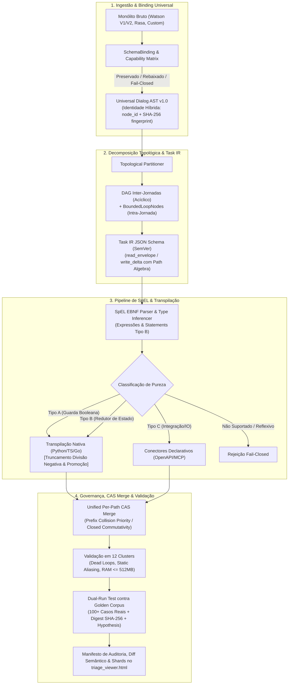

# ADR-0007: North Star do tare.tools.dialog-engine — Motor Universal de Decomposição de Jornadas, Workflows Dinâmicos e Transpilação de SpEL

- **Status:** Ratificado e Aprovado por Consenso Pleno Tripartite (Google, Anthropic e OpenAI — Versão v004 Definitiva)
- **Referência:** `CASE-2026-08-18-DIALOG-ENGINE-NORTH-STAR-V4`
- **Data:** 2026-08-18
- **Autores:** Antigravity Mediator (Consenso Tripartite: Google Gemini 3.7 Flash High, Anthropic Claude 3.7 Sonnet / Fable 5 High, OpenAI GPT-5.6 Sol High; sob governança do Operador Humano)
- **Escopo:** `tare.tools.dialog-engine` (Repositório Standalone Universal & Motor Topológico de Diálogo)

---

## 1. Objetivos Nucleares (In-Scope)

1. **Decomposição Topológica de Jornadas & Bounded Loops:**
   - Separar ontologicamente a **Jornada de Negócio** (contratos canônicos SDD/BDD) da **Árvore de Diálogo Física** (Watson V1, V2 Actions, Rasa, autômatos aninhados).
   - Decompor monólitos de diálogo com 28.000+ nós em um **DAG acíclico inter-jornadas**, preservando ciclos operacionais intra-jornada legítimos (re-prompt de slots, confirmações, digressões) exclusivamente via construtos formais de **Iteração Limitada (`BoundedLoopNode`)** com terminação estaticamente comprovável.
2. **Workflows Dinâmicos Orientados a Tarefas (Blueprint-First-Model-Second & ACG):**
   - Transicionar de autômatos estáticos rígidos para Grafos de Computação Agêntica (*Agentic Computation Graphs - ACG*), modelados sob a especificação formal do **Task IR JSON Schema** com controle semântico de versão (`$schema` SemVer).
   - Governar a execução através de *blueprints determinísticos* (invariantes de segurança, regras de compliance, transições de estado) com *slots dinâmicos tipados* preenchidos por modelos generativos.
   - Implementar decomposição *on-demand* (ADaPT) para particionar nós ambíguos em sub-tarefas de clarificação com garantias de terminação e rollback.
3. **Pipeline de SpEL em 4 Estágios, Gramática EBNF, Semântica de Statements & Golden Corpus:**
   - Extrair a AST de expressões e statements Spring Expression Language (`<? ... ?>`) e classificá-los por pureza (Tipo A: Guardas Booleanas; Tipo B: Redutores de Estado; Tipo C: Ações de Integração/IO).
   - Fixar a gramática formal EBNF e a semântica operacional executável (incluindo statements sequenciais Tipo B com visibilidade *read-your-writes* e linha de base no **Spring Expression Language 5.3+/6.x**), com tratamento normativo para divisão inteira negativa (`math.trunc` / truncamento em direção a zero), promoção numérica e erro *fail-closed* para reflexão.
   - Transpilar para código nativo puro (Python/TS/Go), conectores declarativos (OpenAPI 3.0 / MCP) ou módulos de execução efêmera WASM.
4. **Universal SchemaBinding, Identidade Híbrida & Sharding Adaptativo:**
   - Fornecer camada agnóstica de `SchemaBinding` com especificação normativa da **Universal Dialog AST v1.0**, Matriz de Capacidade por Plataforma e **Identidade Híbrida** (`node_id` lógico de origem persistente + `content_fingerprint` SHA-256) para diferenciação precisa entre nós modificados, adicionados, removidos ou movidos.
   - Executar diff semântico e validação estática em arquivos de 100+ MB através de sharding adaptativo com teto de memória ($\le 512\text{ MB}$) e tempo de execução rigorosamente orçados, expondo o manifesto diretamente no `triage_viewer.html`.
5. **Taxonomia de Validação em 12 Clusters, Álgebra de Context Delta (CAS Unificado) & Dual-Run:**
   - Manter suite de 127+ testes automatizados cobrindo paridade semântica, integridade de saltos (*jumps*), *dead loops* vs. *bounded loops*, scoping de variáveis e detecção estática de corridas.
   - Garantir sincronização atômica através de um **Modelo Unificado de Versionamento por Path com Snapshot Atômico**, detecção de colisões por prefixo hierárquico com prioridade estrita sobre comutatividade e precondições *Compare-And-Swap* (CAS) com retries idempotentes.
   - Medir paridade dual-run contra um **Golden Corpus** canônico imutável de 100+ cenários reais auditáveis com proveniência, assinatura criptográfica SHA-256 e validação baseada em propriedades (*property-based testing* com Hypothesis).

---

## 1.2 Não-Objetivos Explícitos (Via Negativa & Fronteiras Arquiteturais)

1. **Sem Runtime Residente de Chat de Produção:** O `tare.tools.dialog-engine` é uma suíte de engenharia, validação estática, diff semântico, particionamento e simulação CI/CD; ele **não** atua como gateway de mensageria em tempo real em produção.
2. **Sem Chamadas Externas de Rede Durante Análise e Validação:** Toda análise topológica, parsing de SpEL, diff de memória e geração de mutantes ocorre **100% offline**, sem chamadas a APIs da IBM, OpenAI ou webhooks externos.
3. **Sem Oráculo Auto-Referente Desprovido de Baseline:** O dual-run **não** mede equivalência apenas contra um emulador re-implementado; ele afere paridade contra o *Golden Corpus* auditável de execuções capturadas do runtime Java/Spring de referência e vetores de conformidade sintéticos com integridade criptográfica verificada em CI.
4. **Sem Banco de Dados Residente Obrigatório:** O motor opera sobre arquivos locais e estruturas particionadas em memória, sem exigir instâncias ativas de PostgreSQL, MongoDB ou Redis.
5. **Sem Mutação Destrutiva Não-Versionada:** Nenhuma operação de transpilação ou refatoração sobrescreve artefatos sem manifesto de auditoria, diff semântico rastreável e validação prévia de paridade.
6. **Fronteira Estrita de Dependências (Stdlib-Only no Core):** O núcleo do motor (Fases 1 e 2: parser, AST, 12 clusters, particionador, transpilador e analisador estático) utiliza **estritamente Python stdlib**. O executor WASM (Fase 3) é um **plugin/provider opcional e isolado**, preservando a portabilidade absoluta da ferramenta base.

---

## 2. Decisões Arquiteturais Normativas

---

## 3. Matriz de Falsificação & Rastreabilidade

| Requisito / Invariante | Mecanismo de Verificação | Teste / Falsificador Automatizado | Módulo de Implementação |
| :--- | :--- | :--- | :--- |
| **`REQ-DLG-01`: Parsing Seguro de SpEL** | Rejeição fail-closed de recursão, dunder, reflexão `T(...)` e divisão por zero | `tests/test_watson_spel.py` | `src/tare_dialog/spel.py` |
| **`REQ-DLG-02`: Schema Binding Agnóstico** | Auto-descoberta e mapeamento de Watson V1, V2, Rasa e árvores corporativas | `tests/test_schema_adapter.py` | `src/tare_dialog/schema_adapter.py` |
| **`REQ-DLG-03`: Sharding Adaptativo de Memória** | Diff de arquivos $> 100\text{MB}$ com teto de RAM garantido ($\le 512\text{MB}$) | `tests/test_watson_shard.py` | `src/tare_dialog/shard.py` |
| **`REQ-DLG-04`: Validação em 12 Clusters** | Detecção de dead loops, ciclos não-limitados, SpEL malformado e static aliasing | `tests/test_watson_validate.py` | `src/tare_dialog/validate.py` |
| **`REQ-DLG-05`: Álgebra de Context Delta (CAS)** | Rejeição de colisões de prefixo e reconciliação atômica de deltas disjuntos | `tests/test_context_delta.py` | `src/tare_dialog/context.py` |
| **`REQ-DLG-06`: Simulação Offline Sem Rede** | Bloqueio estrito de sockets externos durante a suite de teste | `tests/test_offline_boundary.py` | `src/tare_dialog/runner.py` |
| **`REQ-DLG-07`: Dual-Run contra Golden Corpus** | 100+ casos reais + testes baseados em propriedades (Hypothesis) provando truncamento negativo $(-7/2 = -3)$ | `tests/test_dual_run_parity.py` | `src/tare_dialog/transpiler.py` |
| **`REQ-DLG-08`: Terminação de Bounded Loops** | Falsificação de deadlocks provando escape determinístico após $K_{\max}$ iterações | `tests/test_bounded_loops.py` | `src/tare_dialog/topology.py` |

---

## 4. Roadmap de Implementação em 3 Fases

1. **Fase 1 (Motor Core, Validação em 12 Clusters & Diff Sharded — Atual v0.6):**
   - 127+ testes unitários e de integração passando.
   - `SchemaBinding` universal, SpEL AST lexer e `triage_viewer.html` offline.
2. **Fase 2 (Transpilador de SpEL, Álgebra de Context Delta & Golden Corpus):**
   - Gerador de Task IR a partir de SpEL EBNF e transpilação com correção de divisão inteira negativa (`math.trunc`).
   - Particionador de monólitos em sub-jornadas acíclicas com `BoundedLoopNode`.
   - Golden Corpus versionado e suite de property-based testing com Hypothesis.
3. **Fase 3 (Orquestrador de Workflows Dinâmicos & Execução WASM Isolada):**
   - Runner com suporte a slots dinâmicos (Blueprint-First) e decomposição on-demand (ADaPT).
   - Plugin WASM opcional para execução efêmera em sandbox.
