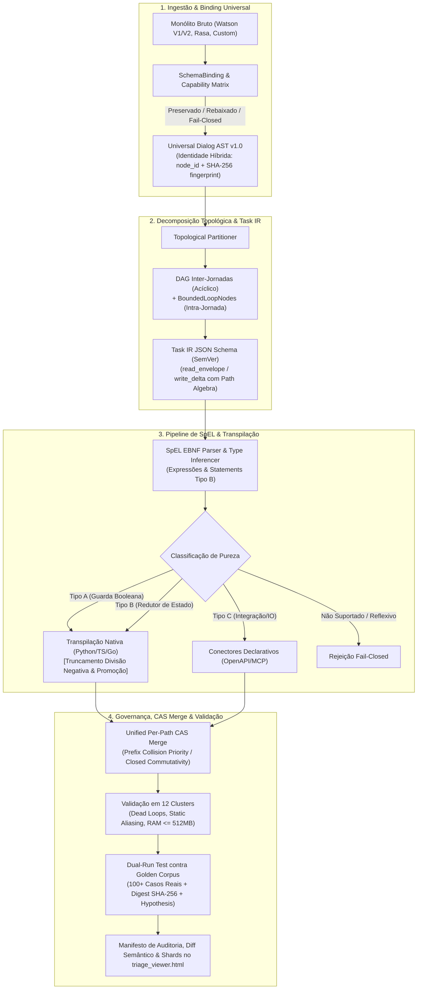

# ADR-047: North Star do tare.tools.dialog-engine — Motor Universal de Decomposição de Jornadas, Workflows Dinâmicos e Transpilação de SpEL

- **Status:** Ratificado e Aprovado por Consenso Pleno Tripartite (Google, Anthropic e OpenAI — Versão v004 Definitiva)
- **Referência:** `CASE-2026-08-18-DIALOG-ENGINE-NORTH-STAR-V4`
- **Data:** 2026-08-18
- **Autores:** Antigravity Mediator (Consenso Tripartite: Google Gemini 3.7 Flash High, Anthropic Claude 3.7 Sonnet / Fable 5 High, OpenAI GPT-5.6 Sol High; sob governança do Operador Humano)
- **Escopo:** `tare.tools.dialog-engine` (Repositório Standalone Universal & Motor Topológico de Diálogo)

---

## 1. Objetivos Nucleares (In-Scope)

1. **Decomposição Topológica de Jornadas & Bounded Loops:**
   - Separar ontologicamente a **Jornada de Negócio** (contratos canônicos SDD/BDD) da **Árvore de Diálogo Física** (Watson V1, V2 Actions, Rasa, autômatos aninhados).
   - Decompor monólitos de diálogo com 28.000+ nós em um **DAG acíclico inter-jornadas**, preservando ciclos operacionais intra-jornada legítimos (re-prompt de slots, confirmações, digressões) exclusivamente via construtos formais de **Iteração Limitada (`BoundedLoopNode`)** com terminação estaticamente comprovável.
2. **Workflows Dinâmicos Orientados a Tarefas (Blueprint-First-Model-Second & ACG):**
   - Transicionar de autômatos estáticos rígidos para Grafos de Computação Agêntica (*Agentic Computation Graphs - ACG*), modelados sob a especificação formal do **Task IR JSON Schema** com controle semântico de versão (`$schema` SemVer).
   - Governar a execução através de *blueprints determinísticos* (invariantes de segurança, regras de compliance, transições de estado) com *slots dinâmicos tipados* preenchidos por modelos generativos.
   - Implementar decomposição *on-demand* (ADaPT) para particionar nós ambíguos em sub-tarefas de clarificação com garantias de terminação e rollback.
3. **Pipeline de SpEL em 4 Estágios, Gramática EBNF, Semântica de Statements & Golden Corpus:**
   - Extrair a AST de expressões e statements Spring Expression Language (`<? ... ?>`) e classificá-los por pureza (Tipo A: Guardas Booleanas; Tipo B: Redutores de Estado; Tipo C: Ações de Integração/IO).
   - Fixar a gramática formal EBNF e a semântica operacional executável (incluindo statements sequenciais Tipo B com visibilidade *read-your-writes* e linha de base no **Spring Expression Language 5.3+/6.x**), com tratamento normativo para divisão inteira negativa (`math.trunc` / truncamento em direção a zero), promoção numérica e erro *fail-closed* para reflexão.
   - Transpilar para código nativo puro (Python/TS/Go), conectores declarativos (OpenAPI 3.0 / MCP) ou módulos de execução efêmera WASM.
4. **Universal SchemaBinding, Identidade Híbrida & Sharding Adaptativo:**
   - Fornecer camada agnóstica de `SchemaBinding` com especificação normativa da **Universal Dialog AST v1.0**, Matriz de Capacidade por Plataforma e **Identidade Híbrida** (`node_id` lógico de origem persistente + `content_fingerprint` SHA-256) para diferenciação precisa entre nós modificados, adicionados, removidos ou movidos.
   - Executar diff semântico e validação estática em arquivos de 100+ MB através de sharding adaptativo com teto de memória ($\le 512\text{ MB}$) e tempo de execução rigorosamente orçados, expondo o manifesto diretamente no `triage_viewer.html`.
5. **Taxonomia de Validação em 12 Clusters, Álgebra de Context Delta (CAS Unificado) & Dual-Run:**
   - Manter suite de 127+ testes automatizados cobrindo paridade semântica, integridade de saltos (*jumps*), *dead loops* vs. *bounded loops*, scoping de variáveis e detecção estática de corridas.
   - Garantir sincronização atômica através de um **Modelo Unificado de Versionamento por Path com Snapshot Atômico**, detecção de colisões por prefixo hierárquico com prioridade estrita sobre comutatividade e precondições *Compare-And-Swap* (CAS) com retries idempotentes.
   - Medir paridade dual-run contra um **Golden Corpus** canônico imutável de 100+ cenários reais auditáveis com proveniência, assinatura criptográfica SHA-256 e validação baseada em propriedades (*property-based testing* com Hypothesis).

---

## 1.2 Não-Objetivos Explícitos (Via Negativa & Fronteiras Arquiteturais)

1. **Sem Runtime Residente de Chat de Produção:** O `tare.tools.dialog-engine` é uma suíte de engenharia, validação estática, diff semântico, particionamento e simulação CI/CD; ele **não** atua como gateway de mensageria em tempo real em produção.
2. **Sem Chamadas Externas de Rede Durante Análise e Validação:** Toda análise topológica, parsing de SpEL, diff de memória e geração de mutantes ocorre **100% offline**, sem chamadas a APIs da IBM, OpenAI ou webhooks externos.
3. **Sem Oráculo Auto-Referente Desprovido de Baseline:** O dual-run **não** mede equivalência apenas contra um emulador re-implementado; ele afere paridade contra o *Golden Corpus* auditável de execuções capturadas do runtime Java/Spring de referência e vetores de conformidade sintéticos com integridade criptográfica verificada em CI.
4. **Sem Banco de Dados Residente Obrigatório:** O motor opera sobre arquivos locais e estruturas particionadas em memória, sem exigir instâncias ativas de PostgreSQL, MongoDB ou Redis.
5. **Sem Mutação Destrutiva Não-Versionada:** Nenhuma operação de transpilação ou refatoração sobrescreve artefatos sem manifesto de auditoria, diff semântico rastreável e validação prévia de paridade.
6. **Fronteira Estrita de Dependências (Stdlib-Only no Core):** O núcleo do motor (Fases 1 e 2: parser, AST, 12 clusters, particionador, transpilador e analisador estático) utiliza **estritamente Python stdlib**. O executor WASM (Fase 3) é um **plugin/provider opcional e isolado**, preservando a portabilidade absoluta da ferramenta base.

---

## 2. Decisões Arquiteturais Normativas



---

### A. Universal Dialog AST v1.0, Identidade Híbrida & SchemaBinding

1. **Modelo de Identidade Híbrida (Identity vs. Fingerprint):**
   - **Identificador de Origem Persistente (`node_id`):** UUID v5 determinístico gerado a partir do namespace canônico da jornada e da chave lógica de origem do nó (`source_origin_id` ou caminho estrutural estável na árvore de diálogo de negócio). O `node_id` é **invariante a modificações de conteúdo** (alterações de prompts, textos ou expressões de guarda mantêm o mesmo `node_id`).
   - **Fingerprint de Conteúdo (`content_fingerprint`):** Hash SHA-256 canônico calculado sobre a serialização determinística (chaves ordenadas, whitespace normalizado) das propriedades semânticas do nó (expressões de guarda, *PromptVariants*, contexto e transições).
   - **Álgebra de Diff Semântico Normativa:**
     - **Unchanged:** $\text{node\_id}_A = \text{node\_id}_B \land \text{content\_fingerprint}_A = \text{content\_fingerprint}_B$.
     - **Modified:** $\text{node\_id}_A = \text{node\_id}_B \land \text{content\_fingerprint}_A \neq \text{content\_fingerprint}_B$ (o diff semântico isola exatamente os campos mutados sem tratar o nó como deletado/criado).
     - **Added / Deleted:** $\text{node\_id}$ presente em apenas um dos manifestos.
     - **Moved / Reordered:** $\text{node\_id}_A = \text{node\_id}_B \land \text{parent\_id}_A \neq \text{parent\_id}_B \lor \text{priority\_rank}_A \neq \text{priority\_rank}_B$.

2. **Semântica Operacional da AST & Política de Schema:**
   - **Ordem Estrita de Condições:** Ramos de nós filhos possuem ordenação determinística expressa por índices inteiros contíguos (`priority_rank: int`). A avaliação ocorre sequencialmente em curto-circuito (*first-match-wins*).
   - **Fallback Explícito:** Todo nó de decisão sem guarda booleana explícita ou default é tipado como `FallbackBranch`, avaliado somente se todas as guardas precedentes falharem.
   - **Escopo e Visibilidade:** Três escopos formais são mantidos: `global` (sessão persistente), `journey` (sub-jornada ativa) e `transient` (ciclo do turno de diálogo).
   - **Evolução do Schema ($schema & SemVer):** O schema (`https://tare.tools/schemas/dialog-ast-v1.json`) adota SemVer estrito. Campos adicionais devem ser opcionais e retrocompatíveis (versões minor/patch); quebras semânticas exigem incremento de major version (`dialog-ast-v2.json`).

3. **Matriz de Capacidade por Plataforma (Preservado, Rebaixado, Rejeitado):**

| Recurso / Campo Original | Watson V1 Classic | Watson V2 Actions | Rasa 3.x Domain/Rules | Ação do SchemaBinding |
| :--- | :--- | :--- | :--- | :--- |
| **Condições Ordenadas** | `conditions` | `condition` | `rules` / `stories` | **Preservado:** Mapeado para `priority_rank` na AST. |
| **Respostas com Variações** | `output.generic` | `action.response` | `utter_xxx` | **Preservado:** Mapeado para `PromptVariants`. |
| **Digressões / Retornos** | `digression` | `digressions` | `slots` / `checkpoints` | **Preservado:** Convertido em `BoundedLoopNode` ou salto explícito de sub-jornada. |
| **Manipulação de Contexto SpEL** | `context` com SpEL | Session Variables | Custom Actions (Python) | **Preservado:** Parseado via EBNF Tipo B; ver Seção B. |
| **Scripts / Tags HTML em Texto** | `output.text` | Rich Text | Custom Payload | **Rebaixado:** Sanitizado para texto puro estruturado + anotações de layout no Task IR. |
| **Ações Java Nativas / Reflexão** | Classes Java / `T(...)` | N/A | N/A | **Rejeitado (Fail-Closed):** Interrupção com erro estático estruturado (`ERR_UNSUPPORTED_JAVA_BINDING`). |
| **Extensões Não-Catalogadas** | Campos desconhecidos | Campos desconhecidos | Custom slot types não mapeados | **Rejeitado (Fail-Closed):** Proibida auto-descoberta permissiva; exige declaração no schema. |

---

### B. Subconjunto Formal de SpEL, EBNF, Semântica de Statements & Oráculo Dual-Run

1. **Linha de Base Normativa:**
   - O subconjunto SpEL suportado adota como especificação de referência o **Spring Expression Language (SpEL) conforme implementado no Spring Framework 5.3+ / 6.x**.

2. **Gramática Formal EBNF (Expressões & Statements Tipo B):**
   ```ebnf
   (* Unidade de Compilação: Expressão Pura (Tipo A) ou Bloco de Redução de Estado (Tipo B) *)
   SpELCompilationUnit ::= StatementList | Expression
   
   (* Statements e Redutores Tipo B *)
   StatementList       ::= Statement ( ';' Statement )* ';'?
   Statement           ::= AssignmentStmt | AugAssignmentStmt
   AssignmentStmt      ::= TargetLValue '=' Expression
   AugAssignmentStmt   ::= TargetLValue ('+=' | '-=' | '*=' | '/=') Expression
   TargetLValue        ::= ContextPath
   ContextPath         ::= ContextRoot ( '.' Identifier | '[' (StringLiteral | IntegerLiteral) ']' )*
   ContextRoot         ::= 'context' | 'session' | 'entities' | 'input'

   (* Expressões Puras Tipo A / RHS *)
   Expression          ::= LogicalOrExpr
   LogicalOrExpr       ::= LogicalAndExpr ( ('or' | '||') LogicalAndExpr )*
   LogicalAndExpr      ::= EqualityExpr ( ('and' | '&&') EqualityExpr )*
   EqualityExpr        ::= RelationalExpr ( ('==' | '!=') RelationalExpr )*
   RelationalExpr      ::= AdditiveExpr ( ('<' | '<=' | '>' | '>=') AdditiveExpr )?
   AdditiveExpr        ::= MultiplicativeExpr ( ('+' | '-') MultiplicativeExpr )*
   MultiplicativeExpr  ::= UnaryExpr ( ('*' | '/' | '%') UnaryExpr )*
   UnaryExpr           ::= ('not' | '!' | '+' | '-')? PrimaryExpr
   PrimaryExpr         ::= Literal | VariableRef | SafeNavExpr | IndexExpr | ProjectionExpr | '(' Expression ')'
   SafeNavExpr         ::= VariableRef '?.' Identifier ( '?.' Identifier )*
   IndexExpr           ::= (VariableRef | Identifier) '[' (Literal | Expression) ']'
   ProjectionExpr      ::= VariableRef '.?[' Expression ']'
   VariableRef         ::= '#' ContextPath
   Literal             ::= StringLiteral | IntegerLiteral | FloatLiteral | BooleanLiteral | 'null'
   Identifier          ::= [a-zA-Z_][a-zA-Z0-9_]*
   ```

3. **Semântica Operacional de Statements Tipo B & Visibilidade *Read-Your-Writes*:**
   - **Estado Transitório Local ($\sigma_{\text{local}}$):** A execução de um bloco de statements Tipo B opera sobre uma cópia de trabalho efêmera $\sigma_{\text{local}}$, inicializada a partir do snapshot imutável $\sigma_{\text{snap}}$ capturado no início da tarefa.
   - **Ordem Sequencial Estrita:** Os statements $S_1; S_2; \dots; S_n$ são avaliados de forma estritamente sequencial. A avaliação da expressão à direita (RHS) do statement $S_k$ lê os valores vigentes em $\sigma_{\text{local}}^{(k-1)}$, e a atribuição ao `TargetLValue` atualiza imediatamente $\sigma_{\text{local}}^{(k)}$ (*read-your-writes* intra-task).
   - **Verificação Estática de Aliasing & Proibição de Ambiguidade de Path:**
     - Uma variável não pode ser redefinida como estrutura incompatível (ex: atribuir um escalar a um path previamente tratado como mapa).
     - Caminhos mutados no mesmo bloco com sobreposição de prefixo (ex: `context.cliente` e `context.cliente.nome`) devem ter precedência de inicialização resolvida estaticamente; mutações conflitantes no mesmo statement geram erro de compilação `ERR_SPEL_STATIC_ALIASING`.
   - **Compilação Determinística para `Task IR`:**
     - O compilador extrai o `read_envelope` como a união de todos os paths lidos **antes** de qualquer escrita local sobrescrevê-los.
     - O compilador extrai o `write_delta` final colapsado como o conjunto líquido de mutações $\Delta = \sigma_{\text{local}}^{(n)} \setminus \sigma_{\text{snap}}$, com operações normalizadas (`SET`, `INCREMENT`).

4. **Tabela Normativa de Promoção Numérica, Coerção e Transpilação:**

| Operador / Expressão | Tipos dos Operandos | Semântica Normativa (Spring 5.3+ Baseline) | Regra de Transpilação Estrita (Python / TS / Go) |
| :--- | :--- | :--- | :--- |
| **Divisão Inteira (`/`)** | `int / int` (ex: `1 / 2`) | **Truncamento em direção a zero** $\to `0`$ | **Python:** `math.trunc(a / b)` *(proibido `a // b` puro sem correção)* \| **TS:** `Math.trunc(a / b)` \| **Go:** `a / b` |
| **Divisão Inteira Negativa** | `int / int` (ex: `-7 / 2`, `7 / -2`) | **Truncamento em direção a zero** $\to `-3`$ *(Spring/Java standard: $-7/2 = -3$)* | **Python:** `math.trunc(a / b)` *(retorna `-3`, corrigindo o floor `-4` do Python)* \| **TS:** `Math.trunc(a / b)` \| **Go:** `a / b` |
| **Divisão Ponto Flutuante** | `float / int` ou `float / float` | **Divisão IEEE 754** (ex: `1.0 / 2 \to 0.5`) | **Python/TS/Go:** `float(a) / float(b)` |
| **Adição (`+`)** | `String + Qualquer` | **Concatenação de strings** (ex: `'1' + 1 \to '11'`; `'v:' + null \to 'v:null'`) | Coerção explícita para string em todos os targets |
| **Aritmética com `null`** | `null + N`, `null * N`, `null - N` | **Erro de Execução Determinístico** | Dispara `SpELNullArithmeticException` estática |
| **Navegação Segura (`?.`)** | Alvo é `null` (ex: `#context?.cliente?.nome`) | **Curto-circuito para `null`** sem erro | Mapeado para `getattr(..., None)` / Optional Chaining `?.` |
| **Igualdade (`==`, `!=`)** | Tipos Primitivos / Literais / `null` | Igualdade por valor (`null == null \to true`; `1 == '1' \to false`) | Comparação estrita de tipo e valor |
| **Construções Rejeitadas** | `T(...)`, `new ...`, `getClass()`, `exec()` | **Fail-Closed Imediato** | Erro estático estruturado `ERR_SPEL_FORBIDDEN_CONSTRUCT` |

5. **EvaluationContext Normativo:**
   - O contexto de avaliação restringe-se a instâncias imutáveis de `ReadOnlyEvaluationContext` expondo exclusivamente as raízes `#context`, `#session`, `#entities` e `#input`.
   - Remoção de qualquer `TypeLocator`, `TypeConverter` arbitrário ou acesso a métodos reflexivos do runtime hospedeiro.

6. **Golden Corpus Versionado, Assinatura Criptográfica & Property-Based Testing:**
   - **Schema JSON Normativo do Golden Corpus:**
     ```json
     {
       "$schema": "https://tare.tools/schemas/golden-corpus-v1.json",
       "corpus_version": "1.0.0",
       "corpus_sha256": "4a7d88e6a2bc912389d44f128c7921a9956d35272a818c352a9263a241b12b50",
       "cases": [
         {
           "case_id": "SPEL-DIV-NEG-001",
           "source_runtime": "Watson-V1-Spring-5.3.27",
           "capture_date": "2026-08-18",
           "expression": "-7 / 2",
           "input_context": {},
           "expected_output": -3,
           "expected_type": "int",
           "case_sha256": "8f3b2591a27e4e15031b2649b581c81ef40d46b864a66a1a1961e68a18357e62"
         }
       ]
     }
     ```
   - **Imutabilidade e Verificação Criptográfica em CI:** Todo manifesto do Golden Corpus possui `corpus_sha256` calculado sobre o payload canônico. O CI rejeita qualquer execução cujo hash de manifesto ou de caso individual divirja do conteúdo serializado (`ERR_CORPUS_INTEGRITY_DRIFT`).
   - **Testes por Propriedades (Hypothesis):** A suíte executa testes baseados em propriedades gerando centenas de milhares de pares de operandos inteiros com sinais mistos ($a \in [-2^{31}, 2^{31}-1], b \in [-2^{31}, 2^{31}-1] \setminus \{0\}$) para garantir equivalência matemática absoluta entre o compilador Python (`math.trunc`), TypeScript e Go.

---

### C. Task IR & Semântica Algébrica de Context Delta Merge (CAS Unificado)

1. **Especificação do Task IR (JSON Schema Normativo com SemVer):**
   ```json
   {
     "$schema": "https://tare.tools/schemas/task-ir-v1.0.0.json",
     "task_id": "task_auth_validate_cpf",
     "sub_journey_id": "journey_onboarding",
     "read_envelope": [
       {"path": "context.cpf", "required_type": "string"},
       {"path": "context.tentativas", "required_type": "integer"}
     ],
     "write_delta": [
       {"path": "context.cpf_valido", "operation": "SET", "target_type": "boolean"},
       {"path": "context.tentativas", "operation": "INCREMENT", "target_type": "integer"}
     ],
     "pure_classification": "TYPE_B_STATE_REDUCER",
     "commutativity_class": "MONOTONIC_COUNTER_ADD",
     "termination_invariant": "context.tentativas <= 3"
   }
   ```

2. **Modelo Unificado de Versionamento por Path com Snapshot Atômico:**
   - Cada nó folha do estado do contexto armazena a tupla $\langle \text{valor}, \text{rev}: \text{int} \rangle$.
   - No início da transação, o snapshot local registra o par de controle $\langle \text{path}, \text{rev}_{\text{base}} \rangle$ para todos os itens do `read_envelope`.
   - **Regra de Detecção de Colisão por Prefixo (Prefix Collision Priority):**
     - Se uma tarefa $T_1$ muta `context.cliente` e uma tarefa concorrente $T_2$ muta `context.cliente.nome`, ocorre **colisão estrita por sobreposição de prefixo**.
     - A colisão por prefixo tem **prioridade estrita** sobre qualquer classe de comutatividade: a mesclagem falha imediatamente com `ERR_CAS_PREFIX_COLLISION`, exigindo re-execução de $T_2$ sobre o novo snapshot.
   - **Classes Fechadas de Comutatividade:**
     - Apenas operações estritamente comutativas em paths disjuntos (`INCREMENT` numérico atômico, `SET_ADD` de elementos únicos em conjuntos) são reconciliáveis automaticamente em caso de colisão de versão sem conflito de prefixo.

---

### D. Decomposição de Jornadas, Bounded Loops & Dynamic Workflows (ACG)

1. **Particionamento em Sub-Jornadas & DAG Inter-Jornadas:**
   - O grafo global é particionado em sub-jornadas estritamente **acíclicas entre si** (DAG de jornadas).
   - Saltos de transição inter-jornadas são explicitados como arestas dirigidas $(J_a \to J_b)$.

2. **Construto Formal `BoundedLoopNode` para Ciclos Intra-Jornada:**
   - Ciclos operacionais legítimos dentro de uma mesma sub-jornada (ex: repetição de menu, re-coleta de slot inválido, confirmação) são obrigatoriamente encapsulados em um **`BoundedLoopNode`**.
   - Cada `BoundedLoopNode` define formalmente:
     - **Variável de Controle de Iteração:** Ex: `context.tentativas_slot_cpf`.
     - **Teto Máximo Estático ($K_{\max}$):** Inteiro positivo fixo (ex: $K_{\max} = 3$).
     - **Ramo de Escape Forçado (*Deadlock Breaker*):** Rota determinística disparada compulsoriamente se o teto de iterações for atingido sem resolução (ex: transição direta para `journey_human_handoff`).
   - A ferramenta de validação estática (**Cluster 3**) detecta e rejeita qualquer ciclo intra-jornada que não esteja encapsulado em um `BoundedLoopNode` com garantia estática de terminação.

3. **Governança de Slots Dinâmicos (Blueprint-First-Model-Second):**
   - O orquestrador impõe limites estritos de execução sobre nós generativos:
     - **Budget de Tokens:** Capped por turno (ex: $\le 1000$ tokens).
     - **Timeout de Execução:** $\le 3000\text{ms}$.
     - **Fallback Determinístico:** Se o modelo exceder o tempo ou falhar no preenchimento de schema, o orquestrador rebaixa imediatamente para a árvore de decisão estática tradicional.

---

## 3. Matriz de Falsificação & Rastreabilidade

| Requisito / Invariante | Mecanismo de Verificação | Teste / Falsificador Automatizado | Módulo de Implementação |
| :--- | :--- | :--- | :--- |
| **`REQ-DLG-01`: Parsing Seguro de SpEL** | Rejeição fail-closed de recursão, dunder, reflexão `T(...)` e divisão por zero | `tests/test_watson_spel.py` | `src/tare_dialog/spel.py` |
| **`REQ-DLG-02`: Schema Binding Agnóstico** | Auto-descoberta e mapeamento de Watson V1, V2, Rasa e árvores corporativas | `tests/test_schema_adapter.py` | `src/tare_dialog/schema_adapter.py` |
| **`REQ-DLG-03`: Sharding Adaptativo de Memória** | Diff de arquivos $> 100\text{MB}$ com teto de RAM garantido ($\le 512\text{MB}$) | `tests/test_watson_shard.py` | `src/tare_dialog/shard.py` |
| **`REQ-DLG-04`: Validação em 12 Clusters** | Detecção de dead loops, ciclos não-limitados, SpEL malformado e static aliasing | `tests/test_watson_validate.py` | `src/tare_dialog/validate.py` |
| **`REQ-DLG-05`: Álgebra de Context Delta (CAS)** | Rejeição de colisões de prefixo e reconciliação atômica de deltas disjuntos | `tests/test_context_delta.py` | `src/tare_dialog/context.py` |
| **`REQ-DLG-06`: Simulação Offline Sem Rede** | Bloqueio estrito de sockets externos durante a suite de teste | `tests/test_offline_boundary.py` | `src/tare_dialog/runner.py` |
| **`REQ-DLG-07`: Dual-Run contra Golden Corpus** | 100+ casos reais + testes baseados em propriedades (Hypothesis) provando truncamento negativo $(-7/2 = -3)$ | `tests/test_dual_run_parity.py` | `src/tare_dialog/transpiler.py` |
| **`REQ-DLG-08`: Terminação de Bounded Loops** | Falsificação de deadlocks provando escape determinístico após $K_{\max}$ iterações | `tests/test_bounded_loops.py` | `src/tare_dialog/topology.py` |

---

## 4. Roadmap de Implementação em 3 Fases

1. **Fase 1 (Motor Core, Validação em 12 Clusters & Diff Sharded — Atual v0.6):**
   - 127+ testes unitários e de integração passando.
   - `SchemaBinding` universal, SpEL AST lexer e `triage_viewer.html` offline.
2. **Fase 2 (Transpilador de SpEL, Álgebra de Context Delta & Golden Corpus):**
   - Gerador de Task IR a partir de SpEL EBNF e transpilação com correção de divisão inteira negativa (`math.trunc`).
   - Particionador de monólitos em sub-jornadas acíclicas com `BoundedLoopNode`.
   - Golden Corpus versionado e suite de property-based testing com Hypothesis.
3. **Fase 3 (Orquestrador de Workflows Dinâmicos & Execução WASM Isolada):**
   - Runner com suporte a slots dinâmicos (Blueprint-First) e decomposição on-demand (ADaPT).
   - Plugin WASM opcional para execução efêmera em sandbox.
