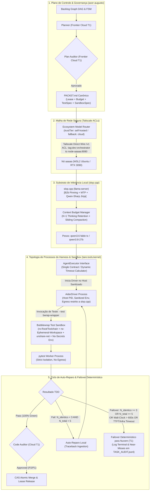
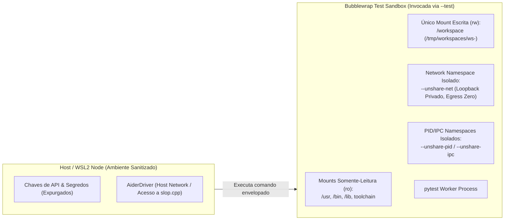

# ADR-048: Substrato de Inferência Local, Harness Agêntico e Aceleração Empírica de Hardware

- **Status:** Ratificado e Aprovado por Consenso Pleno Tripartite (Google, Anthropic e OpenAI — Versão v004 Definitiva)
- **Referência:** `CASE-2026-08-18-LOCAL-INFERENCE-SUBSTRATE-AND-HARNESS-V4`
- **Data:** 2026-08-18
- **Autores:** Antigravity Mediator sob deliberação tripartite (OpenAI Codex, Google Gemini 3.7, Anthropic Claude Fable 5) e direção de Engenharia Humana
- **Escopo:** `tare.tools.os`, `tare.tools.kernel`, `slop.cpp`, `tare.tools.local-labs` e Substrato de Execução Local

---

## 1. Contexto & Problema Arquitetural

Com a consolidação da arquitetura descentralizada do `tare.tools.os` ([ADR-044](file:///C:/projects/tare.tools.os/docs/ADR-044_SPECGRAPH_NORTH_STAR_UNIVERSAL_PROJECT_INTELLIGENCE.md) a [ADR-047](file:///C:/projects/tare.tools.os/docs/ADR-047_DIALOG_ENGINE_NORTH_STAR.md)), o ecossistema atingiu quórum formal para orquestração de DAGs, microkernel de 5 planos, inteligência de código e decomposição de jornadas.

A materialização física das tarefas de implementação e testes exigiu o fechamento determinístico de restrições operacionais, físicas e de segurança identificadas nas deliberações das Rodadas 1, 2 e 3:
1. **Topologia de Processos e Contenção de Egress do Driver:** Posicionar o `AiderDriver` dentro de um namespace `--unshare-net` inviabiliza o acesso HTTP ao endpoint `slop.cpp` (`Network is unreachable`). Por outro lado, executá-lo no host sem contenção faria seu subprocesso interno de testes herdar a rede e credenciais do host. A topologia exige segregação estrita: driver fora da sandbox de rede, mas todo comando de teste envelopado em sandbox hermética.
2. **Isolamento de Metadados Git em Workspaces Efêmeros:** Worktrees Git vinculados dependem de metadados administrativos e travas de índice (`.git/worktrees/.../index.lock`) localizados no repositório principal do host. Montar apenas o diretório de trabalho como `rw` bloqueia comandos como `git add` e `git status`.
3. **Calibração Física de TTFT e Prefill em Cache Frio:** Um timeout fixo de TTFT de 5s colide com a física de prefill em cache frio na RTX 3090, onde a avaliação de prompts de 15k–18k tokens consome entre 9s e 30s no primeiro turno, provocando 100% de failovers espúrios.
4. **Determinismo no Orçamento de Reparo ($T_2 \to T_1$):** Garantia estrita de que $N_{\text{total}} \le 5$ (1 execução inicial + até 4 reparos), sem autorização para uma 6ª tentativa.
5. **Telemetria de Cache, Compaction e Governança:** Reter `<think>` em excesso esgota a VRAM (24 GB), demandando $K=1$ com compactação adiada em lote, telemetria nativa rastreável de $R_{\text{cache}}$, padronização do template anti-preâmbulo (*Qwen-Sharp*) e auditoria $T_1$ obrigatória para P2 e P1.

---

## 2. Decisões Arquiteturais Sintetizadas (Objetivos In-Scope)



---

### 2.1 Harness Agêntico Canônico: Interface `AgentExecutor` e Contrato do Driver Aider

Fica ratificada a **Opção 3 em formato enxuto (Kernel Task Adapter)**, com um contrato canônico estrito e suporte imediato ao driver **Aider**:

1. **Contrato Canônico de Execução e Calibração Física (`AgentExecutor`):**
   ```python
   from dataclasses import dataclass, field
   from pathlib import Path
   from typing import Literal, Any

   @dataclass(frozen=True)
   class NodeProfile:
       """Métricas empíricas aferidas na qualificação do nó (Gate 1)."""
       prefill_tokens_per_second: float = 650.0   # Taxa média de prefill (RTX 3090 ~27B)
       decode_tokens_per_second: float = 32.0     # Taxa média de decode
       safety_margin_factor: float = 2.0          # Fator de segurança operacional

   @dataclass(frozen=True)
   class TimeoutSpec:
       connection_timeout_seconds: float = 5.0    # Handshake TCP inicial com slop.cpp
       first_token_timeout_cold_seconds: float = 60.0 # Teto generoso para cache frio (15k-18k tokens)
       first_token_timeout_warm_seconds: float = 10.0 # Teto estrito para cache quente (R_cache >= 0.90)
       token_stall_seconds: float = 10.0          # Inatividade máxima entre tokens no stream
       request_completion_seconds: float = 120.0  # Teto máximo por requisição HTTP completa
       wall_clock_seconds: float = 600.0          # Teto global da tarefa inteira

       @classmethod
       def derive_from_profile(cls, profile: NodeProfile, prompt_tokens: int, expected_r_cache: float) -> "TimeoutSpec":
           """Calcula timeouts físicos dinâmicos com base no estado do cache e no perfil do nó."""
           uncached_tokens = prompt_tokens * (1.0 - expected_r_cache)
           calculated_prefill_time = (uncached_tokens / max(profile.prefill_tokens_per_second, 1.0)) * profile.safety_margin_factor
           
           if expected_r_cache >= 0.90:
               ft_timeout = max(10.0, calculated_prefill_time)
           else:
               ft_timeout = max(30.0, min(90.0, calculated_prefill_time + 15.0))
               
           return cls(
               connection_timeout_seconds=5.0,
               first_token_timeout_cold_seconds=ft_timeout if expected_r_cache < 0.90 else 60.0,
               first_token_timeout_warm_seconds=ft_timeout if expected_r_cache >= 0.90 else 10.0,
               token_stall_seconds=10.0,
               request_completion_seconds=min(180.0, max(60.0, ft_timeout + (500 / profile.decode_tokens_per_second) * profile.safety_margin_factor)),
               wall_clock_seconds=600.0
           )

   @dataclass(frozen=True)
   class JobSpec:
       task_id: str
       lease_id: str
       workspace_path: Path
       packet_path: Path
       allowed_commands: list[str]
       timeouts: TimeoutSpec = field(default_factory=TimeoutSpec)
       max_total_attempts: int = 5                # 1 execução inicial + até 4 reparos

   @dataclass(frozen=True)
   class JobResult:
       task_id: str
       lease_id: str
       status: Literal["SUCCESS", "REPAIRABLE_FAILURE", "EXHAUSTED_FAILOVER", "SECURITY_VIOLATION"]
       patch_diff: str
       test_stdout: str
       test_exit_code: int
       attempt_number: int                        # 1-indexed: 1 = inicial, 2..5 = reparos
       structural_error_hash: str | None
       failover_reason: Literal[
           "HASH_SATURATED",
           "ITERATION_CEILING",
           "WALL_CLOCK_TIMEOUT",
           "TTFT_TIMEOUT",
           "TOKEN_STALL_TIMEOUT",
           "REQUEST_TIMEOUT",
           "INFRA_OOM",
           "INFRA_CRASH",
           "SECURITY_VIOLATION"
       ] | None
       telemetry: dict[str, Any]                  # cached_tokens, prompt_eval_time_ms, r_cache, near_miss_flag
   ```

2. **Topologia de Três Processos e Parametrização do AiderDriver:**
   - **Processo 1 (Kernel Orchestrator):** Roda no host, sanitiza o ambiente, instancia o workspace e monitora os limites de tempo e telemetria.
   - **Processo 2 (AiderDriver):** Roda fora do namespace de rede da sandbox, em ambiente sanitizado, com egress de rede restrito por política exclusivamente ao endpoint `http://<tailscale-node>:8080/v1`.
   - **Processo 3 (Sandbox de Testes Envelopada):** O Aider é parametrizado para que todo comando de teste execute via wrapper Bubblewrap hermético:
     ```bash
     aider --architect \
           --no-auto-commits \
           --no-git-attribute-author \
           --no-suggest-shell-commands \
           --test "bwrap --ro-bind /usr /usr \
                         --ro-bind /bin /bin \
                         --ro-bind /lib /lib \
                         --ro-bind /lib64 /lib64 \
                         --ro-bind /etc/alternatives /etc/alternatives \
                         --ro-bind /opt /opt \
                         --ro-bind /root/.pyenv /root/.pyenv \
                         --rw-bind /tmp/workspaces/ws-<task_id> /workspace \
                         --chdir /workspace \
                         --unshare-net \
                         --unshare-pid \
                         --unshare-ipc \
                         --proc /proc \
                         --dev /dev \
                         pytest"
     ```
   - O patch resultante é extraído cirurgicamente via `git diff` no workspace efêmero.

3. **Ciclo de Vida do Workspace e Isolamento Git:**
   - Para garantir total hermeticidade sem depender do repositório raiz do host, cada tarefa é executada em um **clone local efêmero e descartável** (`git clone --local --shared /repo /tmp/workspaces/ws-<task_id>`).
   - Com todos os metadados administrativos e travas (`index.lock`) residindo estritamente dentro de `/tmp/workspaces/ws-<task_id>`, comandos autorizados (`git status`, `git add`, `git diff`) operam sem falhas de permissão e sem risco de contaminação do repositório principal.
   - O workspace é destruído atomicamente ao término ou failover da tarefa.

---

### 2.2 Fronteira de Sandboxing Executável e Contenção de Segurança



1. **Executor de Sandbox Obrigatório (`BubblewrapExecutor`):**
   - **Isolamento de Filesystem:** `/workspace` é o único ponto de montagem `rw`. A raiz do sistema, binários autorizados e toolchains Python são montados como `ro`. Diretórios de credenciais (`~/.ssh`, `~/.aws`, `~/.gnupg`) e `/tmp` do host são completamente omitidos ou mascarados com `tmpfs` vazio.
   - **Isolamento de Processos (PID/IPC):** Namespaces dedicados (`--unshare-pid`, `--unshare-ipc`) impedem inspeção ou sinalização de processos do host.
   - **Isolamento de Rede (*Strict No-Egress*):** Namespace de rede desvinculado (`--unshare-net`). O loopback é privado do namespace da sandbox, bloqueando qualquer comunicação com o host ou com a rede externa (`Network is unreachable`).

2. **Boot Gate & CI/CD Validation:**
   - **Worker Boot Gate:** Antes de aceitar leases no nó `aaaaa`, o worker executa obrigatoriamente a suíte `tests/security/test_sandbox_negative.py`. Se o kernel WSL2 perder suporte a namespaces ou o `bwrap` regredir, o nó se auto-desqualifica imediatamente (*fail-closed*).
   - **Pipeline CI/CD:** A suíte de testes de segurança negativa é executada em ambiente isolado no CI do `tare.tools.kernel` antes de qualquer liberação de versão.

---

### 2.3 Política de Contexto, Thinking Retention & Telemetria Real de KV-Cache

1. **Política de Orçamento de Contexto e Compactação de `<think>`:**
   - **Retenção Deslizante ($K=1$):** O bloco `<think>` completo é preservado estritamente para o turno anterior imediato.
   - **Compactação Adiada em Lotes (*Batch Deferred Compaction*):** Preserva a invariante $R_{\text{cache}} \ge 0.90$ aplicando a compactação de blocos históricos determinísticamente na fronteira dos turnos.
   - **Teto Rígido de Contexto:** $18.000$ tokens no total.

2. **Adaptador de Telemetria de Cache e Registro de Near-Misses (`LocalLabsTelemetryAdapter`):**
   - Implementado no `tare.tools.local-labs`, consumindo dados nativos do `slop.cpp`:
     $$R_{\text{cache}} = \frac{\text{usage.prompt_tokens_details.cached\_tokens}}{\text{usage.prompt\_tokens}}$$
   - Caso o servidor não retorne `cached_tokens`, afere-se a derivada de `prompt_eval_time_ms`.
   - **Detecção de Quase-Acidentes (*Near-Misses*):** Requisições que consumirem $> 80\%$ do teto de TTFT ou stall sem estourar o limite são marcadas com `near_miss_flag: true` e registradas em `TASK_AUDIT.jsonl` para recalibração proativa de orçamentos.

---

### 2.4 Máquina de Estados de Auto-Reparo e Failover Determinístico ($T_2 \to T_1$)

1. **Critérios Estritos de Auto-Reparo Local ($T_2$):**
   - Tentativa $N=1$: Execução inicial com `PACKET.md` e suíte de testes.
   - Se os testes falharem: calcula-se o hash estrutural do erro $H_{\text{err}} = \text{SHA-256}(\text{normalized\_traceback})$.
   - Auto-reparo é autorizado **SE E SOMENTE SE**:
     1. $N_{\text{total}} < 5$ (máximo de 4 reparos locais);
     2. A contagem de repetições do mesmo hash for estritamente menor que 3 ($C(H_{\text{err}}) < 3$);
     3. O tempo total decorrido for $\le 600\text{s}$.

2. **Transição Imediata para Nuvem ($T_1$):**
   - Ocorre compulsoriamente se:
     - $C(H_{\text{err}}) \ge 3$ (loop estagnado com o mesmo erro estrutural);
     - $N_{\text{total}} \ge 5$ (orçamento de iterações esgotado);
     - Timeout físico (TTFT, stall ou wall-clock);
     - Falha de infraestrutura (VRAM OOM, crash do socket HTTP).
   - O worker local limpa o workspace, registra o motivo estruturado em `TASK_AUDIT.jsonl` e devolve a lease para o microkernel escalar para o Google Gemini 3.7 Medium / OpenAI Codex.

---

## 2.5 Não-Objetivos Explícitos (Via Negativa & Fronteiras Arquiteturais)

1. **Sem Treinamento / Pre-training em Larga Escala no Nó Local:** O nó `aaaaa` é dedicado exclusivamente a **inferência de alta performance, quantização GGUF, fine-tunes pontuais (LoRA) e qualificação empírica de modelos**, não a treinamento massivo de modelos fundacionais.
2. **Sem Substituição da Mesa Redonda Tripartite por Modelos Locais:** A Mesa Redonda e a deliberação de North Stars continuam exigindo o quórum formal tripartite de modelos de fronteira em nuvem (Google Gemini 3.7 High, Anthropic Claude Fable 5 High, OpenAI GPT-5.6 Sol High). O substrato local **não** substitui a governança de alto nível.
3. **Sem Reescrita Monolítica do `tare.tools.harness`:** O protótipo v1 legado permanece formalmente descontinuado. É terminantemente proibida a ressuscitação do seu monólito acoplado de 186 módulos.
4. **Sem Exposição Pública Não-Autenticada na WAN:** O endpoint do `llama-server` opera restrito à VPN Tailscale e à rede local segura, com portas fechadas para tráfego aberto de internet.
5. **Sem Auto-Aprovação de Código Local (Zero Self-Auditing Inviolável):** O modelo local **não pode** aprovar ou auditar o próprio código gerado. Todo código implementado localmente deve ser compulsoriamente submetido ao Code Auditor (OpenAI Codex) e à suíte de testes falsificadores do `pytest`.

---

## 3. Matriz de Rastreabilidade & Falsificação

| Requisito / Invariante | Mecanismo de Verificação | Teste / Falsificador Automatizado | Módulo de Implementação |
| :--- | :--- | :--- | :--- |
| **`REQ-LOC-01`: Zero Leakage de Cota** | Bloqueio de chamadas a APIs cloud durante loops de implementação T2 | `tests/test_local_zero_spend.py` | `relay/resource_telemetry.py` |
| **`REQ-LOC-02`: Thinking Retention KV-Cache** | Telemetria de cache hit no `slop.cpp` ($R_{\text{cache}} \ge 0.90$) | `tests/test_cache_retention.py` | `src/model_lifecycle/collectors/` |
| **`REQ-LOC-03`: Failover Transparente** | Injeção de falha simulada (desligamento do socket na porta 8080 ou 3x mesmo erro) | `tests/test_failover_state_machine.py` | `relay/autonomous_implementer.py` |
| **`REQ-LOC-04`: Contenção Hermética da Sandbox** | Suíte de testes negativos de bwrap (leitura de `/etc/shadow`, escrita fora de `/workspace`, network egress) | `tests/security/test_sandbox_negative.py` | `tare_kernel/executors/sandbox.py` |
| **`REQ-LOC-05`: Anti-Preamble Compliance** | Verificação de saída estruturada do Qwen-Sharp (sem preâmbulos) | `tests/test_qwen_sharp_parser.py` | `chat_template.jinja` |

---

## 4. Roadmap de Implementação em 3 Fases

1. **Fase 1 (Substrato de Inferência, Slop.cpp & Template Qwen-Sharp — Imediato):**
   - Subida do `slop.cpp` com alavancas `B2b` DMA e MTP ativadas no nó `aaaaa`.
   - Injeção do `Qwen-Sharp-Chat-Templates` com $K=1$ thinking retention e testes de paridade no `tare.tools.local-labs`.
2. **Fase 2 (Harness Driver Aider & Sandboxing Bubblewrap):**
   - Implementação do `AiderDriver` com topologia de 3 processos no `tare.tools.kernel`.
   - Wrapper Bubblewrap com `--unshare-net` para o comando `--test "pytest"`.
   - Suíte de segurança negativa `tests/security/test_sandbox_negative.py`.
3. **Fase 3 (Orquestrador FSM, Telemetria R_cache & Failover Automático):**
   - Automação completa do ciclo TDD local com cálculo dinâmico de timeouts.
   - Despacho automático de patches aprovados para o Code Auditor na nuvem via `relay_mesh.py`.
