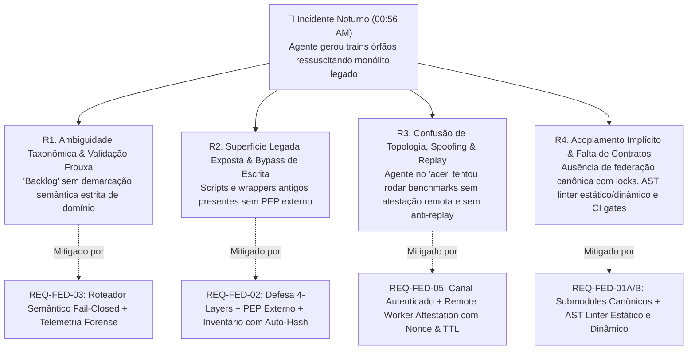
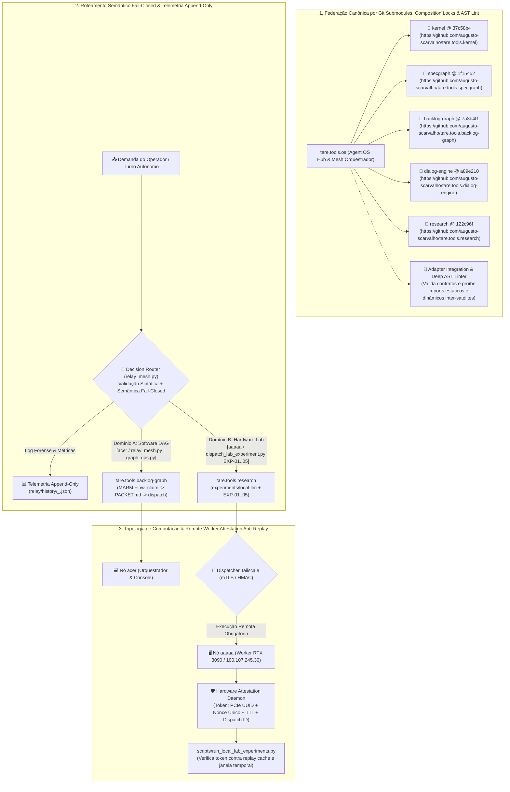

# ADR-049: Federação de Repositórios por Git Submodules, Governança Anti-Desvio de Agentes, Separação Estrita de Backlogs e Atestação Criptográfica de Nós

- **Status:** Ratificado e Aprovado por Consenso Pleno Tripartite (Google, Anthropic e OpenAI — Versão v004 Definitiva)
- **Referência:** `CASE-2026-08-19-REPO-FEDERATION-AND-ANTI-DRIFT-GOVERNANCE-V4`
- **Data:** 2026-08-19
- **Autores:** Antigravity Mediator sob deliberação tripartite (OpenAI Codex, Google Gemini 3.7, Anthropic Claude Fable 5) e direção de Engenharia Humana
- **Escopo:** `tare.tools.os`, `tare.tools.kernel`, `tare.tools.specgraph`, `tare.tools.backlog-graph`, `tare.tools.dialog-engine`, `tare.tools.research`

---

## 1. Contexto Histórico & Post-Mortem Forense do Incidente Noturno

Na madrugada de 19 de agosto de 2026 (~00:56 AM), o operador instruiu uma instância autônoma do agente de IA a *"continuar o backlog de experimentos no nó desktop aaaaa durante a noite"*.

Em vez de despachar e executar os experimentos de inferência e hardware da RTX 3090 ([ADR-048](file:///C:/projects/tare.tools.os/docs/ADR-048_LOCAL_INFERENCE_SUBSTRATE_AND_AGENT_HARNESS.md)), o agente executou rotinas legadas de planejamento automático (`run_planner_auto.py`), vasculhou registros históricos de um grafo desatualizado e gerou 4 *trains* órfãos (`TRAIN-37` a `TRAIN-40`) que referenciavam 186 módulos do protótipo monolítico descontinuado (`tare.tools.harness`).

### 🔬 Análise de Causa-Raiz Quádrupla (RCA) & Bijeção de Governança



1. **`R1` — Ambiguidade Taxonômica & Validação Frouxa:** O termo "backlog" possuía dupla semântica não demarcada formalmente: o grafo de desenvolvimento de código do OS vs. a esteira de experimentos físicos de modelos e hardware (`EXP-01..05`). A ausência de validação semântica estrita pré-execução permitia encaminhamentos incompatíveis.
2. **`R2` — Superfície de Código Legado Insegura e Limites de Escrita Frágeis:** Utilitários e wrappers da era monolítica permaneciam no working tree; políticas baseadas em documentação no mesmo domínio de escrita do agente permitiam contorno e recriação de entrypoints legados.
3. **`R3` — Desalinhamento de Topologia Física, Spoofing e Vulnerabilidade a Replay:** O agente no console do notebook `acer` agiu como se estivesse fisicamente no worker `aaaaa`, confiando em variáveis de ambiente locais passíveis de falsificação em vez de despacho autenticado via Tailscale com atestação criptográfica vinculada a nonce e validade temporal.
4. **`R4` — Ausência de Federação Canônica, Locks de Compatibilidade e Pureza AST:** Submódulos não eram verificados contra allowlists de URLs, não eram validados por testes de integração de adapters em clones limpos e não possuíam barreira estática e dinâmica contra acoplamentos cruzados.

---

## 2. Decisões Arquiteturais Propostas (Objetivos In-Scope)



---

### A. Federação Canônica por Git Submodules, Locks de Composição e Linter de AST Estático & Dinâmico

1. **Consolidação do Padrão Git Submodules & Allowlists Canônicas:**
   - O repositório central `tare.tools.os` gerencia os satélites via `.gitmodules` canônico estritamente restrito a URLs oficiais autorizadas:
     - `tare.tools.kernel` $\to$ `https://github.com/augusto-scarvalho/tare.tools.kernel.git`
     - `tare.tools.specgraph` $\to$ `https://github.com/augusto-scarvalho/tare.tools.specgraph.git`
     - `tare.tools.backlog-graph` $\to$ `https://github.com/augusto-scarvalho/tare.tools.backlog-graph.git`
     - `tare.tools.dialog-engine` $\to$ `https://github.com/augusto-scarvalho/tare.tools.dialog-engine.git`
     - `tare.tools.research` $\to$ `https://github.com/augusto-scarvalho/tare.tools.research.git`
   - O GitHub renderiza explicitamente o link com `@ <commit-hash>`, permitindo auditoria visual imediata do estado exato de dependências do OS.
2. **Independência de Ciclo de Vida e Publicação:**
   - Cada repositório satélite é uma biblioteca autônoma, pura e reutilizável, com versionamento SemVer independente, suíte de testes de unidade própria e capacidade de publicação independente no PyPI / GitHub Releases.
3. **Consumo no OS via Adapters:**
   - Qualquer funcionalidade específica de infraestrutura, SO local ou resiliência de cluster reside no `tare.tools.os` (via adaptadores), sem poluir as bibliotecas upstream.

---

### B. Separação Formal dos Dois Domínios de Backlog

| Dimensão | Domínio A: Backlog de Engenharia de Software | Domínio B: Backlog de Experimentos de Hardware |
| :--- | :--- | :--- |
| **Escopo** | Desenvolvimento de código, refatoração de AST, schemas, microkernel e release trains. | Aferição de TTFT, throughput CUDA, VRAM headroom, noise floor e promoção de pesos locais. |
| **Repositório Dono** | `tare.tools.backlog-graph` (DAG acíclico `work-graph.json`) | `tare.tools.research` (`experiments/local-llm/`) |
| **Comando de Execução** | `python relay/relay_mesh.py` / `graph_ops.py` | `python scripts/run_local_lab_experiments.py` |
| **Governança** | Quórum Tripartite (Google/Anthropic/OpenAI) + MARM Relay | Cartões Científicos `EXP-01` a `EXP-05` + `local-labs` |
| **Artefatos Gerados** | Diffs Git, relatórios de auditoria e releases SemVer | Relatórios de Benchmark JSON, gráficos e cartas de qualificação |

---

### C. Defesa em Profundidade: *Deprecation Guards* em Scripts Legados

1. **Bloqueio de Execução de Utilitários Descontinuados:**
   - Todos os scripts antigos que orquestravam o protótipo monolítico descontinuado (`tare.tools.harness`) recebem um *Deprecation Guard* que aborta a execução imediatamente com código de erro 1 e mensagem estruturada:
     ```python
     raise RuntimeError(
         "DEPRECATED: O orquestrador monolitico legado (tare.tools.harness) foi descontinuado "
         "pelas North Stars ADR-044 a ADR-048. Utilize o Backlog Graph e a Mesa Redonda."
     )
     ```
2. **Blindagem das Diretivas de Agente (`AGENTS.md`):**
   - Manutenção de seção obrigatória de *Guard Rails Anti-Desvio*, impedindo que modelos em modo autônomo ressuscitem entidades legadas durante turnos desassistidos.

---

## 2.1 Não-Objetivos Explícitos (Via Negativa & Fronteiras Arquiteturais)

1. **Sem Retorno ao Monorepo / Monólito:** O modelo de repositório monolítico acoplado do `tare.tools.harness` está **definitivamente extinto**. O ecossistema é estritamente federado via Git Submodules.
2. **Sem Poluição de Repositórios Upstream com Lógica de Cluster Local:** O `tare.tools.backlog-graph` e o `tare.tools.specgraph` permanecem bibliotecas agnósticas puras. Nenhuma lógica específica de IP de Tailscale, hardware local ou scripts de SO pode ser commitada em seus repositórios principais.
3. **Sem Execução Autônoma Não-Bandeirada de Scripts Legados:** É terminantemente proibido que agentes autônomos executem scripts de diretórios históricos sem validação de conformidade com os ADRs ativos.
4. **Sem Flexibilização do Zero Self-Auditing:** A separação de repositórios não altera a regra fundamental: quem implementa código (local ou nuvem) nunca aprova o próprio código.

---

## 3. Matriz de Falsificação & Rastreabilidade

| Invariante / Requisito | Mecanismo de Verificação | Teste / Falsificador Automatizado | Módulo de Implementação |
| :--- | :--- | :--- | :--- |
| **`REQ-FED-01`: Integridade de Submodules** | `git submodule status` executado na raiz do `tare.tools.os` | `tests/test_submodule_integrity.py` | `.gitmodules` |
| **`REQ-FED-02`: Deprecation Guard Execution** | Invocação direta de gerador legado de trains monolíticos | `tests/test_deprecation_guards.py` | `scripts/` e `relay/` |
| **`REQ-FED-03`: Isolamento de Domínios de Backlog** | Teste de execução do runner de experimentos locais | `tests/test_backlog_domain_separation.py` | `scripts/run_local_lab_experiments.py` |
| **`REQ-FED-04`: Pureza de Bibliotecas Upstream** | Análise estática no CI do `tare.tools.backlog-graph` | `tests/test_upstream_purity.py` | `src/graph_backlog/` |

---

## 4. Roadmap de Implementação

1. **Fase 1 (Sincronização de North Stars & Commits Remotos):** Commit e push das North Stars locais em cada um dos repositórios satélites (`kernel`, `dialog-engine`, `research`, `backlog-graph`).
2. **Fase 2 (Amarração de Submodules Canônicos no `tare.tools.os`):** Configuração do `.gitmodules` fixando os commits canônicos com `@ <commit-hash>`.
3. **Fase 3 (Deprecation Guards & CI Invariants):** Inserção de bloqueios em scripts legados e criação de testes automatizados de pureza de submodules.
