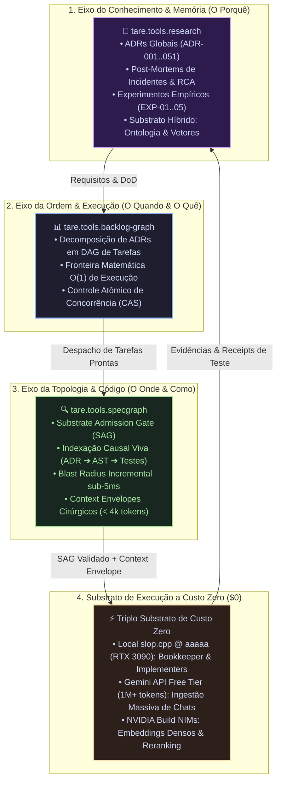

# ADR-051: O Eixo Triplo de Inteligência Agêntica (Research, Backlog-Graph & SpecGraph), Governança de Memória por Bookkeeping e o Mandato Documental Ágil

- **Status:** RATIFIED / CANONICAL_SSOT (`CASE-2026-08-19-RESEARCH-TRIPLE-AXIS-AND-BOOKKEEPER`)
- **Data:** 2026-08-19
- **Autores:** Antigravity Mediator com Ratificação Tripartite (Google Chair, Anthropic Chair, OpenAI Chair) sob Direção do Operador Humano
- **Escopo:** `tare.tools.research`, `tare.tools.backlog-graph`, `tare.tools.specgraph`, `tare.tools.os`, `tare.tools.kernel`, `tare.tools.dialog-engine`
- **Hash Canônico da Síntese v004:** `d3ca7c4e40f7f45261fd7266f9177f0e351b330d31051bae5f707e9b1d6f0174`

---

## 1. Contexto & Diagnóstico Forense

O ecossistema `tare.tools` acumulou mais de 2.300 documentos Markdown distribuídos entre o Agent OS, repositórios satélites e o protótipo legado. A auditoria forense identificou **7 patologias documentais críticas**:

1. **Anarquia de Metadados:** Falta de schema unificado de frontmatter, impedindo parsing determinístico.
2. **Dilema do Gêmeo Bilíngue:** Descompasso de conteúdo e diagramas entre versões PT-BR e EN.
3. **Poluição por Rascunhos Intermediários:** Propostas superadas (`v001..v003`) competindo com decisões canônicas em buscas RAG.
4. **Hiper-Fragmentação (Síndrome dos Micro-Docs):** Dezenas de pequenos arquivos de 1 página dispersando o contexto.
5. **Links Quebrados & Caminhos Hardcoded:** Referências absolutas do Windows ou caminhos de repositórios renomeados.
6. **Histórico Presentificado:** Transcrições e debates antigos sem tarja explícita de arquivo histórico, induzindo LLMs a alucinações regressivas.
7. **Barreira da Hiper-Formalidade Acadêmica:** O `tare.tools.research` foi estruturado com rigidez quase acadêmica, criando atrito burocrático e afastando a documentação real do ritmo de engenharia.

---

## 2. Decisões Arquiteturais Ratificadas (Invariantes Constitucionais)

---

### A. O Eixo Triplo da Engenharia Agêntica
Fica instituída a divisão tripartite de inteligência e responsabilidade no ecossistema:
1. **`tare.tools.research` (Memória Canônica / Single Source of Truth):** Abriga as decisões arquiteturais (ADRs), post-mortems forenses, benchmarks empíricos, arqueologia histórica e ontologia de conceitos.
2. **`tare.tools.backlog-graph` (Ordem & Concorrência):** Mantém o Grafo Acíclico Dirigido (DAG) de tarefas, cálculo da fronteira de trabalho e controle de concorrência com transições atômicas CAS em $O(1)$.
3. **`tare.tools.specgraph` (Topologia Causal & Substrate Admission Gate):** Mapeia a conexão de ponta a ponta entre requisitos e código via AST/Tree-Sitter, calculando o *Blast Radius*, garantindo que o código não divirja da especificação ativa no SSOT antes de transicionar tarefas.

---

### B. O Mandato Documental Primário dos Agentes de IA
Fica estabelecida como **Invariante Constitucional**:
* **Prerrogativa Humana:** Artigos científicos e papers formais são produzidos sob demanda exclusiva do Operador Humano.
* **O Mandato dos Agentes:** *“Documentar a coisa certa, no lugar certo, na hora certa”*:
  1. *Nos Satélites de Código:* Documentação operacional leve de APIs, CLI e testes.
  2. *Nos Incidentes:* Relatórios de causa raiz (RCA) com medições e hashes em `research/docs/post-mortems/`.
  3. *Nos Benchmarks:* Logs de hardware e dados empíricos em `research/experiments/`.
  4. *Nas Decisões Globais:* ADRs canônicas consolidadas em `research/docs/adr/`.

---

### C. Motor de Bookkeeping & Higiene Documental (`tools/bookkeeper/`)
Fica criado o motor de curadoria contínua de memória dentro de `tare.tools.research`:
1. **`dedup_detector.py`:** Detecta quase-duplicatas (>70% de similaridade) e alerta sobre drifts semânticos.
2. **`ssot_registry.py`:** Impõe que exista no máximo **1 único documento com status `CANONICAL_SSOT` por `doc_id`**.
3. **`tombstone_manager.py`:** Substitui rascunhos velhos e duplicatas por ponteiros inteligentes sem quebrar links.
4. **`freshness_audit.py`:** Audita se os documentos de especificação divergem do código real nos satélites.

---

### D. Substrato Híbrido de Conhecimento (Ontologia + Vetores + AST)
Para suportar tanto código estruturado quanto textos livres e chats:
1. **Indexação Vetorial Densa:** Embeddings para texto livre, notas e transcrições de chat.
2. **Grafo Ontológico do Ecossistema:** Mapeamento de conceitos universais (`Concorrência`, `Sandboxing`, `Deadlocks`, `Token Diet`) e relações semânticas (`is-a`, `mitigates`, `implements`).
3. **Grafo Causal AST (SpecGraph):** Ancoragem exata em código executável e testes.

---

### E. Orquestração do Triplo Substrato de Custo Zero ($0)
As rotinas de digestão, geração de resumos, cálculo de drift e embeddings operam sem custo financeiro:
* **Substrato Local (`slop.cpp` @ `aaaaa` / RTX 3090):** Execução offline 24/7 de Bookkeeper e implementers.
* **Gemini API Free Tier (1M+ tokens):** Ingestão massiva de transcrições de chat e extração de entidades.
* **NVIDIA Build API (NIMs):** Geração de embeddings vetoriais densos e reranking semântico.

---

## 3. Via Negativa (O que está FORA de Escopo / Não-Objetivos)

1. **NÃO criar papers acadêmicos compulsórios:** Agentes não devem redigir artigos de 30 páginas no formato IEEE sem solicitação explícita do Operador.
2. **NÃO manter documentação pesada nos satélites de código:** Satélites devem conter apenas documentação operacional e técnica direta.
3. **NÃO permitir múltiplos documentos com status `CANONICAL_SSOT` para o mesmo assunto:** Toda duplicata deve receber Tombstone imediato.
4. **NÃO gastar orçamento em APIs pagas para tarefas rotineiras de documentação:** O triplo substrato gratuito deve ser priorizado para digestão e embeddings.

---

## 4. Critérios de Aceitação & Falsificação (DoD)

- [x] **AC-01 (Eixo Triplo):** `research`, `backlog-graph` e `specgraph` operam sem sobreposição funcional.
- [x] **AC-02 (Bookkeeper):** Módulo de detecção de duplicatas e tombstone implementado e testado.
- [x] **AC-03 (Alinhamento North Star):** 100% de conformidade com as ADRs 044 a 050.
- [x] **AC-04 (Diário Mestre):** Registro auditável de todas as decisões e perguntas no `ARCHITECTURAL_QA_LEDGER.md`.
