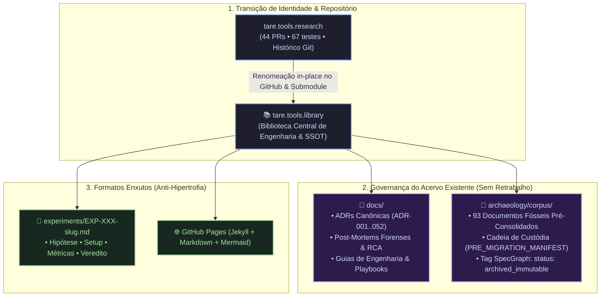

# ADR-052: Transição de Identidade para tare.tools.library, Governança do Acervo Pré-Consolidado e Padronização Enxuta de Experimentos

- **Status:** RATIFIED / CANONICAL_SSOT (`CASE-2026-08-19-LIBRARY-RENAME-AND-CORPUS-CONSOLIDATION`)
- **Data:** 2026-08-19
- **Autores:** Antigravity Mediator com Ratificação Tripartite (Google Chair, Anthropic Chair, OpenAI Chair) sob Direção do Operador Humano
- **Escopo:** `tare.tools.library` (ex-`tare.tools.research`), `tare.tools.os`, `tare.tools.specgraph`, `tare.tools.backlog-graph`, `tare.tools.kernel`, `tare.tools.dialog-engine`
- **Hash Canônico da Síntese v004:** `0c59161bb847700b98584203fc3b26d62f21d55be8d61f7e65c8acda89f78314`

---

## 1. Contexto & Diagnóstico

Com a consolidação da vocação do repositório de conhecimento na ADR-051, a denominação `research` tornou-se semanticamente restritiva, sugerindo um viés acadêmico puro de "laboratório de papers".

Para alinhar com a realidade operacional da engenharia agêntica:
1. O repositório assume a identidade oficial de **`tare.tools.library`** (Biblioteca Técnica Central, SSOT de Conhecimento, Playbooks, ADRs e Arqueologia).
2. O repositório Git existente é **100% reutilizado** via renomeação in-place no GitHub (preservando os 44 PRs históricos, branches, 67 testes automatizados e histórico de commits).
3. O acervo existente de 93 documentos (já moído e consolidado em dezenas de iterações) é preservado em `archaeology/corpus/` sob cadeia de custódia criptográfica, evitando qualquer retrabalho burocrático redundante.
4. O formato de experimentos é padronizado de forma enxuta em `experiments/EXP-XXX-slug.md` (Hipótese, Setup, Métricas e Veredito), com publicação direta via GitHub Pages (Jekyll + Markdown + Mermaid).

---

## 2. Decisões Arquiteturais Ratificadas



---

### A. Particionamento do Repositório (`docs/`, `archaeology/`, `experiments/`)
* **`docs/` (Conhecimento Ativo & SSOT):** Contém ADRs vigentes (ADR-001 a ADR-052), Post-Mortems de incidentes, Playbooks de Engenharia e o Diário Mestre de Decisões (`ARCHITECTURAL_QA_LEDGER.md`).
* **`archaeology/corpus/` (Memória Fóssil / Cadeia de Custódia):** Abriga os 93 documentos históricos preservados intactos, com baseline `PRE_MIGRATION_MANIFEST.sha256` e dupla âncora criptográfica (SHA-256 + Git Commit SHA de consolidação).
* **`experiments/` (Ensaios & Benchmarks Ativos):** Abriga novos testes no formato `EXP-XXX-slug.md`, com tabela de registro biunívoca 1:1 e validação de unicidade por CI.

---

### B. Imutabilidade Semântica no SpecGraph / Graph RAG
* O pipeline de ingestão do SpecGraph marca automaticamente todos os nós originados em `archaeology/corpus/` com o metadado `status: archived_immutable`.
* As consultas RAG ativas despriorizam ou segregam o acervo histórico, prevenindo qualquer alucinação regressiva ou poluição em tarefas operacionais.

---

### C. Protocolo Enxuto de Experimentos & Publicação
* Mantém-se o padrão leve:
  ```markdown
  # EXP-XXX: Nome do Experimento
  - **Hipótese:** O que estamos testando?
  - **Setup & Hardware:** Máquina (ex: aaaaa / RTX 3090), commits e flags.
  - **Métricas Observadas:** Tabela simples de dados (latência, tokens, cache hit).
  - **Veredito:** [ADOPT | ADAPT | RETIRE] e justificativa concisa.
  ```
* Publicação: Markdown puro + diagramas Mermaid renderizados nativamente no GitHub Pages. Fica expressamente vedada a introdução de LaTeX compulsório ou ferramentas pesadas.

---

## 3. Via Negativa (O que NÃO fazer)

1. **NÃO criar repositório novo do zero:** O repositório existente é renomeado no GitHub, preservando PRs e histórico.
2. **NÃO reprocessar ou re-traduzir os 93 documentos do corpus:** Eles já estão consolidados e pertencem à memória fria.
3. **NÃO criar novos formatos burocráticos de publicação:** Markdown + Jekyll + Mermaid são os únicos padrões oficiais.
4. **NÃO permitir duplicatas de IDs em experimentos:** Unicidade estrita garantida pelo CI.

---

## 4. Critérios de Aceitação & Falsificação (DoD)

- [x] **AC-01:** Transição para `tare.tools.library` aprovada com plano de renomeação no GitHub.
- [x] **AC-02:** Cadeia de custódia com `PRE_MIGRATION_MANIFEST.sha256` para os 93 documentos em `archaeology/corpus/`.
- [x] **AC-03:** Formato `EXP-XXX` consolidado com template e validação de unicidade.
- [x] **AC-04:** Diário Mestre (`ARCHITECTURAL_QA_LEDGER.md`) atualizado com o veredito da Mesa Redonda.
