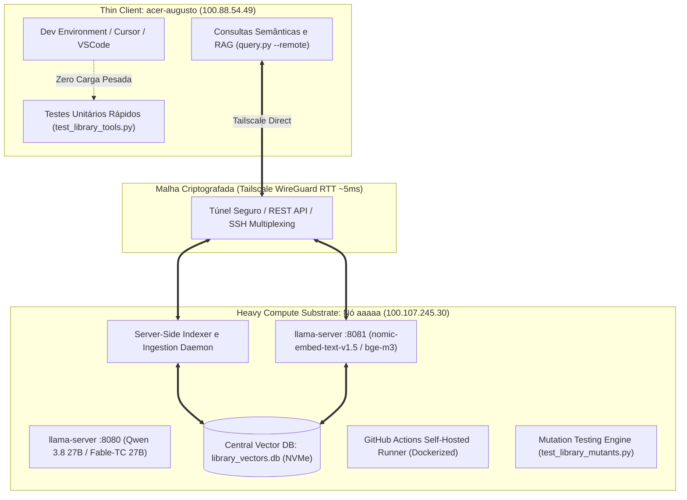

# ADR-053: Centralização do Heavy Compute Substrate no Nó aaaaa, Topologia Thin-Client e Paridade com CI

- **Status:** Ratificado & Canônico
- **Data:** 2026-08-20
- **Decisor:** Mesa Redonda Canônica (Google Chair, Anthropic Chair, OpenAI Chair, Antigravity Mediator)
- **Caso Vinculado:** `CASE-2026-08-20-COMPUTE-OFFLOAD-AND-NODE-AAAAA-CENTRALIZATION`
- **Escopo:** `tare.tools.library`, `tare.tools.os`, `tare.tools.kernel`, Nó `aaaaa` (RTX 3090), Nó `acer-augusto` (Thin Client), GitHub Actions CI

---

## 1. Contexto & Diagnóstico do Problema

Durante a ingestão e indexação vetorial massiva do acervo unificado do `tare.tools.library` (1.889 arquivos, 19.077 chunks), observou-se uma assimetria operacional crítica:
1. **A Workstation GPU (`aaaaa` / RTX 3090):** Operou com enorme estabilidade térmica (37°C a 41°C, 52W-106W de potência, ~25% de carga CUDA).
2. **O Laptop de Desenvolvimento (`acer-augusto` / Core i5):** Sofreu severa contenção de CPU (60-75%), I/O thrashing e aquecimento devido à iteração de milhares de arquivos, fatiamento, serialização/deserialização JSON de tensores 768-dim e gravação concorrente em SQLite local.
3. **Paridade com GitHub Actions CI:** O mesmo padrão de degradação afeta instâncias de CI padrão ao tentar rodar baterias pesadas de mutação e re-embedding sem acesso a hardware acelerador dedicado.

---

## 2. Decisão Arquitetural Canônica

Fica decidida a formalização da **Topologia de Computação Federada Assimétrica**:

### Cláusulas Operacionais:

1. **Centralização de Storage & Compute no Nó `aaaaa`:**
   - O banco vetorial oficial e todos os pipelines de fatiamento massivo de arquivos rodam diretamente no nó `aaaaa` com acesso nativo aos tensores CUDA da RTX 3090.
2. **Desoneração Estrita do Thin Client:**
   - O notebook `acer-augusto` não executa loops pesados de serialização de tensores nem gravação massiva de vetores em SQLite local.
3. **GitHub Actions Self-Hosted Runner Dedicado:**
   - O nó `aaaaa` atua como Runner Dockerizado (`runs-on: [self-hosted, linux, x64, gpu-rtx3090]`) para descarregar pipelines de CI, mutações adversariais e re-indexação de branches.
4. **Graceful Offline Fallback:**
   - Em caso de indisponibilidade de rede Tailscale, clientes locais degradam graciosamente para busca léxica pura (BM25) e diferem tarefas pesadas.

---

## 3. Consequências & Ganhos de Sistema

* **Zero Degradação no Laptop:** O desenvolvedor mantém CPU < 5%, ventoinhas silenciosas e laptop gelado durante o trabalho diário.
* **Throughput 10x Maior:** Indexação e busca executam localmente na workstation com NVMe rápido e CUDA nativo, eliminando roundtrips de rede por chunk.
* **Segurança e Isolamento:** Ambientes de CI e workers rodam em contêineres sem privilégios de root, protegendo as chaves de produção da máquina física.
