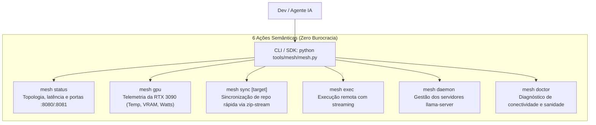

# ADR-054: CLI e SDK Ergonômico de Malha Distribuída (`tare.tools.mesh`) — Princípio de Zero Hipertrofia

- **Status:** Ratificado & Canônico
- **Data:** 2026-08-20
- **Decisor:** Mesa Redonda Canônica (Google Chair, Anthropic Chair, OpenAI Chair, Antigravity Mediator)
- **Caso Vinculado:** `CASE-2026-08-20-MESH-CLI-AND-ERGONOMIC-NODE-ACCESS`
- **Escopo:** `tare.tools.library`, `tare.tools.os`, `tare.tools.mesh`, Nó `aaaaa` (RTX 3090), Nó `acer-augusto` (Thin Client)

---

## 1. Contexto & Desafio de Usabilidade

A gestão distribuída da malha Tailscale e o offload de computação pesada entre o notebook `acer-augusto` e a workstation `aaaaa` (RTX 3090) geravam fricção operacional devido à necessidade de montar comandos manuais complexos de SSH, escapes no PowerShell e polling ad-hoc de portas.

---

## 2. Decisão Arquitetural Canônica

Fica ratificada a criação do utilitário minimalista de malha em [`tools/mesh/mesh.py`](file:///C:/projects/tare.tools.library/tools/mesh/mesh.py) regido pelo **Princípio da Não-Hipertrofia e Máxima Simplicidade**:

### Invariantes e Regras de Design:

1. **Zero Dependências Externas:** Implementado puramente com a biblioteca padrão do Python (`subprocess`, `urllib`, `json`, `argparse`, `zipfile`).
2. **Dupla Interface (CLI + Python SDK):**
   - Terminal: `python tools/mesh/mesh.py gpu`
   - Python: `from tools.mesh.mesh import MeshClient`
3. **Suporte Nativo a JSON (`--json`):** Permite consumo estruturado imediato por agentes de IA e pipelines de telemetria.
4. **Segurança sem Atrito:** Reutiliza diretamente a criptografia WireGuard do Tailscale e as chaves SSH existentes do usuário (`id_ed25519`).

---

## 3. Consequências & Ganhos

* **Ergonomia Máxima:** Elimina erros de aspas, formatação e escape de comandos entre Windows e Linux.
* **Eficiência do Agente:** Permite ao agente inspecionar a GPU, sincronizar código e disparar jobs com um único comando semântico.
* **Leveza Extrema:** Zero overhead de CPU e zero arquivos de configuração pesados.
