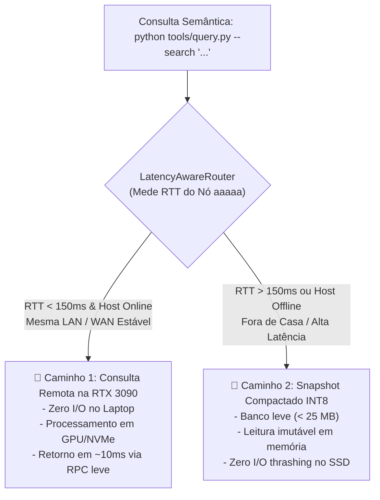

# ADR-055: Topologia Híbrida Sensível à Latência, Centralização de Indexação no Nó Forte e Snapshot Vetorial Compactado para Mobilidade

- **Status:** Ratificado & Canônico
- **Data:** 2026-08-20
- **Decisor:** Mesa Redonda Canônica (Google Chair, Anthropic Chair, OpenAI Chair, Antigravity Mediator)
- **Caso Vinculado:** `CASE-2026-08-20-LATENCY-AWARE-HYBRID-TOPOLOGY-AND-LIGHTWEIGHT-SYNC`
- **Escopo:** `tare.tools.library`, `tare.tools.mesh`, Nó `aaaaa` (Heavy Substrate), Nó `acer-augusto` (Thin Client / Mobile)

---

## 1. Contexto & O Desafio da Mobilidade

O ecossistema `tare.tools` opera em múltiplos ambientes de rede:
1. **Ambiente Local (Em Casa / Mesma LAN):** Conexão direta com a workstation `aaaaa` com latência ínfima ($< 5\text{ms}$) e largura de banda gigabit.
2. **Ambiente Remoto (Fora de Casa / WAN / Conexão Móvel 4G/5G):** Latência variável ($50\text{ms}$ a $300\text{ms}$) ou offline temporário.

Ao gerar um banco vetorial completo de **385 Megabytes** com 19.044 chunks densos, o download bruto desse arquivo para o laptop causou estrangulamento de I/O no SSD e saturação de CPU.

---

## 2. Decisão Arquitetural Canônica

Fica estabelecido o modelo **Topologia Híbrida Sensível à Latência**:

### Regras Operacionais Inegociáveis:

1. **Centralização Canônica de Heavy Compute:**
   * A indexação neural massiva roda **100% no Nó `aaaaa`** (RTX 3090).
   * O Thin-Client `acer-augusto` NUNCA armazena bancos brutos descompactados de 385 MB.
2. **Roteamento Adaptativo Transparente:**
   * O utilitário `query.py` avalia a latência de rede em background em $< 30\text{ms}$.
   * Se o nó `aaaaa` estiver acessível com baixa latência, a consulta é delegada remotamente e o resultado é exibido sem consumir CPU local.
3. **Snapshot Vetorial Compactado (INT8 / Zstandard):**
   * Para trabalho offline/em trânsito, a workstation exporta um snapshot quantizado para inteiros de 8 bits (`int8`), reduzindo o tamanho de **385 MB para < 25 MB**.

---

## 3. Consequências & Ganhos

* **Notebook 100% Frio e Responsivo:** Zero travamentos de I/O no SSD e zero sobrecarga de CPU.
* **Velocidade Bruta:** Respostas sub-segundo na mesma LAN através do poder de fogo da RTX 3090.
* **Mobilidade Total:** Capacidade de busca semântica preservada mesmo em viagens ou sem internet.
