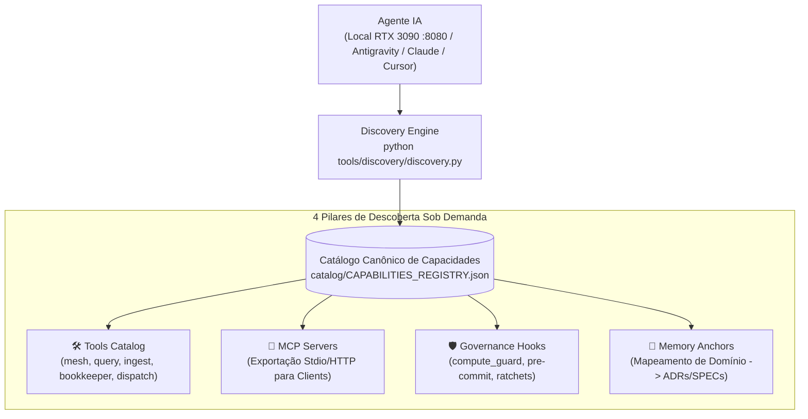

# ADR-056: Protocolo Universal de Descoberta On-Demand de Memória, Tools, MCPs e Hooks Interoperáveis entre Agentes e Vendors

- **Status:** Ratificado & Canônico
- **Data:** 2026-08-20
- **Decisor:** Mesa Redonda Canônica (Google Chair, Anthropic Chair, OpenAI Chair, Antigravity Mediator)
- **Caso Vinculado:** `CASE-2026-08-20-UNIVERSAL-CAPABILITY-DISCOVERY-AND-CROSS-AGENT-SHARING`
- **Escopo:** `tare.tools.discovery`, `tare.tools.mesh`, `tare.tools.library`, Agente Local (RTX 3090 :8080), Antigravity, Claude Code, Cursor

---

## 1. Contexto & Desafio de Interoperabilidade

O ecossistema `tare.tools` evoluiu para um repositório rico composto por:
* Centenas de ferramentas em `tools/` (`mesh`, `query`, `ingest`, `bookkeeper`, `publisher`).
* Servidores MCP e sidecars de auditoria.
* Hooks de governança e proteção (`compute_guard`, linters, oráculos de mutação).
* Memória canônica de 1.891 documentos, ADRs, SPECs e QA Ledgers.

No entanto, faltava um **Mecanismo Universal de Descoberta On-Demand**. Quando novos agentes são instanciados (seja o modelo local Qwen/Fable na RTX 3090, seja Antigravity, Claude Code ou Cursor), eles precisavam de leituras de contexto volumosas ou adivinhações manuais.

---

## 2. Decisão Arquitetural Canônica

Fica ratificado o **Protocolo Universal de Descoberta On-Demand (`tare.tools.discovery`)**:

### Invariantes e Regras de Design:

1. **Manifesto Único de Capacidades (`catalog/CAPABILITIES_REGISTRY.json`):**
   * Estrutura indexada por tags e domínios (`mesh`, `inference`, `governance`, `catalog`, `audit`).
2. **Resolução Semântica On-Demand (`discovery resolve <query>`):**
   * Retorna apenas os 2-3 comandos e âncoras de memória pertinentes ao objetivo do agente em $< 5\text{ms}$.
3. **Exportação MCP Universal (`discovery mcp-export`):**
   * Gera a configuração `mcpServers` padrão da indústria para plug-and-play imediato em qualquer IDE ou CLI de vendor.
4. **SDK Python Puro:**
   * Invocação direta via `from tools.discovery import DiscoveryEngine`.

---

## 3. Consequências & Ganhos

* **Zero Amnésia Cross-Agent:** Qualquer agente descobre dinamicamente como rodar inferência, usar a malha e consultar SPECs.
* **Economia Massiva de Context Window:** Elimina injeção de documentação estática pesada no prompt inicial.
* **Interoperabilidade Total:** Agente local na RTX 3090 e agentes de nuvem compartilham o mesmo catálogo de capacidades.
