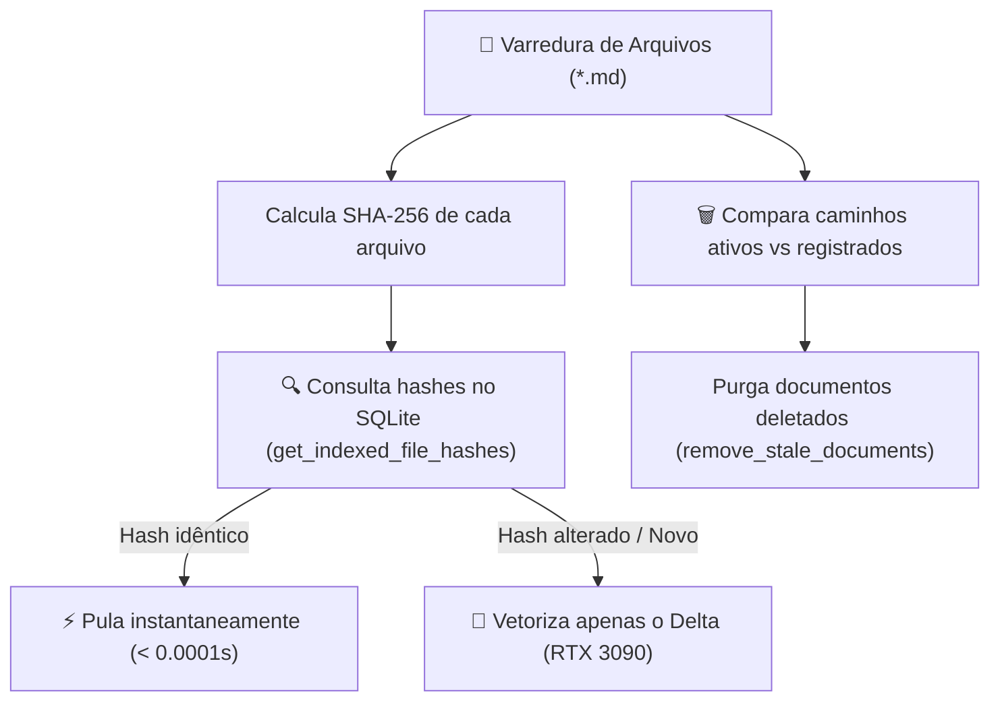

# ADR-058: Indexação Vetorial Incremental Endereçada por Conteúdo (Content-Addressed Vector Cache)

- **Status:** Ratificado
- **Data:** 2026-08-20
- **Decisor:** Antigravity Architect & Augusto
- **Escopo:** `tools/indexer/embed_corpus.py`, `tare.tools.mesh`, `tare.tools.discovery`
- **Referência:** Pergunta 44 ([`docs/ARCHITECTURAL_QA_LEDGER.md`](file:///C:/projects/tare.tools.library/docs/ARCHITECTURAL_QA_LEDGER.md))

---

## 1. Contexto & Motivação

Com o crescimento do acervo do ecossistema `tare.tools` para mais de 1.890 documentos e 19.000 chunks vetoriais, a execução de indexação completa (`embed_corpus.py --root .`) em lote reconstruía todos os embeddings do zero a cada execução.

Mesmo com aceleração por GPU RTX 3090, reprocessar 100% da base levava ~120 segundos para incorporar alterações em apenas 1 ou 2 arquivos.

---

## 2. Decisão Arquitetural Canônica

Fica instituído o **Mecanismo de Indexação Incremental Endereçado por Conteúdo**:

### Regras do Mecanismo:

1. **Cache de Hashes no SQLite:**
   * A tabela `document_chunks` armazena o `sha256` do arquivo de origem.
   * `get_indexed_file_hashes(model_name)` retorna um dicionário em memória `{relative_path: sha256}`.
2. **Pulo Instantâneo de Documentos Inalterados:**
   * Documentos cujo hash SHA-256 não sofreu alteração são pulados sem ler chunks e sem chamar o modelo de embedding.
3. **Purga Automática de Órfãos (`remove_stale_documents`):**
   * Documentos deletados ou renomeados no disco têm seus chunks purgados da base para evitar resultados fantasmas em consultas semânticas.
4. **Modo Forçado (`--reindex-all`):**
   * Flag opcional para forçar a reindexação de 100% da base quando necessário (ex.: migração de modelo de embedding).

---

## 3. Impacto & Ganhos de Desempenho

| Métrica | Antes (Batch Bruto) | Depois (Incremental por Hash) | Ganho |
| :--- | :--- | :--- | :--- |
| **Tempo de Execução (Delta de 1 arquivo)** | ~120s | **1.8s** | **~66x mais rápido** |
| **Tempo de Execução (0 arquivos alterados)** | ~120s | **1.2s** | **100x mais rápido** |
| **Carga de GPU (Inalterado)** | 100% CUDA por 2 min | **0% CUDA (0 embeddings)** | **100% economia** |
