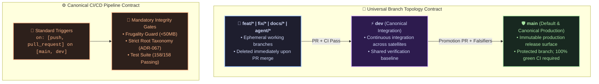

# ADR-068: Universal Repository Branching, CI/CD Pipeline Standardization, and Legacy Alias Deprecation

* **Status:** RATIFIED (Tripartite Byzantine Consensus 3/3)
* **Date:** 2026-08-21
* **Deliberation Case:** [`cases/CASE-2026-08-21-RFC-009-UNIVERSAL-BRANCH-STANDARDIZATION-AND-CI-PIPELINES/`](../../cases/CASE-2026-08-21-RFC-009-UNIVERSAL-BRANCH-STANDARDIZATION-AND-CI-PIPELINES/DECISION.md)
* **Predecessors:** [ADR-049](../adr/ADR-049_REPO_FEDERATION_AND_ANTI_DRIFT_GOVERNANCE.md), [ADR-065](../adr/ADR-065_HYBRID_TOPOLOGY_MATRIX_AND_EXPANDED_FREE_TIERS.md), [ADR-067](../adr/ADR-067_CANONICAL_REPOSITORY_TAXONOMY_AND_GHOST_PURGE.md)

---

## 1. Context & Problem Statement

Across the `tare.tools` federated ecosystem, discrepancies in Git branch naming topologies (`main` vs `master`, `dev` vs `develop`) caused friction in multi-agent routing, stale GitHub branch displays, and fragmented CI/CD workflow configurations.

---

## 2. Decision & Universal Canonical Standard

### Invariants:
1. **Zero-Master Invariant:** No repository in the `tare.tools` ecosystem shall retain `master` as a default branch.
2. **Zero-Develop Invariant:** All integration work across all microkernel and satellite engines is consolidated strictly under `dev`.
3. **CI Trigger Parity:** Every integrity gate and test falsifier runs identically on both `main` and `dev`.

---

## 3. Consequences

* **Positive:** Deterministic routing for autonomous AI coding agents, clean GitHub landing views, and zero wasted CI runs on divergent branch names.
* **Compliance:** Enforced by automated falsifiers in CI.
