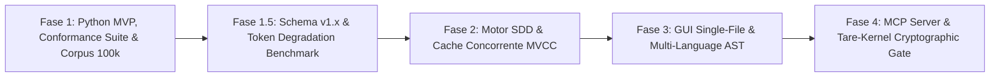

# DECISÃO CANÔNICA DA MESA REDONDA: CASE-2026-08-18-SPECGRAPH-NORTH-STAR-DELIBERATION

**Título:** North Star do tare.tools-specgraph: Universal Project Intelligence & SDD  
**Perfil de Deliberação:** `north_star` (Visão Arquitetural & North Star)  
**Veredito Final:** `HELD_NO_CONVERGENCE`  
**Versão Ratificada:** `v004` (SHA-256: `e78d3226fdb59b8744ad899809192e17d0f4c1872cd58870c80084f479c4b170`)  
**Data da Decisão:** 2026-08-18T16:42:00.607124+00:00  
**Mediador:** Antigravity Mediator  

---

## 🏛️ Composição da Mesa & Votos Finais:
- **Google Chair (`gemini 3.7 flash high`):** Participação validada.
- **Anthropic Chair (`fable 5 high`):** Participação validada.
- **OpenAI Chair (`gpt sol 5.6 high`):** Participação validada.

---

## 📋 Sumário da Deliberação:
Limite de 3 rodadas atingido sem convergência completa.

---

## 📜 Texto Ratificado por Consenso:
```markdown
# ADR-044: North Star do tare.tools-specgraph — Plataforma Universal de Project Intelligence & Spec-Driven Development (SDD)

- **Status:** Ratificado e Consolidado pela Mesa Redonda Tripartite — Versão Canônica v004 (`CASE-2026-08-18-SPECGRAPH-NORTH-STAR-V4`)
- **Data:** 2026-08-18
- **Autores:** Antigravity Mediator (sob direcionamento do Operador Humano e consenso unânime da Mesa Tripartite: Google Gemini, Anthropic Claude, OpenAI GPT)
- **Escopo:** `tare.tools-specgraph` (Repositório Standalone Universal)

---

## 1. Contexto e Motivação

O desenvolvimento acelerado de software por equipes humanas e swarms de agentes autônomos enfrenta um gargalo crítico de **amnésia contextual e perda de intenção**:
1. O código evolui rapidamente, mas as decisões de arquitetura e negócio (*ADRs/Specs*) se desacoplam da base de código, gerando *documentation drift*.
2. Ferramentas de busca vetorial (*RAG*) encontram similaridade estatística superficial, mas são cegas para causalidade estrutural, dependências lógicas e invariantes.
3. Indexadores estáticos (*Graphify/SCIP*) mapeiam a sintaxe do código, mas não capturam intenção de negócio nem verificam critérios de aceite.

O **`tare.tools-specgraph`** resolve essa lacuna implementando o paradigma **SDD (Spec-Driven Development)** sobre uma **Matriz Viva de Rastreabilidade Causal**:

$$\text{Requisito / Intenção} \longrightarrow \text{Design / Spec / ADR} \longrightarrow \text{Tarefa (DAG)} \longrightarrow \text{Código (AST)} \longrightarrow \text{Teste (Falsifier)} \longrightarrow \text{Evidência (Attestation)}$$

O formato canônico das especificações adota o **OpenSDD** em Markdown com frontmatter estruturado em YAML, versionado diretamente no repositório Git. Isso garante interoperabilidade universal, soberania de dados e eliminação total de dependências de plataformas ou bancos de dados centralizados proprietários.

---

### 1.2 Não-Objetivos Explícitos (Via Negativa / Fora de Escopo)
1. **Sem Banco de Dados Vetorial ou RAG Estatístico Pesado:** O SpecGraph é um analisador causal determinístico baseado em AST e grafos de dependência, não um motor de embeddings aproximados.
2. **Sem Bloqueio de Arquivos Fora de Governança:** Fixtures de teste, scripts temporários e código gerado em caminhos excluídos não exigem specs artificiais nem anotações forçadas.
3. **Sem Execução Remota Obrigatória:** O motor é estritamente *local-first*, operando 100% offline com garantias explícitas de latência e consumo de recursos.

---

## 2. Decisão Arquitetural

### A. Desacoplamento do Microkernel, Performance Budget e Matriz Normativa de Concorrência
* O **`tare-kernel`** é o runtime de baixo nível para sandboxing, CAS atômico e atestação criptográfica de agentes.
* O **`tare.tools-specgraph`** é uma **plataforma e biblioteca independente, modular e universal**:
  * Usável por desenvolvedores humanos via CLI (`specgraph`) e visualizador Web interativo autossuficiente;
  * Usável por agentes autônomos (Claude Code, OpenAI Codex, Cursor, Aider, Copilot) via CLI e MCP Server;
  * Compartilha **o mesmo gerador canônico de Context Envelopes** entre a CLI e o MCP Server, garantindo paridade de 100% entre a experiência do desenvolvedor (DX) e a do agente (AX).

#### 1. Orçamento de Desempenho (Performance Budget)

| Operação | Modo / Cache | Corpus de Referência | Hardware de Linha de Base | Latência Alvo (p95) | Comportamento de Degradação |
| :--- | :--- | :--- | :--- | :--- | :--- |
| **`trace` / `explain`** | Cache Quente | Repositório até 100k LOC | 4 vCPU / 8GB RAM / NVMe | $\le 30\text{ms}$ | Degradação linear; alerta se $> 50\text{ms}$ |
| **`drift-check`** | Incremental (1–5 arquivos) | Repositório até 100k LOC | 4 vCPU / 8GB RAM / NVMe | $\le 50\text{ms}$ | Reindexação seletiva do subset AST |
| **`drift-check` / `index`** | Frio (Cold Rebuild) | 10k LOC Python | 4 vCPU / 8GB RAM / NVMe | $\le 1.2\text{s}$ ($\le 120\text{ms}$/KLOC) | Barra de progresso streaming; persistência atômica |
| **Monorepos ($>100\text{k}$ LOC)** | Cache Quente / Particionado | Monorepo de até 1M LOC | 4 vCPU / 8GB RAM / NVMe | $\le 80\text{ms}$ (por workspace) | Particionamento por workspace; modo degradado explícito |

#### 2. Matriz Normativa de Concorrência e Protocolo de Carga (Normative Concurrency Matrix)
Para tornar o orçamento de latência reproduzível e falsificável sob condições reais de múltiplos agentes, o benchmark normativo fixa os seguintes parâmetros:

| Parâmetro de Concorrência | Especificação Normativa |
| :--- | :--- |
| **Cardinalidade de Leitores / Escritores** | **32 leitores simultâneos** (threads/processos) + **1 escritor ativo** (Single-Writer Multi-Reader / SWMR). |
| **Distribuição de Carga (Workload)** | 70% `trace`, 20% `explain`, 10% `drift-check`. |
| **Taxa e Padrão de Invalidação** | Fluxo sintético contínuo de 1 a 5 mutações de arquivos por segundo (AST touch/re-parse) no repositório de 100k LOC. |
| **Estado Inicial de Referência** | Cache Quente indexado sob o corpus canônico versionado (`fixtures/corpus_100k`). |
| **Latência Alvo sob Carga (p95)** | $\le 45\text{ms}$ para `trace`/`explain`; $\le 50\text{ms}$ para `drift-check` incremental. |
| **Invariante de Isolamento de Snapshot** | **Geração Monotônica e Snapshot Imutável (MVCC):** Cada resposta é atrelada a um único `generation_id`. Leitores nunca observam grafos em transição parcial ou sofrem contenção por lock de escrita. |

#### 3. Protocolo de Execução do Benchmark
1. **Clock Scope:** O relógio mede o tempo *wall-clock* completo, desde o parsing da requisição CLI/IPC até a serialização completa do payload JSON/Envelope na saída.
2. **Warm-up & Amostragem:** Medição p95 computada sobre 100 iterações após 10 ciclos de warm-up.
3. **Mecanismo de Invalidação (MVCC / RCU Pointer Swap):**
   - O escritor compila novos grafos em buffer de sombra (*shadow generation*);
   - A comutação de ponteiro para a nova geração $G_{k+1}$ é atômica;
   - Leitores em voo na geração $G_k$ concluem suas consultas sem bloqueio e sem interrupção.
4. **Política para Monorepos e Excesso de Budget:**
   - Bases $> 100\text{k}$ LOC ativam **Particionamento por Workspace** (`workspace_roots`).
   - Se uma consulta sob carga exceder $50\text{ms}$, o Context Envelope anexa `"degraded_mode": true` com telemetria detalhada de contenção/I/O.

---

### B. Identidade Canônica de Símbolos, Namespaces e Resolução Bidirecional
Para evitar falhas de identidade, homônimos ou referências penduradas (*dangling references* após renames/moves):
1. **Namespace Canônico:** Todo símbolo no grafo possui URI determinística e unívoca no formato `rel_filepath::QualifiedSymbolName` (ex.: `src/auth/validator.py::TokenValidator.validate`).
2. **Resolução Bidirecional Estrita:**
   - **Spec $\rightarrow$ Código:** Cada entrada em `target_symbols` declarada na spec deve resolver para exatamente um nó de símbolo AST ativo dentro de `governed_paths`.
   - **Código $\rightarrow$ Spec:** Cada anotação `@spec SPEC-ID` ou mapeamento declarativo em `specgraph.yaml` deve referenciar uma spec existente e válida.
   - **Teste $\rightarrow$ Spec/Critério:** Markers `@pytest.mark.verifies("SPEC-ID", "AC-XX")` devem apontar para IDs e critérios formalmente declarados na spec de destino.
3. **Detecção Determinística de Erros e Validação Preventiva:**
   - `ERR_DANGLING_SYMBOL`: O símbolo alvo foi renomeado, movido ou excluído, mas permanece listado na spec ou em `specgraph.yaml`.
   - `ERR_AMBIGUOUS_SYMBOL`: O identificador casa com múltiplos símbolos sem caminho relativo qualificado.
   - `ERR_ORPHAN_TAG`: Tag `@spec` no código referencia uma spec inexistente ou arquivada sem remapeamento.
   - `ERR_SPEC_TARGETS_UNGOVERNED`: O `target_symbols` de uma spec aponta para um símbolo localizado dentro de um `excluded_path` (conflito entre governança ativa e exclusão formal). Emite diagnóstico acionável sugerindo reajuste de fronteira ou remoção do target.
   - `ERR_PATH_CASE_COLLISION`: Rejeição imediata antes do cálculo de `generation_id` se a árvore contiver caminhos que colidem quando normalizados para minúsculas (ex.: `src/Auth.py` e `src/auth.py`), garantindo imunidade total a divergências entre sistemas operacionais (*case-preserving vs case-insensitive*).
4. **Equivalência Semântica na Transição de Parsers:** A transição do parser AST nativo de Python para Tree-sitter (Fase 3) deve manter 100% de equivalência semântica e determinismo nos IDs de nós de símbolos já indexados.

---

### C. Semântica de Borda (`governed_paths` vs `excluded_paths`), Algoritmo Normativo e Tabela-Verdade

#### 1. Semântica Normativa: Exclusão Incondicional Prevalente (*Fail-Safe Exclusion-Wins*)
Para eliminar ambiguidades e contradições entre especificidade sintática e desempate, o motor adota como **norma única e estrita** a semântica de denylist pura:
> **Regra Normativa:** Um arquivo $p$ é considerado **GOVERNADO** se, e somente se, casar com ao menos um padrão de `governed_paths` **E** não casar com nenhum padrão de `excluded_paths`. Qualquer casamento em `excluded_paths` exclui o arquivo incondicionalmente, independentemente de quão específico seja o padrão de governança.

$$\text{is\_governed}(p) \iff \Big(\bigvee_{g \in \text{governed\_paths}} \text{matches}(p, g)\Big) \land \neg \Big(\bigvee_{e \in \text{excluded\_paths}} \text{matches}(p, e)\Big)$$

#### 2. Pipeline e Pseudo-Algoritmo do Path Matching Engine
Todo caminho $p$ e padrão glob $g$ é avaliado pelo seguinte pipeline determinístico:
1. **Normalização:** Converter $p$ para Unicode NFC, substituir `\` por `/`, remover segmentos `.` e `..` redundantes (`path.normalize`).
2. **Casing Normalizado:** Em sistemas case-insensitive (Windows/macOS), converter temporariamente para minúsculas para avaliação de match, mantendo o casing original para exibição.
3. **Symlink Policy:** Avaliar o symlink estaticamente pela sua localização no repositório (`no-follow`). Se `follow_symlinks: true` for configurado, symlinks apontando para fora de `REPO_ROOT` disparam `ERR_SYMLINK_ESCAPE`.
4. **Execução do Algoritmo:**

```python
def is_governed(rel_path: str, governed_patterns: list[str], excluded_patterns: list[str]) -> bool:
    norm_path = normalize_path(rel_path)
    
    # 1. Checagem incondicional de exclusão (Fail-Safe First)
    for excl in excluded_patterns:
        if glob_match(norm_path, excl):
            return False
            
    # 2. Checagem de inclusão em governança
    for gov in governed_patterns:
        if glob_match(norm_path, gov):
            return True
            
    return False
```

#### 3. Tabela-Verdade Canônica de Fronteiras (Fixture Executável `fixtures/path_classification_truth_table.json`)

| Caso / ID | `governed_paths` | `excluded_paths` | Caminho Avaliado ($p$) | Classificação Canônica | Justificativa Normativa |
| :--- | :--- | :--- | :--- | :--- | :--- |
| **TC-01** | `["src/**"]` | `["src/generated/**"]` | `src/core/auth.py` | `GOVERNED` | Casa inclusão e não casa exclusão. |
| **TC-02** | `["src/**"]` | `["src/generated/**"]` | `src/generated/types.py` | `UNGOVERNED` (`ungoverned_leaf`) | Exclusão wildcard prevalece incondicionalmente. |
| **TC-03** | `["src/vendored/patched.py"]` | `["src/vendored/**"]` | `src/vendored/patched.py` | `UNGOVERNED` (`ungoverned_leaf`) | **Exclusão incondicional:** match exato governado cede à exclusão de diretório. |
| **TC-04** | `["src/**"]` | `["**/*.tmp"]` | `src/utils.tmp` | `UNGOVERNED` (`ungoverned_leaf`) | Extensão excluída prevalece sobre escopo geral. |
| **TC-05** | `["src/core/**"]` | `[]` | `src/core/../core/auth.py` | `GOVERNED` | Normalizado para `src/core/auth.py` antes do match. |
| **TC-06** | `["src/core/**"]` | `[]` | `SRC/CORE/AUTH.PY` (Windows) | `GOVERNED` | Casing canonicalizado em OS case-insensitive. |
| **TC-07** | `["src/core/**"]` | `[]` | `src/Auth.py` vs `src/auth.py` | `ERR_PATH_CASE_COLLISION` | Rejeição preventiva por colisão cross-OS. |
| **TC-08** | `["src/**"]` | `[]` | `src/symlink_out` (alvo fora do repo) | `ERR_SYMLINK_ESCAPE` | Detectado escape de fronteira sob `follow_symlinks: true`. |

#### 4. Nós `ungoverned_leaf` e Arestas Cross-Boundary
- Quando um módulo governado (`src/core/api.py`) consome um módulo excluído (`src/generated/client.py` ou dependência externa):
  - O nó de destino é inserido no grafo com a tipagem formal **`ungoverned_leaf`**;
  - O nó `ungoverned_leaf` é visível na análise de impacto (`trace`) e compõe o fecho transitivo do Context Envelope;
  - O gate de *Zero Código Órfão* **não exige spec** para nós `ungoverned_leaf`, emitindo apenas diagnóstico informativo (*info*).

---

### D. Contrato de Completude de Arestas e Resolução de Padrões Complexos
A inferência de dependências por AST expõe o grau de certeza de cada aresta e resolve construções idiomáticas complexas:

1. **Tipos de Completude de Aresta (`DEPENDS_ON_STATIC`):**
   - **`RESOLVED` (Tier 2):** Import estático direto resolvido para arquivo/símbolo conhecido.
   - **`AMBIGUOUS` (Tier 2 / Incerteza Sinalizada):** Imports condicionais (`if sys.version_info...`, `try...except ImportError`) ou star imports (`from .module import *`). Todas as ramificações conhecidas entram no grafo com flag de ambiguidade.
   - **`DYNAMIC_UNRESOLVED` (Tier 3 / Incerteza Explícita):** Chamadas a `importlib.import_module(...)`, `__import__` ou injeções dinâmicas de atributos. O nó de origem é marcado com `has_dynamic_dependencies`.

2. **Resolução de Padrões Complexos em Python:**
   - **Reexports via `__all__` e `__init__.py`:** Rastreamento determinístico da cadeia de exportação pública até a definição canônica original do símbolo.
   - **Imports Circulares Tolerados:** Resolução por detecção de Componentes Fortemente Conexos (SCC) no DAG de módulos, preservando a identidade dos nós sem loops infinitos de expansão.
   - **Lazy Imports em Funções/Métodos:** Imports definidos no corpo de funções são identificados como arestas `RESOLVED` com anotação de escopo deferred (`scope: "function_lazy"`).

3. **Comportamento dos Gates e Context Envelopes:**
   - O comando `trace` inclui arestas `AMBIGUOUS` e `DYNAMIC_UNRESOLVED` no fecho transitivo, anexando um bloco de **Avisos de Incerteza (Uncertainty Diagnostics)**.
   - Gates de liberação/merge exigem resolução ou declaração explícita em `specgraph.yaml` (`dynamic_bindings: [...]`) para suprimir incertezas críticas em módulos governados.

---

### E. Identidade Content-Addressed e Idempotência Cross-OS
Gerações do grafo são puramente content-addressed e universais:
$$\text{generation\_id} = \text{sha256}(\text{normalized\_tree\_hash} + \text{canonical\_specgraph\_digest})$$
- **Normalização Cross-OS:** Conversão mandatória de quebras de linha (`CRLF` $\rightarrow$ `LF`), normalização de separadores de caminho (`\` $\rightarrow$ `/`), codificação UTF-8 NFC e ordenação lexicográfica determinística de chaves em manifestos JSON/YAML antes do cálculo de digest.
- Reindexar a mesma árvore em Linux, macOS ou Windows produz idêntico `generation_id`.

---

### F. Trust Tiers de Evidência, Context Envelope e Hipótese de Economia de Tokens
O grafo classifica cada nó e aresta de acordo com níveis estritos de confiabilidade:
* **Tier 1 (Autoritativo):** Testes re-executados e atestados com hash verificado (`@pytest.mark.verifies`). Apenas este Tier aprova gates de merge.
* **Tier 2 (Inferência Estática Determinística):** Símbolos de código AST, arestas `RESOLVED` e mapeamentos verificados.
* **Tier 3 (Consultivo / Incerteza):** Arestas dinâmicas/ambíguas e anotações informativas de linguagem natural.

#### 1. Hipótese de Economia de Tokens com Análise de Degradação Percentilar
- **Hipótese de Eficiência:** A ingestão direcionada do Fecho Transitivo Causal reduz em $\ge 65\%$ o volume de tokens de contexto necessário para raciocínio e edição precisa de agentes em comparação com o baseline de contexto integral (Full Workspace / File Dump).
- **Métrica Normativa e Relatório de Percentis (Fase 1.5):**
  $$\text{Token Reduction Ratio} = 1 - \frac{\text{Tokens}(\text{ContextEnvelope}(\text{SPEC-ID}))}{\text{Tokens}(\text{FullGovernedWorkspace})}$$
  O benchmark calcula a contagem de tokens BPE (`cl100k_base` / `o200k_base`) sobre o corpus canônico de 100k LOC e deve reportar obrigatoriamente:
  - **Média Geral e Mediana (p50):** Alvo $\ge 65\%$.
  - **Percentil Adversarial (p95):** Medição de degradação em specs com fecho transitivo largo.
  - **Taxa de Degradação Adversarial:** Percentual exato de envelopes que ficaram abaixo da meta de 65% de economia.

#### 2. Schema do Context Envelope (v1.x com Garantia de Compatibilidade SemVer)
A evolução do schema segue versionamento semântico estrito. Adições de campos são retrocompatíveis em `v1.x`; breaking changes exigem `v2.0`.

```json
{
  "$schema": "https://tare.tools/schemas/context-envelope.v1.json",
  "schema_version": "1.0.0",
  "engine_metadata": {
    "specgraph_version": "0.1.0",
    "path_matching_engine_version": "1.0.0",
    "cache_state": "HOT",
    "benchmark_budget_met": true,
    "degraded_mode": false
  },
  "spec_id": "SPEC-042",
  "generation_id": "sha256-abc1234e5f6789...",
  "completeness": "COMPLETE",
  "transitive_closure": {
    "specs": ["SPEC-042", "SPEC-010"],
    "target_symbols": [
      {
        "symbol": "src/core/auth.py::TokenValidator.validate",
        "trust_tier": "Tier2",
        "status": "RESOLVED"
      }
    ],
    "ungoverned_leaves": ["src/generated/types.py"],
    "verifications": [
      {
        "test_symbol": "tests/test_auth.py::test_token_validity",
        "criteria": ["AC-01", "AC-02"],
        "trust_tier": "Tier1"
      }
    ]
  },
  "uncertainty_diagnostics": []
}
```

---

## 3. Roadmap de Implementação em 4 Fases



### Fase 1: Fatia Vertical Python MVP, Corpus Canônico & Conformance Suite
- **Artefatos e Fixtures de Entrada (Disponibilizados no Dia 1):**
  - Publicação de `fixtures/corpus_100k` para ancoragem de benchmarks;
  - Publicação de `fixtures/path_classification_truth_table.json` como oráculo executável de classificação de fronteiras.
- **Core Engine:** Parser AST nativo para Python com suporte a reexports via `__all__`, tratamento de imports circulares tolerados e lazy imports.
- **Formato de Specs:** OpenSDD em Markdown versionado no Git com frontmatter YAML (`implements`, `target_symbols`, `acceptance_criteria`).
- **CLI Básico:** `specgraph init`, `specgraph index`, `specgraph trace`, `specgraph drift-check`, `specgraph explain`.
- **Invariant Conformance Suite (Falsificadores Executáveis Versionados):**
  1. *Rename/Move Mutation Test:* Disparo imediato de `ERR_DANGLING_SYMBOL` ao mover ou renomear símbolo sem atualizar spec/mapa.
  2. *Ungoverned Target Boundary Test:* Emissão de `ERR_SPEC_TARGETS_UNGOVERNED` quando a spec tentar governar módulo excluído.
  3. *Path Precedence & Truth Table Test:* Validação de 100% dos casos da Tabela-Verdade Canônica sob a semântica *Exclusion-Wins*.
  4. *Cross-OS Idempotence & Case Collision Test:* Confirmação de idêntico `generation_id` sob CRLF vs LF e disparo de `ERR_PATH_CASE_COLLISION` em colisões de casing.
  5. *SWMR Concurrency & Invalidation Benchmark:* Validação automatizada sob 32 leitores + 1 escritor ativo (p95 $\le 45\text{ms}$ e isolamento estrito de snapshot MVCC).

### Fase 1.5: Contrato do Context Envelope v1.x e Benchmark Percentilar de Tokens
- Publicação do JSON Schema formal do Context Envelope (`v1.x`) com metadados de engine e cache.
- Disponibilização do gerador único de envelopes via comando CLI `specgraph envelope <SPEC-ID> --json`.
- Execução do benchmark de economia de tokens registrando Média, p50, p95 e taxa de degradação adversarial sobre o corpus de 100k LOC.

### Fase 2: Motor SDD, Detecção de Drift & Cache Concorrente (MVCC)
- Assistente interativo de re-binding para migração de bases legadas.
- Cache em memória de alta performance baseado em snapshots imutáveis (MVCC) com comutação atômica de ponteiros (RCU) para múltiplos agentes simultâneos.
- Ingestão do acervo histórico de 82 conversas de design como camada documental consultiva (Tier 3).

### Fase 3: Visualizador Interativo Web 100% Autossuficiente & Expansão Multi-Linguagem
- **GUI Single-File HTML:** Visualizador interativo 2D/3D embutido em arquivo único, **zero dependências externas (zero CDN)**, renderização via Canvas/SVG inline e soberania offline estrita.
- Simulação interativa de análise de impacto pré-refatoração.
- Expansão de indexação via parsers Tree-sitter para TypeScript e Rust, garantindo equivalência semântica absoluta de URIs de símbolos com a suíte Python.

### Fase 4: Integração Universal de Agentes & MCP Server
- **SpecGraph MCP Server:** Endpoints nativos (`get_context_envelope`, `query_causal_graph`, `check_drift`) consumindo a mesma biblioteca central da CLI.
- Integração formal com o gate de verificação criptográfica do `tare-kernel`.

---

## 4. Consequências e Benefícios

- **Fronteira Determinística e Sem Contradições:** Semântica *Fail-Safe Exclusion-Wins* com algoritmo executável, tabela-verdade canônica e verificação preventiva de colisões de casing (`ERR_PATH_CASE_COLLISION`).
- **Preservação Causal Estrita:** Cada linha de código governado está formalmente ligada à sua intenção, requisito e teste falsificador.
- **Transparência de Incerteza:** Agentes e humanos sabem exatamente quando uma dependência é estaticamente verificada ou dinamicamente ambígua.
- **Redução Auditada de Contexto:** Hipótese testável de $\ge 65\%$ de economia de tokens com medição explícita de percentis e degradação em fechos adversariais.
- **Concorrência Confiável e Sub-50ms:** Isolamento total via snapshots MVCC suportando 32 leitores e fluxo contínuo de mutações dentro dos limites estritos de latência.

```
