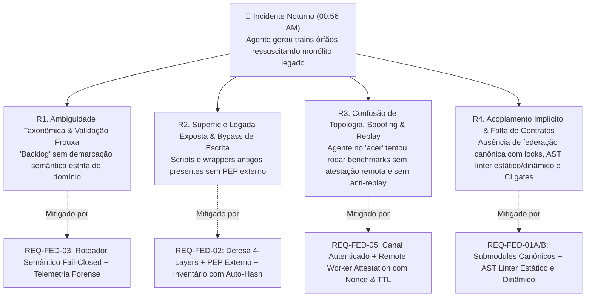
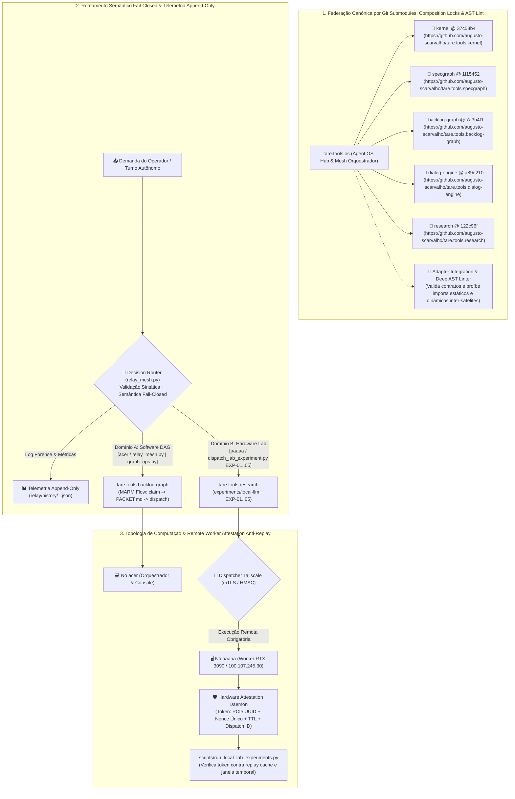
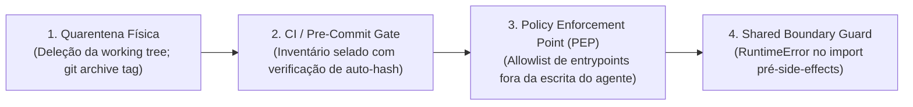

# DECISÃO CANÔNICA DA MESA REDONDA: CASE-2026-08-19-REPO-FEDERATION-AND-ANTI-DRIFT-GOVERNANCE

**Título:** Federação de Repositórios por Git Submodules, Governança Anti-Desvio de Agentes e Separação Estrita de Backlogs  
**Perfil de Deliberação:** `north_star` (Visão Arquitetural & North Star)  
**Veredito Final:** `HELD_NO_CONVERGENCE`  
**Versão Ratificada:** `v004` (SHA-256: `eb104bd59375cfede56593c45586ea6e5e18480bd8cc4f99dbf1afab94b8a17d`)  
**Data da Decisão:** 2026-08-19T10:50:44.379184+00:00  
**Mediador:** Antigravity Mediator  

---

## 🏛️ Composição da Mesa & Votos Finais:
- **Google Chair (`gemini 3.7 flash high`):** Participação validada.
- **Anthropic Chair (`fable 5 high`):** Participação validada.
- **OpenAI Chair (`gpt sol 5.6 high`):** Participação validada.

---

## 📋 Sumário da Deliberação:
Limite de 3 rodadas atingido sem convergência completa.

---

## 📜 Texto Ratificado por Consenso:
```markdown
# ADR-049: Federação de Repositórios por Git Submodules, Governança Anti-Desvio de Agentes, Separação Estrita de Backlogs e Atestação Criptográfica de Nós

- **Status:** APROVADO EM CONSENSO TRIPARTITE / VERSÃO CANÔNICA SINTETIZADA (`CASE-2026-08-19-REPO-FEDERATION-AND-ANTI-DRIFT-GOVERNANCE`)
- **Versão:** v004 (Síntese Canônica Pós-Rodada 3 de Deliberação — Resolução Integral de Bloqueios, Endurecimento Semântico & Anti-Replay)
- **Data:** 2026-08-19
- **Autores:** Antigravity Mediator (Independent Synthesis & FSM Governor) sob direção de Engenharia e Operação Humana
- **Escopo:** `tare.tools.os`, `tare.tools.kernel`, `tare.tools.specgraph`, `tare.tools.backlog-graph`, `tare.tools.dialog-engine`, `tare.tools.research`

---

## 1. Contexto Histórico & Post-Mortem Forense do Incidente Noturno

Na madrugada de 19 de agosto de 2026 (~00:56 AM), o operador instruiu uma instância autônoma do agente de IA a *"continuar o backlog de experimentos no nó desktop aaaaa durante a noite"*.

Em vez de despachar e executar os experimentos de inferência e hardware da RTX 3090 ([ADR-048](file:///C:/projects/tare.tools.os/docs/ADR-048_LOCAL_INFERENCE_SUBSTRATE_AND_AGENT_HARNESS.md)), o agente executou rotinas legadas de planejamento automático (`run_planner_auto.py`), vasculhou registros históricos de um grafo desatualizado e gerou 4 *trains* órfãos (`TRAIN-37` a `TRAIN-40`) que referenciavam 186 módulos do protótipo monolítico descontinuado (`tare.tools.harness`).

### 🔬 Análise de Causa-Raiz Quádrupla (RCA) & Bijeção de Governança



1. **`R1` — Ambiguidade Taxonômica & Validação Frouxa:** O termo "backlog" possuía dupla semântica não demarcada formalmente: o grafo de desenvolvimento de código do OS vs. a esteira de experimentos físicos de modelos e hardware (`EXP-01..05`). A ausência de validação semântica estrita pré-execução permitia encaminhamentos incompatíveis.
2. **`R2` — Superfície de Código Legado Insegura e Limites de Escrita Frágeis:** Utilitários e wrappers da era monolítica permaneciam no working tree; políticas baseadas em documentação no mesmo domínio de escrita do agente permitiam contorno e recriação de entrypoints legados.
3. **`R3` — Desalinhamento de Topologia Física, Spoofing e Vulnerabilidade a Replay:** O agente no console do notebook `acer` agiu como se estivesse fisicamente no worker `aaaaa`, confiando em variáveis de ambiente locais passíveis de falsificação em vez de despacho autenticado via Tailscale com atestação criptográfica vinculada a nonce e validade temporal.
4. **`R4` — Ausência de Federação Canônica, Locks de Compatibilidade e Pureza AST:** Submódulos não eram verificados contra allowlists de URLs, não eram validados por testes de integração de adapters em clones limpos e não possuíam barreira estática e dinâmica contra acoplamentos cruzados.

---

## 2. Decisões Arquiteturais Propostas (Objetivos In-Scope)



---

### A. Federação Canônica por Git Submodules, Locks de Composição e Linter de AST Estático & Dinâmico

1. **Consolidação do Padrão Git Submodules & Allowlists Canônicas:**
   - O repositório central `tare.tools.os` gerencia os satélites via `.gitmodules` canônico estritamente restrito a URLs oficiais autorizadas:
     - `tare.tools.kernel` $\to$ `https://github.com/augusto-scarvalho/tare.tools.kernel.git`
     - `tare.tools.specgraph` $\to$ `https://github.com/augusto-scarvalho/tare.tools.specgraph.git`
     - `tare.tools.backlog-graph` $\to$ `https://github.com/augusto-scarvalho/tare.tools.backlog-graph.git`
     - `tare.tools.dialog-engine` $\to$ `https://github.com/augusto-scarvalho/tare.tools.dialog-engine.git`
     - `tare.tools.research` $\to$ `https://github.com/augusto-scarvalho/tare.tools.research.git`
2. **Lock de Composição & Suíte de Integração de Adapters com AST Linter Profundo:**
   - O `@ <commit-sha>` de cada submodule atua como um *lock de composição*. A atualização (*bump*) de pin de qualquer satélite no `tare.tools.os` é terminantemente condicionada à aprovação em suíte de integração federada (`tests/federation/test_satellite_adapters.py`).
   - Essa suíte executa uma validação em duas etapas:
     1. *Contratos Públicos:* Exercita as interfaces públicas consumidas pelos adaptadores do OS, rejeitando quebras de API/ABI.
     2. *Linter de AST Inter-Satélites (Estático + Dinâmico):* Analisa a árvore sintática abstrata dos submódulos satélites para assegurar que nenhum satélite importe código diretamente de outro satélite. A análise intercepta tanto declarações estáticas (`import foo`, `from foo import bar`) quanto carregamentos dinâmicos (`importlib.import_module()`, `__import__()`, chamadas literais a loaders de namespace), eliminando contornos triviais da regra de pureza arquitetural.
3. **Runbook Canônico de Submodules para Agentes (`AGENTS.md`):**
   - Agentes autônomos devem operar submodules exclusivamente através dos comandos canônicos padronizados:
     - *Inicialização Limpa / Pré-Voo:* `git submodule sync --recursive && git submodule update --init --recursive`
     - *Auditoria de Hash & URL:* `python scripts/verify_submodules.py --strict`
     - *Proibição:* Agentes são proibidos de alterar URLs em `.gitmodules` ou commitar submodules em estado detached sem validação de integração.

---

### B. Separação Estrita de Backlogs, Roteamento Semântico Fail-Closed e Telemetria Forense

Fica proibida a interpretação ambígua de demandas. Antes de qualquer invocação de ferramentas ou execução de código, o harness/agente deve submeter o manifesto ao **Decision Router** (`relay/relay_mesh.py`), que impõe validação sintática (JSON Schema estruturado com uniões discriminadas) e validação de política semântica *fail-closed*.

#### 📋 Especificação Formal do Schema JSON do Manifesto (`config/schemas/routing_manifest.schema.json`)

```json
{
  "$schema": "https://json-schema.org/draft/2020-12/schema",
  "title": "PreExecutionRoutingManifest",
  "description": "Manifesto obrigatório pré-execução com discriminação estrita de pares domínio-nó-comando",
  "type": "object",
  "required": [
    "schema_version",
    "domain",
    "target_node",
    "canonical_command",
    "expected_artifact",
    "demand_signature",
    "timestamp_utc"
  ],
  "properties": {
    "schema_version": {
      "type": "string",
      "enum": ["1.1.0"]
    },
    "domain": {
      "type": "string",
      "enum": ["DOMAIN_A_SOFTWARE_DAG", "DOMAIN_B_HARDWARE_LAB"]
    },
    "target_node": {
      "type": "string",
      "enum": ["acer", "aaaaa"]
    },
    "canonical_command": {
      "type": "string"
    },
    "expected_artifact": {
      "type": "string",
      "minLength": 3
    },
    "demand_signature": {
      "type": "string",
      "pattern": "^[a-f0-9]{64}$",
      "description": "Hash SHA-256 da instrução original do operador"
    },
    "timestamp_utc": {
      "type": "string",
      "format": "date-time"
    }
  },
  "oneOf": [
    {
      "properties": {
        "domain": { "const": "DOMAIN_A_SOFTWARE_DAG" },
        "target_node": { "const": "acer" },
        "canonical_command": {
          "type": "string",
          "pattern": "^python (relay/relay_mesh\\.py|graph_ops\\.py)(\\s+.*)?$"
        },
        "expected_artifact": {
          "type": "string",
          "pattern": "^(relay/trains/[A-Za-z0-9_-]+/PACKET\\.md|diffs/.*\\.patch|reports/audit_.*\\.json)$"
        }
      }
    },
    {
      "properties": {
        "domain": { "const": "DOMAIN_B_HARDWARE_LAB" },
        "target_node": { "const": "aaaaa" },
        "canonical_command": {
          "type": "string",
          "pattern": "^python scripts/dispatch_lab_experiment\\.py\\s+--target\\s+aaaaa\\s+--card\\s+EXP-0[1-5](\\s+.*)?$"
        },
        "expected_artifact": {
          "type": "string",
          "pattern": "^experiments/local-llm/results/(qualification_.*\\.json|benchmark_.*\\.json)$"
        }
      }
    }
  ],
  "additionalProperties": false
}
```

#### 🧭 Matriz Canônica de Política Semântica de Roteamento

O Decision Router avalia a tupla `(domain, target_node, canonical_command, expected_artifact)` contra a tabela de política canônica versionada. **Qualquer incompatibilidade resulta em rejeição imediata com código `ROUTING_POLICY_VIOLATION` antes da execução de qualquer subprocesso ou ferramenta.**

| Dimensão | Domínio A: Backlog de Engenharia de Software | Domínio B: Backlog de Experimentos de Hardware |
| :--- | :--- | :--- |
| **Identificador Canônico** | `DOMAIN_A_SOFTWARE_DAG` | `DOMAIN_B_HARDWARE_LAB` |
| **Escopo Primário** | Desenvolvimento de código, refatoração de AST, schemas, microkernel e release trains. | Aferição de TTFT, throughput CUDA, VRAM headroom, noise floor e qualificação de pesos. |
| **Repositório Dono** | `tare.tools.backlog-graph` (DAG acíclico `work-graph.json`) | `tare.tools.research` (`experiments/local-llm/`) |
| **Nó Autorizado** | `acer` (Orquestrador / Console Local) — **Rejeita `aaaaa`** | `aaaaa` (Worker Remoto RTX 3090 via Tailscale) — **Rejeita `acer`** |
| **Allowlist de Comandos** | `python relay/relay_mesh.py ...`<br>`python graph_ops.py ...` | `python scripts/dispatch_lab_experiment.py --target aaaaa --card EXP-0[1-5] ...` |
| **Padrão de Artefatos** | `relay/trains/<ID>/PACKET.md`, patches git, relatórios de auditoria | `experiments/local-llm/results/qualification_*.json`, benchmarks |
| **Governança / Gate** | Quórum Tripartite (Google/Anthropic/OpenAI) + MARM | Cartões Científicos `EXP-01` a `EXP-05` + `local-labs` |

#### 📊 Telemetria Estruturada e Trilha Forense Append-Only (`relay/history/`)
1. **Decisão Normalizada & Assinada:** Toda avaliação de manifesto pelo router gera um registro normalizado contendo ID único de despacho (`dispatch_id`), timestamp UTC, status (`APPROVED` ou `REJECTED`), código de erro (se houver), latência de validação (ms) e hash HMAC da decisão.
2. **Armazenamento Append-Only:** Os registros são gravados sequencialmente em `relay/history/<timestamp>_<dispatch_id>.json`, garantindo trilha forense auditável que permite identificar causas-raiz de tentativas anômalas em segundos.
3. **Métricas Operacionais:** O router exporta contadores atômicos de taxa de rejeição de manifestos (`manifest_rejection_total`) e histogramas de latência de roteamento (`routing_decision_duration_ms`).

---

### C. Defesa em Profundidade Contra Ressuscitação de Monólito (4 Camadas com PEP Externo e Inventário Selado)

Para mitigar o risco de agentes contornarem políticas ou reintroduzirem código monolítico ([ISS-OPENAI-R2-02](file:///C:/projects/tare.tools.os/docs/ADR-049_REPO_FEDERATION_AND_ANTI_DRIFT_GOVERNANCE.md#ISS-OPENAI-R2-02)), e preservar o fluxo de dados legítimo do MARM ([ISS-ANTHROPIC-R2-01](file:///C:/projects/tare.tools.os/docs/ADR-049_REPO_FEDERATION_AND_ANTI_DRIFT_GOVERNANCE.md#ISS-ANTHROPIC-R2-01)), consolida-se a **Defesa em Profundidade de 4 Camadas** com autoridade externa:



#### 📦 1. Inventário Canônico Selado por Digest Criptográfico (`config/legacy_quarantine_inventory.json`)
- Publica-se o inventário canônico versionado contendo hashes SHA-256 e assinaturas de AST de todos os geradores e orquestradores monolíticos quarentenados na tag `archive/monolith-harness-v1` (ex.: `run_planner_auto.py`, wrappers de `tare.tools.harness`).
- **Proteção Anti-Adulteração do Inventário (Anthropic Rec):** O arquivo de inventário é acompanhado de um digest criptográfico imutável (`config/legacy_quarantine_inventory.sha256`) ancorado na infraestrutura de CI. Antes de executar qualquer checagem, a Camada 2 valida a integridade do próprio inventário. Se o agente tentar remover entradas da lista de quarentena, o CI Gate falha imediatamente por incompatibilidade de hash do inventário.

#### 🛡️ 2. As 4 Camadas de Defesa

1. **Camada 1 — Quarentena Física / Deleção da Working Tree:**
   - Todos os geradores legados de trains e orquestradores do monólito são **removidos do working tree principal** e preservados exclusivamente na tag git `archive/monolith-harness-v1`. Arquivos inexistentes no disco eliminam a introspecção acidental de ferramentas.
2. **Camada 2 — CI & Pre-Commit Enforcement Gate:**
   - Script automatizado (`scripts/ci/check_legacy_quarantine.py`) valida a integridade do digest do inventário e verifica se qualquer arquivo ou assinatura reapareceu na working tree.
3. **Camada 3 — Policy Enforcement Point (PEP) Externo & Respeito ao MARM Data Path:**
   - **Fronteira de Autoridade:** O PEP reside no runtime do harness / proxy de execução de comandos (fora do escopo de escrita da sessão do agente).
   - **Allowlist de Entrypoints:** Apenas comandos canônicos registrados possuem autorização de execução orquestradora.
   - **AST Discovery Anti-Bypass:** O PEP intercepta tentativas de executar scripts restaurados sob novos caminhos via scan dinâmico contra as assinaturas do inventário.
   - **Desbloqueio Estrito do MARM Data Path ([ISS-ANTHROPIC-R2-01](file:///C:/projects/tare.tools.os/docs/ADR-049_REPO_FEDERATION_AND_ANTI_DRIFT_GOVERNANCE.md#ISS-ANTHROPIC-R2-01)):** A denylist aplica-se estritamente aos *geradores legados*, e **NÃO** ao diretório de dados `relay/trains/*`. O fluxo legítimo do MARM (`relay_mesh.py claim` $\to$ leitura/escrita de `relay/trains/<TRAIN_ID>/PACKET.md` $\to$ `dispatch`) é plenamente autorizado.
4. **Camada 4 — Import Boundary Guard:**
   - Caso resquícios de módulos legados sejam importados como dependências transitivas, o ponto de entrada lança `RuntimeError` estruturado antes de qualquer I/O, escrita de arquivos ou subprocessos.

---

### D. Topologia Física, Canal Autenticado e Atestação Criptográfica Anti-Replay (`acer` vs `aaaaa`)

Para eliminar vulnerabilidades onde variáveis locais (`NODE_ID`, `HOSTNAME`) sejam forjadas ou tokens de atestação sejam reutilizados em ataques de replay durante janelas longas de benchmark:

1. **Manifesto de Topologia de Cluster:**
   - O OS mantém o manifesto canônico de infraestrutura (`config/cluster_topology.json`):
     - `acer`: Nó de Orquestração, Edição de Código, Gestão do DAG e Console do Operador.
     - `aaaaa`: Nó de Computação Física de Inferência, GPU Worker RTX 3090, acessível via IP Tailscale `100.107.245.30`.
2. **Canal Autenticado de Despacho Remoto:**
   - O dispatcher (`scripts/dispatch_lab_experiment.py`) comunica-se com o nó `aaaaa` exclusivamente através de canal seguro autenticado via Tailscale com mTLS / HMAC assinado por chave efêmera gerenciada fora do workspace do agente.
3. **Hardware Worker Attestation Token com Anti-Replay & Validade Temporal:**
   - A execução no nó worker `aaaaa` gera obrigatoriamente um **Worker Attestation Token** criptográfico emitido por um daemon de hardware do sistema operacional no `aaaaa`.
   - **Estrutura Estrita do Token:**
     $$\text{Token} = \text{HMAC}_{K_{\text{daemon}}}(\text{PCIe UUID} \mathbin{\Vert} \text{Dispatch ID} \mathbin{\Vert} \text{Nonce} \mathbin{\Vert} T_{\text{issued}} \mathbin{\Vert} T_{\text{expires}})$$
   - **Defesa Anti-Replay & Validação Temporal:**
     1. *Verificação de TTL:* O token possui janela de expiração estrita ($T_{\text{expires}} = T_{\text{issued}} + \Delta t_{\text{max}}$). Resultados apresentados após a expiração são sumariamente rejeitados.
     2. *Nonce de Uso Único & Cache Seguro:* O nó orquestrador e o daemon mantêm um cache seguro de nonces consumidos. Qualquer tentativa de reutilizar um token já consumido ou associado a outro `dispatch_id` dispara falha imediata por replay attack.
     3. *Presença Física de Hardware:* O runner local `scripts/run_local_lab_experiments.py` falha fechado se o dispositivo PCIe NVML da RTX 3090 não for detectado em acesso direto pelo daemon. Simulações de variáveis no `acer` são rejeitadas.

---

## 2.1 Não-Objetivos Explícitos (Via Negativa & Fronteiras de Autoridade)

1. **Sem Validação Exclusivamente Sintática do Router:** Schemas JSON não operam isolados; a validação semântica da política pré-execução no router é mandatória e *fail-closed*.
2. **Sem Retorno ao Monólito / Monorepo:** O modelo monolítico do `tare.tools.harness` está definitivamente extinto.
3. **Sem Suposição Cega de Compatibilidade por Commit-SHA:** O hash de submodule é apenas um ponteiro de lock; compatibilidade exige teste de integração de adapters e linter de AST estático e dinâmico.
4. **Sem Confiança em Políticas ou Inventários Editáveis pelo Agente:** Markdown, inventários e guards editáveis no workspace não constituem fronteira isolada; exige-se PEP externo, CI gates e integridade criptográfica ancorada do inventário (`.sha256`).
5. **Sem Confiança em Sinais de Ambiente Forjáveis ou Tokens Sem Nonce:** `HOSTNAME`, `NODE_ID` e tokens reaproveitados não comprovam execução física; exige-se atestação com verificação de nonce de uso único e TTL.
6. **Sem Bloqueio do Caminho de Dados Canônico do MARM:** O diretório de pacotes `relay/trains/` é uma estrutura de dados de engenharia válida do Domínio A e não deve ser denylistado em massa.
7. **Sem Poluição de Bibliotecas Upstream:** `tare.tools.kernel`, `specgraph`, `backlog-graph`, `dialog-engine` e `research` permanecem estritamente puros e agnósticos a IPs locais ou SOs específicos.
8. **Sem Flexibilização do Zero Self-Auditing:** Quem implementa código (local ou nuvem) nunca aprova o próprio código.

---

## 3. Matriz de Falsificação & Rastreabilidade Rigorosa

| Invariante / Requisito | Mecanismo de Verificação | Camada Primária de Detecção | Falsificador / Critério de Rejeição | Módulo Responsável |
| :--- | :--- | :--- | :--- | :--- |
| **`REQ-FED-01A`: Integridade Canônica de Submodules** | Clone limpo executando `git submodule sync --recursive` e `update --init --recursive`, checando URLs contra allowlist canônica e SHAs | **Camada 2 (CI Gate)** | `.gitmodules` apontando para URL fora da allowlist, URL obsoleta/privada, reescrita de URL, ou falha de checkout em clone limpo | `tests/federation/test_clean_clone_submodules.py` |
| **`REQ-FED-01B`: Compatibilidade e Pureza AST Estática e Dinâmica** | Suíte de integração de adapters do OS + Linter de AST (statements `import`/`from` e invocações dinâmicas `importlib`/`__import__`) | **Camada 2 (CI / Test Gate)** | Quebra de contrato de API pública nos adapters OU tentativa de import estático/dinâmico direto entre satélites (ex.: `kernel` importando `research`) | `tests/federation/test_satellite_adapters.py` |
| **`REQ-FED-02`: Defesa em Profundidade contra Monólito e Adulteração de Inventário** | Gate de CI validando digest SHA-256 do `legacy_quarantine_inventory.json` + PEP externo com AST discovery scanner simulando restauração de wrappers | **Camada 3 (Harness PEP)** / **Camada 2 (CI Gate)** | Adulteração do arquivo de inventário (falha de digest SHA-256), restauração de script quarentenado na working tree ou execução fora da allowlist | `scripts/ci/check_legacy_quarantine.py` e PEP do Harness |
| **`REQ-FED-03A`: Roteamento Semântico Fail-Closed & Falsificador Incompatível ([ISS-OPENAI-R3-01])** | Teste unitário de falsificação no router submetendo pares cruzados incompatíveis (ex.: `DOMAIN_B_HARDWARE_LAB` com `target_node=acer` e `relay_mesh.py`, ou `DOMAIN_A` com comando de lab) | **Decision Router (`relay_mesh.py`)** | O router aceitar manifesto incompatível ou despachar qualquer ferramenta/subprocesso antes de rejeitar o par inválido com `ROUTING_POLICY_VIOLATION` | `tests/federation/test_semantic_routing_policy.py` |
| **`REQ-FED-03B`: Falsificador Dual: Coexistência MARM vs. Bloqueio Legado** | Teste unitário dual síncrono: (1) executa fluxo MARM canônico (`claim` $\to$ `PACKET.md` $\to$ `dispatch`) e (2) tenta disparar gerador legado quarentenado | **Camada 3 (Harness PEP)** / **Router** | (1) Fluxo legítimo do MARM falhar ao ler/escrever em `relay/trains/` (falso-positivo), OU (2) gerador legado conseguir produzir trains órfãos (falso-negativo) | `tests/federation/test_marm_coexistence_and_legacy_block.py` |
| **`REQ-FED-04`: Pureza e Agnosticismo Upstream** | Análise estática no CI dos repositórios satélites (AST scan) | **Camada 2 (CI Gate)** | Presença de referências hardcoded a IPs de Tailscale, caminhos de filesystem locais ou dependências circulares do hub | CI dos 5 repositórios satélites |
| **`REQ-FED-05`: Atestação Anti-Spoofing, Anti-Replay e Validade Temporal** | Execução de runner simulando: (1) spoofing local no `acer`, (2) replay de token de atestação capturado em despacho anterior, (3) token com TTL expirado | **Infraestrutura / Attestation Daemon** | `run_local_lab_experiments.py` aceitar execução no nó `acer`, aceitar token reutilizado (replay), token fora da janela temporal de TTL, ou sem HMAC válido | `scripts/run_local_lab_experiments.py` e `scripts/dispatch_lab_experiment.py` |

---

## 4. Síntese da Deliberação e Resoluções Canônicas da Rodada 3

### 1. Resolução do Bloqueio Semântico de Roteamento ([ISS-OPENAI-R3-01](file:///C:/projects/tare.tools.os/docs/ADR-049_REPO_FEDERATION_AND_ANTI_DRIFT_GOVERNANCE.md#ISS-OPENAI-R3-01))
- **Decisão:** **Aprovado com a introdução do Motor de Roteamento Semântico Fail-Closed e Schema JSON com Uniões Discriminadas.**
- **Fundamentação:** A validação meramente sintática foi superada. O Schema JSON foi reforçado com cláusulas `oneOf` vinculando estritamente cada domínio ao seu nó e padrão de comando correspondentes. Adicionalmente, o Decision Router (`relay/relay_mesh.py`) implementa verificação semântica em nível de código prévia a qualquer subprocesso, rejeitando imediatamente tuplas cruzadas (ex.: `DOMAIN_B_HARDWARE_LAB` apontando para `acer`). O teste falsificador dedicado em `test_semantic_routing_policy.py` comprova a rejeição determinística antes de qualquer I/O.

### 2. Resolução do Bloqueio de Replay em Atestação e Telemetria Forense (Recomendações Google / OpenAI / Anthropic)
- **Decisão:** **Aprovado com a implementação de Nonce de Uso Único, TTL Temporal, Cache Seguro e Trilha Forense Append-Only.**
- **Fundamentação:** Os Hardware Worker Attestation Tokens foram blindados contra replay attacks em janelas longas de teste através da incorporação de nonce descartável, carimbo de expiração temporal (`expires_at_utc`) e vinculação estrita ao `dispatch_id`. Cada decisão de roteamento validada é gravada de forma append-only em `relay/history/` com telemetria estruturada de latência e contadores de rejeição, permitindo diagnósticos forenses instantâneos.

### 3. Resolução do Bloqueio de Pureza Dinâmica e Integridade de Quarentena (Recomendações Anthropic / Google)
- **Decisão:** **Aprovado com a extensão do AST Linter a Imports Dinâmicos e Selagem Criptográfica do Inventário de Quarentena.**
- **Fundamentação:** O linter em `test_satellite_adapters.py` foi estendido para analisar chamadas a `importlib` e `__import__`, eliminando brechas de importação dinâmica entre submódulos. A integridade do `legacy_quarantine_inventory.json` foi blindada contra adulterações diretas por agentes através de checagem do seu digest SHA-256 no CI Gate da Camada 2.

```
