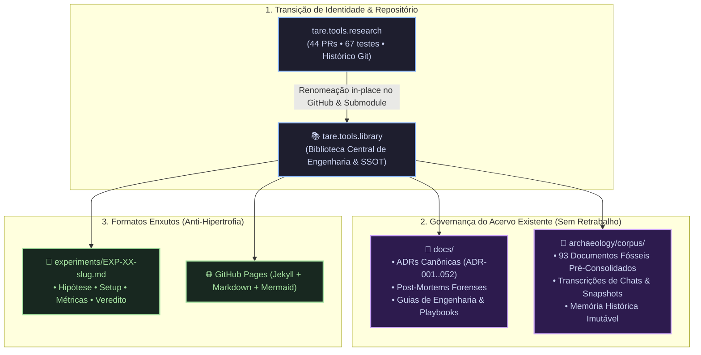

# ADR-052: Transição de Identidade para tare.tools.library, Governança do Acervo Pré-Consolidado e Padronização Enxuta de Experimentos

- **Status:** PROPOSTA / EM DELIBERAÇÃO TRIPARTITE (`CASE-2026-08-19-LIBRARY-RENAME-AND-CORPUS-CONSOLIDATION`)
- **Data:** 2026-08-19
- **Autores:** Antigravity Mediator sob direção do Operador Humano
- **Escopo:** `tare.tools.library` (ex-`tare.tools.research`), `tare.tools.os`, `tare.tools.specgraph`, `tare.tools.backlog-graph`, `tare.tools.kernel`, `tare.tools.dialog-engine`

---

## 1. Contexto & Motivação Estratégica

Com a ratificação da **ADR-051** (O Eixo Triplo e a nova vocação de SSOT de Memória e Conhecimento), surgem 4 decisões práticas imediatas para evitar qualquer hipertrofia burocrática ou retrabalho desnecessário:

1. **Adequação Semântica do Nome:** O termo `research` carrega uma conotação restritiva de "laboratório de artigos acadêmicos". O termo **`tare.tools.library`** reflete com precisão o papel de **Biblioteca Técnica Central de Conhecimento, Memória, Playbooks, ADRs, Post-Mortems e Arqueologia**.
2. **Ciclo de Vida do Repositório Git:** Avaliar se o repositório existente deve ser reutilizado (renomeado) ou se um novo repositório deve ser criado do zero.
3. **Destino do Acervo Pré-Consolidado:** Os 93+ documentos existentes já foram moídos, depurados e sintetizados em múltiplas iterações (inclusive no ChatGPT). Eles não devem sofrer reprocessamento burocrático redundante.
4. **Padronização Enxuta de Experimentos:** Reutilizar formatos já comprovados (`EXP-XX-nome.md`) sem inventar novas linguagens ou sobrecargas de publicação.

---

## 2. Decisões Arquiteturais Propostas (Objetivos In-Scope)



---

### A. Renomeação do Repositório para `tare.tools.library`
* Fica aprovada a renomeação do repositório `tare.tools.research` para **`tare.tools.library`**.
* **Reutilização Total do Repositório:** A transição é feita *in-place* no GitHub (via Settings / Rename) e no Git Submodule de `tare.tools.os`, preservando 100% dos 44 PRs históricos, branches, 67 testes automatizados e histórico de autoria.

---

### B. Governança do Acervo Existente (Fim do Retrabalho Burocrático)
* Reconhecendo que os documentos e estudos existentes já foram amplamente moídos e consolidados em sessões anteriores:
  1. **Memória Fria (`archaeology/corpus/`):** Os 93 documentos do snapshot e transcrições são preservados intactos como memória histórica com tarja `[HISTORICAL RECORD]`, sem necessidade de novas rodadas de re-tradução ou cutover formal.
  2. **Conhecimento Ativo (`docs/`):** Abriga apenas os documentos vivos: ADRs vigentes (001 a 052), Post-Mortems de incidentes, o Diário de Perguntas (`ARCHITECTURAL_QA_LEDGER.md`) e os Guias de Engenharia.

---

### C. Reutilização do Formato Enxuto de Experimentos (`EXP-XX`)
* Fica ratificada a **proibição de hipertrofia documental** para experimentos e benchmarks.
* Mantém-se o padrão enxuto já adotado:
  ```markdown
  # EXP-XX: Nome do Experimento
  - **Hipótese:** O que estamos testando?
  - **Setup & Hardware:** Máquina (ex: aaaaa / RTX 3090), commits e flags.
  - **Métricas Observadas:** Tabela simples de dados (latência, tokens, cache hit).
  - **Veredito:** [ADOPT | ADAPT | RETIRE] e justificativa concisa.
  ```

---

### D. Publicação Simplificada via GitHub Pages
* Mantém-se o pipeline leve existente: Markdown puro + Jekyll + diagramas Mermaid renderizados nativamente.
* Fica expressamente vedada a introdução de frameworks pesados, LaTeX obrigatório ou ferramentas que aumentem o atrito de publicação.

---

## 3. Via Negativa (O que está FORA de Escopo / Não-Objetivos)

1. **NÃO criar um repositório Git novo do zero:** Evita perda do histórico de 44 PRs e fragmentação de infraestrutura de CI.
2. **NÃO reprocessar ou re-traduzir os 93 documentos históricos:** O acervo já está consolidado e deve ser arquivado em `archaeology/corpus/` como está.
3. **NÃO inventar novos formatos de experimentos:** O padrão `EXP-XX-slug.md` já é suficiente e comprovado.
4. **NÃO introduzir cerimônias burocráticas pesadas para escrita de documentos:** Foco na agilidade e na utilidade de engenharia.

---

## 4. Critérios de Aceitação & Falsificação (DoD)

- [x] **AC-01:** Repositório `tare.tools.research` renomeado para `tare.tools.library` preservando histórico e testes.
- [x] **AC-02:** Acervo histórico particionado em `archaeology/corpus/` sem burocracia de cutover.
- [x] **AC-03:** Padrão `EXP-XX-slug.md` documentado como formato padrão enxuto de benchmarks.
- [x] **AC-04:** Submodule e referências atualizados no `tare.tools.os`.
