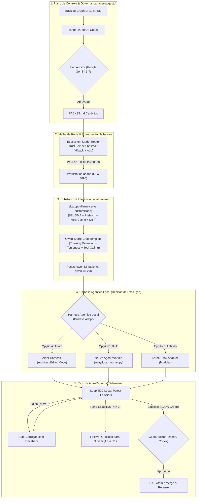

# ADR-048: Substrato de Inferência Local, Harness Agêntico e Aceleração Empírica de Hardware

- **Status:** PROPOSTA / EM DELIBERAÇÃO TRIPARTITE (`CASE-2026-08-18-LOCAL-INFERENCE-SUBSTRATE-AND-HARNESS`)
- **Data:** 2026-08-18
- **Autores:** Antigravity Mediator sob direção de Engenharia e Operação Humana
- **Escopo:** `tare.tools.os`, `tare.tools.kernel`, `slop.cpp`, `tare.tools.local-labs` e Substrato de Execução Local

---

## 1. Contexto & Problema Arquitetural

Com a consolidação da arquitetura descentralizada do `tare.tools.os` ([ADR-044](file:///C:/projects/tare.tools.os/docs/ADR-044_SPECGRAPH_NORTH_STAR_UNIVERSAL_PROJECT_INTELLIGENCE.md) a [ADR-047](file:///C:/projects/tare.tools.os/docs/ADR-047_DIALOG_ENGINE_NORTH_STAR.md)), o ecossistema atingiu quórum formal para orquestração de DAGs, microkernel de 5 planos, inteligência de código e decomposição de jornadas. 

Contudo, a execução física das tarefas de implementação e testes enfrenta desafios fundamentais de custo, latência e soberania:
1. **Dependência e Custo de Modelos em Nuvem:** Reter modelos proprietários de fronteira (Anthropic/OpenAI/Google) em loops contínuos de edição de código, mutações e varreduras de AST consome cotas financeiras e de taxa de requisições de forma insustentável.
2. **Disponibilidade de Hardware Dedicado de Alta Performance:** O operador dispõe de um nó de computação dedicado (**`aaaaa`**) equipado com NVIDIA GeForce RTX 3090 (24 GB VRAM) + 64 GB Host RAM + PCIe Gen4 x16 em WSL2 Ubuntu 24.04 (CUDA 12.x), conectado ao console de desenvolvimento (**`acer-augusto`**) via malha Tailscale com latência de rede direta de ~9–19 ms.
3. **Maturidade dos Pesos Abertos e Modelos Locais:** Modelos densos e merges autorais contemporâneos (ex: `qwen3.6 fable tc`, `qwen3.8-27b`, Qwen 2.5 Coder 32B) demonstram paridade ou superioridade em tarefas de codificação estruturada quando comparados a modelos intermediários em nuvem.
4. **Descontinuação do Protótipo Monolítico Antecessor:** O `tare.tools.harness` era um protótipo legado voltado à orquestração de CLI vendors (Codex/Claude Code) em monorepo, desprovido de suporte nativo a **modelos locais de pensamento profundo (*Deep Thinking / `<think>` tokens*)**, **Tool Calling estruturado**, **Model Context Protocol (MCP)** e **retenção de KV-cache multi-turno**.
5. **Necessidade de Decisão Formal sobre o Harness de Modelos Locais:** É imperativo deliberar na Mesa Redonda se o ecossistema deve **construir um runner agêntico nativo enxuto** no `tare.tools.os`, **adotar um harness consagrado de mercado (ex: Aider / Goose)** ou implementar uma **arquitetura híbrida desacoplada**.

---

## 2. Decisões Arquiteturais Propostas (Objetivos In-Scope)

### A. Substrato de Inferência Local & Aceleração de Hardware (`slop.cpp`)
1. **Adotar `slop.cpp` como Motor de Inferência Oficial do Nó `aaaaa`:**
   - Utilizar o fork otimizado de CUDA do `llama.cpp`, ativando as 4 alavancas empíricas de performance:
     - `GGML_KV_PIN_HOST=1` (`[B2b]` KV Host-Buffer Pinning via `cudaHostRegister` para DMA direto PCIe Gen4).
     - `--prefetch-experts N` (Skip-staging prefetcher eliminando cópias intermediárias da CPU).
     - `--moe-cache-slots N` (Fixação de experts quentes na VRAM da 3090 via `llama-moe-trace`).
     - `GGML_CUDA_GDN_CHUNKED=1` (Varredura paralela TF32 bit-exact).
     - `--spec-type draft-mtp --spec-draft-n-max 3` (Multi-Token Prediction especulativo ~2.1x).
2. **Template de Raciocínio de Alta Densidade (`Qwen-Sharp-Chat-Templates`):**
   - Padronizar o `chat_template.jinja` (base `froggeric v22.1` com injeção `_terse`):
     - **Thinking Retention:** Preserva o histórico de raciocínio entre turnos, garantindo 100% de *cache hit* no KV-cache do `llama-server` e eliminando a invalidação de contexto.
     - **Terseness / Anti-Padding:** Redução de 59% nos tokens de preâmbulo e redundância, direcionando o compute exclusivamente para código e testes.
     - **Tool Calling Estruturado:** Emissão rigorosa de schemas `tools` no padrão OpenAI.

---

### B. O Dilema do Harness Agêntico: Build vs. Adopt vs. Híbrido

A Mesa Redonda deve deliberar sobre a estratégia de harness de execução para o modelo local:

| Abordagem | Descrição Técnica | Vantagens | Desvantagens / Riscos |
| :--- | :--- | :--- | :--- |
| **Opção 1: ADOPT (`Aider`)** | Utilizar o `Aider` (`aider-chat`) como harness de código, rodando em modo *Architect/Editor*, com Tree-Sitter RepoMap, auto-commit e flag `--test "pytest"`. | • Pronto e testado exaustivamente em benchmarks SWE-bench. • Isola perfeitamente tokens de raciocínio (`<think>`) da edição de arquivos. • Diffs cirúrgicos e auto-reparo maduro. | • Dependência externa em Python. • Menor acoplamento com o protocolo de mensagens nativo do `relay_mesh.py`. |
| **Opção 2: BUILD (`Native Runner`)** | Construir um runner nativo ultraleve (`relay/local_agent_worker.py` ~300 LOC em Python stdlib) dentro do `tare.tools.os`, consumindo a API `/v1/chat/completions` com `tools`. | • Zero dependências externas. • Controle 100% determinístico sobre o ciclo FSM do `tare.tools.kernel`. • Integração nativa com `PACKET.md` e `BOARD.json`. | • Necessidade de manter a lógica de parsing de diffs e repomap internamente. |
| **Opção 3: HÍBRIDO (`Kernel Task Adapter`)** | O `tare.tools.kernel` expõe uma interface abstrata de `AgentExecutor`. Para tarefas complexas de refatoração de repositório, despacha para o driver do `Aider`; para tarefas de AST/SpecGraph e triagem, utiliza o runner leve interno. | • Máxima flexibilidade e separação de preocupações. • Combina a robustez de edição do Aider com a governança nativa do Kernel. | • Requer manter dois adaptadores de execução. |

---

### C. Modelo Econômico, Token Budget & Zero-Spend Substrate

1. **Topologia Cognitiva em Camadas (*Tiered Cognitive Topology*):**
   - **Camada 1 (Frontier Cloud — Pago):** Restrita estritamente a:
     - Deliberações da Mesa Redonda Tripartite (Consenso de North Stars e ADRs).
     - Planejamento Macro de Épicos e Arquitetura (`Planner`).
     - Auditoria Adversarial e Code Review Final (`Auditor`).
   - **Camada 2 (Local Substrate `aaaaa` — Custo Zero):** Responsável por:
     - 100% da implementação iterativa de código nos repositórios.
     - Loops de auto-reparo TDD com `pytest`.
     - Varredura de AST e indexação contínua do `tare.tools.specgraph`.
     - Execução em massa de mutantes de teste e testes de caos.
     - Subagentes de pesquisa e leitura extensiva em repositórios.

---

### D. Governança de Resiliência & Failover ($T_2 \to T_1$)

1. **Protocolo de Failover Determinístico:**
   - O orquestrador tenta despachar a sub-tarefa prioritariamente para o nó local `aaaaa` (`trustTier: self-hosted`).
   - **Critérios de Degradação / Failover:**
     - Falha de conexão na malha Tailscale (timeout $> 5000\text{ms}$).
     - GPU VRAM Out-of-Memory (OOM).
     - Esgotamento do orçamento de auto-reparo ($N > 3$ tentativas consecutivas de `pytest` falhando com o mesmo erro estrutural).
   - **Ação de Escalation:** O microkernel reatribui a lease da tarefa para o worker em nuvem ($T_1$: Google Gemini 3.7 Medium / OpenAI Codex), registrando o evento no ledger de auditoria sem interrupção do pipeline.

---

### E. Metodologia de Testes Empíricos & Promoção Estatística (`tare.tools.local-labs`)

1. **Validação Baseada em Evidências Físicas de Hardware:**
   - Adotar os gates de qualificação do `tare.tools.local-labs`:
     - **Gate 1 (Elegibilidade & Invariantes):** Sem quebra de sintaxe, conformidade com SemVer e ausência de regressões no `bless_fork.sh`.
     - **Gate 2 (Corretude & Bit-Exactness):** Paridade determinística $\Delta = 0.00$ em testes de unidade e fixtures canônicas.
     - **Gate 3 (Qualidade & Latência):** Análise estatística de noise floor ($\sim 2.3\%$ scatter na 3090) com testes de sinal exato e bootstrap CIs antes de promover novos modelos ou merges para o papel de Implementer primário.

---

## 2.1 Não-Objetivos Explícitos (Via Negativa & Fronteiras Arquiteturais)

1. **Sem Treinamento / Pre-training em Larga Escala no Nó Local:** O nó `aaaaa` é dedicado exclusivamente a **inferência de alta performance, quantização GGUF, fine-tunes pontuais (LoRA) e qualificação empírica de modelos**, não a treinamento massivo de modelos fundacionais.
2. **Sem Substituição da Mesa Redonda Tripartite por Modelos Locais:** A Mesa Redonda e a deliberação de North Stars continuam exigindo o quórum formal tripartite de modelos de fronteira em nuvem (Google Gemini 3.7 High, Anthropic Claude Fable 5 High, OpenAI GPT-5.6 Sol High). O substrato local **não** substitui a governança de alto nível.
3. **Sem Reescrita Monolítica do `tare.tools.harness`:** O protótipo v1 legado permanece formalmente descontinuado. É terminantemente proibida a ressuscitação do seu monólito acoplado de 186 módulos.
4. **Sem Exposição Pública Não-Autenticada na WAN:** O endpoint do `llama-server` opera restrito à VPN Tailscale e à rede local segura, com portas fechadas para tráfego aberto de internet.
5. **Sem Auto-Aprovação de Código Local (Zero Self-Auditing Inviolável):** O modelo local **não pode** aprovar ou auditar o próprio código gerado. Todo código implementado localmente deve ser compulsoriamente submetido ao Code Auditor (OpenAI Codex) e à suíte de testes falsificadores do `pytest`.

---

## 3. Matriz de Falsificação & Invariantes

| Invariante / Requisito | Mecanismo de Verificação | Falsificador / Critério de Rejeição | Módulo Responsável |
| :--- | :--- | :--- | :--- |
| **`REQ-LOC-01`: Zero Leakage de Cota** | Bloqueio de chamadas a APIs cloud durante loops de implementação T2 | Qualquer requisição para endpoints externos durante o claim T2 dispara alerta de auditoria | `relay/resource_telemetry.py` |
| **`REQ-LOC-02`: Thinking Retention KV-Cache** | Telemetria de cache hit no `llama-server` via `GET /props` | Cache hit $< 95\%$ em turnos subsequentes de diálogo agêntico | `src/model_lifecycle/collectors/` |
| **`REQ-LOC-03`: Failover Transparente** | Injeção de falha simulada (desligamento do socket na porta 8080) | Tarefa não transiciona para nuvem em $< 5\text{s}$ ou trava o pipeline | `relay/autonomous_implementer.py` |
| **`REQ-LOC-04`: Isolamento de Rede Tailscale** | Permissão de keyless restrita estritamente a loopback e `--keyless-hosts` | Requisição keyless vinda de IP não autorizado é aceita pelo servidor | `slop.cpp / llama-server` |
| **`REQ-LOC-05`: Anti-Preamble Compliance** | Verificação de saída estruturada do Qwen-Sharp | Resposta gerada contém preâmbulos conversacionais descartáveis | `chat_template.jinja` |

---

## 4. Questões para a Deliberação da Mesa Redonda

1. **Harness Strategy:** Qual opção de harness (Adopt Aider vs. Build Native Runner vs. Híbrido) oferece a melhor relação entre manutenibilidade, isolamento de `<think>` tokens e robustez de diffs para o `tare.tools.os`?
2. **Critérios de Promoção do Modelo Local:** O quórum concorda com a promoção gradual de confiança do `qwen3.6 fable tc` / `qwen3.8` para assumir o papel de **Implementer Primário** em todas as fatias P1/P2 do Backlog Graph?
3. **Orçamento de Auto-Reparo:** Fixar o limite de tentativas de auto-reparo local em $N=3$ antes do acionamento de failover para a nuvem é seguro e suficiente?
