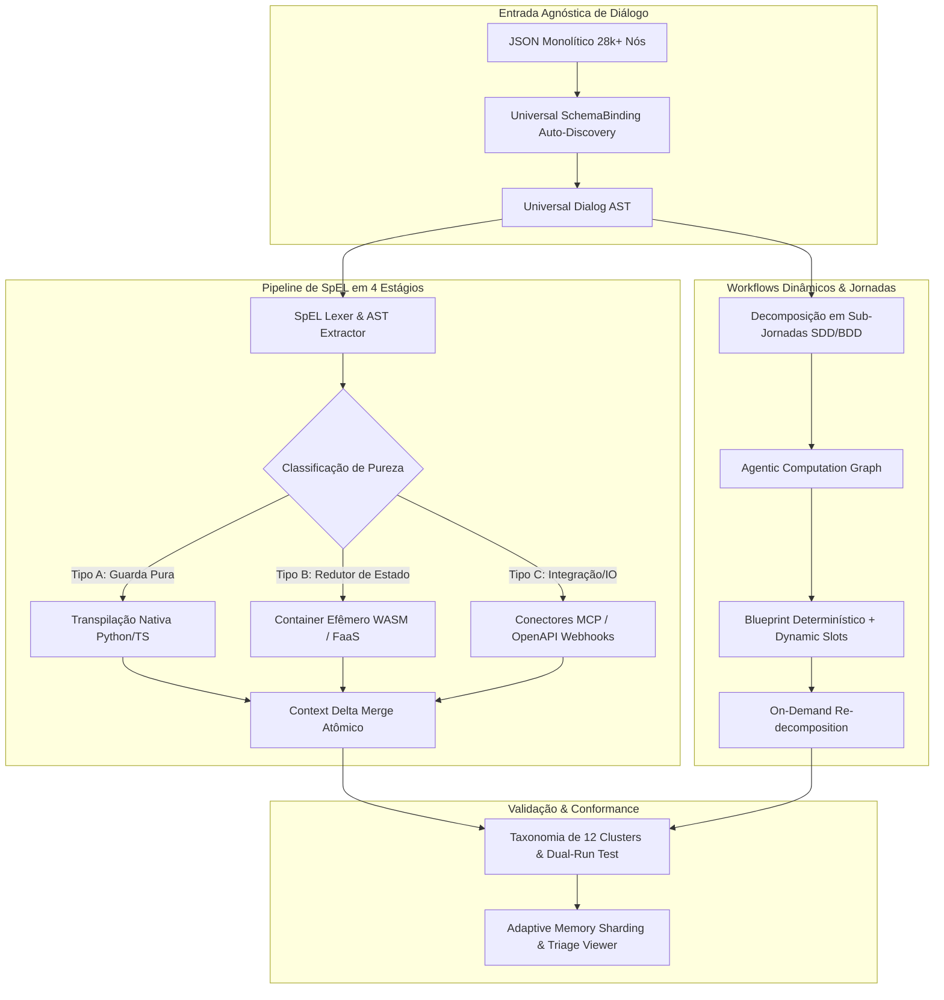

# ADR-047: North Star do tare.tools.dialog-engine — Motor Universal de Decomposição de Jornadas, Workflows Dinâmicos e Transpilação de SpEL

- **Status:** PROPOSTO PARA DELIBERAÇÃO TRIPARTITE (`CASE-2026-08-18-DIALOG-ENGINE-NORTH-STAR`)
- **Data:** 2026-08-18
- **Autores:** Arquiteto de Sistemas Conversacionais & Antigravity Swarm (sob governança do Operador Humano)
- **Escopo:** `tare.tools.dialog-engine` (Repositório Standalone Universal & Motor Topológico de Diálogo)

---

## 1. Objetivos Nucleares (In-Scope)

1. **Decomposição Topológica de Jornadas Conversacionais:**
   - Separar ontologicamente a "Jornada de Negócio" (contratos canônicos SDD/BDD) da "Árvore de Diálogo Física" (Watson V1, V2 Actions, Rasa, autômatos aninhados).
   - Decompor monólitos de diálogo com 28.000+ nós em sub-jornadas acíclicas desacopladas e testáveis em isolamento.
2. **Workflows Dinâmicos Orientados a Tarefas (Blueprint-First-Model-Second & ACG):**
   - Transicionar de autômatos estáticos rígidos para grafos de tarefas computacionais (*Agentic Computation Graphs*).
   - Governar a execução através de *blueprints determinísticos* (invariantes de segurança, regras de compliance, transições de estado) com *slots dinâmicos tipados* preenchidos por modelos generativos.
   - Implementar decomposição *on-demand* (ADaPT) para sub-dividir nós em sub-tarefas de clarificação em caso de ambiguidade ou falha.
3. **Pipeline Desacoplado de Extração e Transpilação de SpEL em 4 Estágios:**
   - Extrair a AST de expressões Spring Expression Language (`<? ... ?>`) embutidas em nós de diálogo e classificá-las por pureza (Tipo A: Guardas Booleanas; Tipo B: Redutores de Estado; Tipo C: Ações de Integração).
   - Transpilar para código nativo puro (Python/TS/Go), containers efêmeros/WASM em sandbox ($<32\text{MB}$, $<200\text{ms}$) ou conectores declarativos (OpenAPI 3.0 / MCP).
   - Garantir sincronização de estado atômica através de mesclagem de *Context Delta*.
4. **Binding Universal de Esquemas e Sharding Adaptativo de Memória:**
   - Fornecer camada agnóstica de `SchemaBinding` para Watson V1 Classic, Watson V2 Actions, Rasa e árvores corporativas aninhadas com auto-descoberta.
   - Executar diff semântico e validação estática em arquivos de 100+ MB através de sharding adaptativo e memória externa sem estouro de RAM.
5. **Taxonomia de Validação em 12 Clusters & Dual-Run Conformance:**
   - Manter 127+ testes unitários e de integração automatizados cobrindo paridade semântica, integridade de saltos (*jumps*), ciclos, scoping de variáveis e regressão dual-run.

---

## 1.2 Não-Objetivos Explícitos (Via Negativa / Fora de Escopo)

1. **Sem Runtime Residente de Chat de Produção:** O `tare.tools.dialog-engine` é uma ferramenta de engenharia, validação estática, diff semântico, transpilação e simulação em tempo de CI/CD e desenvolvimento; ele **não** atua como o servidor HTTP/WebSocket final de atendimento ao cliente em produção.
2. **Sem Chamadas Externas de Rede Durante a Validação Estática:** Toda análise topológica, parsing de SpEL, diff de memória e geração de mutantes ocorre **100% offline**, sem chamadas a APIs da IBM, OpenAI ou webhooks externos.
3. **Sem Banco de Dados Externo Obrigatório:** O motor opera sobre arquivos JSON locais e estruturas em memória com sharding adaptativo, sem exigir instâncias residentes de PostgreSQL, MongoDB ou Redis.
4. **Sem Mutação Destrutiva Não-Versionada:** Nenhuma operação de transpilação ou refatoração sobrescreve o arquivo original sem gerar manifesto de auditoria, diff semântico rastreável e validação prévia de paridade comportamental.
5. **Sem Acoplamento a Frameworks de Orquestração Pesados:** O núcleo do motor utiliza estritamente Python padrão (stdlib), dispensando dependências de LangChain, LlamaIndex ou motores BPMN proprietários.

---

## 2. Decisões Arquiteturais Normativas

---

### A. Decomposição Topológica de Jornadas
* **Contrato Canônico de Negócio:** Cada jornada é representada por um arquivo SDD/BDD declarando entradas, saídas, pré-requisitos e critérios de aceitação.
* **Isolamento de Subgrafos:** O grafo de nós é particionado por afinidade de jornada, eliminando saltos (*jumps*) cruzados desordenados através de interfaces de transição explícitas.

---

### B. Transpilação e Execução Desacoplada de SpEL
1. **Parser & Lexer Seguro:** O parser em `tare_dialog.spel` rejeita construções perigosas (`__class__`, reflexão, recursão $> 50$ níveis) com tratamento fail-closed.
2. **Intermediate Representation (Task IR):** Expressões de negócio são convertidas em manifestos estruturados com contratos estritos de `read_envelope` e `write_delta`.
3. **Isolamento e Atomicidade:** A execução em containers WASM ou código nativo recebe apenas snapshots imutáveis e retorna deltas que são mesclados via Compare-And-Swap (*CAS*).

---

### C. Workflows Dinâmicos (Blueprint-First-Model-Second)
* **Governança por Políticas:** A ordem das etapas críticas (autenticação, validação de CPF, confirmação de transação) é rigidamente imposta pelo Blueprint determinístico.
* **Atuação Generativa Delimitada:** Os modelos de linguagem operam apenas dentro de slots tipados com orçamento de tokens e tempo limitado.
* **ADaPT On-Demand:** Falhas em nós individuais disparam decomposição local em subgrafos de esclarecimento sem reiniciar a jornada completa.

---

## 3. Matriz de Falsificação & Rastreabilidade

| Requisito / Invariante | Mecanismo de Verificação | Teste / Falsificador Automatizado | Módulo de Implementação |
| :--- | :--- | :--- | :--- |
| **`REQ-DLG-01`: Parsing Seguro de SpEL** | Rejeição fail-closed de recursão, dunder e payloads de injeção | `tests/test_watson_spel.py` | `src/tare_dialog/spel.py` |
| **`REQ-DLG-02`: Schema Binding Agnóstico** | Auto-descoberta e mapeamento de Watson V1, V2, Rasa e corporativo | `tests/test_schema_adapter.py` | `src/tare_dialog/schema_adapter.py` |
| **`REQ-DLG-03`: Sharding Adaptativo de Memória** | Diff de arquivos $> 10\text{MB}$ sem exceder teto de RAM | `tests/test_watson_shard.py` | `src/tare_dialog/shard.py` |
| **`REQ-DLG-04`: Validação em 12 Clusters** | Detecção de dead loops, SpEL malformado e reuso de slots | `tests/test_watson_validate.py` | `src/tare_dialog/validate.py` |
| **`REQ-DLG-05`: Isolamento de Context Delta** | Mutação de contexto restrita a deltas validados sem escrita global | `tests/test_context_delta.py` | `src/tare_dialog/context.py` |
| **`REQ-DLG-06`: Simulação Offline Sem Rede** | Bloqueio estrito de sockets externos durante a suite de teste | `tests/test_offline_boundary.py` | `src/tare_dialog/runner.py` |
| **`REQ-DLG-07`: Dual-Run Semantic Parity** | Paridade exata de saída entre SpEL original e código transpilado | `tests/test_dual_run_parity.py` | `src/tare_dialog/transpiler.py` |

---

## 4. Roadmap de Implementação em 3 Fases

1. **Fase 1 (Motor Core, Validação em 12 Fases & Diff Sharded — Atual v0.6):**
   - 127+ testes unitários e de integração passando.
   - `SchemaBinding` universal, SpEL AST lexer e `triage_viewer.html` offline.
2. **Fase 2 (Transpilador de SpEL & Decompositor de Jornadas):**
   - Gerador de Task IR a partir de SpEL e transpilação para funções puras Python/TypeScript.
   - Particionador de monólitos em sub-jornadas com contratos SDD/BDD.
3. **Fase 3 (Orquestrador de Workflows Dinâmicos & Execução WASM):**
   - Runner com suporte a slots dinâmicos (Blueprint-First) e decomposição on-demand (ADaPT).
   - Runtime de execução efêmera em WASM para fatias isoladas de lógica conversacional.
