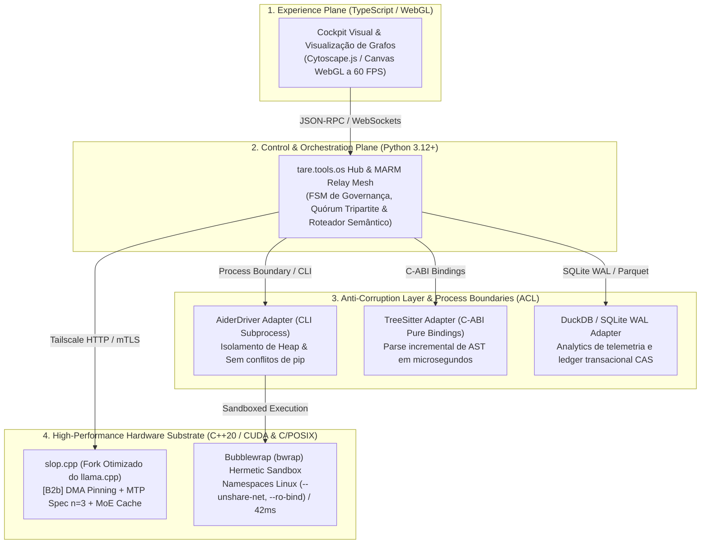

# ADR-050: Decomposição Poliglota de Aplicações, Camadas Anticorrupção (ACL), Gestão Defensiva de Dependências e Governança de Forks de Alto Desempenho

- **Status:** PROPOSTA / EM DELIBERAÇÃO TRIPARTITE (`CASE-2026-08-19-APP-DECOMPOSITION-ACL-AND-DEPENDENCY-GOVERNANCE`)
- **Data:** 2026-08-19
- **Autores:** Antigravity Mediator sob direção de Engenharia e Operação Humana
- **Escopo:** `tare.tools.os`, `tare.tools.kernel`, `tare.tools.specgraph`, `tare.tools.backlog-graph`, `tare.tools.dialog-engine`, `tare.tools.research`, `slop.cpp`

---

## 1. Contexto & Fundamentação Teórico-Prática

O desenvolvimento de um **Agent Operating System** para engenharia de software autônoma e colaborativa enfrenta o clássico dilema de engenharia de software *"Buy vs. Build"* (Reaproveitamento vs. Construção Própria).

Historicamente, sistemas de software caem em dois extremos patológicos:
1. **Síndrome de Não-Inventado-Aqui (NIH):** Tentativa de reescrever parsers sintáticos, bancos de dados, motores de inferência e sandboxes do zero, gerando lentidão, bugs fundamentais e código frágil.
2. **Acoplamento Parasitário & Inchaço de Dependências (Dependency Bloat):** Adoção descuidada de frameworks e pacotes externos que arrastam árvores gigantes de dependências transitivas, impõem paradigmas invasivos no core e criam uma dívida impagável de desincronização (*upstream desync debt*).

Para alcançar **máxima performance de execução** sem abrir mão de **modularidade limpa e soberania de código**, este ADR estabelece a fundamentação teórica baseada em:
- **Ocultamento de Informação (Parnas, 1972):** Módulos expõem apenas interfaces mínimas e ocultam suas decisões internas de implementação.
- **Camada Anticorrupção / Ports & Adapters (Evans DDD, Cockburn Hexagonal):** O domínio central do OS nunca consome tipos de terceiros diretamente; adapters isolam a variabilidade externa.
- **Eficiência Poliglota por Camadas de Custo:** Uso pragmático de C++/CUDA no hardware, C/POSIX no sandbox, Rust/C-ABI no parsing e Python 3.12+ na orquestração de alto nível.

---

## 2. Decisões Arquiteturais Propostas (Objetivos In-Scope)



---

### A. Decomposição Poliglota por Camadas de Custo de Execução

Fica ratificada a distribuição tecnológica por domínio de especialização física:

| Camada | Escopo & Responsabilidade | Tecnologia Escolhida | Racional & Vantagem Competitiva |
| :--- | :--- | :--- | :--- |
| **Inferência & GPU** | Servidor LLM, atenção, DMA transfers e spec decoding. | **C++20 / CUDA 12 (`slop.cpp`)** | Latência sub-milissegundo, acesso direto a registradores GPU, $\ge 600\text{ t/s}$ prefill na RTX 3090. |
| **Isolamento & Sandbox** | Execução hermética de testes e patches gerados por agentes. | **C / POSIX (`bubblewrap` - `bwrap`)** | Overhead de apenas $42\text{ ms}$, isolamento nativo via namespaces do kernel Linux, zero risco de escape. |
| **Parsing Sintático de Código** | Extração de símbolos, escopos e nós de AST para o `specgraph`. | **`tree-sitter` (C / Rust com C-ABI)** | Parsing incremental instantâneo em memória para todas as linguagens da base, sem dependências pesadas. |
| **Persistência & Ledger CAS** | Armazenamento de estado, controle de concorrência e traces. | **SQLite (WAL + JSONB) & DuckDB** | Sem overhead de servidor de banco; transações ACID locais ultrarrápidas com formato aberto. |
| **Orquestração & Governança** | Mesa Redonda, FSM de leases, deliberação e prompts. | **Python 3.12+** | Máxima expressividade para metaprogramação de agentes, interoperabilidade e agilidade de engenharia. |
| **Cockpit & Visualização** | Renderização de grafos acíclicos gigantes (28k nós). | **TypeScript + WebGL / Cytoscape.js** | Interface reativa no navegador com renderização fluida a 60 FPS. |

---

### B. Camadas Anticorrupção (ACL) Mandatórias & Fronteiras de Processo (CLI / IPC)

1. **Inviolabilidade do Core de Domínio:**
   - Nenhuma entidade de negócio do `tare.tools.os` ou dos repositórios satélites pode herdar, importar ou depender diretamente de tipos de bibliotecas de terceiros.
   - Toda comunicação com frameworks externos é mediada por uma interface proprietária (`Protocol` ou classe abstrata pura) e implementada por um **Adapter isolado**.
2. **Fronteiras de Processo (CLI over In-Process Import):**
   - Ferramentas externas de alta complexidade (ex: `Aider`, `llama-server`) são executadas como **subprocessos desacoplados**.
   - Isso elimina contaminação de dependências do Python (`pip hell`), garante isolamento de vazamentos de memória e permite atualização independente do binário externo.

---

### C. Protocolo de Governança de Forks de Alto Desempenho (`slop.cpp`)

Para ferramentas essenciais onde otimizações de baixo nível são necessárias (como o fork do `llama.cpp`):

```
       Upstream Canonical (llama.cpp @ master)
                │ (Rebase Periódico via Tag Estável)
                ▼
  ┌─────────────────────────────────────────────────────────────┐
  │       Fork slop.cpp (Branch: feature/tare-cuda-levers)      │
  │  • Patch 1: [B2b] DMA Pinning Buffer                        │
  │  • Patch 2: Prefetch Skip-Staging Direct Copy               │
  │  • Patch 3: MoE Hot-Cache Expert Retention                  │
  │  • Patch 4: MTP Speculative Decoding (n=3)                  │
  └──────────────────────────────┬──────────────────────────────┘
                                 │
                                 ▼
              Qualification Gate Automatizado (bless_fork.sh)
              • Tier 1: Compilação Limpa sm_86 (CUDA 12)
              • Tier 2: Aferição Física de TTFT & Throughput
              • Tier 3: Verificação de VRAM Safety & Memory Leak
```

1. **Patches Atômicos & Isolados:** Nossos diferenciais de aceleração vivem como commits limpos e documentados em cima da branch `master` upstream.
2. **Portão Automatizado de Qualificação (`bless_fork.sh`):** Nenhum rebase do upstream é aceito se não passar no qualification gate de 3 tiers.
3. **Upstream First:** Correções e melhorias genéricas de interesse amplo da comunidade devem ser enviadas como PRs ao upstream canônico para manter nosso delta mínimo.

---

### D. Portão de Admissão de Dependências (Dependency Admission Gate - DAGate)

Toda nova biblioteca candidata a ingressar no ecossistema deve ser aprovada no checklist formal:

| Critério de Admissão | Regra / Limite Máximo | Ação se Falhar |
| :--- | :--- | :--- |
| **Peso Transitivo** | $\le 3$ dependências transitivas diretas. | Rejeitar; adotar alternativa zero-dependency ou rodar via CLI isolado. |
| **Licenciamento** | Licença permissiva (Apache-2.0, MIT, BSD, ISC). | Rejeitar imediatamente se for GPL viral ou restritiva comercial. |
| **Invasividade de API** | Biblioteca opera por dados puros (JSON, bytes, structs) sem obrigar acoplamento de classes base. | Envelopar compulsoriamente em uma Camada Anticorrupção (ACL). |
| **Hermeticidade & Resiliência** | Falha da biblioteca não trava o processo do Agent OS. | Envelopar em try/except fail-closed com receipt de telemetria. |

---

## 2.1 Não-Objetivos Explícitos (Via Negativa & Fronteiras Arquiteturais)

1. **Sem Reinvenção de Ferramentas Maduras da Indústria:** É proibido construir parsers de AST manuais, bancos de dados relacionais proprietários ou ferramentas caseiras de isolamento de processos quando `tree-sitter`, `sqlite` e `bubblewrap` já resolvem com excelência.
2. **Sem Importação In-Process de Frameworks Pesados:** O `tare.tools.os` não importa pacotes gigantescos de terceiros diretamente no heap principal; a separação via CLI/subprocesso é obrigatória para ferramentas ricas.
3. **Sem Acoplamento Direto Inter-Satélites:** Os repositórios satélites (`specgraph`, `backlog-graph`, `kernel`, `dialog-engine`) comunicam-se estritamente por schemas de dados (JSON Schema, SQLite, GraphML), nunca por imports de código Python cruzados.
4. **Sem Forks Não-Goverrnados:** É expressamente proibido manter cópias manuais de bibliotecas externas sem um script automatizado de qualificação e política de rebase documentada.

---

## 3. Matriz de Falsificação & Rastreabilidade

| Invariante / Requisito | Mecanismo de Verificação | Falsificador / Critério de Rejeição | Módulo Responsável |
| :--- | :--- | :--- | :--- |
| **`REQ-DEC-01`: Pureza do Core de Domínio** | Linter estático de imports via AST em `tare.tools.kernel` | Core importa módulos fora da stdlib ou de schemas canônicos | `tests/test_architecture_boundaries.py` |
| **`REQ-DEC-02`: Hermeticidade do Sandbox** | Teste de execução com tentativa de acesso a rede/arquivos host | Processo em sandbox consegue abrir socket TCP ou ler fora de `/workspace` | `EXP-04` & `scripts/bwrap_runner.py` |
| **`REQ-DEC-03`: Qualification Gate do Fork** | Execução de `tools/scripts_sh/bless_fork.sh` no `slop.cpp` | Código upstream quebra alavancas CUDA `[B2b]` ou falha em throughput | `slop.cpp/tools/scripts_sh/bless_fork.sh` |
| **`REQ-DEC-04`: Latência de Parsing AST** | Benchmark de parse com `tree-sitter` em base de 100k linhas | Tempo de extração sintática excede $50\text{ ms}$ por arquivo | `tare.tools.specgraph/tests/test_ast_perf.py` |

---

## 4. Questões para a Deliberação da Mesa Redonda

1. **Validação da Matriz Poliglota:** O quórum aprova a distribuição tecnológica estratificada (C++/CUDA na GPU, C/POSIX no sandbox, Rust/C-ABI no parsing AST, SQLite no ledger e Python na orquestração)?
2. **Eficácia da Camada Anticorrupção:** A regra de isolamento de ferramentas ricas via fronteiras de processo/CLI é considerada suficiente para evitar conflitos de dependências no OS?
3. **Governança do `slop.cpp`:** O portão automatizado de 3 tiers (`bless_fork.sh`) oferece garantias robustas contra o risco de *upstream desync* no longo prazo?
