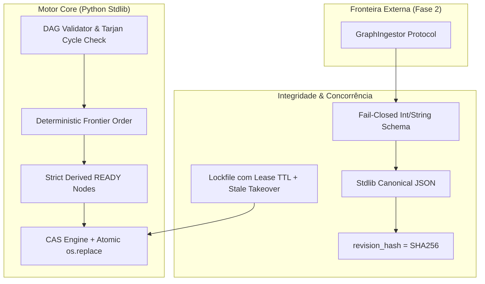
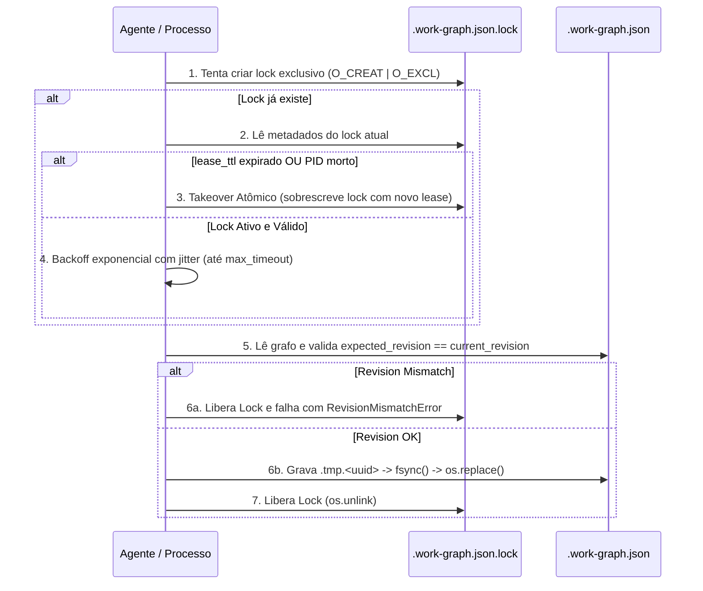

# ADR-046: North Star do tare.tools.backlog-graph — Motor Determinístico de DAG de Tarefas e Framework de Execução Topológica

- **Status:** Ratificado e Aprovado pela Mesa Redonda Tripartite (`CASE-2026-08-17-BACKLOG-GRAPH-NORTH-STAR-v002`)
- **Data:** 2026-08-18
- **Autores:** Antigravity Mediator (sob direcionamento do Operador Humano e consenso da Mesa Tripartite: Google Gemini 3.7 Flash High, Anthropic Claude 3.7 Sonnet / Fable 5 High, OpenAI GPT-5.6 Sol High)
- **Escopo:** `tare.tools.backlog-graph` (Repositório Standalone Universal)

---

## 1. Contexto e Motivação

Sistemas tradicionais de gestão de tarefas (Jira, Linear, GitHub Projects) operam sobre **filas lineares ou quadros Kanban planos**, ignorando a estrutura topológica inerente da engenharia de software. Essa abordagem gera três patologias sistêmicas:
1. **Cegueira de Bloqueios (*Blocker Blindness*):** Dificuldade de identificar a cadeia de dependências que trava entregas críticas;
2. **Priorização Ilusória (*Blind Prioritization*):** Itens P0 bloqueados por pré-requisitos secundários esquecidos;
3. **Alucinação de Fronteira (*Frontier Hallucination*):** Agentes de IA escolhendo tarefas inviáveis por falta de pré-condições satisfeitas.

O **`tare.tools.backlog-graph`** resolve esse problema transformando o backlog em um **Grafo Acíclico Dirigido (DAG)** com cálculo matemático determinístico da fronteira de trabalho executável, atomicidade transacional local-first e integridade cross-runtime estrita.

---

### 1.1 Não-Objetivos Explícitos (Via Negativa / Fora de Escopo)
1. **Sem Dependências Externas Pesadas:** O motor de grafo opera 100% em Python padrão (stdlib), sem frameworks pesados ou serviços de banco de dados externos.
2. **Sem Ordenação Arbitrária ou Heurística Opaca:** A fronteira executável é matematicamente derivada dos nós `DONE` e ordenação total formalizada.
3. **Sem Locks Distribuídos Complexos:** A sincronização é local-first através de lockfile com lease/TTL, recuperação de órfãos e transação CAS com `os.replace` atômico.
4. **Sem Tipagem Numérica Flutuante no Grafo Core:** Proibição estrita de números de ponto flutuante (`float`) no schema do work-graph, garantindo determinismo canônico absoluto sem complexidade de engines ECMAScript/Ryū.

---

## 2. Decisões Arquiteturais Normativas



---

### A. Desacoplamento & Zero Dependências (Pure Python Stdlib)
* O `tare.tools.backlog-graph` é construído **100% em Python puro (stdlib)** (`json`, `hashlib`, `os`, `time`, `typing`, `dataclasses`).
* Suite de testes expandida para **95+ testes unitários, de integração e falsificadores de concorrência/crash**, cobrindo validação de schemas, ordenação topológica, detecção de ciclos de Tarjan, recuperação de lock órfão e reconciliação CAS.

---

### B. Ordenação Total, Determinismo Matemático e `CriticalPathDepth`

#### 1. Pré-condição de Aciclicidade
Antes de qualquer cálculo de fronteira, o grafo passa por validação fail-closed via algoritmo de Tarjan ou busca em profundidade com coloração de 3 estados (White/Gray/Black). Qualquer ciclo aborta imediatamente a operação com `CyclicDependencyError(cycle_path)`.

#### 2. Definição Formal de `CriticalPathDepth`
Dado um DAG $G = (V, E)$, onde uma aresta dirigida $(u, v) \in E$ significa que **a tarefa $u$ é pré-requisito da tarefa $v$** (ou seja, $v$ depende de $u$, e a conclusão de $u$ desbloqueia trabalho a jusante):

* Seja $Out(u) = \{ v \in V \mid (u, v) \in E \}$ o conjunto de nós dependentes diretos de $u$.
* O $\text{CriticalPathDepth}(u)$ é definido indutivamente como o comprimento do maior caminho dirigido de tarefas a jusante até um nó folha/terminal (sink, onde $Out(v) = \emptyset$):
  $$\text{CriticalPathDepth}(u) = 1 + \max\Big( \{ \text{CriticalPathDepth}(v) \mid v \in Out(u) \} \cup \{ 0 \} \Big)$$
* **Casos base:**
  * Um nó terminal (sem dependentes a jusante, $Out(u) = \emptyset$) possui $\text{CriticalPathDepth}(u) = 1$.
  * Um nó totalmente desconectado/isolado possui $\text{CriticalPathDepth}(u) = 1$.
  * Um nó que desbloqueia uma cadeia sequencial de $k$ tarefas a jusante possui $\text{CriticalPathDepth}(u) = k + 1$.

#### 3. Normalização e Desempate de `NodeID`
O desempate de identificadores de nós (`NodeID`) é estritamente **lexicográfico por sequência de code points Unicode binários** (equivalente a `ord(c)` em Python ou `strcmp` ordinal em C/UTF-8), **independente de locale do sistema operacional**:
$$\text{NodeIDCmp}(a, b) = [ \text{ord}(c) \text{ for } c \in a ] < [ \text{ord}(c) \text{ for } c \in b ]$$

#### 4. Função de Ordenação Total da Fronteira (`FrontierOrder`)
Um nó $u \in V$ está no estado `READY` se e somente se seu estado atual é pendente e todos os seus pré-requisitos diretos $\text{In}(u) = \{ w \in V \mid (w, u) \in E \}$ estão com estado `DONE`.

A lista de tarefas elegíveis (`frontier`) e a próxima tarefa recomendada (`next`) são ordenadas pela tupla lexicográfica total:
$$\text{FrontierOrder}(u) = \langle -\text{PriorityRank}(u),\ -\text{CriticalPathDepth}(u),\ \text{NodeID}(u) \rangle$$
Onde:
* $\text{PriorityRank}: \text{P0} \to 3,\ \text{P1} \to 2,\ \text{P2} \to 1,\ \text{P3} \to 0$.
* Sinais negativos denotam ordenação decrescente (maior prioridade primeiro, maior profundidade de impacto primeiro).
* `NodeID` é avaliado em ordem crescente de code points Unicode como critério final e infalível de desempate.

```python
# Exemplo executável canônico da ordenação da fronteira
def calculate_frontier(nodes: dict[str, Node]) -> list[str]:
    # 1. Validação de aciclicidade
    validate_acyclic(nodes)
    
    # 2. Identificação de nós READY
    ready_nodes = [
        node_id for node_id, node in nodes.items()
        if node.status != "DONE" and all(nodes[dep].status == "DONE" for dep in node.dependencies)
    ]
    
    # 3. Ordenação total determinística
    def sort_key(node_id: str):
        node = nodes[node_id]
        priority_weight = {"P0": 3, "P1": 2, "P2": 1, "P3": 0}[node.priority]
        depth = node.critical_path_depth  # calculado via memoized DFS a jusante
        unicode_codepoints = [ord(c) for c in node_id]
        return (-priority_weight, -depth, unicode_codepoints)
        
    return sorted(ready_nodes, key=sort_key)
```

---

### C. Perfil de Canonicalização e Hash de Revisão (Strict Integer/String Profile)

Para resolver a contradição entre zero-dependências stdlib e a complexidade do RFC 8785 (JCS) em relação a números de ponto flutuante:

1. **Restrição de Schema Fail-Closed:** O schema do `work-graph.json` **proíbe estritamente** o uso de números de ponto flutuante (`float`), valores não-finitos (`NaN`, `Infinity`), expoentes (`1e5`) e zero negativo (`-0.0`). Todos os valores escalares numéricos (estimativas, pesos, prioridades) devem ser representados exclusivamente como **inteiros de 64 bits (`int`)** ou **strings normalizadas NFC**.
2. **Serialização Canônica Python Stdlib:** Sob a restrição de tipos acima, a serialização canônica em Python stdlib torna-se matematicamente equivalente ao RFC 8785 sem requerer formatadores Ryū:
   ```python
   canonical_bytes = json.dumps(
       graph_data_without_revision,
       sort_keys=True,
       separators=(',', ':'),
       ensure_ascii=False
   ).encode('utf-8')
   ```
3. **Cálculo do `revision_hash`:**
   $$\text{revision\_hash} = \text{sha256}(\text{canonical\_bytes}).\text{hexdigest}()$$

#### Vetores Canônicos de Teste (Fixtures Normativas)
Qualquer conector ou runtime externo deve validar conformidade contra as seguintes fixtures:

* **Fixture 1: Grafo Mínimo Canônico**
  ```json
  {"nodes":{"T-01":{"dependencies":[],"priority":"P0","status":"READY"}},"version":1}
  ```
  * *Bytes Canônicos:* `{"nodes":{"T-01":{"dependencies":[],"priority":"P0","status":"READY"}},"version":1}` (UTF-8, 77 bytes)
  * *SHA-256:* `5d898516d2ca0fbfe8d90f2aa7ce06915152eb1d9e26ff9d3a7e584f7b494d1a`

* **Fixture 2: Unicode Multilíngue e Escapamento**
  ```json
  {"nodes":{"T-Árvore":{"dependencies":[],"priority":"P1","status":"READY","title":"Conexão São Paulo 🚀"}},"version":1}
  ```
  * *Bytes Canônicos:* `{"nodes":{"T-Árvore":{"dependencies":[],"priority":"P1","status":"READY","title":"Conexão São Paulo 🚀"}},"version":1}` (UTF-8 sem escape ASCII)
  * *SHA-256:* `df1363e8a2a893450e1efb7dcf82d4b94a8fba227e8ee92780e0e37bc902c63d`

---

### D. Protocolo de Transação CAS, Exclusão Mútua e Recuperação de Lock Órfão

O modelo de consistência do `tare.tools.backlog-graph` é **lock-free com exclusão mútua local estrita e progresso global garantido sob lease-TTL**.



#### 1. Metadados do Lockfile (`.work-graph.json.lock`)
O lockfile contém uma carga útil estruturada gravada atomicamente:
```json
{
  "owner_pid": 48291,
  "hostname": "agent-worker-01",
  "acquired_at_epoch": 1771234567,
  "lease_ttl_sec": 30
}
```

#### 2. Protocolo de Aquisição, Retry e Recuperação de Órfão (Stale Lock)
1. **Tentativa Atômica Primária:** Criação do lockfile via flags `os.O_CREAT | os.O_EXCL | os.O_WRONLY`.
2. **Detecção e Takeover de Órfão:**
   * Se o lockfile existir, o agente lê os metadados.
   * O lock é considerado **órfão (stale)** se e somente se:
     $$\text{time.time}() > \text{acquired\_at\_epoch} + \text{lease\_ttl\_sec}$$
     *OU* (se no mesmo `hostname`) o processo com `owner_pid` não existir mais no sistema operacional (`os.kill(pid, 0)` falhar com `ProcessLookupError`).
   * **Takeover Seguro:** O agente grava os novos metadados em `.work-graph.json.lock.tmp.<uuid>`, executa `fsync` e faz `os.replace` sobre o lockfile expirado.
3. **Espera Limitada com Backoff Exponencial e Jitter:**
   * Se o lock estiver ativo, o agente aguarda com backoff exponencial aleatorizado:
     $$t_{\text{wait}} = \min(t_{\text{max}}, t_{\text{base}} \times 2^{\text{attempt}}) \times (0.5 + \text{random}(0, 0.5))$$
     (com $t_{\text{base}} = 50\text{ms}$, $t_{\text{max}} = 500\text{ms}$, tempo limite total de $10\text{s}$).
   * Ao estourar o limite, levanta erro terminal `LockAcquisitionTimeoutError(current_owner_metadata)`.
4. **Mutação CAS Atômica:**
   * Revalidação de `expected_revision == current_revision`.
   * Gravação em `.work-graph.json.tmp.<uuid>` $\to$ `os.fsync(fd)` $\to$ `os.replace` sobre `.work-graph.json` $\to$ liberação do lockfile (`os.unlink`).

#### 3. Matriz de Falhas e Alerta Operacional para Filesystems Sincronizados
| Cenário de Falha | Comportamento do Sistema | Garantia de Recuperação |
| :--- | :--- | :--- |
| **Crash do Processo com Lock** | Lockfile persiste no disco | Próximo agente detecta lease expirado ($\ge 30\text{s}$) e realiza takeover automático sem intervenção manual. |
| **Crash durante gravação de dados** | Arquivo temporário `.tmp.<uuid>` abandonado | O grafo principal `.work-graph.json` permanece intacto e consistente. Arquivos `.tmp` órfãos são limpos na inicialização. |
| **Colisão Concorrente de Landing** | Dois agentes passam pela validação simultaneamente | O lockfile serializa o landing; o segundo agente detecta `RevisionMismatchError` e aborta fail-closed sem corromper estado. |
| **Filesystems em Nuvem (Drive / OneDrive)** | Agentes de sincronização seguram handles em arquivos abertos | O motor implementa retry loop específico para capturar `PermissionError`/`EACCES` transientes durante o `os.replace`. **Aviso Operacional:** Recomenda-se executar o backlog-graph em diretórios locais fora de sincronizadores em nuvem para latência sub-milissegundo. |

---

### E. Arquitetura de Conectores Isolados (`GraphIngestor`) e Observabilidade

1. **Protocolo Abstrato Unidirecional `GraphIngestor` (Fase 2):**
   * Os conectores externos (Jira, Linear, GitLab, GitHub Issues) implementam estritamente o protocolo `GraphIngestor`.
   * A ingestão é **unidirecional e purificada**: campos numéricos arbitrários de APIs externas são obrigatoriamente convertidos para o schema restrito de inteiros/strings antes de atingirem o núcleo topológico, isolando o motor de grafo contra injeções de tipos não-canônicos.

2. **Métricas Estruturadas de Observabilidade:**
   * A CLI e o motor expõem comandos com saída estruturada `--json` contendo telemetria essencial para dashboards e agentes orquestradores:
   ```json
   {
     "metrics": {
       "topological_sort_ms": 1.42,
       "cas_collision_retries": 0,
       "critical_path_max_depth": 7,
       "total_nodes": 42,
       "ready_nodes_count": 5
     },
     "revision_hash": "5d898516d2ca0fbfe8d90f2aa7ce06915152eb1d9e26ff9d3a7e584f7b494d1a"
   }
   ```

---

## 3. Roadmap de Implementação em 4 Fases

1. **Fase 1 (Motor Core, CAS Resiliente & Chaos Testing — v0.5 Atual):**
   * 95+ testes automatizados (unitários, integração e suite de Chaos Engineering).
   * Algoritmo de Tarjan, cálculo memoizado de `CriticalPathDepth` e ordenação estável Unicode.
   * Lockfile com lease TTL, takeover de stale locks e transações CAS com fsync/replace.
   * Visualizador HTML offline responsivo e exportador de telemetria JSON.
2. **Fase 2 (Conectores & Ingestores Unidirecionais):**
   * Implementação do protocolo `GraphIngestor` para Jira, Linear, GitHub Issues e Markdown.
   * Validador fail-closed na borda de ingestão para garantir conformidade estrita de schema.
3. **Fase 3 (Visualizador Interativo & Copilot Bridge):**
   * Canvas interativo com simulação *what-if* de impacto no caminho crítico ao marcar nós como `DONE`.
   * Injeção de contexto topológico in-editor para agentes e desenvolvedores humanos.
4. **Fase 4 (Distribuição Global & Pacote PyPI):**
   * Publicação do pacote oficial no PyPI (`pip install tare-backlog-graph`) e extensão para VS Code.

---

## 4. Resumo de Resolução dos Problemas da Rodada 1

| ID da Questão | Origem | Severidade | Resolução Incorporada no ADR-046 v002 |
| :--- | :--- | :--- | :--- |
| **ISS-OPENAI-R1-01** | OpenAI | Blocking | Formalização da direção do `CriticalPathDepth` (comprimento do maior caminho a jusante até nós terminais), tratamento base de nós desconectados ($=1$), pré-checagem obrigatória de aciclicidade e desempate por code point Unicode ordinal. |
| **ISS-OPENAI-R1-02**<br>**ISS-ANTHROPIC-R1-02** | OpenAI / Anthropic | Blocking | Especificação completa do protocolo de lockfile com metadados (`owner_pid`, `hostname`, `lease_ttl_sec`), verificação de liveness de processo, takeover atômico de lock órfão e backoff exponencial com jitter. |
| **ISS-OPENAI-R1-03**<br>**ISS-ANTHROPIC-R1-01** | OpenAI / Anthropic | Blocking | Resolução da contradição JCS/stdlib através da proibição estrita de floats no schema (Opção A), tornando a serialização stdlib 100% canônica e determinística cross-runtime, acompanhada de fixtures de teste normativas. |
