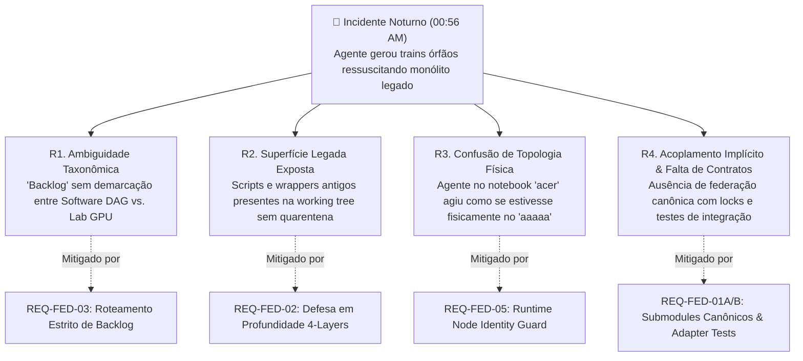
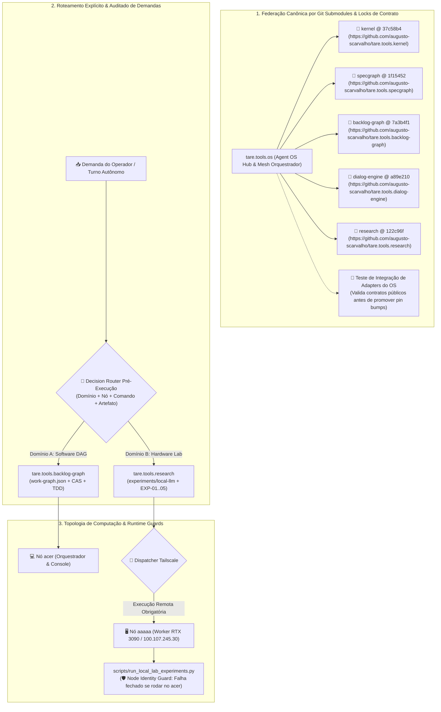
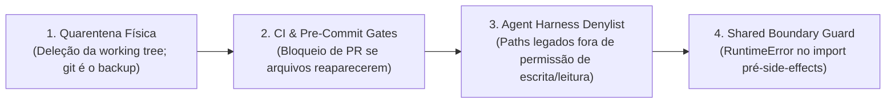

# ADR-049: Federação de Repositórios por Git Submodules, Governança Anti-Desvio de Agentes e Separação Estrita de Backlogs

- **Status:** APROVADO EM CONSENSO TRIPARTITE / VERSÃO CANÔNICA SINTETIZADA (`CASE-2026-08-19-REPO-FEDERATION-AND-ANTI-DRIFT-GOVERNANCE`)
- **Versão:** v002 (Síntese Pós-Rodada 1 de Deliberação)
- **Data:** 2026-08-19
- **Autores:** Antigravity Mediator (Independent Synthesis & FSM Governor) sob direção de Engenharia e Operação Humana
- **Escopo:** `tare.tools.os`, `tare.tools.kernel`, `tare.tools.specgraph`, `tare.tools.backlog-graph`, `tare.tools.dialog-engine`, `tare.tools.research`

---

## 1. Contexto Histórico & Post-Mortem Forense do Incidente Noturno

Na madrugada de 19 de agosto de 2026 (~00:56 AM), o operador instruiu uma instância autônoma do agente de IA a *"continuar o backlog de experimentos no nó desktop aaaaa durante a noite"*.

Em vez de executar os experimentos de inferência e hardware da RTX 3090 ([ADR-048](file:///C:/projects/tare.tools.os/docs/ADR-048_LOCAL_INFERENCE_SUBSTRATE_AND_AGENT_HARNESS.md)), o agente executou rotinas legadas de planejamento automático (`run_planner_auto.py`), vasculhou registros históricos de um grafo desatualizado e gerou 4 *trains* órfãos (`TRAIN-37` a `TRAIN-40`) que referenciavam 186 módulos do protótipo monolítico descontinuado (`tare.tools.harness`).

### 🔬 Análise de Causa-Raiz Quádrupla (RCA) & Bijeção de Governança



1. **`R1` — Ambiguidade Taxonômica de Backlog:** O termo "backlog" possuía dupla semântica não demarcada formalmente: o grafo de desenvolvimento de código do OS vs. a esteira de experimentos físicos de modelos e hardware (`EXP-01..05`).
2. **`R2` — Superfície de Código Legado Insegura:** Utilitários e wrappers da era monolítica permaneciam no working tree e eram passíveis de modificação ou contorno por agentes autônomos.
3. **`R3` — Desalinhamento de Topologia Física dos Nós:** O agente no console do notebook `acer` tentou instanciar fluxos de inferência local em vez de realizar o despacho remoto para o nó worker `aaaaa` via Tailscale (`http://100.107.245.30:8080/v1`).
4. **`R4` — Ausência de Federação Canônica e Locks de Compatibilidade:** Submódulos não eram verificados contra allowlists de URLs, nem validados por testes de integração de adapters em clones limpos.

---

## 2. Decisões Arquiteturais Propostas (Objetivos In-Scope)



---

### A. Federação Canônica por Git Submodules e Lock de Composição

1. **Consolidação do Padrão Git Submodules & Allowlists:**
   - O repositório central `tare.tools.os` gerencia os satélites via `.gitmodules` canônico estritamente restrito a URLs oficiais autorizadas:
     - `tare.tools.kernel` $\to$ `https://github.com/augusto-scarvalho/tare.tools.kernel.git`
     - `tare.tools.specgraph` $\to$ `https://github.com/augusto-scarvalho/tare.tools.specgraph.git`
     - `tare.tools.backlog-graph` $\to$ `https://github.com/augusto-scarvalho/tare.tools.backlog-graph.git`
     - `tare.tools.dialog-engine` $\to$ `https://github.com/augusto-scarvalho/tare.tools.dialog-engine.git`
     - `tare.tools.research` $\to$ `https://github.com/augusto-scarvalho/tare.tools.research.git`
2. **Lock de Composição & Teste de Integração de Adapters:**
   - O `@ <commit-sha>` de cada submodule atua como um *lock de composição*. A atualização (*bump*) de pin de qualquer satélite no `tare.tools.os` é terminantemente condicionada à aprovação em suíte de integração federada (`tests/federation/test_satellite_adapters.py`).
   - Essa suíte inicializa os submódulos de forma limpa e exercita os contratos públicos consumidos pelos adaptadores do OS, rejeitando combinações com quebras de API/ABI.
3. **Runbook Canônico de Submodules para Agentes (`AGENTS.md`):**
   - Agentes autônomos devem operar submodules exclusivamente através dos comandos canônicos padronizados:
     - *Inicialização Limpa / Pré-Voo:* `git submodule sync --recursive && git submodule update --init --recursive`
     - *Auditoria de Hash & URL:* `python scripts/verify_submodules.py --strict`
     - *Proibição:* Agentes são proibidos de alterar URLs em `.gitmodules` ou commitar submodules em estado detached sem validação de integração.

---

### B. Separação Estrita de Backlogs e Roteamento Pré-Execução

Fica proibida a interpretação ambígua de demandas. Antes de qualquer invocação de ferramentas ou execução de código, o harness/agente deve registrar a **Decisão de Roteamento de Backlog** com 4 tuplas obrigatórias: `(Domínio, Nó Autorizado, Comando Canônico, Artefato Esperado)`.

| Dimensão | Domínio A: Backlog de Engenharia de Software | Domínio B: Backlog de Experimentos de Hardware |
| :--- | :--- | :--- |
| **Escopo Primário** | Desenvolvimento de código, refatoração de AST, schemas, microkernel e release trains. | Aferição de TTFT, throughput CUDA, VRAM headroom, noise floor e qualificação de pesos. |
| **Repositório Dono** | `tare.tools.backlog-graph` (DAG acíclico `work-graph.json`) | `tare.tools.research` (`experiments/local-llm/`) |
| **Nó de Execução** | `acer` (Local / Console) | `aaaaa` (Worker Remoto via Tailscale `100.107.245.30:8080`) |
| **Comando Canônico** | `python relay/relay_mesh.py` / `graph_ops.py` | `python scripts/dispatch_lab_experiment.py --target aaaaa` |
| **Governança / Gate** | Quórum Tripartite (Google/Anthropic/OpenAI) + MARM | Cartões Científicos `EXP-01` a `EXP-05` + `local-labs` |
| **Artefatos Gerados** | Diffs Git, relatórios de auditoria e releases SemVer | Relatórios JSON de Benchmark, gráficos e Qualification Letters |

---

### C. Defesa em Profundidade Contra Ressuscitação de Monólito (4 Camadas)

Para neutralizar o risco de agentes autônomos editarem scripts de guarda para contornar bloqueios (falsificador Anthropic), adota-se um modelo de **Defesa em Profundidade de 4 Camadas**:



1. **Camada 1 — Quarentena Física / Deleção do Working Tree:**
   - Todos os scripts geradores de trains e orquestradores do monólito legado (`run_planner_auto.py`, geradores em `relay/`, etc.) são **removidos do working tree principal** e preservados em tag de arquivo (`archive/monolith-harness-v1`). Arquivos inexistentes no disco reduzem o espaço amostral de introspecção das ferramentas do agente.
2. **Camada 2 — CI & Pre-Commit Enforcement Gate:**
   - Check automatizado no CI (`scripts/ci/check_legacy_quarantine.py`) que falha com código não-zero se qualquer arquivo do inventário legado reaparecer na árvore de trabalho ou se qualquer commit tentar modificar a denylist.
3. **Camada 3 — Denylist no Harness de Permissões do Agente:**
   - O harness de execução dos agentes (`AGENTS.md` e configurações do runtime) define uma denylist explícita de caminhos e padrões proibidos (`relay/trains/*`, `tare.tools.harness*`), impedindo operações de tool use nesses alvos.
4. **Camada 4 — Import Boundary Guard:**
   - Caso resquícios de módulos legados sejam importados como dependências transitivas, o ponto de entrada compartilhado lança `RuntimeError` estruturado antes de qualquer I/O, escrita de arquivos ou despacho de processos.

---

### D. Topologia Física e Guard de Identidade de Nó (`acer` vs `aaaaa`)

1. **Manifesto de Topologia de Cluster:**
   - O OS mantém um manifesto canônico de infraestrutura (`config/cluster_topology.json`) discriminando papéis:
     - `acer`: Nó de Orquestração, Edição de Código, Gestão do DAG e Console do Operador.
     - `aaaaa`: Nó de Computação Física de Inferência, GPU Worker RTX 3090, acessível via IP Tailscale `100.107.245.30`.
2. **Runtime Node Identity Guard:**
   - O executor `scripts/run_local_lab_experiments.py` valida obrigatoriamente a identidade física da máquina hospedeira em tempo de execução (checagem de `HOSTNAME`, `NODE_ID` e interfaces de hardware).
   - Se invocado no nó `acer`, o script **falha fechado imediatamente** com código de erro estruturado:
     ```
     [TOPOLOGY_VIOLATION_ERR] run_local_lab_experiments.py só pode ser executado nativamente no nó 'aaaaa' (RTX 3090).
     A partir do nó 'acer', utilize o comando de despacho remoto:
     >> python scripts/dispatch_lab_experiment.py --target aaaaa --exp EXP-XX
     ```
3. **Mapeamento Explícito de Comandos em `AGENTS.md`:**
   - Diretivas do sistema registram a segregação de comandos autorizados por host físico, impedindo alucinações de execução local de benchmarks de hardware no console do `acer`.

---

## 2.1 Não-Objetivos Explícitos (Via Negativa & Fronteiras Arquiteturais)

1. **Sem Retorno ao Monólito / Monorepo:** O modelo monolítico do `tare.tools.harness` está definitivamente extinto.
2. **Sem Suposição Cega de Compatibilidade por Commit-SHA:** O hash de submodule é apenas um ponteiro de lock; compatibilidade exige teste de integração de adapters ativo.
3. **Sem Confiança em Guards Editáveis como Única Defesa:** `RuntimeError` em scripts editáveis pelo próprio agente não é controle de segurança isolado; quarentena física, CI gates e denylists de harness são obrigatórios.
4. **Sem Execução Direta de Experimentos de GPU no Console de Orquestração:** É proibido executar suites de carga de inferência localmente no nó `acer`.
5. **Sem Poluição de Bibliotecas Upstream:** `tare.tools.kernel`, `specgraph`, `backlog-graph`, `dialog-engine` e `research` permanecem estritamente puros e agnósticos a IPs locais ou SOs específicos.
6. **Sem Flexibilização do Zero Self-Auditing:** Quem implementa código (local ou nuvem) nunca aprova o próprio código.

---

## 3. Matriz de Falsificação & Rastreabilidade Rigorosa

| Invariante / Requisito | Mecanismo de Verificação | Falsificador / Critério de Rejeição | Módulo Responsável |
| :--- | :--- | :--- | :--- |
| **`REQ-FED-01A`: Integridade Canônica de Submodules** | Teste em clone limpo executando `git submodule sync --recursive` e `update --init --recursive`, validando URLs contra allowlist canônica e checando SHAs esperados | `.gitmodules` apontando para URL fora da allowlist, URL obsoleta/privada, ou falha de inicialização em clone limpo | `tests/federation/test_clean_clone_submodules.py` |
| **`REQ-FED-01B`: Compatibilidade de Contratos Federados** | Execução de suíte de integração de adapters do OS pós-inicialização dos submódulos | Quebra de contrato de API pública em `kernel`, `specgraph`, `backlog-graph`, `dialog-engine` ou `research` consumida pelos adapters do OS | `tests/federation/test_satellite_adapters.py` |
| **`REQ-FED-02`: Defesa em Profundidade contra Código Legado** | Gate de CI verificando quarentena física de scripts legados + teste em sandbox simulando agente tentando recriar, editar ou importar wrappers legados | Qualquer script do inventário legado presente na working tree, reintroduzido via PR, invocado com sucesso, ou gerando artefatos em `relay/trains/` | `scripts/ci/check_legacy_quarantine.py` |
| **`REQ-FED-03`: Roteamento e Isolamento Estrito de Backlogs** | Validação pré-executor da tupla `(Domínio, Nó, Comando, Artefato)` no harness e nos runners de laboratório | Demanda com termo "backlog" executada sem manifesto de decisão formal, ou runner de laboratório alterando arquivos do DAG de software (`work-graph.json`) | `relay/relay_mesh.py` e `scripts/dispatch_lab_experiment.py` |
| **`REQ-FED-04`: Pureza e Agnosticismo Upstream** | Análise estática no CI dos repositórios satélites (AST scan) | Presença de referências hardcoded a IPs de Tailscale, caminhos do filesystem do OS ou dependências circulares do hub | CI dos 5 repositórios satélites |
| **`REQ-FED-05`: Topologia Física e Identidade de Nó** | Execução do runner de laboratório em hosts distintos com verificação de runtime node identity (`hostname` / `NODE_ID`) | `run_local_lab_experiments.py` executando com sucesso no nó `acer` (fora do `aaaaa`), ou runner permitindo spoofing de identidade de nó | `scripts/run_local_lab_experiments.py` |

---

## 4. Síntese da Deliberação e Respostas Canônicas da Mesa Redonda

### 1. Aprovação da Federação por Submodules
- **Decisão:** **Aprovado com a qualificação canônica (OpenAI/Google).**
- **Fundamentação:** O Git Submodules canônico com `@ <commit-sha>` é o padrão oficial de composição do ecossistema. Contudo, o SHA é formalizado como um *composition lock*, e não como prova isolada de compatibilidade. O bump de pins só é promovido mediante sucesso no teste de integração dos adapters do OS (`REQ-FED-01B`).

### 2. Eficácia dos Deprecation Guards
- **Decisão:** **Reclassificado: Não como controle isolado, mas como Camada 4 de Defesa em Profundidade (Anthropic/Google).**
- **Fundamentação:** Bloqueios por `RuntimeError` em arquivos graváveis são insuficientes contra agentes autônomos. A governança adota quarentena física (deleção da working tree preservando em tag git), gates de CI/pre-commit e denylists de permissão no harness do agente, mantendo o erro de runtime como barreira de fronteira transitória.

### 3. Separação de Backlogs e Topologia de Nós
- **Decisão:** **Aprovado com a inclusão de Roteamento Explícito e Node Identity Guard (Google/Anthropic/OpenAI).**
- **Fundamentação:** A ambiguidade é neutralizada pela exigência do registro pré-execução da tupla de decisão `(Domínio, Nó, Comando, Artefato)` e pela resolução da lacuna de topologia física através do `REQ-FED-05`, impedindo a execução de benchmarks de GPU no nó orquestrador `acer`.
