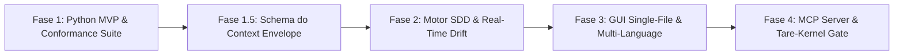

# ADR-044: North Star do tare.tools-specgraph — Plataforma Universal de Project Intelligence & Spec-Driven Development (SDD)

- **Status:** Ratificado e Refinado pela Mesa Redonda Tripartite — Versão Canônica v002 (`CASE-2026-08-17-SPECGRAPH-NORTH-STAR-V2`)
- **Data:** 2026-08-18
- **Autores:** Antigravity Mediator (sob direcionamento do Operador Humano e consenso da Mesa Tripartite: Google Gemini, Anthropic Claude, OpenAI GPT)
- **Escopo:** `tare.tools-specgraph` (Repositório Standalone Universal)

---

## 1. Contexto e Motivação

O desenvolvimento acelerado de software por equipes humanas e swarms de agentes autônomos enfrenta um gargalo crítico de **amnésia contextual e perda de intenção**:
1. O código evolui rapidamente, mas as decisões de arquitetura e negócio (*ADRs/Specs*) se desacoplam da base de código, gerando *documentation drift*.
2. Ferramentas de busca vetorial (*RAG*) encontram similaridade estatística superficial, mas são cegas para causalidade estrutural, dependências lógicas e invariantes.
3. Indexadores estáticos (*Graphify/SCIP*) mapeiam a sintaxe do código, mas não capturam intenção de negócio nem verificam critérios de aceite.

O **`tare.tools-specgraph`** resolve essa lacuna implementando o paradigma **SDD (Spec-Driven Development)** sobre uma **Matriz Viva de Rastreabilidade Causal**:

$$\text{Requisito / Intenção} \longrightarrow \text{Design / Spec / ADR} \longrightarrow \text{Tarefa (DAG)} \longrightarrow \text{Código (AST)} \longrightarrow \text{Teste (Falsifier)} \longrightarrow \text{Evidência (Attestation)}$$

---

### 1.2 Não-Objetivos Explícitos (Via Negativa / Fora de Escopo)
1. **Sem Banco de Dados Vetorial ou RAG Estatístico Pesado:** O SpecGraph é um analisador causal determinístico baseado em AST e grafos de dependência, não um motor de embeddings aproximados.
2. **Sem Bloqueio de Arquivos Fora de Governança:** Fixtures de teste, scripts temporários e código gerado em caminhos excluídos não exigem specs artificiais nem anotações forçadas.
3. **Sem Execução Remota Obrigatória:** O motor é estritamente *local-first*, operando 100% offline com garantias explícitas de latência e consumo de recursos.

---

## 2. Decisão Arquitetural

### A. Desacoplamento do Microkernel e Envelope de Desempenho Local-First:
* O **`tare-kernel`** é o runtime de baixo nível para sandboxing, CAS atômico e atestação criptográfica de agentes.
* O **`tare.tools-specgraph`** é uma **plataforma e biblioteca independente, modular e universal**:
  * Usável por desenvolvedores humanos via CLI (`specgraph`) e visualizador Web interativo autossuficiente;
  * Usável por agentes autônomos (Claude Code, OpenAI Codex, Cursor, Aider, Copilot) via CLI e MCP Server;
  * Opera com um **Orçamento de Desempenho Auditável (Performance Budget)**:

| Operação | Modo / Cache | Corpus de Referência | Hardware de Linha de Base | Latência Alvo (p95) | Comportamento de Degradação |
| :--- | :--- | :--- | :--- | :--- | :--- |
| **`trace` / `explain`** | Cache Quente | Repositório até 100k LOC | 4 cores / 8GB RAM (dev laptop padrão) | $\le 30\text{ms}$ | Degradação linear; alerta se $> 50\text{ms}$ |
| **`drift-check`** | Incremental (1–5 arquivos alterados) | Repositório até 100k LOC | 4 cores / 8GB RAM | $\le 50\text{ms}$ | Reindexação seletiva do subset AST |
| **`drift-check` / `index`**| Frio (Cold Rebuild Completo) | 10k LOC Python | 4 cores / 8GB RAM | $\le 1.2\text{s}$ ($\le 120\text{ms}$ / KLOC) | Barra de progresso streaming; persistência atômica no cache |

---

### B. Identidade Canônica de Símbolos, Namespaces e Resolução Bidirecional:
Para evitar falhas de identidade, homônimos ou referências penduradas (*dangling references* após renames/moves):
1. **Namespace Canônico:** Todo símbolo no grafo possui URI determinística e unívoca no formato `rel_filepath::QualifiedSymbolName` (ex.: `src/auth/validator.py::TokenValidator.validate`).
2. **Resolução Bidirecional Estrita:**
   - **Spec $\rightarrow$ Código:** Cada entrada em `target_symbols` declarada na spec deve resolver para exatamente um nó de símbolo AST ativo dentro de `governed_paths`.
   - **Código $\rightarrow$ Spec:** Cada anotação `@spec SPEC-ID` ou mapeamento declarativo em `specgraph.yaml` deve referenciar uma spec existente e válida.
   - **Teste $\rightarrow$ Spec/Critério:** Markers `@pytest.mark.verifies("SPEC-ID", "AC-XX")` devem apontar para IDs e critérios de aceite formalmente declarados na spec de destino.
3. **Detecção Determinística de Erros:**
   - `ERR_DANGLING_SYMBOL`: O símbolo alvo foi renomeado, movido ou excluído, mas permanece listado na spec ou em `specgraph.yaml`.
   - `ERR_AMBIGUOUS_SYMBOL`: O identificador casa com múltiplos símbolos sem caminho relativo qualificado.
   - `ERR_ORPHAN_TAG`: Tag `@spec` no código referencia uma spec inexistente ou arquivada sem remapeamento.

---

### C. Semântica de Borda (`governed_paths` vs `excluded_paths`) e Nós Cross-Boundary:
Para evitar lacunas silenciosas de governança e falsos bloqueios em código gerado/fixtures:
1. **Regra de Precedência Determinística:** Avaliação de caminho por regra de **Exclusão Explícita Prevalente (*Exclusion-Wins*)** com desempate por *Longest Match*:
   $$\text{is\_governed}(p) \iff \text{matches}(p, \text{governed\_paths}) \land \neg\text{matches}(p, \text{excluded\_paths})$$
2. **Arestas Cross-Boundary e Nós `ungoverned_leaf`:**
   - Quando um módulo governado (`src/core/api.py`) importa um módulo excluído (`src/generated/client.py` ou lib externa):
   - O nó excluído é inserido no grafo com a tipagem formal **`ungoverned_leaf`**;
   - O nó `ungoverned_leaf` é visível na análise de impacto (`trace`) e compõe o fecho transitivo do *Context Envelope*;
   - O gate de *Zero Código Órfão* **não exige spec** para nós `ungoverned_leaf`, emitindo um aviso auditável (*info/warning*) em vez de erro bloqueante.

---

### D. Contrato de Completude de Arestas e Exposição de Incerteza:
A inferência de dependências por AST expõe explicitamente o grau de certeza de cada aresta:
1. **Tipos de Completude de Aresta (`DEPENDS_ON_STATIC`):**
   - **`RESOLVED` (Tier 2):** Import estático direto resolvido para arquivo/símbolo conhecido (ex.: `from src.utils import hash_str`).
   - **`AMBIGUOUS` (Tier 2 / Incerteza Sinalizada):** Imports condicionais (`if sys.version_info...`, `try...except ImportError`) ou star imports (`from .module import *`) que dependem de estado de runtime. Todas as ramificações são adicionadas ao grafo com flag de ambiguidade.
   - **`DYNAMIC_UNRESOLVED` (Tier 3 / Incerteza Explícita):** Chamadas a `importlib.import_module(...)`, `__import__` ou injeções dinâmicas de atributos. O nó de origem é marcado com flag `has_dynamic_dependencies`.
2. **Comportamento dos Gates e Context Envelopes:**
   - O comando `trace` inclui arestas `AMBIGUOUS` e `DYNAMIC_UNRESOLVED` no fecho transitivo, anexando um bloco de **Avisos de Incerteza (Uncertainty Diagnostics)**.
   - Gates de liberação/merge exigem resolução ou declaração explícita em `specgraph.yaml` (`dynamic_bindings: [...]`) para suprimir incertezas críticas em módulos governados.

---

### E. Identidade Content-Addressed e Idempotência Cross-OS:
Gerações do grafo são puramente content-addressed e universais:
$$\text{generation\_id} = \text{sha256}(\text{normalized\_tree\_hash} + \text{canonical\_specgraph\_digest})$$
- **Normalização Cross-OS:** Conversão mandatória de quebras de linha (`CRLF` $\rightarrow$ `LF`), normalização de separadores de caminho (`\` $\rightarrow$ `/`) e ordenação determinística de chaves em manifestos JSON/YAML antes do cálculo de digest. Reindexar a mesma árvore em Linux, macOS ou Windows produz idêntico `generation_id`.

---

### F. Trust Tiers de Evidência e Contrato do Context Envelope:
O grafo classifica cada nó e aresta de acordo com níveis estritos de confiabilidade:
* **Tier 1 (Autoritativo):** Testes re-executados e atestados com hash verificado (`@pytest.mark.verifies`). Apenas este Tier aprova gates de merge.
* **Tier 2 (Inferência Estática Determinística):** Símbolos de código AST, arestas `RESOLVED` e mapeamentos verificados.
* **Tier 3 (Consultivo / Incerteza):** Arestas dinâmicas/ambíguas e anotações informativas de linguagem natural.

#### Schema do Context Envelope (Publicado na Fase 1.5):
```json
{
  "$schema": "https://tare.tools/schemas/context-envelope.v1.json",
  "spec_id": "SPEC-042",
  "generation_id": "sha256-abc1234...",
  "completeness": "COMPLETE | PARTIAL_DYNAMIC | AMBIGUOUS",
  "transitive_closure": {
    "specs": ["SPEC-042", "SPEC-010"],
    "target_symbols": [
      {
        "symbol": "src/core/auth.py::TokenValidator.validate",
        "trust_tier": "Tier2",
        "status": "RESOLVED"
      }
    ],
    "ungoverned_leaves": ["src/generated/types.py"],
    "verifications": [
      {
        "test_symbol": "tests/test_auth.py::test_token_validity",
        "criteria": ["AC-01", "AC-02"],
        "trust_tier": "Tier1"
      }
    ]
  },
  "uncertainty_diagnostics": []
}
```

---

## 3. Roadmap de Implementação em 4 Fases



### Fase 1: Fatia Vertical Python MVP & Conformance Suite
- **Core Engine:** Parser AST nativo para Python com resolução de símbolos, reexports via `__all__` / `__init__.py` e identificação de imports condicionais.
- **Formato de Specs:** OpenSDD em Markdown com frontmatter YAML (`implements`, `target_symbols`, `acceptance_criteria`).
- **CLI Básico:** `specgraph init`, `specgraph index`, `specgraph trace`, `specgraph drift-check`, `specgraph explain`.
- **Invariant Conformance Suite (Falsificadores Executáveis):**
  1. *Rename/Move Mutation Test:* Validação de falha imediata (`ERR_DANGLING_SYMBOL`) ao mover/renomear símbolo sem atualizar spec/mapa.
  2. *Cross-Boundary Precedence Test:* Verificação de `ungoverned_leaf` e regra *Exclusion-Wins* sem falsos positivos.
  3. *Cross-OS Idempotence Test:* Confirmação de mesmo `generation_id` em árvores com CRLF vs LF.
  4. *Latency Benchmark Suite:* Verificação automatizada dos tempos de cold rebuild e consultas $\le 50\text{ms}$.

### Fase 1.5: Contrato do Context Envelope e Dogfooding Antecipado
- Publicação do JSON Schema formal do *Context Envelope*.
- Comando CLI `specgraph envelope <SPEC-ID> --json` permitindo consumo estruturado imediato por agentes (dogfooding direto).

### Fase 2: Motor SDD & Detecção de Drift em Tempo Real
- Assistente de re-binding e resolução de dívida de rastreabilidade de código legado.
- Detecção contínua de drift integrada ao ciclo de edição local.
- Ingestão do acervo histórico de 82 conversas de design como camada documental de Tier 3.

### Fase 3: Visualizador Interativo Web 100% Autossuficiente & Expansão Multi-Linguagem
- **GUI Single-File HTML:** Visualizador interativo 2D/3D embutido em arquivo único, **zero dependências externas (zero CDN)**, com renderização via Canvas/SVG inline e soberania offline estrita.
- Simulação interativa de análise de impacto antes de refatorações.
- Expansão de indexação via parsers Tree-sitter para TypeScript e Rust.

### Fase 4: Integração Universal de Agentes & MCP Server
- **SpecGraph MCP Server:** Endpoints nativos (`get_context_envelope`, `query_causal_graph`, `check_drift`) para integração com Claude Code, Cursor, Copilot e OpenAI Codex.
- Integração formal com o gate de verificação criptográfica do `tare-kernel`.

---

## 4. Consequências e Benefícios

- **Preservação Causal Estrita:** Cada linha de código governado está formalmente ligada à sua intenção, requisito e teste falsificador.
- **Transparência de Incerteza:** Agentes e humanos sabem exatamente quando uma dependência é estaticamente verificada ou dinamicamente ambígua.
- **Redução Significativa de Contexto:** Agentes consom apenas o fecho transitivo exato ($\ge 65\%$ de economia de tokens sem perda de informação crítica).
- **Sem Falsos Bloqueios de Governança:** Módulos utilitários, fixtures e código gerado convivem harmoniosamente como `ungoverned_leaf`.
- **Desempenho Auditado e Previsível:** Operação sub-50ms no fluxo diário e índices determinísticos imunes a variações de SO.
