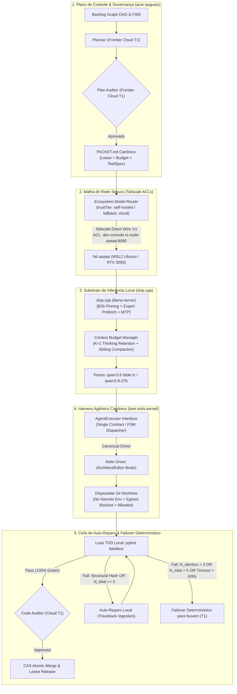

# ADR-048: Substrato de Inferência Local, Harness Agêntico e Aceleração Empírica de Hardware

- **Status:** SÍNTESE CANÔNICA PÓS-RODADA 1 / RATIFICADA PELA MESA REDONDA (`CASE-2026-08-18-LOCAL-INFERENCE-SUBSTRATE-AND-HARNESS`)
- **Data:** 2026-08-18
- **Autores:** Antigravity Mediator (Independent Synthesis & FSM Governor) sob deliberação tripartite (OpenAI Codex, Google Gemini 3.7, Anthropic Claude Fable 5) e direção de Engenharia Humana
- **Escopo:** `tare.tools.os`, `tare.tools.kernel`, `slop.cpp`, `tare.tools.local-labs` e Substrato de Execução Local

---

## 1. Contexto & Problema Arquitetural

Com a consolidação da arquitetura descentralizada do `tare.tools.os` ([ADR-044](file:///C:/projects/tare.tools.os/docs/ADR-044_SPECGRAPH_NORTH_STAR_UNIVERSAL_PROJECT_INTELLIGENCE.md) a [ADR-047](file:///C:/projects/tare.tools.os/docs/ADR-047_DIALOG_ENGINE_NORTH_STAR.md)), o ecossistema atingiu quórum formal para orquestração de DAGs, microkernel de 5 planos, inteligência de código e decomposição de jornadas. 

Contudo, a materialização física das tarefas de implementação e testes exigiu a resolução de cinco restrições estruturais levantadas na Rodada 1 de deliberação:
1. **Indeterminação do Harness e Contrato de Execução:** Ausência de uma decisão canônica imediata de harness e de um contrato unificado de `JobResult`, isolamento de worktree, ownership de lease e ciclo de vida de tarefas.
2. **Fronteira de Segurança e Sandboxing do Worker:** Necessidade de limitar a autoridade do worker local sobre filesystem, processos, segredos ambientais e tráfego de rede (egress).
3. **Equilíbrio de KV-Cache vs. Janela de Contexto:** Reter blocos `<think>` de forma irrestrita esgota a VRAM (24 GB) em loops longos de TDD, invalidando o próprio prefixo do KV-cache; ademais, métricas de cache hit precisavam de instrumentação compatível e corpus versionado.
4. **Determinismo no Failover ($T_2 \to T_1$):** Eliminação de loops infinitos quando o auto-reparo produz erros sintáticos/estruturais heterogêneos a cada turno.
5. **Critérios Graduais de Promoção do Modelo Local:** Mitigação de blast-radius através de promoção progressiva por classes de risco (P2 com auditoria $\to$ P1).

---

## 2. Decisões Arquiteturais Sintetizadas (Objetivos In-Scope)



---

### 2.1 Harness Agêntico Canônico: Interface `AgentExecutor` e Driver Aider
Fica adotada formalmente a **Opção 3 em formato enxuto (Kernel Task Adapter)**, estabelecendo um **único contrato canônico de execução** no `tare.tools.kernel` com implementação inicial exclusiva do driver **Aider**:

1. **Contrato Canônico de Execução (`AgentExecutor`):**
   ```python
   @dataclass(frozen=True)
   class JobSpec:
       task_id: str
       lease_id: str
       worktree_path: Path
       packet_path: Path
       allowed_commands: list[str]
       timeout_seconds: int = 600
       max_repair_attempts: int = 5

   @dataclass(frozen=True)
   class JobResult:
       task_id: str
       lease_id: str
       status: Literal["SUCCESS", "REPAIRABLE_FAILURE", "EXHAUSTED_FAILOVER", "SECURITY_VIOLATION"]
       patch_diff: str
       test_stdout: str
       test_exit_code: int
       repair_attempts_used: int
       structural_error_hash: str | None
       telemetry: dict[str, Any]  # tokens eval, cached tokens, prompt ms
   ```

2. **Decisão de Driver (Day-1 Canonical Driver):**
   - O driver padrão e canônico de implementação é o **`AiderDriver`** (`aider-chat`), operando em modo headless `--architect` (separação entre modelo raciocinador e editor cirúrgico) e com flag de validação determinística `--test "pytest"`.
   - O runner nativo ultraleve (`NativeRunner`) fica **postergado** até que dados empíricos de telemetria comprovem a necessidade de um executor dedicado para triagem rápida ou indexação de AST.
3. **Ciclo de Vida de Worktree e Lease Ownership:**
   - O `tare.tools.kernel` é o detentor exclusivo da lease da tarefa.
   - Cada execução roda em um **`git worktree` efêmero e isolado** criado a partir da branch base, destruído atomicamente após o término ou failover.
   - Em caso de sucesso local (`pytest` verde), o `patch_diff` gerado é extraído e encaminhado para o *Code Auditor* em nuvem ($T_1$) antes de qualquer merge no branch de integração.

---

### 2.2 Fronteira de Autoridade, Sandboxing e Contenção de Segurança Local
Em conformidade com as diretrizes de execução autônoma segura, o worker local opera sob limites estritos de contenção:

1. **Sanitização Absoluta de Ambiente (*No-Secrets Environment*):**
   - O processo do worker/Aider é instanciado com um `env` limpo. Todas as chaves de nuvem (`ANTHROPIC_API_KEY`, `OPENAI_API_KEY`, `GEMINI_API_KEY`, credenciais AWS/GCP e tokens de git remotos) são **estritamente expurgadas** do subprocesso.
2. **Isolamento de Filesystem:**
   - O worker possui permissão de escrita restrita exclusivamente ao diretório do `worktree` descartável da tarefa. Tentativas de travessia (`../`) ou leitura fora do repositório/worktree disparam aborto imediato (`SECURITY_VIOLATION`).
3. **Bloqueio de Egress de Rede (*Default Deny*):**
   - O subprocesso de execução do código e dos testes roda com bloqueio de tráfego externo de internet (via namespace/cgroups no Linux/WSL2 ou wrapper de socket). A única comunicação de rede permitida no nó é a interface interna do harness conectando ao `llama-server` via loopback local `127.0.0.1:8080`.
4. **Allowlist Estrita de Subprocessos & Trilha de Auditoria:**
   - Comandos autorizados no loop de execução: `git diff`, `git apply`, `git status`, `pytest`, `python -m unittest`, `ruff`, `mypy`. Qualquer invocação fora da allowlist requer escalonamento de privilégio via `PACKET.md` aprovado.
   - Toda invocação de ferramenta, comando CLI e saída de erro é serializada em log estruturado e assinada no ledger da tarefa (`TASK_AUDIT.jsonl`).

---

### 2.3 Política de Contexto, Thinking Retention & Telemetria Real de KV-Cache
Para compatibilizar a aceleração por KV-Cache com os limites físicos de VRAM (24 GB na RTX 3090) e eliminar a degradação em diálogos multi-turno:

1. **Política de Orçamento de Contexto (*Sliding Thinking Window*):**
   - **Retenção Deslizante ($K=1$):** Preserva o bloco `<think>` integral exclusivamente do **turno imediatamente anterior**. Os blocos de raciocínio de turnos mais antigos ($> K$) sofrem *compaction determinística* (substituídos por um sumário de intenção de $\le 150$ tokens), preservando intactos o system prompt, as definições de tools e o prefixo do histórico de diffs.
   - **Teto Rígido de Contexto:** O tamanho total do prompt não pode ultrapassar $18.000$ tokens (garantindo folga de VRAM para a geração e para os slots do MoE/MTP).
2. **Métrica Canônica de Reutilização de Cache:**
   - Substitui-se a promessa estática de "100% cache hit" pela métrica mensurável **Prefix Token Reuse Ratio ($R_{\text{cache}}$)**:
     $$R_{\text{cache}} = \frac{\text{Tokens Reutilizados do Prefixo}}{\text{Total de Tokens de Prompt do Turno}}$$
   - **Instrumentação Oficial:** Leitura dos campos de telemetria nativos do `slop.cpp` no payload de resposta `/v1/chat/completions` (`usage.prompt_tokens_details.cached_tokens` ou telemetria de latência `prompt_eval_time_ms`).
   - **Critério de Validação:** $R_{\text{cache}} \ge 0.90$ em turnos consecutivos de refinamento dentro do mesmo arquivo/tarefa.
3. **Corpus Versionado de Baseline (`tare.tools.local-labs`):**
   - O desempenho de cache é aferido contra um conjunto versionado de 20 diálogos canônicos de refatoração (`tests/fixtures/cache_benchmark_v1.json`). O modelo/servidor só é promovido se a média de reuso no benchmark mantiver-se dentro do intervalo de confiança estabelecido ($\Delta \ge \text{baseline} - 3\%$).

---

### 2.4 Orçamento de Auto-Reparo e Protocolo Determinístico de Failover ($T_2 \to T_1$)
O protocolo de failover é tornado estritamente determinístico através de limites ortogonais:

1. **Assinatura Operacional de Erro Estrutural:**
   - A identidade de um erro de teste é calculada via hash canônico:
     $$\text{StructuralErrorHash} = \text{SHA256}(\text{ExceptionType} + \text{FailingTestName} + \text{TopTracebackFrameFileAndLine})$$
2. **Condições de Parada e Acionamento de Failover:**
   O loop de implementação local encerra e transfere a lease para a nuvem ($T_1$) assim que **qualquer** uma das seguintes condições for satisfeita:
   - **Saturação de Erro Idêntico:** $N_{\text{identico}} \ge 3$ iterações consecutivas apresentando o mesmo `StructuralErrorHash`.
   - **Teto Absoluto de Iterações:** $N_{\text{total}} \ge 5$ tentativas de correção no total, independente da variação do tipo de erro (ex: AssertionError $\to$ ImportError $\to$ SyntaxError).
   - **Orçamento de Wall-Clock:** Tempo decorrido na sub-tarefa $> 600\text{s}$ ($10\text{ minutos}$).
   - **Falha Crítica de Infraestrutura:** VRAM OOM, queda do processo `slop.cpp`, ou timeout de requisição HTTP $> 5000\text{ms}$.
3. **Transição de Estado da FSM:**
   - Em caso de failover, o `tare.tools.kernel` marca a tentativa local como `EXHAUSTED_FAILOVER`, anexa o log consolidado dos tracebacks ao `PACKET.md` e reatribui a execução para o provedor em nuvem de fronteira (OpenAI Codex / Claude Fable), garantindo término em tempo finito e sem intervenção manual.

---

### 2.5 Malha de Rede e Política de Acesso Tailscale (ACLs)
A segurança da porta de inferência `8080` é garantida pela topologia de rede:

1. **Isolamento por Tailscale ACLs:**
   - O servidor `slop.cpp` escuta na interface Tailscale do nó `aaaaa`.
   - A política de segurança do tailnet restringe conexões TCP na porta `8080` estritamente a nós com a tag `tag:dev-orchestrator` (`acer-augusto`). Nenhum outro dispositivo da malha ou da rede local tem rota de acesso.
2. **Modo Keyless Controlado:**
   - O argumento `--keyless-hosts` do `llama-server` aceita exclusivamente o IP Tailscale autorizado do console de desenvolvimento e o loopback `127.0.0.1`.

---

### 2.6 Modelo Econômico e Promoção Progressiva por Fatias de Risco

1. **Topologia Cognitiva em Duas Camadas:**
   - **Camada 1 ($T_1$ — Frontier Cloud / Pago):** Planejamento de épicos, geração de `PACKET.md`, deliberações tripartite e Auditoria Final de Código.
   - **Camada 2 ($T_2$ — Local Substrate `aaaaa` / Custo Zero):** Implementação de código, auto-reparo TDD, execução de mutantes e indexação de AST.
2. **Matriz de Promoção Progressiva de Modelos Locais:**
   A promoção de modelos (ex: `qwen3.6 fable tc`, `qwen3.8-27b`) segue uma esteira de três estágios baseada no blast-radius:

| Estágio | Classe de Tarefa | Blast Radius | Condição de Promoção / Governança |
| :--- | :--- | :--- | :--- |
| **Estágio 1: Qualificação** | Fixtures sintéticas e suites do `local-labs` | Zero (Sandbox) | Aprovação nos Gates 1, 2 e 3 com paridade determinística ($\Delta = 0.00$). |
| **Estágio 2: Operação P2** | Tarefas P2 (Docs, refatoração interna, testes, AST) | Baixo | Execução no nó local; auditoria $T_1$ obrigatória; taxa de aprovação $\ge 85\%$ em janela móvel de 20 tarefas. |
| **Estágio 3: Operação P1** | Tarefas P1 (Lógica de negócio central do kernel/engine) | Médio/Alto | Habilitado apenas após o modelo cumprir o Estágio 2 com sucesso e manter taxa de failover $< 15\%$. |

---

## 3. Não-Objetivos Explícitos (Via Negativa & Fronteiras Arquiteturais)

1. **Sem Treinamento Fundacional no Nó Local:** O hardware é reservado para inferência de alta eficiência, quantização, LoRAs pontuais e testes empíricos de modelos.
2. **Sem Substituição da Mesa Redonda por Modelos Locais:** A deliberação estratégica e a síntese tripartite permanecem sob responsabilidade exclusiva dos modelos de fronteira em nuvem ($T_1$).
3. **Sem Auto-Aprovação Local (Zero Self-Auditing Inviolável):** Nenhum código gerado pelo modelo local é mesclado diretamente. A auditoria pelo Code Auditor ($T_1$) e a aprovação na suíte `pytest` são pré-requisitos invioláveis.
4. **Sem Harness Monolítico Legado:** O antigo protótipo `tare.tools.harness` v1 permanece arquivado; a execução local reside na arquitetura modular do `tare.tools.kernel`.
5. **Sem Conexões WAN Abertas ou Inseguras:** Proibida qualquer exposição de portas de inferência para a internet aberta sem túnel Tailscale e regras de ACL ativas.

---

## 4. Matriz de Falsificação & Invariantes de Execução

| Invariante / Requisito | Mecanismo de Verificação | Falsificador / Critério de Rejeição | Módulo Responsável |
| :--- | :--- | :--- | :--- |
| **`REQ-LOC-01`: Contenção & Zero Leakage** | Varredura de chamadas de rede e inspeção de ambiente no worker | Requisição externa durante claim $T_2$ ou presença de chaves de API no subprocesso local | `tare.tools.kernel / sandbox` |
| **`REQ-LOC-02`: Prefix Cache Reuse** | Telemetria de tokens de prompt na resposta do `slop.cpp` | Taxa $R_{\text{cache}} < 90\%$ em turnos subsequentes da mesma tarefa no benchmark | `tare.tools.local-labs / collectors` |
| **`REQ-LOC-03`: Failover Determinístico** | Execução de testes de estresse com injeção de falhas e loops de erro | Worker não transiciona para $T_1$ em $\le 600\text{s}$, ultrapassa $N_{\text{total}}=5$ ou trava a FSM | `tare.tools.kernel / fsm` |
| **`REQ-LOC-04`: Isolamento de Rede Tailscale** | Varredura de portas e verificação de ACL no tailnet | Requisição aceita vinda de nó não rotulado como `tag:dev-orchestrator` | `slop.cpp / tailscale` |
| **`REQ-LOC-05`: Anti-Preamble Compliance** | Validação de schema na saída gerada pelo Qwen-Sharp | Saída contém preâmbulos de conversação ("Com certeza!", "Aqui está o diff:") | `chat_template.jinja` |
| **`REQ-LOC-06`: Limite de Contexto & Thinking** | Verificador de tamanho de contexto no Kernel Adapter | Prompt ultrapassa $18.000$ tokens ou retém $> 1$ bloco `<think>` histórico | `tare.tools.kernel / context` |

---

## 5. Resolução Formal das Questões da Mesa Redonda

1. **Questão 1 (Harness Strategy):** Ratificada a **Opção 3 em forma mínima** — definição formal da interface `AgentExecutor` no kernel com driver canônico inicial baseado em **Aider (`--architect` + `--test pytest`)** em worktree descartável e isolado.
2. **Questão 2 (Critérios de Promoção do Modelo Local):** Aprovada a esteira gradual de promoção (`local-labs` $\to$ P2 com auditoria $\to$ P1 condicionada à taxa de sucesso $\ge 85\%$).
3. **Questão 3 (Orçamento de Auto-Reparo):** Ratificado o orçamento triplo: $N_{\text{identico}} \le 3$ erros estruturais iguais (via hash canônico), teto absoluto $N_{\text{total}} \le 5$ tentativas e wall-clock máximo de $600\text{s}$ antes do failover gracioso para a nuvem.
