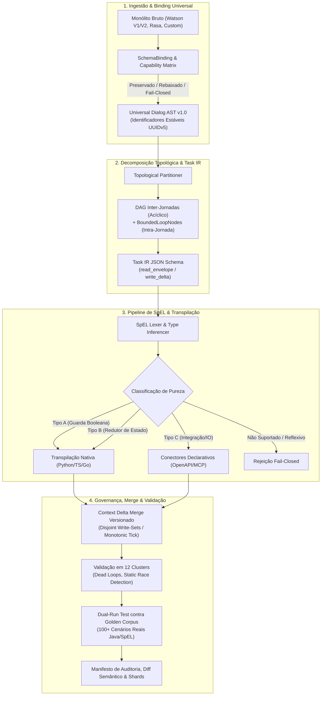

# ADR-047: North Star do tare.tools.dialog-engine — Motor Universal de Decomposição de Jornadas, Workflows Dinâmicos e Transpilação de SpEL

- **Status:** APROVADO / CANÔNICO v002 (Pós-Deliberação Tripartite `CASE-2026-08-18-DIALOG-ENGINE-NORTH-STAR`)
- **Data:** 2026-08-18
- **Autores:** Antigravity Mediator (Independent Synthesis & FSM Governor) em consenso com Assentos Google, OpenAI e Anthropic
- **Escopo:** `tare.tools.dialog-engine` (Repositório Standalone Universal & Motor Topológico de Diálogo)

---

## 1. Objetivos Nucleares (In-Scope)

1. **Decomposição Topológica de Jornadas & Bounded Loops:**
   - Separar ontologicamente a **Jornada de Negócio** (contratos canônicos SDD/BDD) da **Árvore de Diálogo Física** (Watson V1, V2 Actions, Rasa, autômatos aninhados).
   - Decompor monólitos de diálogo com 28.000+ nós em um **DAG acíclico inter-jornadas**, preservando ciclos operacionais intra-jornada legítimos (re-prompt de slots, confirmações, digressões) exclusivamente via construtos explícitos de **Iteração Limitada (`BoundedLoopNode`)** com terminação estaticamente comprovável.
2. **Workflows Dinâmicos Orientados a Tarefas (Blueprint-First-Model-Second & ACG):**
   - Transicionar de autômatos estáticos rígidos para Grafos de Computação Agêntica (*Agentic Computation Graphs - ACG*), modelados sob a especificação formal do **Task IR JSON Schema**.
   - Governar a execução através de *blueprints determinísticos* (invariantes de segurança, regras de compliance, transições de estado) com *slots dinâmicos tipados* preenchidos por modelos generativos.
   - Implementar decomposição *on-demand* (ADaPT) para particionar nós ambíguos em sub-tarefas de clarificação com garantias de terminação e rollback.
3. **Pipeline de SpEL em 4 Estágios, Subconjunto Formal & Golden Corpus:**
   - Extrair a AST de expressões Spring Expression Language (`<? ... ?>`) e classificá-las por pureza (Tipo A: Guardas Booleanas; Tipo B: Redutores de Estado; Tipo C: Ações de Integração/IO).
   - Definir gramática formal e semântica operacional executável do **Subconjunto SpEL Suportado** (coerções de tipo, null-safety, aritmética de strings idêntica ao Java/Spring), rejeitando com regra *fail-closed* qualquer construção reflexiva ou não-mapeada.
   - Transpilar para código nativo puro (Python/TS/Go), conectores declarativos (OpenAPI 3.0 / MCP) ou módulos de execução efêmera WASM.
4. **Universal SchemaBinding, AST Versionada & Sharding Adaptativo:**
   - Fornecer camada agnóstica de `SchemaBinding` com especificação normativa da **Universal Dialog AST v1.0**, acompanhada de Matriz de Capacidade por Plataforma (Preservado / Rebaixado / Rejeitado com *fail-closed*) e identificadores estáveis (UUID v5 determinístico por *content-hash*).
   - Executar diff semântico e validação estática em arquivos de 100+ MB através de sharding adaptativo com teto de memória e tempo de execução rigorosamente orçados.
5. **Taxonomia de Validação em 12 Clusters, Context Delta Determinístico & Dual-Run:**
   - Manter suite de 127+ testes automatizados cobrindo paridade semântica, integridade de saltos (*jumps*), *dead loops* vs. *bounded loops*, scoping de variáveis e conflitos de concorrência.
   - Garantir sincronização de estado atômica via **Context Delta com Envelope Versionado**, validando estaticamente a disjunção de *write-sets* em ramos paralelos e executando testes de *interleaving* adversarial.
   - Medir paridade dual-run contra um **Golden Corpus** canônico de 100+ cenários reais pré-gravados do runtime de referência.

---

## 1.2 Não-Objetivos Explícitos (Via Negativa & Fronteiras Arquiteturais)

1. **Sem Runtime Residente de Chat de Produção:** O `tare.tools.dialog-engine` é uma suíte de engenharia, validação estática, diff semântico, particionamento e simulação CI/CD; ele **não** atua como gateway de mensageria em tempo real em produção.
2. **Sem Chamadas Externas de Rede Durante Análise e Validação:** Toda análise topológica, parsing de SpEL, diff de memória e geração de mutantes ocorre **100% offline**, sem chamadas a APIs da IBM, OpenAI ou webhooks externos.
3. **Sem Oráculo Auto-Referente Desprovido de Baseline:** O dual-run **não** mede equivalência apenas contra um emulador re-implementado; ele afere paridade contra o *Golden Corpus* de execuções reais capturadas e contra a tabela normativa de coerção de tipos Java/SpEL.
4. **Sem Banco de Dados Residente Obrigatório:** O motor opera sobre arquivos locais e estruturas particionadas em memória, sem exigir instâncias ativas de PostgreSQL, MongoDB ou Redis.
5. **Sem Mutação Destrutiva Não-Versionada:** Nenhuma operação de transpilação ou refatoração sobrescreve artefatos sem manifesto de auditoria, diff semântico rastreável e validação prévia de paridade.
6. **Fronteira Estrita de Dependências (Stdlib-Only no Core):** O núcleo do motor (Fases 1 e 2: parser, AST, 12 clusters, particionador e transpilador) utiliza **estritamente Python stdlib**. O executor WASM (Fase 3) é um **plugin/provider opcional e isolado**, preservando a pureza e a portabilidade da ferramenta CLI base.

---

## 2. Decisões Arquiteturais Normativas



---

### A. Universal Dialog AST v1.0 & Contrato Normativo de SchemaBinding

Para sanar a indeterminação semântica e a perda de prioridade ([ISS-OPENAI-R1-01]):

1. **Semântica Operacional da AST:**
   - **Ordem Estrita de Condições:** Ramos de nós filhos possuem ordenação determinística expressa por índices inteiros contíguos (`priority_rank: int`). A avaliação ocorre sequencialmente em curto-circuito (*first-match-wins*), preservando a prioridade de transição.
   - **Fallback Explícito:** Todo nó de decisão sem guarda booleana explícita ou marcado como default é tipado como `FallbackBranch`, avaliado somente se todas as guardas precedentes falharem.
   - **Identificadores Estáveis:** IDs de nós na AST são gerados via UUID v5 determinístico calculado a partir do namespace do projeto e do *content-hash* canônico do nó, resistindo a reordenações de arquivo.
   - **Escopo e Visibilidade:** Três escopos formais são mantidos: `global` (sessão persistente), `journey` (sub-jornada ativa) e `transient` (ciclo do turno de diálogo).

2. **Matriz de Capacidade por Plataforma (Preservado, Rebaixado, Rejeitado):**

| Recurso / Campo Original | Watson V1 Classic | Watson V2 Actions | Rasa 3.x Domain/Rules | Ação do SchemaBinding |
| :--- | :--- | :--- | :--- | :--- |
| **Condições Ordenadas** | `conditions` | `condition` | `rules` / `stories` | **Preservado:** Mapeado para `priority_rank` na AST. |
| **Respostas com Variações** | `output.generic` | `action.response` | `utter_xxx` | **Preservado:** Mapeado para `PromptVariants`. |
| **Digressões / Retornos** | `digression` | `digressions` | `slots` / `checkpoints` | **Preservado:** Convertido em `BoundedLoopNode` ou salto explícito de sub-jornada. |
| **Manipulação de Contexto SpEL** | `context` com SpEL | Session Variables | Custom Actions (Python) | **Preservado (se no subconjunto)**; ver Seção B. |
| **Scripts / Tags HTML em Texto** | `output.text` | Rich Text | Custom Payload | **Rebaixado:** Sanitizado para texto puro estruturado + anotações de layout no Task IR. |
| **Ações Java Nativas / Reflexão** | Classes Java / `T(...)` | N/A | N/A | **Rejeitado (Fail-Closed):** Interrupção com erro estático estruturado (`ERR_UNSUPPORTED_JAVA_BINDING`). |
| **Extensões Não-Catalogadas** | Campos desconhecidos | Campos desconhecidos | Custom slot types não mapeados | **Rejeitado (Fail-Closed):** Proibida auto-descoberta permissiva; exige declaração no schema. |

---

### B. Subconjunto Formal de SpEL, Semântica Executável & Oráculo Dual-Run

Para eliminar divergências de coerção, tipagem e oráculos auto-referentes ([ISS-OPENAI-R1-02], [ISS-ANTHROPIC-R1-01]):

1. **Especificação do Subconjunto SpEL Seguro:**
   - **Aritmética e Coerção Java-Equivalent:**
     - String + Qualquer Tipo: Operação `'1' + 1` avalia estritamente como concatenação string (`"11"`), reproduzindo a semântica do compilador Java/Spring.
     - Operações Aritméticas (`+`, `-`, `*`, `/`, `%`): Exigem coerção estrita para float/int; operandos `null` em operações aritméticas disparam `SpELNullArithmeticException` determinística.
   - **Null-Safety & Navegação Segura:**
     - Suporte nativo ao operador de navegação segura (`#context?.usuario?.nome`). Se o alvo for `null`, retorna `null` sem disparar erro.
   - **Coleções & Projeções Suportadas:**
     - Indexação (`list[0]`, `map['chave']`), operadores `contains`, `size()`, `isEmpty()`, e projeção em coleções (`collection.?[status == 'ativo']`).
   - **Construções Rejeitadas (Fail-Closed):**
     - Instanciação de tipos (`new ...`), chamadas a tipos arbitrários (`T(java.lang.Runtime)`), métodos reflexivos (`getClass()`, `__class__`), e loops recursivos.

2. **Oráculo de Referência e Prova de Paridade:**
   - **Golden Corpus Canônico:** A suíte de validação integra um conjunto imutável de **100+ cenários reais** (Golden Dataset) capturados de execuções reais do Watson/Java com pares canônicos `(Contexto_Entrada, Expressao_SpEL) -> (Contexto_Saida, Resultado)`.
   - **Definição de Paridade Dual-Run:** O critério de aprovação em CI/CD é a correspondência exata de 100% entre a saída do código transpilado e as respostas gravadas no Golden Corpus, validando tanto o emulador offline quanto o transpilador contra o mesmo gabarito externo.

---

### C. Task IR & Semântica Determinística de Context Delta Merge

Para erradicar condições de corrida e inconsistências de estado concorrente ([ISS-OPENAI-R1-03], [ISS-ANTHROPIC-R1-02]):

1. **Especificação do Task IR (JSON Schema Normativo):**
   - Cada nó computacional no ACG gera um manifesto Task IR declarando explicitamente:
     ```json
     {
       "$schema": "https://tare.tools/schemas/task-ir-v1.0.json",
       "task_id": "task_auth_validate_cpf",
       "sub_journey_id": "journey_onboarding",
       "read_envelope": ["context.cpf", "context.tentativas"],
       "write_delta": ["context.cpf_valido", "context.tentativas"],
       "pure_classification": "TYPE_B_STATE_REDUCER",
       "commutativity_class": "EXCLUSIVE",
       "termination_invariant": "context.tentativas <= 3"
     }
     ```

2. **Detecção Estática de Conflitos (Cluster de Análise Estática):**
   - **Regra de Disjunção de Escrita:** Em qualquer ponto de bifurcação paralela no ACG, os `write_delta` dos ramos concorrentes **devem ser mutuamente disjuntos** ($\text{WriteSet}(Ramo_A) \cap \text{WriteSet}(Ramo_B) = \emptyset$).
   - Violações são tratadas como **erro estático fail-closed em tempo de compilação/análise** (`ERR_CONCURRENT_WRITE_COLLISION`), impedindo que ambiguidades cheguem ao runtime.

3. **Envelope Versionado e Resolução de Delta:**
   - Cada transição de estado opera sob um envelope com chave monotônica de versão (`epoch: int`, `version_tick: int`).
   - Mutações retornam apenas o delta de chaves alteradas. Se duas operações comutativas declaradas convergirem, o merge aplica-se ordenado deterministicamente pela prioridade topológica do nó.
   - Retries operam de forma puramente idempotente, recarregando o snapshot imutável antes de reavaliar o redutor.

---

### D. Topologia Híbrida: DAG Inter-Jornadas & Bounded Loops Intra-Jornada

Para conciliar a decomposição com a preservação de ciclos operacionais legítimos ([ISS-ANTHROPIC-R1-03]):

1. **Arquitetura Topológica de 2 Níveis:**
   - **Nível 1 (Inter-Jornadas):** O grafo de conexões entre sub-jornadas de negócio é um **DAG estritamente acíclico**. Não são permitidos saltos circulares entre jornadas distintas sem passar por eventos de transição de ciclo de vida.
   - **Nível 2 (Intra-Jornada):** Ciclos locais (ex: re-solicitação de CPF, confirmações e digressões) são modelados formalmente como `BoundedLoopNode`.

2. **Contrato do `BoundedLoopNode`:**
   - **Contador Monotônico de Iteração:** Exige uma variável de controle de repetição (`counter_var`).
   - **Limite Máximo Estático (`max_iterations`):** Valor inteiro fixo obrigatório (ex: $N \le 3$).
   - **Guarda de Saída por Exaustão:** Ramo de fallback determinístico obrigatório para onde o fluxo transiciona caso $N$ seja atingido (ex: transição para atendimento humano ou cancelamento).
   - **Validação de Dead Loops (Cluster 4):** Qualquer ciclo detectado na AST que não possua guarda monotônica e limite finito é rejeitado estaticamente como `ERR_UNBOUNDED_DEAD_LOOP`.

---

### E. Orçamento de Recursos & Limites Operacionais (SLAs Verificáveis)

Para transformar metas de desempenho em critérios falsificáveis (Recomendações dos Assentos):

| Dimensão | Orçamento / Limite Máximo | Condição de Medição & Hardware de Referência |
| :--- | :--- | :--- |
| **Consumo de Memória (RAM)** | $\le 512\text{ MB}$ | Parsing completo, sharding e diff semântico de monólito com 28.000 nós (JSON de 100 MB). |
| **Tempo de Análise Estática** | $\le 2.0\text{ s}$ | Validação dos 12 clusters e geração da AST para árvores de 28k nós em CPU x86_64/ARM64 (2-core). |
| **Tempo por Fatia de Nó (Task)** | $\le 200\text{ ms}$ | Avaliação de guarda SpEL / execução de redutor transpilado em container efêmero / WASM. |
| **Tamanho de Módulo Transpilado** | $\le 32\text{ MB}$ | Tamanho de footprint de binário isolado de sub-jornada para execução efêmera. |

---

## 3. Matriz de Falsificação & Rastreabilidade Refinada

| Requisito / Invariante | Mecanismo de Verificação | Teste / Falsificador Automatizado | Módulo de Implementação |
| :--- | :--- | :--- | :--- |
| **`REQ-DLG-01`: Parsing SpEL Fail-Closed** | Rejeição de reflexão, tipos Java e aritmética com tipos incompatíveis | `tests/test_watson_spel.py` | `src/tare_dialog/spel.py` |
| **`REQ-DLG-02`: SchemaBinding com Prioridade** | Preservação de ordem estrita de condições e rejeição de extensões não mapeadas | `tests/test_schema_adapter.py` | `src/tare_dialog/schema_adapter.py` |
| **`REQ-DLG-03`: Sharding & Limite de RAM** | Diff de arquivos de 100 MB garantindo uso de RAM $\le 512\text{ MB}$ | `tests/test_watson_shard.py` | `src/tare_dialog/shard.py` |
| **`REQ-DLG-04`: 12 Clusters & Bounded Loops** | Diferenciação estática entre `BoundedLoopNode` válido e `DeadLoop` sem saída | `tests/test_watson_validate.py` | `src/tare_dialog/validate.py` |
| **`REQ-DLG-05`: Context Delta & Detecção de Corrida** | Verificação estática de write-sets disjuntos e teste de interleaving concorrente | `tests/test_context_delta.py` | `src/tare_dialog/context.py` |
| **`REQ-DLG-06`: Limite Offline & Isolamento** | Bloqueio de rede na stdlib e execução pura sem dependências externas | `tests/test_offline_boundary.py` | `src/tare_dialog/runner.py` |
| **`REQ-DLG-07`: Dual-Run contra Golden Corpus** | Paridade exata de saída (100/100) contra o Golden Dataset gravado do Java/Watson | `tests/test_dual_run_parity.py` | `src/tare_dialog/transpiler.py` |
| **`REQ-DLG-08`: Task IR Contract Compliance** | Validação estrutural de manifestos Task IR gerados contra o JSON Schema v1.0 | `tests/test_task_ir_schema.py` | `src/tare_dialog/task_ir.py` |

---

## 4. Roadmap de Implementação em 3 Fases com Quality Gates

```mermaid
gantt
    title Roadmap de Implementação & Gates de Qualidade
    dateFormat  YYYY-MM-DD
    section Fase 1 (Core & Validação)
    AST v1.0 & SchemaBinding com Prioridade    :done, f1_1, 2026-08-01, 2026-08-15
    Validação 12 Clusters & Sharding 512MB    :done, f1_2, 2026-08-10, 2026-08-18
    Gate 1: 127+ Testes Unitários & Memory SLA :milestone, m1, 2026-08-18, 0d
    section Fase 2 (Task IR & Transpilação)
    Task IR JSON Schema & Bounded Loops Spec   :active, f2_1, 2026-08-19, 2026-09-02
    Golden Corpus SpEL (100+ Casos Reais)     :f2_2, 2026-08-25, 2026-09-10
    Transpilador Python/TS & Dual-Run Test     :f2_3, 2026-09-01, 2026-09-20
    Gate 2: 100% Paridade Dual-Run no Golden Corpus :milestone, m2, 2026-09-20, 0d
    section Fase 3 (Workflows & Provider WASM)
    Blueprint-First Engine & ADaPT Partitioner :f3_1, 2026-09-21, 2026-10-10
    Provider WASM Opcional Isolado             :f3_2, 2026-10-01, 2026-10-20
    Gate 3: Integração Completa E2E & Conformance :milestone, m3, 2026-10-20, 0d
```

1. **Fase 1 (Motor Core, Validação em 12 Clusters & Sharding Adaptativo — Concluída v0.6):**
   - 127+ testes unitários e de integração passando.
   - `SchemaBinding` universal com ordenação de prioridade, `triage_viewer.html` offline e controle de footprint de memória ($\le 512\text{ MB}$).
2. **Fase 2 (Gate de Especificação, Task IR, Golden Corpus & Transpilação de SpEL):**
   - **Quality Gate Obrigatório:** Congelamento do **Task IR JSON Schema** e publicação do **Golden Corpus de 100+ cenários SpEL**.
   - Implementação do particionador em DAG com suporte a `BoundedLoopNode`.
   - Transpilação do subconjunto seguro de SpEL para funções puras Python/TypeScript com paridade comprovada contra o Golden Corpus.
3. **Fase 3 (Workflows Dinâmicos, ADaPT & Runtime WASM Isolado):**
   - Orquestrador de blueprints determinísticos com slots generativos tipados e decomposição sob demanda (ADaPT).
   - Disponibilização do **Provider WASM** como módulo opcional separado (preservando o core stdlib-only).
