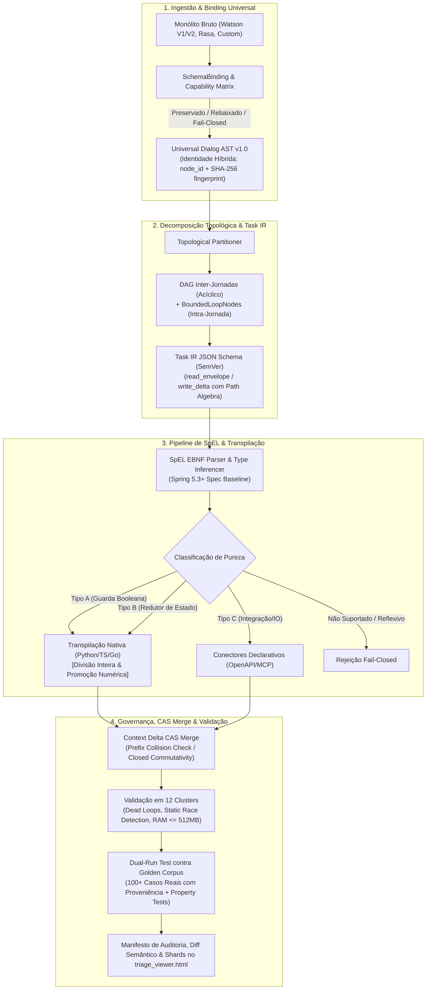

# ADR-047: North Star do tare.tools.dialog-engine — Motor Universal de Decomposição de Jornadas, Workflows Dinâmicos e Transpilação de SpEL

- **Status:** APROVADO / CANÔNICO v003 (Pós-Deliberação Tripartite `CASE-2026-08-18-DIALOG-ENGINE-NORTH-STAR` — Resolução de Bloqueios R2)
- **Data:** 2026-08-18
- **Autores:** Antigravity Mediator (Independent Synthesis & FSM Governor) em consenso com Assentos Google, OpenAI e Anthropic
- **Escopo:** `tare.tools.dialog-engine` (Repositório Standalone Universal & Motor Topológico de Diálogo)

---

## 1. Objetivos Nucleares (In-Scope)

1. **Decomposição Topológica de Jornadas & Bounded Loops:**
   - Separar ontologicamente a **Jornada de Negócio** (contratos canônicos SDD/BDD) da **Árvore de Diálogo Física** (Watson V1, V2 Actions, Rasa, autômatos aninhados).
   - Decompor monólitos de diálogo com 28.000+ nós em um **DAG acíclico inter-jornadas**, preservando ciclos operacionais intra-jornada legítimos (re-prompt de slots, confirmações, digressões) exclusivamente via construtos formais de **Iteração Limitada (`BoundedLoopNode`)** com terminação estaticamente comprovável.
2. **Workflows Dinâmicos Orientados a Tarefas (Blueprint-First-Model-Second & ACG):**
   - Transicionar de autômatos estáticos rígidos para Grafos de Computação Agêntica (*Agentic Computation Graphs - ACG*), modelados sob a especificação formal do **Task IR JSON Schema** com controle semântico de versão (`$schema` SemVer).
   - Governar a execução através de *blueprints determinísticos* (invariantes de segurança, regras de compliance, transições de estado) com *slots dinâmicos tipados* preenchidos por modelos generativos.
   - Implementar decomposição *on-demand* (ADaPT) para particionar nós ambíguos em sub-tarefas de clarificação com garantias de terminação e rollback.
3. **Pipeline de SpEL em 4 Estágios, Gramática EBNF, Semântica Executável & Golden Corpus:**
   - Extrair a AST de expressões Spring Expression Language (`<? ... ?>`) e classificá-las por pureza (Tipo A: Guardas Booleanas; Tipo B: Redutores de Estado; Tipo C: Ações de Integração/IO).
   - Fixar a gramática formal EBNF e a especificação operacional executável com linha de base no **Spring Expression Language 5.3+/6.x** (promoção numérica, divisão inteira tipada, null-safety e aritmética de strings), rejeitando com regra *fail-closed* construções reflexivas ou não mapeadas.
   - Transpilar para código nativo puro (Python/TS/Go), conectores declarativos (OpenAPI 3.0 / MCP) ou módulos de execução efêmera WASM.
4. **Universal SchemaBinding, Identidade Híbrida & Sharding Adaptativo:**
   - Fornecer camada agnóstica de `SchemaBinding` com especificação normativa da **Universal Dialog AST v1.0**, Matriz de Capacidade por Plataforma e **Identidade Híbrida** (`node_id` lógico de origem persistente + `content_fingerprint` SHA-256) para diferenciação precisa entre nós modificados, adicionados, removidos ou movidos.
   - Executar diff semântico e validação estática em arquivos de 100+ MB através de sharding adaptativo com teto de memória ($\le 512\text{ MB}$) e tempo de execução rigorosamente orçados, expondo o manifesto diretamente no `triage_viewer.html`.
5. **Taxonomia de Validação em 12 Clusters, Álgebra de Context Delta (CAS) & Dual-Run:**
   - Manter suite de 127+ testes automatizados cobrindo paridade semântica, integridade de saltos (*jumps*), *dead loops* vs. *bounded loops*, scoping de variáveis e detecção estática de corridas.
   - Garantir sincronização de estado atômica via **Álgebra de Paths de Context Delta** com detecção de colisões por prefixo hierárquico, envelope monotônico de versão e precondições *Compare-And-Swap* (CAS) para retries idempotentes.
   - Medir paridade dual-run contra um **Golden Corpus** canônico imutável de 100+ cenários reais auditáveis com proveniência e validação baseada em propriedades (*property-based testing*).

---

## 1.2 Não-Objetivos Explícitos (Via Negativa & Fronteiras Arquiteturais)

1. **Sem Runtime Residente de Chat de Produção:** O `tare.tools.dialog-engine` é uma suíte de engenharia, validação estática, diff semântico, particionamento e simulação CI/CD; ele **não** atua como gateway de mensageria em tempo real em produção.
2. **Sem Chamadas Externas de Rede Durante Análise e Validação:** Toda análise topológica, parsing de SpEL, diff de memória e geração de mutantes ocorre **100% offline**, sem chamadas a APIs da IBM, OpenAI ou webhooks externos.
3. **Sem Oráculo Auto-Referente Desprovido de Baseline:** O dual-run **não** mede equivalência apenas contra um emulador re-implementado; ele afere paridade contra o *Golden Corpus* auditável de execuções capturadas do runtime Java/Spring de referência e vetores de conformidade sintéticos.
4. **Sem Banco de Dados Residente Obrigatório:** O motor opera sobre arquivos locais e estruturas particionadas em memória, sem exigir instâncias ativas de PostgreSQL, MongoDB ou Redis.
5. **Sem Mutação Destrutiva Não-Versionada:** Nenhuma operação de transpilação ou refatoração sobrescreve artefatos sem manifesto de auditoria, diff semântico rastreável e validação prévia de paridade.
6. **Fronteira Estrita de Dependências (Stdlib-Only no Core):** O núcleo do motor (Fases 1 e 2: parser, AST, 12 clusters, particionador, transpilador e analisador estático) utiliza **estritamente Python stdlib**. O executor WASM (Fase 3) é um **plugin/provider opcional e isolado**, preservando a portabilidade absoluta da ferramenta base.

---

## 2. Decisões Arquiteturais Normativas



---

### A. Universal Dialog AST v1.0, Identidade Híbrida & SchemaBinding

Para sanar a indeterminação semântica ([ISS-OPENAI-R1-01]) e a instabilidade de identidade entre revisões ([ISS-OPENAI-R2-01]):

1. **Modelo de Identidade Híbrida (Identity vs. Fingerprint):**
   - **Identificador de Origem Persistente (`node_id`):** UUID v5 determinístico gerado a partir do namespace canônico da jornada e da chave lógica de origem do nó (`source_origin_id` ou caminho estrutural estável na árvore de diálogo de negócio). O `node_id` é **invariante a modificações de conteúdo** (alterações de prompts, textos ou expressões de guarda mantêm o mesmo `node_id`).
   - **Fingerprint de Conteúdo (`content_fingerprint`):** Hash SHA-256 canônico calculado sobre a serialização determinística (chaves ordenadas, whitespace normalizado) das propriedades semânticas do nó (expressões de guarda, *PromptVariants*, contexto e transições).
   - **Álgebra de Diff Semântico Normativa:**
     - **Unchanged:** $\text{node\_id}_A = \text{node\_id}_B \land \text{content\_fingerprint}_A = \text{content\_fingerprint}_B$.
     - **Modified:** $\text{node\_id}_A = \text{node\_id}_B \land \text{content\_fingerprint}_A \neq \text{content\_fingerprint}_B$ (o diff semântico isola exatamente os campos mutados sem tratar o nó como deletado/criado).
     - **Added / Deleted:** $\text{node\_id}$ presente em apenas um dos manifestos.
     - **Moved / Reordered:** $\text{node\_id}_A = \text{node\_id}_B \land \text{parent\_id}_A \neq \text{parent\_id}_B \lor \text{priority\_rank}_A \neq \text{priority\_rank}_B$.

2. **Semântica Operacional da AST & Política de Schema:**
   - **Ordem Estrita de Condições:** Ramos de nós filhos possuem ordenação determinística expressa por índices inteiros contíguos (`priority_rank: int`). A avaliação ocorre sequencialmente em curto-circuito (*first-match-wins*).
   - **Fallback Explícito:** Todo nó de decisão sem guarda booleana explícita ou default é tipado como `FallbackBranch`, avaliado somente se todas as guardas precedentes falharem.
   - **Escopo e Visibilidade:** Três escopos formais são mantidos: `global` (sessão persistente), `journey` (sub-jornada ativa) e `transient` (ciclo do turno de diálogo).
   - **Evolução do Schema ($schema & SemVer):** O schema (`https://tare.tools/schemas/dialog-ast-v1.json`) adota SemVer estrito. Campos adicionais devem ser opcionais e retrocompatíveis (versões minor/patch); quebras semânticas exigem incremento de major version (`dialog-ast-v2.json`).

3. **Matriz de Capacidade por Plataforma (Preservado, Rebaixado, Rejeitado):**

| Recurso / Campo Original | Watson V1 Classic | Watson V2 Actions | Rasa 3.x Domain/Rules | Ação do SchemaBinding |
| :--- | :--- | :--- | :--- | :--- |
| **Condições Ordenadas** | `conditions` | `condition` | `rules` / `stories` | **Preservado:** Mapeado para `priority_rank` na AST. |
| **Respostas com Variações** | `output.generic` | `action.response` | `utter_xxx` | **Preservado:** Mapeado para `PromptVariants`. |
| **Digressões / Retornos** | `digression` | `digressions` | `slots` / `checkpoints` | **Preservado:** Convertido em `BoundedLoopNode` ou salto explícito de sub-jornada. |
| **Manipulação de Contexto SpEL** | `context` com SpEL | Session Variables | Custom Actions (Python) | **Preservado (se no subconjunto formal)**; ver Seção B. |
| **Scripts / Tags HTML em Texto** | `output.text` | Rich Text | Custom Payload | **Rebaixado:** Sanitizado para texto puro estruturado + anotações de layout no Task IR. |
| **Ações Java Nativas / Reflexão** | Classes Java / `T(...)` | N/A | N/A | **Rejeitado (Fail-Closed):** Interrupção com erro estático estruturado (`ERR_UNSUPPORTED_JAVA_BINDING`). |
| **Extensões Não-Catalogadas** | Campos desconhecidos | Campos desconhecidos | Custom slot types não mapeados | **Rejeitado (Fail-Closed):** Proibida auto-descoberta permissiva; exige declaração no schema. |

---

### B. Subconjunto Formal de SpEL, EBNF, Semântica Executável & Oráculo Dual-Run

Para sanar divergências de coerção e oráculos desprovidos de baseline ([ISS-OPENAI-R1-02], [ISS-ANTHROPIC-R1-01], [ISS-OPENAI-R2-03]):

1. **Linha de Base Normativa:**
   - O subconjunto SpEL suportado adota como especificação de referência o **Spring Expression Language (SpEL) conforme implementado no Spring Framework 5.3+ / 6.x**.

2. **Gramática Formal EBNF do Subconjunto SpEL:**
   ```ebnf
   Expression          ::= LogicalOrExpr
   LogicalOrExpr       ::= LogicalAndExpr ( ('or' | '||') LogicalAndExpr )*
   LogicalAndExpr      ::= EqualityExpr ( ('and' | '&&') EqualityExpr )*
   EqualityExpr        ::= RelationalExpr ( ('==' | '!=') RelationalExpr )*
   RelationalExpr      ::= AdditiveExpr ( ('<' | '<=' | '>' | '>=') AdditiveExpr )?
   AdditiveExpr        ::= MultiplicativeExpr ( ('+' | '-') MultiplicativeExpr )*
   MultiplicativeExpr  ::= UnaryExpr ( ('*' | '/' | '%') UnaryExpr )*
   UnaryExpr           ::= ('not' | '!' | '+' | '-')? PrimaryExpr
   PrimaryExpr         ::= Literal | VariableRef | SafeNavExpr | IndexExpr | ProjectionExpr | '(' Expression ')'
   SafeNavExpr         ::= VariableRef '?.' PropertyName ( '?.' PropertyName )*
   IndexExpr           ::= (VariableRef | PropertyName) '[' (Literal | Expression) ']'
   ProjectionExpr      ::= VariableRef '.?[' Expression ']'
   VariableRef         ::= '#' ContextRoot ( '.' PropertyName )*
   ContextRoot         ::= 'context' | 'session' | 'entities' | 'input'
   Literal             ::= StringLiteral | IntegerLiteral | FloatLiteral | BooleanLiteral | 'null'
   ```

3. **Tabela Normativa de Promoção Numérica, Coerção e Semântica de Operadores:**

| Operador / Expressão | Tipos dos Operandos | Semântica Normativa (Spring 5.3+ Baseline) | Regra de Transpilação (Python / TypeScript / Go) |
| :--- | :--- | :--- | :--- |
| **Divisão (`/`)** | `int / int` (ex: `1 / 2`) | **Divisão inteira truncada em direção a zero** $\to `0`$ | **Python:** `a // b` (com ajuste para negativos) \| **TS:** `Math.trunc(a / b)` |
| **Divisão (`/`)** | `float / int` ou `float / float` | **Divisão ponto flutuante IEEE 754** $\to `0.5`$ | **Python/TS/Go:** `float(a) / float(b)` |
| **Adição (`+`)** | `String + Qualquer` | **Concatenação de strings** (ex: `'1' + 1 \to '11'`; `'v:' + null \to 'v:null'`) | Coerção explícita para string em todos os targets |
| **Aritmética com `null`** | `null + N`, `null * N`, `null - N` | **Erro de Execução Determinístico** | Dispara `SpELNullArithmeticException` estática |
| **Navegação Segura (`?.`)** | Alvo é `null` (ex: `#context?.cliente?.nome`) | **Curto-circuito para `null`** sem erro | Mapeado para `getattr(..., None)` / Optional Chaining `?.` |
| **Igualdade (`==`, `!=`)** | Tipos Primitivos / Literais / `null` | Igualdade por valor (`null == null \to true`; `1 == '1' \to false`) | Comparação estrita de tipo e valor |
| **Construções Rejeitadas** | `T(...)`, `new ...`, `getClass()`, `exec()` | **Fail-Closed Imediato** | Erro estático estruturado `ERR_SPEL_FORBIDDEN_CONSTRUCT` |

4. **EvaluationContext Normativo:**
   - O contexto de avaliação restringe-se a instâncias imutáveis de `ReadOnlyEvaluationContext` expondo exclusivamente as raízes `#context`, `#session`, `#entities` e `#input`.
   - Remoção de qualquer `TypeLocator`, `TypeConverter` arbitrário ou acesso a métodos reflexivos do runtime hospedeiro.

5. **Golden Corpus Versionado, Proveniência & Property-Based Testing:**
   - **Schema JSON Normativo do Golden Corpus:**
     ```json
     {
       "$schema": "https://tare.tools/schemas/golden-corpus-v1.json",
       "corpus_version": "1.0.0",
       "cases": [
         {
           "case_id": "SPEL-DIV-001",
           "source_runtime": "Watson-V1-Spring-5.3.27",
           "capture_date": "2026-08-18",
           "expression": "1 / 2",
           "input_context": {},
           "expected_output": 0,
           "expected_type": "int",
           "sha256": "e3b0c44298fc1c149afbf4c8996fb92427ae41e4649b934ca495991b7852b855"
         }
       ]
     }
     ```
   - **Imutabilidade e CI/CD:** O Golden Corpus de 100+ casos reais é registrado no repositório com assinatura SHA-256 de integridade.
   - **Testes por Propriedades:** A suíte integra geradores baseados em propriedades (*Hypothesis/QuickCheck*) para explorar casos-limite de overflow, precedência e coerções em todos os alvos transpilados.

---

### C. Task IR & Semântica Algébrica de Context Delta Merge (CAS)

Para erradicar condições de corrida, ambiguidades de aliasing e retries inconsistentes ([ISS-OPENAI-R1-03], [ISS-ANTHROPIC-R1-02], [ISS-OPENAI-R2-02]):

1. **Especificação do Task IR (JSON Schema Normativo com SemVer):**
   ```json
   {
     "$schema": "https://tare.tools/schemas/task-ir-v1.0.0.json",
     "task_id": "task_auth_validate_cpf",
     "sub_journey_id": "journey_onboarding",
     "read_envelope": [
       {"path": "context.cpf", "required_type": "string"},
       {"path": "context.tentativas", "required_type": "integer"}
     ],
     "write_delta": [
       {"path": "context.cpf_valido", "operation": "SET", "target_type": "boolean"},
       {"path": "context.tentativas", "operation": "INCREMENT", "target_type": "integer"}
     ],
     "pure_classification": "TYPE_B_STATE_REDUCER",
     "commutativity_class": "MONOTONIC_COUNTER_ADD",
     "termination_invariant": "context.tentativas <= 3"
   }
   ```

2. **Álgebra de Paths e Detecção de Colisão por Prefixo Hierárquico:**
   - **Definição de Colisão de Caminho ($\text{Collides}(p_1, p_2)$):**
     $$\text{Collides}(p_1, p_2) \iff (p_1 = p_2) \lor (p_1 \text{ é prefixo hierárquico de } p_2) \lor (p_2 \text{ é prefixo hierárquico de } p_1)$$
     *Exemplo:* `context.cliente` e `context.cliente.nome` colidem porque o primeiro é prefixo estrito do segundo.
   - **Invariante de Disjunção Estática em Bifurcações Paralelas:**
     Em qualquer nó de bifurcação paralela concorrente ($R_A \parallel R_B$), a interseção de escrita com expansão de prefixos deve ser estritamente vazia:
     $$\forall p_a \in \text{WriteSet}(R_A), \forall p_b \in \text{WriteSet}(R_B) \implies \neg \text{Collides}(p_a, p_b)$$
   - **Tratamento Fail-Closed:** Se $\text{Collides}(p_a, p_b)$ for verdadeiro e as operações não pertencerem à Tabela de Operações Comutativas, a compilação/análise é abortada estaticamente com `ERR_CONCURRENT_PREFIX_COLLISION`.

3. **Envelope Monotônico de Versão e Semântica CAS (Compare-And-Swap):**
   - O estado global é governado por uma tupla de versão monotônica: $\mathcal{V} = \langle \text{epoch}: \text{int}, \text{tick}: \text{int} \rangle$.
   - Cada tarefa executa sob um snapshot de estado imutável capturado no instante $T_{\text{read}} = \mathcal{V}_{\text{snap}}$.
   - Ao concluir, a mutação é aplicada atomicamente via transação CAS:
     $$\text{Commit}(\Delta) = \begin{cases} \text{Sucesso}(\mathcal{V}_{\text{new}} \leftarrow \langle \text{epoch}, \text{tick} + 1 \rangle), & \text{se } \forall p \in \text{ReadEnvelope}(\Delta), \text{Version}(p) = \mathcal{V}_{\text{snap}}(p) \\ \text{CAS\_RETRY\_IDEMPOTENT}, & \text{se o snapshot expirou (reexecuta o redutor sobre o novo snapshot)} \end{cases}$$
   - Retries são estritamente idempotentes e isentos de efeitos colaterais de I/O (garantidos pela pureza Tipo B).

4. **Tabela Fechada de Operações Comutativas Verificadas:**

| Classe Comutativa | Operação Permitida | Propriedades Formais Comprovadas | Regra de Resolução no Merge Concorrente |
| :--- | :--- | :--- | :--- |
| `EXCLUSIVE` | `SET` em paths disjuntos | Associativa, Comutativa | Aplicação direta de deltas em chaves disjuntas. |
| `MONOTONIC_COUNTER_ADD` | `INCREMENT(k)` em inteiros | Associativa, Comutativa ($a + b = b + a$) | Soma agregada monotônica dos deltas concorrentes. |
| `DISJOINT_MAP_MERGE` | `PUT(key, val)` em mapas | Comutativa para chaves disjuntas | Merge profundo de mapas com validação estática de chaves. |
| `SET_UNION` | `ADD(elem)` em coleções de conjunto | Associativa, Comutativa, Idempotente | União de conjuntos $\mathcal{S}_A \cup \mathcal{S}_B$ preservando unicidade. |
| *Qualquer Outra* | Sobrescrita concorrente de objeto | **Não Comutativa** | **Rejeitado estaticamente (`ERR_NON_COMMUTATIVE_MERGE`)** |

---

### D. Topologia Híbrida: DAG Inter-Jornadas & Bounded Loops Intra-Jornada

Para conciliar a decomposição em DAG com a preservação de ciclos operacionais legítimos ([ISS-ANTHROPIC-R1-03]):

1. **Arquitetura Topológica de 2 Níveis:**
   - **Nível 1 (Inter-Jornadas):** O grafo de conexões entre sub-jornadas de negócio é um **DAG estritamente acíclico**. Não são permitidos saltos circulares entre jornadas distintas sem passar por eventos de transição de ciclo de vida auditados.
   - **Nível 2 (Intra-Jornada):** Ciclos locais (ex: re-solicitação de CPF, confirmações e digressões) são modelados formalmente como `BoundedLoopNode`.

2. **Contrato Formal do `BoundedLoopNode`:**
   - **Contador Monotônico de Iteração:** Exige uma variável de controle de repetição (`counter_var: string`) com incremento estrito a cada ciclo.
   - **Limite Máximo Estático (`max_iterations: int`):** Valor inteiro finito obrigatório (ex: $N \le 3$).
   - **Guarda de Saída por Exaustão:** Ramo de fallback determinístico obrigatório para onde o fluxo transiciona caso $N$ seja atingido (ex: transição para atendimento humano ou cancelamento da jornada).
   - **Validação de Dead Loops (Cluster 4):** Qualquer ciclo detectado na AST que não possua contador monotônico e guarda de exaustão finita é rejeitado estaticamente como `ERR_UNBOUNDED_DEAD_LOOP`.

---

### E. Orçamento de Recursos & Limites Operacionais (SLAs Verificáveis)

| Dimensão | Orçamento / Limite Máximo | Condição de Medição & Hardware de Referência |
| :--- | :--- | :--- |
| **Consumo de Memória (RAM)** | $\le 512\text{ MB}$ | Parsing completo, sharding e diff semântico de monólito com 28.000 nós (JSON de 100 MB), com telemetria contínua. |
| **Tempo de Análise Estática** | $\le 2.0\text{ s}$ | Validação dos 12 clusters e geração da AST para árvores de 28k nós em CPU x86_64/ARM64 (2-core). |
| **Tempo por Fatia de Nó (Task)** | $\le 200\text{ ms}$ | Avaliação de guarda SpEL / execução de redutor transpilado em container efêmero / WASM. |
| **Tamanho de Módulo Transpilado** | $\le 32\text{ MB}$ | Footprint de binário isolado de sub-jornada para execução efêmera. |

---

## 3. Matriz de Falsificação & Rastreabilidade Refinada

| Requisito / Invariante | Mecanismo de Verificação | Teste / Falsificador Automatizado | Módulo de Implementação |
| :--- | :--- | :--- | :--- |
| **`REQ-DLG-01`: SpEL EBNF & Divisão Inteira** | Verificação de conformidade EBNF, promoção numérica e `1 / 2 == 0` contra Spring 5.3+ | `tests/test_watson_spel.py` | `src/tare_dialog/spel.py` |
| **`REQ-DLG-02`: Identidade Híbrida da AST** | Invariância de `node_id` sob alteração de conteúdo e detecção de modified/moved | `tests/test_ast_identity.py` | `src/tare_dialog/ast.py` |
| **`REQ-DLG-03`: Sharding & Telemetria de RAM** | Diff de 100 MB com telemetria contínua $\le 512\text{ MB}$ exibida no `triage_viewer.html` | `tests/test_watson_shard.py` | `src/tare_dialog/shard.py` |
| **`REQ-DLG-04`: 12 Clusters & Bounded Loops** | Diferenciação estática entre `BoundedLoopNode` válido e `DeadLoop` sem saída | `tests/test_watson_validate.py` | `src/tare_dialog/validate.py` |
| **`REQ-DLG-05`: Álgebra CAS & Prefix Collision** | Rejeição de colisões de prefixo (`context.cli` vs `context.cli.nome`) e teste CAS | `tests/test_context_delta.py` | `src/tare_dialog/context.py` |
| **`REQ-DLG-06`: Limite Offline & Isolamento** | Bloqueio de rede na stdlib e execução pura sem dependências externas | `tests/test_offline_boundary.py` | `src/tare_dialog/runner.py` |
| **`REQ-DLG-07`: Golden Corpus & Property Tests** | Paridade exata 100% contra 100+ casos versionados por SHA-256 e testes generativos | `tests/test_dual_run_parity.py` | `src/tare_dialog/transpiler.py` |
| **`REQ-DLG-08`: Task IR Schema & SemVer** | Validação estrutural de manifestos Task IR contra JSON Schema v1.0.0 versionado | `tests/test_task_ir_schema.py` | `src/tare_dialog/task_ir.py` |

---

## 4. Roadmap de Implementação em 3 Fases com Quality Gates

```mermaid
gantt
    title Roadmap de Implementação & Gates de Qualidade
    dateFormat  YYYY-MM-DD
    section Fase 1 (Core & Validação)
    AST v1.0, Identidade Híbrida & SchemaBinding :done, f1_1, 2026-08-01, 2026-08-15
    Validação 12 Clusters, Sharding & RAM Telemetry :done, f1_2, 2026-08-10, 2026-08-18
    Gate 1: 127+ Testes, Identidade Híbrida & RAM SLA :milestone, m1, 2026-08-18, 0d
    section Fase 2 (Task IR, SpEL EBNF & Transpilação)
    Task IR SemVer & Álgebra de Paths CAS Spec       :active, f2_1, 2026-08-19, 2026-09-02
    SpEL EBNF, Spring 5.3+ Spec & Golden Corpus SHA :f2_2, 2026-08-25, 2026-09-10
    Transpilador Multi-Target & Dual-Run Parity     :f2_3, 2026-09-01, 2026-09-20
    Gate 2: 100% Paridade no Golden Corpus & CAS Validado :milestone, m2, 2026-09-20, 0d
    section Fase 3 (Workflows & Provider WASM)
    Blueprint-First Engine & ADaPT Partitioner       :f3_1, 2026-09-21, 2026-10-10
    Provider WASM Opcional Isolado                   :f3_2, 2026-10-01, 2026-10-20
    Gate 3: Integração Completa E2E & Conformance     :milestone, m3, 2026-10-20, 0d
```

1. **Fase 1 (Motor Core, Validação em 12 Clusters, Identidade Híbrida & Sharding Adaptativo — Concluída v0.6):**
   - 127+ testes unitários e de integração passando.
   - `SchemaBinding` universal com ordenação de prioridade, Identidade Híbrida (`node_id` persistente + `content_fingerprint`), `triage_viewer.html` com manifesto de diff semântico e telemetria contínua de RAM ($\le 512\text{ MB}$).
2. **Fase 2 (Gate de Especificação, Task IR, Álgebra CAS, SpEL EBNF & Transpilação com Golden Corpus):**
   - **Quality Gate Obrigatório:** Congelamento do **Task IR JSON Schema** (SemVer), formalização da **Álgebra de Paths CAS com tabela comutativa fechada**, publicação da **Gramática EBNF do SpEL (Spring 5.3+ baseline)** e congelamento do **Golden Corpus imutável com proveniência e hash SHA-256**.
   - Implementação do particionador em DAG com suporte a `BoundedLoopNode`.
   - Transpilação do subconjunto seguro de SpEL (com divisão inteira estrita `1 / 2 == 0` e concatenação de strings) para Python/TypeScript/Go com 100% de paridade comprovada no dual-run.
3. **Fase 3 (Workflows Dinâmicos, ADaPT & Runtime WASM Isolado):**
   - Orquestrador de blueprints determinísticos com slots generativos tipados e decomposição sob demanda (ADaPT).
   - Disponibilização do **Provider WASM** como módulo opcional separado (preservando o core stdlib-only).
