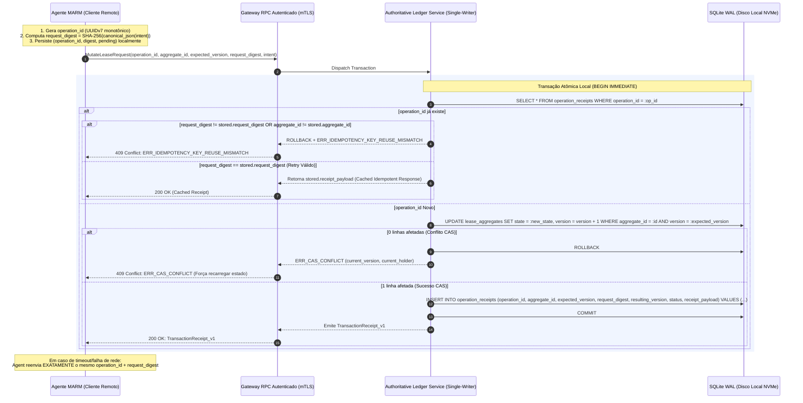

# ADR-050: Decomposição Poliglota de Aplicações, Camadas Anticorrupção (ACL), Gestão Defensiva de Dependências, Concorrência CAS e Governança de Forks de Alto Desempenho

- **Status:** REFINADA / VERSÃO CANÔNICA v003 (Consenso Tripartite Pós-Rodada 2) (`CASE-2026-08-19-APP-DECOMPOSITION-ACL-AND-DEPENDENCY-GOVERNANCE`)
- **Data:** 2026-08-19
- **Autores:** Antigravity Mediator sob direção de Engenharia e Operação Humana
- **Escopo:** `tare.tools.os`, `tare.tools.kernel`, `tare.tools.specgraph`, `tare.tools.backlog-graph`, `tare.tools.dialog-engine`, `tare.tools.research`, `slop.cpp`

---

## 1. Contexto & Fundamentação Teórico-Prática

O desenvolvimento de um **Agent Operating System** para engenharia de software autônoma e colaborativa enfrenta o clássico dilema *"Buy vs. Build"* (Reaproveitamento vs. Construção Própria).

Historicamente, arquiteturas multiagente degeneram em dois extremos patológicos:
1. **Síndrome de Não-Inventado-Aqui (NIH):** Tentativa de reescrever parsers sintáticos, bancos relacionais, motores de inferência e sandboxes do zero, gerando atrasos crônicos, bugs de baixo nível e código frágil.
2. **Acoplamento Parasitário & Inchaço de Dependências (Dependency Bloat):** Adoção descuidada de frameworks e pacotes externos que arrastam árvores gigantes de dependências transitivas, impõem paradigmas invasivos no heap central e acumulam uma dívida impagável de desincronização (*upstream desync debt*).

Para alcançar **máxima performance de execução** sem abrir mão de **modularidade estrita, isolamento operacional e soberania de código**, este ADR estabelece a fundamentação teórica baseada em:
- **Ocultamento de Informação (Parnas, 1972):** Módulos expõem apenas interfaces mínimas e ocultam suas decisões internas de implementação.
- **Camada Anticorrupção / Ports & Adapters (Evans DDD, Cockburn Hexagonal):** O domínio central do OS nunca consome tipos ou estruturas de terceiros diretamente; adapters isolam a variabilidade externa através de contratos versionados e envelopes padronizados.
- **Eficiência Poliglota por Camadas de Custo Físico:** Distribuição tecnológica estrita baseada no custo computacional de cada subdomínio (C++/CUDA no silício, C/POSIX no sandbox, Rust/C-ABI no parsing e Python 3.12+ na orquestração de alto nível).
- **Linearizabilidade & Single-Writer Authoritative Ledger (Lamport, 1978; Liskov, 1988):** Transições de estado autoritativas via Compare-And-Swap (CAS) atômico em processo escritor único local, transações ACID fechadas com receipts imutáveis, reserva de idempotência vinculada a `request_digest` criptográfico e coordenação remota exclusivamente por RPC autenticado.
- **Princípio do Padrão Seguro / Fail-Closed (Saltzer & Schroeder, 1975):** Todo nó ou subsistema que não possuir os pré-requisitos de isolamento ou compatibilidade física deve recusar tarefas de execução de forma explícita, emitindo recibo formal de erro, jamais degradando silenciosamente para um estado inseguro.

---

## 2. Decisões Arquiteturais Propostas (Objetivos In-Scope)

```mermaid
flowchart TD
    subgraph Layer1 ["1. Experience Plane (TypeScript / WebGL)"]
        WebUI["Cockpit Visual & Visualização de Grafos<br>Cytoscape.js / Canvas WebGL (Budget: p95 &le; 16.6ms / 60 FPS)"]
    end

    subgraph Layer2 ["2. Control & Orchestration Plane (Python 3.12+)"]
        OSRemote["Nó Remoto MARM (Worker / Agent)<br>(Gera UUIDv7 + SHA-256 Digest Local)"]
        OSMaster["Nó Mestre / Authoritative State Governor<br>(Single-Writer Authoritative Ledger Service)"]
        KernelContracts["tare.tools.kernel / contracts/v1<br>(JSON Schemas, GraphML, DDL & Topology Doc)"]
    end

    subgraph Layer3 ["3. Anti-Corruption Layer & Storage Substrate (ACL)"]
        AiderAdapter["AiderDriver Adapter (CLI Subprocess)<br>Contrato v1.0.0 | Validação Bidirecional"]
        TreeSitterAdapter["TreeSitter Adapter (C-ABI Pure Bindings)<br>Zero-Copy Parse | Bounds & Timeouts"]
        AuthoritativeLedger["Authoritative SQLite WAL Ledger (Disco Local NVMe)<br>Transação Atômica Única: CAS + Operation Receipt Digest"]
        TelemetryIPC["IPC Telemetry Observer & Benchmarking<br>(Métricas: RSS, Latência JSON, Contenção ERR_CAS_CONFLICT)"]
    end

    subgraph Layer4 ["4. High-Performance Hardware Substrate & Sandbox"]
        SlopCPP["slop.cpp (Fork Otimizado do llama.cpp)<br>Gate 4-Tiers: CUDA sm_86 + Perf + VRAM + Equivalência Greedy"]
        BwrapSandbox["Bubblewrap (bwrap) Sandbox<br>Linux Namespaces (--unshare-net, --ro-bind)<br>Budget: overhead &le; 42ms"]
        PlatformGate{"Platform Matrix & Fail-Closed Gate<br>(Nó Linux vs. Windows Host)"}
    end

    WebUI -->|JSON-RPC / WebSockets (Schema v1)| OSMaster
    OSRemote -->|Authenticated RPC (mTLS / Tailscale)| OSMaster
    OSMaster -.->|Governa Contratos & Topologia| KernelContracts
    OSMaster -->|Subprocess IPC / JSON Schema v1| AiderAdapter
    OSMaster -->|C-ABI Bindings| TreeSitterAdapter
    OSMaster -->|Transação Atômica Local (In-Process)| AuthoritativeLedger
    OSMaster -->|Tailscale HTTP / mTLS| SlopCPP
    AiderAdapter --> PlatformGate
    PlatformGate -->|Host Linux com bwrap| BwrapSandbox
    PlatformGate -->|Host Windows / Sem bwrap| RefuseExecution["ERR_PLATFORM_UNSUPPORTED<br>(Fail-Closed Receipt / Sem Bypass)"]
    AiderAdapter -.-> TelemetryIPC
    AuthoritativeLedger -.-> TelemetryIPC
```

---

### A. Decomposição Poliglota, Matriz de Plataformas & Budgets de Performance

A distribuição tecnológica por domínio de especialização física é parametrizada com uma matriz de suporte de plataformas explícita e limites orçamentários (*budgets*) auditáveis:

| Camada | Tecnologia & Versão Pinada | Plataformas Suportadas | Comportamento Fail-Closed em Plataforma Não-Suportada | Budget de Performance & Hardware de Referência |
| :--- | :--- | :--- | :--- | :--- |
| **Inferência & GPU** | **C++20 / CUDA 12 (`slop.cpp` fork)** | Linux (x86_64) c/ NVIDIA GPU ($\ge \text{sm\_86}$) | Emite `ERR_INFERENCE_HARDWARE_UNAVAILABLE`. Rejeita inferência local; roteia para nó remoto via Tailscale. | Prefill $\ge 600\text{ t/s}$, Geração $\ge 80\text{ t/s}$ (RTX 3090, batch=1, Q4_K_M). TTFT p95 $\le 120\text{ ms}$. |
| **Isolamento & Sandbox** | **C / POSIX (`bubblewrap` v0.9+)** | Linux (Kernel $\ge 5.10$ c/ user namespaces) | **Recusa imediata da task** com receipt `ERR_PLATFORM_UNSUPPORTED`. **Proibido bypass** para execução insegura no host. | Overhead de spawn de processo isolado p95 $\le 42\text{ ms}$ (CPU i7-12700H / AMD 5950X). |
| **Parsing Sintático AST** | **`tree-sitter` (C / Rust C-ABI)** | Linux (x86_64), Windows (x64), macOS (ARM64) | N/A (Multiplataforma universal via C-ABI puro). | Parse incremental p95 $\le 5\text{ ms}$ por arquivo de 10k linhas de código; full parse $\le 50\text{ ms}$ em 100k linhas. |
| **Persistência & Ledger CAS** | **SQLite (WAL + JSONB) Single-Writer** | Linux (x86_64), Windows (x64), macOS (ARM64) | Proibido acesso direto de múltiplos nós via filesystem compartilhado (NFS/SMB). Acesso remoto unicamente via RPC autenticado. | Latência de escrita de transação atômica CAS+Receipt p99 $\le 4\text{ ms}$ (NVMe local do nó escritor autoritativo). |
| **Orquestração & FSM** | **Python 3.12+ (CPython)** | Linux (x86_64), Windows (x64), macOS (ARM64) | N/A (Core do runtime do Agent OS). | Latência de despacho de evento na FSM p99 $\le 2\text{ ms}$. |
| **Cockpit & Visualização** | **TypeScript + WebGL / Cytoscape.js** | Navegadores Modernos (Chrome/Edge/Firefox $\ge 120$) | Degradação graciosa para visualização em tabela estática (DOM). | Renderização contínua de grafos (até 28k nós): tempo de quadro p95 $\le 16.6\text{ ms}$ ($\ge 60\text{ FPS}$). |

---

### B. Camadas Anticorrupção (ACL), Contratos Versionados & Isolamento de Processos

Para garantir a inviolabilidade do core de domínio e a resiliência contra quebras em ferramentas de terceiros (como CLI do Aider ou binários externos), a ACL é governada pelas seguintes regras estritas:

1. **Inviolabilidade do Core de Domínio & AST Linter Obrigatório:**
   - Nenhuma entidade de negócio do `tare.tools.os` ou dos repositórios satélites pode herdar, importar ou depender diretamente de tipos de bibliotecas de terceiros.
   - A pureza do core é assegurada compulsoriamente por um **linter estático de AST arquitetural** executado como pre-commit hook e step bloqueante no CI, impedindo imports fora da stdlib ou de contratos canônicos na raiz de `tare.tools.kernel` e `tare.tools.os`.
   - Os repositórios satélites (`specgraph`, `backlog-graph`, `kernel`, `dialog-engine`) comunicam-se exclusivamente através de esquemas imutáveis definidos em `tare.tools.kernel/contracts/v1/` (JSON Schemas, GraphML, Topologia de Rede e SQLite DDL).

2. **Fronteira de Processo com Schemas Versionados (Request / Response / Receipt):**
   - Toda invocação de ferramenta externa via CLI/subprocesso é estritamente envelopada por contratos bidirecionais versionados (ex: `AiderDriverRequest_v1`, `AiderDriverResponse_v1`).
   - O adapter valida a entrada antes do spawn e valida a saída via schema estrito antes de entregar o payload ao OS.
   - **Separação de Canais:** O canal `stdout` é reservado exclusivamente para o protocolo estruturado (JSON); todo log operacional, progresso e diagnóstico do binário terceiro é redirecionado para `stderr` ou arquivo de trace isolado.

3. **Envelope Padronizado de Receipt & Mapeamento Canônico de Erros:**
   Todo adapter retorna obrigatoriamente um `AdapterReceipt_v1`:
   ```json
   {
     "$schema": "https://tare.tools/schemas/v1/adapter-receipt.json",
     "contract_version": "1.0.0",
     "operation_id": "01914f3a-7b2c-7000-8000-000000000001",
     "adapter_name": "AiderCLIAdapter",
     "status": "SUCCESS | PARTIAL | ERROR",
     "canonical_error_code": "NONE | ERR_SCHEMA_VALIDATION | ERR_TIMEOUT | ERR_RESOURCE_LIMIT | ERR_PLATFORM_UNSUPPORTED | ERR_SUBPROCESS_CRASH | ERR_MALFORMED_OUTPUT",
     "duration_ms": 1420,
     "resource_metrics": {
       "rss_peak_bytes": 104857600,
       "cpu_user_seconds": 1.12,
       "stdout_bytes": 4096,
       "stderr_bytes": 512
     },
     "payload": { ... }
   }
   ```

4. **Limites de Recursos, Timeouts e Telemetria de IPC:**
   - **Hard Timeouts:** Toda execução possui timeout configurado por profile de task (ex: 30s para geração de diff; 120s para execução de suite).
   - **Output Buffers Limitados:** Buffer de captura de stdout truncado e rejeitado caso exceda 10 MB, prevenindo ataques de esgotamento de memória (*OOM DoS*).
   - **Benchmarking Contínuo de IPC:** Suite de testes contínuos aferindo overhead de serialização/deserialização JSON na ACL (threshold p99 $\le 1.5\text{ ms}$).
   - **Observabilidade de Conflitos:** Telemetria de IPC rastreia e exporta a taxa de emissão de `ERR_CAS_CONFLICT` particionada por agente e por agregado, sinalizando antecipadamente contenções de lease.

---

### C. Concorrência Distribuída no MARM: Single-Writer Authoritative Ledger, CAS Atômico e Idempotência Estrita

Para eliminar riscos de corrupção de estado e divergência em topologias distribuídas heterogêneas (nós Linux e Windows comunicando-se via Tailscale), a concorrência é governada por um modelo de **Escritor Único Autoritativo com Transações Atômicas**:



1. **Topologia de Escritor Único (Single-Writer Authoritative Ledger):**
   - O banco de dados SQLite WAL reside **exclusivamente em disco local (NVMe)** do nó designado como *State Governor*.
   - **Proibição Absoluta de Acesso de Rede ao Arquivo:** É expressamente proibido abrir o arquivo SQLite via compartilhamento de rede (NFS, SMB, CIFS, SSHFS).
   - Todo acesso concorrente originado de nós remotos (agentes em Linux/Windows) é realizado obrigatoriamente através do serviço de Ledger via **RPC autenticado** (gRPC ou JSON-RPC sobre mTLS / Tailscale).

2. **Tabela de Receipts com Request Digest Criptográfico:**
   O schema do ledger vincula o identificador monotônico à identidade imutável do agregado e ao resumo criptográfico da intenção:
   ```sql
   CREATE TABLE IF NOT EXISTS operation_receipts (
     operation_id TEXT PRIMARY KEY,
     aggregate_id TEXT NOT NULL,
     expected_version INTEGER NOT NULL,
     request_digest TEXT NOT NULL, -- SHA-256(canonical_json(request_payload))
     resulting_version INTEGER,
     status TEXT NOT NULL CHECK (status IN ('COMMITTED', 'REJECTED', 'CONFLICT')),
     receipt_payload JSON NOT NULL,
     created_at TIMESTAMP DEFAULT CURRENT_TIMESTAMP
   );

   CREATE INDEX IF NOT EXISTS idx_operation_aggregate 
     ON operation_receipts (aggregate_id, resulting_version);
   ```

3. **Protocolo de Transação Atômica Única (Atomic CAS + Receipt):**
   - A inserção do receipt e a mutação de estado via CAS ocorrem rigorosamente **dentro da mesma transação SQLite (`BEGIN IMMEDIATE ... COMMIT`)**.
   - **Geração e Persistência no Cliente:** O cliente cria um `operation_id` (UUIDv7 monotônico), calcula o `request_digest` canônico e persiste ambos em log local antes da transmissão. Em caso de retries pós-timeout, o cliente reenvia compulsoriamente a mesma tupla `(operation_id, request_digest)`.
   - **Detecção de Reuso Indevido (`ERR_IDEMPOTENCY_KEY_REUSE_MISMATCH`):** Se o ledger receber um `operation_id` já registrado, mas com `request_digest`, `aggregate_id` ou `expected_version` divergentes do registro persistido, a operação é imediatamente rejeitada sem execução de efeitos colaterais.
   - **Conflito de Versão (`ERR_CAS_CONFLICT`):** Caso `expected_version` não case com a versão atual do agregado, a transação realiza rollback e devolve o receipt de conflito com a versão e o leaseholder vigentes, instruindo o agente a sincronizar seu estado local.

---

### D. Governança de Forks de Alto Desempenho & Portão de 4 Tiers (`slop.cpp`)

Para ferramentas de infraestrutura crítica onde mantemos um fork de baixo nível (`slop.cpp` baseado em `llama.cpp`), o processo de qualificação automatizada (`bless_fork.sh`) é governado pelo **Portão de 4 Tiers com Certificação Criptográfica**:

```
       Upstream Canonical (llama.cpp @ master)
                │ (Rebase Periódico via Tag Estável)
                ▼
  ┌─────────────────────────────────────────────────────────────┐
  │       Fork slop.cpp (Branch: feature/tare-cuda-levers)      │
  │  • Patch 1: [B2b] DMA Pinning Buffer                        │
  │  • Patch 2: Prefetch Skip-Staging Direct Copy               │
  │  • Patch 3: MoE Hot-Cache Expert Retention                  │
  │  • Patch 4: MTP Speculative Decoding (n=3)                  │
  └──────────────────────────────┬──────────────────────────────┘
                                 │
                                 ▼
         Qualification Gate Automatizado de 4 Tiers (bless_fork.sh)
         ├── Tier 1: Compilação Limpa sm_86/sm_89 (CUDA 12, C++20, -Wall -Werror)
         ├── Tier 2: Aferição Física de Performance & Budgets (p50/p95 TTFT e t/s)
         ├── Tier 3: Verificação de VRAM Safety & Memory Leak (10k tokens sem leak)
         └── Tier 4: Equivalência Funcional & Regressão de Inferência
             ├── Teste de Identidade Greedy (temp=0, seed fixa: spec decoding == vanilla)
             └── Verificação de Perplexidade em Corpus Fixo (ΔPPL ≤ 0.05%)
                                 │
                                 ▼
                     Publicação do Receipt Assinado
                        (bless_fork_receipt.json)
```

1. **Tier 1 (Compilação Limpa):** Compilação sem warnings/erros para as arquiteturas alvo (`sm_86`, `sm_89`) em CUDA 12 e toolchain C++20.
2. **Tier 2 (Performance & Budgets):** Aferição em hardware de referência (RTX 3090 / L40S) validando prefill $\ge 600\text{ t/s}$, geração $\ge 80\text{ t/s}$ e TTFT p95 $\le 120\text{ ms}$ (com e sem concorrência de requests).
3. **Tier 3 (VRAM & Estabilidade):** Execução contínua de 10.000 tokens em contexto estendido; verificação de zero vazamento de memória host/device e contenção de buffer DMA pinned.
4. **Tier 4 (Equivalência Funcional & Regressão Semântica Determinística):**
   - **Ambiente & Corpus Fixados:** Avaliação executada com modelo de referência pinado, tokenizer imutável, `temperature=0.0`, `seed=42` e corpus de prompts padronizado (SHA-256 verificado).
   - **Teste de Identidade Greedy:** A sequência gerada com Speculative Decoding ativado **DEVE ser 100% idêntica token-a-token** à inferência canônica vanilla.
   - **Verificação de Perplexidade ($PPL$):** $\Delta PPL \le 0.05\%$ sobre o dataset de validação canônico (WikiText-2 / HumanEval).
   - **Protocolo de Calibração Dry-Run:** Durante as iterações de rebase do Sprint 3, o Tier 4 opera inicialmente em modo *dry-run* para mensurar taxas de falso-negativo e calibrar o $\epsilon$ numérico antes do bloqueio definitivo.
5. **Formato Canônico do Receipt de Qualificação (`bless_fork_receipt.json`):**
   O receipt é assinado digitalmente (HMAC/Ed25519) pelo pipeline de qualificação para auditoria criptográfica automatizada durante a orquestração do mesh via Tailscale:
   ```json
   {
     "$schema": "https://tare.tools/schemas/v1/bless-fork-receipt.json",
     "schema_version": "1.0.0",
     "timestamp": "2026-08-19T08:30:00Z",
     "upstream_commit": "a1b2c3d4e5f60718293a4b5c6d7e8f9012345678",
     "fork_commit": "f9e8d7c6b5a43210fedcba9876543210abcdef01",
     "patch_manifest_digest": "sha256:4f82c0de9a8b...",
     "build_matrix": {
       "cuda_version": "12.4",
       "target_arch": ["sm_86", "sm_89"],
       "compiler": "g++ 13.2 -C++20"
     },
     "evaluation_environment": {
       "reference_model_digest": "sha256:7b91c4...",
       "corpus_manifest_digest": "sha256:91e2a3...",
       "seed": 42,
       "temperature": 0.0
     },
     "tier_results": {
       "tier_1_compilation": "PASSED",
       "tier_2_perf": {
         "prefill_tokens_sec": 642.5,
         "gen_tokens_sec": 84.1,
         "ttft_p95_ms": 108.3,
         "status": "PASSED"
       },
       "tier_3_vram": {
         "leak_bytes": 0,
         "peak_vram_bytes": 18253611008,
         "status": "PASSED"
       },
       "tier_4_equivalence": {
         "greedy_token_mismatch_count": 0,
         "delta_ppl_percent": 0.012,
         "status": "PASSED"
       }
     },
     "verdict": "BLESSED",
     "signature": "ed25519:3b9f8a1e..."
   }
   ```

---

### E. Portão de Admissão de Dependências (DAGate) & Linter de CI/CD

Para evitar o inchaço de dependências e vulnerabilidades de cadeia de suprimentos, toda dependência admitida deve ser aprovada pelo **DAGate**, executado como linter automatizado no pipeline de CI/CD:

| Critério de Admissão | Regra / Limite Estrito | Mecanismo de Verificação no CI (`dagate check`) | Ação em Caso de Falha |
| :--- | :--- | :--- | :--- |
| **Peso Transitivo** | $\le 3$ dependências transitivas diretas. | Análise de grafo de dependências via AST e lockfile parser. | **Bloqueio de PR.** Rejeição automática; exigir alternativa zero-dep ou isolamento CLI. |
| **Integridade de Artefatos** | 100% dos pacotes fixados com SHA-256 hashes. | Validação estrita de `poetry.lock`, `package-lock.json` ou `Cargo.lock`. | **Bloqueio de PR.** Rejeição de builds com hashes dinâmicos ou ausentes. |
| **Vulnerabilidades (CVE)** | Zero vulnerabilidades de severidade *High* ou *Critical*. | Consulta automatizada a bases OSV / `pip-audit` / `cargo-audit`. | **Bloqueio de PR.** Exceções exigem registro datado em `dagate_exceptions.json` com TTL $\le 30$ dias. |
| **Licenciamento** | Licenças permissivas (Apache-2.0, MIT, BSD, ISC). | Scanner de licenças de todas as dependências da árvore. | **Bloqueio de PR.** Rejeição absoluta de licenças GPL viral / AGPL / proprietárias. |
| **Invasividade de API** | Biblioteca opera por dados puros (JSON, bytes, structs). | Linter de herança AST (nenhuma classe central herda de pacote externo). | **Bloqueio de PR.** Exigir envelopamento compulsoriamente em uma ACL. |
| **Proveniência & Governança** | Registro oficial verificado (PyPI, npm, crates.io) com maintainer ativo. | Checagem de metadados de release, assinatura de pacote e cronograma de revisão trimestral. | **Bloqueio de PR.** Proibido uso de forks pessoais ou repositórios Git sem release assinada. |

---

## 2.1 Não-Objetivos Explícitos (Via Negativa & Fronteiras Arquiteturais)

1. **Sem Reinvenção de Infraestrutura Madura:** É expressamente proibido desenvolver parsers de AST proprietários, bancos relacionais do zero ou sandboxes caseiros quando `tree-sitter`, `sqlite` e `bubblewrap` atendem com superioridade técnica.
2. **Sem Importação In-Process de Frameworks Pesados:** O core do `tare.tools.os` não importa pacotes de terceiros ricos em estado diretamente no heap; a separação via subprocesso/CLI e validação de schema é mandatória.
3. **Sem Compartilhamento de Arquivo SQLite por Rede:** É expressamente proibido que múltiplos hosts acessem o mesmo arquivo SQLite via NFS/SMB/SSHFS. Apenas o processo autoritativo local abre o banco diretamente; nós remotos operam estritamente por RPC.
4. **Sem Reutilização Indevida de Chaves de Idempotência:** É proibido processar qualquer requisição com `operation_id` reusado cujo payload gere digest divergente da operação original.
5. **Sem Degradação Insegura de Sandbox (No Insecure Bypass):** Em ambientes onde o `bwrap` não estiver disponível (ex: hosts Windows puros sem WSL2), o sistema **recusa a tarefa de execução**. É expressamente proibido executar código gerado por LLM diretamente no host sem o isolamento contratado.
6. **Sem Forks Não-Certificados:** É proibido o uso de qualquer binário de `slop.cpp` que não possua um receipt emitido e assinado pelo `bless_fork.sh` contendo os 4 Tiers aprovados.
7. **Sem Mutações de Estado Sem CAS e Operation ID:** É proibido alterar leases ou estados de agregados sem validação de versão monotônica e registro atômico de idempotência.

---

## 3. Matriz de Falsificação & Rastreabilidade

| Requisito / Invariante | Mecanismo de Verificação | Falsificador / Critério de Rejeição | Módulo Responsável |
| :--- | :--- | :--- | :--- |
| **`REQ-DEC-01`: Pureza do Core & AST Linter** | Linter estático em pre-commit hook e CI workflow | Core importa módulos fora da stdlib ou instancia classes de pacotes externos na raiz | `tare.tools.kernel/tests/test_architecture_boundaries.py` |
| **`REQ-DEC-02`: Hermeticidade & Fail-Closed do Sandbox** | Teste de tentativa de escape (`EXP-04`) e teste negativo em host sem `bwrap` | Sandbox permite socket TCP/leitura fora de `/workspace` OU nó sem `bwrap` executa sem sandbox sem emitir erro | `scripts/bwrap_runner.py` & `tests/test_sandbox_failclosed.py` |
| **`REQ-DEC-03`: Qualification Gate de 4 Tiers do Fork** | Execução de `tools/scripts_sh/bless_fork.sh` no `slop.cpp` | Fork falha em compilação, TTFT/throughput, vaza VRAM, diverge em greedy identity ou $\Delta PPL > 0.05\%$ | `slop.cpp/tools/scripts_sh/bless_fork.sh` |
| **`REQ-DEC-04`: Latência & Budgets do Parsing AST** | Benchmark contínuo com `tree-sitter` em base de 100k linhas | Tempo de parsing incremental excede $5\text{ ms}$ ou full parse excede $50\text{ ms}$ | `tare.tools.specgraph/tests/test_ast_perf.py` |
| **`REQ-DEC-05`: Robustez e Contratos da ACL & IPC** | Testes de contrato de subprocesso com payload malformado, truncado e benchmark de JSON | Adapter aceita payload inválido, trava o OS com output $>10\text{MB}$ ou overhead de serialização excede $1.5\text{ ms}$ | `tare.tools.os/tests/test_acl_adapters.py` & `test_ipc_benchmarks.py` |
| **`REQ-DEC-06`: Linearizabilidade Distribuída no MARM** | Teste distribuído de 2 nós remotos concorrendo em leases via RPC contra single-writer | Nós observam leituras desordenadas, geram leases concorrentes simultâneos ou violam linearizabilidade | `tare.tools.os/tests/test_marm_distributed_linearizability.py` |
| **`REQ-DEC-07`: Idempotência Estrita & Digest Mismatch** | Teste enviando mesmo `operation_id` com intents divergentes e retries idênticos | Reenvio com payload alterado não emite `ERR_IDEMPOTENCY_KEY_REUSE_MISMATCH` ou retry idêntico reexecuta efeito | `tare.tools.os/tests/test_idempotency_digest_mismatch.py` |
| **`REQ-DEC-08`: Execução Automatizada do DAGate em CI** | Linter de CI/CD `dagate check` executado em todo PR | PR é mergeado contendo dependência transitiva $>3$, CVE não mitigada ou sem SHA-256 hash | `.github/workflows/dagate_linter.yml` |

---

## 4. Deliberação & Próximos Passos para Implementação

Com a resolução integral dos apontamentos da Rodada 2 ([ISS-OPENAI-R2-01], [ISS-OPENAI-R2-02] e diretrizes tripartite de Google, OpenAI e Anthropic), o quórum formaliza o cronograma executivo de 4 Sprints:

1. **Sprint 1 (Contratos, Topologia & AST Linter):**
   - Publicação dos schemas JSON, GraphML, DDL SQLite e documento canônico de topologia do ledger (`contracts/v1/topology.md`) em `tare.tools.kernel/contracts/v1/`.
   - Ativação do linter estático de AST como pre-commit hook e verificação obrigatória no CI (`REQ-DEC-01`).
   - Implementação do linter `dagate check` no pipeline de CI/CD.
2. **Sprint 2 (ACL Adapters, IPC Benchmarking & Sandbox Fail-Closed):**
   - Implementação dos wrappers versionados de subprocessos com envelopes padronizados `AdapterReceipt_v1`.
   - Integração da suite de benchmarking contínuo de IPC para detecção de regressões de serialização JSON.
   - Implementação do platform gate com teste fail-closed estrito para nós Windows e Linux sem `bwrap`.
3. **Sprint 3 (Fork Qualification Gate v2 & Dry-Run):**
   - Atualização do `bless_fork.sh` no `slop.cpp` com o Tier 4 de equivalência funcional greedy determinística e teste de perplexidade fixado.
   - Execução em modo *dry-run* durante ciclos de rebase para calibrar o limiar $\epsilon$ e medir falsos-negativos.
   - Padronização e assinatura do `bless_fork_receipt.json` para validação criptográfica via Tailscale.
4. **Sprint 4 (MARM Distributed CAS & Authoritative Ledger Engine):**
   - Implementação do Authoritative Single-Writer Ledger Service em SQLite WAL local, exposto via RPC autenticado (mTLS / Tailscale).
   - Implementação da transação atômica única vinculando CAS, `operation_id` e `request_digest` SHA-256 com tratamento de `ERR_IDEMPOTENCY_KEY_REUSE_MISMATCH`.
   - Extensão da telemetria de IPC para monitoramento contínuo da distribuição de `ERR_CAS_CONFLICT` por agente.
   - Execução dos testes de linearizabilidade distribuída com dois nós concorrentes.
