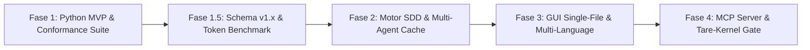

# ADR-044: North Star do tare.tools-specgraph — Plataforma Universal de Project Intelligence & Spec-Driven Development (SDD)

- **Status:** Ratificado e Consolidado pela Mesa Redonda Tripartite — Versão Canônica v003 (`CASE-2026-08-18-SPECGRAPH-NORTH-STAR-V3`)
- **Data:** 2026-08-18
- **Autores:** Antigravity Mediator (sob direcionamento do Operador Humano e consenso da Mesa Tripartite: Google Gemini, Anthropic Claude, OpenAI GPT)
- **Escopo:** `tare.tools-specgraph` (Repositório Standalone Universal)

---

## 1. Contexto e Motivação

O desenvolvimento acelerado de software por equipes humanas e swarms de agentes autônomos enfrenta um gargalo crítico de **amnésia contextual e perda de intenção**:
1. O código evolui rapidamente, mas as decisões de arquitetura e negócio (*ADRs/Specs*) se desacoplam da base de código, gerando *documentation drift*.
2. Ferramentas de busca vetorial (*RAG*) encontram similaridade estatística superficial, mas são cegas para causalidade estrutural, dependências lógicas e invariantes.
3. Indexadores estáticos (*Graphify/SCIP*) mapeiam a sintaxe do código, mas não capturam intenção de negócio nem verificam critérios de aceite.

O **`tare.tools-specgraph`** resolve essa lacuna implementando o paradigma **SDD (Spec-Driven Development)** sobre uma **Matriz Viva de Rastreabilidade Causal**:

$$\text{Requisito / Intenção} \longrightarrow \text{Design / Spec / ADR} \longrightarrow \text{Tarefa (DAG)} \longrightarrow \text{Código (AST)} \longrightarrow \text{Teste (Falsifier)} \longrightarrow \text{Evidência (Attestation)}$$

O formato canônico das especificações adota o **OpenSDD** em Markdown com frontmatter estruturado em YAML, versionado diretamente no repositório Git. Isso garante interoperabilidade universal, soberania de dados e eliminação total de dependências de plataformas ou bancos de dados centralizados proprietários.

---

### 1.2 Não-Objetivos Explícitos (Via Negativa / Fora de Escopo)
1. **Sem Banco de Dados Vetorial ou RAG Estatístico Pesado:** O SpecGraph é um analisador causal determinístico baseado em AST e grafos de dependência, não um motor de embeddings aproximados.
2. **Sem Bloqueio de Arquivos Fora de Governança:** Fixtures de teste, scripts temporários e código gerado em caminhos excluídos não exigem specs artificiais nem anotações forçadas.
3. **Sem Execução Remota Obrigatória:** O motor é estritamente *local-first*, operando 100% offline com garantias explícitas de latência e consumo de recursos.

---

## 2. Decisão Arquitetural

### A. Desacoplamento do Microkernel e Protocolo de Desempenho Local-First
* O **`tare-kernel`** é o runtime de baixo nível para sandboxing, CAS atômico e atestação criptográfica de agentes.
* O **`tare.tools-specgraph`** é uma **plataforma e biblioteca independente, modular e universal**:
  * Usável por desenvolvedores humanos via CLI (`specgraph`) e visualizador Web interativo autossuficiente;
  * Usável por agentes autônomos (Claude Code, OpenAI Codex, Cursor, Aider, Copilot) via CLI e MCP Server;
  * Compartilha **o mesmo gerador canônico de Context Envelopes** entre a CLI e o MCP Server, garantindo paridade de 100% entre a experiência do desenvolvedor (DX) e a do agente (AX).

#### Orçamento de Desempenho (Performance Budget)

| Operação | Modo / Cache | Corpus de Referência | Hardware de Linha de Base | Latência Alvo (p95) | Comportamento de Degradação |
| :--- | :--- | :--- | :--- | :--- | :--- |
| **`trace` / `explain`** | Cache Quente | Repositório até 100k LOC | 4 vCPU / 8GB RAM / NVMe | $\le 30\text{ms}$ | Degradação linear; alerta se $> 50\text{ms}$ |
| **`drift-check`** | Incremental (1–5 arquivos) | Repositório até 100k LOC | 4 vCPU / 8GB RAM / NVMe | $\le 50\text{ms}$ | Reindexação seletiva do subset AST |
| **`drift-check` / `index`** | Frio (Cold Rebuild) | 10k LOC Python | 4 vCPU / 8GB RAM / NVMe | $\le 1.2\text{s}$ ($\le 120\text{ms}$/KLOC) | Barra de progresso streaming; persistência atômica |
| **Monorepos ($>100\text{k}$ LOC)** | Cache Quente / Particionado | Monorepo de até 1M LOC | 4 vCPU / 8GB RAM / NVMe | $\le 80\text{ms}$ (por workspace) | Particionamento por workspace; modo degradado explícito |

#### Protocolo de Benchmark Normativo e Política de Concorrência
1. **Clock Scope:** O relógio de medição computa o tempo *wall-clock* completo, desde a recepção do comando/requisição até a serialização final do JSON/Envelope na saída padrão ou pipe IPC.
2. **Warm-up & Amostragem:** Medição p95 calculada sobre 100 iterações após 10 ciclos de warm-up sob o corpus de referência canonizado (`fixtures/corpus_100k`).
3. **Concorrência e Invalidação (MVCC / Read-Copy-Update):**
   - O cache em memória utiliza arquitetura *Single-Writer Multi-Reader (SWMR)* baseada em snapshots imutáveis (MVCC) com mapeamento em memória (`mmap`).
   - Leituras e `trace` concorrentes nunca sofrem bloqueio por locks de escrita.
   - Modificações em arquivos disparam invalidação seletiva atômica: o novo snapshot AST é compilado em segundo plano e comutado por ponteiro atômico sem recomputação duplicada.
4. **Política para Monorepos e Excesso de Budget:**
   - Para bases $> 100\text{k}$ LOC, o motor ativa **Particionamento por Workspace** (`workspace_roots`), restringindo o fecho aos limites do módulo ativo.
   - Quando uma consulta excede o budget estipulado, o Context Envelope anexa a flag `"degraded_mode": true` com telemetria detalhada de contenção/I/O no bloco de diagnóstico.

---

### B. Identidade Canônica de Símbolos, Namespaces e Resolução Bidirecional
Para evitar falhas de identidade, homônimos ou referências penduradas (*dangling references* após renames/moves):
1. **Namespace Canônico:** Todo símbolo no grafo possui URI determinística e unívoca no formato `rel_filepath::QualifiedSymbolName` (ex.: `src/auth/validator.py::TokenValidator.validate`).
2. **Resolução Bidirecional Estrita:**
   - **Spec $\rightarrow$ Código:** Cada entrada em `target_symbols` declarada na spec deve resolver para exatamente um nó de símbolo AST ativo dentro de `governed_paths`.
   - **Código $\rightarrow$ Spec:** Cada anotação `@spec SPEC-ID` ou mapeamento declarativo em `specgraph.yaml` deve referenciar uma spec existente e válida.
   - **Teste $\rightarrow$ Spec/Critério:** Markers `@pytest.mark.verifies("SPEC-ID", "AC-XX")` devem apontar para IDs e critérios formalmente declarados na spec de destino.
3. **Detecção Determinística de Erros:**
   - `ERR_DANGLING_SYMBOL`: O símbolo alvo foi renomeado, movido ou excluído, mas permanece listado na spec ou em `specgraph.yaml`.
   - `ERR_AMBIGUOUS_SYMBOL`: O identificador casa com múltiplos símbolos sem caminho relativo qualificado.
   - `ERR_ORPHAN_TAG`: Tag `@spec` no código referencia uma spec inexistente ou arquivada sem remapeamento.
   - `ERR_SPEC_TARGETS_UNGOVERNED`: O `target_symbols` de uma spec aponta para um símbolo localizado dentro de um `excluded_path` (conflito entre governança ativa e exclusão formal). Emite diagnóstico acionável sugerindo reajuste de fronteira ou remoção do target.

---

### C. Semântica de Borda (`governed_paths` vs `excluded_paths`) e Algoritmo Normativo de Classificação
Para eliminar divergências entre sistemas operacionais e impedir falsos bloqueios em código gerado e fixtures:

#### 1. Algoritmo Normativo de Classificação de Caminhos (Path Matching Engine)
1. **Ancoragem na Raiz:** Todo caminho $p$ é avaliado relativo à raiz canônica do repositório (`REPO_ROOT`).
2. **Pipeline de Normalização de Caminho:**
   - Normalização Unicode: Todos os caminhos e padrões são convertidos para **Unicode Normalization Form C (NFC)**.
   - Separadores de Caminho: Todos os separadores (`\` no Windows) são convertidos para barras POSIX (`/`).
   - Resolução de Redundâncias: Remoção estrita de segmentos `.` e `..` sem resolver symlinks externos (`path.normalize`).
   - Tratamento de Casing: Em sistemas de arquivos *case-insensitive* (Windows, macOS padrão), o casamento de caminhos preserva o casing de exibição, mas avalia o match em modo *case-insensitive canonical*.
3. **Gramática de Padrões (Glob Extended POSIX / `.gitignore`-compatible):**
   - Suporte formal a `**` (recursão de diretórios zero ou mais), `*` (segmento único), `?` (caractere único) e classes `[a-z]`.
   - Padrões terminados em `/` casam exclusivamente diretórios e todo o seu conteúdo descendente.
4. **Política Estrita de Symlinks:**
   - Por padrão, a governança segue política **`no-follow`** para classificação de fronteira: symlinks são classificados pela sua localização estática no repositório.
   - Quando configurado `follow_symlinks: true`, symlinks que apontam para fora do `REPO_ROOT` ou formam ciclos são rejeitados com `ERR_SYMLINK_ESCAPE`.
5. **Regra de Precedência e Desempate:**
   - A especificidade de uma regra é determinada pelo seu peso sintático: `match exato` $>$ `profundidade de segmentos fixos` $>$ `wildcard`.
   - Em caso de igualdade de especificidade, a regra de **Exclusão Explícita Prevalente (*Exclusion-Wins*)** prevalece deterministicamente:
   $$\text{is\_governed}(p) \iff \text{matches}(p, \text{governed\_paths}) \land \neg\text{matches}(p, \text{excluded\_paths})$$

#### 2. Nós `ungoverned_leaf` e Arestas Cross-Boundary
- Quando um módulo governado (`src/core/api.py`) consome um módulo excluído (`src/generated/client.py` ou dependência externa):
  - O nó de destino é inserido no grafo com a tipagem formal **`ungoverned_leaf`**;
  - O nó `ungoverned_leaf` é visível na análise de impacto (`trace`) e compõe o fecho transitivo do Context Envelope;
  - O gate de *Zero Código Órfão* **não exige spec** para nós `ungoverned_leaf`, emitindo apenas diagnóstico informativo (*info*).

---

### D. Contrato de Completude de Arestas e Resolução de Padrões Complexos
A inferência de dependências por AST expõe o grau de certeza de cada aresta e resolve construções idiomáticas complexas:

1. **Tipos de Completude de Aresta (`DEPENDS_ON_STATIC`):**
   - **`RESOLVED` (Tier 2):** Import estático direto resolvido para arquivo/símbolo conhecido.
   - **`AMBIGUOUS` (Tier 2 / Incerteza Sinalizada):** Imports condicionais (`if sys.version_info...`, `try...except ImportError`) ou star imports (`from .module import *`). Todas as ramificações conhecidas entram no grafo com flag de ambiguidade.
   - **`DYNAMIC_UNRESOLVED` (Tier 3 / Incerteza Explícita):** Chamadas a `importlib.import_module(...)`, `__import__` ou injeções dinâmicas de atributos. O nó de origem é marcado com `has_dynamic_dependencies`.

2. **Resolução de Padrões Complexos em Python:**
   - **Reexports via `__all__` e `__init__.py`:** Rastreamento determinístico da cadeia de exportação pública até a definição canônica original do símbolo.
   - **Imports Circulares Tolerados:** Resolução por detecção de Componentes Fortemente Conexos (SCC) no DAG de módulos, preservando a identidade dos nós sem loops infinitos de expansão.
   - **Lazy Imports em Funções/Métodos:** Imports definidos no corpo de funções são identificados como arestas `RESOLVED` com anotação de escopo deferred (`scope: "function_lazy"`).

3. **Comportamento dos Gates e Context Envelopes:**
   - O comando `trace` inclui arestas `AMBIGUOUS` e `DYNAMIC_UNRESOLVED` no fecho transitivo, anexando um bloco de **Avisos de Incerteza (Uncertainty Diagnostics)**.
   - Gates de liberação/merge exigem resolução ou declaração explícita em `specgraph.yaml` (`dynamic_bindings: [...]`) para suprimir incertezas críticas em módulos governados.

---

### E. Identidade Content-Addressed e Idempotência Cross-OS
Gerações do grafo são puramente content-addressed e universais:
$$\text{generation\_id} = \text{sha256}(\text{normalized\_tree\_hash} + \text{canonical\_specgraph\_digest})$$
- **Normalização Cross-OS:** Conversão mandatória de quebras de linha (`CRLF` $\rightarrow$ `LF`), normalização de separadores de caminho (`\` $\rightarrow$ `/`), codificação UTF-8 NFC e ordenação lexicográfica determinística de chaves em manifestos JSON/YAML antes do cálculo de digest.
- Reindexar a mesma árvore em Linux, macOS ou Windows produz idêntico `generation_id`.

---

### F. Trust Tiers de Evidência, Context Envelope e Hipótese de Economia de Tokens
O grafo classifica cada nó e aresta de acordo com níveis estritos de confiabilidade:
* **Tier 1 (Autoritativo):** Testes re-executados e atestados com hash verificado (`@pytest.mark.verifies`). Apenas este Tier aprova gates de merge.
* **Tier 2 (Inferência Estática Determinística):** Símbolos de código AST, arestas `RESOLVED` e mapeamentos verificados.
* **Tier 3 (Consultivo / Incerteza):** Arestas dinâmicas/ambíguas e anotações informativas de linguagem natural.

#### Hipótese de Economia de Tokens (Falsificável e Mensurável)
- **Hipótese de Eficiência:** A ingestão direcionada do Fecho Transitivo Causal reduz em $\ge 65\%$ o volume de tokens de contexto necessário para raciocínio e edição precisa de agentes em comparação com o baseline de contexto integral (Full Workspace / File Dump).
- **Métrica e Procedimento de Medição (Fase 1.5):**
  $$\text{Token Reduction Ratio} = 1 - \frac{\text{Tokens}(\text{ContextEnvelope}(\text{SPEC-ID}))}{\text{Tokens}(\text{FullGovernedWorkspace})}$$
  O benchmark calcula a contagem de tokens BPE (cl100k_base / o200k_base) sobre o corpus canônico de 100k LOC.

#### Schema do Context Envelope (v1.x com Garantia de Compatibilidade SemVer)
A evolução do schema segue versionamento semântico estrito. Adições de campos são retrocompatíveis em `v1.x`; breaking changes exigem `v2.0`.

```json
{
  "$schema": "https://tare.tools/schemas/context-envelope.v1.json",
  "schema_version": "1.0.0",
  "engine_metadata": {
    "specgraph_version": "0.1.0",
    "path_matching_engine_version": "1.0.0",
    "cache_state": "HOT",
    "benchmark_budget_met": true,
    "degraded_mode": false
  },
  "spec_id": "SPEC-042",
  "generation_id": "sha256-abc1234e5f6789...",
  "completeness": "COMPLETE",
  "transitive_closure": {
    "specs": ["SPEC-042", "SPEC-010"],
    "target_symbols": [
      {
        "symbol": "src/core/auth.py::TokenValidator.validate",
        "trust_tier": "Tier2",
        "status": "RESOLVED"
      }
    ],
    "ungoverned_leaves": ["src/generated/types.py"],
    "verifications": [
      {
        "test_symbol": "tests/test_auth.py::test_token_validity",
        "criteria": ["AC-01", "AC-02"],
        "trust_tier": "Tier1"
      }
    ]
  },
  "uncertainty_diagnostics": []
}
```

---

## 3. Roadmap de Implementação em 4 Fases



### Fase 1: Fatia Vertical Python MVP & Conformance Suite
- **Core Engine:** Parser AST nativo para Python com suporte a reexports via `__all__`, tratamento de imports circulares tolerados e lazy imports.
- **Formato de Specs:** OpenSDD em Markdown versionado no Git com frontmatter YAML (`implements`, `target_symbols`, `acceptance_criteria`).
- **CLI Básico:** `specgraph init`, `specgraph index`, `specgraph trace`, `specgraph drift-check`, `specgraph explain`.
- **Invariant Conformance Suite (Falsificadores Executáveis Normativos):**
  1. *Rename/Move Mutation Test:* Disparo imediato de `ERR_DANGLING_SYMBOL` ao mover ou renomear símbolo sem atualizar spec/mapa.
  2. *Ungoverned Target Boundary Test:* Emissão de `ERR_SPEC_TARGETS_UNGOVERNED` quando a spec tentar governar módulo excluído.
  3. *Cross-Boundary Precedence Test:* Verificação da regra *Exclusion-Wins* e tipagem `ungoverned_leaf` sem falsos bloqueios.
  4. *Cross-OS Idempotence Test:* Confirmação de idêntico `generation_id` em árvores com CRLF vs LF e casing Windows/macOS.
  5. *Latency & Concurrency Benchmark Suite:* Validação automatizada do orçamento sub-50ms sob concorrência SWMR.

### Fase 1.5: Contrato do Context Envelope v1.x e Dogfooding Antecipado
- Publicação do JSON Schema formal do Context Envelope (`v1.x`) com metadados de engine e cache.
- Disponibilização do gerador único de envelopes via comando CLI `specgraph envelope <SPEC-ID> --json`.
- Implementação do equipamento de medição da **Hipótese de Economia de Tokens** sobre o corpus de 100k LOC.

### Fase 2: Motor SDD, Detecção de Drift & Cache Concorrente
- Assistente interativo de re-binding para migração de bases legadas.
- Cache de alto desempenho com arquitetura de snapshots imutáveis (MVCC) para suportar múltiplos agentes concorrentes.
- Ingestão do acervo histórico de 82 conversas de design como camada documental consultiva (Tier 3).

### Fase 3: Visualizador Interativo Web 100% Autossuficiente & Expansão Multi-Linguagem
- **GUI Single-File HTML:** Visualizador interativo 2D/3D embutido em arquivo único, **zero dependências externas (zero CDN)**, renderização via Canvas/SVG inline e soberania offline estrita.
- Simulação interativa de análise de impacto pré-refatoração.
- Expansão de indexação via parsers Tree-sitter para TypeScript e Rust.

### Fase 4: Integração Universal de Agentes & MCP Server
- **SpecGraph MCP Server:** Endpoints nativos (`get_context_envelope`, `query_causal_graph`, `check_drift`) consumindo a mesma biblioteca central da CLI.
- Integração formal com o gate de verificação criptográfica do `tare-kernel`.

---

## 4. Consequências e Benefícios

- **Preservação Causal Estrita:** Cada linha de código governado está formalmente ligada à sua intenção, requisito e teste falsificador.
- **Transparência de Incerteza:** Agentes e humanos sabem exatamente quando uma dependência é estaticamente verificada ou dinamicamente ambígua.
- **Redução Mensurável de Contexto:** Hipótese testável de $\ge 65\%$ de economia de tokens sem perda de informação crítica no fecho causal.
- **Sem Falsos Bloqueios de Governança:** Módulos utilitários, fixtures e código gerado convivem harmoniosamente como `ungoverned_leaf`, enquanto erros de fronteira (`ERR_SPEC_TARGETS_UNGOVERNED`) são sinalizados preventivamente.
- **Desempenho Auditado e Previsível:** Operação sub-50ms no fluxo diário local com concorrência segura (MVCC) e índices determinísticos imunes a variações de SO.
