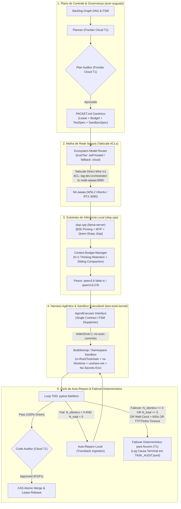
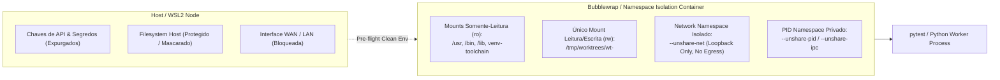

# ADR-048: Substrato de Inferência Local, Harness Agêntico e Aceleração Empírica de Hardware

- **Status:** SÍNTESE CANÔNICA PÓS-RODADA 2 / RATIFICADA PELA MESA REDONDA (`CASE-2026-08-18-LOCAL-INFERENCE-SUBSTRATE-AND-HARNESS`)
- **Data:** 2026-08-18
- **Autores:** Antigravity Mediator (Independent Synthesis & FSM Governor) sob deliberação tripartite (OpenAI Codex, Google Gemini 3.7, Anthropic Claude Fable 5) e direção de Engenharia Humana
- **Escopo:** `tare.tools.os`, `tare.tools.kernel`, `slop.cpp`, `tare.tools.local-labs` e Substrato de Execução Local

---

## 1. Contexto & Problema Arquitetural

Com a consolidação da arquitetura descentralizada do `tare.tools.os` ([ADR-044](file:///C:/projects/tare.tools.os/docs/ADR-044_SPECGRAPH_NORTH_STAR_UNIVERSAL_PROJECT_INTELLIGENCE.md) a [ADR-047](file:///C:/projects/tare.tools.os/docs/ADR-047_DIALOG_ENGINE_NORTH_STAR.md)), o ecossistema atingiu quórum formal para orquestração de DAGs, microkernel de 5 planos, inteligência de código e decomposição de jornadas.

Contudo, a materialização física das tarefas de implementação e testes exigiu o fechamento determinístico de restrições operacionais e de segurança levantadas nas Rodadas 1 e 2 de deliberação:
1. **Fronteira de Segurança e Sandboxing Executável:** O isolamento nominal por allowlist e `../` não impedia código de teste arbitrário (executado via `pytest`) de acessar processos do host, ler caminhos fora do worktree ou abrir sockets de rede (egress).
2. **Determinismo no Orçamento de Reparo ($T_2 \to T_1$):** Existia divergência entre a semântica de contagem de tentativas ($N_{\text{total}} \le 5$ vs. $N_{\text{total}} \ge 5$), arriscando uma sexta tentativa espúria e violando garantias de teto.
3. **Calibração Física de Timeouts de Inferência:** O timeout original de requisição ($> 5000\text{ms}$) colidia com o tempo físico de geração na RTX 3090 ($\sim 12\text{--}20\text{s}$ para 500 tokens), causando 100% de failover indevido.
4. **Compatibilidade Operacional do Driver Aider:** O driver Day-1 entrava em conflito com a allowlist ao disparar rotinas padrão de auto-commit (`git commit`), exigindo parametrização formal e contrato de patch cirúrgico.
5. **Telemetria de Cache, Compaction e Governança Gradual:** Reter `<think>` em excesso esgota a VRAM (24 GB), demandando $K=1$ com fallback de compactação adiada em lote, telemetria nativa rastreável de $R_{\text{cache}}$, padronização do template anti-preâmbulo (*Qwen-Sharp*) e auditoria $T_1$ obrigatória para P2 e P1.

---

## 2. Decisões Arquiteturais Sintetizadas (Objetivos In-Scope)



---

### 2.1 Harness Agêntico Canônico: Interface `AgentExecutor` e Contrato do Driver Aider
Fica ratificada a **Opção 3 em formato enxuto (Kernel Task Adapter)**, com um contrato canônico estrito e suporte imediato ao driver **Aider**:

1. **Contrato Canônico de Execução (`AgentExecutor`):**
   ```python
   from dataclasses import dataclass, field
   from pathlib import Path
   from typing import Literal, Any

   @dataclass(frozen=True)
   class TimeoutSpec:
       connection_ttft_seconds: float = 5.0      # Timeout de conexão TCP e Time-To-First-Token
       token_stall_seconds: float = 10.0         # Timeout de inatividade entre tokens no stream
       request_completion_seconds: float = 120.0 # Teto máximo por requisição HTTP completa
       wall_clock_seconds: float = 600.0         # Teto global de execução da tarefa inteira

   @dataclass(frozen=True)
   class JobSpec:
       task_id: str
       lease_id: str
       worktree_path: Path
       packet_path: Path
       allowed_commands: list[str]
       timeouts: TimeoutSpec = field(default_factory=TimeoutSpec)
       max_total_attempts: int = 5               # 1 execução inicial + até 4 reparos

   @dataclass(frozen=True)
   class JobResult:
       task_id: str
       lease_id: str
       status: Literal["SUCCESS", "REPAIRABLE_FAILURE", "EXHAUSTED_FAILOVER", "SECURITY_VIOLATION"]
       patch_diff: str
       test_stdout: str
       test_exit_code: int
       attempt_number: int                       # 1-indexed: 1 = inicial, 2..5 = reparos
       structural_error_hash: str | None
       failover_reason: Literal[
           "HASH_SATURATED",
           "ITERATION_CEILING",
           "WALL_CLOCK_TIMEOUT",
           "TTFT_TIMEOUT",
           "TOKEN_STALL_TIMEOUT",
           "REQUEST_TIMEOUT",
           "INFRA_OOM",
           "INFRA_CRASH",
           "SECURITY_VIOLATION"
       ] | None
       telemetry: dict[str, Any]                 # cached_tokens, prompt_eval_time_ms, r_cache
   ```

2. **Parametrização do Driver Aider (Day-1 Canonical Driver):**
   - O `AiderDriver` é instanciado em modo headless e não-interativo com isolamento de commits:
     ```bash
     aider --architect \
           --no-auto-commits \
           --no-git-attribute-author \
           --no-suggest-shell-commands \
           --test "pytest"
     ```
   - O patch resultante é extraído cirurgicamente via `git diff` no worktree descartável.
   - O runner nativo ultraleve (`NativeRunner`) permanece postergado até que benchmarks empíricos justifiquem sua introdução.

3. **Ciclo de Vida de Worktree e Lease:**
   - O `tare.tools.kernel` mantém posse exclusiva da lease da tarefa.
   - Cada tarefa é executada em um `git worktree` efêmero (`/tmp/worktrees/wt-<task_id>`), destruído atomicamente ao término ou failover.
   - Todo sucesso local (`pytest` 100% verde) exige envio do `patch_diff` para o *Code Auditor* ($T_1$) antes de qualquer mesclagem.

---

### 2.2 Fronteira de Sandboxing Executável e Contenção de Segurança

Para mitigar a vulnerabilidade onde testes arbitrários invocam comandos de sistema ou exfiltram dados ([ISS-OPENAI-R2-01]), a execução adota um **Sandbox de Contenção de Três Camadas**:



1. **Executor de Sandbox Obrigatório (`BubblewrapExecutor` / `NamespaceExecutor`):**
   - **Isolamento de Filesystem:** O único ponto de montagem com permissão de escrita (`rw`) é o diretório do `worktree` efêmero. A raiz do sistema, toolchain Python, bibliotecas e binários autorizados são montados como estritamente somente-leitura (`ro`). Diretórios de usuários (`/home`, `/root`), credenciais (`~/.ssh`, `~/.aws`) e `/tmp` do host são mascarados via `tmpfs` isolado ou ocultados.
   - **Isolamento de Processos (PID/IPC):** Execução em namespaces dedicados (`--unshare-pid`, `--unshare-ipc`), impedindo inspeção ou sinalização de processos do host.
   - **Isolamento de Rede (*Strict No-Egress*):** Execução sob namespace de rede desvinculado (`--unshare-net`). Toda tentativa de abrir socket externo (TCP/UDP para WAN/LAN) é negada no nível do kernel (`Network is unreachable`). Comunicações com o `slop.cpp` ocorrem exclusivamente pelo harness orquestrador no plano de controle do nó, fora da sandbox dos testes.

2. **Sanitização de Ambiente (*Pre-Flight Linter*):**
   - O `tare.tools.kernel` executa varredura estática de pre-flight garantindo que nenhuma variável de ambiente contendo credenciais (`ANTHROPIC_API_KEY`, `OPENAI_API_KEY`, `GEMINI_API_KEY`, `AWS_*`, `GITHUB_TOKEN`) seja propagada para o subprocesso do Aider ou da sandbox.

3. **Allowlist Estrita de Comandos e Trilha de Auditoria:**
   - Comandos autorizados no runner: `git diff`, `git apply`, `git status`, `git add`, `pytest`, `python -m unittest`, `ruff`, `mypy`.
   - Invocação de comandos fora da allowlist aborta com `SECURITY_VIOLATION`.
   - **Suíte de Testes Negativos Obrigatória (`tests/security/test_sandbox_negative.py`):**
     - *Leitura externa:* Tentativa de leitura de caminhos fora do worktree (`/etc/shadow`, `~/.bashrc`) falha com `PermissionError` / `FileNotFoundError`.
     - *Escrita externa:* Tentativa de criar arquivos fora do worktree falha com `ReadOnlyFileSystemError`.
     - *Egress:* Tentativa de conexão via `socket.create_connection` ou `urllib` dispara `OSError: Network unreachable`.

---

### 2.3 Política de Contexto, Thinking Retention & Telemetria Real de KV-Cache

1. **Política de Orçamento de Contexto e Compactação de `<think>`:**
   - **Retenção Deslizante ($K=1$):** O bloco `<think>` completo é preservado estritamente para o turno anterior imediato.
   - **Compactação Adiada em Lotes (*Batch Deferred Compaction*):** Para preservar a invariante $R_{\text{cache}} \ge 0.90$ mesmo em gerações de raciocínio extensas ($> 2000$ tokens), a compactação de blocos históricos ($> K$) é aplicada de forma determinística na fronteira dos turnos, mantendo o ponto de mutação o mais próximo possível da cauda do prompt.
   - **Teto Rígido de Contexto:** $18.000$ tokens no total.

2. **Adaptador de Telemetria de Cache (`LocalLabsTelemetryAdapter`):**
   - Implementado no `tare.tools.local-labs`, consumindo os dados nativos do `slop.cpp`:
     $$R_{\text{cache}} = \frac{\text{usage.prompt_tokens_details.cached\_tokens}}{\text{usage.prompt\_tokens}}$$
   - Caso o servidor local não forneça `cached_tokens`, a telemetria afere a derivada de `prompt_eval_time_ms`. A ausência de métrica mensurável reprova a qualificação do nó no Gate 1.
   - **Benchmark Versionado:** Validação obrigatória contra `tests/fixtures/cache_benchmark_v1.json` (20 sessões canônicas de refatoração multi-turno).

3. **Especificação do Template Anti-Preâmbulo (*Qwen-Sharp*):**
   - O arquivo canônico `chat_template.jinja` injetado no `slop.cpp` formata as mensagens do sistema e do usuário suprimindo preâmbulos conversacionais ("Com certeza!", "Aqui está o diff:") e forçando blocos de diff estruturados em conformidade com o parser do Aider:
     ```jinja
     
     {{ '<|im_start|>system\n' + messages[0]['content'] + '<|im_end|>\n' }}
     
     {# Injeção de restrição estrutural anti-preamble #}
     {{ '<|im_start|>system\n[CRITICAL: Emit strictly raw code diffs or direct test code. No introductory remarks.]<|im_end|>\n' }}
     ```

---

### 2.4 Orçamento de Auto-Reparo e Protocolo Determinístico de Failover ($T_2 \to T_1$)

1. **Semântica Unificada de Contagem de Tentativas:**
   - Define-se $N_{\text{total}}$ como o número absoluto de execuções de teste na sub-tarefa ($1 \le N_{\text{total}} \le 5$):
     - $N_{\text{total}} = 1$: Execução inicial do pacote.
     - $N_{\text{total}} = 2, 3, 4, 5$: Tentativas de auto-reparo 1 a 4.
   - **Teto Inviolável:** Se a tentativa $N_{\text{total}} = 5$ falhar, a FSM transiciona **imediatamente** para `EXHAUSTED_FAILOVER`. Nenhuma 6ª execução é permitida.

2. **Assinatura Operacional de Erro Estrutural:**
   $$\text{StructuralErrorHash} = \text{SHA256}(\text{ExceptionType} + \text{FailingTestName} + \text{TopTracebackFrameFileAndLine})$$

3. **Hierarquia e Calibração Física de Timeouts:**
   - **Connection / TTFT Timeout:** $5.000\text{ms}$ ($5\text{s}$). Aplica-se exclusivamente à conexão TCP inicial e ao recebimento do primeiro chunk/token de streaming.
   - **Token Stall Timeout:** $10.000\text{ms}$ ($10\text{s}$) de intervalo máximo entre tokens sucessivos no stream.
   - **Request Completion Timeout:** $\min(120\text{s}, \text{tempo restante do wall-clock})$.
   - **Wall-Clock Global da Tarefa:** $600\text{s}$ ($10\text{ minutos}$).

4. **Condições de Disparo de Failover:**
   O worker local aborta e transiciona para `EXHAUSTED_FAILOVER` ($T_2 \to T_1$) se:
   - **Saturação de Hash:** $N_{\text{identico}} \ge 3$ erros estruturais consecutivos com o mesmo `StructuralErrorHash`.
   - **Teto Absoluto:** Falha no teste na iteração $N_{\text{total}} = 5$.
   - **Wall-Clock Excedido:** Tempo acumulado $> 600\text{s}$.
   - **Falha Crítica de Infraestrutura:** VRAM OOM, crash do processo `slop.cpp`, TTFT $> 5\text{s}$, ou stall de geração $> 10\text{s}$.

5. **Registro Estruturado de Causa Terminal:**
   Toda transição de failover grava em `TASK_AUDIT.jsonl` a causa raiz específica (`failover_reason`), alimentando a calibração empírica dos orçamentos da DAG.

---

### 2.5 Malha de Rede e Política de Acesso Tailscale (ACLs)

1. **Topologia e Conectividade Segura:**
   - O servidor `slop.cpp` no nó `aaaaa` escuta na interface de rede Tailscale.
   - **Regra de ACL Restrita:** Tráfego TCP na porta `8080` é restrito estritamente a nós portadores da tag `tag:dev-orchestrator` (`acer-augusto`).
2. **Keyless Hosts Controlado:**
   - Argumento `--keyless-hosts` do `llama-server` autoriza unicamente o IP Tailscale do orquestrador e o endereço de loopback `127.0.0.1`.

---

### 2.6 Modelo Econômico e Promoção Progressiva por Fatias de Risco

1. **Divisão de Responsabilidade Cognitiva:**
   - **Camada 1 ($T_1$ — Frontier Cloud / Pago):** Planejamento de épicos, compilação de `PACKET.md`, deliberações tripartite e **Auditoria Final de Código (obrigatória para todas as classes)**.
   - **Camada 2 ($T_2$ — Substrato Local `aaaaa` / Custo Zero):** Geração de código, TDD, auto-reparo em sandbox e indexação de AST.

2. **Esteira Canônica de Promoção:**

| Estágio | Classe de Tarefa | Blast Radius | Critérios de Qualificação & Governança |
| :--- | :--- | :--- | :--- |
| **Estágio 1: Qualificação** | Fixtures sintéticas e suites do `local-labs` | Zero (Sandbox) | Aprovação nos Gates 1, 2 e 3 com paridade determinística ($\Delta = 0.00$) e $R_{\text{cache}} \ge 0.90$ no benchmark `cache_benchmark_v1.json`. |
| **Estágio 2: Operação P2** | Tarefas P2 (Docs, refatoração interna, testes, AST) | Baixo | Execução no nó local; auditoria $T_1$ obrigatória antes do merge; taxa de aprovação $\ge 85\%$ em janela móvel de 20 tarefas. |
| **Estágio 3: Operação P1** | Tarefas P1 (Lógica de negócio central do kernel/engine) | Médio/Alto | Habilitado apenas após o modelo consolidar o Estágio 2, manter taxa de failover $< 15\%$ e **comprovar auditoria $T_1$ pré-merge em 100% dos pacotes**. |

---

## 3. Não-Objetivos Explícitos (Via Negativa & Fronteiras Arquiteturais)

1. **Sem Treinamento Fundacional no Nó Local:** O hardware local é dedicado à inferência, quantização e validação empírica de modelos.
2. **Sem Substituição da Mesa Redonda por Modelos Locais:** Sínteses estratégicas e deliberações de governança permanecem sob responsabilidade exclusiva de modelos de fronteira ($T_1$).
3. **Sem Auto-Aprovação Local (*Zero Self-Auditing Inviolável*):** Nenhum código gerado localmente é mesclado sem passar pela suíte de testes em sandbox e pela aprovação formal do *Code Auditor* ($T_1$).
4. **Sem Egress de Rede dentro da Sandbox:** Subprocessos de teste não têm autorização de acesso à internet ou à LAN.
5. **Sem Portas Abertas na WAN:** Proibida exposição de portas de inferência fora do túnel Tailscale com ACLs ativas.

---

## 4. Matriz de Falsificação & Invariantes de Execução

| Invariante / Requisito | Mecanismo de Verificação | Falsificador / Critério de Rejeição | Módulo Responsável |
| :--- | :--- | :--- | :--- |
| **`REQ-LOC-01`: Contenção & Sandbox Isolation** | Suíte de testes negativos (`test_sandbox_negative.py`) | Código de teste lê caminho fora do worktree, escreve no host ou abre socket de rede | `tare.tools.kernel / sandbox` |
| **`REQ-LOC-02`: Zero Secret Leakage** | Varredura estática de pre-flight no environment | Subprocesso do Aider/sandbox contém chaves de API (`ANTHROPIC`, `OPENAI`, `GEMINI`, etc.) | `tare.tools.kernel / env` |
| **`REQ-LOC-03`: Prefix Cache Reuse** | Telemetria de tokens de prompt no `slop.cpp` via adaptador | Taxa $R_{\text{cache}} < 0.90$ em turnos subsequentes no benchmark `cache_benchmark_v1.json` | `tare.tools.local-labs / collectors` |
| **`REQ-LOC-04`: Failover Determinístico & Teto de Tentativas** | Execução de testes de estresse com injeção de falhas sintéticas | Worker executa 6ª tentativa ($N_{\text{total}} > 5$), não aborta com $N_{\text{identico}} = 3$, ou excede $600\text{s}$ | `tare.tools.kernel / fsm` |
| **`REQ-LOC-05`: Calibração Física de Timeouts** | Injeção de latência controlada no mock de inferência | TTFT $> 5\text{s}$ não dispara failover, ou geração normal de 15s dispara failover espúrio | `tare.tools.kernel / transport` |
| **`REQ-LOC-06`: Driver Compatibility & Auto-Commit** | Execução de ponta a ponta do `AiderDriver` em worktree limpo | Aider executa comando fora da allowlist ou falha por bloqueio de auto-commit | `tare.tools.kernel / driver` |
| **`REQ-LOC-07`: Anti-Preamble Compliance** | Validação de schema na saída gerada pelo template *Qwen-Sharp* | Resposta do modelo contém preâmbulos conversacionais antes do bloco de diff | `slop.cpp / chat_template.jinja` |
| **`REQ-LOC-08`: Limite de Contexto & Compaction** | Verificador de tamanho de contexto no Kernel Adapter | Prompt ultrapassa $18.000$ tokens ou mantém múltiplos blocos `<think>` não compactados | `tare.tools.kernel / context` |

---

## 5. Resolução Formal dos Problemas das Rodadas 1 e 2

1. **Resolução de Sandbox e Contenção ([ISS-OPENAI-R2-01]):** Implementação de sandbox obrigatório baseado em namespaces/bubblewrap com montagens de sistema em `ro`, worktree isolado como único ponto de `rw`, `--unshare-net` (egress zero) e suíte de testes negativos automatizada.
2. **Resolução de Contagem e Teto de Reparos ([ISS-OPENAI-R2-02]):** Semântica unificada onde $N_{\text{total}}$ representa o total de execuções ($1$ inicial $+ 4$ reparos $= 5$ no máximo). Falha na 5ª execução transiciona deterministicamente para `EXHAUSTED_FAILOVER` sem autorizar uma 6ª tentativa.
3. **Resolução de Timeouts de Inferência ([ISS-ANTHROPIC-R2-01]):** Separação formal entre TTFT / conexão ($\le 5\text{s}$), stall entre tokens ($\le 10\text{s}$), teto por requisição ($\le 120\text{s}$) e wall-clock global ($\le 600\text{s}$), eliminando falsos positivos na RTX 3090.
4. **Resolução de Driver e Allowlist ([ISS-ANTHROPIC-R2-02]):** Configuração explícita do Aider com flags `--no-auto-commits` e extração de patch via `git diff`, alinhando a allowlist de comandos seguros com a execução em worktrees efêmeros.
5. **Integração das Recomendações dos Assentos:**
   - *Google:* Adaptador de telemetria nativo em `tare.tools.local-labs`, linter estático de pre-flight contra vazamento de chaves e consolidação do benchmark `cache_benchmark_v1.json`.
   - *OpenAI:* Métrica de cache obrigatória para qualificação no Gate 1 e auditoria $T_1$ formalmente exigida para tarefas P1 antes do merge.
   - *Anthropic:* Compactação adiada em lote para blocos longos de raciocínio, formalização do `chat_template.jinja` (*Qwen-Sharp*) e telemetria de causa terminal em `TASK_AUDIT.jsonl`.
