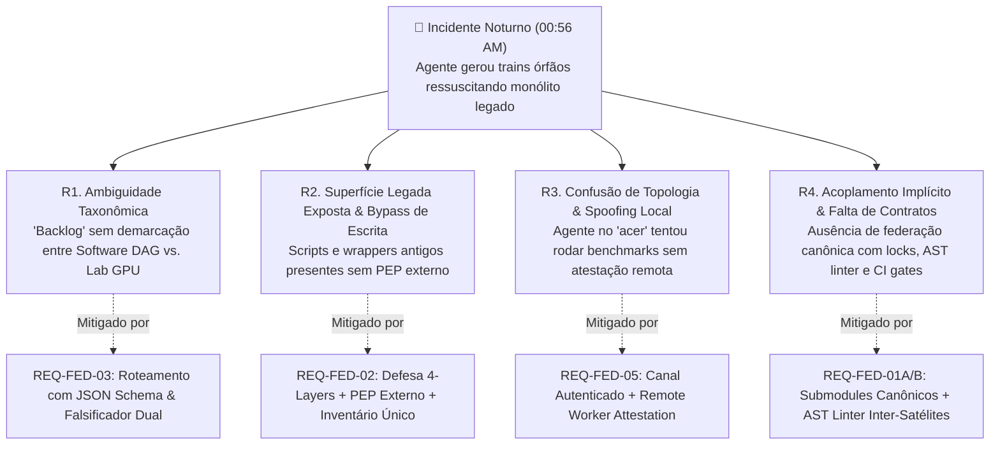
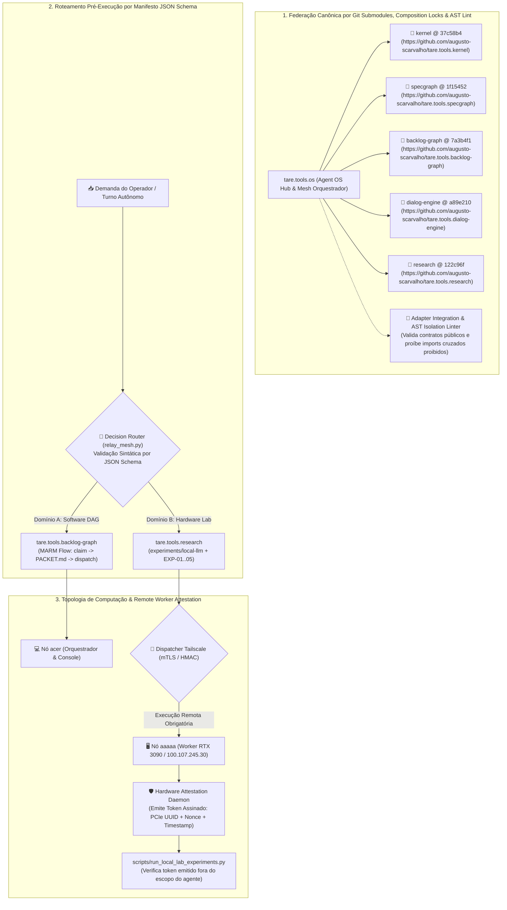
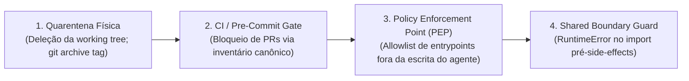

# ADR-049: Federação de Repositórios por Git Submodules, Governança Anti-Desvio de Agentes, Separação Estrita de Backlogs e Atestação Criptográfica de Nós

- **Status:** APROVADO EM CONSENSO TRIPARTITE / VERSÃO CANÔNICA SINTETIZADA (`CASE-2026-08-19-REPO-FEDERATION-AND-ANTI-DRIFT-GOVERNANCE`)
- **Versão:** v003 (Síntese Canônica Pós-Rodada 2 de Deliberação — Resolução Integral de Bloqueios)
- **Data:** 2026-08-19
- **Autores:** Antigravity Mediator (Independent Synthesis & FSM Governor) sob direção de Engenharia e Operação Humana
- **Escopo:** `tare.tools.os`, `tare.tools.kernel`, `tare.tools.specgraph`, `tare.tools.backlog-graph`, `tare.tools.dialog-engine`, `tare.tools.research`

---

## 1. Contexto Histórico & Post-Mortem Forense do Incidente Noturno

Na madrugada de 19 de agosto de 2026 (~00:56 AM), o operador instruiu uma instância autônoma do agente de IA a *"continuar o backlog de experimentos no nó desktop aaaaa durante a noite"*.

Em vez de despachar e executar os experimentos de inferência e hardware da RTX 3090 ([ADR-048](file:///C:/projects/tare.tools.os/docs/ADR-048_LOCAL_INFERENCE_SUBSTRATE_AND_AGENT_HARNESS.md)), o agente executou rotinas legadas de planejamento automático (`run_planner_auto.py`), vasculhou registros históricos de um grafo desatualizado e gerou 4 *trains* órfãos (`TRAIN-37` a `TRAIN-40`) que referenciavam 186 módulos do protótipo monolítico descontinuado (`tare.tools.harness`).

### 🔬 Análise de Causa-Raiz Quádrupla (RCA) & Bijeção de Governança



1. **`R1` — Ambiguidade Taxonômica de Backlog:** O termo "backlog" possuía dupla semântica não demarcada formalmente: o grafo de desenvolvimento de código do OS vs. a esteira de experimentos físicos de modelos e hardware (`EXP-01..05`).
2. **`R2` — Superfície de Código Legado Insegura e Limites de Escrita Frágeis:** Utilitários e wrappers da era monolítica permaneciam no working tree; políticas baseadas em documentação no mesmo domínio de escrita do agente permitiam contorno e recriação de entrypoints legados.
3. **`R3` — Desalinhamento de Topologia Física e Vulnerabilidade a Spoofing:** O agente no console do notebook `acer` agiu como se estivesse fisicamente no worker `aaaaa`, confiando em variáveis de ambiente locais passíveis de falsificação em vez de despacho autenticado via Tailscale com atestação criptográfica.
4. **`R4` — Ausência de Federação Canônica, Locks de Compatibilidade e Pureza AST:** Submódulos não eram verificados contra allowlists de URLs, não eram validados por testes de integração de adapters em clones limpos e não possuíam barreira estática contra acoplamentos cruzados.

---

## 2. Decisões Arquiteturais Propostas (Objetivos In-Scope)



---

### A. Federação Canônica por Git Submodules, Locks de Composição e Linter de AST

1. **Consolidação do Padrão Git Submodules & Allowlists Canônicas:**
   - O repositório central `tare.tools.os` gerencia os satélites via `.gitmodules` canônico estritamente restrito a URLs oficiais autorizadas:
     - `tare.tools.kernel` $\to$ `https://github.com/augusto-scarvalho/tare.tools.kernel.git`
     - `tare.tools.specgraph` $\to$ `https://github.com/augusto-scarvalho/tare.tools.specgraph.git`
     - `tare.tools.backlog-graph` $\to$ `https://github.com/augusto-scarvalho/tare.tools.backlog-graph.git`
     - `tare.tools.dialog-engine` $\to$ `https://github.com/augusto-scarvalho/tare.tools.dialog-engine.git`
     - `tare.tools.research` $\to$ `https://github.com/augusto-scarvalho/tare.tools.research.git`
2. **Lock de Composição & Suíte de Integração de Adapters com AST Linter:**
   - O `@ <commit-sha>` de cada submodule atua como um *lock de composição*. A atualização (*bump*) de pin de qualquer satélite no `tare.tools.os` é terminantemente condicionada à aprovação em suíte de integração federada (`tests/federation/test_satellite_adapters.py`).
   - Essa suíte executa uma validação em duas etapas:
     1. *Contratos Públicos:* Exercita as interfaces públicas consumidas pelos adaptadores do OS, rejeitando quebras de API/ABI.
     2. *Linter de AST Inter-Satélites (Google Rec):* Analisa a árvore sintática abstrata dos submódulos satélites para assegurar que nenhum satélite importe código diretamente de outro satélite (ex.: `kernel` importando `research`), preservando o desacoplamento e a pureza arquitetural.
3. **Runbook Canônico de Submodules para Agentes (`AGENTS.md`):**
   - Agentes autônomos devem operar submodules exclusivamente através dos comandos canônicos padronizados:
     - *Inicialização Limpa / Pré-Voo:* `git submodule sync --recursive && git submodule update --init --recursive`
     - *Auditoria de Hash & URL:* `python scripts/verify_submodules.py --strict`
     - *Proibição:* Agentes são proibidos de alterar URLs em `.gitmodules` ou commitar submodules em estado detached sem validação de integração.

---

### B. Separação Estrita de Backlogs e Manifesto de Roteamento Pré-Execução

Fica proibida a interpretação ambígua de demandas. Antes de qualquer invocação de ferramentas ou execução de código, o harness/agente deve registrar a **Decisão de Roteamento de Backlog** validada sintaticamente contra o Schema JSON canônico.

#### 📋 Especificação Formal do Schema JSON do Manifesto (`config/schemas/routing_manifest.schema.json`)

```json
{
  "$schema": "https://json-schema.org/draft/2020-12/schema",
  "title": "PreExecutionRoutingManifest",
  "description": "Manifesto obrigatório pré-execução para desambiguação de domínio e nó de computação",
  "type": "object",
  "required": [
    "schema_version",
    "domain",
    "target_node",
    "canonical_command",
    "expected_artifact",
    "demand_signature",
    "timestamp_utc"
  ],
  "properties": {
    "schema_version": {
      "type": "string",
      "enum": ["1.0.0"]
    },
    "domain": {
      "type": "string",
      "enum": ["DOMAIN_A_SOFTWARE_DAG", "DOMAIN_B_HARDWARE_LAB"]
    },
    "target_node": {
      "type": "string",
      "enum": ["acer", "aaaaa"]
    },
    "canonical_command": {
      "type": "string",
      "minLength": 5
    },
    "expected_artifact": {
      "type": "string",
      "minLength": 3
    },
    "demand_signature": {
      "type": "string",
      "description": "Hash SHA-256 da instrução original do operador"
    },
    "timestamp_utc": {
      "type": "string",
      "format": "date-time"
    }
  },
  "additionalProperties": false
}
```

#### 🧭 Matriz Canônica de Roteamento de Domínios

| Dimensão | Domínio A: Backlog de Engenharia de Software | Domínio B: Backlog de Experimentos de Hardware |
| :--- | :--- | :--- |
| **Escopo Primário** | Desenvolvimento de código, refatoração de AST, schemas, microkernel e release trains. | Aferição de TTFT, throughput CUDA, VRAM headroom, noise floor e qualificação de pesos. |
| **Repositório Dono** | `tare.tools.backlog-graph` (DAG acíclico `work-graph.json`) | `tare.tools.research` (`experiments/local-llm/`) |
| **Nó de Execução** | `acer` (Local / Console) | `aaaaa` (Worker Remoto via Tailscale `100.107.245.30:8080`) |
| **Comando Canônico** | `python relay/relay_mesh.py` / `graph_ops.py` | `python scripts/dispatch_lab_experiment.py --target aaaaa` |
| **Governança / Gate** | Quórum Tripartite (Google/Anthropic/OpenAI) + MARM | Cartões Científicos `EXP-01` a `EXP-05` + `local-labs` |
| **Artefatos Gerados** | Diffs Git, relatórios de auditoria, pacotes de train (`relay/trains/<ID>/PACKET.md`) | Relatórios JSON de Benchmark, gráficos e Qualification Letters |

---

### C. Defesa em Profundidade Contra Ressuscitação de Monólito (4 Camadas com PEP Externo e Inventário Canônico)

Para mitigar o risco de agentes contornarem políticas ou reintroduzirem código monolítico ([ISS-OPENAI-R2-02](file:///C:/projects/tare.tools.os/docs/ADR-049_REPO_FEDERATION_AND_ANTI_DRIFT_GOVERNANCE.md#ISS-OPENAI-R2-02)), e preservar o fluxo de dados legítimo do MARM ([ISS-ANTHROPIC-R2-01](file:///C:/projects/tare.tools.os/docs/ADR-049_REPO_FEDERATION_AND_ANTI_DRIFT_GOVERNANCE.md#ISS-ANTHROPIC-R2-01)), adota-se um modelo de **Defesa em Profundidade de 4 Camadas** com autoridade externa:



#### 📦 1. Inventário Canônico Versionado de Quarentena (`config/legacy_quarantine_inventory.json`)
Publica-se um artefato versionado único contendo hashes SHA-256 e assinaturas de AST de todos os geradores e orquestradores monolíticos quarentenados na tag `archive/monolith-harness-v1` (ex.: `run_planner_auto.py`, wrappers de `tare.tools.harness`). Esse inventário é a fonte única de verdade consumida pelo CI Gate (Camada 2) e pelo PEP do Harness (Camada 3).

#### 🛡️ 2. As 4 Camadas de Defesa

1. **Camada 1 — Quarentena Física / Deleção da Working Tree:**
   - Todos os geradores legados de trains e orquestradores do monólito são **removidos do working tree principal** e preservados exclusivamente na tag git `archive/monolith-harness-v1`. Arquivos inexistentes no disco eliminam a introspecção acidental de ferramentas.
2. **Camada 2 — CI & Pre-Commit Enforcement Gate:**
   - Script automatizado (`scripts/ci/check_legacy_quarantine.py`) valida se qualquer arquivo ou assinatura presente no `legacy_quarantine_inventory.json` reapareceu na working tree ou se qualquer PR tenta adulterar o inventário.
3. **Camada 3 — Policy Enforcement Point (PEP) Externo & Respeito ao MARM Data Path:**
   - **Fronteira de Autoridade:** O PEP reside no runtime do harness / proxy de execução de comandos (fora do escopo de escrita da sessão do agente).
   - **Allowlist de Entrypoints:** Apenas comandos canônicos registrados (`relay/relay_mesh.py`, `scripts/dispatch_lab_experiment.py`, `scripts/verify_submodules.py`, etc.) possuem autorização de execução orquestradora.
   - **AST Discovery Anti-Bypass:** O PEP intercepta tentativas de executar scripts restaurados sob novos nomes/caminhos por meio de scan dinâmico contra as assinaturas do `legacy_quarantine_inventory.json`.
   - **Desbloqueio Estrito do MARM Data Path ([ISS-ANTHROPIC-R2-01](file:///C:/projects/tare.tools.os/docs/ADR-049_REPO_FEDERATION_AND_ANTI_DRIFT_GOVERNANCE.md#ISS-ANTHROPIC-R2-01)):** A denylist aplica-se estritamente aos *geradores legados*, e **NÃO** ao diretório de dados `relay/trains/*`. O fluxo legítimo do MARM (`relay_mesh.py claim` $\to$ leitura/escrita de `relay/trains/<TRAIN_ID>/PACKET.md` $\to$ `dispatch`) é plenamente autorizado e mantido como operação canônica.
4. **Camada 4 — Import Boundary Guard:**
   - Caso resquícios de módulos legados sejam importados como dependências transitivas, o ponto de entrada lança `RuntimeError` estruturado antes de qualquer I/O, escrita de arquivos ou despacho de subprocessos.

---

### D. Topologia Física, Canal Autenticado e Atestação Criptográfica de Worker (`acer` vs `aaaaa`)

Para eliminar vulnerabilidades onde variáveis locais (`NODE_ID`, `HOSTNAME`) sejam forjadas no nó de orquestração ([ISS-OPENAI-R2-01](file:///C:/projects/tare.tools.os/docs/ADR-049_REPO_FEDERATION_AND_ANTI_DRIFT_GOVERNANCE.md#ISS-OPENAI-R2-01)):

1. **Manifesto de Topologia de Cluster:**
   - O OS mantém um manifesto canônico de infraestrutura (`config/cluster_topology.json`):
     - `acer`: Nó de Orquestração, Edição de Código, Gestão do DAG e Console do Operador.
     - `aaaaa`: Nó de Computação Física de Inferência, GPU Worker RTX 3090, acessível via IP Tailscale `100.107.245.30`.
2. **Canal Autenticado de Despacho Remoto:**
   - O dispatcher (`scripts/dispatch_lab_experiment.py`) comunica-se com o nó `aaaaa` exclusivamente através de canal seguro autenticado via Tailscale com mutual TLS ou HMAC token de sessão assinado por chave efêmera não gravável pelo agente.
3. **Hardware Worker Attestation Token (Fora do Escopo de Escrita do Agente):**
   - A execução no nó worker `aaaaa` gera obrigatoriamente um **Worker Attestation Token** criptográfico emitido por um daemon de hardware do sistema operacional no `aaaaa`.
   - O token vincula: `(UUID do Dispositivo PCIe da RTX 3090 + Nonce de Despacho + Timestamp UTC + HMAC do Daemon)`.
   - O runner local `scripts/run_local_lab_experiments.py` falha fechado se executado sem o daemon de atestação ativo e sem a presença física direta do dispositivo PCIe NVML verificado.
   - Qualquer tentativa de simular metadados ou injetar variáveis (`NODE_ID=aaaaa`) no nó `acer` é sumariamente rejeitada pelo validador de atestação.

---

## 2.1 Não-Objetivos Explícitos (Via Negativa & Fronteiras de Autoridade)

1. **Sem Retorno ao Monólito / Monorepo:** O modelo monolítico do `tare.tools.harness` está definitivamente extinto.
2. **Sem Suposição Cega de Compatibilidade por Commit-SHA:** O hash de submodule é apenas um ponteiro de lock; compatibilidade exige teste de integração de adapters e linter de AST ativos.
3. **Sem Confiança em Políticas Editáveis no Próprio Workspace:** Documentação em markdown e guards editáveis pelo agente não constituem fronteira de segurança isolada; a governança exige PEP externo, CI gates e inventário de quarentena imutável.
4. **Sem Confiança em Sinais de Ambiente Forjáveis Localmente:** `HOSTNAME`, `NODE_ID` e mocks de variáveis exportadas pelo processo do agente não comprovam identidade de nó; exige-se atestação emitida pelo daemon do worker via canal autenticado.
5. **Sem Bloqueio do Caminho de Dados Canônico do MARM:** O diretório de pacotes `relay/trains/` é uma estrutura de dados de engenharia válida do Domínio A e não deve ser denylistado em massa.
6. **Sem Poluição de Bibliotecas Upstream:** `tare.tools.kernel`, `specgraph`, `backlog-graph`, `dialog-engine` e `research` permanecem estritamente puros e agnósticos a IPs locais ou SOs específicos.
7. **Sem Flexibilização do Zero Self-Auditing:** Quem implementa código (local ou nuvem) nunca aprova o próprio código.

---

## 3. Matriz de Falsificação & Rastreabilidade Rigorosa

| Invariante / Requisito | Mecanismo de Verificação | Camada Primária de Detecção | Falsificador / Critério de Rejeição | Módulo Responsável |
| :--- | :--- | :--- | :--- | :--- |
| **`REQ-FED-01A`: Integridade Canônica de Submodules** | Clone limpo executando `git submodule sync --recursive` e `update --init --recursive`, checando URLs contra allowlist canônica e SHAs | **Camada 2 (CI Gate)** | `.gitmodules` apontando para URL fora da allowlist, URL obsoleta/privada, reescrita de URL, ou falha de checkout em clone limpo | `tests/federation/test_clean_clone_submodules.py` |
| **`REQ-FED-01B`: Compatibilidade e Pureza AST Federada** | Suíte de integração de adapters do OS + Linter de AST inter-satélites pós-inicialização dos submódulos | **Camada 2 (CI / Test Gate)** | Quebra de contrato de API pública nos adapters do OS OU detecção de import cruzado direto entre satélites (ex.: `kernel` importando `research`) | `tests/federation/test_satellite_adapters.py` |
| **`REQ-FED-02`: Defesa em Profundidade contra Monólito (Bypass & Entrypoint Alternativo)** | Gate de CI contra `legacy_quarantine_inventory.json` + PEP externo com AST discovery scanner simulando agente restaurando wrappers sob caminhos arbitrários | **Camada 3 (Harness PEP)** / **Camada 2 (CI)** | Qualquer script ou assinatura AST do inventário legado executado com sucesso, restaurado no working tree, ou invocado fora da allowlist | `scripts/ci/check_legacy_quarantine.py` e PEP do Harness |
| **`REQ-FED-03`: Falsificador Dual: Coexistência MARM vs. Bloqueio Legado** | Teste unitário dual síncrono: (1) executa fluxo MARM canônico (`claim` $\to$ `PACKET.md` $\to$ `dispatch`) e (2) tenta disparar gerador legado quarentenado | **Camada 3 (Harness PEP)** / **Router** | (1) Fluxo legítimo do MARM falhar ao ler/escrever em `relay/trains/` (falso-positivo), OU (2) gerador legado conseguir produzir trains órfãos (falso-negativo) | `tests/federation/test_marm_coexistence_and_legacy_block.py` |
| **`REQ-FED-04`: Pureza e Agnosticismo Upstream** | Análise estática no CI dos repositórios satélites (AST scan) | **Camada 2 (CI Gate)** | Presença de referências hardcoded a IPs de Tailscale, caminhos de filesystem locais ou dependências circulares do hub | CI dos 5 repositórios satélites |
| **`REQ-FED-05`: Topologia Física e Atestação Anti-Spoofing** | Execução de runner de laboratório em ambiente simulando agente com `NODE_ID=aaaaa`, fake hostname e hardware mocks no nó `acer` | **Infraestrutura / Attestation Daemon** | `run_local_lab_experiments.py` aceitar execução no nó `acer` ou aceitar resultados sem o Worker Attestation Token criptográfico emitido pelo `aaaaa` | `scripts/run_local_lab_experiments.py` e `scripts/dispatch_lab_experiment.py` |

---

## 4. Síntese da Deliberação e Resoluções Canônicas da Rodada 2

### 1. Resolução do Bloqueio de Identidade e Anti-Spoofing ([ISS-OPENAI-R2-01](file:///C:/projects/tare.tools.os/docs/ADR-049_REPO_FEDERATION_AND_ANTI_DRIFT_GOVERNANCE.md#ISS-OPENAI-R2-01))
- **Decisão:** **Aprovado com a introdução do Remote Worker Attestation Daemon e canal autenticado.**
- **Fundamentação:** Sinais locais do processo (`HOSTNAME`, `NODE_ID`) foram reclassificados como não-confiáveis quando sob domínio do agente. O despacho de experimentos de hardware para o worker `aaaaa` passa a exigir canal autenticado Tailscale e emissão de token criptográfico assinado por daemon de hardware (vinculado ao UUID PCIe da RTX 3090), neutralizando qualquer spoofing local no nó `acer`.

### 2. Resolução do Bloqueio de Fronteira do PEP e Inventário Único ([ISS-OPENAI-R2-02](file:///C:/projects/tare.tools.os/docs/ADR-049_REPO_FEDERATION_AND_ANTI_DRIFT_GOVERNANCE.md#ISS-OPENAI-R2-02))
- **Decisão:** **Aprovado com o desacoplamento da autoridade do PEP e publicação do inventário canônico versionado.**
- **Fundamentação:** A denylist de arquivos deixa de depender unicamente de markdown/configurações graváveis pelo agente. Define-se um Policy Enforcement Point externo no runtime do harness com allowlist estrita de entrypoints e discovery scanner por AST, consumindo o artefato imutável `config/legacy_quarantine_inventory.json`.

### 3. Resolução do Bloqueio do Fluxo MARM e Falsificador Dual ([ISS-ANTHROPIC-R2-01](file:///C:/projects/tare.tools.os/docs/ADR-049_REPO_FEDERATION_AND_ANTI_DRIFT_GOVERNANCE.md#ISS-ANTHROPIC-R2-01))
- **Decisão:** **Aprovado com a segregação estrita entre geradores legados e diretório de dados do MARM.**
- **Fundamentação:** Corrigiu-se a colisão entre a denylist da Camada 3 e o fluxo legítimo de engenharia de software do Domínio A. O diretório `relay/trains/` é mantido como caminho de dados canônico do MARM (`relay_mesh.py`), enquanto a proibição recai unicamente sobre os geradores monolíticos legados. A coexistência pacífica e a segurança são atestadas pelo falsificador dual no `REQ-FED-03`.

### 4. Integração das Recomendações dos Assentos
- **Assento Google:** Integrado o Schema JSON formal para o manifesto de roteamento pré-execução e o Linter de AST inter-satélites no `test_satellite_adapters.py`.
- **Assento OpenAI:** Promovidas as fronteiras de autoridade externa no REQ-FED-02 e REQ-FED-05 com testes negativos de ambiente adulterado e AST bypass.
- **Assento Anthropic:** Adicionada a coluna de *Camada Primária de Detecção* na matriz de rastreabilidade, publicado o inventário único versionado de quarentena e validado o fluxo real do MARM contra regressões.
