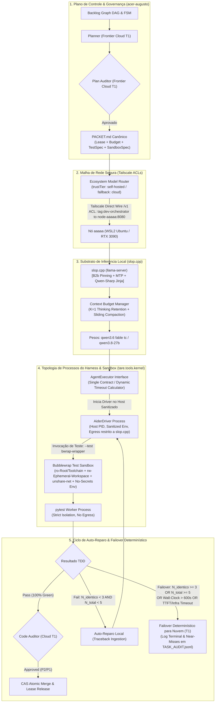
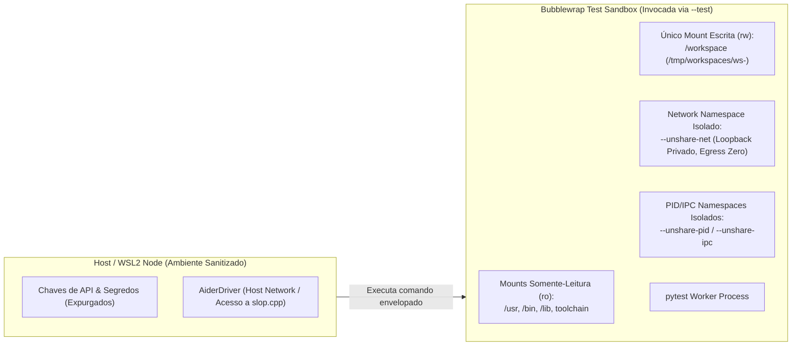

# ADR-048: Substrato de Inferência Local, Harness Agêntico e Aceleração Empírica de Hardware

- **Status:** SÍNTESE CANÔNICA PÓS-RODADA 3 / RATIFICADA PELA MESA REDONDA (`CASE-2026-08-18-LOCAL-INFERENCE-SUBSTRATE-AND-HARNESS`)
- **Data:** 2026-08-18
- **Autores:** Antigravity Mediator (Independent Synthesis & FSM Governor) sob deliberação tripartite (OpenAI Codex, Google Gemini 3.7, Anthropic Claude Fable 5) e direção de Engenharia Humana
- **Escopo:** `tare.tools.os`, `tare.tools.kernel`, `slop.cpp`, `tare.tools.local-labs` e Substrato de Execução Local

---

## 1. Contexto & Problema Arquitetural

Com a consolidação da arquitetura descentralizada do `tare.tools.os` ([ADR-044](file:///C:/projects/tare.tools.os/docs/ADR-044_SPECGRAPH_NORTH_STAR_UNIVERSAL_PROJECT_INTELLIGENCE.md) a [ADR-047](file:///C:/projects/tare.tools.os/docs/ADR-047_DIALOG_ENGINE_NORTH_STAR.md)), o ecossistema atingiu quórum formal para orquestração de DAGs, microkernel de 5 planos, inteligência de código e decomposição de jornadas.

A materialização física das tarefas de implementação e testes exigiu o fechamento determinístico de restrições operacionais, físicas e de segurança identificadas nas deliberações das Rodadas 1, 2 e 3:
1. **Topologia de Processos e Contenção de Egress do Driver ([ISS-OPENAI-R3-01], [ISS-ANTHROPIC-R3-02]):** Posicionar o `AiderDriver` dentro de um namespace `--unshare-net` inviabiliza o acesso HTTP ao endpoint `slop.cpp` (`Network is unreachable`). Por outro lado, executá-lo no host sem contenção faria seu subprocesso interno de testes herdar a rede e credenciais do host. A topologia exige segregação estrita: driver fora da sandbox de rede, mas todo comando de teste envelopado em sandbox hermética.
2. **Isolamento de Metadados Git em Workspaces Efêmeros ([ISS-OPENAI-R3-02]):** Worktrees Git vinculados dependem de metadados administrativos e travas de índice (`.git/worktrees/.../index.lock`) localizados no repositório principal do host. Montar apenas o diretório de trabalho como `rw` bloqueia comandos como `git add` e `git status`.
3. **Calibração Física de TTFT e Prefill em Cache Frio ([ISS-ANTHROPIC-R3-01]):** Um timeout fixo de TTFT de 5s colide com a física de prefill em cache frio na RTX 3090, onde a avaliação de prompts de 15k–18k tokens consome entre 9s e 30s no primeiro turno, provocando 100% de failovers espúrios.
4. **Determinismo no Orçamento de Reparo ($T_2 \to T_1$):** Garantia estrita de que $N_{\text{total}} \le 5$ (1 execução inicial + até 4 reparos), sem autorização para uma 6ª tentativa.
5. **Telemetria de Cache, Compaction e Governança:** Reter `<think>` em excesso esgota a VRAM (24 GB), demandando $K=1$ com compactação adiada em lote, telemetria nativa rastreável de $R_{\text{cache}}$, padronização do template anti-preâmbulo (*Qwen-Sharp*) e auditoria $T_1$ obrigatória para P2 e P1.

---

## 2. Decisões Arquiteturais Sintetizadas (Objetivos In-Scope)



---

### 2.1 Harness Agêntico Canônico: Interface `AgentExecutor` e Contrato do Driver Aider
Fica ratificada a **Opção 3 em formato enxuto (Kernel Task Adapter)**, com um contrato canônico estrito e suporte imediato ao driver **Aider**:

1. **Contrato Canônico de Execução e Calibração Física (`AgentExecutor`):**
   ```python
   from dataclasses import dataclass, field
   from pathlib import Path
   from typing import Literal, Any

   @dataclass(frozen=True)
   class NodeProfile:
       """Métricas empíricas aferidas na qualificação do nó (Gate 1)."""
       prefill_tokens_per_second: float = 650.0   # Taxa média de prefill (RTX 3090 ~27B)
       decode_tokens_per_second: float = 32.0     # Taxa média de decode
       safety_margin_factor: float = 2.0          # Fator de segurança operacional

   @dataclass(frozen=True)
   class TimeoutSpec:
       connection_timeout_seconds: float = 5.0    # Handshake TCP inicial com slop.cpp
       first_token_timeout_cold_seconds: float = 60.0 # Teto generoso para cache frio (15k-18k tokens)
       first_token_timeout_warm_seconds: float = 10.0 # Teto estrito para cache quente (R_cache >= 0.90)
       token_stall_seconds: float = 10.0          # Inatividade máxima entre tokens no stream
       request_completion_seconds: float = 120.0  # Teto máximo por requisição HTTP completa
       wall_clock_seconds: float = 600.0          # Teto global da tarefa inteira

       @classmethod
       def derive_from_profile(cls, profile: NodeProfile, prompt_tokens: int, expected_r_cache: float) -> "TimeoutSpec":
           """Calcula timeouts físicos dinâmicos com base no estado do cache e no perfil do nó."""
           uncached_tokens = prompt_tokens * (1.0 - expected_r_cache)
           calculated_prefill_time = (uncached_tokens / max(profile.prefill_tokens_per_second, 1.0)) * profile.safety_margin_factor
           
           if expected_r_cache >= 0.90:
               ft_timeout = max(10.0, calculated_prefill_time)
           else:
               ft_timeout = max(30.0, min(90.0, calculated_prefill_time + 15.0))
               
           return cls(
               connection_timeout_seconds=5.0,
               first_token_timeout_cold_seconds=ft_timeout if expected_r_cache < 0.90 else 60.0,
               first_token_timeout_warm_seconds=ft_timeout if expected_r_cache >= 0.90 else 10.0,
               token_stall_seconds=10.0,
               request_completion_seconds=min(180.0, max(60.0, ft_timeout + (500 / profile.decode_tokens_per_second) * profile.safety_margin_factor)),
               wall_clock_seconds=600.0
           )

   @dataclass(frozen=True)
   class JobSpec:
       task_id: str
       lease_id: str
       workspace_path: Path
       packet_path: Path
       allowed_commands: list[str]
       timeouts: TimeoutSpec = field(default_factory=TimeoutSpec)
       max_total_attempts: int = 5                # 1 execução inicial + até 4 reparos

   @dataclass(frozen=True)
   class JobResult:
       task_id: str
       lease_id: str
       status: Literal["SUCCESS", "REPAIRABLE_FAILURE", "EXHAUSTED_FAILOVER", "SECURITY_VIOLATION"]
       patch_diff: str
       test_stdout: str
       test_exit_code: int
       attempt_number: int                        # 1-indexed: 1 = inicial, 2..5 = reparos
       structural_error_hash: str | None
       failover_reason: Literal[
           "HASH_SATURATED",
           "ITERATION_CEILING",
           "WALL_CLOCK_TIMEOUT",
           "TTFT_TIMEOUT",
           "TOKEN_STALL_TIMEOUT",
           "REQUEST_TIMEOUT",
           "INFRA_OOM",
           "INFRA_CRASH",
           "SECURITY_VIOLATION"
       ] | None
       telemetry: dict[str, Any]                  # cached_tokens, prompt_eval_time_ms, r_cache, near_miss_flag
   ```

2. **Topologia de Três Processos e Parametrização do AiderDriver:**
   - **Processo 1 (Kernel Orchestrator):** Roda no host, sanitiza o ambiente, instancia o workspace e monitora os limites de tempo e telemetria.
   - **Processo 2 (AiderDriver):** Roda fora do namespace de rede da sandbox, em ambiente sanitizado, com egress de rede restrito por política exclusivamente ao endpoint `http://<tailscale-node>:8080/v1`.
   - **Processo 3 (Sandbox de Testes Envelopada):** O Aider é parametrizado para que todo comando de teste execute via wrapper Bubblewrap hermético:
     ```bash
     aider --architect \
           --no-auto-commits \
           --no-git-attribute-author \
           --no-suggest-shell-commands \
           --test "bwrap --ro-bind /usr /usr \
                         --ro-bind /bin /bin \
                         --ro-bind /lib /lib \
                         --ro-bind /lib64 /lib64 \
                         --ro-bind /etc/alternatives /etc/alternatives \
                         --ro-bind /opt /opt \
                         --ro-bind /root/.pyenv /root/.pyenv \
                         --rw-bind /tmp/workspaces/ws-<task_id> /workspace \
                         --chdir /workspace \
                         --unshare-net \
                         --unshare-pid \
                         --unshare-ipc \
                         --proc /proc \
                         --dev /dev \
                         pytest"
     ```
   - O patch resultante é extraído cirurgicamente via `git diff` no workspace efêmero.

3. **Ciclo de Vida do Workspace e Isolamento Git:**
   - Para garantir total hermeticidade sem depender do repositório raiz do host ([ISS-OPENAI-R3-02]), cada tarefa é executada em um **clone local efêmero e descartável** (`git clone --local --shared /repo /tmp/workspaces/ws-<task_id>`) ou em um worktree cujo diretório administrativo `.git` esteja integralmente contido no mount `rw`.
   - Com todos os metadados administrativos e travas (`index.lock`) residindo estritamente dentro de `/tmp/workspaces/ws-<task_id>`, comandos autorizados (`git status`, `git add`, `git diff`) operam sem falhas de permissão e sem risco de contaminação do repositório principal.
   - O workspace é destruído atomicamente ao término ou failover da tarefa.

---

### 2.2 Fronteira de Sandboxing Executável e Contenção de Segurança

A arquitetura adota um modelo de **Isolamento em Três Camadas com Fail-Closed Boot Gate**:



1. **Executor de Sandbox Obrigatório (`BubblewrapExecutor`):**
   - **Isolamento de Filesystem:** `/workspace` é o único ponto de montagem `rw`. A raiz do sistema, binários autorizados e toolchains Python são montados como `ro`. Diretórios de credenciais (`~/.ssh`, `~/.aws`, `~/.gnupg`) e `/tmp` do host são completamente omitidos ou mascarados com `tmpfs` vazio.
   - **Isolamento de Processos (PID/IPC):** Namespaces dedicados (`--unshare-pid`, `--unshare-ipc`) impedem inspeção ou sinalização de processos do host.
   - **Isolamento de Rede (*Strict No-Egress*):** Namespace de rede desvinculado (`--unshare-net`). O loopback é privado do namespace da sandbox, bloqueando qualquer comunicação com o host ou com a rede externa (`Network is unreachable`).

2. **Boot Gate & CI/CD Validation:**
   - **Worker Boot Gate:** Antes de aceitar leases no nó `aaaaa`, o worker executa obrigatoriamente a suíte `tests/security/test_sandbox_negative.py`. Se o kernel WSL2 perder suporte a namespaces ou o `bwrap` regredir, o nó se auto-desqualifica imediatamente (*fail-closed*).
   - **Pipeline CI/CD:** A suíte de testes de segurança negativa é executada em ambiente isolado no CI do `tare.tools.kernel` antes de qualquer liberação de versão.

3. **Allowlist Estrita de Comandos e Trilha de Auditoria:**
   - Comandos autorizados no runner: `git diff`, `git apply`, `git status`, `git add`, `pytest`, `python -m unittest`, `ruff`, `mypy`.
   - Invocação de comandos fora da allowlist aborta imediatamente com `SECURITY_VIOLATION`.
   - **Suíte de Testes Negativos Obrigatória (`tests/security/test_sandbox_negative.py`):**
     - *Leitura externa:* Tentativa de ler `/etc/shadow` ou `~/.bashrc` falha com `PermissionError` / `FileNotFoundError`.
     - *Escrita externa:* Tentativa de criar arquivos fora de `/workspace` falha com `ReadOnlyFileSystemError`.
     - *Egress direto:* Tentativa de abrir sockets WAN/LAN dispara `OSError: Network is unreachable`.
     - *Egress via Aider `--test` ([ISS-ANTHROPIC-R3-02]):* Teste injetado no loop TDD do `AiderDriver` tentando abrir socket ou ler `~/.ssh` é interceptado e bloqueado pela sandbox do wrapper.

---

### 2.3 Política de Contexto, Thinking Retention & Telemetria Real de KV-Cache

1. **Política de Orçamento de Contexto e Compactação de `<think>`:**
   - **Retenção Deslizante ($K=1$):** O bloco `<think>` completo é preservado estritamente para o turno anterior imediato.
   - **Compactação Adiada em Lotes (*Batch Deferred Compaction*):** Preserva a invariante $R_{\text{cache}} \ge 0.90$ aplicando a compactação de blocos históricos determinísticamente na fronteira dos turnos.
   - **Teto Rígido de Contexto:** $18.000$ tokens no total.

2. **Adaptador de Telemetria de Cache e Registro de Near-Misses (`LocalLabsTelemetryAdapter`):**
   - Implementado no `tare.tools.local-labs`, consumindo dados nativos do `slop.cpp`:
     $$R_{\text{cache}} = \frac{\text{usage.prompt_tokens_details.cached\_tokens}}{\text{usage.prompt\_tokens}}$$
   - Caso o servidor não retorne `cached_tokens`, afere-se a derivada de `prompt_eval_time_ms`.
   - **Detecção de Quase-Acidentes (*Near-Misses*):** Requisições que consumirem $> 80\%$ do teto de TTFT ou stall sem estourar o limite são marcadas com `near_miss_flag: true` e registradas em `TASK_AUDIT.jsonl` para recalibração proativa de orçamentos.
   - **Benchmark Versionado:** Validação contínua contra o artefato canônico `tests/fixtures/cache_benchmark_v1.json` (20 sessões multi-turno).

3. **Especificação do Template Anti-Preâmbulo (*Qwen-Sharp*):**
   - O template `chat_template.jinja` injetado no `slop.cpp` suprime preâmbulos conversacionais e força blocos de diff estruturados compatíveis com o parser do Aider:
     ```jinja
     
     {{ '<|im_start|>system\n' + messages[0]['content'] + '<|im_end|>\n' }}
     
     {# Injeção de restrição estrutural anti-preamble #}
     {{ '<|im_start|>system\n[CRITICAL: Emit strictly raw code diffs or direct test code. No introductory remarks.]<|im_end|>\n' }}
     ```

---

### 2.4 Orçamento de Auto-Reparo e Protocolo Determinístico de Failover ($T_2 \to T_1$)

1. **Semântica Unificada de Contagem de Tentativas:**
   - Define-se $N_{\text{total}}$ como o número absoluto de execuções de teste na sub-tarefa ($1 \le N_{\text{total}} \le 5$):
     - $N_{\text{total}} = 1$: Execução inicial do pacote.
     - $N_{\text{total}} = 2, 3, 4, 5$: Tentativas de auto-reparo 1 a 4.
   - **Teto Inviolável:** Se $N_{\text{total}} = 5$ falhar, a FSM transiciona **imediatamente** para `EXHAUSTED_FAILOVER`. Nenhuma 6ª execução é permitida.

2. **Assinatura Operacional de Erro Estrutural:**
   $$\text{StructuralErrorHash} = \text{SHA256}(\text{ExceptionType} + \text{FailingTestName} + \text{TopTracebackFrameFileAndLine})$$

3. **Hierarquia e Calibração Física de Timeouts:**
   - **TCP Connection Timeout:** $5.000\text{ms}$ ($5\text{s}$) para abertura do socket.
   - **First Token Timeout (TTFT):**
     - *Cache Quente ($R_{\text{cache}} \ge 0.90$):* $\le 10\text{s}$.
     - *Cache Frio ($R_{\text{cache}} < 0.90$ ou 1º turno com 15k tokens):* Dinâmico, calibrado via perfil do nó (ex.: até $60\text{s}$ na RTX 3090 para 18k tokens).
   - **Token Stall Timeout:** $10.000\text{ms}$ ($10\text{s}$) entre chunks sucessivos de stream.
   - **Request Completion Timeout:** $\min(120\text{s}\text{--}180\text{s}, \text{tempo restante do wall-clock})$.
   - **Wall-Clock Global da Tarefa:** $600\text{s}$ ($10\text{ minutos}$).

4. **Condições de Disparo de Failover:**
   O worker local aborta e transiciona para `EXHAUSTED_FAILOVER` ($T_2 \to T_1$) se:
   - **Saturação de Hash:** $N_{\text{identico}} \ge 3$ erros consecutivos com o mesmo `StructuralErrorHash`.
   - **Teto Absoluto:** Falha no teste na iteração $N_{\text{total}} = 5$.
   - **Wall-Clock Excedido:** Tempo acumulado $> 600\text{s}$.
   - **Falha Crítica de Infraestrutura:** VRAM OOM, crash do processo `slop.cpp`, estouro de TTFT calibrado ou stall $> 10\text{s}$.

5. **Registro Estruturado de Auditoria:**
   Toda transição terminal e near-miss é gravada em `TASK_AUDIT.jsonl` com `failover_reason`, métricas de cache e telemetria de latência.

---

### 2.5 Malha de Rede e Política de Acesso Tailscale (ACLs)

1. **Topologia e Conectividade Segura:**
   - O servidor `slop.cpp` no nó `aaaaa` escuta na interface de rede Tailscale.
   - **Regra de ACL Restrita:** Tráfego TCP na porta `8080` é restrito estritamente a nós com a tag `tag:dev-orchestrator` (`acer-augusto`) e ao loopback local autenticado do host.
2. **Keyless Hosts Controlado:**
   - O argumento `--keyless-hosts` do `llama-server` autoriza unicamente o IP Tailscale do orquestrador e `127.0.0.1` do host.

---

### 2.6 Modelo Econômico e Promoção Progressiva por Fatias de Risco

1. **Divisão de Responsabilidade Cognitiva:**
   - **Camada 1 ($T_1$ — Frontier Cloud / Pago):** Planejamento, compilação de `PACKET.md`, deliberações e **Auditoria Final de Código obrigatória para todas as classes**.
   - **Camada 2 ($T_2$ — Substrato Local `aaaaa` / Custo Zero):** Geração de código, TDD, auto-reparo em sandbox e indexação de AST.

2. **Esteira Canônica de Promoção:**

| Estágio | Classe de Tarefa | Blast Radius | Critérios de Qualificação & Governança |
| :--- | :--- | :--- | :--- |
| **Estágio 1: Qualificação** | Fixtures sintéticas e suítes do `local-labs` | Zero (Sandbox) | Gate 1 (Benchmark de Hardware e Calibração de Timeouts), Gate 2 (Testes de Integração de Sandbox em comando real) e Gate 3 (Paridade determinística $\Delta = 0.00$, $R_{\text{cache}} \ge 0.90$ em `cache_benchmark_v1.json`). |
| **Estágio 2: Operação P2** | Tarefas P2 (Docs, refatoração interna, testes, AST) | Baixo | Execução no nó local; boot gate ativo; auditoria $T_1$ obrigatória pré-merge; taxa de aprovação $\ge 85\%$ em janela móvel de 20 tarefas. |
| **Estágio 3: Operação P1** | Tarefas P1 (Lógica central do kernel/engine) | Médio/Alto | Habilitado após consolidar Estágio 2 com failover $< 15\%$ e comprovar auditoria $T_1$ pré-merge em 100% dos pacotes. |

---

## 3. Não-Objetivos Explícitos (Via Negativa & Fronteiras Arquiteturais)

1. **Sem Treinamento Fundacional no Nó Local:** Hardware local restrito à inferência, quantização e validação.
2. **Sem Substituição da Mesa Redonda por Modelos Locais:** Sínteses estratégicas e deliberações permanecem exclusivas de $T_1$.
3. **Sem Auto-Aprovação Local (*Zero Self-Auditing Inviolável*):** Nenhum código gerado localmente é mesclado sem passar pela sandbox e pela aprovação do *Code Auditor* ($T_1$).
4. **Sem Egress de Rede dentro da Sandbox de Testes:** Subprocessos de teste não têm autorização de acesso à internet, LAN ou host loopback.
5. **Sem Exposição do Repositório Git Raiz do Host:** Comandos do driver e dos testes não possuem acesso de escrita ao `.git` do repositório principal do host.

---

## 4. Matriz de Falsificação & Invariantes de Execução

| Invariante / Requisito | Mecanismo de Verificação | Falsificador / Critério de Rejeição | Módulo Responsável |
| :--- | :--- | :--- | :--- |
| **`REQ-LOC-01`: Contenção & Sandbox Isolation** | Suíte `test_sandbox_negative.py` (Boot Gate + CI) | Código de teste lê fora do workspace, escreve no host, abre socket de rede ou vaza via `AiderDriver -> --test` | `tare.tools.kernel / sandbox` |
| **`REQ-LOC-02`: Zero Secret Leakage** | Varredura estática de pre-flight no environment | Subprocesso do Aider ou da sandbox contém credenciais (`ANTHROPIC`, `OPENAI`, `GEMINI`, `AWS`, etc.) | `tare.tools.kernel / env` |
| **`REQ-LOC-03`: Prefix Cache Reuse** | Telemetria de prompt tokens no `slop.cpp` via adaptador | $R_{\text{cache}} < 0.90$ em turnos subsequentes no benchmark `cache_benchmark_v1.json` | `tare.tools.local-labs / collectors` |
| **`REQ-LOC-04`: Failover Determinístico & Teto de Tentativas** | Injeção de falhas sintéticas na FSM | Worker executa 6ª tentativa ($N_{\text{total}} > 5$), ignora saturação ($N_{\text{identico}} = 3$) ou excede $600\text{s}$ | `tare.tools.kernel / fsm` |
| **`REQ-LOC-05`: Calibração Física de Timeouts** | Injeção de latência controlada e teste com 15k tokens em cache frio | Turno 1 com 15k tokens em cache frio dispara failover espúrio, ou travamento real de decode $> 10\text{s}$ não é interceptado | `tare.tools.kernel / transport` |
| **`REQ-LOC-06`: Driver Compatibility & Git Isolation** | Execução ponta a ponta do `AiderDriver` em workspace efêmero | Falha de permissão no `index.lock`, tentativa de auto-commit ou mutação fora do workspace efêmero | `tare.tools.kernel / driver` |
| **`REQ-LOC-07`: Anti-Preamble Compliance** | Validação de schema na saída gerada pelo template *Qwen-Sharp* | Resposta do modelo contém preâmbulos conversacionais antes do bloco de diff | `slop.cpp / chat_template.jinja` |
| **`REQ-LOC-08`: Limite de Contexto & Compaction** | Verificador de tamanho de contexto no Kernel Adapter | Prompt ultrapassa $18.000$ tokens ou mantém múltiplos blocos `<think>` não compactados | `tare.tools.kernel / context` |

---

## 5. Resolução Formal dos Problemas das Rodadas 1, 2 e 3

1. **Topologia de Três Processos e Contenção de Testes ([ISS-OPENAI-R3-01], [ISS-ANTHROPIC-R3-02]):**
   - O `AiderDriver` é executado fora do namespace de rede da sandbox, permitindo comunicação HTTP estrita com o `slop.cpp`.
   - O isolamento de segurança é garantido passando ao Aider o comando de teste envelopado (`--test "bwrap ... pytest"`), assegurando que todo teste executado pelo loop TDD rode sob `--unshare-net`, mounts `ro` e workspace efêmero.
   - Adicionada verificação específica em `test_sandbox_negative.py` validando contenção na cadeia `AiderDriver -> --test`.
2. **Isolamento de Metadados Git em Workspaces Efêmeros ([ISS-OPENAI-R3-02]):**
   - Substituição de worktrees vinculados dependentes do host por clones locais efêmeros ou workspaces cujo `.git` reside integralmente dentro do ponto de montagem `rw`.
   - Garante execução bem-sucedida de `git status`, `git add` e extração de `git diff` sem colisão com arquivos administrativos do host.
3. **Calibração Física de Timeouts de Prefill e Cache ([ISS-ANTHROPIC-R3-01]):**
   - Separação entre `connection_timeout` (TCP, $5\text{s}$) e `first_token_timeout`.
   - TTFT dinâmico: teto generoso para cache frio ($R_{\text{cache}} < 0.90$, até $60\text{s}$ para prompts de 15k–18k tokens) e teto estrito ($10\text{s}$) para cache quente ($R_{\text{cache}} \ge 0.90$).
   - Caso de teste com 15k tokens em cache frio incorporado a `REQ-LOC-05` como critério de não-rejeição.
4. **Integração das Recomendações dos Assentos:**
   - *Google:* Execução obrigatória de `test_sandbox_negative.py` no CI/CD e consolidação de `cache_benchmark_v1.json` como artefato versionado.
   - *OpenAI:* Topologias de execução transformadas em testes de integração reais no Gate 2.
   - *Anthropic:* Derivação de timeouts baseada nas medições empíricas do Gate 1 (`NodeProfile`), boot gate fail-closed no worker e registro de near-misses em `TASK_AUDIT.jsonl`.
