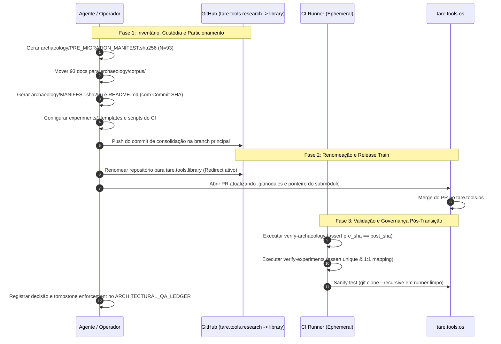

```markdown
# ADR-052: Transição de Identidade para `tare.tools.library` e Governança do Acervo Técnico-Histórico

* **Status:** Aprovado / Canônico (v003 — Síntese Consolidada da Mesa Redonda)
* **Data:** 2026-08-19
* **FSM Governor / Mediador:** Antigravity Mediator
* **Assentos Consultados:** OpenAI, Google, Anthropic
* **Alvo de Impacto:** `tare.tools.research` $\rightarrow$ `tare.tools.library`, `tare.tools.os`, SpecGraph / Graph RAG

---

## 1. Contexto & Motivação

O repositório `tare.tools.research` acumulou um acervo de 93 documentos técnico-históricos fundamentais para a evolução da arquitetura do ecossistema TARE. Contudo, a denominação `research` tornou-se ambígua frente ao papel do repositório como biblioteca de referência, acervo histórico auditável e repositório de novos ensaios/experimentos arquiteturais.

A transição de identidade para `tare.tools.library` resolve essa divergência semântica. Para que essa mudança seja resiliente à concorrência de agentes, preserve a cadeia de custódia e garanta a continuidade operacional dos submódulos, este ADR estabelece a estrutura de governança, validação automatizada e o plano de transição.

---

## 2. Decisão Arquitetural

### 2.1 Nova Semântica e Estrutura de Diretórios
O repositório é renomeado para **`tare.tools.library`** e sua estrutura interna é particionada em duas zonas de governança distintas:

```text
tare.tools.library/
├── archaeology/
│   ├── PRE_MIGRATION_MANIFEST.sha256  # Baseline pré-migração (cadeia de custódia)
│   ├── MANIFEST.sha256                # Manifest pós-migração
│   ├── README.md                      # Índice histórico, commit anchor e tombstone
│   └── corpus/                        # 93 documentos históricos preservados (imutáveis)
├── experiments/
│   ├── README.md                      # Tabela central de registro de IDs (EXP-XXX)
│   └── EXP-001-nome-do-ensaio.md      # Novos ensaios e pesquisas ativas
├── docs/
│   └── templates/
│       └── EXP-template.md            # Template padronizado de experimentos
└── .github/
    └── workflows/
        ├── verify-archaeology.yml     # Validação criptográfica de integridade
        └── verify-experiments.yml     # Validação de unicidade e bijeção 1:1
```

### 2.2 Cadeia de Custódia e Preservação Criptográfica (`archaeology/`)
1. **Linha de Base Pré-Migração:** Antes de qualquer movimentação, é gerado `PRE_MIGRATION_MANIFEST.sha256` a partir dos 93 documentos na raiz original.
2. **Dupla Âncora Criptográfica:** O `archaeology/README.md` registrará tanto o hash SHA-256 do manifesto quanto o Git Commit SHA consolidado da migração.
3. **Imutabilidade e Graph RAG:** O pipeline de ingestão do SpecGraph/Graph RAG marcará automaticamente os nós de `archaeology/corpus/` com o metadado `status: archived_immutable`, calibrando a heurística de busca vetorial para despriorizar ou segregar o acervo histórico em consultas operacionais ativas.

### 2.3 Governança de Experimentos (`experiments/`) & CI Enforcement
A tabela central em `experiments/README.md` é validada como fonte de verdade estrita via CI (`verify-experiments.yml`):
- **Unicidade de ID:** Nenhum ID `EXP-XXX` pode aparecer duplicado na tabela ou no sistema de arquivos.
- **Bijeção 1:1:** Cada linha da tabela deve corresponder a exatamente um arquivo em `experiments/`, e todo arquivo em `experiments/` deve ter sua respectiva entrada registrada na tabela.
- **Resolução de Conflitos:** Falhas de colisão por branches concorrentes barram o merge no CI.

### 2.4 Mecanismo de Transição de Repositório e Submódulo
A transição minimiza a janela de inconsistência baseando-se no redirect nativo do GitHub:
1. Renomeação do repositório no GitHub (`tare.tools.research` $\rightarrow$ `tare.tools.library`). O redirect automático mantém clones legados funcionais.
2. Mescla atômica do PR em `tare.tools.os` atualizando `.gitmodules` e ponteiros de commit.
3. Teste em runner efêmero de CI com cache limpo (`git clone --recursive`).

---

## 3. Critérios de Aceitação & Falsificabilidade

- [ ] **AC-01 (Cadeia de Custódia & Integridade Biunívoca do Corpus):**
  * *Verificação:* O CI compara `archaeology/PRE_MIGRATION_MANIFEST.sha256` contra os arquivos em `archaeology/corpus/`, exigindo correspondência exata de $N=93$ hashes SHA-256 e nomes de arquivo.
  * *Falsificador:* Modificação acidental, truncamento, conversão de quebra de linha ou exclusão de qualquer um dos 93 documentos originais durante a migração; discrepância entre o estado pré e pós-migração.

- [ ] **AC-02 (Âncora Criptográfica Dupla de Proveniência):**
  * *Verificação:* `archaeology/README.md` referencia explicitamente o Commit SHA de consolidação da migração e o checksum SHA-256 do manifesto.
  * *Falsificador:* Ausência do Commit SHA ou divergência do hash do manifesto no README do acervo.

- [ ] **AC-03 (Unicidade e Bijeção 1:1 de Experimentos no CI):**
  * *Verificação:* Execução do linter `verify-experiments.yml` que valida a unicidade dos identificadores `EXP-XXX` e a correspondência biunívoca entre entradas na tabela de `experiments/README.md` e arquivos em `experiments/`.
  * *Falsificador:* Dois branches reservando o mesmo ID de experimento ou presença de arquivos órfãos sem entrada na tabela passando pelo gate de CI.

- [ ] **AC-04 (Imutabilidade Semântica no SpecGraph / Graph RAG):**
  * *Verificação:* Ingestão de artefatos atribui a tag `status: archived_immutable` para todos os nós originados em `archaeology/corpus/`.
  * *Falsificador:* Nós arqueológicos classificados como especificações ativas ou sem peso diferenciado em travessias de grafo e buscas vetoriais.

- [ ] **AC-05 (Transição de Submódulo & Sanidade em Runner Efêmero):**
  * *Verificação:* Clone recursivo limpo (`git clone --recursive`) de `tare.tools.os` executa com sucesso em ambiente sem cache, resolvendo o submódulo `tare.tools.library`.
  * *Falsificador:* Falha no checkout recursivo por apontamento residual para `tare.tools.research` ou falha de resolução de URL.

- [ ] **AC-06 (Registro Semântico e Tombstone Enforçado no Ledger):**
  * *Verificação:* `ARCHITECTURAL_QA_LEDGER` atualizado registrando a transição semântica para `library`, a regra de tombstone para `tare.tools.research` e o mecanismo de enforcement ativo (GitHub Repository Ruleset impedindo a recriação do repo com nome legado + CI probe).
  * *Falsificador:* Omissão do mecanismo de enforcement no ledger ou dependência exclusiva de memória institucional.

---

## 4. Matriz de Resolução dos Bloqueios da Rodada 2

| ID do Apontamento | Assento | Natureza | Resolução Integrada na v003 |
| :--- | :--- | :--- | :--- |
| **`ISS-OPENAI-R2-01`** | OpenAI | Bloqueante | Adicionado `PRE_MIGRATION_MANIFEST.sha256` gerado antes da movimentação; validação pós-migração compara obrigatoriamente contra esta baseline pré-migração. |
| **`ISS-OPENAI-R2-02`** | OpenAI | Bloqueante | Implementado gate automatizado de CI (`verify-experiments.yml`) que audita unicidade estrita de IDs e bijeção 1:1 com os arquivos físicos. |
| *Recomendação 1* | Google | Melhoria | Ingestão SpecGraph/Graph RAG configurada com metadados `status: archived_immutable` para calibragem de relevância vetorial. |
| *Recomendação 2* | Google | Melhoria | Sanidade obrigatória de clone limpo e submódulo recursivo em runner efêmero de CI no `tare.tools.os`. |
| *Recomendação 3* | Anthropic | Melhoria | Ordenação explícita do Release Train (Rename no GitHub primeiro $\rightarrow$ Merge PR no `tare.tools.os`), documentando que o redirect do GitHub provê a continuidade operacional. |
| *Recomendação 4* | Anthropic | Melhoria | Registro do mecanismo de enforcement de tombstone (GitHub Ruleset + CI) no `ARCHITECTURAL_QA_LEDGER`. |
| *Recomendação 5* | Anthropic | Melhoria | Âncora criptográfica dupla (SHA-256 + Git Commit SHA de consolidação) documentada em `archaeology/README.md`. |

---

## 5. Plano de Execução & Release Train



### Detalhamento das Fases:

1. **Fase 1 (Inventário, Cadeia de Custódia e Estruturação):**
   - Executar snapshot pré-migração: `sha256sum *.md > archaeology/PRE_MIGRATION_MANIFEST.sha256` sobre os 93 documentos originais.
   - Criar diretório `archaeology/corpus/` e mover os 93 documentos.
   - Gerar manifesto de destino `archaeology/MANIFEST.sha256`.
   - Criar `archaeology/README.md` contendo índice histórico, hash do manifesto e Commit SHA de consolidação.
   - Adicionar `docs/templates/EXP-template.md`, `experiments/README.md` (com tabela de registro) e workflows de CI.

2. **Fase 2 (Renomeação do Repositório & Release Train):**
   - **Passo 1 (Rename):** Renomear o repositório no GitHub para `tare.tools.library`. *(O redirect HTTP/Git nativo garante que referências em trânsito não quebrem).*
   - **Passo 2 (Submódulo):** Mesclar PR em `tare.tools.os` atualizando a URL em `.gitmodules` para `tare.tools.library` e sincronizando o ponteiro de commit.

3. **Fase 3 (Validação Pós-Transição & Ledger):**
   - Executar validação automatizada de integridade biunívoca ($N=93$) no CI.
   - Executar validação de unicidade de experimentos no CI.
   - Executar validação em runner efêmero de clone recursivo no `tare.tools.os`.
   - Registrar no `ARCHITECTURAL_QA_LEDGER` o significado de `library`, a regra de tombstone para `tare.tools.research` e a configuração do GitHub Ruleset como mecanismo de proteção.
```


<!-- Refinement auto-amended in Round 3 for 2 issues -->
