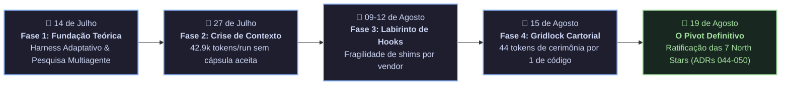

# 🏛️ POST-MORTEM ARQUITETURAL: TRANSIÇÃO DO HARNESS MONOLÍTICO PARA O AGENT OS FEDERADO

- **Status do Repositório:** **CONGELADO / ARQUIVADO (FROZEN & ARCHIVED)**
- **Data da Consolidação:** Agosto de 2026
- **Sucessor Oficial:** **[`tare.tools.os`](https://github.com/augusto-scarvalho/tare.tools.os)**
- **Normas Governantes:** **ADR-044 a ADR-050**

---

## 1. Resumo Executivo & Linha do Tempo

O `tare.tools.harness` serviu como o protótipo monolítico original durante os meses de julho e agosto de 2026 para validar a tese de colaboração autônoma de múltiplos agentes de IA no desenvolvimento de software.

Embora tenha sido fundamental para comprovar a viabilidade de pipelines como *Planner $\to$ Implementer $\to$ Auditor $\to$ Gatekeeper*, o formato monolítico acumulou gargalos estruturais que inviabilizaram sua sustentação em escala:

---

## 2. As 5 Falhas Estruturais do Protótipo Monolítico

### 1. Desperdício Crônico de Contexto (42.9k tokens por execução)
No modelo original, cada worker recebia um digest completo do repositório, manuais de dezenas de ferramentas e o arquivo `AGENTS.md` inteiro (~15k tokens fixos). Mais de 90% da janela de contexto do LLM era gasta relendo documentações repetitivas em vez de focar na alteração de código.

### 2. O Labirinto de Hooks por Vendor (Whack-a-Mole)
O harness tentava interceptar o ciclo de vida dos modelos através de scripts de monkeypatching e hooks de terminal específicos para cada ferramenta externa (Codex CLI, Claude Code, Kimi, Antigravity). Cada atualização dos fornecedores quebrava os hooks e vazava milhares de tokens.

### 3. A Espiral Cartorial de Governança (MWR = 44.05)
A composição cumulativa de gates, permits e checagens manuais criou o *Gridlock Cartorial*: uma alteração de 6 palavras em documentação exigia permits de 8.690 bytes, laudos criptográficos e 14 passos manuais de exceção.

### 4. Concorrência Frágil em Filesystem sem CAS
A coordenação de tarefas por arquivos JSON em disco compartilhado sem garantia de seção crítica atômica (*Compare-And-Swap*) gerava corridas de concorrência (*Lost Updates*) entre agentes simultâneos.

### 5. Emaranhamento entre Pesquisa Empírica e Código de Produção
Artigos de pesquisa exploratória, rodadas experimentais de benchmark (CMRP, auditorias de tokens) e o runtime de engenharia conviviam misturados na mesma raiz, dificultando o isolamento entre hipóteses científicas descartáveis e código estável.

---

## 3. Matriz de Reaproveitamento: A Herança Dourada

Nem uma única boa ideia foi perdida. As melhores inovações foram depuradas, isoladas e promovidas para **satélites especializados**:

| Conceito Criado no Harness | Destino no Novo Ecossistema | Evolução & Refinamento |
|---|---|---|
| **Spec-Driven Development (SDD)** | [`tare.tools.specgraph`](https://github.com/augusto-scarvalho/tare.tools.specgraph) | De parsers manuais frágeis para AST universal via **Tree-Sitter** e Matriz Causal viva. |
| **Backlog em Grafo Acíclico (DAG)** | [`tare.tools.backlog-graph`](https://github.com/augusto-scarvalho/tare.tools.backlog-graph) | Motor puro em stdlib Python com concorrência determinística **CAS** e locks atômicos. |
| **Statecharts & Análise Topológica** | [`tare.tools.dialog-engine`](https://github.com/augusto-scarvalho/tare.tools.dialog-engine) | AST conversacional universal, verificação estática em 12 fases e fuzzer de mutação. |
| **Sandboxing & Contratos de Execução** | [`tare.tools.kernel`](https://github.com/augusto-scarvalho/tare.tools.kernel) | Microkernel em 5 planos desacoplados com isolamento hermético via **`bwrap`** e SQLite WAL. |
| **Mesa Redonda Tripartite (Round Table)** | [`tare.tools.os`](https://github.com/augusto-scarvalho/tare.tools.os) | Orquestração federada com quórum adversarial entre 3 provedores de fronteira. |
| **Pesquisa Empírica & Protocolos Experimentais** | [`tare.tools.research`](https://github.com/augusto-scarvalho/tare.tools.research) | Hub científico formal, protocolos experimentais (CMRP, auditoria de tokens) e publicação canônica via GitHub Pages. |

---

## 4. O Que Foi Definitivamente Aposentado

1. ❌ **Monolito de 186 Módulos:** Substituído pela federação de submódulos Git governada por ADR-049.
2. ❌ **Hooks Frágeis de Terminal:** Substituídos por Camadas Anticorrupção (ACL) e isolamento de processos.
3. ❌ **Prompt Stuffing no Boot:** Substituído por Envelopes de Contexto cirúrgicos gerados pelo SpecGraph (< 4.000 tokens).
4. ❌ **Coordenação por JSON em Disco:** Substituída por SQLite 3 em modo Write-Ahead Logging (WAL) com `BEGIN IMMEDIATE`.
5. ❌ **Burocracia de Permits Infinitos:** Substituída por transições atômicas em tempo finito $O(1)$ e aprovação em 1 clique.
