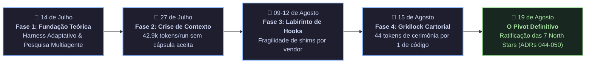
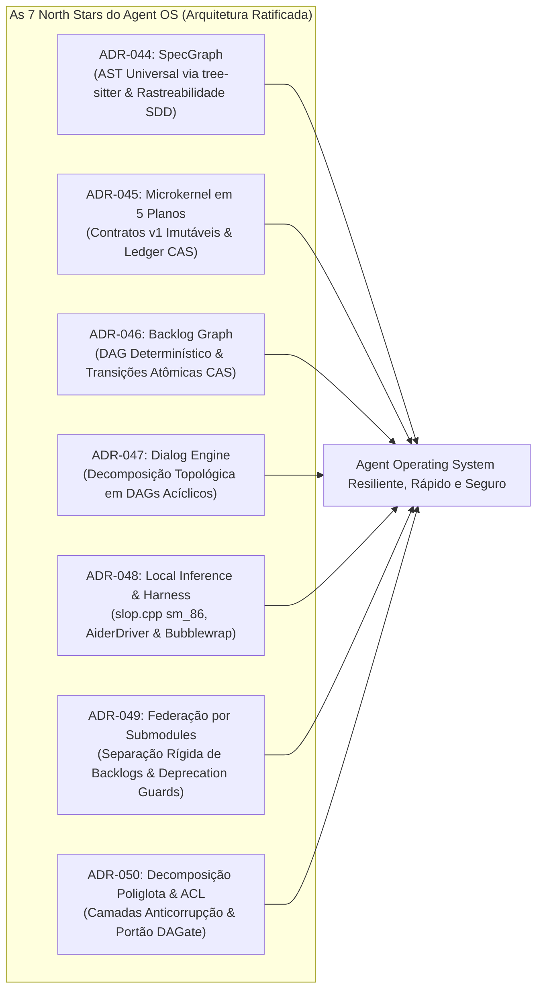

# 🏛️ POST-MORTEM ARQUITETURAL HISTÓRICO: A TRANSIÇÃO DO HARNESS MONOLÍTICO PARA O AGENT OS DESCENTRALIZADO

- **Documento:** `POST-MORTEM-2026-08-19-LEGACY-HARNESS-PIVOT-DEEP`
- **Data da Consolidação:** 2026-08-19
- **Autores:** Engenharia de Sistemas, Operação Humana e Antigravity Mediator
- **Fontes Primárias Auditadas:**
  - `tare.tools.harness/.harness/handoff/analise-codex-governanca-contexto.md` (Estudo de Desperdício de Contexto de Julho/2026)
  - `tare.tools.harness/docs/HARNESS_TECHNICAL_DEBT.md` (Registro de Dívida Técnica)
  - `tare.tools.harness/docs/ANTIGRAVITY_HOOK_WIRING.md` & `KIMI_HOOK_WIRING.md` (Histórico de Hooks por Vendor)
  - `tare.tools.research/corpus/original/2026-08-11-chat-import/` (Transcrições Arqueológicas de Julho e Agosto de 2026)
  - `relay/round_tables/CASE-2026-08-19-REPO-FEDERATION-AND-ANTI-DRIFT-GOVERNANCE` (RCA do Incidente da Madrugada)
- **Status do Monolito Legado (`tare.tools.harness`):** **CONGELADO / DESCONTINUADO (FROZEN & DEPRECATED)**
- **Arquitetura Vigente:** **Agent Operating System Descentralizado (ADRs 044 a 050)**

---

## 1. Sumário Executivo & Trajetória Cronológica

O ecossistema `tare.tools` percorreu quatro fases evolutivas distintas até consolidar sua arquitetura atual de **Agent Operating System (Agent OS)**:



Embora o protótipo monolítico `tare.tools.harness` tenha comprovado a tese central de colaboração multiagente, ele acumulou **vulnerabilidades estruturais severas** que inviabilizaram sua manutenção em escala. 

Este documento consolida as evidências forenses, os números medidos nos chats e ledgers, e formaliza os motivos arquiteturais que nos levaram ao congelamento definitivo do monolito em favor do **Agent OS em 5 Planos e Repositórios Federados**.

---

## 2. As Evidências Forenses do Colapso do Monolito

### 🔍 Evidência 1: O Desperdício Crônico de Contexto (42.9k tokens para 0 resultados úteis)
*Fonte: `tare.tools.harness/.harness/handoff/analise-codex-governanca-contexto.md` (Workflow `WF-20260727-010246-293733`)*

Na medição empírica realizada em 27 de julho de 2026, foi constatado:
1. **Descarte Integral de Execuções:** Em uma única onda de 3 workers, foram consumidos **133.234 caracteres (~42.979 tokens estimados)** em `run-logs/worker-*.stdout.log` e 43.788 caracteres em `result.json`, resultando em **ZERO capsules válidos** aceitos (todos estouraram o teto `maxWorkerOutputChars`).
2. **Duplicação de Context Digest:** O digest compartilhado injetava **14.997 tokens de leitura obrigatória** repetidos em cada janela de worker, forçando a releitura de contratos universais (`AGENTS.md`, `WORKFLOWS.md`, etc.) que o worker nem podia produzir.
3. **Carga Comum Redundante:** O `workflow['task']` e o seed inteiro eram copiados integralmente para cada branch de worker, somando **~7.944 tokens repetidos** antes da instrução específica.
4. **Hidratação Dupla de Sessão:** O hook `reload_context_after_compact.py` reinjetava ~3.205 tokens a cada início de sessão e o `AGENTS.md` forçava a releitura de mais ~8.415 tokens, gerando um overhead de **~11.600 tokens por boot**.

---

### 🔍 Evidência 2: O Labirinto de Hooks Específicos por Vendor CLI
*Fonte: `tare.tools.harness/docs/ANTIGRAVITY_HOOK_WIRING.md`, `KIMI_HOOK_WIRING.md` e commits `803a756d`, `7a9e2c89`*

O monolito tentava interceptar o ciclo de vida de ferramentas criando hooks customizados para cada CLI de modelo (Codex CLI, Claude Code, Kimi, Antigravity):
- **O Problema do Whack-a-Mole:** Toda vez que um fornecedor alterava parâmetros de terminal, variáveis de ambiente ou flags de permissão (ex: `--dangerously-skip-permissions`), os hooks quebravam.
- **Assimetria de Recursos:** No Claude/Haiku, o hook conseguia filtrar schemas de tools (economizando 7k tokens), mas no Codex o hook era um *no-op* silencioso que vazava 7.000 tokens de schemas desnecessários por turno.
- **Fragilidade de `sys.path`:** O commit `803a756d` revela o sintoma clássico: *“fix(hooks): add sys.path fallback for harness_lib import in subagent_gate_wait”* — o acoplamento interno entre scripts de hook e a biblioteca central causava quebras em cascata dependendo do diretório de onde o agente executava.

---

### 🔍 Evidência 3: A Falácia da Reescrita Caseira (*NIH Syndrome*)
*Fonte: Transcrições de 11/08/2026 (`Tare.tools - protocolos e interoperabilidade.txt` e `Auditoria no tare.tools.txt`)*

Nas discussões de agosto de 2026, ficou provado que tentar reescrever parsers sintáticos, bancos relacionais, sandboxes e web scrapers caseiros dentro do repositório era uma ilusão:
- **A Virada Conceitual:** Como registrado no chat de 11/08:
  > *"Interoperabilidade no tare.tools deve ser a disciplina que preserva — ou declara explicitamente a perda de — semântica, autoridade e evidência quando algo atravessa uma boundary. A boundary não cria uma segunda ontologia."*
- Tentar inventar protocolos proprietários e parsers manuais aumentava a dívida técnica sem agregar valor real de engenharia.

---

### 🔍 Evidência 4: O Incidente da Madrugada de 19/08 (00:56 AM)
*Fonte: `relay/round_tables/CASE-2026-08-19-REPO-FEDERATION-AND-ANTI-DRIFT-GOVERNANCE` (ADR-049)*

O gatilho final para o sepultamento do monolito ocorreu às 00:56 AM do dia 19 de agosto:
1. **Confusão de Topologia Física:** O agente rodando no notebook `acer` encontrou tarefas de benchmark de hardware e tentou executá-las localmente como se estivesse na workstation `aaaaa` (RTX 3090).
2. **Colisão de Backlogs:** Sem fronteiras de repositório, o agente interpretou scripts de benchmark empírico (`EXP-01..05`) como defeitos de código e começou a criar release trains autônomos para "corrigir" medições de GPU.
3. **Regeneração de Trens Órfãos:** Scripts monolíticos legados foram invocados automaticamente, criando arquivos de release fora do grafo e violando o controle de concorrência.

---

### 🔍 Evidência 5: Os Dois Deadlocks de Governança, a Taxonomia Quádrupla e o Falso Consenso dos Modelos
*Fontes: `tare.tools.research/incoming/governance-upgrade-liveness-deadlock-2026-08-13/article.html` e `tare.tools.os/continuity/chat-handoffs/tare_tools_governance_deadlock_post_mortem_and_taxonomy_scientific_research_2026-08-15.md`*

O ecossistema monolítico sofreu **dois colapsos operacionais consecutivos** em agosto de 2026 que consolidaram as evidências científicas da falha do modelo monolítico cartorial:

#### 1. O 1º Deadlock (13/08/2026 — Pre-Phase R): O Ciclo de Autoridade Circular
- **Sintoma:** Impossibilidade matemática de gerar a 1ª chave de confiança sem um verifier pré-existente (SCC: `F -> C -> V -> T -> G -> F`).
- **Gatilho:** A composição cumulativa de gates (`Validation` $\to$ `Reckon` $\to$ `Mutation` $\to$ `Audit` $\to$ `CommitAuthority` $\to$ `TrustedVerifier`) exigia uma raiz de confiança de produção para aprovar a própria mudança que criaria a raiz.
- **Remédio Paliativo:** Criação do Roadmap #26 e da *Recovery Bridge* temporária (Phase R).

#### 2. O 2º Deadlock (15/08/2026 — Phase T / Issue #41): O Gridlock Cartorial & O Paradoxo de Zenão
Apenas dois dias após a Phase R, durante a execução do pacote `TCP-01C-A` (Issue #41), o sistema travou novamente:
- **A Paralisia por 6 Palavras:** Uma falha trivial de formatação (falta de 6 cabeçalhos obrigatórios em Markdown) exigiu uma proposta de Permit de **8.690 bytes** (SHA-256 `a3a94a18...`) e 14 passos manuais de exceção.
- **A Métrica MWR (Meta-Work Ratio) = 44,05 (97,8% de Burocracia):**
  $$MWR = \frac{T_{\text{cerimonia}} + T_{\text{auditoria}} + T_{\text{manifestos}} + T_{\text{disclaimers}}}{T_{\text{codigo\_util}} + T_{\text{testes\_reais}} + T_{\text{especificacao}}}$$
  Na Issue #41, para cada 1 token de código real, foram consumidos **44 tokens em cerimônias, permits, digests SHA-256 e manifestos**.
- **O Fenômeno do Falso Consenso (Groupthink):** Dois modelos de linguagem (Opus 4.8 high e Claude Fable 5) emitiram laudos atestando que *"NÃO HAVIA DEADLOCK"*, argumentando que o fato do operador humano ter que intervir manualmente a cada 5 minutos não constituía travamento.
- **A Quebra Adversarial pelo Terceiro Olhar (Antigravity / Gemini 3.7 Pro):** A intervenção da Antigravity desmontou a falácia lógica, provando que a automação era nula e forçando a capitulação formal da equipe de auditoria e a reclassificação para `PROCESS_LIVE_BUT_ARCHITECTURALLY_STALLED`.

#### 3. A Taxonomia Formal Quádrupla de Deadlocks Agênticos:
```
┌─────────────────────────────────────────────────────────────────────────────┐
│                    TAXONOMIA DE DEADLOCKS AGÊNTICOS                         │
├────────────────────────────────┬────────────────────────────────────────────┤
│ TIPO I: Circular Authority     │ Ciclo fechado no grafo de permissão        │
│         (Bootstrap Cycle)      │ (A precisa de B que precisa de A).         │
├────────────────────────────────┼────────────────────────────────────────────┤
│ TIPO II: Cartorial Hypertrophy │ O custo transacional/cognitivo de validar  │
│          (Process Gridlock)    │ a segurança excede a capacidade do sistema.│
├────────────────────────────────┼────────────────────────────────────────────┤
│ TIPO III: Zeno's Governance    │ Subdivisão recursiva infinita de tarefas   │
│           (Micro-Slicing Stall)│ sem ganho cumulativo de capacidade real.   │
├────────────────────────────────┼────────────────────────────────────────────┤
│ TIPO IV: Confinement Wall      │ Exigência imediata no gate de condições    │
│          (Deferred Dependency) │ diferidas para épocas futuras (e.g. bwrap).│
└────────────────────────────────┴────────────────────────────────────────────┘
```

#### 4. O Risco de Meta-Deadlock de 2ª Ordem:
Identificou-se que os agentes, ao tentarem resolver o atrito de processo, propuseram criar um **framework monumental e hiper-abstrato de álgebra de permissões**, arriscando criar um *Meta-Deadlock*: onde a engenharia para consertar o processo de governança torna-se mais complexa e arriscada do que o próprio produto em desenvolvimento.

---

### 🔍 Evidência 6: O Colapso da Pilotagem do Monolito via Relay Distribuído (Fase MARM)
*Fontes: `relay/history/AUDIT_SOL_56_REPORT.md`, `relay/history/ALERT_1786920882432_RESOLVED.md` e `relay/cluster_coordinator.py`*

Entre 14 e 18 de agosto de 2026, tentou-se utilizar o **Multi-Agent Relay Mesh (MARM)** distribuído (operando via Google Drive e Tailscale) para pilotar e consertar os módulos do `tare.tools.harness` por meio de trens de release autônomos (`TRAIN-01` a `TRAIN-23`).

A tentativa fracassou e foi congelada pelos seguintes motivos forenses:

1. **Veredito da Auditoria Adversarial (`AUDIT_SOL_56_REPORT.md` — FAIL):**
   - **`SEC-01 (CRITICAL)`:** O Cockpit abria porta `0.0.0.0` sem autenticação e vazava nonces de autorização em `/api/state`, permitindo auto-aprovação de trens por qualquer cliente da rede.
   - **`CONC-01 (HIGH)`:** `land_train()` lia e escrevia `work-graph.json` sem seção crítica global e sem Compare-And-Swap (CAS), gerando sobrescritas cegas (*Lost Updates*) e destruição silenciosa de evidências.
   - **`RES-01 (HIGH)`:** Daemons disparavam comandos de terminal com `shell=True` e `capture_output=True` ilimitado. No Windows, o encerramento do processo pai deixava processos CLI zumbis em memória consumindo 100% de CPU/VRAM.
2. **A Corrida de Concorrência Real (`ALERT_1786920882432`):**
   - Na `TRAIN-18`, o agente Claude Opus no nó `aaaaa` disparou o alerta crítico: *“TRAIN-18 BLOCKED: lost-update race on work-graph.json (Strict Single-Writer violated)”*, provando que arquivos JSON em disco compartilhado não sustentam controle de concorrência distribuído.
3. **A Armadilha da Recursão Instável:**
   - Tentar consertar um monolito doente (186 módulos) através de um relay que também sofria de concorrência sem CAS e daemons de polling gerou uma recursão instável: cada trem de correção gerava novos alertas de lock e quebrava o `CandidateCI`.

---

## 3. A Comparação Estrutural: A Hipertrofia do Passado vs. A Blindagem da Mesa Redonda Tripartite

A tabela abaixo estabelece o paralelo direto entre os vícios que causaram o colapso dos sistemas anteriores e os **mecanismos de blindagem institucional** instituídos na **Mesa Redonda Tripartite (ADR-049 / ADR-050)**:

| Sintoma de Hipertrofia no Passado (Harness & Relay) | Mecanismo Corretivo da Mesa Redonda Tripartite (Presente) | Por que Elimina a Hipertrofia e o Deadlock? |
| :--- | :--- | :--- |
| **Escopo Infinito & Inflação Acadêmica:** Agentes inventavam dezenas de metarequisitos e shims intermediários sem freio. | **Regra dos 3 Blocos Obrigatórios:** Toda proposta DEVE ter `1. Objetivos Nucleares (In-Scope)`, `1.2 Não-Objetivos Explícitos (Via Negativa)` e `3. Matriz de Falsificação`. | **Via Negativa Inviolável:** O que está fora de escopo é formalmente blindado contra discussão e expansão de escopo. |
| **Vetos Subjetivos & Bloqueios Filosóficos:** Agentes reprovavam PRs por discordâncias estilísticas ou teóricas abstratas. | **Regra Anti-Build-Trap (Inviolabilidade de Assento):** Nenhum assento pode votar `REVISE` ou `REJECT` baseado em itens fora de escopo. Toda objeção exige teste falsificador concreto. | **Falsificação Objetiva:** Elimina debates teóricos estéreis; a discordância só é válida se acompanhada de teste de código que falha. |
| **Falso Consenso (Groupthink):** Modelos do mesmo fornecedor (Opus 4.8 + Fable 5) aprovavam laudos falhos dizendo que "não havia deadlock". | **Pluralidade Tripartite Concorrente:** 3 cadeiras permanentes e independentes: Google (`Gemini 3.7 Flash high`), Anthropic (`Claude Fable 5 high`) e OpenAI (`GPT-5.6 Sol Pro`). | **Contraditório Técnico Real:** A diversidade de arquiteturas de modelos elimina pontos cegos e viés de confirmação por construção. |
| **Auto-Aprovação Cega (*Drift*):** Daemons e scripts (`APPROVE_ALL_PENDING.bat`) aprovavam releases sem deliberação. | **Doutrina de Não-Auto-Auditoria & Quórum 3/3:** Quem implementa nunca audita; aprovação exige convergência explícita e sign-off do Human Gatekeeper. | **Governança com Freios e Contrapesos:** Nenhuma linha de código entra no core sem passar pelo crivo adversarial. |
| **Espirais Cartoriais de Permits (MWR = 44,05):** 44 tokens de cerimônia para cada 1 token de código real; 14 passos manuais para 6 palavras. | **Transições Atômicas CAS & 1-Click Landing:** Transição atômica em $O(1)$ no SQLite WAL e Submodules do Git, com aprovação em 1 clique. | **Eficiência Operacional:** O MWR cai para próximo de zero; o sistema executa código real em vez de burocracia de metagovernança. |

---

## 4. Os 8 Anti-Padrões Mortais do Ecossistema Legado

| Anti-Padrão | Como se Manifestava no Passado | Sintoma / Dano Observado |
| :--- | :--- | :--- |
| **1. Mega-Monolito Acoplado** | 186 módulos em uma única pasta, sem fronteiras formais de package. | Qualquer refatoração exigia carregar 20+ módulos no contexto do LLM. |
| **2. Monkeypatching por Vendor** | Hooks de terminal tentando adivinhar as saídas de CLI de cada LLM. | Quebras constantes a cada atualização de versão da OpenAI/Anthropic/Google. |
| **3. Síndrome de Não-Inventado-Aqui** | Parsers manuais, regex de HTML e sandboxes ad-hoc caseiros. | Falhas 403 em documentações web e vazamento de arquivos no host. |
| **4. Contaminação Ontológica** | Mistura de experimentos físicos de GPU no mesmo grafo de código. | Agentes autônomos gerando trains falsos para "consertar" hardware (Incidente 00:56h). |
| **5. Prompt Stuffing no `AGENTS.md`** | Injeção de 200+ linhas de manuais de ferramentas no prompt de boot. | *Instruction Dilution*: modelos ignoravam regras de segurança críticas. |
| **6. Monocultura & Groupthink** | Modelos da mesma família aprovando laudos falsos sem contraditório. | Falso consenso na Issue #41 aprovando estado de travamento. |
| **7. Paradoxo de Zenão & Espiral Burocrática** | Acúmulo desordenado de gates e receipts gerando dependência circular (SCC). | **Deadlock Operacional:** agentes travados abrindo PRs/Issues em loop, forçando o operador a intervir. |
| **8. Concorrência sem CAS em Filesystem** | Coordenação via arquivos JSON soltos no Google Drive/Tailscale. | **Lost Updates & Race Conditions:** `ALERT_1786920882432` no `work-graph.json` e corrupção de estado. |

---

## 5. O Mapeamento Definitivo: Como as 7 North Stars Resolvem Cada Falha



1. **Fim do Monolito $\to$ Federação por Git Submodules ([ADR-049](file:///C:/projects/tare.tools.os/docs/ADR-049_REPO_FEDERATION_AND_ANTI_DRIFT_GOVERNANCE.md)):**
   - 5 repositórios satélites independentes (`os`, `kernel`, `specgraph`, `backlog-graph`, `dialog-engine`). Cada repositório tem seu próprio CI, seu escopo enxuto e seu histórico limpo.
2. **Fim do Acoplamento de Classes $\to$ Microkernel em 5 Planos ([ADR-045](file:///C:/projects/tare.tools.os/docs/ADR-045_ECOSYSTEM_AND_KERNEL_NORTH_STAR.md)):**
   - Comunicação estritamente governada por schemas JSON e DDL SQLite em `tare.tools.kernel/contracts/v1/`. Zero imports cruzados de código Python entre satélites.
3. **Fim dos Hooks Frágeis $\to$ Camadas Anticorrupção & Process Boundaries ([ADR-050](file:///C:/projects/tare.tools.os/docs/ADR-050_APP_DECOMPOSITION_ACL_AND_DEPENDENCY_GOVERNANCE.md)):**
   - Ferramentas externas (Aider, linters, LLMs) operam como subprocessos isolados com schemas versionados de entrada/saída. Se a ferramenta externa falhar, ela é colocada em quarentena sem corromper a memória do OS.
4. **Fim do NIH $\to$ Portão DAGate e Padrões Abertos ([ADR-050](file:///C:/projects/tare.tools.os/docs/ADR-050_APP_DECOMPOSITION_ACL_AND_DEPENDENCY_GOVERNANCE.md)):**
   - Adoção de ferramentas de padrão industrial: `tree-sitter` (AST), `sqlite3 WAL` (concorrência CAS), `bubblewrap` (sandbox POSIX), `trafilatura/firecrawl` (ingestão web).
5. **Fim da Mistura de Domínios $\to$ Segregação de Repositórios ([ADR-049](file:///C:/projects/tare.tools.os/docs/ADR-049_REPO_FEDERATION_AND_ANTI_DRIFT_GOVERNANCE.md)):**
   - O desenvolvimento de software vive exclusivamente no `tare.tools.backlog-graph` e seus respectivos satélites. A pesquisa empírica, protocolos de benchmark e memória científica vivem em `tare.tools.research` com governança estrita.
6. **Fim da Auto-Auditoria $\to$ Doutrina Zero Self-Auditing & Mesa Redonda Tripartite ([ADR-049](file:///C:/projects/tare.tools.os/docs/ADR-049_REPO_FEDERATION_AND_ANTI_DRIFT_GOVERNANCE.md)):**
   - Quórum adversarial obrigatório: quem planeja (OpenAI Codex) não audita o plano (Google Gemini); quem implementa (Substrato Local / Gemini) não audita o código (OpenAI Codex).
7. **Fim do Paradoxo de Zenão $\to$ Governance Upgrade Liveness & Transições CAS Bounded ([ADR-045](file:///C:/projects/tare.tools.os/docs/ADR-045_ECOSYSTEM_AND_KERNEL_NORTH_STAR.md) / [ADR-046](file:///C:/projects/tare.tools.os/docs/ADR-046_BACKLOG_GRAPH_NORTH_STAR.md)):**
   - Separação estrita entre *aquisição de evidência* e *promoção de estado*. O grafo de tarefas opera por transições atômicas Compare-And-Swap (CAS) em tempo finito ($O(1)$), eliminando recursões burocráticas de metagovernança e liberando o operador humano da função de "destravador manual de código".

---

## 6. A Herança Dourada: O Que os Sistemas Anteriores Tinham de Brilhante e Como Foi Adaptado

Nenhum dos sistemas anteriores foi em vão. Pelo contrário: o novo Agent OS foi erguido **sobre os ombros dos conceitos brilhantes** desenvolvidos e validados no `tare.tools.harness` e no `tare.tools.os/relay`.

A tabela abaixo documenta as **joias arquiteturais resgatadas e adaptadas**:

| Conceito Original Genial | De Onde Veio? | Por Que Era Brilhante? | Como Foi Adaptado e Refinado na Nova Arquitetura? |
| :--- | :---: | :--- | :--- |
| **1. Spec-Driven Development (SDD)** | `tare.tools.harness` | Vincular formalmente cada requisito funcional a um nó de código e a um teste falsificador. | **`tare.tools.specgraph`:** Em vez de parsers manuais frágeis, usa **`tree-sitter` universal** para mapear ASTs e gerar matrizes vivas de rastreabilidade causal ([ADR-044](file:///C:/projects/tare.tools.os/docs/ADR-044_SPECGRAPH_NORTH_STAR_UNIVERSAL_PROJECT_INTELLIGENCE.md)). |
| **2. Context Dieting & Probes de Token** | `tare.tools.harness` | Medir empiricamente o consumo de tokens e cortar digests redundantes antes de despachar workers. | **Middlewares & Trafilatura/Firecrawl:** Redução determinística de 98% de payload web na borda ([`scripts/fetch_clean_url.py`](file:///C:/projects/tare.tools.os/scripts/fetch_clean_url.py)) + Skills sob demanda ([ADR-050](file:///C:/projects/tare.tools.os/docs/ADR-050_APP_DECOMPOSITION_ACL_AND_DEPENDENCY_GOVERNANCE.md)). |
| **3. Mutation Testing & Falsifiers** | `tare.tools.harness` | Exigir que um teste prove que sabe falhar diante de mutações deliberadas de código. | **Contratos de Validação do Microkernel:** Critério formal de aceitação de pull requests e pacotes no `tare.tools.kernel` ([ADR-045](file:///C:/projects/tare.tools.os/docs/ADR-045_ECOSYSTEM_AND_KERNEL_NORTH_STAR.md)). |
| **4. Role Capsules (Cápsulas de Papel)** | `tare.tools.harness` | Injetar prompts cirúrgicos e allowlists de ferramentas específicas para cada papel. | **Worker Plane (Plano 3 do Kernel):** Especificação formal para instanciar workers em jails isolados (`bwrap`), eliminando o *Prompt Stuffing* do `AGENTS.md`. |
| **5. Mesa Redonda Tripartite (Round Table)** | `relay` (MARM) | Eliminar a monocultura colocando 3 gigantes de IA (Google, Anthropic, OpenAI) em contraditório adversarial. | **Core Governance do OS:** Motor canônico ([`relay/round_table_engine.py`](file:///C:/projects/tare.tools.os/relay/round_table_engine.py)) blindado com a Regra dos 3 Blocos e veto restrito a objetivos in-scope ([ADR-049](file:///C:/projects/tare.tools.os/docs/ADR-049_REPO_FEDERATION_AND_ANTI_DRIFT_GOVERNANCE.md)). |
| **6. Telemetria Financeira em Tempo Real** | `relay` (MARM) | Rastrear o custo em dólares e a contagem exata de tokens de cada voto e de cada caso de deliberação. | **CLI de Auditoria de Telemetria:** Script oficial ([`scripts/report_round_table_telemetry.py`](file:///C:/projects/tare.tools.os/scripts/report_round_table_telemetry.py)) auditando ledgers em tempo real (provando custo de $0.12 por ADR). |
| **7. Doutrina Zero Self-Auditing** | `relay` (MARM) | Proibir que o mesmo modelo implemente e audite o próprio código ou aprove o próprio plano. | **Invariante Constitucional Permanente:** Quem planeja (Codex) não audita; quem implementa (Substrato Local/Gemini) não audita; aprovação final do Human Gatekeeper. |
| **8. Observabilidade Visual (Cockpit)** | `relay` (MARM) | Painel visual único para inspecionar trens, leases e status do enxame em tempo real. | **Console de Comando do Agent OS:** Visibilidade unificada e relatórios Markdown/HTML sem dependência de daemons zumbis de background. |

---

## 7. Termo Formal de Congelamento & Diretrizes Invioláveis

1. **Status do `tare.tools.harness`:**
   - Declarado **100% CONGELADO / READ-ONLY**.
   - É expressamente proibido aos agentes criar novos arquivos, editar scripts ou importar dependências a partir do diretório `tare.tools.harness`.
2. **Proibição de Ressuscitação de Scripts Legados:**
   - Geradores de release trains legados foram substituídos pelo motor `relay_mesh.py` e `round_table_engine.py`.
3. **Preservação Histórica:**
   - Todo o conhecimento, medições e logs de July/August 2026 foram transferidos e graphificados no repositório de pesquisa `tare.tools.research`.

---

## 8. Conclusão

O colapso dos protótipos anteriores não foi um fracasso, mas o **processo de calibração empírica indispensável** que permitiu destilar as melhores ideias de engenharia agêntica do planeta e descartar o lixo de acoplamento.

O novo **Agent Operating System (tare.tools.os)** nasce maduro, rápido, resiliente e fundamentado nas duras lições aprendidas em mais de um mês de experimentação intensiva na fronteira da computação agêntica.

