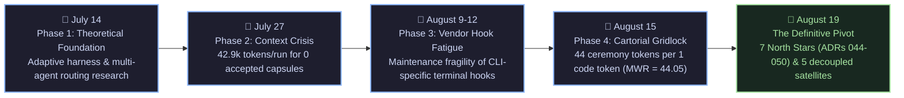
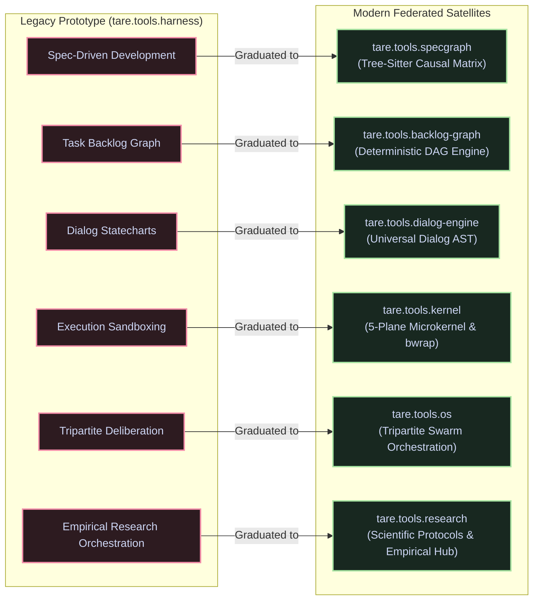
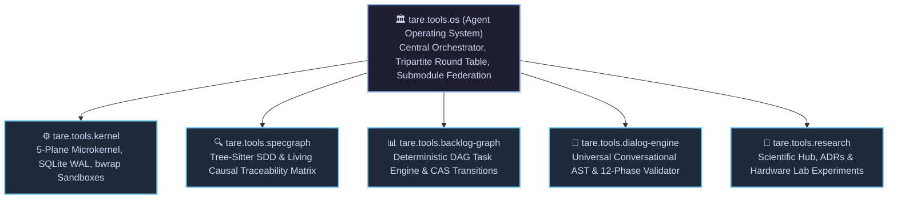

# tare.tools.harness (Legacy Prototype)

**Historical Monolithic Research Prototype for Multi-Agent Coding Swarms (July – August 2026).**

[-blue.svg)](https://github.com/augusto-scarvalho/tare.tools.os)

[-inactive.svg)](#why-the-monolith-was-deprecated)

  <a href="#archival-and-post-mortem-notice">Archival Notice</a> •
  <a href="#evolutionary-timeline">Evolution Timeline</a> •
  <a href="#why-the-monolith-was-deprecated">Post-Mortem & Failures</a> •
  <a href="#the-golden-heritage-what-was-reused-vs-retired">Golden Heritage Matrix</a> •
  <a href="#the-modern-federated-architecture">Successor Architecture</a> •
  <a href="#ecosystem-family">Ecosystem Family</a> •
  <a href="#license">License</a>

---

> [!WARNING]
> ### 🛑 ARCHIVAL & POST-MORTEM NOTICE
> **`tare.tools.harness` is formally frozen, deprecated, and preserved strictly for historical, forensic, and scientific research purposes.**
>
> All active development has migrated to the **decentralized, 5-plane federated Agent Operating System ([`tare.tools.os`](https://github.com/augusto-scarvalho/tare.tools.os))** governed by **ADR-044 through ADR-050**.

---

## Evolutionary Timeline

During July and August 2026, `tare.tools.harness` served as our testbed to validate multi-agent autonomous engineering pipelines (*Planner $\rightarrow$ Implementer $\rightarrow$ Auditor $\rightarrow$ Gatekeeper*). The lessons gathered across four intense development phases led directly to the modern federated Agent OS:

---

## Why the Monolith was Deprecated (Post-Mortem)

As documented in the comprehensive forensic audit ([`docs/POST_MORTEM_AND_ARCHITECTURAL_PIVOT.md`](docs/POST_MORTEM_AND_ARCHITECTURAL_PIVOT.md)), five systemic flaws made the monolithic harness unsustainable:

### 1. Chronic Context Bloat (42.9k tokens per run)
* **The Symptom:** Workers spent 90%+ of their LLM context window re-reading global digests, `AGENTS.md` manuals, and tool catalogs (~15k fixed tokens per boot) before receiving task instructions.
* **The Resolution:** Replaced by **surgical Context Envelopes (< 4,000 tokens)** generated on demand by [`tare.tools.specgraph`](https://github.com/augusto-scarvalho/tare.tools.specgraph).

### 2. The Vendor Hook Maintenance Trap (*Whack-a-Mole*)
* **The Symptom:** Intercepting LLM CLIs (Codex, Claude Code, Kimi) via regex monkeypatching broke on every vendor CLI update and leaked unneeded schemas into prompt contexts.
* **The Resolution:** Replaced by **Anti-Corruption Layers (ACL)** and process-isolated workers in [`tare.tools.kernel`](https://github.com/augusto-scarvalho/tare.tools.kernel).

### 3. Cartorial Hypertrophy & Governance Deadlocks (MWR = 44.05)
* **The Symptom:** Over-accumulated validation gates created a cartorial spiral where a 6-word markdown fix required an 8.6 KB permit, SHA-256 signatures, and 14 manual approval steps.
* **The Resolution:** Replaced by **bounded $O(1)$ Compare-And-Swap (CAS) transitions** in [`tare.tools.backlog-graph`](https://github.com/augusto-scarvalho/tare.tools.backlog-graph).

### 4. Filesystem Race Conditions without CAS
* **The Symptom:** Co-coordinating multiple agents via raw JSON files on shared disks caused lost updates, write collisions, and corrupted task states.
* **The Resolution:** Replaced by **SQLite 3 Write-Ahead Logging (WAL)** with `BEGIN IMMEDIATE` single-writer CAS concurrency.

### 5. Research & Engineering Domain Entanglement
* **The Symptom:** Exploratory research trials, benchmark rounds (CMRP, token audits), and runtime engineering code were co-located in the same monolith, creating confusion between disposable experimental probes and production software.
* **The Resolution:** Clear separation of concerns: engineering engines operate in focused satellites, while empirical research orchestration, experimental protocols, and knowledge curation live in [`tare.tools.research`](https://github.com/augusto-scarvalho/tare.tools.research).

---

## The Golden Heritage: What was Reused vs. Retired

No valuable engineering discovery was discarded. The brilliant concepts proven in the harness were extracted, hardened, and graduated into dedicated repositories:

---

## What was Retired

| Retired Anti-Pattern | Reason for Retirement | Modern Replacement |
|---|---|---|
| ❌ **186-Module Mega Monolith** | Context pollution and coupling | 5 focused satellite repositories federated by Git Submodules |
| ❌ **Vendor CLI Monkeypatching** | Fragile regex hooks breaking on CLI updates | Process isolation & ACL drivers in `tare.tools.kernel` |
| ❌ **Boot Prompt Stuffing (`AGENTS.md`)** | Instruction dilution & token waste | Surgical Context Envelopes (< 4k tokens) via `specgraph` |
| ❌ **Unsynchronized Shared JSON Files** | Lost updates and race conditions | SQLite 3 WAL CAS engine with `BEGIN IMMEDIATE` |
| ❌ **Infinite Cartorial Permit Loops** | High Meta-Work Ratio (MWR = 44.05) | Atomic $O(1)$ state transitions and 1-click landing |

---

## The Modern Federated Architecture

The modern architecture separates concerns into specialized, autonomous repositories coordinated by [`tare.tools.os`](https://github.com/augusto-scarvalho/tare.tools.os):

---

## Ecosystem Family

| Repository | Role | Technology | Status |
|---|---|---|---|
| **[`tare.tools.os`](https://github.com/augusto-scarvalho/tare.tools.os)** | Central Agent Operating System & Swarm Orchestrator | Python, AsyncIO, Submodules | 🟢 **ACTIVE** |
| **[`tare.tools.kernel`](https://github.com/augusto-scarvalho/tare.tools.kernel)** | 5-Plane Microkernel Runtime & Sandboxing | Python, SQLite WAL, bwrap | 🟢 **ACTIVE** |
| **[`tare.tools.specgraph`](https://github.com/augusto-scarvalho/tare.tools.specgraph)** | Spec-Driven Development & Causal Matrix | Python AST, Tree-Sitter, Schemas | 🟢 **ACTIVE** |
| **[`tare.tools.backlog-graph`](https://github.com/augusto-scarvalho/tare.tools.backlog-graph)** | Deterministic DAG Task Backlog Engine | Python (Pure Stdlib), CAS | 🟢 **ACTIVE** |
| **[`tare.tools.dialog-engine`](https://github.com/augusto-scarvalho/tare.tools.dialog-engine)** | Topological Interaction & AST Dialog Graphs | Python, Statecharts, orjson | 🟢 **ACTIVE** |
| **[`tare.tools.research`](https://github.com/augusto-scarvalho/tare.tools.research)** | Scientific Papers, ADRs & Knowledge Hub | Markdown, GitHub Pages, Jekyll | 🟢 **ACTIVE** |
| **[`tare.tools.harness`](https://github.com/augusto-scarvalho/tare.tools.harness)** | Monolithic Research Prototype (This Repo) | Python (Legacy Monolith) | 🔴 **FROZEN / ARCHIVED** |

---

## Documentation Archive

The full documentation archive and post-mortem analyses are organized under [`docs/`](docs/):
* **[`docs/POST_MORTEM_AND_ARCHITECTURAL_PIVOT.md`](docs/POST_MORTEM_AND_ARCHITECTURAL_PIVOT.md):** Complete forensic post-mortem and migration audit.
* **[`docs/INDEX.md`](docs/INDEX.md):** Master index of all historical research papers and architecture notes.
* **[`docs/HARNESS_ARCHITECTURE.md`](docs/HARNESS_ARCHITECTURE.md):** Legacy prototype architecture and layer diagrams.
* **[`docs/HARNESS_TECHNICAL_DEBT.md`](docs/HARNESS_TECHNICAL_DEBT.md):** Legacy technical debt registry.

---

## License

Licensed under the Apache License, Version 2.0. See [LICENSE](LICENSE) for details.
