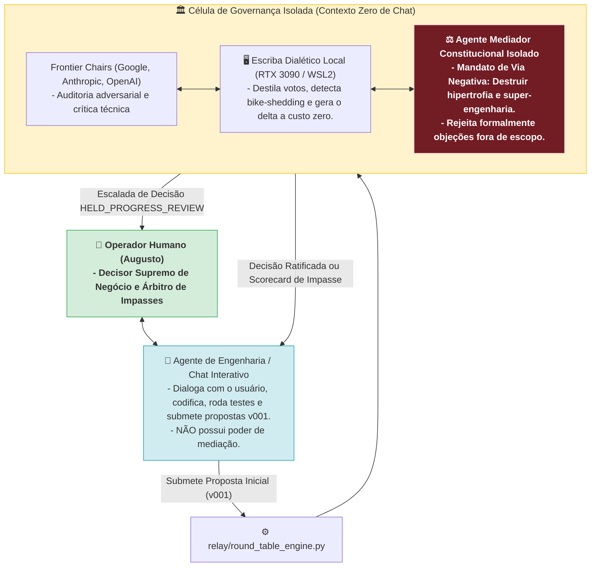
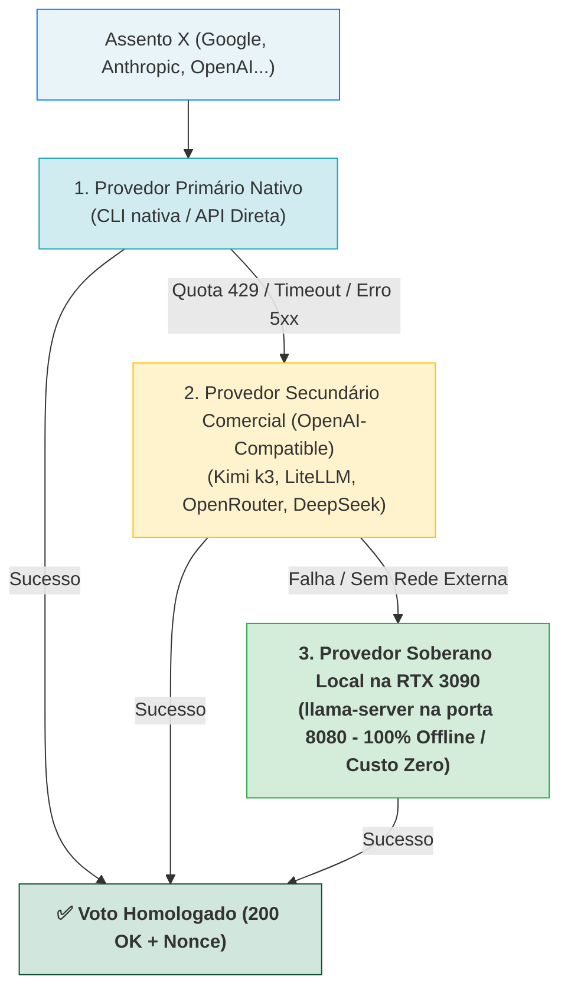

# RFC-001: Governança Frugal da Mesa Redonda — Separação de Poderes, Mediador Constitucional Isolado, Escriba Local em GPU e State Anchors

* **Status:** PROPOSED / RATIFICAÇÃO ESTRUTURAL PENDENTE
* **Data:** 2026-08-20
* **Autores:** Augusto & Antigravity Mediator
* **Domínio:** Governança Multi-Agente, Separação de Poderes, Economia de Contexto & Anti-Hipertrofia

---

* **Plano de Implementação:** [`RFC-001_IMPLEMENTATION_PLAN.md`](file:///C:/projects/tare.tools.library/docs/proposals/RFC-001_IMPLEMENTATION_PLAN.md)

## 1. Visão Geral e Motivação
A Mesa Redonda Tripartite (Google, Anthropic, OpenAI) é o mecanismo de consenso e auditoria de alto nível do ecossistema Tare. 

O incidente de 20 de Agosto de 2026 (51 rodadas consecutivas no caso `CASE-2026-08-20-TOOLING-PARADIGM-CLI-VS-MCP`) revelou três falhas arquiteturais graves no modelo de governança anterior:
1. **Conflito de Interesses e Contaminação de Contexto:** O agente conversacional do chat atuava simultaneamente como programador e mediador da deliberação, acumulando viés, pressa de entrega e complacência aditiva.
2. **Entropia de Contexto e Perda da Âncora Raiz:** O texto integral da proposta crescia exponencialmente a cada rodada, apagando a motivação original de negócio e fazendo os modelos debaterem microssistemas de arquivos em vez de estratégia de ferramentas.
3. **Ausência de Protocolo para Divergências Férteis:** Sem um mecanismo de fatiamento de escopo ou arbitragem humana, o sistema oscilava entre o loop infinito ou a rejeição cega.

Este RFC formaliza a **Arquitetura de Governança Frugal e Separação de Poderes**, reestruturando a Mesa Redonda em torno de 5 pilares inegociáveis.

---

## 2. A Separação dos Três Papéis (Checks and Balances)



| Papel | Entidade | Mandato e Responsabilidade | Contexto |
| :--- | :--- | :--- | :---: |
| **Operador / Árbitro Supremo** | Humano (Augusto) | Aprovação final de arquitetura e desempate de trade-offs de negócio. | Global |
| **Engenheiro / Proponente** | Agente de Chat (Antigravity) | Pair-programming, redação inicial, refatoração de código e execução de testes. | Sessão de Chat |
| **Juízes de Fronteira** | Gemini 3.7 Flash, Claude Fable 5 · high, Sol 5.6 | Auditoria técnica adversarial focada no delta da proposta. | Stateless / Isolado |
| **Escriba & Triador Local** | LLM Local na RTX 3090 (`http://100.107.245.30:8080`) | Destilação semântica dos votos, detecção de *bike-shedding* e geração do Dossiê a custo zero. | Stateless / GPU Local |
| **Mediador Constitucional** | Subagente Isolado de Governança | Aplicação implacável da *Via Negativa*, síntese dialética e veto de complexidade acidental. | Frio / Caso Único |

---

## 3. O Mandato do Mediador Constitucional Isolado

O Mediador Constitucional é invocado como um processo frio e isolado, sem acesso ao histórico do chat, munido do seguinte mandato:

> **System Prompt do Mediador Constitucional:**  
> *"Você é o Guardião Constitucional do ecossistema Tare. Seu papel NÃO é agradar os assentos de IA e NÃO é adicionar complexidade a cada crítica recebida.*  
> *1. Seu primeiro dever é proteger o sistema contra HIPERTROFIA TÉCNICA, BUROCRACIA CARTORIAL e SUPER-ENGENHARIA.*  
> *2. Toda vez que um assento levantar uma objeção que fuja do escopo nuclear ou invente abstrações desnecessárias para um script local, seu dever é REJEITAR a issue formalmente com base na VIA NEGATIVA.*  
> *3. Priorize sempre a solução mais enxuta, barata e pragmática (Frugalidade de Contexto).*  
> *4. Mantenha a proposta concisa, elegante e diretamente executável."*

---

## 4. O Protocolo de Contexto Frugal em 3 Camadas (State Anchors & Diff)

A partir da Rodada 2, nenhum assento recebe o texto integral da proposta repetido. O payload de auditoria é rigorosamente composto por:

### Camada 1: Âncora Imutável (Root Anchor - Imutável no Cabeçalho)
```markdown
## 🎯 OBJETIVO RAIZ & ESCOPO NUCLEAR (IMUTÁVEL):
- Pergunta Original: "Como evitar gastar tokens com MCP e priorizar a CLI?"
- Resultado Esperado: Definir a taxonomia de consumo de ferramentas.
- Via Negativa / Fora de Escopo: Implementações de baixo nível de SO, drivers e concorrência distribuída.
```

### Camada 2: Dossiê Dialético Estruturado (Gerado a Custo Zero pelo LLM Local)
```markdown
## 🏛️ ESTADO DIALÉTICO DA MESA REDONDA (RODADA 1 ➔ RODADA 2)
### 1. Consensos Estabelecidos (Preceitos Inegociáveis):
- Unanimidade (Google, Anthropic, OpenAI): CLI é zero-token; Fat MCP banido; Lean Gateway com 1 tool despachante.

### 2. Tensões e Síntese da Rodada Anterior:
- Tese OpenAI: Risco de explosão de memória em consultas massivas.
- Contra-Tese Google: Paginação complexa inflaciona schemas e gasta tokens.
- Síntese do Mediador: Adotado streaming interno com teto de 32KB sem alterar a interface pública da ferramenta.

### 3. Registro de Descarte por Via Negativa:
- Objeção Rejeitada: Pedido de driver customizado de Win32 descartado por estar fora do escopo.
```

### Camada 3: Delta de Seções com Ponteiro SHA-256
```markdown
### 🔄 Δ Alterações na Versão (v001#4a8e... ➔ v002#9f1c...):
- [Seção 3: Envelope Canônico] ➔ MODIFICADA: Adicionado campo "max_bytes": 32768.
- [Seção 4: Implementação] ➔ REDUZIDA: Removido código defensivo de kernel Win32.
```

---

## 5. Tratamento de Debates Férteis sem Convergência (`HELD_PROGRESS_REVIEW`)

Se a deliberação atingir o limite de 3 rodadas com discussões técnicas legítimas e relevantes em aberto (não caracterizadas como *bike-shedding*), o motor **congela a execução com segurança** no estado `HELD_PROGRESS_REVIEW` e emite o **Scorecard de Decisão de 1 Página** para o Operador Humano:

```markdown
# 🏛️ SCORECARD DE DIVERGÊNCIA FÉRTIL — CASO: CASE-XXX (RODADA 3)
* **Status:** HELD_PROGRESS_REVIEW
* **Consenso Consolidado (85% do Escopo):** Núcleo de API, storage e contratos aprovados por 3/3.
* **Divergência Remanescente (15%):**
  - Caminho A (Google/OpenAI): Concorrência leve com lock cooperativo.
  - Caminho B (Anthropic): Isolamento estrito por processo de SO.

### 🎯 OPÇÕES DO OPERADOR HUMANO:
1. Arbitrar Caminho A ou B e ratificar imediatamente.
2. Fatiar o Escopo: Aprovar o núcleo e abrir caso filho para o dilema de concorrência.
3. Conceder Overtime (+1 Rodada) com instrução diretiva de desempate.
```

---

## 6. Invariantes Mecânicos de Confiabilidade

1. **Hard Limit Inflexível ($N \le 3$):** Qualquer comando isolado (`conduct`, `run`) que tente ultrapassar 3 rodadas sem intervenção humana falha fechado com `HELD_NO_CONVERGENCE`.
2. **Preclusão de Issues Rejeitadas (Anti-Filibuster):** Issues descartadas pelo Mediador entram em `DISMISSED_CONCERNS`; tentativas de reabrí-las por um assento são automaticamente rebaixadas para `non-blocking`.
3. **Fail-Closed por Quorum:** Indisponibilidade de assento por rate limit congela imediatamente em `HELD_UNAVAILABLE`, proibindo loops cegos.
4. **Ancoragem nos Invariantes Anteriores:** Integração total com `RT-N1` (Normalização LF), `RT-N5` (Sentinel Nonce), `RT-N6` e `ADR-057` (Tríplice Verificação Criptográfica) e `RT-N8` (Via Negativa Obrigatória).

---

## 7. Hierarquia de Assentos em 3 Tiers e Soberania Local (Air-Gapped Mode)

Para garantir que a Mesa Redonda nunca trave por *rate-limit*, quota ou instabilidade de rede, o sistema adota uma **Hierarquia de Assentos em 3 Tiers**:

```mermaid
flowchart TD
    subgraph T1 [Tier 1: Assentos Titulares de Fronteira]
        G["Google Chair (Gemini 3.7)"]
        A["Anthropic Chair (Fable/Claude)"]
        O["OpenAI Chair (GPT 5.6 Sol)"]
    end

    subgraph T2 [Tier 2: Backup de Fronteira Comercial]
        K["Moonshot Chair (Kimi k3-256k)"]
    end

    subgraph T3 [Tier 3: Backup Soberano Local na RTX 3090 (Custo Zero)]
        L["Local GPU Chair (Qwen 3.8 / Qwen 3.6 / DeepSeek R1 Local)"]
    end

    A -.->|Rate Limit / 429| K
    K -.->|API Offline / Sem Quota| L
    G -.->|Timeout / Erro| L
    O -.->|Erro de Conexão| L

    style T1 fill:#e8f4f8,stroke:#007bff
    style T2 fill:#fff3cd,stroke:#ffc107
    style T3 fill:#d4edda,stroke:#28a745,font-weight:bold
```

### Estratégia dos Tiers:
1. **Tier 1 (Titulares de Fronteira):** Google, Anthropic, OpenAI para máxima diversidade de modelos.
2. **Tier 2 (Backup de Fronteira Comercial):** Moonshot Kimi k3 (`k3-256k`) com API direta HTTPS via token OAuth local.
3. **Tier 3 (Backup Soberano Local):** `Local GPU Chair` rodando na RTX 3090 (`http://100.107.245.30:8080`) com latência ultrabaixa e zero custo.
4. **Modo 100% Offline / Air-Gapped (`--offline`):** Instancia os 3 assentos na GPU local com personas antagônicas, permitindo deliberação soberana completa sem internet.

---

## 8. Pipeline Universal de Fallback e Driver OpenAI-Compatible

Nenhum mecanismo de failover é exclusivo de um fornecedor específico. Qualquer assento na Mesa Redonda (Google, Anthropic, OpenAI ou futuros) utiliza uma **Pipeline Universal de Provedores em Cascata**:



### Princípios do Driver Universal:
1. **Padrão `/v1/chat/completions`:** Todos os backends secundários e locais são consultados via REST JSON padrão com autenticação por Bearer Token e `Sentinel Nonce`.
2. **Simetria Completa:** O mesmo algoritmo de fallback atende Google, Anthropic e OpenAI de forma genérica.
3. **Resiliência Total:** Garante o quórum tripartite mesmo sob instabilidade severa de fornecedores externos.

---

## 9. Integração com o Keyring OS (Key Vault) e Ferramental de Código (Aider / LiteLLM)

Para eliminar credenciais em texto puro (`.env`) e garantir compatibilidade com as ferramentas de automação de código instaladas (`aider`, `litellm`), o motor resgata chaves diretamente do **Windows Credential Manager / Keyring OS** (`service: universal-agent-harness`):

### Provedores Homologados em Testes Reais:
1. **Google Gemini API (`GEMINI_API_KEY`):** Endpoint OpenAI-Compatible (`https://generativelanguage.googleapis.com/v1beta/openai`) com modelo `gemini-3.7-flash` (latência ~1.0s).
2. **NVIDIA NIM (`NVIDIA_API_KEY`):** Endpoint `https://integrate.api.nvidia.com/v1` com modelo `deepseek-ai/deepseek-v4-flash-0731` (latência ~4.5s).
3. **Moonshot AI (`kimi-code.json`):** Endpoint `https://api.kimi.com/coding/v1` com modelo `k3-256k` (latência ~14s).
4. **Local Mesh GPU (`node aaaaa`):** Endpoint `http://100.107.245.30:8080/v1` (RTX 3090 / 100% Offline).
5. **Headless Coding Harness (Aider):** Invocação validada via `aider --model ... --no-git --yes-always --exit` para execução de edições e revisões assistidas por IA.

---

---

## 10. Curadoria por Via Negativa da Auditoria Sol 5.6 (O que Entra vs. O que é Expurgo)

Submetemos o desenho ao crivo do **OpenAI Chair (GPT-5.6 Sol com raciocínio high)** e aplicamos a **Via Negativa** para separar o que é engenharia útil do que é delírio acadêmico de super-engenharia:

### 🟢 10.1. O que foi Adotado (Pragmático, Enxuto, $\le 10$ linhas de código):
1. **Tipificação Honesta do Quórum (`quorum_mode`):**
   - `FRONTIER_UNANIMOUS`: 3/3 modelos de fronteira comerciais (Google + Anthropic + OpenAI). Aprovação direta.
   - `DEGRADED_MIXED`: 2 titulares + 1 backup comercial (ex: Kimi k3). Válido com log de degradação.
   - `LOCAL_ADVISORY`: Deliberação executada localmente na GPU RTX 3090. Emite **`APPROVED_PENDING_HUMAN_RATIFICATION`** (exige um clique de aceite do operador humano).
2. **Votos Brutos como SSOT Imutável:** Os arquivos `rounds/r001/seat_*.json` são salvos como verdade primária. O Dossiê Dialético do LLM local atua como índice derivado de alta performance.
3. **Parser Consciente de Code Fences:** Parser simples que ignora `#` dentro de blocos de código com backticks.
4. **Preclusão Cirúrgica por Hash de Seção:** Apenas reabre uma issue rejeitada se a seção do markdown tiver sido modificada (`sha256(secao_nova) != sha256(secao_antiga)`).
5. **Teto de Transições ($T \le 12$):** Contador inteiro simples para abortar qualquer loop em retentativas de rede.

### 🚫 10.2. O que foi Rejeitado e Expurgo por Hipertrofia Técnica:
* ❌ **Rejeitado "Recibos Criptográficos com TLS Binding e PKI":** O `Sentinel Nonce` varrido no buffer já resolve 100% dos ataques práticos de injeção e eco. Não precisamos de cartório digital.
* ❌ **Rejeitado "Compare-and-Swap e Algoritmos Distribuídos de Concorrência":** Um simples `file_lock` exclusivo com `open(..., 'x')` é suficiente para execução local monousuário.
* ❌ **Rejeitado "Model Checking Formal TLA+ / Prova de Grafos":** Testes determinísticos em `pytest` cobrem os caminhos da FSM com total clareza.
* ❌ **Rejeitado "Tribunal de Apelação entre Modelos":** O Mediador arbitra pela Via Negativa; havendo impasse legítimo, escala direto para o Humano.

---

## 11. Filosofia BYOC (Bring Your Own Compute) e Flexibilidade de Hardware/Orçamento

A arquitetura do `tare.tools.relay` não impõe uma única fonte de computação. Ela adota o princípio de **BYOC (Bring Your Own Compute)**, permitindo que qualquer desenvolvedor adapte o sistema à sua realidade:

### Perfis Suportados de Computação:
1. **Créditos Comerciais de API:** Desenvolvedores que usam chaves pagas (OpenRouter, DeepSeek API, OpenAI, Anthropic, Groq) com máxima velocidade.
2. **Free Tiers em Nuvem (Zero Custo de Hardware/API):** Desenvolvedores em laptops leves ou CI/CD que usam as cotas gratuitas do Google Gemini e créditos NVIDIA NIM.
3. **Hardware Local Soberano:** Usuários com GPUs locais (RTX 3090, Mac Studio, Ollama, llama-server) para operação air-gapped e privacidade absoluta.
4. **Topologia Híbrida com Cascata Inteligente:** Uso prioritário do endpoint comercial preferido, com transição fluida para provedores secundários em caso de HTTP 429 / rate-limit.

### Provedor Secundário Homologado no NVIDIA NIM:
* **`z-ai/glm-5.2` (Zhipu AI):** Latência ~2.0s a 4.4s. É o **único modelo autorizado no NVIDIA NIM para a Mesa Redonda** devido à sua excepcional concisão técnica, consistência semântica e baixa verbosidade. Todos os outros modelos do catálogo NIM foram desqualificados para deliberação arquitetural por Via Negativa.

---

## 12. Capacidades de Tool Calling e Deep Reasoning nos Provedores Gratuitos

Testes empíricos ao vivo confirmaram que tanto o **Google Gemini Free Tier** quanto o **NVIDIA NIM** suportam integralmente as capacidades avançadas exigidas por subagentes autônomos e pela Mesa Redonda:

### 12.1. Tool Calling (Function Calling no Padrão OpenAI)
* **Google Gemini (`gemini-3.7-flash`):** Emite `tool_calls` perfeitamente estruturados em **1.21s** via endpoint OpenAI-compatible (`/v1beta/openai/chat/completions`).
* **NVIDIA NIM (`nvidia/llama-3.3-nemotron-super-49b-v1.5` & `z-ai/glm-5.2`):** Emitem `tool_calls` nativos com validação de tipagem em **5.6s a 9.9s**.
* **Impacto:** Permite que subagentes de pesquisa, git diff e execução headless (`aider`, `little_coder`) operem com custo zero de API.

### 12.2. Deep Reasoning (Thinking Tokens & CoT)
* **NVIDIA Nemotron Super 49b:** Emite o bloco `reasoning_content` contendo tokens reflexivos passo a passo antes da síntese final.
* **Google Gemini 3.7 Flash · high:** Executa o processo de *Thinking* nativo com alocação dinâmica de tokens de raciocínio, retornando em 2.5s a 5.5s.
* **Impacto:** Assentos de backup podem realizar auditoria adversarial profunda de concorrência e condições de corrida sem perder qualidade em relação aos modelos de fronteira pagos.

---

## 13. Matriz Normativa de Quórum e Persistência de Estado (Auditoria R2 Sol 5.6)

A 2ª rodada de auditoria formal refinou os invariantes de execução para garantir que a FSM seja 100% determinística mesmo após reinicializações de processo:

### 13.1. Matriz Determinística de Quórum (`quorum_mode`)
O modo de quórum é calculado diretamente a partir dos `provider_id` reais que emitiram voto com sucesso:
* **`FRONTIER_UNANIMOUS`:** Exatamente 3 provedores titulares de fronteira distintos (Google + Anthropic + OpenAI). Emite `APPROVED` autônomo.
* **`DEGRADED_MIXED`:** 2 provedores titulares distintos + 1 backup comercial independente (ex: Kimi k3 ou NIM GLM 5.2). Emite `APPROVED_WITH_BACKUP_ATTESTATION`.
* **`LOCAL_ADVISORY`:** Qualquer deliberação contendo assento local na GPU RTX 3090. Emite **`APPROVED_PENDING_HUMAN_RATIFICATION`** (exige confirmação explícita do operador).
* **`HELD_UNAVAILABLE`:** Menos de 2 assentos válidos após exaustão da cascata de fallbacks.

### 13.2. Persistência de Rodadas e Overtime em `case.json`
* O contador de rodadas (`round_count`), transições (`transition_count`) e o flag `overtime_granted: bool` são gravados em disco no `case.json` antes de cada chamada externa.
* Reiniciar o processo ou rodar `conduct` novamente não permite exceder $N=3$, a menos que o operador humano tenha explicitamente concedido `overtime_granted = true` (permitindo apenas $N=4$ como rodada final).

### 13.3. File Lock com Autocura de Processos Mortos (PID-Aware Lock)
* O arquivo `.lock` exclusivo grava `{"pid": os.getpid(), "timestamp": time.time()}`.
* Se um processo for interrompido abruptamente, uma nova execução verifica se o PID gravado ainda existe no SO. Se o processo já estiver morto, o lock órfão é limpo com segurança.

### 13.4. Escrita Atômica dos Votos (SSOT Protection)
* Votos brutos e atualizações de estado são gravados primeiramente em arquivo temporário (`.tmp`) no mesmo diretório e finalizados com `os.replace` atômico, eliminando qualquer risco de corrupção por queda de energia ou interrupção de processo.

---

## 14. Pinos Formais do Substrato Soberano Físico Local (Workstation aaaaa / RTX 3090)

Para garantir reprodutibilidade, segurança e ausência de viés em temas contenciosos, o ecossistema pina explicitamente três papéis para os modelos locais:

| Papel no Sistema | Modelo Local Pinado (`slop.cpp`) | Características Técnicas & Justificativa |
| :--- | :--- | :--- |
| **Deliberação Soberana Geral** (`PIN_LOCAL_SOVEREIGN_GENERAL`) | **`qwen38-27b.gguf` (Qwen 3.8)** | Nosso **melhor modelo local**, o mais fiel, denso e poderoso. Opera com máxima aderência a tipos e regras, ideal para emissão de pareceres do assento `LOCAL_ADVISORY`. |
| **Escriba de Compactação Dialética** (`PIN_LOCAL_COMPACTOR`) | **`qwen38-27b.gguf` (Qwen 3.8)** | Responsável pela **compactação e síntese em 3 pilares** (*Consensos*, *Tensões com Falsificadores* e *Descartes*). Sua fidelidade lógica impede que ele alucine consensos ou ignore objeções sutis. |
| **Cadeira de Red Team & Adversarial** (`PIN_LOCAL_RED_TEAM`) | **`qwen36-fable-tc.gguf` (Qwen 3.6 Fable TC)** | Especializado em **Red Teaming**, testes de estresse, segurança ofensiva e deliberação de tópicos difíceis/contenciosos onde modelos comerciais de nuvem recusam ou sofrem de alinhamento/censura suave. |
