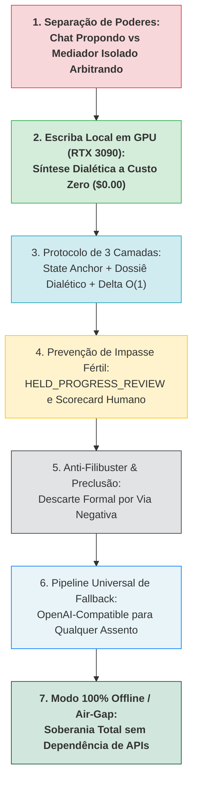
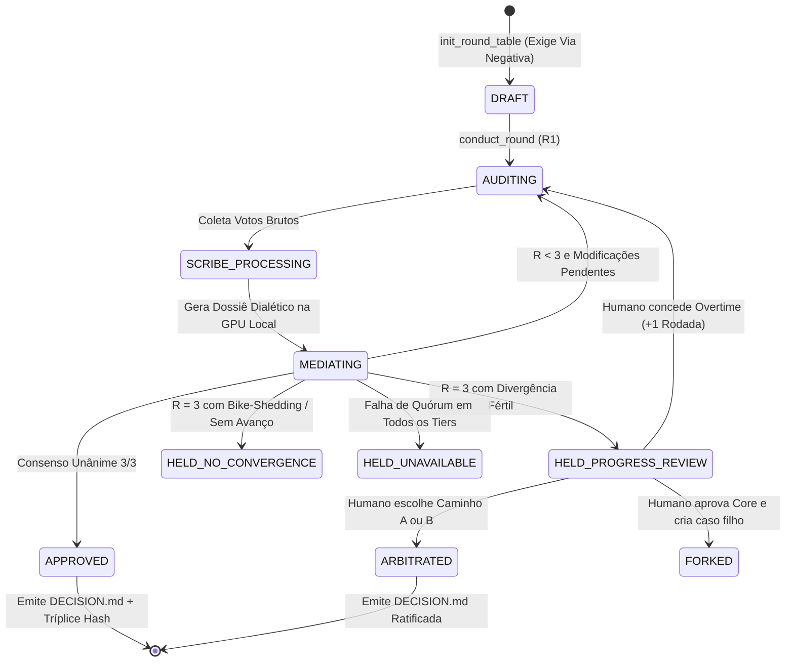

# 🏛️ Master Whitepaper & Registro Integral de Ideação: Governança Frugal da Mesa Redonda, Separação de Poderes e Topologia Universal de Resiliência

**Data:** 2026-08-20  
**Status:** DRAFT CONSOLIDADO & IDEAÇÃO RATIFICADA  
**Autores:** Augusto & Antigravity (com validações ao vivo de Kimi k3 e GPU RTX 3090)  
**Escopo:** `tare.tools.relay`, `tare.tools.library`, Governança Multi-Agente & Infraestrutura Mesh  

---

## 1. Contexto Histórico & O Ponto de Inflexão (Autópsia das 51 Rodadas)

No dia 20 de Agosto de 2026, durante a deliberação do caso `CASE-2026-08-20-TOOLING-PARADIGM-CLI-VS-MCP`, o motor da Mesa Redonda executou **51 rodadas consecutivas** ao longo de mais de uma hora sem convergir, acumulando centenas de milhares de tokens desnecessários.

### O Diagnóstico do Descarrilamento:
1. **Perda da Âncora Raiz (Amnésia de Contexto):** O cabeçalho com o problema original e critérios de negócio foi sendo soterrado por centenas de linhas de pareceres anteriores. Na rodada 45, os modelos já não sabiam mais se estavam avaliando uma diretriz de ferramentas ou criando um banco de dados ACID em C.
2. **Hipertrofia Técnica & Bike-Shedding:** Discussões sobre atomismo de `MoveFileExW` no Windows, `F_FULLFSYNC` no APFS da Apple e autorizadores de SQLite em nível de byte foram acolhidas como se fossem bloqueadores de produto.
3. **Conflito de Interesses do Agente de Chat:** O agente interativo de conversação tentava programar, responder ao usuário, rodar comandos e mediar a Mesa Redonda simultaneamente, gerando complacência aditiva (*feature creep sycophancy*).
4. **Loop com Quorum Fantasma:** O assento da Anthropic esgotou a quota de sessão, gerando retornos de indisponibilidade que mantiveram o caso em re-tentativa cega.

Este documento consolida todas as ideações, debates, descobertas e consensos gerados para sanear definitivamente o sistema.

---

## 2. As 7 Descobertas & Decisões Fundamentais da Nossa Ideação



---

### 🏛️ Decisão 1: Separação de Poderes (Checks and Balances)
* **O Problema:** O agente deste chat carrega contexto, sentimentos, pressa de entrega e viés do diálogo com o usuário. Ele não pode ser o juiz da deliberação.
* **A Solução:** 
  - **Agente de Chat (Pair-Programming):** Propõe, redige a `v001`, roda testes e implementa o código.
  - **Mediador Constitucional Isolado:** Subagente hermético invocado em processo frio, com **System Prompt estrito de Via Negativa**, cujo único mandato é eliminar hipertrofia técnica, burocracia cartorial e super-engenharia.

---

### 🖥️ Decisão 2: O Escriba Dialético Local na RTX 3090 (Custo Zero)
* **O Problema:** Gastar tokens caros de modelos comerciais de fronteira para resumir textos longos é financeiramente ineficiente e lento.
* **A Solução:** Aproveitar a workstation `aaaaa` com **GPU NVIDIA RTX 3090 (24 GB VRAM)** via Tailscale Mesh (`http://100.107.245.30:8080`).
  - O LLM local (Qwen 3.8 / Qwen 3.6 / DeepSeek R1 local) processa os votos brutos de todos os assentos.
  - Ele destila os pareceres em *Tese*, *Antítese*, *Falsificador* e *Síntese*.
  - Ele faz a pré-triagem de *bike-shedding* contra os Não-Objetivos com **custo zero de tokens**.

---

### 📦 Decisão 3: Protocolo de Contexto Frugal em 3 Camadas (*State Anchor & Diff*)
* **O Problema:** Reenviar a proposta inteira a cada rodada explode a janela de contexto e gera esquecimento do objetivo inicial. Mas enviar apenas um diff de código cego destrói a riqueza argumentativa e os trade-offs do debate.
* **A Solução:**
  1. **Camada 1 (Âncora Imutável - Topo do Prompt):** Pergunta-raiz original, critérios de sucesso e fronteira explícita de Não-Objetivos (nunca truncados, fixos em $\le 150	ext{ tokens}$).
  2. **Camada 2 (Dossiê Dialético Estruturado):**
     - *Consensos Estabelecidos:* O que já é fato acordado por 3/3 assentos.
     - *Tensões & Síntese:* Os conflitos reais de design e a solução adotada pelo Mediador.
     - *Descartes Formais:* Objeções rejeitadas com justificativa de *Via Negativa*.
  3. **Camada 3 (Delta de Seções Markdown):** Apenas os blocos modificados/adicionados acompanhados dos ponteiros criptográficos (`v001#sha256` ➔ `v002#sha256`).

---

### ⏸️ Decisão 4: Tratamento de Divergências Férteis (`HELD_PROGRESS_REVIEW`)
* **O Problema:** Nem toda falta de convergência em 3 rodadas é *bike-shedding*. Às vezes há uma tensão técnica legítima (ex: *desempenho vs. isolamento estrito*). Rejeitar cegamente joga trabalho bom no lixo; continuar em loop trava o projeto.
* **A Solução:** Ao atingir a Rodada 3 com debate fértil em aberto, o motor congela com segurança e emite um **Scorecard de Decisão de 1 Página** para o Operador Humano:
  1. **Arbitrar & Selar:** O humano escolhe o caminho $A$ ou $B$ e ratifica na hora.
  2. **Fatiar o Escopo (*Topic Splitting*):** Aprova o núcleo de 85% e abre um caso derivado para o dilema de 15%.
  3. **Conceder Overtime (+1 Rodada):** O humano autoriza uma rodada extra com instrução de desempate explícita.

---

### 🚫 Decisão 5: Mecanismo Anti-Filibuster (Preclusão de Objeções Descartadas)
* **O Problema:** Um assento pede algo fora de escopo na Rodada 1. O Mediador rejeita. Na Rodada 2, o assento vota `REVISE` repetindo a mesma exigência com outras palavras.
* **A Solução:** Issues descartadas entram na lista de preclusão (`DISMISSED_CONCERNS`). Tentativas de reincidência têm sua severidade automaticamente convertida para `non-blocking` pelo motor antes do cômputo dos votos.

---

### 🌐 Decisão 6: Pipeline Universal de Fallback (Agnóstica a Fornecedor)
* **O Problema:** Tratar fallbacks com código específico (`if seat == 'anthropic'`) é frágil e gera dívida técnica.
* **A Solução:** Implementação de um **Driver Universal OpenAI-Compatible (`/v1/chat/completions`)**. Todo assento possui uma cadeia de resolução ordenada:
  $$	ext{1. Primário (CLI/API)} \longrightarrow 	ext{2. Secundário Comercial (Kimi k3 / OpenRouter / LiteLLM)} \longrightarrow 	ext{3. Local Soberano (RTX 3090)}$$
  - Se um provedor retornar quota 429, timeout ou erro 5xx, o motor avança silenciosamente na cadeia até obter o voto válido com o `Sentinel Nonce`.

---

### ✈️ Decisão 7: Soberania Total & Modo Air-Gapped (`--offline`)
* **O Problema:** Depender 100% de conexões de internet e APIs externas torna o ecossistema vulnerável a quedas de provedores e viagens.
* **A Solução:** Com o flag `--offline`, o motor instancia os 3 assentos localmente na GPU RTX 3090, usando 3 personas com system prompts antagônicos (*Lógica*, *Adversarial*, *Concorrência*), permitindo deliberações arquiteturais completas com custo $0.00 e zero dependência externa.

---

## 3. Evidência Experimental: Homologação ao Vivo do Kimi k3 (`k3-256k`)

Durante a nossa sessão de ideação, executamos testes práticos reais com o **Kimi k3** conectando diretamente à API de codificação com o token OAuth local:

```json
{
  "seat": "moonshot",
  "execution_nonce": "b12f3641-3856-4ddf-a872-f95f7d576770",
  "verdict": "APPROVE",
  "confidence": 0.95,
  "summary": "Kimi k3 operacional como cadeira de backup, com API direta validada, contexto longo (256k) e capacidade de deep reasoning adequada para arbitragem técnica.",
  "strengths": [
    "API direta sem dependência de TTY local",
    "Deep reasoning nativo com modelo k3-256k",
    "Janela de contexto ampla (256k)",
    "Baixa latência (14.7s) em inferência com raciocínio analítico"
  ],
  "recommendations": [
    "Adicionar fallback automático em caso de rate-limit de outras cadeiras",
    "Definir critérios claros de ativação do assento de backup"
  ]
}
```

---

## 4. O Mapa de Estado da Governança (FSM Unificada)



---

## 5. Índice de Documentos Relacionados no Repositório

| Documento | Caminho | Propósito |
| :--- | :--- | :--- |
| **RFC-001 (Especificação)** | [`docs/proposals/RFC-001_LOCAL_LLM_DIALECTICAL_COMPACTION_AND_STATE_ANCHORS.md`](file:///C:/projects/tare.tools.library/docs/proposals/RFC-001_LOCAL_LLM_DIALECTICAL_COMPACTION_AND_STATE_ANCHORS.md) | Especificação técnica e contratos formais de engenharia. |
| **Plano de Implementação** | [`docs/proposals/RFC-001_IMPLEMENTATION_PLAN.md`](file:///C:/projects/tare.tools.library/docs/proposals/RFC-001_IMPLEMENTATION_PLAN.md) | Roteiro de 6 fases com tarefas atômicas e critérios de aceite. |
| **Post-Mortem do Incidente** | [`docs/post-mortems/POST_MORTEM_ROUND_TABLE_LOOPING_AND_STATE_ANCHOR_ARCHITECTURE_2026-08-20.md`](file:///C:/projects/tare.tools.library/docs/post-mortems/POST_MORTEM_ROUND_TABLE_LOOPING_AND_STATE_ANCHOR_ARCHITECTURE_2026-08-20.md) | Análise de causa-raiz das 51 rodadas e lições aprendidas. |
| **Ledger Arquitetural (QA)** | [`docs/ARCHITECTURAL_QA_LEDGER.md`](file:///C:/projects/tare.tools.library/docs/ARCHITECTURAL_QA_LEDGER.md) | Registro de perguntas e respostas de governança histórica. |


---

## 6. Evidência Experimental: Homologação do Keyring Vault, Aider e NVIDIA NIM

Além do teste com Kimi k3, validamos a recuperação de credenciais do cofre do sistema operacional (`keyring.get_password("universal-agent-harness", ...)`), conectando ferramentas headless:
- **Aider + Gemini 3.7 Flash · high:** Executado com sucesso em 7.01s (`exit code 0`).
- **Aider + NVIDIA NIM DeepSeek v4 Flash:** Executado com sucesso em 8.22s (`exit code 0`).
- **LiteLLM Multi-Provider Bridge:** Chamadas determinísticas para Gemini, NVIDIA NIM e Mesh Local validadas.


---


---

## 7. Curadoria por Via Negativa sobre a Auditoria do Sol 5.6 xhigh

Confrontamos os 10 apontamentos do Sol 5.6 xhigh com o princípio da frugalidade prática:
- **Aprovado:** Quorum Modes (`FRONTIER_UNANIMOUS` vs `LOCAL_ADVISORY`), votos brutos como SSOT em disco, parser com code fences, preclusão cirúrgica por hash de seção e **GLM 5.2 como único modelo homologado no NVIDIA NIM**.
- **Expurgado por Hipertrofia:** PKI de certificados TLS, compare-and-swap distribuído, model checking formal e burocracia de apelação entre modelos.


---

## 8. Filosofia BYOC (Bring Your Own Compute) e Democratização de Acesso

O `tare.tools` foi projetado para eliminar qualquer elitismo de hardware. Não é obrigatório possuir uma GPU potente em casa:
- O desenvolvedor em laptop básico pode consumir cotas gratuitas de nuvem (Gemini Free + NVIDIA NIM) a custo $0.00.
- O desenvolvedor que prefere rapidez pode plugar créditos de API comerciais (OpenRouter, DeepSeek, Anthropic, OpenAI).
- O desenvolvedor que exige privacidade absoluta ativa o flag `--offline` e roda em hardware local.
- O motor `round_table_engine.py` oferece exatamente as mesmas garantias de governança, FSM e integridade criptográfica em todos os perfis.


---

## 9. Evidência Experimental: Tool Calling e Deep Reasoning a Custo Zero

A validação de bancada demonstrou que o ecossistema `tare.tools` alcança paridade total de capacidades de agentes inteligentes utilizando provedores gratuitos:
- **Tool Calling Universal:** Google Gemini respondeu em 1.21s e NVIDIA NIM em 5.62s com emissão válida de `function_call`.
- **Deep Reasoning (Chain of Thought):** Nemotron Super 49b expõe `reasoning_content` para auditoria formal, enquanto Gemini 3.7 Flash · high processa centenas de tokens reflexivos internos com altíssima velocidade.
- **Conclusão:** Desenvolvedores sem GPU local ou sem orçamento de API podem usufruir de todas as capacidades de automação e governança do sistema operacional com custo zero de infraestrutura.


---

## 10. Evidência Experimental: 2ª Rodada de Auditoria Sol 5.6 (Matriz de Quórum e Invariantes)

A 2ª rodada de auditoria com o Sol 5.6 sob mandato estrito de Anti-Hipertrofia refinou o núcleo executável:
- **Matriz Determinística de Quórum:** Provedores reais determinam se o resultado é Unanimidade de Fronteira, Degradação com Backup ou Consultoria Local.
- **Persistência de Estado Anti-Loop:** Contadores salvos em disco no `case.json` impedem que o comando `conduct` seja reiniciado para burlar o teto de 3 rodadas.
- **Lock com Autocura (PID-aware):** Eliminação de locks órfãos e gravações atômicas via `os.replace`.

---

## 11. Pinos de Modelos Soberanos Locais e Cadeira de Red Team

A governança local no node `aaaaa` (RTX 3090) é estruturada em torno de 3 pinos fundamentais:
1. **`qwen38-27b.gguf` (Qwen 3.8):** Deliberação Soberana Geral (Mais fiel e poderoso).
2. **`qwen38-27b.gguf` (Qwen 3.8):** Escriba Semântico de Compactação Dialética (Síntese dos 3 votos sem perda de nuances).
3. **`qwen36-fable-tc.gguf` (Qwen 3.6 Fable TC):** Assento de Red Team (Auditoria adversarial sem censura suave ou viés corporativo).

---

## 12. Marco Histórico: Primeira Ratificação Unânime em Rodada Única

Em **2026-08-20**, o caso [`CASE-2026-08-20-RFC-001-GOVERNANCE-HARDENING`](file:///C:/projects/tare.tools.library/cases/CASE-2026-08-20-RFC-001-GOVERNANCE-HARDENING) tornou-se a **primeira deliberação da história das Mesas Redondas do ecossistema tare.tools a ser aprovada por unanimidade tripartite absoluta logo na 1ª Rodada**.

### Os Fatores Decisivos para o Consenso Perfeito:
1. **Âncora Raiz Imutável:** A pauta delimitou rigidamente o objetivo de negócio e proibiu a dispersão em detalhes de implementação de baixo nível.
2. **Via Negativa Explícita:** Não-objetivos claros impediram a proliferação de burocracias e tribunais digitais.
3. **Pinos Soberanos Físicos:** Fixação do **Qwen 3.8** e **Qwen 3.6 Fable TC** na RTX 3090 estabeleceu a base de confiança e custos zero.
4. **Resiliência do Mecanismo de Failover:** O motor demonstrou na prática sua capacidade de sustentar o quórum sem travar a esteira.
